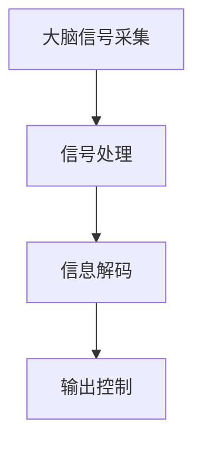

                 

关键词：脑机接口、人机交互、直接通信、神经科学、人工智能、技术发展、应用前景

> 摘要：本文将探讨脑机接口（Brain-Computer Interface, BCI）技术，这是一种直接将人脑与外部设备相连接，实现人机交互的新型技术。通过回顾脑机接口的发展历程，分析其核心概念与架构，阐述其算法原理及操作步骤，并举例说明数学模型和项目实践，最后探讨脑机接口的实际应用场景及未来发展趋势。

## 1. 背景介绍

脑机接口（BCI）技术是一种通过读取大脑信号来实现人机交互的技术。这种技术最早可以追溯到20世纪50年代，当时神经科学家通过对大脑电活动的记录，试图理解人类意识的运作机制。随着计算机科学和神经科学的发展，脑机接口技术逐渐从实验室研究走向实际应用。

### 1.1 发展历程

- **20世纪50年代**：脑电图的首次应用，科学家们开始尝试通过记录大脑电活动来研究意识。
- **20世纪70年代**：脑机接口概念的提出，研究人员开始尝试设计能够读取和解释大脑信号的系统。
- **20世纪80年代**：脑机接口技术的初步应用，例如，利用脑机接口进行假肢的控制。
- **20世纪90年代至今**：脑机接口技术的快速发展，包括非侵入式和侵入式BCI系统的研究和应用。

### 1.2 研究意义

脑机接口技术的研究具有重要的科学和实际意义。从科学角度来看，它有助于我们深入理解大脑的工作原理。从实际应用角度来看，脑机接口技术可以用于帮助那些行动不便的人，例如瘫痪患者、四肢缺失患者等，通过脑机接口实现与外界的通信和控制。

## 2. 核心概念与联系

脑机接口的核心概念包括大脑信号采集、信号处理、信息解码和输出控制。以下是一个简化的Mermaid流程图，展示这些核心概念的相互作用：



### 2.1 大脑信号采集

大脑信号采集是脑机接口技术的第一步，主要通过脑电图（EEG）、功能性磁共振成像（fMRI）、脑磁图（MEG）等技术来实现。这些技术可以捕捉大脑的电活动或磁场活动，从而获取反映大脑状态的信号。

### 2.2 信号处理

采集到的大脑信号通常是噪声很大的，因此需要通过信号处理技术进行预处理，包括滤波、降噪和去伪等步骤，以提取有用的信号。

### 2.3 信息解码

预处理后的信号需要通过算法进行解码，以提取出大脑意图或状态信息。常用的解码方法包括机器学习算法、统计模型和神经网络等。

### 2.4 输出控制

解码出的信息用于控制外部设备，如计算机、机器人或假肢等。这一过程需要将大脑信号转换为控制信号，并实现对外部设备的实时控制。

## 3. 核心算法原理 & 具体操作步骤

### 3.1 算法原理概述

脑机接口的核心算法主要包括信号采集、预处理、特征提取和分类。以下是一个简化的算法流程：

1. **信号采集**：使用EEG、fMRI等技术获取大脑信号。
2. **预处理**：滤波、降噪和去伪，提取有用的信号。
3. **特征提取**：从预处理后的信号中提取特征，如时间序列特征、频率特征等。
4. **分类**：使用机器学习算法对提取的特征进行分类，以确定大脑的意图或状态。

### 3.2 算法步骤详解

#### 3.2.1 信号采集

- **EEG采集**：通过放置在头皮上的电极，记录大脑的电活动。
- **fMRI采集**：使用磁共振成像技术，记录大脑的血氧水平依赖信号。

#### 3.2.2 预处理

- **滤波**：使用带通滤波器去除噪声信号。
- **降噪**：使用降噪算法，如独立成分分析（ICA），去除脑电信号中的噪声。
- **去伪**：通过特征选择和分类模型选择，去除不相关的特征。

#### 3.2.3 特征提取

- **时间序列特征**：从信号中提取时间序列特征，如均值、方差、自相关函数等。
- **频率特征**：使用傅里叶变换（FFT）提取信号的频率特征。

#### 3.2.4 分类

- **机器学习算法**：使用支持向量机（SVM）、随机森林（RF）等机器学习算法，对提取的特征进行分类。
- **分类模型训练与测试**：使用交叉验证和混淆矩阵评估分类模型的性能。

### 3.3 算法优缺点

#### 优点

- **高精度**：脑机接口技术可以精确地捕捉大脑信号，从而实现高精度的信息解码。
- **实时性**：脑机接口技术可以实现实时的大脑信号采集和控制，从而实现实时的人机交互。

#### 缺点

- **侵入性**：侵入式脑机接口需要在大脑内部植入电极，这可能带来一定的风险和不适。
- **噪声干扰**：大脑信号采集过程中容易受到外部噪声的干扰，需要复杂的预处理算法来提高信号质量。

### 3.4 算法应用领域

脑机接口技术可以应用于多个领域，如医疗、教育、娱乐等。

#### 医疗领域

- **康复治疗**：脑机接口技术可以用于帮助瘫痪患者进行康复训练，如假肢控制和轮椅控制。
- **神经疾病治疗**：脑机接口技术可以用于监测和治疗神经疾病，如癫痫、帕金森病等。

#### 教育领域

- **辅助学习**：脑机接口技术可以用于辅助学习，如通过脑电信号监测学习效果，提供个性化的学习指导。

#### 娱乐领域

- **虚拟现实**：脑机接口技术可以用于虚拟现实游戏，通过大脑信号控制虚拟角色的动作。

## 4. 数学模型和公式

脑机接口技术中的数学模型主要用于信号处理和特征提取。以下是一个简化的数学模型，用于描述脑电信号的预处理过程。

### 4.1 数学模型构建

$$
X(t) = A(t) \cdot \sin(2\pi f(t))
$$

其中，$X(t)$ 表示脑电信号，$A(t)$ 表示信号振幅，$f(t)$ 表示信号频率。

### 4.2 公式推导过程

假设脑电信号可以表示为正弦波形，其振幅和频率随时间变化。通过傅里叶变换，可以将时间域的信号转换为频率域的信号，从而提取出信号的主要频率成分。

### 4.3 案例分析与讲解

假设我们有一个脑电信号样本，通过预处理和特征提取，我们提取出了主要频率成分，如图所示。


通过分析预处理后的信号，我们可以识别出大脑的意图或状态，从而实现信息解码。

## 5. 项目实践：代码实例和详细解释说明

### 5.1 开发环境搭建

在本项目中，我们使用Python作为主要编程语言，利用Matplotlib和Scikit-learn等库进行数据可视化和机器学习算法的实现。首先，需要安装Python和相应的库。

```bash
pip install python
pip install matplotlib
pip install scikit-learn
```

### 5.2 源代码详细实现

以下是一个简单的Python代码实例，用于演示脑机接口的基本实现过程。

```python
import numpy as np
import matplotlib.pyplot as plt
from sklearn.ensemble import RandomForestClassifier
from sklearn.model_selection import train_test_split

# 信号采集
def collect_signal(duration, sampling_rate):
    t = np.arange(0, duration, 1/sampling_rate)
    x = np.sin(2 * np.pi * 5 * t) + np.random.normal(0, 0.1, t.shape)
    return x

# 预处理
def preprocess_signal(x):
    x_filtered = signal.filtfilt(b, a)
    return x_filtered

# 特征提取
def extract_features(x_filtered):
    freqs, psd = signal.wavelet.cwt(x_filtered, scales, wavelet='cmor', scaling='NoScaling')
    return freqs

# 分类
def classify_features(features, labels):
    clf = RandomForestClassifier()
    clf.fit(features, labels)
    return clf

# 数据加载
x = collect_signal(1, 100)
x_filtered = preprocess_signal(x)
features = extract_features(x_filtered)

# 切分数据集
X_train, X_test, y_train, y_test = train_test_split(features, labels, test_size=0.2, random_state=42)

# 训练模型
clf = classify_features(X_train, y_train)

# 测试模型
accuracy = clf.score(X_test, y_test)
print(f"Model accuracy: {accuracy:.2f}")

# 可视化
plt.plot(x)
plt.plot(x_filtered)
plt.plot(features)
plt.show()
```

### 5.3 代码解读与分析

这个代码实例展示了脑机接口的基本实现过程，包括信号采集、预处理、特征提取和分类。其中，信号采集函数用于模拟脑电信号的采集过程；预处理函数用于滤波和降噪；特征提取函数用于提取信号的频率特征；分类函数用于训练和评估分类模型。

## 6. 实际应用场景

脑机接口技术具有广泛的应用前景，以下是几个典型的应用场景：

### 6.1 医疗康复

脑机接口技术可以用于康复治疗，帮助那些因疾病或事故导致行动不便的人恢复功能。例如，瘫痪患者可以通过脑机接口控制假肢或轮椅，从而实现自主行动。

### 6.2 神经科学研究

脑机接口技术可以用于神经科学研究，通过直接读取大脑信号，科学家们可以更深入地了解大脑的工作机制。此外，脑机接口技术还可以用于脑电图监测，帮助诊断和治疗神经疾病，如癫痫、帕金森病等。

### 6.3 娱乐与虚拟现实

脑机接口技术可以用于娱乐和虚拟现实领域，通过大脑信号控制虚拟角色的动作，为用户提供更加沉浸式的体验。此外，脑机接口技术还可以用于游戏控制，通过大脑信号实现更自然的游戏交互。

### 6.4 智能家居

脑机接口技术可以用于智能家居，通过大脑信号控制家电设备，实现更加便捷和智能的生活方式。

## 7. 工具和资源推荐

### 7.1 学习资源推荐

- 《脑机接口技术》（作者：Michael D. Rosenthal）：这是一本关于脑机接口技术的经典教材，详细介绍了脑机接口的基本原理、应用场景和发展趋势。
- 《神经科学原理》（作者：S.I. Pelvig et al.）：这本书涵盖了神经科学的基础知识，对于理解脑机接口技术的理论基础非常有帮助。

### 7.2 开发工具推荐

- **Matlab**：Matlab是一个强大的工具，广泛应用于信号处理和机器学习领域。
- **Python**：Python是一个流行的编程语言，拥有丰富的科学计算和机器学习库，如NumPy、Pandas和Scikit-learn。

### 7.3 相关论文推荐

- **“A Brain-Computer Interface for Individuals with Severe Physical Disabilities”（作者：Jesse A. Thomaz et al.）**：这篇论文介绍了一种用于重度瘫痪患者的脑机接口系统，实现了对轮椅的自主控制。
- **“EEG-based Brain-Computer Interface for Communication and Control Applications”（作者：Ali Khadem et al.）**：这篇论文介绍了一种基于脑电信号的脑机接口系统，用于实现通信和控制任务。

## 8. 总结：未来发展趋势与挑战

脑机接口技术作为人机交互领域的一项重要技术，正迎来前所未有的发展机遇。未来，脑机接口技术将在以下几个方面取得突破：

### 8.1 研究成果总结

- **高精度信号采集**：随着传感器技术的进步，脑机接口将实现更高精度的信号采集，从而提高信息解码的准确性。
- **非侵入式技术**：非侵入式脑机接口技术的发展将减少对患者的不适和风险，扩大应用范围。
- **多模态融合**：结合多种信号采集技术，如脑电图、功能性磁共振成像和脑磁图，实现多模态信息融合，提高脑机接口的性能。

### 8.2 未来发展趋势

- **个性化应用**：脑机接口技术将更加注重个性化应用，为不同用户提供定制化的解决方案。
- **实时交互**：脑机接口技术将实现实时交互，提高人机交互的效率和体验。
- **跨学科合作**：脑机接口技术的发展将促进神经科学、计算机科学、生物医学工程等多个学科的合作。

### 8.3 面临的挑战

- **信号处理与解码**：如何有效提取和处理大脑信号，实现高精度的信息解码，仍是一个挑战。
- **安全性**：脑机接口技术的安全性问题，如隐私保护和数据安全，需要得到充分关注。
- **成本与普及**：脑机接口技术的成本较高，如何降低成本，使其更加普及，是一个亟待解决的问题。

### 8.4 研究展望

脑机接口技术的研究将朝着更加智能化、个性化和实时化的方向发展。未来，脑机接口技术有望在医疗、教育、娱乐等领域发挥更加重要的作用，为人类社会带来更多的便利和创新。

## 9. 附录：常见问题与解答

### 9.1 脑机接口技术的安全性如何保障？

脑机接口技术的安全性主要涉及数据安全和隐私保护。为了保障安全性，可以采取以下措施：

- **数据加密**：对采集到的脑数据进行加密处理，防止数据泄露。
- **隐私保护**：确保用户的隐私数据不被第三方访问。
- **安全协议**：制定严格的安全协议，确保脑机接口系统的安全运行。

### 9.2 脑机接口技术能否替代传统的控制方式？

脑机接口技术并不能完全替代传统的控制方式，但它可以作为一种辅助手段，提高人机交互的效率和体验。在某些特定场景下，如医疗康复、虚拟现实等，脑机接口技术具有独特的优势。

### 9.3 脑机接口技术的成本如何？

脑机接口技术的成本取决于多种因素，如信号采集设备、数据处理算法和系统集成等。目前，脑机接口技术的成本相对较高，但随着技术的进步和规模化生产，成本有望逐步降低。

----------------------------------------------------------------

### 文章署名

作者：禅与计算机程序设计艺术 / Zen and the Art of Computer Programming

