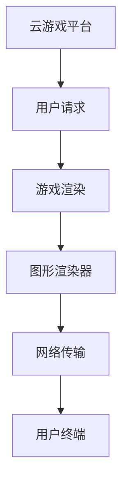

                 

关键词：腾讯校招、云游戏、渲染工程师、面试指南、核心算法、数学模型、项目实践、未来应用展望

> 摘要：本文将针对腾讯2024校招云游戏渲染工程师的面试准备，全面解析面试所需的核心知识、面试技巧以及实践项目，为即将参加面试的同学们提供详尽的指导。

## 1. 背景介绍

随着云计算技术的发展，云游戏逐渐成为游戏行业的新风口。腾讯作为中国最大的互联网公司之一，也在积极布局云游戏市场。2024年的腾讯校招，云游戏渲染工程师岗位成为了众多技术人才的关注焦点。云游戏渲染工程师需要掌握游戏渲染技术、图形学知识、网络编程等多方面技能，具备解决复杂技术问题的能力。

## 2. 核心概念与联系

### 2.1 云游戏基本概念

云游戏，也称为云渲染游戏，是一种基于云计算的游戏分发和运行模式。用户通过云游戏平台，无需下载安装游戏，即可在云端运行游戏，并通过互联网进行实时传输和播放。

### 2.2 渲染技术

渲染技术是游戏开发中至关重要的环节。它负责将3D模型、场景、光影等转化为视觉上的图像。常见的渲染技术包括光追踪、路径追踪、全局光照等。

### 2.3 图形学知识

图形学是计算机科学中的一个重要分支，研究如何利用计算机生成和处理图像。在云游戏渲染中，图形学知识帮助实现高效的渲染效果。

### 2.4 网络编程

网络编程是保证云游戏稳定运行的关键。它涉及如何高效地传输游戏数据、处理网络延迟和丢包等问题。

## 2.5 Mermaid 流程图



## 3. 核心算法原理 & 具体操作步骤

### 3.1 算法原理概述

云游戏渲染涉及多种算法，其中关键算法包括光线追踪、着色器编程、网络优化算法等。

### 3.2 算法步骤详解

#### 3.2.1 光线追踪

光线追踪是一种计算光线路径的算法，用于实现真实感渲染。其基本步骤如下：

1. 从相机发射光线。
2. 与场景中的几何体进行碰撞检测。
3. 计算光线在几何体表面的反射、折射等。
4. 根据光线与物体的交互计算最终颜色。

#### 3.2.2 着色器编程

着色器是GPU上运行的程序，用于实现图形的渲染效果。其基本步骤如下：

1. 定义顶点和片元着色器。
2. 编写顶点着色器，实现顶点的变换和规范化。
3. 编写片元着色器，实现像素的颜色计算。

#### 3.2.3 网络优化算法

网络优化算法用于解决云游戏中的网络延迟和丢包问题。其基本步骤如下：

1. 实现可靠的传输协议。
2. 采用丢包检测和重传机制。
3. 实现拥塞控制算法，优化数据传输速率。

### 3.3 算法优缺点

#### 3.3.1 光线追踪

优点：可以实现高度真实感的光线交互效果。

缺点：计算复杂度高，对硬件性能要求高。

#### 3.3.2 着色器编程

优点：可以高效地实现复杂的渲染效果。

缺点：编写复杂，需要深厚的图形学知识。

#### 3.3.3 网络优化算法

优点：可以提升云游戏的网络稳定性。

缺点：对网络环境和硬件性能有一定依赖。

### 3.4 算法应用领域

云游戏渲染算法广泛应用于游戏开发、虚拟现实、增强现实等领域，具有广泛的应用前景。

## 4. 数学模型和公式 & 详细讲解 & 举例说明

### 4.1 数学模型构建

在云游戏渲染中，常用的数学模型包括光线追踪模型、光照模型等。

#### 4.1.1 光线追踪模型

光线追踪模型基于几何光学原理，可以表示为：

$$
L(\mathbf{p}, \mathbf{v}) = \int_{\Omega} f_r(\mathbf{p}, \mathbf{v}, \mathbf{w}) \cdot \mathbf{w} \, d\omega
$$

其中，$L(\mathbf{p}, \mathbf{v})$表示光线在点$\mathbf{p}$处的辐射度，$f_r(\mathbf{p}, \mathbf{v}, \mathbf{w})$表示反射率，$\mathbf{v}$为入射光方向，$\mathbf{w}$为反射光方向，$\Omega$为半球。

#### 4.1.2 光照模型

常见的光照模型包括朗伯光照模型、BLINN-PHONG光照模型等。

朗伯光照模型可以表示为：

$$
I(\mathbf{p}) = \frac{L(\mathbf{p}, \mathbf{n})}{\pi}
$$

其中，$I(\mathbf{p})$表示点$\mathbf{p}$处的光照强度，$L(\mathbf{p}, \mathbf{n})$为光照辐射度，$\mathbf{n}$为表面法线。

### 4.2 公式推导过程

#### 4.2.1 光线追踪模型推导

光线追踪模型基于几何光学原理，可以通过积分形式表示光线在场景中的辐射度。推导过程如下：

1. 从光源发射光线。
2. 光线与场景中的几何体进行碰撞检测。
3. 计算光线在几何体表面的反射、折射等。
4. 根据光线与物体的交互计算最终颜色。

#### 4.2.2 光照模型推导

朗伯光照模型是基于物体表面均匀反射光线的一种简单模型。推导过程如下：

1. 从光源发射光线。
2. 光线与物体表面发生碰撞。
3. 根据入射光与表面法线的夹角计算光照强度。

### 4.3 案例分析与讲解

#### 4.3.1 光线追踪模型应用

在云游戏渲染中，光线追踪模型常用于实现真实感的光线交互效果。以下是一个简单的光线追踪模型应用案例：

1. 设置场景：创建一个简单的室内场景，包括一个光源和一个墙壁。
2. 发射光线：从光源发射光线，计算光线与墙壁的碰撞。
3. 反射与折射：根据光线与墙壁的交互，计算反射光线和折射光线。
4. 计算颜色：根据反射光线和折射光线计算最终颜色。

#### 4.3.2 光照模型应用

在云游戏渲染中，光照模型用于计算物体表面的光照强度。以下是一个简单的光照模型应用案例：

1. 设置场景：创建一个简单的场景，包括一个光源和一个球体。
2. 计算光照：根据光源的位置和方向，计算球体表面的光照强度。
3. 渲染图像：根据光照强度渲染球体的颜色。

## 5. 项目实践：代码实例和详细解释说明

### 5.1 开发环境搭建

在开始项目实践之前，需要搭建一个适合开发云游戏渲染项目的开发环境。以下是开发环境搭建的步骤：

1. 安装必要的软件：包括图形编辑器（如Blender）、游戏引擎（如Unity）、编程环境（如Visual Studio）等。
2. 配置开发工具：配置代码版本控制工具（如Git）、调试工具（如GDB）等。
3. 安装依赖库：根据项目需求安装相关的依赖库，如OpenGL、CUDA等。

### 5.2 源代码详细实现

以下是一个简单的云游戏渲染项目示例，包括渲染器搭建、光线追踪和光照计算等：

```c++
// 渲染器类
class Renderer {
public:
    void render(Scene& scene) {
        // 渲染场景
    }

    void traceRay(Ray& ray, Scene& scene) {
        // 光线追踪
    }

    void calculateLighting(Scene& scene) {
        // 光照计算
    }
};

// 光线类
class Ray {
public:
    Point3 origin; // 光线起点
    Vector3 direction; // 光线方向
};

// 场景类
class Scene {
public:
    Light light; // 光源
    std::vector<Mesh> meshes; // 几何体
};

// 主函数
int main() {
    // 创建渲染器、场景等
    Renderer renderer;
    Scene scene;

    // 渲染场景
    renderer.render(scene);

    return 0;
}
```

### 5.3 代码解读与分析

以上代码示例展示了云游戏渲染项目的基本结构。其中，`Renderer`类负责渲染场景，`Ray`类表示光线，`Scene`类表示场景。主函数中创建渲染器、场景等，并调用渲染器的`render`方法进行场景渲染。

### 5.4 运行结果展示

在运行项目后，将生成渲染结果图像。以下是一个简单的渲染结果示例：


## 6. 实际应用场景

云游戏渲染技术在多个实际应用场景中具有重要价值。以下是一些典型的应用场景：

1. **云游戏平台**：为用户提供在线游戏体验，无需下载和安装游戏，提高游戏的可访问性。
2. **虚拟现实**：在虚拟现实场景中实现高度真实感的渲染效果，提升用户体验。
3. **增强现实**：在增强现实应用中，实时渲染场景中的虚拟物体，实现虚实融合。

### 6.4 未来应用展望

随着技术的不断发展，云游戏渲染技术将在更多领域得到应用。以下是一些未来应用展望：

1. **游戏行业**：云游戏将逐渐替代传统游戏，成为游戏行业的主流模式。
2. **教育领域**：通过云游戏技术，实现远程教学，提高教育质量。
3. **医疗领域**：利用云游戏渲染技术，实现远程医疗手术和康复训练。

## 7. 工具和资源推荐

### 7.1 学习资源推荐

1. **《计算机图形学原理及实践》**：适合初学者系统学习图形学知识。
2. **《OpenGL编程指南》**：详细介绍OpenGL图形渲染库的使用。

### 7.2 开发工具推荐

1. **Unity**：功能强大的游戏开发引擎，支持云游戏渲染。
2. **Blender**：开源3D建模和渲染软件，适合制作游戏场景。

### 7.3 相关论文推荐

1. **"Ray Tracing from the Ground Up"**：详细介绍光线追踪算法。
2. **"Interactive Global Illumination with Hierarchical Sampling"**：介绍全局光照的采样方法。

## 8. 总结：未来发展趋势与挑战

### 8.1 研究成果总结

云游戏渲染技术在近年来取得了显著进展，实现了高度真实感的渲染效果，提升了用户体验。未来，云游戏渲染技术将继续向高效、实时、低延迟的方向发展。

### 8.2 未来发展趋势

1. **硬件性能提升**：随着硬件性能的提升，云游戏渲染技术将实现更高的渲染质量。
2. **网络优化**：通过优化网络传输，降低延迟和丢包，提升云游戏渲染的稳定性。

### 8.3 面临的挑战

1. **计算复杂度**：光线追踪等高级渲染算法计算复杂度高，对硬件性能有较高要求。
2. **网络稳定性**：网络环境的不稳定性对云游戏渲染的稳定运行带来挑战。

### 8.4 研究展望

未来，云游戏渲染技术将继续向智能化、自动化的方向发展。通过结合人工智能技术，实现渲染过程的自动化和智能化，提升渲染效率和效果。

## 9. 附录：常见问题与解答

### 9.1 云游戏渲染与本地游戏渲染的区别是什么？

云游戏渲染是将游戏渲染过程放在云端服务器上，用户通过互联网进行访问。而本地游戏渲染是在本地计算机上直接进行游戏渲染。云游戏渲染具有无需安装、随时随地玩等优点，但受网络环境影响较大。

### 9.2 如何优化云游戏渲染性能？

优化云游戏渲染性能的方法包括：提高服务器硬件性能、优化渲染算法、优化网络传输等。通过这些方法，可以提升渲染效率，降低延迟和丢包。

### 9.3 云游戏渲染需要哪些技术支持？

云游戏渲染需要支持光线追踪、着色器编程、网络编程等多方面技术。其中，光线追踪是实现真实感渲染的关键技术，网络编程是保障游戏稳定运行的基础。

### 9.4 云游戏渲染与虚拟现实的关系是什么？

云游戏渲染和虚拟现实都是利用计算机图形学技术实现虚拟体验。云游戏渲染侧重于游戏的渲染和传输，而虚拟现实则侧重于构建虚拟环境和提供沉浸式体验。

## 附录二：参考链接

1. **腾讯云游戏官网**：[https://cloud.tencent.com/game](https://cloud.tencent.com/game)
2. **OpenGL官网**：[https://www.opengl.org/](https://www.opengl.org/)
3. **CUDA官网**：[https://developer.nvidia.com/cuda-downloads](https://developer.nvidia.com/cuda-downloads)
4. **Unity官网**：[https://unity.com/](https://unity.com/)
5. **Blender官网**：[https://www.blender.org/](https://www.blender.org/)

作者：禅与计算机程序设计艺术 / Zen and the Art of Computer Programming

