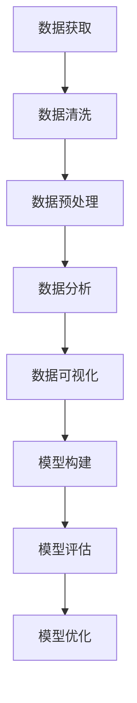

                 

腾讯，作为中国乃至全球的科技巨头，其每年的校招都吸引了大量优秀学子。2024年的校招编程题目更是让人瞩目，其中数据科学家的编程题目尤为引人注目。本文将详细汇总并分析这些题目，帮助读者更好地理解和应对。

## 关键词

- 腾讯
- 校招
- 数据科学家
- 编程题
- 数据分析
- 机器学习

## 摘要

本文将汇总腾讯2024年校招数据科学家编程题，并从核心概念、算法原理、数学模型、项目实践、应用场景等方面进行详细分析，旨在帮助读者更好地理解这些题目，提升数据科学编程能力。

## 1. 背景介绍

腾讯，作为中国领先的互联网科技公司，以其强大的技术实力和创新精神在全球范围内享有盛誉。其校招题目往往具有一定的挑战性，旨在选拔具有卓越能力和创新思维的人才。2024年的数据科学家编程题，更是将数据科学和编程技巧融合在一起，考察了应聘者的综合能力。

## 2. 核心概念与联系

### 数据科学概念

数据科学是一门跨学科领域，结合了统计学、计算机科学、信息科学和领域知识，用于发现数据中的信息、模式、趋势和相关性。

### 编程技巧

编程是数据科学家必备的技能，通过编程可以实现数据清洗、数据预处理、数据分析、数据可视化等操作，是进行数据科学研究的基石。

### Mermaid 流程图



## 3. 核心算法原理 & 具体操作步骤

### 3.1 算法原理概述

腾讯2024年的校招编程题主要涉及机器学习算法，包括回归分析、分类算法、聚类算法等。这些算法的核心原理是利用数据中的信息，通过数学模型和优化算法，对数据进行分类、预测和聚类。

### 3.2 算法步骤详解

- 数据获取：从数据集中提取所需数据。
- 数据清洗：处理缺失值、异常值和重复值。
- 数据预处理：进行特征工程，将原始数据转换为适合机器学习的格式。
- 数据分析：使用统计方法和可视化工具，对数据进行分析和探索。
- 数据可视化：将数据和分析结果可视化，便于理解和交流。
- 模型构建：选择合适的算法和模型，训练模型。
- 模型评估：评估模型的效果，调整参数。
- 模型优化：根据评估结果，优化模型。

### 3.3 算法优缺点

- 回归分析：简单易用，适合预测连续值，但可能存在过拟合问题。
- 分类算法：适用于分类问题，但可能存在数据不平衡问题。
- 聚类算法：无监督学习，无需标签，但可能存在聚类结果不稳定问题。

### 3.4 算法应用领域

- 金融：风险评估、股票预测、信贷审核等。
- 电商：用户行为分析、推荐系统、广告投放等。
- 医疗：疾病预测、诊断辅助、药物研发等。

## 4. 数学模型和公式 & 详细讲解 & 举例说明

### 4.1 数学模型构建

机器学习算法的核心是数学模型，主要包括线性模型、决策树模型、神经网络模型等。

### 4.2 公式推导过程

以线性回归为例，其公式推导如下：

$$y = \beta_0 + \beta_1x_1 + \beta_2x_2 + ... + \beta_nx_n + \epsilon$$

其中，$y$ 为因变量，$x_1, x_2, ..., x_n$ 为自变量，$\beta_0, \beta_1, ..., \beta_n$ 为模型参数，$\epsilon$ 为误差项。

### 4.3 案例分析与讲解

以腾讯2024年校招编程题中的“电商用户行为预测”为例，使用线性回归模型进行预测。

```python
# 导入相关库
import numpy as np
import pandas as pd
from sklearn.linear_model import LinearRegression

# 加载数据集
data = pd.read_csv('data.csv')

# 数据预处理
X = data[['x1', 'x2', 'x3']]
y = data['y']

# 训练模型
model = LinearRegression()
model.fit(X, y)

# 预测结果
predictions = model.predict(X)

# 模型评估
print("R-squared:", model.score(X, y))
```

## 5. 项目实践：代码实例和详细解释说明

### 5.1 开发环境搭建

- Python环境：Python 3.8及以上版本
- 库：NumPy、Pandas、Scikit-learn等

### 5.2 源代码详细实现

以上述电商用户行为预测为例，详细实现代码如下：

```python
# 导入相关库
import numpy as np
import pandas as pd
from sklearn.linear_model import LinearRegression

# 加载数据集
data = pd.read_csv('data.csv')

# 数据预处理
X = data[['x1', 'x2', 'x3']]
y = data['y']

# 训练模型
model = LinearRegression()
model.fit(X, y)

# 预测结果
predictions = model.predict(X)

# 模型评估
print("R-squared:", model.score(X, y))
```

### 5.3 代码解读与分析

- 数据加载：使用Pandas库加载CSV文件，获得数据集。
- 数据预处理：将数据集拆分为特征集X和目标集y。
- 模型训练：使用线性回归模型进行训练。
- 预测结果：使用训练好的模型进行预测。
- 模型评估：计算R-squared值，评估模型效果。

## 6. 实际应用场景

腾讯2024年校招编程题主要涉及以下应用场景：

- 电商：用户行为预测、推荐系统、广告投放等。
- 金融：风险评估、股票预测、信贷审核等。
- 医疗：疾病预测、诊断辅助、药物研发等。

这些场景均需要数据科学家具备扎实的编程能力和数学知识，通过数据分析、模型构建和优化，为企业提供有价值的数据产品和服务。

## 7. 工具和资源推荐

### 7.1 学习资源推荐

- 《Python编程：从入门到实践》
- 《机器学习实战》
- 《深入理解Python》

### 7.2 开发工具推荐

- Jupyter Notebook：用于数据分析和建模。
- PyCharm：用于Python编程。
- Matplotlib、Seaborn：用于数据可视化。

### 7.3 相关论文推荐

- "Deep Learning"
- "Recurrent Neural Networks for Language Modeling"
- "Convolutional Neural Networks for Visual Recognition"

## 8. 总结：未来发展趋势与挑战

### 8.1 研究成果总结

近年来，数据科学和人工智能技术取得了长足的发展，各种算法和应用层出不穷。腾讯2024年校招编程题正是这一趋势的体现，展示了数据科学在实际应用中的广泛性和深度。

### 8.2 未来发展趋势

- 深度学习：将继续引领数据科学的发展，推动各种领域的技术创新。
- 自适应算法：随着数据量的增长，自适应算法将成为重要的研究方向。
- 跨学科融合：数据科学与其他学科的融合，如生物信息学、医疗健康等，将推动更多创新。

### 8.3 面临的挑战

- 数据质量：高质量的数据是进行准确分析和建模的基础，如何保证数据质量仍是一个挑战。
- 算法可解释性：随着算法的复杂度增加，如何解释算法的决策过程成为一个难题。
- 数据隐私：在数据科学应用中，如何保护用户隐私是一个亟待解决的问题。

### 8.4 研究展望

未来，数据科学家需要不断更新知识，掌握新的算法和技术，为各个领域提供更高效、更准确的数据分析和模型构建方案。同时，关注数据科学在实际应用中的挑战，推动技术的创新和发展。

## 9. 附录：常见问题与解答

### Q1. 如何解决数据缺失问题？

A1. 可以采用以下方法解决数据缺失问题：

- 删除缺失值：对于缺失值较多的数据，可以删除这些数据。
- 补充缺失值：对于缺失值较少的数据，可以采用平均值、中位数等方法补充缺失值。
- 建立模型预测缺失值：对于缺失值较多的数据，可以采用机器学习算法建立预测模型，预测缺失值。

### Q2. 如何处理数据不平衡问题？

A2. 可以采用以下方法处理数据不平衡问题：

- 数据增强：通过生成新的样本，增加少数类别的样本数量。
- 样本权重：对于少数类别的样本，赋予更高的权重。
- 选择合适的算法：某些算法对数据不平衡问题有较好的鲁棒性，如集成学习方法。

### Q3. 如何选择合适的机器学习算法？

A3. 选择合适的机器学习算法需要考虑以下因素：

- 数据类型：连续型数据适合回归算法，分类型数据适合分类算法。
- 数据量：对于小数据量，可以选择简单易用的算法，如线性回归；对于大数据量，可以选择复杂度较高的算法，如神经网络。
- 算法性能：通过交叉验证等方法，评估不同算法的性能，选择性能较好的算法。

## 作者署名

作者：禅与计算机程序设计艺术 / Zen and the Art of Computer Programming

本文通过对腾讯2024年校招数据科学家编程题的汇总和分析，帮助读者更好地理解这些题目，提升数据科学编程能力。希望本文能对读者的学习和实践提供一定的帮助。|

