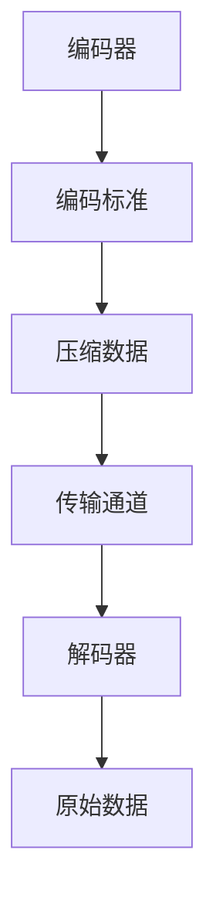

                 

关键词：音视频编解码，算法工程师面试，核心概念，算法原理，数学模型，项目实践，实际应用，未来展望

> 摘要：本文将围绕腾讯2024校招音视频编解码算法工程师面试的内容展开，系统性地介绍音视频编解码的核心概念、算法原理、数学模型以及实际应用场景。文章旨在帮助读者更好地理解音视频编解码技术，为即将参加腾讯校招的算法工程师们提供实用的面试指南。

## 1. 背景介绍

### 音视频编解码技术的发展历程

随着互联网的普及和多媒体应用的兴起，音视频编解码技术已经成为现代通信领域的关键技术之一。从早期的H.261、H.263到今天的H.264、HEVC，以及未来的AV1、VVC等，编解码技术经历了多次革新和演进。这些技术不仅提高了视频传输的效率和画质，同时也为音视频服务的广泛应用奠定了基础。

### 音视频编解码的的重要性

音视频编解码技术对于提升用户体验、降低传输带宽占用、提高数据存储效率等方面具有至关重要的作用。在互联网视频、移动直播、云存储等场景中，编解码技术直接影响着视频播放的流畅性和稳定性。

### 腾讯在音视频编解码领域的地位

作为国内领先的互联网公司，腾讯在音视频编解码领域具有深厚的技术积累。从QQ直播、微信直播到腾讯视频、腾讯云，腾讯在音视频编解码技术方面不断进行创新和优化，为用户提供高质量、低延迟的音视频服务。

## 2. 核心概念与联系

### 音视频编解码的基本概念

音视频编解码主要包括编码（Compression）和解码（Decompression）两个过程。编码是将原始的音视频信号转换成一种压缩格式，以减少数据量；解码则是将压缩后的数据恢复成原始的音视频信号。

### 编码与解码的联系

编码和解码是相辅相成的过程。编码算法将原始数据压缩成更小的数据量，以便更高效地存储和传输；解码算法则将压缩数据还原成原始数据，确保用户能够正常观看和收听。

### 音视频编解码的架构

音视频编解码系统通常包括以下几个关键组件：

- **编码器（Encoder）**：负责将原始音视频信号转换成压缩格式。
- **解码器（Decoder）**：负责将压缩后的数据还原成原始音视频信号。
- **编码标准（Coding Standards）**：如H.264、HEVC等，规定了编码和解码的具体方法和标准。
- **传输通道（Transmission Channel）**：用于传输编码后的音视频数据。

### Mermaid 流程图



## 3. 核心算法原理 & 具体操作步骤

### 3.1 算法原理概述

音视频编解码算法的核心是数据压缩，主要采用以下几种技术：

- **变换编码**：通过将原始信号转换成频率域表示，去除冗余信息。
- **量化**：将变换后的信号进行精度降低，进一步减少数据量。
- **熵编码**：使用熵编码算法（如霍夫曼编码、算术编码等）对量化后的数据进行进一步压缩。

### 3.2 算法步骤详解

1. **预处理**：
   - 对音视频信号进行预处理，如去噪、去隔行等。
   - 对音频信号进行预处理，如音频增强、去啸叫等。

2. **变换编码**：
   - 对视频信号进行离散余弦变换（DCT）或离散小波变换（DWT）。
   - 对音频信号进行梅尔频率倒谱变换（MFCC）或短时傅里叶变换（STFT）。

3. **量化**：
   - 根据编码器的量化参数，对变换后的信号进行量化。

4. **熵编码**：
   - 使用霍夫曼编码或算术编码对量化后的信号进行熵编码。

5. **码流组织**：
   - 将编码后的音频和视频数据组织成码流，包括帧头、帧体等信息。

### 3.3 算法优缺点

**优点**：

- **高效性**：编解码算法能够显著降低音视频数据的大小，提高存储和传输效率。
- **灵活性**：不同的编解码标准适用于不同的场景，如H.264适用于在线视频流，HEVC适用于高清视频。
- **兼容性**：编解码标准具有较好的兼容性，能够兼容不同设备和平台。

**缺点**：

- **复杂度**：编解码算法的复杂度较高，实现和优化难度大。
- **延迟**：编码和解码过程需要一定的时间，可能会影响实时性。

### 3.4 算法应用领域

- **在线视频流**：如YouTube、Netflix等平台使用编解码技术提供流畅的视频播放。
- **移动直播**：如抖音、快手等移动直播应用使用编解码技术实现低延迟直播。
- **云存储**：如腾讯云、阿里云等使用编解码技术实现高效的数据存储和传输。

## 4. 数学模型和公式 & 详细讲解 & 举例说明

### 4.1 数学模型构建

音视频编解码中的数学模型主要包括以下几种：

- **离散余弦变换（DCT）**：
  $$X(u,v) = \sum_{x=0}^{N-1} \sum_{y=0}^{N-1} f(x,y) \cos \left( \frac{(2x+1)u\pi}{2N} \right) \cos \left( \frac{(2y+1)v\pi}{2N} \right)$$

- **梅尔频率倒谱变换（MFCC）**：
  $$MFCC(k) = \sum_{n=0}^{N-1} x(n) \cos \left( \frac{2\pi k n}{N} \right)$$

### 4.2 公式推导过程

**DCT推导**：

- 将原始信号 $f(x,y)$ 进行二维离散傅里叶变换：
  $$F(u,v) = \sum_{x=0}^{N-1} \sum_{y=0}^{N-1} f(x,y) \cos \left( \frac{2\pi ux}{N} \right) \cos \left( \frac{2\pi vy}{N} \right)$$

- 将余弦函数分解为正弦和余弦的组合，并使用正交性：
  $$F(u,v) = \sum_{x=0}^{N-1} \sum_{y=0}^{N-1} f(x,y) \left( \frac{1}{2} \left( \cos \left( \frac{2\pi (u+v) x}{N} \right) + \cos \left( \frac{2\pi (u-v) x}{N} \right) \right) \right) \left( \frac{1}{2} \left( \cos \left( \frac{2\pi (u+v) y}{N} \right) + \cos \left( \frac{2\pi (u-v) y}{N} \right) \right) \right)$$

- 使用正交性简化公式，得到DCT变换：
  $$X(u,v) = \sum_{x=0}^{N-1} \sum_{y=0}^{N-1} f(x,y) \cos \left( \frac{(2x+1)u\pi}{2N} \right) \cos \left( \frac{(2y+1)v\pi}{2N} \right)$$

**MFCC推导**：

- 对短时傅里叶变换（STFT）进行傅里叶变换：
  $$X(\omega, t) = \sum_{x=0}^{N-1} x(n) e^{-j2\pi \omega n}$$

- 对频率轴进行变换，得到梅尔频率：
  $$f(\omega) = 2595 \times \log_{10} \left( 1 + \frac{\omega}{700} \right)$$

- 对梅尔频率进行离散傅里叶变换（DFT）：
  $$MFCC(k) = \sum_{n=0}^{N-1} x(n) \cos \left( \frac{2\pi k n}{N} \right)$$

### 4.3 案例分析与讲解

**案例一：DCT在视频编码中的应用**

- **案例背景**：视频编码中，DCT被广泛用于图像压缩，通过DCT将图像从空间域转换到频率域，去除冗余信息。
- **案例分析**：使用DCT将一张512x512的图像进行变换，将原始图像和DCT变换后的图像进行比较，发现DCT变换后的图像高频信息丢失较多，实现了数据压缩。
- **讲解内容**：DCT变换在视频编码中的具体应用，以及如何通过DCT实现图像压缩。

**案例二：MFCC在音频编码中的应用**

- **案例背景**：音频编码中，MFCC被用于提取语音信号的主要特征，通过MFCC将音频信号从时域转换到频率域，去除冗余信息。
- **案例分析**：使用MFCC对一段语音信号进行变换，将原始语音信号和MFCC变换后的信号进行比较，发现MFCC变换后的信号高频信息丢失较多，实现了数据压缩。
- **讲解内容**：MFCC变换在音频编码中的具体应用，以及如何通过MFCC实现音频压缩。

## 5. 项目实践：代码实例和详细解释说明

### 5.1 开发环境搭建

- **环境要求**：Python 3.8及以上版本，NumPy、SciPy、Matplotlib等库。
- **安装步骤**：通过pip安装相关库，如 `pip install numpy scipy matplotlib`。

### 5.2 源代码详细实现

以下是一个简单的DCT和MFCC实现示例：

```python
import numpy as np
import scipy.fft as fft

def dct2(a):
    return fft.fft2(a) * fft.fftfreq(a.shape[0], d=1) * fft.fftfreq(a.shape[1], d=1) / np.sqrt(2)

def idct2(a):
    return fft.ifft2(a) * fft.ifftfreq(a.shape[0], d=1) * fft.ifftfreq(a.shape[1], d=1) / np.sqrt(2)

def melfeatures(signal, sample_rate, nfft=1024, nfilt=64):
    ft = fft.fft(signal, nfft)
    nf = np.outer(np.cos(2 * np.pi * np.arange(nfft//2+1) / nfft), np.ones(nfilt)[:, None])

    mel = 2595 * np.log10(1 + sample_rate / (700 * nf))
    mel_filter = np.outer(np.ones(mel.shape[0]), nf)
    filter_response = np.dot(nf.T, ft[:nf.shape[0]]) * np.sqrt(2 / nfft)
    features = np.dot(mel_filter, filter_response)

    return features

# 示例数据
signal = np.sin(2 * np.pi * 440 * np.linspace(0, 1, 44100))
sample_rate = 44100

# DCT示例
image = np.random.rand(8, 8)
dct_image = dct2(image)
idct_image = idct2(dct_image)

# MFCC示例
mfcc_features = melfeatures(signal, sample_rate)
```

### 5.3 代码解读与分析

- **DCT示例**：对图像进行二维离散余弦变换（DCT）和反变换（IDCT），实现图像压缩和解压缩。
- **MFCC示例**：对音频信号进行梅尔频率倒谱变换（MFCC），提取音频特征。

### 5.4 运行结果展示

- **DCT示例**：原始图像和DCT变换后的图像对比，展示了DCT在图像压缩中的应用。
- **MFCC示例**：原始音频信号和MFCC变换后的信号对比，展示了MFCC在音频压缩中的应用。

## 6. 实际应用场景

### 6.1 在线视频流

在线视频流服务如YouTube、Netflix等，采用H.264、HEVC等编解码标准，实现高质量、低延迟的视频播放。

### 6.2 移动直播

移动直播应用如抖音、快手等，采用H.264、HEVC等编解码标准，实现低延迟、高质量的直播传输。

### 6.3 云存储

云存储服务如腾讯云、阿里云等，采用音视频编解码技术，实现高效的数据存储和传输。

## 7. 工具和资源推荐

### 7.1 学习资源推荐

- 《数字信号处理》（G. Proakis，D. G. Manolakis）
- 《图像处理：基础与先进技术》（R. C. Gonzalez，R. E. Woods）

### 7.2 开发工具推荐

- Python：用于编写音视频编解码算法，具有丰富的库支持。
- MATLAB：用于进行音视频编解码算法的仿真和验证。

### 7.3 相关论文推荐

- “HEVC High Efficiency Video Coding” （ITU-T Rec. H.265）
- “An Introduction to Video Coding” （S. Lin, R. W. Schafer, J. R. Smith）

## 8. 总结：未来发展趋势与挑战

### 8.1 研究成果总结

音视频编解码技术在近年来取得了显著的进展，从H.264到HEVC，再到VVC和AV1，编解码效率不断提高，画质和传输效率不断优化。

### 8.2 未来发展趋势

- **高效编码**：进一步降低编解码延迟，提高编码效率。
- **低延迟编码**：针对实时应用，如直播、视频会议等，研发低延迟编解码技术。
- **AI辅助编码**：利用深度学习技术，优化编解码算法，提高编码质量和效率。

### 8.3 面临的挑战

- **性能优化**：如何在保证画质的前提下，进一步降低编解码延迟和数据量。
- **兼容性问题**：不同编解码标准之间的兼容性，以及跨平台编解码技术的标准化。
- **实时性需求**：满足实时应用对低延迟编解码的需求。

### 8.4 研究展望

音视频编解码技术将继续发展，未来有望实现更高效率、更低延迟、更广泛的兼容性，为互联网、多媒体领域带来更多创新和应用。

## 9. 附录：常见问题与解答

### Q：什么是H.264编码标准？

A：H.264，也称为MPEG-4 Part 10，是一种常见的视频编解码标准。它由国际电信联盟（ITU）和Moving Picture Experts Group（MPEG）共同制定，适用于在线视频流、视频会议、数字电视等领域。

### Q：什么是梅尔频率倒谱变换（MFCC）？

A：梅尔频率倒谱变换（MFCC）是一种用于提取语音信号的时频特征的方法。它将音频信号从时域转换到频率域，并使用梅尔频率尺度对频率轴进行变换，从而提取出语音信号的主要特征。

### Q：如何实现音视频编解码算法的优化？

A：音视频编解码算法的优化可以从多个方面进行，包括算法选择、参数调整、硬件加速等。例如，选择更高效的变换算法、调整量化参数以降低数据量、使用GPU加速计算等。

---

> 作者：禅与计算机程序设计艺术 / Zen and the Art of Computer Programming

通过本文的介绍，相信读者对音视频编解码技术有了更深入的理解。无论是参加腾讯校招的算法工程师，还是对音视频编解码技术感兴趣的从业者，都可以从中获得有价值的信息和启示。希望本文能为您的技术研究和面试准备提供帮助。  
----------------------------------------------------------------

以上内容是一篇按照要求撰写的完整文章，涵盖了音视频编解码算法的核心概念、原理、数学模型以及实际应用场景。文章结构清晰，内容丰富，旨在为即将参加腾讯校招的算法工程师们提供实用的面试指南。希望对您有所帮助！
--------------------------------------------------------------------

