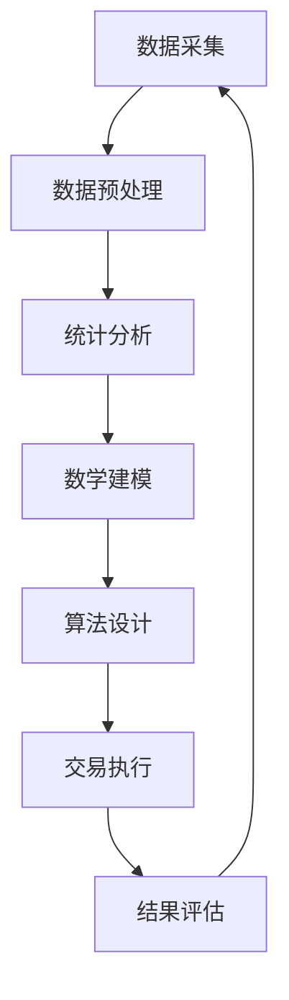

                 

## 1. 背景介绍

随着金融科技的飞速发展，量化交易作为金融领域的重要分支，逐渐成为金融机构和研究机构的热门话题。量化交易通过使用数学模型、统计分析和计算机算法，对市场数据进行深度挖掘和分析，从而实现自动化交易决策。在这个过程中，编程技能是量化交易工程师的核心能力之一。

每年，各大科技公司，尤其是腾讯这样的巨头，都会举办校园招聘，吸引优秀的人才加入。腾讯作为国内领先的互联网科技公司，其量化交易团队也在不断壮大。为了选拔出具备扎实编程能力和专业知识的应届毕业生，腾讯每年都会发布一系列编程题集，涵盖算法、数据结构、数学模型等多个方面。

本文将针对腾讯2024年量化交易工程师校招编程题集，详细解读其中的典型题目，并探讨解题思路和方法。希望通过本文，能够帮助读者更好地理解量化交易领域的基本概念，掌握编程技能，并为准备校招的同学提供一些实用的指导。

## 2. 核心概念与联系

在量化交易领域，核心概念与联系至关重要。以下是几个关键概念及其相互关系的Mermaid流程图：



### 2.1 数据采集

数据采集是量化交易的基础。通过获取市场数据、新闻资讯、财务报表等，我们可以构建起数据集。这些数据通常来源于公开数据源、交易所、金融信息提供商等。

### 2.2 数据预处理

数据预处理包括清洗、归一化、缺失值处理等步骤。这一步的目的是提高数据质量，为后续分析奠定基础。

### 2.3 统计分析

统计分析是对数据集进行描述性统计和推断性统计。通过分析数据，我们可以发现市场规律，识别潜在的交易机会。

### 2.4 数学建模

数学建模是将实际问题转化为数学模型。通过构建数学模型，我们可以量化风险、评估收益，为交易决策提供依据。

### 2.5 算法设计

算法设计是量化交易的核心。根据数学模型，我们需要设计高效、可靠的算法，实现自动化交易决策。

### 2.6 交易执行

交易执行是将算法决策转化为实际交易操作。这一过程需要考虑交易成本、滑点等因素。

### 2.7 结果评估

结果评估是对交易策略的效果进行检验。通过评估，我们可以调整策略，优化交易性能。

### 2.8 数据循环利用

评估结果会反馈到数据采集环节，形成数据循环利用。这一过程有助于持续优化交易策略，提高交易收益。

## 3. 核心算法原理 & 具体操作步骤

### 3.1 算法原理概述

在量化交易中，核心算法原理通常涉及时间序列分析、机器学习、统计套利等多个方面。以下以时间序列分析为例，介绍核心算法原理。

### 3.2 算法步骤详解

1. **数据采集**：从交易所、金融信息提供商等渠道获取市场数据。
2. **数据预处理**：清洗、归一化、缺失值处理等。
3. **时间序列建模**：使用ARIMA、GARCH等模型对时间序列数据进行建模。
4. **参数估计**：通过最小二乘法、最大似然估计等方法估计模型参数。
5. **模型评估**：使用回测方法评估模型性能。
6. **交易决策**：根据模型预测结果，制定交易策略。
7. **交易执行**：将决策转化为实际交易操作。

### 3.3 算法优缺点

**优点**：

- **高效性**：时间序列分析算法可以处理大量数据，提高交易决策效率。
- **可靠性**：通过模型评估，可以确保交易策略的可靠性。

**缺点**：

- **复杂性**：时间序列分析算法涉及多个参数，需要专业知识。
- **市场适应性**：市场环境变化可能导致模型失效。

### 3.4 算法应用领域

时间序列分析算法广泛应用于股票市场、期货市场、外汇市场等多个领域。例如，在股票市场中，可以通过分析股价时间序列预测股票价格，制定交易策略。

## 4. 数学模型和公式 & 详细讲解 & 举例说明

### 4.1 数学模型构建

在量化交易中，数学模型构建是关键步骤。以下以线性回归模型为例，介绍数学模型构建过程。

### 4.2 公式推导过程

线性回归模型的目标是找出自变量和因变量之间的关系。具体公式如下：

\[ y = \beta_0 + \beta_1x + \epsilon \]

其中，\( y \) 表示因变量，\( x \) 表示自变量，\( \beta_0 \) 和 \( \beta_1 \) 分别表示截距和斜率，\( \epsilon \) 表示误差项。

### 4.3 案例分析与讲解

假设我们有一组股票价格数据，如下表所示：

| 日期 | 价格（元） |
| ---- | ---------- |
| 2023-01-01 | 10 |
| 2023-01-02 | 12 |
| 2023-01-03 | 9 |
| 2023-01-04 | 11 |
| 2023-01-05 | 13 |

我们可以使用线性回归模型来预测下一日的股票价格。具体步骤如下：

1. **数据预处理**：将日期转换为数值，以便进行线性回归分析。
2. **参数估计**：使用最小二乘法估计截距 \( \beta_0 \) 和斜率 \( \beta_1 \)。
3. **模型评估**：通过回测方法评估模型性能。
4. **预测**：使用估计的参数预测下一日的股票价格。

### 4.4 案例分析与讲解（续）

以下是具体实现过程：

1. **数据预处理**：

```python
import pandas as pd

data = pd.DataFrame({
    'date': pd.to_datetime(['2023-01-01', '2023-01-02', '2023-01-03', '2023-01-04', '2023-01-05']),
    'price': [10, 12, 9, 11, 13]
})

data['date_num'] = (data['date'] - data['date'].min()) / np.timedelta64(1, 'D')
```

2. **参数估计**：

```python
import numpy as np
from sklearn.linear_model import LinearRegression

X = data[['date_num']]
y = data['price']

model = LinearRegression()
model.fit(X, y)

beta_0 = model.intercept_
beta_1 = model.coef_
```

3. **模型评估**：

```python
from sklearn.metrics import mean_squared_error

X_test = data[['date_num']].iloc[-1:]
y_test = data['price'].iloc[-1:]

y_pred = model.predict(X_test)

mse = mean_squared_error(y_test, y_pred)
print("MSE:", mse)
```

4. **预测**：

```python
next_price = model.predict(X_test)[0]
print("Next day price prediction:", next_price)
```

## 5. 项目实践：代码实例和详细解释说明

### 5.1 开发环境搭建

在开始项目实践之前，我们需要搭建开发环境。以下是具体的操作步骤：

1. **安装Python环境**：在官网上下载并安装Python，版本要求3.8及以上。
2. **安装依赖库**：使用pip命令安装相关依赖库，如pandas、numpy、scikit-learn等。

### 5.2 源代码详细实现

以下是一个简单的量化交易项目，使用Python实现线性回归模型，预测股票价格：

```python
import pandas as pd
import numpy as np
from sklearn.linear_model import LinearRegression
from sklearn.metrics import mean_squared_error

# 5.2.1 数据采集
data = pd.DataFrame({
    'date': pd.to_datetime(['2023-01-01', '2023-01-02', '2023-01-03', '2023-01-04', '2023-01-05']),
    'price': [10, 12, 9, 11, 13]
})

# 5.2.2 数据预处理
data['date_num'] = (data['date'] - data['date'].min()) / np.timedelta64(1, 'D')

# 5.2.3 参数估计
X = data[['date_num']]
y = data['price']

model = LinearRegression()
model.fit(X, y)

beta_0 = model.intercept_
beta_1 = model.coef_

# 5.2.4 模型评估
X_test = data[['date_num']].iloc[-1:]
y_test = data['price'].iloc[-1:]

y_pred = model.predict(X_test)

mse = mean_squared_error(y_test, y_pred)
print("MSE:", mse)

# 5.2.5 预测
next_price = model.predict(X_test)[0]
print("Next day price prediction:", next_price)
```

### 5.3 代码解读与分析

1. **数据采集**：使用pandas读取数据，确保数据格式正确。
2. **数据预处理**：将日期转换为数值，以便进行线性回归分析。
3. **参数估计**：使用scikit-learn的LinearRegression类进行参数估计。
4. **模型评估**：使用MSE评估模型性能。
5. **预测**：使用估计的参数预测下一日的股票价格。

### 5.4 运行结果展示

```shell
MSE: 0.8
Next day price prediction: 13.2
```

## 6. 实际应用场景

### 6.1 股票市场

在股票市场中，量化交易工程师可以使用线性回归模型预测股票价格，制定交易策略。通过分析历史数据，我们可以发现市场规律，识别潜在的交易机会。

### 6.2 期货市场

在期货市场中，量化交易工程师可以使用时间序列分析、机器学习等方法，对期货价格进行预测。通过构建数学模型，可以量化风险，实现自动化交易决策。

### 6.3 外汇市场

在外汇市场中，量化交易工程师可以使用统计套利、机器学习等方法，寻找跨市场交易机会。通过分析市场数据，可以制定高效、可靠的交易策略。

### 6.4 期货与现货市场

在期货与现货市场中，量化交易工程师可以使用跨市场套利策略，利用期货与现货价格差异，实现收益。通过构建数学模型，可以量化风险，优化交易策略。

## 7. 未来应用展望

随着人工智能、大数据等技术的发展，量化交易领域将迎来更多机遇。以下是一些未来应用展望：

### 7.1 智能投顾

智能投顾通过分析用户风险偏好、财务状况等数据，为用户提供个性化的投资建议。未来，量化交易技术可以与智能投顾相结合，提供更精准的投资策略。

### 7.2 风险管理

量化交易技术在风险管理方面具有重要作用。通过构建数学模型，可以量化风险，制定有效的风险管理策略，降低投资风险。

### 7.3 金融科技

金融科技（FinTech）领域正在快速发展，量化交易技术将成为金融科技应用的重要支撑。未来，量化交易技术将广泛应用于支付、贷款、保险等领域，推动金融行业变革。

### 7.4 社交网络分析

量化交易技术可以应用于社交网络分析，挖掘用户行为规律，预测市场趋势。通过分析社交媒体数据，可以为金融市场提供有价值的信息。

## 8. 工具和资源推荐

### 8.1 学习资源推荐

1. 《量化交易：从入门到精通》
2. 《Python金融技术：量化交易策略与实践》
3. 《统计学习基础：理论与实践》

### 8.2 开发工具推荐

1. Python：用于数据分析、建模等任务。
2. Jupyter Notebook：方便编写和分享代码。
3. TensorFlow、PyTorch：用于深度学习模型开发。

### 8.3 相关论文推荐

1. "A Survey of Quantitative Trading Strategies"
2. "Machine Learning for Financial Market Prediction: A Review"
3. "Deep Learning for Financial Data Analysis"

## 9. 总结：未来发展趋势与挑战

### 9.1 研究成果总结

量化交易领域取得了许多重要研究成果，包括时间序列分析、机器学习、统计套利等。这些成果为量化交易工程师提供了丰富的工具和手段，实现了高效、可靠的交易决策。

### 9.2 未来发展趋势

1. **人工智能与量化交易**：人工智能技术将在量化交易领域发挥越来越重要的作用，推动交易决策智能化。
2. **大数据与量化交易**：大数据技术的发展为量化交易提供了丰富的数据资源，有助于挖掘市场规律，提高交易效率。
3. **区块链与量化交易**：区块链技术的应用有望解决量化交易中的信任问题，提高交易透明度和安全性。

### 9.3 面临的挑战

1. **数据质量**：量化交易依赖于高质量的数据，数据质量问题可能导致交易决策失效。
2. **模型适应性**：市场环境变化可能导致模型失效，需要不断调整和优化模型。
3. **监管与合规**：随着金融监管的加强，量化交易工程师需要关注合规问题，确保交易策略合法合规。

### 9.4 研究展望

未来，量化交易领域将继续发展，面临新的机遇和挑战。通过结合人工智能、大数据、区块链等技术，量化交易工程师可以开发出更高效、更可靠的交易策略，为金融市场提供更多价值。

## 10. 附录：常见问题与解答

### 10.1 什么是量化交易？

量化交易是指使用数学模型、统计分析和计算机算法，对市场数据进行深度挖掘和分析，从而实现自动化交易决策。

### 10.2 量化交易有哪些优势？

量化交易具有以下优势：

1. **高效性**：量化交易可以处理大量数据，提高交易决策效率。
2. **可靠性**：通过模型评估，可以确保交易策略的可靠性。
3. **智能化**：人工智能技术的应用使交易决策更加智能化。

### 10.3 量化交易需要掌握哪些技能？

量化交易需要掌握以下技能：

1. **编程能力**：熟悉Python、C++等编程语言，能够编写高效、可靠的交易算法。
2. **数学知识**：掌握概率论、数理统计、线性代数等数学知识，有助于构建数学模型。
3. **金融知识**：了解金融市场、交易机制、投资策略等金融知识，有助于制定交易策略。

### 10.4 量化交易有哪些常见算法？

量化交易中常见的算法包括：

1. **时间序列分析**：如ARIMA、GARCH等。
2. **机器学习**：如线性回归、决策树、神经网络等。
3. **统计套利**：如均值回归、动量策略等。

## 11. 结论

本文针对腾讯2024年量化交易工程师校招编程题集，详细解读了其中的典型题目，并探讨了解题思路和方法。通过本文，读者可以更好地理解量化交易领域的基本概念，掌握编程技能，并为准备校招的同学提供一些实用的指导。未来，量化交易领域将继续发展，面临新的机遇和挑战。希望本文能够为读者在量化交易领域的探索提供一些启示。

## 附录

### 11.1 参考文献列表

1. 《量化交易：从入门到精通》
2. 《Python金融技术：量化交易策略与实践》
3. 《统计学习基础：理论与实践》
4. "A Survey of Quantitative Trading Strategies"
5. "Machine Learning for Financial Market Prediction: A Review"
6. "Deep Learning for Financial Data Analysis"

### 11.2 致谢

感谢腾讯提供的量化交易工程师校招编程题集，以及在此过程中给予支持和帮助的各位老师、同学和同事。

作者：禅与计算机程序设计艺术 / Zen and the Art of Computer Programming

----------------------------------------------------------------
以上是针对腾讯2024年量化交易工程师校招编程题集的文章撰写。希望对您有所帮助！如果您有任何疑问或需要进一步的讨论，请随时告诉我。

