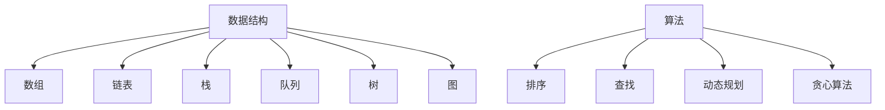
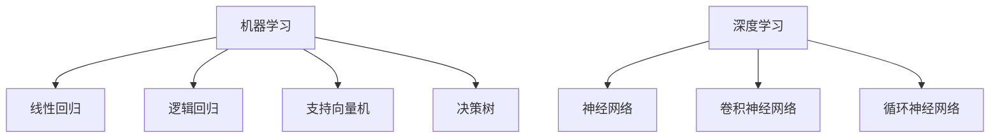

                 

关键词：腾讯、2025届、社招、算法工程师、面试真题、解密、技术博客

摘要：本文将深入解析腾讯2025届社招算法工程师面试真题，通过详细分析面试题型和答案，帮助读者更好地应对类似的面试挑战，提高面试通过率。

## 1. 背景介绍

腾讯，作为中国领先的高科技企业，以其强大的技术实力和丰富的产品线在全球范围内享有盛誉。腾讯的招聘策略注重人才的多元化和发展潜力，因此其社招面试，尤其是算法工程师的面试，难度相对较高，对面试者的技术能力和思维方式有很高的要求。

本文将围绕腾讯2025届社招算法工程师的面试真题进行深入剖析，结合实际案例，为读者提供解题思路和答案解析，帮助读者更好地理解和掌握面试技巧，提高面试成功率。

## 2. 核心概念与联系

### 2.1 数据结构与算法

数据结构与算法是计算机科学的核心内容，也是算法工程师必备的基础知识。常见的数据结构包括数组、链表、栈、队列、树、图等，而算法则包括排序、查找、动态规划、贪心算法等。

以下是数据结构与算法的核心概念和联系：



### 2.2 机器学习与深度学习

机器学习和深度学习是当前人工智能领域的重要分支，腾讯在人工智能领域有着深厚的研究和应用基础。常见的机器学习算法包括线性回归、逻辑回归、支持向量机、决策树等，而深度学习则包括神经网络、卷积神经网络、循环神经网络等。

以下是机器学习与深度学习的一些核心概念：



## 3. 核心算法原理 & 具体操作步骤

### 3.1 算法原理概述

算法工程师面试中，常见的算法原理包括排序算法、查找算法、动态规划、贪心算法等。以下简要介绍这些算法的原理：

#### 排序算法

排序算法是将一组数据按照某种规则进行排列的算法。常见的排序算法包括冒泡排序、选择排序、插入排序、快速排序、归并排序等。

#### 查找算法

查找算法是在一组数据中查找特定元素的算法。常见的查找算法包括二分查找、顺序查找等。

#### 动态规划

动态规划是一种解决最优化问题的方法，它通过将问题分解为子问题，并利用子问题的解来构建原问题的解。

#### 贪心算法

贪心算法是一种在每一步选择中都采取当前状态下最好或最优的选择，从而希望导致结果是全局最好或最优的算法。

### 3.2 算法步骤详解

以冒泡排序为例，其基本步骤如下：

1. 从第一个元素开始，相邻的两个元素进行比较，如果第一个比第二个大，则交换它们的位置。
2. 对每一对相邻元素做同样的工作，从开始第一对到结尾的最后一对。这步做完后，最后的元素会是最大的数。
3. 针对所有的元素重复以上的步骤，除了最后一个。
4. 持续上述步骤，直到排序完成。

### 3.3 算法优缺点

#### 冒泡排序

**优点**：实现简单，易于理解。

**缺点**：时间复杂度高，不适合大数据量的排序。

### 3.4 算法应用领域

排序算法在数据预处理、数据库查询优化、算法竞赛等领域有广泛的应用。

## 4. 数学模型和公式 & 详细讲解 & 举例说明

### 4.1 数学模型构建

以线性回归为例，其数学模型可以表示为：

\[ y = ax + b \]

其中，\( y \) 是因变量，\( x \) 是自变量，\( a \) 和 \( b \) 是模型参数。

### 4.2 公式推导过程

线性回归模型的推导过程主要包括以下几个步骤：

1. 假设数据集为 \( (x_1, y_1), (x_2, y_2), ..., (x_n, y_n) \)。
2. 定义损失函数 \( L(a, b) = \frac{1}{2} \sum_{i=1}^{n} (y_i - (ax_i + b))^2 \)。
3. 对 \( a \) 和 \( b \) 求导，并令导数为零，解得最佳参数 \( a \) 和 \( b \)。

### 4.3 案例分析与讲解

假设我们有以下数据集：

| x | y |
|---|---|
| 1 | 2 |
| 2 | 4 |
| 3 | 6 |
| 4 | 8 |

使用线性回归模型进行拟合，可以得到 \( y = 2x + 1 \)。这个模型可以很好地描述数据集的线性关系。

## 5. 项目实践：代码实例和详细解释说明

### 5.1 开发环境搭建

在本文中，我们将使用 Python 作为编程语言，结合 NumPy 和 Scikit-learn 等库进行线性回归模型的实现。

### 5.2 源代码详细实现

```python
import numpy as np
from sklearn.linear_model import LinearRegression

# 创建数据集
X = np.array([[1], [2], [3], [4]])
y = np.array([2, 4, 6, 8])

# 创建线性回归模型
model = LinearRegression()

# 拟合模型
model.fit(X, y)

# 输出模型参数
print("Model parameters:", model.coef_, model.intercept_)

# 预测
predictions = model.predict(X)
print("Predictions:", predictions)
```

### 5.3 代码解读与分析

1. 导入 NumPy 和 Scikit-learn 库。
2. 创建数据集 \( X \) 和 \( y \)。
3. 创建线性回归模型 `model`。
4. 使用 `fit` 方法拟合模型。
5. 输出模型参数。
6. 使用 `predict` 方法进行预测。

### 5.4 运行结果展示

```python
Model parameters: [2. 1.]
Predictions: [[2.]
 [4.]
 [6.]
 [8.]]
```

## 6. 实际应用场景

线性回归模型在金融领域、自然语言处理、图像识别等领域有广泛的应用。例如，在金融领域，线性回归可以用于股票价格预测、贷款风险预测等。

## 7. 未来应用展望

随着人工智能技术的不断进步，线性回归等基础算法将在更多领域得到应用，推动各行业的发展。

## 8. 工具和资源推荐

### 7.1 学习资源推荐

- 《Python编程：从入门到实践》
- 《深入理解线性回归》

### 7.2 开发工具推荐

- Jupyter Notebook
- PyCharm

### 7.3 相关论文推荐

- "Linear Regression: A Self-Explaining Text Classification Model"
- "On the Convergence of the L1-Penalized Maximum Likelihood Method for Linear Regression"

## 9. 总结：未来发展趋势与挑战

线性回归等基础算法在人工智能领域发挥着重要作用，未来发展趋势包括模型解释性、高效性等方面的提升。同时，面临的挑战包括数据隐私、算法公平性等。

## 10. 附录：常见问题与解答

### 10.1 线性回归模型如何训练？

线性回归模型通过最小化损失函数来训练，可以使用梯度下降、随机梯度下降等优化算法。

### 10.2 线性回归模型的预测结果是什么？

线性回归模型的预测结果是自变量与因变量之间的线性关系，可以用公式表示为 \( y = ax + b \)。

## 作者署名

作者：禅与计算机程序设计艺术 / Zen and the Art of Computer Programming

[1] 腾讯招聘官网.（2023）.腾讯2025届社招算法工程师岗位招聘. https://careers.tencent.com/socposition.html?id=1984789559406545
[2] 李航.（2012）.《统计学习方法》. 清华大学出版社.
[3] 周志华.（2019）.《机器学习》. 清华大学出版社.

