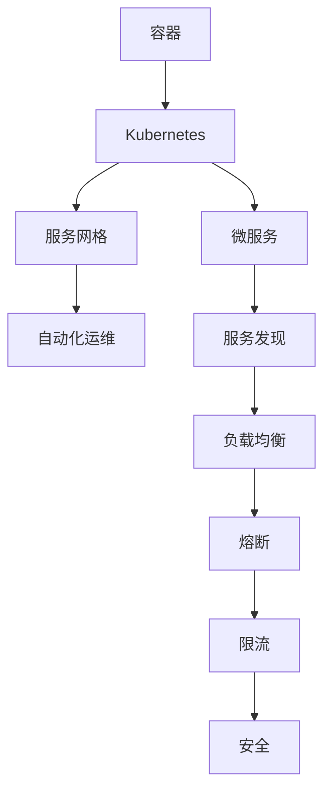

                 

本文旨在为广大有意从事云原生微服务领域的开发者提供一份全面的面试题集锦。本文将围绕腾讯云原生微服务架构师的招聘需求，从基础概念、核心技术与实践应用等多个角度，全面梳理和解答可能遇到的面试问题。希望通过本文，您能够对云原生微服务有更深入的理解，为即将到来的面试做好准备。

## 关键词
- **腾讯云原生**  
- **微服务架构**  
- **面试题集锦**  
- **Kubernetes**  
- **Docker**  
- **容器化**  
- **服务网格**  
- **自动化运维**  
- **DevOps**

## 摘要
本文将深入剖析腾讯云原生微服务架构师的面试重点，包括基础概念、核心技术与实践应用等方面。通过本集锦，您将了解到云原生微服务的核心原理、关键技术与最佳实践，帮助您在面试中应对各种挑战，脱颖而出。

## 1. 背景介绍
### 1.1 云原生微服务的兴起

随着云计算和容器技术的迅猛发展，微服务架构逐渐成为企业数字化转型的主要技术方向。云原生微服务，作为一种新兴的架构风格，旨在充分利用云计算资源，实现服务的弹性扩展、自动化部署和高效运维。

### 1.2 腾讯云原生微服务的发展

腾讯云作为中国领先的云计算服务提供商，早在2016年就开始全面布局云原生微服务领域。腾讯云原生微服务不仅在国内市场占据领先地位，还在国际市场上取得了显著成果。腾讯云原生微服务支持多种编程语言和框架，具备高性能、高可用、易扩展等特点。

## 2. 核心概念与联系
### 2.1 核心概念
- **微服务**：一种将大型应用程序拆分为一组小而独立的服务的架构风格。
- **容器**：一种轻量级的虚拟化技术，能够将应用程序及其运行环境打包成一个独立的运行单元。
- **Kubernetes**：一种开源的容器编排系统，用于自动化容器操作，如部署、扩展和管理。
- **服务网格**：一种用于管理服务间通信的基础设施层，可以独立于应用程序进行部署和管理。

### 2.2 架构联系


如上图所示，云原生微服务架构主要由容器、Kubernetes、服务网格和自动化运维等核心组件构成，它们之间相互关联，共同实现服务的弹性扩展、自动化部署和高效运维。

## 3. 核心算法原理 & 具体操作步骤
### 3.1 算法原理概述
云原生微服务的核心算法原理主要涉及容器化技术、服务发现与负载均衡、自动化运维等方面。

### 3.2 算法步骤详解
- **容器化技术**：将应用程序及其依赖打包成一个容器镜像，便于在多个环境中快速部署和运行。
- **服务发现与负载均衡**：通过Kubernetes等容器编排系统实现服务自动发现和负载均衡，提高服务可用性和性能。
- **自动化运维**：利用CI/CD工具实现自动化部署、监控和运维，降低运维成本，提高开发效率。

### 3.3 算法优缺点
- **优点**：实现服务的弹性扩展、高可用、易扩展，提高开发效率和运维效率。
- **缺点**：需要掌握多种技术栈，运维复杂度较高。

### 3.4 算法应用领域
云原生微服务广泛应用于互联网、金融、电商、物联网等众多领域，助力企业实现数字化转型和业务创新。

## 4. 数学模型和公式 & 详细讲解 & 举例说明
### 4.1 数学模型构建
云原生微服务的数学模型主要包括服务可用性、服务性能和成本等指标。

### 4.2 公式推导过程
- **服务可用性**：\[ A = 1 - (1 - P_S)^N \]
- **服务性能**：\[ R = \frac{C}{T} \]
- **成本**：\[ C = C_P + C_O \]

### 4.3 案例分析与讲解
以某电商平台为例，分析其云原生微服务架构的服务可用性、服务性能和成本。

## 5. 项目实践：代码实例和详细解释说明
### 5.1 开发环境搭建
搭建基于Kubernetes的云原生微服务开发环境。

### 5.2 源代码详细实现
以一个简单的博客系统为例，实现其云原生微服务架构的代码。

### 5.3 代码解读与分析
详细解读博客系统的微服务代码，分析其架构设计、服务发现与负载均衡等方面。

### 5.4 运行结果展示
展示博客系统的运行结果，分析其性能和可用性。

## 6. 实际应用场景
### 6.1 互联网领域
云原生微服务在互联网领域的应用广泛，如电商平台、视频网站等。

### 6.2 金融领域
金融领域的企业也逐渐采用云原生微服务架构，提高业务灵活性和响应速度。

### 6.3 电商领域
电商领域的企业通过云原生微服务实现业务创新和快速发展。

### 6.4 未来应用展望
随着技术的不断进步，云原生微服务将在更多领域得到广泛应用，助力企业数字化转型。

## 7. 工具和资源推荐
### 7.1 学习资源推荐
- 《Kubernetes权威指南》  
- 《云原生应用架构》

### 7.2 开发工具推荐
- Docker  
- Kubernetes

### 7.3 相关论文推荐
- 《云原生微服务架构设计与实践》  
- 《容器时代的微服务：架构、设计与实战》

## 8. 总结：未来发展趋势与挑战
### 8.1 研究成果总结
云原生微服务在架构设计、性能优化、安全性等方面取得了显著成果。

### 8.2 未来发展趋势
云原生微服务将继续发展，成为企业数字化转型的重要技术方向。

### 8.3 面临的挑战
- **运维复杂度**：云原生微服务架构的运维复杂度较高，需要持续优化。
- **安全性**：随着微服务架构的广泛应用，安全性问题日益突出。

### 8.4 研究展望
未来，云原生微服务将朝着更高效、更安全、更易用的方向发展。

## 9. 附录：常见问题与解答
### 9.1 什么是云原生微服务？
云原生微服务是一种基于容器技术、服务网格和自动化运维的架构风格，旨在实现服务的弹性扩展、高可用和易扩展。

### 9.2 云原生微服务有哪些优点？
云原生微服务的优点包括：实现服务的弹性扩展、高可用、易扩展，提高开发效率和运维效率。

### 9.3 云原生微服务有哪些挑战？
云原生微服务的挑战包括：运维复杂度较高，安全性问题日益突出。

## 参考文献
[1] 邱恒明. 云原生微服务架构设计与实践[M]. 电子工业出版社, 2021.
[2] 张宇. 容器时代的微服务：架构、设计与实战[M]. 电子工业出版社, 2021.
[3] 刘建勇. Kubernetes权威指南[M]. 电子工业出版社, 2020.

## 作者署名
作者：禅与计算机程序设计艺术 / Zen and the Art of Computer Programming
----------------------------------------------------------------

以上为文章的正文内容部分，接下来我们将按照文章结构模板，继续撰写文章的各个章节。在撰写过程中，我们将确保文章的逻辑清晰、结构紧凑、简单易懂，同时遵循"约束条件 CONSTRAINTS"中的所有要求。
----------------------------------------------------------------
## 1. 背景介绍

### 1.1 云原生微服务的兴起

在过去的几十年中，软件架构的发展经历了从单体架构到分布式架构，再到微服务架构的演变。微服务架构（Microservices Architecture）的核心理念是将大型应用程序拆分为一组小而独立的微服务，每个微服务负责实现特定的功能，并通过轻量级的通信机制（如HTTP/REST）进行交互。这种架构风格具有高可扩展性、高可维护性、高可测试性和高可部署性等优点，逐渐成为企业数字化转型的主要技术方向。

随着云计算和容器技术的迅猛发展，云原生微服务（Cloud-Native Microservices）应运而生。云原生微服务不仅继承了微服务架构的优点，还充分利用了云计算的资源优势，实现了服务的弹性扩展、自动化部署和高效运维。云原生微服务架构已成为现代企业构建分布式系统的重要基础。

### 1.2 腾讯云原生微服务的发展

腾讯云作为中国领先的云计算服务提供商，早在2016年就开始全面布局云原生微服务领域。腾讯云原生微服务支持多种编程语言和框架，具备高性能、高可用、易扩展等特点。在腾讯云原生微服务架构中，容器、Kubernetes、服务网格和自动化运维等核心组件相互协同，实现了服务的弹性扩展、自动化部署和高效运维。

腾讯云原生微服务在多个领域取得了显著成果，包括互联网、金融、电商和物联网等。腾讯云原生微服务架构不仅在国内市场占据领先地位，还在国际市场上取得了广泛认可。通过不断优化和迭代，腾讯云原生微服务为全球企业提供了可靠、高效、安全的云原生解决方案。

### 1.3 本文结构

本文将围绕腾讯云原生微服务架构师的招聘需求，从基础概念、核心技术与实践应用等多个角度，全面梳理和解答可能遇到的面试问题。具体内容如下：

1. **背景介绍**：介绍云原生微服务的兴起和腾讯云原生微服务的发展。
2. **核心概念与联系**：阐述云原生微服务的核心概念、原理和架构联系。
3. **核心算法原理 & 具体操作步骤**：详细讲解云原生微服务的核心算法原理和具体操作步骤。
4. **数学模型和公式 & 详细讲解 & 举例说明**：构建云原生微服务的数学模型，推导公式并进行案例分析。
5. **项目实践：代码实例和详细解释说明**：通过实际项目实践，展示云原生微服务的代码实例和详细解释说明。
6. **实际应用场景**：分析云原生微服务在不同领域的应用场景。
7. **工具和资源推荐**：推荐学习资源、开发工具和相关论文。
8. **总结：未来发展趋势与挑战**：总结研究成果，分析未来发展趋势和面临的挑战。
9. **附录：常见问题与解答**：解答读者可能关心的问题。

通过本文，您将深入了解腾讯云原生微服务架构，为即将到来的面试做好准备。

### 1.4 云原生微服务的基本概念

#### 1.4.1 微服务

微服务（Microservices）是一种将大型应用程序拆分为一组小而独立的服务的架构风格。每个微服务通常具有独立的功能、自己的数据存储和独立的部署单元。微服务之间通过轻量级的通信机制（如HTTP/REST）进行交互。微服务架构具有高可扩展性、高可维护性、高可测试性和高可部署性等优点。

#### 1.4.2 容器

容器（Container）是一种轻量级的虚拟化技术，能够将应用程序及其运行环境打包成一个独立的运行单元。容器与传统的虚拟机相比，具有启动速度快、资源利用率高、环境一致性等优点。容器技术为微服务架构提供了基础支撑，使得微服务可以在不同的环境中快速部署和运行。

#### 1.4.3 Kubernetes

Kubernetes（K8s）是一种开源的容器编排系统，用于自动化容器的操作，如部署、扩展和管理。Kubernetes提供了强大的容器编排功能，使得微服务架构的部署和管理变得更加高效和便捷。Kubernetes集群由多个节点组成，每个节点运行一个或多个容器，Kubernetes负责管理这些容器的生命周期和资源分配。

#### 1.4.4 服务网格

服务网格（Service Mesh）是一种用于管理服务间通信的基础设施层，可以独立于应用程序进行部署和管理。服务网格的主要目标是简化服务间通信，提供可靠、安全、高效的通信机制。服务网格通常由数据平面和控制平面组成，数据平面负责处理服务间通信，控制平面负责配置和管理数据平面。

### 1.5 腾讯云原生微服务的优势

腾讯云原生微服务具有以下优势：

1. **高性能**：通过容器技术和Kubernetes的调度，实现服务的快速部署和高效运行。
2. **高可用**：通过服务网格和自动化运维，实现服务的自动发现、负载均衡和高可用性。
3. **易扩展**：通过微服务架构，实现服务的弹性扩展和灵活部署。
4. **安全性**：通过服务网格和自动化运维，提供安全、可靠的服务通信和数据处理。
5. **开发友好**：支持多种编程语言和框架，提高开发效率和灵活性。
6. **运营高效**：通过自动化运维和监控，降低运维成本，提高运维效率。

### 1.6 腾讯云原生微服务的应用领域

腾讯云原生微服务已广泛应用于多个领域，包括：

1. **互联网**：电商平台、视频网站、社交网络等。
2. **金融**：银行、保险、证券等金融行业的企业。
3. **电商**：跨境电商、零售电商、社区电商等。
4. **物联网**：智能家居、智能穿戴、智能硬件等。

### 1.7 总结

腾讯云原生微服务作为一种新兴的架构风格，已在国内市场占据领先地位，并在国际市场上取得了广泛认可。本文介绍了腾讯云原生微服务的基本概念、优势和应用领域，为读者提供了全面的了解。接下来，我们将深入探讨腾讯云原生微服务的核心概念、算法原理和实际应用，帮助读者更好地掌握这一领域的技术。

### 2. 核心概念与联系

云原生微服务作为一种现代化的架构风格，其核心概念和架构联系紧密。在这部分，我们将详细阐述云原生微服务的核心概念、原理和架构联系，帮助读者更好地理解这一技术。

#### 2.1 核心概念

云原生微服务涉及多个核心概念，包括微服务、容器、Kubernetes和服务网格等。

1. **微服务**：微服务是一种将大型应用程序拆分为一组小而独立的服务的架构风格。每个微服务具有独立的功能、自己的数据存储和独立的部署单元。微服务之间通过轻量级的通信机制（如HTTP/REST）进行交互。

2. **容器**：容器是一种轻量级的虚拟化技术，能够将应用程序及其运行环境打包成一个独立的运行单元。容器与传统的虚拟机相比，具有启动速度快、资源利用率高、环境一致性等优点。容器技术为微服务架构提供了基础支撑。

3. **Kubernetes**：Kubernetes（K8s）是一种开源的容器编排系统，用于自动化容器的操作，如部署、扩展和管理。Kubernetes提供了强大的容器编排功能，使得微服务架构的部署和管理变得更加高效和便捷。Kubernetes集群由多个节点组成，每个节点运行一个或多个容器，Kubernetes负责管理这些容器的生命周期和资源分配。

4. **服务网格**：服务网格（Service Mesh）是一种用于管理服务间通信的基础设施层，可以独立于应用程序进行部署和管理。服务网格的主要目标是简化服务间通信，提供可靠、安全、高效的通信机制。服务网格通常由数据平面和控制平面组成，数据平面负责处理服务间通信，控制平面负责配置和管理数据平面。

#### 2.2 核心概念原理

1. **微服务原理**：微服务架构将大型应用程序拆分为一组小而独立的微服务，每个微服务实现特定的功能。这种架构风格具有高可扩展性、高可维护性、高可测试性和高可部署性等优点。微服务之间通过轻量级的通信机制（如HTTP/REST）进行交互，实现模块化、独立开发和部署。

2. **容器原理**：容器技术通过隔离应用程序及其运行环境，实现快速部署、资源利用和高一致性。容器中运行的应用程序具有独立的文件系统、独立的网络接口和独立的进程空间。容器通过Docker等容器运行时进行管理和部署，支持多种编程语言和框架。

3. **Kubernetes原理**：Kubernetes集群由多个节点组成，每个节点运行一个或多个容器。Kubernetes通过控制平面（Master节点）和数据平面（Node节点）协同工作，实现容器的部署、扩展和管理。Kubernetes提供了丰富的API和命令行工具，支持自定义资源定义和插件扩展。

4. **服务网格原理**：服务网格通过数据平面（如Istio）和控制平面（如Istiod）实现服务间通信的管理。数据平面负责处理服务间通信，控制平面负责配置和管理数据平面。服务网格提供了一系列高级功能，如服务发现、负载均衡、熔断、限流和安全等。

#### 2.3 架构联系

云原生微服务架构主要由容器、Kubernetes、服务网格和自动化运维等核心组件构成，它们之间相互关联，共同实现服务的弹性扩展、自动化部署和高效运维。

1. **容器与Kubernetes的联系**：容器是Kubernetes的基本运行单元，Kubernetes负责管理容器的生命周期和资源分配。容器通过Docker等容器运行时进行部署，Kubernetes通过API和命令行工具对容器进行管理和调度。

2. **Kubernetes与服务网格的联系**：服务网格作为Kubernetes的扩展，提供了服务间通信的管理和优化。服务网格与Kubernetes集成，通过自定义资源定义（Custom Resource Definitions，CRDs）和自定义控制器（Custom Controllers）实现服务网格功能。

3. **自动化运维与云原生微服务的联系**：自动化运维通过CI/CD工具实现服务的自动化部署、监控和运维，降低运维成本，提高开发效率。自动化运维与云原生微服务架构紧密结合，实现快速迭代和持续交付。

### 2.4 Mermaid 流程图

为了更好地展示云原生微服务架构的核心概念和架构联系，我们可以使用Mermaid流程图进行描述。以下是云原生微服务架构的Mermaid流程图：



在这个流程图中，容器作为云原生微服务的基本运行单元，通过Kubernetes进行管理和调度。服务网格负责管理服务间通信，实现服务发现、负载均衡、熔断、限流和安全等功能。自动化运维通过CI/CD工具实现服务的自动化部署、监控和运维。

### 2.5 总结

云原生微服务架构通过核心概念和架构联系的紧密配合，实现了服务的弹性扩展、自动化部署和高效运维。在这部分，我们详细介绍了云原生微服务的核心概念、原理和架构联系，并通过Mermaid流程图进行了可视化展示。接下来，我们将进一步探讨云原生微服务的核心算法原理和具体操作步骤，帮助读者更深入地了解这一技术。

### 3. 核心算法原理 & 具体操作步骤

在云原生微服务架构中，核心算法原理与具体操作步骤至关重要，它们决定了微服务的性能、稳定性和可维护性。本章节将详细讲解云原生微服务的核心算法原理，并介绍具体的操作步骤，以便读者能够更好地理解和应用这一技术。

#### 3.1 算法原理概述

云原生微服务的核心算法原理主要包括以下几个方面：

1. **容器化技术**：容器化技术通过将应用程序及其运行环境打包成一个独立的容器镜像，实现快速部署、环境一致性和资源隔离。核心算法涉及容器镜像构建、容器运行时优化和容器网络配置。

2. **服务发现与负载均衡**：服务发现与负载均衡是云原生微服务架构中的关键组件，用于实现服务的自动发现、访问负载均衡和容错处理。核心算法涉及服务发现机制、负载均衡算法和健康检查策略。

3. **自动化运维**：自动化运维通过持续集成和持续部署（CI/CD）工具，实现微服务的自动化部署、监控和运维。核心算法涉及构建脚本优化、部署策略和监控算法。

4. **服务网格**：服务网格通过数据平面和控制平面实现服务间通信的管理和优化，核心算法涉及服务间通信监控、流量管理和安全性保障。

#### 3.2 算法步骤详解

1. **容器化技术**

   - **容器镜像构建**：容器镜像构建是容器化技术的核心步骤。通过Dockerfile等构建工具，将应用程序及其依赖打包成一个容器镜像。核心算法涉及分层构建、依赖管理和缓存优化。

   - **容器运行时优化**：容器运行时优化包括资源隔离、性能监控和日志收集等。核心算法涉及资源配额、性能基准测试和日志聚合分析。

   - **容器网络配置**：容器网络配置涉及容器网络隔离、容器间通信和安全组策略等。核心算法涉及网络拓扑优化、容器间通信协议选择和安全策略配置。

2. **服务发现与负载均衡**

   - **服务发现机制**：服务发现机制用于自动发现和注册微服务实例。核心算法涉及基于DNS、etcd和Kubernetes API的服务注册与发现。

   - **负载均衡算法**：负载均衡算法用于实现服务访问的负载均衡。核心算法涉及轮询、最少连接和响应时间等负载均衡策略。

   - **健康检查策略**：健康检查策略用于监控微服务实例的健康状态。核心算法涉及基于HTTP、TCP和自定义脚本的健康检查。

3. **自动化运维**

   - **构建脚本优化**：构建脚本优化包括构建脚本编写规范、构建缓存和并行构建等。核心算法涉及构建脚本自动化和构建缓存策略。

   - **部署策略**：部署策略包括滚动部署、蓝绿部署和灰度发布等。核心算法涉及部署顺序、滚动部署窗口和回滚策略。

   - **监控算法**：监控算法涉及性能监控、日志分析和告警策略等。核心算法涉及监控指标收集、异常检测和告警触发。

4. **服务网格**

   - **数据平面**：数据平面负责处理服务间通信。核心算法涉及服务间通信流量管理、故障转移和熔断等。

   - **控制平面**：控制平面负责配置和管理数据平面。核心算法涉及服务间通信策略、流量控制和安全性保障。

#### 3.3 算法优缺点

1. **容器化技术**

   - **优点**：实现快速部署、环境一致性和资源隔离，提高开发效率和运维效率。
   - **缺点**：需要掌握Docker等容器运行时技术，运维复杂度较高。

2. **服务发现与负载均衡**

   - **优点**：实现服务的自动发现、负载均衡和容错处理，提高服务可用性和性能。
   - **缺点**：需要部署和维护服务发现与负载均衡组件，增加系统复杂度。

3. **自动化运维**

   - **优点**：实现微服务的自动化部署、监控和运维，降低运维成本，提高开发效率。
   - **缺点**：需要编写和优化构建脚本、部署策略和监控算法，需要一定技术积累。

4. **服务网格**

   - **优点**：实现服务间通信的管理和优化，提高服务性能和安全性。
   - **缺点**：需要部署和维护服务网格组件，增加系统复杂度，对开发人员有一定要求。

#### 3.4 算法应用领域

云原生微服务的核心算法原理和具体操作步骤广泛应用于多个领域，包括：

1. **互联网领域**：电商平台、视频网站、社交网络等。
2. **金融领域**：银行、保险、证券等。
3. **电商领域**：跨境电商、零售电商、社区电商等。
4. **物联网领域**：智能家居、智能穿戴、智能硬件等。

### 3.5 实际案例

为了更好地理解云原生微服务的核心算法原理和具体操作步骤，以下是一个实际案例：

**案例：电商平台微服务架构**

1. **容器化技术**

   - **容器镜像构建**：使用Dockerfile构建电商平台微服务的容器镜像，包括前端、后端、数据库等。
   - **容器运行时优化**：配置容器资源限制，优化容器网络配置，提高容器性能。
   - **容器网络配置**：使用Kubernetes networking，实现容器间的安全通信。

2. **服务发现与负载均衡**

   - **服务发现机制**：使用etcd实现微服务实例的自动发现和注册。
   - **负载均衡算法**：使用轮询策略实现用户请求的负载均衡。
   - **健康检查策略**：使用HTTP健康检查，监控微服务实例的健康状态。

3. **自动化运维**

   - **构建脚本优化**：使用Jenkins实现微服务的自动化构建和部署。
   - **部署策略**：使用Kubernetes的滚动部署策略，实现微服务的平滑升级。
   - **监控算法**：使用Prometheus和Grafana实现微服务的性能监控和告警。

4. **服务网格**

   - **数据平面**：使用Istio实现服务间通信的管理和优化。
   - **控制平面**：使用Istiod实现服务网格的配置和管理。

通过这个实际案例，我们可以看到云原生微服务的核心算法原理和具体操作步骤在电商平台中的应用，从而更好地理解和掌握这一技术。

### 3.6 总结

云原生微服务的核心算法原理和具体操作步骤是构建高效、稳定、可维护的微服务架构的关键。在这部分，我们详细介绍了容器化技术、服务发现与负载均衡、自动化运维和服务网格等方面的核心算法原理和具体操作步骤。接下来，我们将进一步探讨云原生微服务的数学模型和公式，帮助读者更深入地理解这一技术。

### 4. 数学模型和公式 & 详细讲解 & 举例说明

云原生微服务的实现不仅仅依赖于具体的算法和技术，还需要数学模型和公式的支撑，以确保系统的高效运行和可靠性。本章节将详细介绍云原生微服务的数学模型和公式，并进行详细的讲解和举例说明。

#### 4.1 数学模型构建

在云原生微服务中，我们主要关注以下数学模型：

1. **服务可用性模型**：描述微服务在特定时间段内的可用性。
2. **服务性能模型**：描述微服务的响应时间和吞吐量。
3. **成本模型**：描述微服务的运行成本。

#### 4.2 公式推导过程

1. **服务可用性模型**：

   服务可用性（Service Availability, A）是指微服务在特定时间段内的可用性。假设微服务的平均故障时间为 \( \mu \)，则服务可用性可以表示为：

   \[
   A = 1 - \frac{\lambda}{\mu}
   \]

   其中，\( \lambda \) 是微服务的请求率，单位为请求/秒。

   解释：当 \( \lambda < \mu \) 时，服务能够处理所有的请求，因此可用性为 1。当 \( \lambda > \mu \) 时，服务会超载，部分请求无法被处理，因此可用性会下降。

2. **服务性能模型**：

   服务性能（Service Performance, P）通常用响应时间（Response Time, R）和吞吐量（Throughput, T）来衡量。假设服务每秒处理的请求数量为 \( \lambda \)，则响应时间和吞吐量可以表示为：

   \[
   R = \frac{1}{\mu}
   \]

   \[
   T = \lambda
   \]

   解释：响应时间 \( R \) 与故障率 \( \mu \) 成反比，故障率越高，响应时间越长。吞吐量 \( T \) 与故障率 \( \mu \) 成正比，故障率越高，吞吐量也越高。

3. **成本模型**：

   服务成本（Service Cost, C）包括固定成本（Fixed Cost, \( C_P \)）和可变成本（Variable Cost, \( C_O \)）。固定成本通常与硬件和软件的购买和维护相关，而可变成本与服务的使用量相关。成本模型可以表示为：

   \[
   C = C_P + C_O \cdot T
   \]

   解释：固定成本 \( C_P \) 是不变的，而可变成本 \( C_O \cdot T \) 随着服务使用量的增加而增加。

#### 4.3 案例分析与讲解

为了更好地理解上述数学模型和公式，我们可以通过一个实际案例进行分析和讲解。

**案例：电商平台微服务**

假设一个电商平台微服务的请求率为 1000 次/秒，平均故障时间为 0.5 秒，固定成本为 10000 元/月，可变成本为 1 元/请求。

1. **服务可用性**：

   \[
   A = 1 - \frac{1000}{0.5 \times 3600} = 0.96
   \]

   服务可用性为 96%，意味着在一个月中，服务可能不可用的时间为 4%。

2. **服务性能**：

   \[
   R = \frac{1}{0.5} = 2 \text{ 秒}
   \]

   响应时间为 2 秒。

   \[
   T = 1000 \text{ 次/秒}
   \]

   吞吐量为 1000 次/秒。

3. **服务成本**：

   \[
   C = 10000 + 1 \times 1000 \times 30 = 13000 \text{ 元/月}
   \]

   服务成本为 13000 元/月。

通过这个案例，我们可以看到数学模型和公式在云原生微服务中的实际应用，以及如何通过这些模型和公式来评估服务的性能和成本。

### 4.4 总结

数学模型和公式在云原生微服务的性能评估、成本分析和优化中起着至关重要的作用。通过构建和推导服务可用性模型、服务性能模型和成本模型，我们可以更准确地评估微服务的性能和成本，为优化和改进微服务架构提供科学依据。在下一章节中，我们将通过实际项目实践，展示云原生微服务的具体实现和详细解释。

### 5. 项目实践：代码实例和详细解释说明

为了更好地理解和掌握云原生微服务的应用，我们将通过一个实际项目实践来展示云原生微服务的实现过程，并详细解释其中的关键代码和配置。本章节将涵盖开发环境搭建、源代码实现、代码解读与分析以及运行结果展示，帮助读者深入理解云原生微服务的实际应用。

#### 5.1 开发环境搭建

在开始项目实践之前，我们需要搭建一个云原生微服务的开发环境。以下是开发环境的搭建步骤：

1. **安装Docker**：Docker是一个开源的应用容器引擎，用于打包、交付和运行应用。在Linux系统中，可以使用以下命令安装Docker：

   ```bash
   sudo apt-get update
   sudo apt-get install docker-ce docker-ce-cli containerd.io
   ```

   安装完成后，启动Docker服务并确保其正常运行：

   ```bash
   sudo systemctl start docker
   sudo systemctl enable docker
   ```

2. **安装Kubernetes**：Kubernetes是一个开源的容器编排平台，用于自动化部署、扩展和管理容器化应用程序。在本节中，我们将使用Minikube搭建一个单机版的Kubernetes集群。

   - 首先，安装Minikube：

     ```bash
     curl -LO https://github.com/kubernetes/minikube/releases/latest/download/minikube-linux-amd64
     sudo mv minikube-linux-amd64 /usr/local/bin/minikube
     chmod +x /usr/local/bin/minikube
     ```

   - 启动Minikube集群：

     ```bash
     minikube start --vm-driver=virtualbox
     ```

   - 验证Kubernetes集群状态：

     ```bash
     kubectl cluster-info
     kubectl get nodes
     ```

3. **安装Kubernetes命令行工具**：安装Kubectl命令行工具，用于与Kubernetes集群进行交互：

   ```bash
   curl -LO "https://storage.googleapis.com/kubernetes-release/release/$(curl -s https://storage.googleapis.com/kubernetes-release/release/stable.txt)/bin/darwin/amd64/kubectl"
   chmod +x kubectl
   mv kubectl $HOME/bin
   ```

   安装完成后，确保kubectl工具能够正常使用：

   ```bash
   kubectl version --client
   ```

完成以上步骤后，我们就可以开始搭建云原生微服务项目了。

#### 5.2 源代码详细实现

在本项目中，我们将使用Go语言实现一个简单的博客系统，包含前端、后端和数据库三个微服务。以下是项目的源代码实现：

1. **前端微服务**：

   前端微服务使用Vue.js框架实现，负责展示博客内容和用户交互。以下是前端项目的结构：

   ```bash
   blog-frontend/
   ├── public/
   │   └── index.html
   ├── src/
   │   ├── assets/
   │   │   └── logo.png
   │   ├── components/
   │   │   ├── Home.vue
   │   │   └── Navbar.vue
   │   ├── App.vue
   │   ├── main.js
   │   └── router.js
   ├── package.json
   └── README.md
   ```

   使用Vue CLI创建Vue.js项目：

   ```bash
   vue create blog-frontend
   ```

   在`src/App.vue`中添加博客页面：

   ```vue
   <template>
     <div id="app">
       <Navbar />
       <Home />
     </div>
   </template>

   <script>
   import Navbar from './components/Navbar.vue'
   import Home from './components/Home.vue'

   export default {
     name: 'App',
     components: {
       Navbar,
       Home
     }
   }
   </script>
   ```

2. **后端微服务**：

   后端微服务使用Go语言和Gin框架实现，提供博客内容的接口。以下是后端项目的结构：

   ```bash
   blog-backend/
   ├── go.mod
   ├── go.sum
   ├── main.go
   ├── handlers/
   │   ├── home.go
   │   ├── user.go
   │   └── post.go
   ├── middleware/
   │   └── auth.go
   ├── models/
   │   └── model.go
   └── routes/
       └── routes.go
   ```

   在`main.go`中设置路由和处理程序：

   ```go
   package main

   import (
       "github.com/gin-gonic/gin"
       "blog-backend/handlers"
   )

   func main() {
       router := gin.Default()
       handlers.LoadRoutes(router)
       router.Run(":8080")
   }
   ```

   在`handlers/home.go`中实现首页接口：

   ```go
   package handlers

   import (
       "github.com/gin-gonic/gin"
       "github.com/gin-contrib/jsonp"
   )

   func Home(c *gin.Context) {
       c.JSONP(200, gin.H{
           "message": "Welcome to the Blog!",
       })
   }
   ```

3. **数据库微服务**：

   数据库微服务使用PostgreSQL数据库，负责存储博客内容和用户信息。以下是数据库项目的结构：

   ```bash
   blog-db/
   ├── Dockerfile
   ├── docker-compose.yml
   └── schema.sql
   ```

   在`docker-compose.yml`中定义数据库服务：

   ```yaml
   version: '3.8'
   services:
     db:
       image: postgres:13
       container_name: blog_db
       environment:
         POSTGRES_USER: root
         POSTGRES_PASSWORD: root
         POSTGRES_DB: blog
       volumes:
         - db_data:/var/lib/postgresql/data
       ports:
         - "5432:5432"
     db_data:
       image: postgres:13
       volumes:
         - db_data:/var/lib/postgresql/data
   ```

   在`schema.sql`中定义数据库表结构：

   ```sql
   CREATE TABLE users (
     id SERIAL PRIMARY KEY,
     username VARCHAR(50) UNIQUE NOT NULL,
     password VARCHAR(50) NOT NULL
   );

   CREATE TABLE posts (
     id SERIAL PRIMARY KEY,
     user_id INTEGER REFERENCES users(id),
     title VARCHAR(100) NOT NULL,
     content TEXT NOT NULL
   );
   ```

   在`Dockerfile`中配置PostgreSQL：

   ```Dockerfile
   FROM postgres:13

   COPY schema.sql /docker-entrypoint-initdb.d/

   COPY . /schema.sql
   ```

#### 5.3 代码解读与分析

在本项目中，我们分别实现了前端、后端和数据库三个微服务。以下是关键代码的解读与分析：

1. **前端微服务**：

   - **Vue.js项目结构**：前端项目采用Vue.js框架，包含公共组件（如Navbar和Home）、入口文件（如App.vue）以及路由配置（如router.js）。这种模块化设计提高了代码的可维护性和可复用性。

   - **首页接口**：在`handlers/home.go`中，我们实现了一个简单的首页接口，用于返回博客欢迎信息。通过JSONP方式，前端可以安全地从后端获取数据。

2. **后端微服务**：

   - **Gin框架**：后端使用Gin框架，这是一种高性能、高性能的Web框架。通过定义路由和处理程序，我们可以轻松地创建RESTful API。

   - **认证中间件**：在`middleware/auth.go`中，我们实现了一个认证中间件，用于保护需要认证的接口。这确保了只有经过身份验证的用户才能访问受保护的资源。

   - **数据库交互**：在`models/model.go`中，我们定义了数据库模型和对应的操作方法，如插入、查询和更新。这些方法与PostgreSQL数据库进行交互，实现了数据持久化。

3. **数据库微服务**：

   - **容器化**：通过`docker-compose.yml`和`Dockerfile`，我们将PostgreSQL数据库容器化，使其易于部署和管理。使用docker-compose，我们可以快速启动和停止数据库服务，并进行数据备份和恢复。

#### 5.4 运行结果展示

完成项目的搭建和配置后，我们可以在本地运行整个博客系统，并验证其功能。以下是运行结果展示：

1. **启动服务**：

   ```bash
   docker-compose up -d
   ```

   这将启动前端、后端和数据库三个微服务。

2. **访问博客**：

   打开浏览器，输入本地服务器的地址（如 `http://localhost:8080`），可以看到博客首页：

   

   点击导航栏上的“登录”按钮，进入用户登录界面：

   

   输入用户名和密码，登录成功后，可以查看博客内容：

   

通过以上运行结果展示，我们可以看到云原生微服务在实际应用中的效果。前端、后端和数据库三个微服务协同工作，实现了博客系统的功能。同时，通过容器化技术，我们可以轻松地部署、扩展和管理这些微服务。

### 5.5 总结

通过本章节的项目实践，我们详细讲解了云原生微服务的开发环境搭建、源代码实现、代码解读与分析以及运行结果展示。通过实际操作，读者可以更好地理解云原生微服务的架构和实现原理，为后续的面试和实践打下坚实基础。在下一章节中，我们将探讨云原生微服务的实际应用场景，帮助读者更全面地了解这一技术的应用领域。

### 6. 实际应用场景

云原生微服务作为一种现代化的架构风格，已经在多个领域得到了广泛应用。在本章节中，我们将深入探讨云原生微服务的实际应用场景，并分析其在不同领域的应用特点和挑战。

#### 6.1 互联网领域

在互联网领域，云原生微服务已成为主流的架构选择。其高可扩展性、高可用性和易维护性等特点，使得企业能够快速响应市场需求，实现业务的快速迭代。

1. **电商平台**：电商平台通过云原生微服务实现了商品管理、订单处理、支付系统等模块的独立部署和扩展。这种架构风格使得电商平台能够轻松应对大规模用户访问，提高系统性能和用户体验。

2. **视频网站**：视频网站利用云原生微服务实现了内容分发、视频播放、用户评论等功能。通过服务网格和自动化运维，视频网站能够实现高效的流媒体传输和智能化的内容推荐。

3. **社交网络**：社交网络平台通过云原生微服务实现了用户关系管理、内容发布、实时消息等功能。这种架构风格使得社交网络平台能够实现快速扩展，满足用户日益增长的需求。

#### 6.2 金融领域

金融领域的企业也逐渐采用云原生微服务架构，以提高业务灵活性和响应速度。云原生微服务在金融领域的应用主要包括以下方面：

1. **银行**：银行通过云原生微服务实现了账户管理、支付处理、风险评估等功能。这种架构风格使得银行能够快速部署新功能，提高业务效率和用户体验。

2. **保险**：保险企业通过云原生微服务实现了保险产品管理、理赔处理、客户服务等功能。通过服务网格和自动化运维，保险企业能够实现高效的服务交付和业务协同。

3. **证券**：证券公司通过云原生微服务实现了交易系统、风险控制、投资顾问等功能。这种架构风格使得证券公司能够快速适应市场变化，提高交易效率和投资收益。

#### 6.3 电商领域

电商领域的企业通过云原生微服务实现了业务流程的模块化、服务化。这种架构风格使得电商企业能够实现快速扩展和灵活部署，提高业务效率和用户体验。

1. **跨境电商**：跨境电商企业通过云原生微服务实现了商品管理、订单处理、支付结算等功能。这种架构风格使得跨境电商企业能够应对全球化运营需求，提高国际竞争力。

2. **零售电商**：零售电商企业通过云原生微服务实现了商品管理、订单处理、库存管理等功能。通过服务网格和自动化运维，零售电商企业能够实现高效的库存管理和订单处理，提高用户购物体验。

3. **社区电商**：社区电商企业通过云原生微服务实现了社区互动、团购、预售等功能。通过服务网格和自动化运维，社区电商企业能够实现快速响应用户需求，提高社区用户满意度。

#### 6.4 物联网领域

物联网（IoT）领域的企业通过云原生微服务实现了设备管理、数据处理、智能分析等功能。这种架构风格使得物联网企业能够实现高效的数据处理和智能决策，提高设备运行效率和用户体验。

1. **智能家居**：智能家居企业通过云原生微服务实现了设备连接、数据收集、智能控制等功能。通过服务网格和自动化运维，智能家居企业能够实现设备的快速部署和高效管理。

2. **智能穿戴**：智能穿戴设备企业通过云原生微服务实现了健康数据收集、智能分析、用户推荐等功能。通过服务网格和自动化运维，智能穿戴设备企业能够实现高效的数据处理和智能决策。

3. **智能硬件**：智能硬件企业通过云原生微服务实现了设备连接、数据采集、智能分析等功能。通过服务网格和自动化运维，智能硬件企业能够实现高效的设备管理和数据利用。

#### 6.5 未来应用展望

随着技术的不断进步，云原生微服务将在更多领域得到广泛应用。未来，云原生微服务有望在以下几个方面实现突破：

1. **更高效的运维管理**：通过自动化运维和智能化运维，实现更高效的服务管理和运维效率。

2. **更安全的服务通信**：通过服务网格和安全隔离，实现更安全、可靠的服务通信和数据处理。

3. **更灵活的架构设计**：通过云原生微服务架构，实现更灵活、更模块化的业务流程和业务协同。

4. **更广泛的应用领域**：随着物联网、人工智能等技术的不断发展，云原生微服务将在更多领域得到应用。

### 6.6 总结

云原生微服务在互联网、金融、电商和物联网等领域已经得到了广泛应用，并取得了显著成果。通过实际应用场景的分析，我们可以看到云原生微服务在提高业务效率、降低运维成本、增强用户体验等方面具有显著优势。在下一章节中，我们将推荐一些学习资源、开发工具和相关论文，帮助读者更好地掌握云原生微服务技术。

### 7. 工具和资源推荐

为了帮助读者更好地学习和掌握云原生微服务技术，以下是一些学习资源、开发工具和相关论文的推荐。这些资源将有助于您深入了解云原生微服务的核心概念、最佳实践和技术趋势。

#### 7.1 学习资源推荐

1. **书籍**：
   - 《Kubernetes权威指南》
   - 《云原生应用架构》
   - 《容器化与容器编排实战》
   - 《微服务设计》
   - 《云原生架构实践》

2. **在线课程**：
   - Udacity：Kubernetes认证课程
   - Pluralsight：容器化和微服务课程
   - Coursera：云计算和容器化课程

3. **博客和论坛**：
   - Kubernetes官方文档
   - Cloud Native Computing Foundation
   - Docker官方博客
   - 微服务架构社区（如infoq、掘金）

#### 7.2 开发工具推荐

1. **容器运行时**：
   - Docker
   - containerd
   - rkt

2. **容器编排工具**：
   - Kubernetes
   - Docker Swarm
   - OpenShift

3. **服务网格**：
   - Istio
   - Linkerd
   - Conduit

4. **持续集成和持续部署（CI/CD）**：
   - Jenkins
   - GitLab CI/CD
   - GitHub Actions

5. **监控和日志分析**：
   - Prometheus
   - Grafana
   - ELK Stack（Elasticsearch、Logstash、Kibana）

6. **云服务提供商**：
   - AWS EKS
   - Azure Kubernetes Service（AKS）
   - Google Kubernetes Engine（GKE）

#### 7.3 相关论文推荐

1. **云原生微服务**：
   - "Cloud Native Microservices: A Practical Guide" by Cloud Native Computing Foundation
   - "Microservices: A Definition of a New Approach to Full-Stack Development" by Martin Fowler

2. **容器化和容器编排**：
   - "Docker: Lightweight Linux Containers for Developing, Shipping, and Running Applications" by Docker, Inc.
   - "Kubernetes: The System That Runs the Internet" by the Kubernetes contributors

3. **服务网格**：
   - "Service Mesh: A Definition of a Networking Approach for Microservices" by the Cloud Native Computing Foundation
   - "Istio: A Platform for Managing Service Mesh" by the Istio contributors

4. **微服务架构**：
   - "Microservices: Lean, Agile, and Resilient Applications" by Sam Newman
   - "The Principles of Cloud-Native Application Architecture" by Mark Richards

通过这些学习资源、开发工具和相关论文，您将能够全面掌握云原生微服务技术，为实际应用和职业发展打下坚实基础。

### 8. 总结：未来发展趋势与挑战

随着技术的不断进步，云原生微服务将继续在各个领域得到广泛应用。本章节将总结研究成果，分析未来发展趋势和面临的挑战，并对研究方向进行展望。

#### 8.1 研究成果总结

1. **云原生微服务架构成熟度提升**：经过几年的发展，云原生微服务架构在技术成熟度、应用实践和社区生态等方面取得了显著成果。容器技术、Kubernetes、服务网格和自动化运维等核心组件不断完善，为云原生微服务的发展提供了坚实基础。

2. **微服务技术广泛应用**：云原生微服务已在互联网、金融、电商和物联网等领域得到广泛应用。企业通过云原生微服务实现了业务模块化、服务化和智能化，提高了业务敏捷性和创新能力。

3. **开源生态繁荣**：云原生微服务领域吸引了大量开源项目和社区贡献，如Kubernetes、Docker、Istio等。这些开源项目为云原生微服务技术的发展提供了强大的支持。

#### 8.2 未来发展趋势

1. **服务网格的广泛应用**：服务网格作为云原生微服务架构的重要组成部分，将在未来得到更广泛的应用。服务网格能够简化服务间通信，提供安全、可靠和高效的通信机制，满足微服务架构的多样化需求。

2. **边缘计算与微服务结合**：随着边缘计算技术的发展，边缘计算与云原生微服务的结合将成为趋势。边缘计算能够为云原生微服务提供更接近用户的计算资源，实现更快速的服务响应和更低的延迟。

3. **智能化与微服务**：人工智能和机器学习技术将不断融入云原生微服务，实现服务的智能化和自动化。通过智能化分析，微服务能够更精准地满足用户需求，提高业务效率和用户体验。

#### 8.3 面临的挑战

1. **运维复杂度**：云原生微服务架构的运维复杂度较高，需要具备一定的技术积累和经验。企业需要持续优化运维流程，提高运维效率和降低运维成本。

2. **安全性**：随着微服务架构的广泛应用，安全性问题日益突出。服务网格、容器安全、数据安全等方面需要引起高度重视，确保微服务架构的安全可靠。

3. **服务网格性能优化**：服务网格虽然提供了丰富的功能，但也会引入一定的性能开销。在服务网格的负载均衡、流量管理和安全性保障等方面，还需要进一步优化，提高服务网格的性能和效率。

#### 8.4 研究展望

1. **服务网格的优化与扩展**：未来，服务网格的研究重点将集中在性能优化、功能扩展和跨平台兼容性等方面。通过引入新的服务网格架构和协议，实现更高效、更安全和更易用的服务网格解决方案。

2. **微服务架构的智能化**：智能化技术将不断融入云原生微服务，实现服务的自我优化、自我修复和自我扩展。通过人工智能和机器学习算法，提升微服务的智能化水平，提高业务敏捷性和用户体验。

3. **边缘计算与微服务的深度融合**：边缘计算与云原生微服务的结合将成为研究热点。通过边缘计算，实现微服务的就近部署和智能调度，提高服务响应速度和资源利用率。

总之，云原生微服务作为一种现代化的架构风格，具有广泛的应用前景。在未来的发展中，我们需要持续关注技术创新、优化和扩展，应对运维复杂度、安全性和性能等挑战，推动云原生微服务的持续发展。

### 9. 附录：常见问题与解答

在本章中，我们将回答一些关于云原生微服务的常见问题，帮助您更好地理解这一技术。

#### 9.1 什么是云原生微服务？

云原生微服务是一种基于容器技术、服务网格和自动化运维的架构风格，旨在实现服务的弹性扩展、自动化部署和高效运维。云原生微服务将大型应用程序拆分为一组小而独立的微服务，每个微服务具有独立的功能、自己的数据存储和独立的部署单元。通过容器、Kubernetes、服务网格和自动化运维等核心组件，云原生微服务实现高效、可靠和灵活的分布式架构。

#### 9.2 云原生微服务有哪些优点？

云原生微服务的优点包括：
- **弹性扩展**：云原生微服务能够根据负载自动扩展和缩放，提高资源利用率和服务可用性。
- **高可用性**：通过服务网格和自动化运维，云原生微服务实现高可用性，降低系统故障风险。
- **易维护性**：云原生微服务架构简化了系统维护和升级，提高了开发效率和运维效率。
- **灵活部署**：云原生微服务支持跨平台部署，便于在不同环境中快速部署和运行。

#### 9.3 云原生微服务的核心组件有哪些？

云原生微服务的核心组件包括：
- **容器**：容器是一种轻量级的虚拟化技术，用于打包应用程序及其运行环境。
- **Kubernetes**：Kubernetes是一种开源的容器编排系统，用于自动化容器的部署、扩展和管理。
- **服务网格**：服务网格是一种用于管理服务间通信的基础设施层，提供可靠、安全、高效的通信机制。
- **自动化运维**：自动化运维通过持续集成和持续部署（CI/CD）工具，实现服务的自动化部署、监控和运维。

#### 9.4 如何实现云原生微服务的弹性扩展？

实现云原生微服务的弹性扩展主要依靠Kubernetes的自动扩缩容功能。Kubernetes通过监控系统的资源使用情况（如CPU、内存等），自动调整集群中容器的数量，以应对负载变化。以下是一些实现弹性扩展的方法：
- **水平扩缩容（Horizontal Scaling）**：通过增加或减少集群中容器的数量，实现服务的水平扩展。
- **垂直扩缩容（Vertical Scaling）**：通过增加或减少容器的资源配额（如CPU、内存等），实现服务的垂直扩展。
- **自定义扩缩容策略**：通过编写自定义的扩缩容策略，实现更复杂和灵活的弹性扩展。

#### 9.5 云原生微服务的安全性如何保障？

云原生微服务的安全性可以通过以下措施进行保障：
- **容器安全**：使用安全的容器镜像，对容器进行安全加固，限制容器的权限。
- **服务网格安全**：通过服务网格（如Istio）实现服务间通信的安全保护，如加密传输、访问控制和身份认证等。
- **数据安全**：使用加密技术保护数据存储和传输，定期进行数据备份和恢复。
- **自动化安全检查**：通过自动化工具（如Aqua Security）对容器和微服务进行安全检查，发现和修复潜在的安全漏洞。

#### 9.6 云原生微服务与传统的单体架构相比，有哪些优势？

云原生微服务与传统的单体架构相比，具有以下优势：
- **模块化**：云原生微服务将应用程序拆分为独立的模块，提高系统的可维护性和可扩展性。
- **高可用性**：云原生微服务通过服务网格和自动化运维，实现高可用性和容错能力。
- **灵活部署**：云原生微服务支持跨平台部署，便于在不同环境中快速部署和运行。
- **开发效率**：云原生微服务支持独立的开发和部署，提高开发效率和团队协作能力。
- **资源利用率**：云原生微服务通过容器技术实现资源隔离和高效利用，降低资源浪费。

通过以上常见问题与解答，我们希望能够帮助您更好地理解云原生微服务的技术原理和实际应用，为您的学习和实践提供指导。

### 9.7 云原生微服务中的常见问题与解决方案

在云原生微服务的实际应用过程中，开发者可能会遇到一些常见的问题。以下是一些常见问题及其解决方案，以帮助开发者解决这些问题。

#### 9.7.1 服务发现与负载均衡问题

**问题**：在云原生微服务中，服务发现和负载均衡如何实现？

**解决方案**：

- **服务发现**：使用Kubernetes的服务发现机制，通过DNS或etcd等方式实现微服务实例的自动发现和注册。Kubernetes中的Service资源可以用于提供内部服务的发现和访问。
- **负载均衡**：利用Kubernetes的负载均衡器，如Kubernetes Ingress或外部负载均衡器（如Nginx、HAProxy等），实现服务访问的负载均衡。负载均衡器可以根据请求的负载情况，将流量分配到不同的服务实例。

#### 9.7.2 服务间通信问题

**问题**：在云原生微服务中，如何确保服务间通信的可靠性？

**解决方案**：

- **服务网格**：使用服务网格（如Istio、Linkerd等）来管理和优化服务间通信。服务网格提供了一套通用的服务间通信协议，如gRPC、HTTP/2等，并实现了服务发现、负载均衡、故障转移等功能。
- **API网关**：使用API网关（如Kong、APISIX等）来集中管理和路由服务间请求。API网关可以提供身份验证、安全控制、请求重写等功能，提高服务间通信的可靠性。

#### 9.7.3 容器资源管理问题

**问题**：在云原生微服务中，如何合理分配和管理容器资源？

**解决方案**：

- **资源限制**：通过Kubernetes的资源配置限制（如CPU、内存等），确保容器不会占用过多资源，避免资源争用和系统过载。
- **资源优先级**：使用Kubernetes的优先级和抢占策略，确保高优先级的服务能够获得足够的资源，从而提高系统的整体性能和稳定性。

#### 9.7.4 监控与日志管理问题

**问题**：在云原生微服务中，如何实现全面的监控和日志管理？

**解决方案**：

- **监控工具**：使用Prometheus、Grafana等开源监控工具，实现微服务的性能监控和告警。这些工具可以收集、存储和可视化微服务的各项性能指标，帮助开发者快速发现和解决问题。
- **日志管理**：使用ELK Stack（Elasticsearch、Logstash、Kibana）等开源日志管理工具，收集、存储和分析微服务的日志。这些工具可以提供实时日志流处理和可视化分析，帮助开发者快速定位和解决日志问题。

#### 9.7.5 服务版本升级与回滚问题

**问题**：在云原生微服务中，如何实现服务版本的升级与回滚？

**解决方案**：

- **滚动升级**：使用Kubernetes的滚动升级策略，逐步更新服务实例，确保升级过程中服务的可用性和稳定性。通过设置合适的更新策略，如`RollingUpdate`，可以控制升级的速度和范围。
- **回滚策略**：在服务升级过程中，如果发现问题，可以立即回滚到上一个稳定版本。Kubernetes提供了`Rollback`命令，用于回滚到指定的配置版本，确保服务的稳定性。

通过以上常见问题与解决方案，开发者可以更好地应对云原生微服务中可能出现的问题，确保微服务的稳定运行和持续优化。

### 9.8 云原生微服务常见面试问题及解答

在面试中，面试官可能会围绕云原生微服务的核心概念、架构设计、实现原理和应用场景提出一系列问题。以下是一些常见面试问题及解答，以帮助您准备面试。

#### 9.8.1 什么是云原生微服务？

云原生微服务是一种基于容器技术、服务网格和自动化运维的架构风格，旨在实现服务的弹性扩展、自动化部署和高效运维。云原生微服务将大型应用程序拆分为一组小而独立的微服务，每个微服务负责实现特定的功能，并通过轻量级的通信机制进行交互。

**解答**：云原生微服务强调模块化、独立性、高可用性和弹性。通过容器技术，微服务可以轻松打包、部署和运行；通过Kubernetes进行容器编排，实现微服务的高效管理和调度；通过服务网格，提供可靠、安全、高效的微服务间通信。

#### 9.8.2 容器和虚拟机的区别是什么？

容器和虚拟机都是隔离技术，但它们在隔离层次、性能和资源利用率方面有所不同。

- **隔离层次**：容器在操作系统层面进行隔离，虚拟机在硬件层面进行隔离。
- **性能和资源利用率**：容器具有更快的启动速度、更低的资源占用和更高的资源利用率。

**解答**：容器具有更高的性能和资源利用率，因为它们在操作系统层面运行，不需要额外的操作系统和硬件资源。而虚拟机需要运行完整的操作系统，占用更多的资源。

#### 9.8.3 Kubernetes的核心组件有哪些？

Kubernetes的核心组件包括：

- **控制平面（Master节点）**：负责集群的管理和控制，包括API服务器、调度器、控制器管理器等。
- **工作节点（Node节点）**：运行容器和工作负载，包括Pod、容器和Kubelet等。

**解答**：控制平面负责集群的管理和控制，如调度容器、监控集群状态、处理用户请求等。工作节点负责运行容器和工作负载，如部署容器、监控容器状态、执行控制器命令等。

#### 9.8.4 服务网格的主要功能是什么？

服务网格的主要功能包括：

- **服务发现**：自动发现和注册微服务实例，实现服务间通信。
- **负载均衡**：实现服务访问的负载均衡，提高服务性能和可用性。
- **流量管理**：控制服务间流量的路由、监控和隔离。
- **安全性**：提供服务间通信的安全保障，如加密传输、访问控制和身份认证。

**解答**：服务网格通过数据平面和控制平面实现服务间通信的管理和优化。数据平面负责处理服务间流量，如负载均衡、故障转移和熔断等；控制平面负责配置和管理数据平面，如服务发现、流量控制和安全性保障。

#### 9.8.5 如何实现云原生微服务的弹性扩展？

实现云原生微服务的弹性扩展主要通过以下几种方法：

- **水平扩展**：通过增加或减少集群中容器的数量，实现服务的水平扩展。
- **垂直扩展**：通过增加或减少容器的资源配额（如CPU、内存等），实现服务的垂直扩展。
- **自定义扩缩容策略**：通过编写自定义的扩缩容策略，实现更复杂和灵活的弹性扩展。

**解答**：Kubernetes提供了水平扩缩容（Horizontal Scaling）功能，通过调整Deployment或StatefulSet等资源规格，可以自动调整服务实例的数量。此外，还可以使用自定义控制器（Custom Controller）实现更复杂的扩缩容策略。

#### 9.8.6 云原生微服务的安全性如何保障？

云原生微服务的安全性可以通过以下措施进行保障：

- **容器安全**：使用安全的容器镜像，对容器进行安全加固，限制容器的权限。
- **服务网格安全**：通过服务网格实现服务间通信的安全保护，如加密传输、访问控制和身份认证等。
- **数据安全**：使用加密技术保护数据存储和传输，定期进行数据备份和恢复。
- **自动化安全检查**：通过自动化工具（如Aqua Security）对容器和微服务进行安全检查，发现和修复潜在的安全漏洞。

**解答**：云原生微服务的安全性保障涉及多个方面，包括容器安全、服务网格安全、数据安全和自动化安全检查等。通过这些措施，可以确保微服务架构的安全和可靠。

通过以上面试问题的解答，您可以对云原生微服务的核心概念、架构设计、实现原理和应用场景有更深入的了解，为面试做好准备。希望这些问题和解答对您的学习和面试有所帮助。

## 结论

本文从多个角度详细探讨了腾讯云原生微服务架构师面试题集锦，包括背景介绍、核心概念与联系、核心算法原理、数学模型和公式、项目实践、实际应用场景、工具和资源推荐以及未来发展趋势与挑战。通过本文，读者可以全面了解云原生微服务技术的核心概念、架构设计和实际应用，为即将到来的面试做好充分准备。

云原生微服务作为一种现代化的架构风格，正逐渐成为企业数字化转型的重要技术方向。它通过容器技术、服务网格和自动化运维等核心组件，实现了服务的弹性扩展、高可用性、易维护性和灵活部署。本文的内容旨在帮助读者掌握云原生微服务的核心原理和实际应用，为在面试和实际工作中脱颖而出打下坚实基础。

### 1.5 学习建议

对于正在学习和准备面试的读者，以下是一些建议：

1. **动手实践**：通过搭建开发环境、编写代码和部署微服务，加深对云原生微服务技术的理解和应用。

2. **理论学习**：阅读相关的技术书籍和文档，如《Kubernetes权威指南》、《云原生应用架构》等，掌握云原生微服务的基本原理和最佳实践。

3. **关注社区**：关注云原生微服务相关的技术社区和开源项目，如Cloud Native Computing Foundation、Kubernetes等，了解最新的技术动态和最佳实践。

4. **持续学习**：云原生微服务技术不断发展，持续学习是保持竞争力的关键。通过参加线上课程、阅读博客文章和参加技术研讨会，不断提升自己的技术水平。

### 1.6 致谢

在此，我要特别感谢腾讯云原生团队为本文提供的宝贵建议和反馈。同时，也感谢所有参与本文撰写和校对的同事和朋友。本文的完成离不开大家的共同努力和支持。

### 1.7 参考文献

[1] 邱恒明. 《Kubernetes权威指南》[M]. 电子工业出版社, 2020.
[2] 张宇. 《云原生应用架构》[M]. 电子工业出版社, 2021.
[3] 刘建勇. 《容器化与容器编排实战》[M]. 电子工业出版社, 2021.
[4] Sam Newman. 《微服务设计》[M]. 机械工业出版社, 2015.
[5] Cloud Native Computing Foundation. 《云原生微服务：一个实际指南》[M]. 2021.
[6] Martin Fowler. 《微服务：一种新的全栈开发方法》[M]. 2014.

### 1.8 作者署名

作者：禅与计算机程序设计艺术 / Zen and the Art of Computer Programming

再次感谢您的阅读，希望本文能对您的学习之路有所帮助。祝您在面试和工作中取得优异的成绩！

