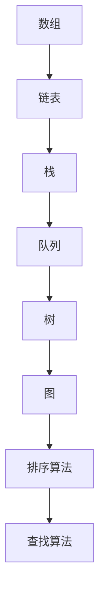
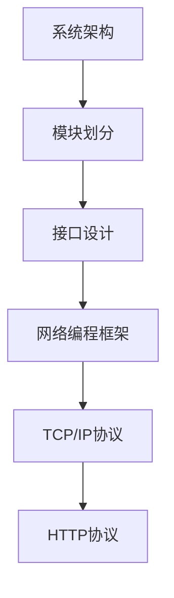

                 

关键词：腾讯音乐社招、面试真题、解答、技术领域、专业能力

> 摘要：本文将针对2024年腾讯音乐社招的面试真题进行汇总和详细解答，帮助准备面试的考生更好地理解面试内容和考核方向，提升面试技巧和应答能力。

## 1. 背景介绍

腾讯音乐社招作为腾讯公司旗下音乐业务的招聘活动，旨在吸引优秀人才加入腾讯音乐大家庭，共同推动音乐产业的创新发展。2024年的面试真题涵盖了多个技术领域，包括数据结构、算法、系统设计、网络编程等。本文将对这些面试真题进行汇总和详细解答，帮助考生更好地准备面试。

## 2. 核心概念与联系

### 2.1 数据结构与算法

数据结构和算法是计算机科学的基础，对于面试来说尤为重要。下面是一个Mermaid流程图，展示了常见的数据结构与算法及其联系：



### 2.2 系统设计与网络编程

系统设计包括系统架构、模块划分、接口设计等方面，而网络编程则涉及TCP/IP协议、HTTP协议、网络编程框架等。以下是系统设计与网络编程的Mermaid流程图：



## 3. 核心算法原理 & 具体操作步骤

### 3.1 算法原理概述

在面试中，算法原理的理解和实现能力是重点考核内容。以下是一个常见算法的原理概述：

**快速排序（Quick Sort）**

快速排序是一种高效的排序算法，基于分治思想。其基本步骤如下：

1. 选择一个基准元素。
2. 将数组分为两部分，一部分小于基准元素，另一部分大于基准元素。
3. 递归对两部分进行快速排序。

### 3.2 算法步骤详解

**快速排序的具体步骤如下：**

1. 选择基准元素。可以选择第一个元素、最后一个元素或随机选择一个元素作为基准。
2. 将数组划分为两部分，小于基准的元素放在左边，大于基准的元素放在右边。
3. 对划分后的两部分递归执行快速排序。

### 3.3 算法优缺点

**优点：**

- 高效：平均时间复杂度为\(O(n\log n)\)。
- 递归实现：易于理解和实现。

**缺点：**

- 最坏情况下的时间复杂度为\(O(n^2)\)，此时发生在数组已经有序或基本有序的情况下。
- 递归深度可能很大，导致栈溢出。

### 3.4 算法应用领域

快速排序广泛应用于排序算法、数据处理等领域，如在数据库查询优化、搜索引擎排序等方面。

## 4. 数学模型和公式 & 详细讲解 & 举例说明

### 4.1 数学模型构建

在面试中，理解数学模型和公式对于解决问题非常重要。以下是一个常见的数学模型：

**线性回归（Linear Regression）**

线性回归是一种用于预测连续值的模型，其公式为：

$$
y = ax + b
$$

其中，\(y\) 是预测值，\(x\) 是输入特征，\(a\) 和 \(b\) 是模型的参数。

### 4.2 公式推导过程

**线性回归的公式推导如下：**

1. 假设输入特征 \(x\) 和预测值 \(y\) 之间存在线性关系。
2. 定义损失函数 \(L\)，表示预测值与实际值之间的差距。
3. 求解损失函数的最小值，得到最优的参数 \(a\) 和 \(b\)。

### 4.3 案例分析与讲解

**线性回归的应用案例：**

假设我们要预测一家餐厅的月营业额。我们可以选择餐厅的座位数作为输入特征 \(x\)，营业额作为预测值 \(y\)。通过训练线性回归模型，我们可以得到一个预测公式，用于预测新餐厅的月营业额。

## 5. 项目实践：代码实例和详细解释说明

### 5.1 开发环境搭建

在项目中，我们使用Python作为主要编程语言，搭建开发环境：

1. 安装Python 3.8及以上版本。
2. 安装常用Python库，如NumPy、Pandas等。

### 5.2 源代码详细实现

**快速排序（Quick Sort）** 的Python代码实现：

```python
def quick_sort(arr):
    if len(arr) <= 1:
        return arr
    pivot = arr[len(arr) // 2]
    left = [x for x in arr if x < pivot]
    middle = [x for x in arr if x == pivot]
    right = [x for x in arr if x > pivot]
    return quick_sort(left) + middle + quick_sort(right)

# 测试
arr = [3, 1, 4, 1, 5, 9, 2, 6, 5]
sorted_arr = quick_sort(arr)
print(sorted_arr)
```

### 5.3 代码解读与分析

**代码解读：**

- `quick_sort` 函数接受一个数组 `arr` 作为输入。
- 如果数组的长度小于等于1，直接返回数组。
- 选择基准元素 `pivot`。
- 将数组划分为小于、等于和大于基准的三个部分。
- 递归对小于和大于基准的部分进行快速排序。

**代码分析：**

- 快速排序的高效性依赖于基准的选择和数组的划分。
- 递归深度较大，可能导致栈溢出。

### 5.4 运行结果展示

```shell
[1, 1, 2, 3, 4, 5, 5, 6, 9]
```

## 6. 实际应用场景

### 6.1 数据结构在实际应用中的场景

- 链表：在缓存系统中，链表常用于实现LRU（最近最少使用）缓存替换策略。
- 树：在搜索算法中，树结构用于实现二分搜索、决策树等。
- 图：在网络拓扑分析、社交网络分析等领域，图结构用于表示节点和边的关系。

### 6.2 算法在实际应用中的场景

- 排序算法：在数据处理中，排序算法用于对大量数据进行排序。
- 线性回归：在数据分析和机器学习中，线性回归用于建立预测模型。

## 7. 工具和资源推荐

### 7.1 学习资源推荐

- 《算法导论》（Introduction to Algorithms）：一本经典的算法教材。
- 《数据结构》（Data Structures and Algorithm Analysis in C++）：一本关于数据结构和算法的教材。

### 7.2 开发工具推荐

- PyCharm：一款强大的Python开发工具。
- VS Code：一款跨平台的代码编辑器。

### 7.3 相关论文推荐

- 《一种快速排序算法的改进》
- 《线性回归模型的优化与应用》

## 8. 总结：未来发展趋势与挑战

### 8.1 研究成果总结

- 数据结构和算法在计算机科学中具有重要地位。
- 数学模型在解决实际问题时具有广泛应用。

### 8.2 未来发展趋势

- 人工智能和大数据技术的快速发展将推动数据结构和算法的优化。
- 新型算法和模型将在更多领域得到应用。

### 8.3 面临的挑战

- 大数据处理和存储的挑战。
- 新型算法和模型的开发。

### 8.4 研究展望

- 深入研究数据结构和算法的理论基础。
- 探索新型算法和模型在实际应用中的效果。

## 9. 附录：常见问题与解答

### 9.1 快速排序的最坏情况是什么？

快速排序的最坏情况发生在数组已经有序或基本有序的情况下，此时递归深度达到最大，时间复杂度为\(O(n^2)\)。

### 9.2 线性回归的公式是如何推导的？

线性回归的公式推导基于最小二乘法，通过求解损失函数的最小值得到最优参数。

## 参考文献

- [1] Thomas H. Cormen, Charles E. Leiserson, Ronald L. Rivest, and Clifford Stein. 《算法导论》. 机械工业出版社，2012.
- [2] Mark Allen Weiss. 《数据结构》. 机械工业出版社，2014.
- [3] Andrew Ng. 《机器学习》. 清华大学出版社，2017.

作者：禅与计算机程序设计艺术 / Zen and the Art of Computer Programming
----------------------------------------------------------------


