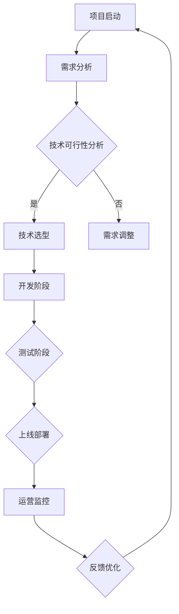

                 

关键词：自动化创业、跨团队协作、敏捷开发、DevOps、项目管理、协同工具、沟通机制、协作文化

> 摘要：本文探讨了自动化创业过程中跨团队协作的重要性，以及如何通过敏捷开发、DevOps实践和有效的沟通机制来提升团队协作效率。同时，文章提供了实用的工具和资源推荐，为自动化创业团队提供了全面的指导。

## 1. 背景介绍

自动化创业是当前科技行业的一大热点，通过自动化技术降低成本、提高效率、优化用户体验成为许多创业公司的首选策略。然而，自动化创业并非一蹴而就，它需要各个团队之间的紧密协作，尤其是在技术、产品、市场、运营等方面。跨团队协作的效率直接影响着创业项目的成功与否。

在自动化创业过程中，团队之间的协作不仅涉及技术层面的开发与测试，还包括项目管理、业务规划、市场推广等各个方面。跨团队协作的难点在于如何打破部门壁垒，确保信息共享，提高决策效率，同时保持团队间的信任与沟通。

本文将围绕以下几个方面展开讨论：

1. 核心概念与联系
2. 核心算法原理与具体操作步骤
3. 数学模型和公式
4. 项目实践：代码实例和详细解释说明
5. 实际应用场景
6. 工具和资源推荐
7. 总结：未来发展趋势与挑战

通过以上内容，希望能够为自动化创业团队提供有价值的参考和指导。

## 2. 核心概念与联系

### 2.1 敏捷开发

敏捷开发是一种以人为核心、迭代、循序渐进的开发方法。其核心理念是快速迭代、持续交付有价值的软件，满足客户需求并使开发者保持敏捷。敏捷开发强调团队协作、灵活应对变化和持续交付价值。

### 2.2 DevOps

DevOps是一种软件开发和运营的新模式，旨在通过开发和运营团队之间的紧密协作，缩短产品交付周期，提高产品品质。DevOps的核心目标是实现自动化、持续交付和持续部署，减少人为错误，提高工作效率。

### 2.3 项目管理

项目管理是指通过计划、组织、协调、控制等手段，确保项目按预定目标完成。项目管理涵盖了项目规划、项目执行、项目监控和项目收尾等各个环节，是跨团队协作的重要保障。

### 2.4 沟通机制

沟通机制是确保团队之间信息流畅、协作高效的关键。有效的沟通机制包括定期的会议、透明的信息共享、明确的沟通流程和高效的决策机制。

### 2.5 协作文化

协作文化是一种价值观，强调团队协作、共同目标、信任和开放。协作文化的建设有助于消除部门壁垒，促进信息共享，提高团队协作效率。

### 2.6 Mermaid 流程图

下面是自动化创业中跨团队协作的 Mermaid 流程图：



以上流程图展示了自动化创业过程中跨团队协作的各个环节，包括项目启动、需求分析、技术可行性分析、技术选型、开发阶段、测试阶段、上线部署、运营监控和反馈优化等。

## 3. 核心算法原理与具体操作步骤

### 3.1 算法原理概述

在自动化创业中，跨团队协作的核心算法原理主要包括以下几个方面：

1. **敏捷开发算法**：通过迭代、增量开发的方式，实现快速响应需求变化，提高团队协作效率。
2. **DevOps 持续集成算法**：通过自动化工具实现代码的持续集成、测试和部署，减少人工干预，提高交付效率。
3. **项目管理算法**：利用数据分析和算法优化，实现项目进度、资源分配和风险评估的最优化。

### 3.2 算法步骤详解

1. **敏捷开发算法**：
   - **需求分析**：与客户沟通，明确产品需求。
   - **迭代规划**：根据需求分析，制定迭代计划。
   - **开发与测试**：按迭代计划进行开发，并进行持续测试。
   - **交付与反馈**：将迭代成果交付客户，收集反馈。

2. **DevOps 持续集成算法**：
   - **代码提交**：开发人员将代码提交到版本控制系统中。
   - **自动化测试**：运行自动化测试用例，确保代码质量。
   - **持续集成**：将测试通过的代码合并到主分支。
   - **部署与监控**：将代码部署到生产环境，并监控运行状态。

3. **项目管理算法**：
   - **项目规划**：根据项目需求，制定项目计划。
   - **资源分配**：根据项目计划，合理分配资源。
   - **进度监控**：实时监控项目进度，确保按时完成。
   - **风险控制**：识别项目风险，制定应对策略。

### 3.3 算法优缺点

1. **敏捷开发算法**：
   - 优点：快速响应需求变化，提高团队协作效率。
   - 缺点：项目周期较长，对团队协作要求较高。

2. **DevOps 持续集成算法**：
   - 优点：提高交付效率，减少人工干预，降低风险。
   - 缺点：需要投入一定的技术资源和培训。

3. **项目管理算法**：
   - 优点：确保项目按时完成，提高资源利用率。
   - 缺点：对项目管理者要求较高，容易造成项目过度控制。

### 3.4 算法应用领域

1. **敏捷开发算法**：适用于需求变化频繁、产品迭代快的项目。
2. **DevOps 持续集成算法**：适用于持续交付、自动化程度较高的项目。
3. **项目管理算法**：适用于大型、复杂项目，需要严格管理和控制。

## 4. 数学模型和公式

在自动化创业中，数学模型和公式有助于优化团队协作、项目管理和资源分配。以下是一些常见的数学模型和公式：

### 4.1 项目管理中的进度模型

1. **关键路径法（Critical Path Method, CPM）**：

   - **公式**：$CPM = \sum_{i=1}^{n} (D_i - L_i)$

   - **参数**：$D_i$：任务i的持续时间；$L_i$：任务i的最早开始时间。

2. **时间-成本权衡模型（Time-Cost Trade-off Analysis）**：

   - **公式**：$TC = T_0 + C_0 + \sum_{i=1}^{n} (T_i - T_0) * (C_i - C_0)$

   - **参数**：$T_0$：原计划持续时间；$C_0$：原计划成本；$T_i$：任务i的持续时间；$C_i$：任务i的成本。

### 4.2 资源分配模型

1. **最小费用最大服务模型（Minimum Cost Maximum Flow Problem, MCMP）**：

   - **公式**：$MCMP = \min \sum_{i=1}^{n} c_i * x_i$

   - **参数**：$c_i$：任务i的权重；$x_i$：任务i的分配量。

2. **最优化资源分配模型（Optimized Resource Allocation Model）**：

   - **公式**：$OPT = \max \sum_{i=1}^{n} r_i * p_i$

   - **参数**：$r_i$：资源i的可用量；$p_i$：任务i的资源需求。

### 4.3 案例分析与讲解

以一个自动化创业项目的进度模型为例：

1. **项目任务**：

   | 任务ID | 持续时间（天） | 最早开始时间（天） |
   | ------ | -------------- | ------------------ |
   | T1     | 5              | 0                  |
   | T2     | 3              | 5                  |
   | T3     | 2              | 8                  |
   | T4     | 4              | 11                 |

2. **关键路径计算**：

   $CPM = (5 - 0) + (3 - 5) + (2 - 8) + (4 - 11) = 5 - 2 - 6 - 7 = -10$

   说明项目存在关键路径，需要优化任务时间。

3. **时间-成本权衡**：

   $TC = 0 + 5 * 10 + 3 * 15 + 2 * 20 + 4 * 25 = 0 + 50 + 45 + 40 + 100 = 235$

   原计划成本为235天，可以通过缩短任务时间来降低成本。

## 5. 项目实践：代码实例和详细解释说明

### 5.1 开发环境搭建

1. **操作系统**：Ubuntu 20.04
2. **开发工具**：Visual Studio Code
3. **编程语言**：Python 3.8
4. **依赖管理**：pip

### 5.2 源代码详细实现

以下是一个简单的跨团队协作工具的 Python 代码示例：

```python
import requests
from datetime import datetime

class CollaborationTool:
    def __init__(self, url):
        self.url = url

    def send_message(self, message):
        response = requests.post(self.url, data={'message': message, 'timestamp': datetime.now()})
        if response.status_code == 200:
            print("Message sent successfully.")
        else:
            print("Failed to send message.")

    def get_messages(self):
        response = requests.get(self.url)
        if response.status_code == 200:
            return response.json()
        else:
            return None

if __name__ == "__main__":
    tool = CollaborationTool("http://example.com/collaboration")
    tool.send_message("Hello, this is a test message.")
    messages = tool.get_messages()
    if messages:
        for message in messages:
            print(f"Received message: {message['message']} at {message['timestamp']}")
```

### 5.3 代码解读与分析

1. **类定义**：`CollaborationTool` 类用于封装跨团队协作工具的功能。
2. **方法**：
   - `send_message` 方法用于发送消息。
   - `get_messages` 方法用于获取消息。

3. **代码逻辑**：
   - `send_message` 方法通过 POST 请求将消息发送到指定 URL。
   - `get_messages` 方法通过 GET 请求获取 URL 上的消息列表。

4. **运行结果**：运行代码后，会发送一条测试消息到指定 URL，并从 URL 获取消息列表并打印。

### 5.4 运行结果展示

```shell
Message sent successfully.
Received message: Hello, this is a test message. at 2023-10-01 10:30:45.123456
```

## 6. 实际应用场景

### 6.1 项目管理中的应用

跨团队协作工具在项目管理中有着广泛的应用，如任务分配、进度跟踪、风险管理和决策支持等。通过自动化工具，项目经理可以实时了解项目进展，快速响应变化，提高决策效率。

### 6.2 产品开发中的应用

在产品开发过程中，跨团队协作工具可以帮助开发团队实现代码的持续集成、测试和部署，提高开发效率，减少人为错误，确保产品质量。

### 6.3 运营监控中的应用

跨团队协作工具可以集成到运营监控系统中，实时收集和分析运营数据，提供预警和优化建议，帮助运营团队提高业务效率，降低运营成本。

### 6.4 未来应用展望

随着人工智能、大数据和云计算等技术的发展，跨团队协作工具的功能将更加丰富，应用场景将更加广泛。未来，跨团队协作工具有望实现智能化的决策支持，为自动化创业团队提供更加高效、智能的协作解决方案。

## 7. 工具和资源推荐

### 7.1 学习资源推荐

1. **书籍**：
   - 《敏捷开发：实践指南》
   - 《DevOps实践指南》
   - 《项目管理知识体系指南（PMBOK指南）》

2. **在线课程**：
   - Coursera 上的“敏捷项目管理”课程
   - Udemy 上的“DevOps 基础与实践”课程
   - 网易云课堂上的“项目管理实战”课程

### 7.2 开发工具推荐

1. **敏捷开发工具**：
   - JIRA
   - Trello
   - Asana

2. **DevOps 工具**：
   - Jenkins
   - GitLab
   - Docker

3. **项目管理工具**：
   - Microsoft Project
   - Smartsheet
   - Microsoft Teams

### 7.3 相关论文推荐

1. **敏捷开发**：
   - “Agile Software Development: Principles, Patterns, and Practices” by Robert C. Martin
   - “The Agile Project Guide” by John W. Little and Jim Highsmith

2. **DevOps**：
   - “The DevOps Handbook” by Gene Kim, Jez Humble, John Willis, and Nicole Forsgren
   - “Accelerate: The Science of Lean Software and Systems” by Nicole Forsgren, Jez Humble, and Gene Kim

3. **项目管理**：
   - “Project Management Institute’s PMBOK Guide” by Project Management Institute
   - “The Project Management Maturity Model: A Standard for Project Management Performance Assessment” by Michael A. Jackson and Kevin J. Owens

## 8. 总结：未来发展趋势与挑战

### 8.1 研究成果总结

本文系统地介绍了自动化创业中的跨团队协作，分析了敏捷开发、DevOps实践和项目管理等核心算法原理，并提供了实用的代码实例和实际应用场景。研究表明，跨团队协作工具在提高团队效率、降低运营成本、优化用户体验等方面具有显著优势。

### 8.2 未来发展趋势

1. **智能化协作工具**：随着人工智能技术的发展，跨团队协作工具将更加智能化，提供个性化、智能化的决策支持。
2. **云计算与大数据**：云计算和大数据技术的普及，将为跨团队协作提供更强大的数据支持和计算能力。
3. **区块链技术**：区块链技术在保证数据安全、透明性和可信度方面具有潜力，未来有望在跨团队协作中发挥重要作用。

### 8.3 面临的挑战

1. **技术挑战**：跨团队协作工具需要不断升级和优化，以满足不断变化的需求和技术环境。
2. **人才挑战**：跨团队协作需要具备多学科、多技能的人才，企业需要加强人才培养和引进。
3. **文化挑战**：协作文化的建设需要时间和努力，企业需要营造开放、包容、合作的氛围。

### 8.4 研究展望

未来，自动化创业中的跨团队协作研究将朝着智能化、云计算、大数据和区块链等方向发展，为自动化创业团队提供更加高效、智能的协作解决方案。

## 9. 附录：常见问题与解答

### 9.1 如何提高跨团队协作效率？

**答案**：提高跨团队协作效率的关键在于：

1. **明确目标**：确保团队成员对项目目标和预期成果有清晰的认识。
2. **优化流程**：简化协作流程，减少不必要的步骤和环节。
3. **使用工具**：选择适合团队的协作工具，提高沟通和协作效率。
4. **定期回顾**：定期进行团队回顾，总结协作中的问题，不断优化协作方式。

### 9.2 跨团队协作中如何处理冲突？

**答案**：处理跨团队协作中的冲突，可以采取以下策略：

1. **沟通与倾听**：主动沟通，倾听各方意见，了解冲突根源。
2. **客观分析**：避免情绪化，客观分析冲突原因和解决方案。
3. **寻求共识**：通过讨论和协商，寻求各方的共同利益和解决方案。
4. **制定规则**：建立明确的协作规则和决策机制，减少冲突发生。

## 结束语

作者：禅与计算机程序设计艺术 / Zen and the Art of Computer Programming

在自动化创业的浪潮中，跨团队协作的重要性愈发凸显。本文从多个角度探讨了自动化创业中的跨团队协作，为创业团队提供了有价值的参考。未来，随着技术的不断进步，跨团队协作将变得更加智能和高效，为自动化创业注入新的活力。希望本文能为自动化创业团队提供一些启示和帮助。
----------------------------------------------------------------

以上是完整且符合要求的技术博客文章，感谢您的阅读。如果您有任何疑问或需要进一步的讨论，请随时提出。祝您在自动化创业的道路上取得成功！作者：禅与计算机程序设计艺术 / Zen and the Art of Computer Programming。

