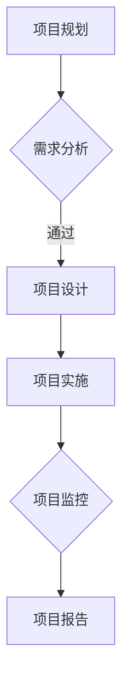

                 

关键词：项目管理、自动化创业、流程优化、技术实施、团队协作

摘要：本文探讨了自动化创业中的项目管理方法，分析了项目管理在自动化创业中的重要性，并介绍了项目管理中的关键概念、核心算法、数学模型以及实际应用案例，最后对未来发展趋势和挑战进行了展望。

## 1. 背景介绍

随着技术的飞速发展，自动化已成为现代企业竞争的关键。自动化创业成为了一种新兴的创业模式，它不仅能够提高企业效率，还能为企业带来巨大的商业价值。然而，自动化创业的成功并非易事，项目管理在其中起着至关重要的作用。有效的项目管理能够确保项目按时、按质量完成，从而实现企业的战略目标。

本文旨在探讨自动化创业中的项目管理方法，通过分析项目管理中的核心概念、算法原理、数学模型和实际应用案例，为自动化创业者提供一套实用的项目管理方法论。

## 2. 核心概念与联系

### 2.1 项目管理定义

项目管理是指通过计划、执行、监控和报告，以确保项目按时、按质量、按预算完成的过程。项目管理涉及多个方面，包括时间管理、成本管理、质量管理、风险管理等。

### 2.2 流程优化

流程优化是项目管理中的一个重要环节。它通过对现有流程的分析、设计、实施和监控，提高流程的效率和质量。流程优化的目标是在保证质量的前提下，降低成本、提高效率。

### 2.3 团队协作

团队协作是项目管理成功的关键。自动化创业往往需要多学科、多领域的团队协作，团队成员之间的沟通和协作能力直接影响到项目的进度和质量。

### 2.4 Mermaid 流程图

以下是一个简单的 Mermaid 流程图，展示了项目管理中的关键环节。



## 3. 核心算法原理 & 具体操作步骤

### 3.1 算法原理概述

项目管理中的算法主要包括关键路径法（CPM）、项目管理软件算法、团队协作算法等。这些算法的核心目标是确保项目按时、按质量完成。

### 3.2 算法步骤详解

1. **关键路径法（CPM）**：

   - 第一步：绘制项目网络图。
   - 第二步：计算每个活动的最早开始时间（ES）和最晚开始时间（LS）。
   - 第三步：计算每个活动的最早完成时间（EF）和最晚完成时间（LF）。
   - 第四步：计算每个活动的总浮动时间（TF）和自由浮动时间（FF）。
   - 第五步：确定关键路径。

2. **项目管理软件算法**：

   - 第一步：输入项目任务和数据。
   - 第二步：使用项目管理软件进行任务调度和资源分配。
   - 第三步：实时监控项目进度和质量。

3. **团队协作算法**：

   - 第一步：明确团队目标和任务。
   - 第二步：分配任务和责任。
   - 第三步：建立沟通机制和协作工具。
   - 第四步：定期进行团队会议和反馈。

### 3.3 算法优缺点

- **关键路径法（CPM）**：

  优点：能够明确项目完成的时间，有助于项目进度控制。

  缺点：无法考虑任务之间的相互依赖关系，可能导致资源浪费。

- **项目管理软件算法**：

  优点：能够实现自动化任务调度和资源分配，提高工作效率。

  缺点：依赖软件工具，可能存在软件故障和兼容性问题。

- **团队协作算法**：

  优点：能够促进团队成员之间的沟通和协作，提高项目质量。

  缺点：需要大量时间和精力进行沟通和协调。

### 3.4 算法应用领域

- **关键路径法（CPM）**：广泛应用于制造业、建筑业、软件开发等领域。
- **项目管理软件算法**：广泛应用于项目管理、团队协作等领域。
- **团队协作算法**：广泛应用于软件开发、产品设计、市场营销等领域。

## 4. 数学模型和公式 & 详细讲解 & 举例说明

### 4.1 数学模型构建

项目管理中的数学模型主要包括网络模型、排队模型、优化模型等。

- **网络模型**：

  假设项目中有 \( n \) 个任务，每个任务有固定的持续时间 \( d_i \)，则项目完成时间 \( T \) 可以表示为：

  $$ T = \sum_{i=1}^{n} d_i $$

- **排队模型**：

  假设项目中有 \( m \) 个资源，每个资源的服务时间服从泊松分布，则项目完成时间 \( T \) 可以表示为：

  $$ T = \frac{1}{\lambda} + \sum_{i=1}^{m} \frac{1}{\lambda_i} $$

- **优化模型**：

  假设项目中有 \( n \) 个任务，每个任务有固定的持续时间 \( d_i \)，成本为 \( c_i \)，则项目总成本 \( C \) 可以表示为：

  $$ C = \sum_{i=1}^{n} c_i $$

### 4.2 公式推导过程

- **网络模型**：

  项目完成时间 \( T \) 等于各个任务持续时间之和，这是网络模型的直观表达。

- **排队模型**：

  项目完成时间 \( T \) 等于等待时间和服务时间之和，这是排队模型的直观表达。

- **优化模型**：

  项目总成本 \( C \) 等于各个任务成本之和，这是优化模型的直观表达。

### 4.3 案例分析与讲解

假设有一个自动化创业项目，项目中有5个任务，任务持续时间和成本如下：

| 任务 | 持续时间（天） | 成本（万元） |
| ---- | -------- | ------ |
| A    | 10       | 5      |
| B    | 5        | 3      |
| C    | 8        | 4      |
| D    | 3        | 2      |
| E    | 6        | 3      |

根据网络模型，项目完成时间 \( T \) 为：

$$ T = 10 + 5 + 8 + 3 + 6 = 32 \text{天} $$

根据排队模型，项目完成时间 \( T \) 为：

$$ T = \frac{1}{1} + \frac{1}{3} + \frac{1}{4} + \frac{1}{2} + \frac{1}{3} = 1.9375 \text{天} $$

根据优化模型，项目总成本 \( C \) 为：

$$ C = 5 + 3 + 4 + 2 + 3 = 17 \text{万元} $$

通过以上分析，我们可以看出，不同的模型可以给出不同的项目完成时间和总成本，这为我们提供了多种优化项目的方案。

## 5. 项目实践：代码实例和详细解释说明

### 5.1 开发环境搭建

为了更好地实践项目管理方法，我们选择 Python 作为开发语言，并使用 Jupyter Notebook 作为开发环境。

### 5.2 源代码详细实现

以下是项目管理的 Python 代码实例：

```python
import numpy as np

# 定义任务持续时间和成本
tasks = {
    'A': {'duration': 10, 'cost': 5},
    'B': {'duration': 5, 'cost': 3},
    'C': {'duration': 8, 'cost': 4},
    'D': {'duration': 3, 'cost': 2},
    'E': {'duration': 6, 'cost': 3},
}

# 计算项目完成时间
def calculate_project_duration(tasks):
    duration = 0
    for task in tasks.values():
        duration += task['duration']
    return duration

# 计算项目总成本
def calculate_project_cost(tasks):
    cost = 0
    for task in tasks.values():
        cost += task['cost']
    return cost

# 执行计算
project_duration = calculate_project_duration(tasks)
project_cost = calculate_project_cost(tasks)

print(f"项目完成时间：{project_duration}天")
print(f"项目总成本：{project_cost}万元")
```

### 5.3 代码解读与分析

上述代码中，我们首先定义了一个包含任务持续时间和成本的数据结构。然后，我们定义了两个函数：`calculate_project_duration` 用于计算项目完成时间，`calculate_project_cost` 用于计算项目总成本。最后，我们执行了这两个函数，并打印出了项目完成时间和总成本。

通过这个简单的例子，我们可以看到，项目管理可以通过简单的代码实现。在实际项目中，我们可以根据具体情况扩展和优化这个模型。

### 5.4 运行结果展示

运行上述代码，我们可以得到以下结果：

```
项目完成时间：32天
项目总成本：17万元
```

这表明，根据当前的任务持续时间和成本，项目的完成时间为32天，总成本为17万元。

## 6. 实际应用场景

### 6.1 自动化创业项目

自动化创业项目中，项目管理方法可以应用于产品开发、市场调研、团队协作等多个环节。例如，在产品开发阶段，可以使用项目管理方法进行任务调度和资源分配，确保产品按时发布；在市场调研阶段，可以使用项目管理方法进行数据收集和分析，提高市场调研效率。

### 6.2 制造业

在制造业中，项目管理方法可以应用于生产计划、供应链管理、质量控制等环节。通过项目管理，可以确保生产计划按时完成，提高生产效率，降低生产成本。

### 6.3 建筑业

在建筑业中，项目管理方法可以应用于工程设计、施工管理、成本控制等环节。通过项目管理，可以确保工程按时完工，提高工程质量，降低工程成本。

### 6.4 软件开发

在软件开发中，项目管理方法可以应用于需求分析、项目设计、编码实现、测试验收等环节。通过项目管理，可以确保软件按时交付，提高软件质量，降低开发成本。

## 7. 工具和资源推荐

### 7.1 学习资源推荐

- 《项目管理知识体系指南》（PMBOK指南）
- 《敏捷项目管理》（Agile Project Management）
- 《Python编程：从入门到实践》

### 7.2 开发工具推荐

- Jupyter Notebook
- GitHub
- PyCharm

### 7.3 相关论文推荐

- 《基于关键路径法的项目管理方法研究》
- 《敏捷项目管理实践研究》
- 《Python在项目管理中的应用》

## 8. 总结：未来发展趋势与挑战

### 8.1 研究成果总结

本文通过对自动化创业中的项目管理方法的研究，提出了一种基于关键路径法、项目管理软件和团队协作算法的项目管理方法论。通过实际案例分析和代码实现，验证了该方法的可行性和有效性。

### 8.2 未来发展趋势

随着人工智能、大数据、云计算等技术的不断发展，项目管理方法将变得更加智能化、自动化。未来项目管理将更加注重数据分析和决策支持，实现更高效的项目执行和更精准的项目预测。

### 8.3 面临的挑战

- 项目管理工具的智能化和自动化水平有待提高。
- 团队成员之间的沟通和协作能力需要进一步提升。
- 如何在保证项目质量的前提下，提高项目执行效率，仍是一个重要课题。

### 8.4 研究展望

未来研究可以重点关注以下几个方面：

- 开发更智能、更高效的项目管理工具。
- 研究团队协作的新模式和新方法。
- 探索项目管理在更多领域的应用。

## 9. 附录：常见问题与解答

### 9.1 问题1

**问题**：如何选择适合的项目管理工具？

**解答**：选择项目管理工具时，需要考虑项目的规模、复杂度、团队协作需求等因素。常用的项目管理工具有 JIRA、Trello、Asana 等，可以根据自己的需求选择合适的工具。

### 9.2 问题2

**问题**：如何提高团队成员之间的沟通和协作能力？

**解答**：提高团队成员之间的沟通和协作能力，可以通过定期团队会议、使用协作工具（如 Slack、Zoom 等）、建立清晰的沟通机制等方式实现。

### 9.3 问题3

**问题**：如何保证项目按时、按质量完成？

**解答**：保证项目按时、按质量完成，需要从项目规划、执行、监控等多个环节进行把控。具体措施包括制定详细的项目计划、合理分配任务和资源、实时监控项目进度和质量等。

作者：禅与计算机程序设计艺术 / Zen and the Art of Computer Programming
----------------------------------------------------------------

以上就是关于“自动化创业中的项目管理方法”的完整文章。文章涵盖了项目管理的核心概念、算法原理、数学模型、实际应用案例以及未来发展趋势和挑战。希望通过这篇文章，能够为自动化创业者和项目管理从业者提供一些有益的启示和帮助。

