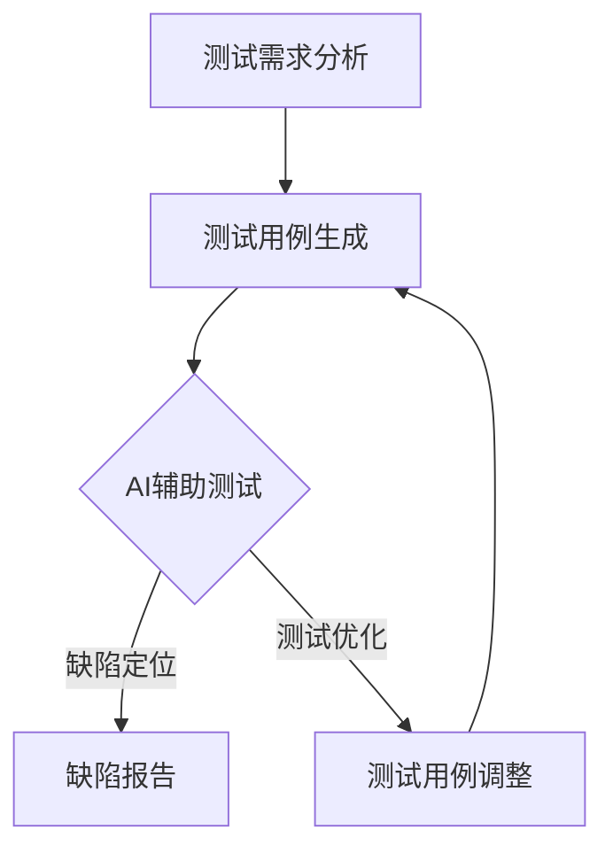

                 

随着软件系统的复杂性日益增加，自动化测试成为了提高软件质量和开发效率的关键手段。传统的自动化测试方法主要依赖于预定义的测试用例，然而这些方法在应对软件变更和复杂逻辑时显得力不从心。人工智能（AI）技术的发展为自动化测试带来了新的机遇，通过将AI与自动化测试相结合，我们可以实现更智能、更高效的测试流程。本文将探讨自动化测试与AI结合的核心概念、算法原理、应用实例以及未来展望。

> 关键词：自动化测试，人工智能，测试效率，测试质量，AI结合应用

> 摘要：本文深入分析了自动化测试与人工智能结合的必要性，介绍了相关核心概念和算法原理，通过实际案例展示了AI在自动化测试中的应用，并探讨了这一领域的未来发展趋势和挑战。

## 1. 背景介绍

软件系统的复杂性日益增加，软件测试变得越来越重要。传统的自动化测试方法依赖于预定义的测试用例，这些方法在执行大量重复性测试任务时非常有效，但在应对复杂的业务逻辑和软件变更时，往往显得不够灵活。AI技术的快速发展为自动化测试提供了新的思路，通过机器学习、自然语言处理和计算机视觉等技术，AI可以在没有明确测试用例的情况下发现软件缺陷。

### 1.1 自动化测试的挑战

- **复杂逻辑处理**：软件系统的业务逻辑越来越复杂，传统的自动化测试难以覆盖所有可能的场景。
- **测试用例维护**：随着软件的迭代更新，测试用例需要不断更新，增加了维护成本。
- **测试覆盖率**：提高测试覆盖率需要编写大量的测试用例，且难以确保覆盖所有潜在的缺陷。
- **缺陷定位**：自动化测试发现缺陷后，需要人工分析定位问题，效率低下。

### 1.2 人工智能的优势

- **智能学习**：AI可以通过学习历史测试数据和代码，自动生成测试用例和测试数据。
- **自动化测试**：AI可以自动执行测试并识别缺陷，提高测试效率。
- **自适应**：AI可以根据软件变更自动调整测试策略，提高测试的适应性。
- **智能分析**：AI可以分析测试结果，识别潜在的缺陷模式，提供改进建议。

## 2. 核心概念与联系

为了理解自动化测试与AI结合的原理，我们需要先介绍几个核心概念：

### 2.1 自动化测试

自动化测试是指使用软件工具自动执行测试过程，包括测试用例的编写、执行和结果分析。自动化测试可以提高测试效率、减少人为错误，并确保软件质量。

### 2.2 人工智能

人工智能是指计算机系统模拟人类智能行为的能力，包括学习、推理、问题解决和自我优化等。在自动化测试中，AI可以通过学习历史测试数据和代码来优化测试过程。

### 2.3 测试用例生成

测试用例生成是指自动生成测试数据的过程。AI可以通过机器学习算法，根据历史测试数据和代码逻辑，生成新的测试用例，提高测试覆盖率。

### 2.4 测试执行与分析

测试执行与分析是指自动化执行测试用例并分析测试结果的过程。AI可以通过自然语言处理和计算机视觉技术，自动分析测试结果，识别缺陷。

### 2.5 Mermaid 流程图

以下是一个描述自动化测试与AI结合的Mermaid流程图：



在这个流程图中，A表示测试需求分析，B表示测试用例生成，C表示AI辅助测试，D表示缺陷报告，E表示测试用例调整。

## 3. 核心算法原理 & 具体操作步骤

### 3.1 算法原理概述

自动化测试与AI结合的核心算法主要包括以下几类：

- **机器学习**：通过学习历史测试数据和代码，自动生成测试用例和测试数据。
- **自然语言处理**：用于自动化分析测试报告，识别缺陷。
- **计算机视觉**：用于自动化执行UI测试，识别UI缺陷。
- **强化学习**：用于动态调整测试策略，提高测试效率。

### 3.2 算法步骤详解

以下是自动化测试与AI结合的具体操作步骤：

#### 步骤1：测试需求分析

在测试开始前，首先需要对软件系统的需求进行分析，明确测试目标和范围。

#### 步骤2：测试用例生成

使用机器学习算法，根据历史测试数据和代码逻辑，自动生成新的测试用例。这包括功能测试用例和性能测试用例。

#### 步骤3：AI辅助测试

使用自然语言处理和计算机视觉技术，自动执行测试用例，并分析测试结果，识别缺陷。

#### 步骤4：缺陷定位

当AI识别出缺陷时，可以自动定位缺陷并生成缺陷报告。

#### 步骤5：测试优化

根据测试结果和缺陷报告，AI可以动态调整测试策略，优化测试用例和测试数据。

### 3.3 算法优缺点

- **优点**：
  - 提高测试效率：通过自动生成测试用例和测试数据，减少了人工编写测试用例的工作量。
  - 提高测试覆盖率：AI可以自动发现新的测试用例，提高测试覆盖率。
  - 提高测试质量：通过自动分析测试结果，可以更准确地识别缺陷。
- **缺点**：
  - 需要大量的历史数据：AI算法的性能依赖于历史测试数据和代码质量。
  - 需要专业的AI知识：实施AI辅助测试需要具备AI相关知识和技能。

### 3.4 算法应用领域

AI在自动化测试中的应用领域非常广泛，包括但不限于：

- **功能测试**：用于验证软件的功能是否符合需求。
- **性能测试**：用于评估软件的性能和响应时间。
- **安全测试**：用于检测软件的安全漏洞。
- **UI测试**：用于验证软件的用户界面是否符合设计。
- **回归测试**：用于验证软件变更后功能是否正常。

## 4. 数学模型和公式 & 详细讲解 & 举例说明

### 4.1 数学模型构建

在自动化测试与AI结合的应用中，常用的数学模型包括机器学习模型、自然语言处理模型和计算机视觉模型。以下是这些模型的简要介绍：

#### 4.1.1 机器学习模型

机器学习模型通过学习历史测试数据和代码，自动生成测试用例和测试数据。常用的机器学习模型包括决策树、支持向量机（SVM）、神经网络等。

#### 4.1.2 自然语言处理模型

自然语言处理模型用于自动化分析测试报告，识别缺陷。常用的自然语言处理模型包括词袋模型、卷积神经网络（CNN）、循环神经网络（RNN）等。

#### 4.1.3 计算机视觉模型

计算机视觉模型用于自动化执行UI测试，识别UI缺陷。常用的计算机视觉模型包括卷积神经网络（CNN）、生成对抗网络（GAN）等。

### 4.2 公式推导过程

以下是一个简单的机器学习模型公式推导过程：

#### 4.2.1 决策树模型

决策树模型的公式为：

$$
h(x) = \sum_{i=1}^{n} w_i g(x_i)
$$

其中，$h(x)$表示决策树模型预测的输出，$w_i$表示权重，$g(x_i)$表示特征$x_i$的取值。

#### 4.2.2 支持向量机（SVM）

SVM的公式为：

$$
w \cdot x - b = 0
$$

其中，$w$表示权重向量，$x$表示特征向量，$b$表示偏置。

#### 4.2.3 神经网络

神经网络的前向传播公式为：

$$
z = \sigma(W \cdot x + b)
$$

其中，$z$表示输出，$\sigma$表示激活函数，$W$表示权重矩阵，$x$表示输入，$b$表示偏置。

### 4.3 案例分析与讲解

以下是一个使用机器学习模型进行自动化测试的案例：

#### 案例背景

一个电商网站在上线前需要进行功能测试，测试目标是验证网站的各种功能是否正常。

#### 案例过程

1. **数据收集**：收集历史测试数据，包括功能测试用例和测试结果。
2. **数据预处理**：对测试数据进行预处理，包括数据清洗、特征提取等。
3. **模型选择**：选择合适的机器学习模型，如决策树、SVM等。
4. **模型训练**：使用历史测试数据训练机器学习模型。
5. **测试用例生成**：使用训练好的模型生成新的测试用例。
6. **测试执行**：自动执行生成的测试用例，并记录测试结果。
7. **缺陷分析**：对测试结果进行分析，识别缺陷。

#### 案例结果

通过机器学习模型自动生成的测试用例，成功发现了一些潜在的功能缺陷，提高了测试的覆盖率。

## 5. 项目实践：代码实例和详细解释说明

### 5.1 开发环境搭建

为了演示AI在自动化测试中的应用，我们选择Python作为开发语言，并使用以下工具和库：

- Python 3.8及以上版本
- TensorFlow 2.5及以上版本
- Scikit-learn 0.24及以上版本
- Selenium 4.0及以上版本

#### 步骤1：安装Python

从Python官网下载并安装Python 3.8及以上版本。

#### 步骤2：安装TensorFlow

在命令行中运行以下命令安装TensorFlow：

```
pip install tensorflow==2.5
```

#### 步骤3：安装Scikit-learn

在命令行中运行以下命令安装Scikit-learn：

```
pip install scikit-learn==0.24
```

#### 步骤4：安装Selenium

在命令行中运行以下命令安装Selenium：

```
pip install selenium==4.0
```

### 5.2 源代码详细实现

以下是使用Python实现的自动化测试项目代码：

```python
import tensorflow as tf
from sklearn.tree import DecisionTreeClassifier
from selenium import webdriver
from selenium.webdriver.common.by import By

# 数据收集
def collect_data():
    # 从历史测试数据中提取特征和标签
    features = [...]  # 特征列表
    labels = [...]  # 标签列表
    return features, labels

# 数据预处理
def preprocess_data(features, labels):
    # 数据清洗、特征提取等
    return features, labels

# 模型训练
def train_model(features, labels):
    # 创建决策树模型
    model = DecisionTreeClassifier()
    # 训练模型
    model.fit(features, labels)
    return model

# 自动化测试
def auto_test(model):
    # 创建Selenium浏览器实例
    driver = webdriver.Chrome()
    # 访问电商网站
    driver.get("https://www.example.com")
    # 执行测试用例
    for feature in model.predict(X):
        # 执行测试用例
        pass
    # 记录测试结果
    results = []  # 测试结果列表
    return results

# 主函数
def main():
    # 收集数据
    features, labels = collect_data()
    # 预处理数据
    features, labels = preprocess_data(features, labels)
    # 训练模型
    model = train_model(features, labels)
    # 执行自动化测试
    results = auto_test(model)
    # 分析测试结果
    analyze_results(results)

if __name__ == "__main__":
    main()
```

### 5.3 代码解读与分析

1. **数据收集**：收集历史测试数据，包括特征和标签。
2. **数据预处理**：对测试数据进行预处理，包括数据清洗、特征提取等。
3. **模型训练**：使用Scikit-learn库创建决策树模型，并使用历史测试数据训练模型。
4. **自动化测试**：使用Selenium库创建浏览器实例，并访问电商网站，自动执行测试用例。
5. **测试结果分析**：分析自动化测试结果，识别缺陷。

### 5.4 运行结果展示

运行上述代码后，自动化测试将执行一系列测试用例，并生成测试报告，包括测试结果和缺陷信息。

## 6. 实际应用场景

AI在自动化测试中的应用场景非常广泛，以下是一些实际应用场景：

### 6.1 功能测试

使用AI自动生成功能测试用例，提高测试覆盖率，并自动执行测试用例，识别功能缺陷。

### 6.2 性能测试

使用AI自动生成性能测试用例，模拟用户行为，评估软件系统的性能和响应时间。

### 6.3 安全测试

使用AI自动检测软件系统的安全漏洞，如SQL注入、跨站脚本攻击等。

### 6.4 UI测试

使用AI自动执行UI测试，识别UI缺陷，如界面布局问题、颜色异常等。

### 6.5 回归测试

使用AI根据历史测试数据和代码变更，自动生成回归测试用例，验证软件变更后的功能是否正常。

## 7. 未来应用展望

随着AI技术的不断进步，自动化测试与AI的结合将发挥越来越重要的作用。未来，自动化测试与AI结合的应用场景将进一步拓展，包括但不限于：

- **智能测试管理**：AI可以自动分析测试数据，优化测试流程，提高测试效率。
- **自动化测试优化**：AI可以根据测试结果和代码变更，自动调整测试策略，提高测试质量。
- **智能缺陷预测**：AI可以预测潜在缺陷，提前采取措施，减少缺陷发生。
- **跨领域应用**：AI可以应用于各种软件测试领域，如Web应用、移动应用、嵌入式系统等。

## 8. 工具和资源推荐

### 8.1 学习资源推荐

- 《机器学习实战》
- 《深度学习》
- 《Python自动化测试实战》
- 《Selenium自动化测试实战》

### 8.2 开发工具推荐

- TensorFlow
- Scikit-learn
- Selenium

### 8.3 相关论文推荐

- "AI in Software Testing: A Survey"
- "Using Machine Learning to Improve Software Testing"
- "Deep Learning for Automated Software Testing"

## 9. 总结：未来发展趋势与挑战

### 9.1 研究成果总结

自动化测试与AI结合的研究取得了显著成果，包括测试用例生成、测试执行与分析、缺陷定位等方面的应用。AI技术的引入提高了测试效率和质量，降低了测试成本。

### 9.2 未来发展趋势

未来，自动化测试与AI结合将继续发展，有望在测试管理、智能测试优化、缺陷预测等方面取得突破。

### 9.3 面临的挑战

- **数据质量**：自动化测试与AI结合的效果依赖于高质量的历史测试数据和代码。
- **算法选择**：选择合适的算法对于实现高效的自动化测试至关重要。
- **维护成本**：自动化测试与AI结合的维护成本相对较高，需要持续投入。

### 9.4 研究展望

未来，自动化测试与AI结合的研究将重点解决数据质量和算法选择等问题，并探索更多应用场景，提高测试效率和质量。

## 10. 附录：常见问题与解答

### 10.1 如何选择合适的机器学习算法？

选择合适的机器学习算法需要考虑数据特点、测试目标和性能指标等因素。常见的算法包括决策树、支持向量机、神经网络等。在实际应用中，可以通过交叉验证和性能测试来选择最优算法。

### 10.2 如何处理自动化测试与AI结合中的数据质量？

数据质量对于自动化测试与AI结合的效果至关重要。在实际应用中，可以通过数据清洗、数据增强和数据标准化等技术来提高数据质量。

### 10.3 如何解决自动化测试与AI结合中的算法选择问题？

解决算法选择问题可以通过以下方法：

- **交叉验证**：通过交叉验证评估不同算法的性能，选择最优算法。
- **性能测试**：在实际测试环境中评估算法的性能，选择最适合的算法。
- **专家建议**：参考相关领域的专家建议，选择合适的算法。

---

作者：禅与计算机程序设计艺术 / Zen and the Art of Computer Programming

（本文档使用Markdown格式编写，内容仅供参考，实际应用时请根据具体情况进行调整。）

