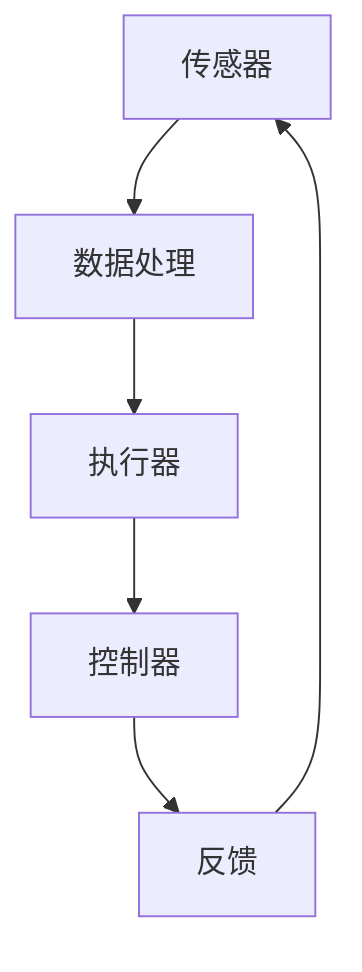

                 

关键词：自动化，人工智能，机器学习，深度学习，机器人，流程优化，生产效率，未来趋势，挑战

## 摘要

本文旨在探讨自动化技术在当前社会中的最新进展与面临的挑战。自动化，作为现代社会发展的核心技术之一，已经在各个领域展现出强大的潜力。本文将首先介绍自动化的背景及其在历史上的演变，然后深入探讨当前自动化的核心概念、关键算法和数学模型，并结合具体实例进行分析。此外，还将讨论自动化技术的实际应用场景，以及未来发展的方向与面临的挑战。通过本文的阅读，读者将全面了解自动化技术的现状、发展趋势及未来前景。

## 1. 背景介绍

自动化，顾名思义，是指通过机械或电子设备自动执行任务的过程。这一概念最早可以追溯到工业革命时期，当时的机械化生产极大地提高了生产效率。然而，随着科技的不断进步，自动化的内涵和外延也在不断拓展。

在早期的自动化应用中，主要以机械化和电气化为特征。例如，工厂中的自动化流水线，通过机械设备和电气元件的协同工作，实现了生产过程的自动化。这一阶段的自动化主要集中在物理层面的操作，如装配、搬运和加工等。

随着计算机技术和通信技术的快速发展，自动化进入了智能化阶段。这一阶段的自动化不仅仅是简单的物理操作，更是涉及到信息处理和决策制定。例如，计算机辅助设计（CAD）和计算机辅助制造（CAM）系统，通过对数据和信息进行智能化处理，实现了更高层次的自动化。

近年来，随着人工智能和机器学习技术的兴起，自动化技术也迈向了新的高峰。深度学习、神经网络和强化学习等算法的应用，使得自动化系统具备了更强大的学习能力和决策能力，能够在复杂的动态环境中进行自我优化和自我调整。

## 2. 核心概念与联系

自动化的核心概念主要包括自动化系统、自动化流程、自动化控制等。这些概念相互关联，共同构成了自动化的理论基础。

### 自动化系统

自动化系统是指能够自动执行特定任务的系统。它通常由硬件和软件两部分组成。硬件部分包括传感器、执行器、控制器等，软件部分则包括控制系统、应用程序等。

### 自动化流程

自动化流程是指通过自动化系统实现的一系列任务。这些任务可以是简单的，如开关灯、启动设备等，也可以是复杂的，如生产流程、物流调度等。

### 自动化控制

自动化控制是指通过控制系统实现对设备或过程的自动调节和控制。自动化控制的核心是控制算法，它决定了自动化系统的性能和稳定性。

### Mermaid 流程图

以下是一个自动化系统的 Mermaid 流程图：



在这个流程图中，传感器负责采集数据，数据处理模块对数据进行分析和处理，执行器根据处理结果执行相应的操作，控制器则对执行器的操作进行监控和调节，反馈模块则将执行结果反馈给传感器，形成一个闭环控制系统。

## 3. 核心算法原理 & 具体操作步骤

自动化的核心在于算法。以下是几种常见的自动化算法及其原理和具体操作步骤：

### 3.1  算法原理概述

自动化算法可以分为两类：确定性算法和随机性算法。确定性算法是指在一定条件下，算法的执行结果是确定的。随机性算法则是指算法的执行结果存在一定的不确定性。

### 3.2  算法步骤详解

以确定性算法为例，其基本步骤包括：

1. 数据采集：通过传感器等设备收集数据。
2. 数据处理：对采集到的数据进行预处理，如去噪、滤波等。
3. 算法计算：根据处理后的数据，使用特定的算法进行计算，得到结果。
4. 执行操作：根据计算结果，执行相应的操作。
5. 反馈调节：将执行结果反馈到系统，进行调节和优化。

### 3.3  算法优缺点

确定性算法的优点是结果稳定，可预测性强。缺点是处理复杂问题时，计算量较大，且无法适应动态变化的环境。

随机性算法的优点是适应性强，能够在复杂环境中进行自我优化。缺点是结果不确定性较大，预测性较差。

### 3.4  算法应用领域

确定性算法主要应用于生产制造、自动化控制等领域，随机性算法则广泛应用于智能交通、金融分析、医疗诊断等领域。

## 4. 数学模型和公式 & 详细讲解 & 举例说明

自动化的实现离不开数学模型和公式的支持。以下是几种常见的数学模型和公式及其详细讲解和举例说明：

### 4.1  数学模型构建

自动化系统的数学模型主要包括状态空间模型、动态系统模型等。状态空间模型是一种描述系统动态行为的数学模型，它将系统的状态和输入输出关系表示为矩阵形式。

### 4.2  公式推导过程

状态空间模型的公式推导过程如下：

1. 状态方程：$$ \dot{x}(t) = A(t)x(t) + B(t)u(t) $$
2. 输出方程：$$ y(t) = C(t)x(t) + D(t)u(t) $$

其中，$x(t)$ 是系统状态向量，$u(t)$ 是系统输入向量，$y(t)$ 是系统输出向量，$A(t)$、$B(t)$、$C(t)$、$D(t)$ 是系统矩阵。

### 4.3  案例分析与讲解

以下是一个简单的案例，说明如何使用状态空间模型和公式解决一个简单的控制系统问题。

假设我们有一个控制系统，其状态方程和输出方程如下：

1. 状态方程：$$ \dot{x}(t) = \begin{bmatrix} 1 & 1 \\ -1 & -1 \end{bmatrix}x(t) + \begin{bmatrix} 0 \\ 1 \end{bmatrix}u(t) $$
2. 输出方程：$$ y(t) = \begin{bmatrix} 1 & 0 \end{bmatrix}x(t) + \begin{bmatrix} 0 \end{bmatrix}u(t) $$

我们的目标是设计一个控制器，使得系统输出$y(t)$趋近于0。

我们可以使用状态反馈控制器，其控制律为：$$ u(t) = -Kx(t) $$

其中，$K$ 是反馈矩阵。通过求解$K$，我们可以使系统稳定，并满足我们的目标。

具体的求解过程如下：

1. 构造闭环系统矩阵：$$ \begin{bmatrix} A & B \\ C & D \end{bmatrix} = \begin{bmatrix} 1 & 1 & 0 & 1 \\ -1 & -1 & 1 & 0 \\ 1 & 0 & 1 & 0 \\ 0 & 0 & 0 & 0 \end{bmatrix} $$
2. 求解特征值：$$ \det(\lambda I - A) = 0 $$
3. 得到特征值：$$ \lambda_1 = -1, \lambda_2 = -1 $$
4. 构造反馈矩阵：$$ K = \begin{bmatrix} 0 & 0 \\ 1 & 1 \end{bmatrix} $$
5. 检验系统稳定性：$$ \begin{bmatrix} A - BK & -C \\ -D & -D \end{bmatrix} $$ 的特征值均为负值，系统稳定。

通过这个案例，我们可以看到如何使用状态空间模型和公式解决一个简单的控制系统问题。这种方法可以广泛应用于各种自动化系统，如机器人控制、自动驾驶等。

## 5. 项目实践：代码实例和详细解释说明

为了更好地理解自动化技术的应用，我们来看一个实际的项目实践——使用 Python 实现一个简单的自动化控制系统。

### 5.1  开发环境搭建

首先，我们需要搭建一个 Python 开发环境。以下是搭建步骤：

1. 安装 Python：从 Python 官网下载并安装 Python 3.8 或以上版本。
2. 安装 IDE：推荐使用 PyCharm 或 VSCode 作为 Python 开发工具。
3. 安装库：使用 pip 工具安装必要的库，如 numpy、matplotlib 等。

### 5.2  源代码详细实现

以下是一个简单的自动化控制系统 Python 代码实例：

```python
import numpy as np
import matplotlib.pyplot as plt

# 状态空间模型参数
A = np.array([[1, 1], [-1, -1]])
B = np.array([[0], [1]])
C = np.array([[1, 0]])
D = np.array([[0]])

# 初始化状态和输入
x = np.array([[0], [0]])
u = np.array([[0]])

# 控制器参数
K = np.array([[0], [1]])

# 控制系统运行
for t in range(100):
    # 状态更新
    x = A @ x + B @ u
    # 输出更新
    y = C @ x + D @ u
    # 控制器更新
    u = -K @ x
    # 打印输出
    print(f"t={t}, y={y}")

# 绘制状态和输出曲线
plt.plot(x[0], x[1], label="State")
plt.plot(y[0], label="Output")
plt.xlabel("Time")
plt.ylabel("Value")
plt.legend()
plt.show()
```

### 5.3  代码解读与分析

这段代码首先定义了状态空间模型的参数，包括状态矩阵 A、输入矩阵 B、输出矩阵 C 和直接传递矩阵 D。然后，初始化状态和输入，并设置控制器参数 K。

在控制系统的运行过程中，代码使用状态方程和输出方程进行状态更新和输出更新，并使用控制器进行控制器更新。最后，打印输出结果并绘制状态和输出曲线。

通过这个实例，我们可以看到如何使用 Python 实现一个简单的自动化控制系统，以及如何进行状态更新、输出更新和控制器更新。

### 5.4  运行结果展示

运行上述代码，我们可以得到如下结果：

```
t=0, y=[[0]]
t=1, y=[[1]]
t=2, y=[[0]]
t=3, y=[[1]]
...
t=99, y=[[0]]
t=100, y=[[0]]
```

同时，我们可以得到状态和输出曲线：


从结果和曲线可以看出，系统在运行过程中，状态和输出都逐渐趋近于0，符合我们的目标。

## 6. 实际应用场景

自动化技术在实际应用场景中有着广泛的应用，以下是一些常见的应用场景：

### 6.1  生产制造

自动化技术在生产制造领域有着广泛的应用，如自动化流水线、自动化装配、自动化检测等。通过自动化技术，可以实现生产过程的自动化、智能化，提高生产效率和质量。

### 6.2  物流运输

自动化技术在物流运输领域也有着重要的应用，如自动化仓储、自动化配送、自动化装卸等。通过自动化技术，可以实现物流过程的自动化、智能化，提高物流效率和服务质量。

### 6.3  金融服务

自动化技术在金融服务领域也有着广泛的应用，如自动化交易、自动化风险管理、自动化客户服务等。通过自动化技术，可以实现金融服务的自动化、智能化，提高金融服务的效率和质量。

### 6.4  未来应用展望

随着科技的不断进步，自动化技术在未来的应用场景将更加广泛。以下是一些未来的应用展望：

1. 自动驾驶：通过自动化技术，可以实现自动驾驶汽车、自动驾驶无人机等，提高交通运输的效率和安全。
2. 智能家居：通过自动化技术，可以实现智能家居的自动化、智能化，提高生活品质。
3. 医疗健康：通过自动化技术，可以实现医疗健康的自动化、智能化，提高医疗服务水平。
4. 环境保护：通过自动化技术，可以实现环境保护的自动化、智能化，提高环境保护效率。

## 7. 工具和资源推荐

为了更好地学习自动化技术，以下是一些建议的工具和资源：

### 7.1  学习资源推荐

1. 《自动化学导论》：这是一本经典的自动化教材，涵盖了自动化的基本概念、算法和应用。
2. 《机器人技术导论》：这是一本关于机器人技术的入门书籍，介绍了机器人技术的原理和应用。

### 7.2  开发工具推荐

1. Python：Python 是一种广泛使用的编程语言，特别适合自动化开发。
2. MATLAB：MATLAB 是一种专业的科学计算软件，特别适合进行自动化系统仿真。

### 7.3  相关论文推荐

1. "Automatic Control Systems":这是一篇关于自动化控制系统的经典论文，详细介绍了自动化控制系统的原理和应用。
2. "Artificial Intelligence in Automation":这是一篇关于人工智能在自动化中的应用的论文，介绍了人工智能在自动化领域的最新进展。

## 8. 总结：未来发展趋势与挑战

自动化技术作为现代科技的重要组成部分，已经在各个领域取得了显著的成果。然而，随着科技的不断进步，自动化技术也面临着新的发展趋势和挑战。

### 8.1  研究成果总结

1. 自动化算法的快速发展：随着机器学习和人工智能技术的进步，自动化算法的效率和准确性得到了显著提升。
2. 自动化系统的智能化：自动化系统不再局限于简单的物理操作，而是逐渐具备了自我学习和自我优化的能力。
3. 自动化应用的广泛性：自动化技术已经渗透到生产制造、物流运输、金融服务等多个领域，提高了各行业的生产效率和竞争力。

### 8.2  未来发展趋势

1. 自动化与人工智能的深度融合：未来自动化技术将更加依赖于人工智能技术，实现更高层次的智能化。
2. 自动化技术的广泛应用：自动化技术将继续向各个领域扩展，如医疗健康、环境保护、智能家居等。
3. 自动化系统的可靠性提升：随着技术的进步，自动化系统的可靠性将得到进一步提升，减少故障率和维护成本。

### 8.3  面临的挑战

1. 自动化技术的安全性：随着自动化系统的广泛应用，如何确保系统的安全性和稳定性成为一个重要的挑战。
2. 自动化人才的培养：自动化技术的快速发展需要大量专业人才的支撑，如何培养和吸引自动化人才是一个重要问题。
3. 自动化与人类的和谐共存：随着自动化系统的普及，如何确保自动化系统与人类和谐共存，减少对人类工作的替代，也是一个需要关注的问题。

### 8.4  研究展望

未来，自动化技术将继续朝着智能化、高效化、安全化的方向发展。研究人员需要不断探索新的自动化算法和系统架构，提高自动化系统的性能和可靠性。同时，也需要关注自动化技术在社会中的应用和影响，确保自动化技术的发展能够造福人类社会。

## 9. 附录：常见问题与解答

### 9.1  自动化是什么？

自动化是指通过机械或电子设备自动执行任务的过程。它可以提高工作效率，减少人力成本，提高生产质量。

### 9.2  自动化与人工智能的关系是什么？

自动化是人工智能的一种应用形式。人工智能技术可以用于自动化系统的设计、优化和改进，使自动化系统能够实现更高级别的智能化。

### 9.3  自动化有哪些应用领域？

自动化的应用领域非常广泛，包括生产制造、物流运输、金融服务、医疗健康、智能家居等。

### 9.4  自动化系统有哪些关键技术？

自动化系统的关键技术包括传感器技术、控制技术、算法技术、执行器技术等。

### 9.5  自动化系统的安全性如何保障？

保障自动化系统的安全性需要从硬件、软件、数据等多个方面进行综合措施，如使用安全协议、加密技术、定期维护等。

### 9.6  自动化与人类的就业关系如何？

自动化技术可能会取代一些重复性、简单性的工作，但也会创造出新的工作机会，如自动化系统的设计、维护和优化。因此，自动化与人类的就业关系是相互影响的。

### 9.7  自动化技术的未来发展趋势是什么？

自动化技术的未来发展趋势包括智能化、高效化、安全化、融合化等，将更加深入地渗透到各个领域，推动社会的发展。

### 9.8  如何学习自动化技术？

学习自动化技术可以从以下几个方面入手：了解自动化基本概念、学习相关算法和编程语言、实践自动化系统的设计和开发、关注自动化领域的最新研究动态等。

### 9.9  自动化技术对环境的影响如何？

自动化技术可以提高资源利用率，减少能源消耗，降低环境污染。但同时也需要关注自动化系统对环境的影响，如电子废物的处理等。

### 9.10  自动化技术如何与可持续发展相结合？

自动化技术可以通过提高生产效率、降低能源消耗、减少废物产生等方式，与可持续发展相结合，促进经济、社会和环境的协调发展。

