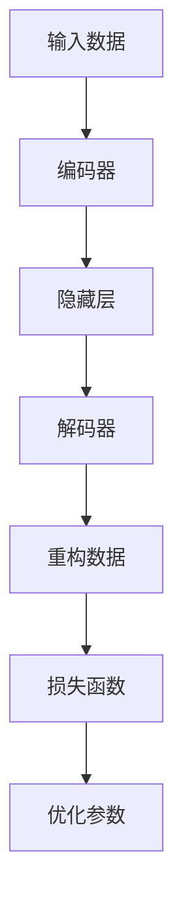

                 

关键词：自动编码器，神经网络，深度学习，数据压缩，降维，重构损失，反卷积神经网络

> 摘要：自动编码器是一种无监督学习算法，它通过学习输入数据的编码和解码过程，实现数据的降维和特征提取。本文将详细讲解自动编码器的原理、数学模型、实现步骤以及在实际应用中的效果和局限性。

## 1. 背景介绍

自动编码器（Autoencoder）是深度学习中的一种基础架构，它由两部分组成：编码器（Encoder）和解码器（Decoder）。自动编码器的主要目的是将输入数据通过编码器映射到一个较低维度的隐藏空间，然后再通过解码器将隐藏数据重构回原始数据。这一过程使得自动编码器能够自动发现数据中的有用特征，并在数据压缩、特征提取等方面有广泛应用。

自动编码器的概念最早可以追溯到1980年代，当时被用于图像数据的降维。随着深度学习技术的发展，自动编码器逐渐成为机器学习领域的热点。如今，自动编码器在图像、语音、文本等领域的应用已经取得了显著的成果。

## 2. 核心概念与联系

自动编码器的工作流程可以概括为以下三个步骤：

1. **编码（Encoding）**：输入数据通过编码器映射到一个隐藏层，这一层的数据称为编码特征。
2. **解码（Decoding）**：编码特征通过解码器重构回原始数据。
3. **损失函数（Loss Function）**：通过比较重构数据和原始数据的差异，计算损失函数以优化编码器和解码器的参数。

下面是自动编码器的 Mermaid 流程图：



### 2.1 编码器

编码器的作用是将输入数据映射到一个低维度的隐藏层。这个过程通常使用卷积神经网络（CNN）或循环神经网络（RNN）等结构来实现。

### 2.2 解码器

解码器的作用是将隐藏层的数据重构回原始数据。解码器的结构通常与编码器相同，只是层数和参数数量可以不同。

### 2.3 损失函数

自动编码器的损失函数通常采用均方误差（MSE）或交叉熵损失。MSE损失函数计算重构数据与原始数据之间差异的平方和，而交叉熵损失函数则计算重构数据与原始数据之间的交叉熵。

## 3. 核心算法原理 & 具体操作步骤

### 3.1 算法原理概述

自动编码器通过学习输入数据的编码和解码过程，实现数据的降维和特征提取。在训练过程中，编码器和解码器的参数不断优化，使得重构数据与原始数据之间的差异最小。

### 3.2 算法步骤详解

1. **初始化参数**：随机初始化编码器和解码器的参数。
2. **前向传播**：输入数据通过编码器映射到隐藏层。
3. **后向传播**：计算损失函数，并通过反向传播更新编码器和解码器的参数。
4. **优化参数**：使用梯度下降或其他优化算法优化编码器和解码器的参数。
5. **重复步骤2-4**，直到达到训练目标或迭代次数。

### 3.3 算法优缺点

**优点**：
- 无需标注数据，可以应用于无监督学习场景。
- 能够自动发现数据中的有用特征。
- 可以用于数据压缩和特征提取。

**缺点**：
- 需要大量的训练数据和计算资源。
- 对噪声敏感。

### 3.4 算法应用领域

自动编码器在图像处理、语音识别、自然语言处理等领域有广泛应用。例如，在图像分类任务中，自动编码器可以用于提取图像特征，从而提高分类效果；在语音识别任务中，自动编码器可以用于降低语音数据维度，提高识别准确率。

## 4. 数学模型和公式 & 详细讲解 & 举例说明

### 4.1 数学模型构建

自动编码器的数学模型主要包括编码器和解码器的参数初始化、前向传播和后向传播。

#### 4.1.1 编码器

编码器的参数初始化通常采用正态分布。假设输入数据为 \(X\)，编码器参数为 \(W_1, b_1, W_2, b_2\)，其中 \(W_1, W_2\) 为权重矩阵，\(b_1, b_2\) 为偏置向量。

前向传播公式如下：

\[ z_1 = W_1 \cdot X + b_1 \]
\[ a_1 = \sigma(z_1) \]

其中，\(\sigma\) 为激活函数，例如sigmoid函数或ReLU函数。

#### 4.1.2 解码器

解码器的参数初始化与编码器相同。假设输入数据为 \(X'\)，解码器参数为 \(W_3, b_3, W_4, b_4\)。

前向传播公式如下：

\[ z_2 = W_3 \cdot a_1 + b_3 \]
\[ a_2 = \sigma(z_2) \]

#### 4.1.3 损失函数

自动编码器的损失函数通常采用均方误差（MSE）或交叉熵损失。假设输入数据为 \(X\)，重构数据为 \(X'\)，损失函数为 \(L\)。

MSE损失函数公式如下：

\[ L = \frac{1}{n} \sum_{i=1}^{n} (X_i - X'_i)^2 \]

其中，\(n\) 为数据样本数量。

### 4.2 公式推导过程

#### 4.2.1 前向传播

编码器的损失函数可以通过反向传播得到。首先，我们需要计算编码器的梯度。

假设编码器的损失函数为 \(L_1\)，则：

\[ \frac{\partial L_1}{\partial z_1} = \frac{\partial L_1}{\partial a_1} \cdot \frac{\partial a_1}{\partial z_1} \]

由于激活函数为sigmoid函数，其导数为：

\[ \frac{\partial a_1}{\partial z_1} = \sigma'(z_1) \]

因此，编码器的梯度为：

\[ \frac{\partial L_1}{\partial z_1} = -2(X_i - X'_i) \cdot \sigma'(z_1) \]

#### 4.2.2 后向传播

编码器的梯度可以通过后向传播传递给解码器。假设解码器的损失函数为 \(L_2\)，则：

\[ \frac{\partial L_2}{\partial z_2} = \frac{\partial L_2}{\partial a_2} \cdot \frac{\partial a_2}{\partial z_2} \]

由于激活函数为sigmoid函数，其导数为：

\[ \frac{\partial a_2}{\partial z_2} = \sigma'(z_2) \]

因此，解码器的梯度为：

\[ \frac{\partial L_2}{\partial z_2} = -2(X_i - X'_i) \cdot \sigma'(z_2) \]

### 4.3 案例分析与讲解

假设我们有一个包含1000个样本的图像数据集，每个样本是一个28x28的灰度图像。我们使用自动编码器对图像数据进行降维，将每个样本压缩到一个10维的特征向量。

首先，我们需要定义编码器和解码器的结构。我们可以使用一个简单的卷积神经网络来实现自动编码器：

```python
import tensorflow as tf
from tensorflow.keras.layers import Input, Conv2D, MaxPooling2D, UpSampling2D
from tensorflow.keras.models import Model

# 编码器
input_img = Input(shape=(28, 28, 1))
x = Conv2D(32, (3, 3), activation='relu', padding='same')(input_img)
x = MaxPooling2D((2, 2), padding='same')(x)
x = Conv2D(32, (3, 3), activation='relu', padding='same')(x)
encoded = MaxPooling2D((2, 2), padding='same')(x)

# 解码器
x = Conv2D(32, (3, 3), activation='relu', padding='same')(encoded)
x = UpSampling2D((2, 2))(x)
x = Conv2D(32, (3, 3), activation='relu', padding='same')(x)
x = UpSampling2D((2, 2))(x)
decoded = Conv2D(1, (3, 3), activation='sigmoid', padding='same')(x)

# 自动编码器模型
autoencoder = Model(input_img, decoded)
autoencoder.compile(optimizer='adam', loss='binary_crossentropy')

autoencoder.summary()
```

接下来，我们使用自动编码器对图像数据进行训练：

```python
from tensorflow.keras.datasets import mnist
import numpy as np

# 加载MNIST数据集
(x_train, _), (x_test, _) = mnist.load_data()

# 预处理数据
x_train = x_train.astype('float32') / 255.
x_test = x_test.astype('float32') / 255.
x_train = np.reshape(x_train, (-1, 28, 28, 1))
x_test = np.reshape(x_test, (-1, 28, 28, 1))

# 训练自动编码器
autoencoder.fit(x_train, x_train,
                epochs=100,
                batch_size=256,
                shuffle=True,
                validation_data=(x_test, x_test))
```

在训练完成后，我们可以对测试数据进行降维：

```python
# 降维
encoded_imgs = autoencoder.predict(x_test)

# 可视化降维后的特征
import matplotlib.pyplot as plt

n = 10
m = 10
plt.figure(figsize=(20, 8))
for i in range(n):
    for j in range(m):
        ax = plt.subplot(n, m, i * m + j + 1)
        plt.imshow(encoded_imgs[i * m + j].reshape(10, 10), cmap='gray')
        plt.xticks([])
        plt.yticks([])
        plt.grid(False)
plt.show()
```

通过可视化降维后的特征，我们可以发现自动编码器成功提取了图像中的关键特征。

## 5. 项目实践：代码实例和详细解释说明

### 5.1 开发环境搭建

为了实现自动编码器的代码实例，我们需要搭建一个合适的开发环境。以下是搭建环境的基本步骤：

1. 安装Python（建议版本3.7及以上）。
2. 安装TensorFlow库：`pip install tensorflow`。
3. 安装其他必要库，如NumPy、Matplotlib等。

### 5.2 源代码详细实现

以下是自动编码器的源代码实现：

```python
import tensorflow as tf
from tensorflow.keras.layers import Input, Conv2D, MaxPooling2D, UpSampling2D
from tensorflow.keras.models import Model

# 编码器
input_img = Input(shape=(28, 28, 1))
x = Conv2D(32, (3, 3), activation='relu', padding='same')(input_img)
x = MaxPooling2D((2, 2), padding='same')(x)
x = Conv2D(32, (3, 3), activation='relu', padding='same')(x)
encoded = MaxPooling2D((2, 2), padding='same')(x)

# 解码器
x = Conv2D(32, (3, 3), activation='relu', padding='same')(encoded)
x = UpSampling2D((2, 2))(x)
x = Conv2D(32, (3, 3), activation='relu', padding='same')(x)
x = UpSampling2D((2, 2))(x)
decoded = Conv2D(1, (3, 3), activation='sigmoid', padding='same')(x)

# 自动编码器模型
autoencoder = Model(input_img, decoded)
autoencoder.compile(optimizer='adam', loss='binary_crossentropy')

autoencoder.summary()

# 加载MNIST数据集
(x_train, _), (x_test, _) = mnist.load_data()

# 预处理数据
x_train = x_train.astype('float32') / 255.
x_test = x_test.astype('float32') / 255.
x_train = np.reshape(x_train, (-1, 28, 28, 1))
x_test = np.reshape(x_test, (-1, 28, 28, 1))

# 训练自动编码器
autoencoder.fit(x_train, x_train,
                epochs=100,
                batch_size=256,
                shuffle=True,
                validation_data=(x_test, x_test))

# 降维
encoded_imgs = autoencoder.predict(x_test)

# 可视化降维后的特征
import matplotlib.pyplot as plt

n = 10
m = 10
plt.figure(figsize=(20, 8))
for i in range(n):
    for j in range(m):
        ax = plt.subplot(n, m, i * m + j + 1)
        plt.imshow(encoded_imgs[i * m + j].reshape(10, 10), cmap='gray')
        plt.xticks([])
        plt.yticks([])
        plt.grid(False)
plt.show()
```

### 5.3 代码解读与分析

- **编码器**：编码器由三个卷积层和一个最大池化层组成。卷积层用于提取图像特征，最大池化层用于降维。
- **解码器**：解码器由三个卷积层和两个上采样层组成。卷积层用于重建图像特征，上采样层用于恢复图像尺寸。
- **损失函数**：采用二进制交叉熵损失函数，用于衡量重构图像与原始图像之间的差异。
- **训练过程**：使用MNIST数据集对自动编码器进行训练，训练过程中优化编码器和解码器的参数。
- **降维与可视化**：使用自动编码器对测试数据进行降维，并将降维后的特征可视化展示。

## 6. 实际应用场景

自动编码器在实际应用中具有广泛的应用场景，以下列举几个典型应用：

1. **图像处理**：自动编码器可以用于图像数据的降维和特征提取，从而提高图像分类和识别的准确率。
2. **语音识别**：自动编码器可以用于语音数据的降维和特征提取，从而提高语音识别的准确率。
3. **自然语言处理**：自动编码器可以用于文本数据的降维和特征提取，从而提高文本分类和情感分析的准确率。
4. **异常检测**：自动编码器可以用于检测异常数据，从而提高异常检测的准确率。

## 7. 工具和资源推荐

### 7.1 学习资源推荐

1. **书籍**：《深度学习》（Goodfellow, Bengio, Courville 著）。
2. **在线课程**：Coursera、Udacity、edX 等平台上的深度学习和自动编码器相关课程。
3. **技术博客**：Medium、Towards Data Science、Analytics Vidhya 等平台上的深度学习和自动编码器相关博客。

### 7.2 开发工具推荐

1. **TensorFlow**：用于实现自动编码器的开源深度学习框架。
2. **PyTorch**：另一个流行的开源深度学习框架，具有更灵活的动态图模型。
3. **Keras**：基于TensorFlow和PyTorch的简洁易用的深度学习框架。

### 7.3 相关论文推荐

1. **"Deep Learning"**（Goodfellow, Bengio, Courville 著）。
2. **"Autoencoders: A Review"**（RBM、DCGAN、VAE等相关内容）。
3. **"Unsupervised Learning of Visual Features"**（用于图像分类和识别的自动编码器）。

## 8. 总结：未来发展趋势与挑战

### 8.1 研究成果总结

自动编码器作为一种无监督学习算法，已经在图像处理、语音识别、自然语言处理等领域取得了显著的成果。通过自动发现数据中的有用特征，自动编码器在数据压缩、特征提取等方面发挥了重要作用。

### 8.2 未来发展趋势

1. **多模态自动编码器**：结合多种数据类型（如文本、图像、语音）的自动编码器。
2. **生成式自动编码器**：如变分自编码器（VAE）和生成对抗网络（GAN），用于生成新的数据。
3. **自适应自动编码器**：能够自适应调整网络结构和参数的自动编码器。

### 8.3 面临的挑战

1. **计算资源消耗**：自动编码器训练需要大量的计算资源和时间。
2. **对噪声敏感**：自动编码器对噪声敏感，可能影响训练效果。
3. **模型可解释性**：自动编码器生成的特征难以解释，可能影响模型的应用。

### 8.4 研究展望

随着深度学习技术的发展，自动编码器在未来有望在更多领域发挥重要作用。通过不断改进算法和优化模型结构，自动编码器将在数据压缩、特征提取、异常检测等方面取得更好的性能。

## 9. 附录：常见问题与解答

### 9.1 自动编码器与主成分分析（PCA）的区别是什么？

**自动编码器**是一种基于深度学习的无监督学习算法，能够自动发现数据中的有用特征，而**PCA**是一种经典的线性降维方法，通过计算协方差矩阵的特征值和特征向量来实现降维。自动编码器具有更强的表达能力和非线性建模能力，而PCA在处理线性数据时效果较好。

### 9.2 自动编码器如何处理噪声？

自动编码器在训练过程中能够自动学习数据的特征，从而对噪声具有一定的鲁棒性。但是，当噪声占主导地位时，自动编码器的性能可能会受到影响。在实际应用中，可以通过增加训练数据、使用更强大的模型结构等方法来提高自动编码器对噪声的鲁棒性。

### 9.3 自动编码器能否用于分类任务？

自动编码器可以用于分类任务，但通常作为特征提取工具使用。通过训练自动编码器提取特征，然后将提取的特征输入到分类器中。自动编码器在特征提取过程中能够自动发现数据中的有用特征，从而提高分类效果。但是，自动编码器本身并不具备分类能力，需要结合其他分类算法一起使用。

----------------------------------------------------------------

以上是关于自动编码器（Autoencoder）原理与代码实例讲解的完整文章。希望对您有所帮助！如果您有任何问题或建议，欢迎在评论区留言。作者：禅与计算机程序设计艺术 / Zen and the Art of Computer Programming。

