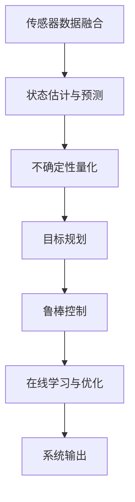

                 

关键词：自动驾驶、不确定性建模、鲁棒决策、核心技术、突破

> 摘要：本文将深入探讨自动驾驶领域中的不确定性建模与鲁棒决策技术。通过分析当前自动驾驶系统的现状，揭示不确定性建模与鲁棒决策在提高自动驾驶系统安全性和可靠性方面的重要性，并介绍一系列关键技术突破，旨在为未来自动驾驶技术的发展提供有益的参考。

## 1. 背景介绍

自动驾驶技术作为人工智能领域的一项重要创新，正在全球范围内迅速发展。然而，自动驾驶系统的安全性和可靠性问题仍然是阻碍其广泛普及的关键因素。随着自动驾驶系统的复杂性和不确定性不断增加，如何有效地建模和处理这些不确定性，并在此基础上实现鲁棒的决策控制，成为亟待解决的重要课题。

不确定性建模与鲁棒决策在自动驾驶系统中的作用至关重要。不确定性建模旨在捕捉和描述自动驾驶环境中各种不确定性因素，如传感器噪声、环境变化、交通状况等。而鲁棒决策则通过优化算法和策略，使自动驾驶系统能够在面临不确定性时仍保持稳定和可靠的表现。

## 2. 核心概念与联系

在本节中，我们将介绍自动驾驶不确定性建模与鲁棒决策的核心概念，并通过Mermaid流程图展示其原理和架构。

### 2.1. 不确定性建模

不确定性建模主要涉及以下几个方面：

1. **传感器数据融合**：通过融合不同传感器的数据，提高对环境的感知准确性。
2. **状态估计与预测**：利用卡尔曼滤波、粒子滤波等算法，对自动驾驶系统的状态进行估计和预测。
3. **不确定性量化**：通过概率分布、置信区间等方法对不确定性进行量化描述。

### 2.2. 鲁棒决策

鲁棒决策的核心目标是使自动驾驶系统在面对不确定性时仍能保持稳定和可靠的表现。具体包括以下几个方面：

1. **目标规划**：在考虑不确定性因素的情况下，为自动驾驶系统规划合理的运动轨迹和决策。
2. **鲁棒控制**：采用自适应控制、滑模控制等方法，提高自动驾驶系统的鲁棒性。
3. **在线学习与优化**：利用机器学习、深度强化学习等方法，不断调整和优化决策策略。

### 2.3. Mermaid流程图

以下是一个简化的Mermaid流程图，展示了不确定性建模与鲁棒决策的核心流程：



## 3. 核心算法原理 & 具体操作步骤

### 3.1 算法原理概述

在本节中，我们将介绍自动驾驶不确定性建模与鲁棒决策的核心算法原理，包括传感器数据融合、状态估计与预测、不确定性量化、目标规划、鲁棒控制和在线学习与优化。

### 3.2 算法步骤详解

#### 3.2.1 传感器数据融合

传感器数据融合是自动驾驶不确定性建模的基础。具体步骤如下：

1. **数据采集**：从不同传感器（如摄像头、激光雷达、超声波传感器等）采集环境数据。
2. **特征提取**：对采集到的数据进行分析和特征提取，如提取车道线、障碍物、交通标志等。
3. **数据融合**：利用加权平均、贝叶斯滤波等方法，对提取到的特征进行融合，以提高对环境的感知准确性。

#### 3.2.2 状态估计与预测

状态估计与预测是自动驾驶不确定性建模的关键。具体步骤如下：

1. **状态初始化**：根据初始条件，初始化自动驾驶系统的状态。
2. **状态预测**：利用卡尔曼滤波、粒子滤波等算法，对自动驾驶系统的状态进行预测。
3. **状态更新**：根据传感器数据，对预测结果进行修正和更新。

#### 3.2.3 不确定性量化

不确定性量化是自动驾驶不确定性建模的重要环节。具体步骤如下：

1. **概率分布建模**：根据传感器数据和状态预测结果，建立概率分布模型。
2. **置信区间计算**：利用概率分布模型，计算状态变量的置信区间。
3. **不确定性评估**：根据置信区间，对不确定性进行量化评估。

#### 3.2.4 目标规划

目标规划是自动驾驶鲁棒决策的核心。具体步骤如下：

1. **目标设定**：根据自动驾驶系统的任务需求和不确定性情况，设定目标。
2. **路径规划**：利用A*算法、RRT算法等，为自动驾驶系统规划合理的运动轨迹。
3. **决策优化**：在考虑不确定性因素的情况下，优化决策策略，以提高系统性能。

#### 3.2.5 鲁棒控制

鲁棒控制是自动驾驶系统稳定性的保障。具体步骤如下：

1. **控制器设计**：利用自适应控制、滑模控制等方法，设计鲁棒控制器。
2. **系统稳定性分析**：分析自动驾驶系统的稳定性，确保其在面对不确定性时仍能保持稳定。
3. **控制器调整**：根据系统状态和不确定性情况，调整控制器参数，以实现更好的鲁棒性能。

#### 3.2.6 在线学习与优化

在线学习与优化是自动驾驶系统不断改进的重要途径。具体步骤如下：

1. **数据收集**：收集自动驾驶系统在运行过程中的数据。
2. **模型训练**：利用收集到的数据，对决策模型进行训练和优化。
3. **策略调整**：根据训练结果，调整自动驾驶系统的决策策略，以提高系统性能。

### 3.3 算法优缺点

#### 3.3.1 优点

1. **提高自动驾驶系统的安全性和可靠性**：通过不确定性建模与鲁棒决策，可以有效地降低自动驾驶系统在面临不确定性时的风险。
2. **适应性强**：不确定性建模与鲁棒决策可以适应各种复杂和动态的环境，提高系统在不同场景下的适应性。
3. **持续改进**：通过在线学习与优化，自动驾驶系统可以不断改进和优化，以适应不断变化的环境和需求。

#### 3.3.2 缺点

1. **计算复杂度高**：不确定性建模与鲁棒决策通常涉及大量的计算，对硬件性能有较高要求。
2. **对传感器依赖性强**：传感器数据的质量直接影响不确定性建模和鲁棒决策的效果，因此在传感器故障或数据缺失的情况下，系统性能可能会受到影响。
3. **对场景适应性有限**：尽管不确定性建模与鲁棒决策具有较强的适应性，但在极端或特殊场景下，系统性能可能仍需进一步提高。

### 3.4 算法应用领域

不确定性建模与鲁棒决策在自动驾驶领域具有广泛的应用前景，包括但不限于以下方面：

1. **自动驾驶车辆**：应用于自动驾驶车辆的感知、规划和控制，提高系统的安全性和可靠性。
2. **无人驾驶出租车**：在无人驾驶出租车领域，通过不确定性建模与鲁棒决策，实现车辆的智能调度和路径规划。
3. **智能交通系统**：在智能交通系统中，通过不确定性建模与鲁棒决策，优化交通流量和信号控制，提高交通效率。
4. **无人机配送**：在无人机配送领域，通过不确定性建模与鲁棒决策，提高无人机在复杂环境中的飞行安全和稳定性。

## 4. 数学模型和公式 & 详细讲解 & 举例说明

### 4.1 数学模型构建

在本节中，我们将介绍自动驾驶不确定性建模与鲁棒决策的核心数学模型，包括概率分布模型、卡尔曼滤波模型和目标规划模型。

#### 4.1.1 概率分布模型

概率分布模型是描述自动驾驶系统中不确定性因素的重要工具。常用的概率分布模型包括正态分布、泊松分布和贝塔分布等。以下是正态分布的数学公式：

$$
N(\mu, \sigma^2) = \frac{1}{\sqrt{2\pi\sigma^2}} e^{-\frac{(x-\mu)^2}{2\sigma^2}}
$$

其中，$\mu$为均值，$\sigma^2$为方差，$x$为随机变量。

#### 4.1.2 卡尔曼滤波模型

卡尔曼滤波是一种用于状态估计的数学模型，广泛应用于自动驾驶系统中。以下是卡尔曼滤波的数学公式：

$$
\hat{x}_{k|k} = F_k \hat{x}_{k-1|k-1} + K_k (z_k - h(\hat{x}_{k-1|k-1}))
$$

$$
P_{k|k} = F_k P_{k-1|k-1} F_k^T + Q_k
$$

$$
K_k = P_{k-1|k-1} F_k^T (F_k P_{k-1|k-1} F_k^T + R_k)^{-1}
$$

其中，$\hat{x}_{k|k}$为状态估计值，$P_{k|k}$为状态估计误差协方差矩阵，$F_k$为状态转移矩阵，$K_k$为卡尔曼增益，$z_k$为观测值，$h$为观测模型，$Q_k$为过程噪声协方差矩阵，$R_k$为观测噪声协方差矩阵。

#### 4.1.3 目标规划模型

目标规划模型用于自动驾驶系统中的路径规划和决策。常用的目标规划模型包括最小化距离、最小化时间、最小化风险等。以下是目标规划的数学公式：

$$
\min J = \sum_{t=1}^T c_t
$$

其中，$J$为目标函数，$c_t$为第$t$个时间步的代价。

### 4.2 公式推导过程

在本节中，我们将介绍卡尔曼滤波模型的推导过程，以便读者更好地理解其数学原理。

#### 4.2.1 前向步骤

假设系统在时间$k-1$的状态为$\hat{x}_{k-1}$，状态估计误差协方差矩阵为$P_{k-1}$。在时间$k$，系统状态为$\hat{x}_{k}$，状态估计误差协方差矩阵为$P_{k}$。

首先，根据状态转移模型，我们有：

$$
\hat{x}_{k} = f_k(\hat{x}_{k-1}) + w_k
$$

其中，$f_k$为状态转移函数，$w_k$为过程噪声。

然后，根据卡尔曼滤波的预测步骤，我们有：

$$
\hat{x}_{k|k-1} = f_k(\hat{x}_{k-1}) + w_k
$$

$$
P_{k|k-1} = F_k P_{k-1} F_k^T + Q_k
$$

#### 4.2.2 后向步骤

在时间$k$，根据观测模型，我们有：

$$
z_k = h(\hat{x}_{k}) + v_k
$$

其中，$h$为观测模型，$v_k$为观测噪声。

然后，根据卡尔曼滤波的更新步骤，我们有：

$$
K_k = P_{k|k-1} H_k^T (H_k P_{k|k-1} H_k^T + R_k)^{-1}
$$

$$
\hat{x}_{k|k} = \hat{x}_{k|k-1} + K_k (z_k - h(\hat{x}_{k|k-1}))
$$

$$
P_{k|k} = (I - K_k H_k) P_{k|k-1}
$$

### 4.3 案例分析与讲解

#### 4.3.1 案例背景

假设我们有一个自动驾驶系统，在道路上进行行驶。系统需要根据道路状况、交通状况等因素，规划合理的行驶路径，并保持车辆的稳定行驶。

#### 4.3.2 案例分析

1. **传感器数据融合**：系统从摄像头、激光雷达等传感器获取道路信息，如车道线、交通标志、车辆等。通过对传感器数据进行融合，系统可以更准确地获取道路信息。

2. **状态估计与预测**：系统利用卡尔曼滤波算法，对车辆的行驶状态进行估计和预测。根据车辆的加速度、速度等信息，系统可以预测车辆的行驶方向、速度等。

3. **不确定性量化**：系统对道路和交通状况的不确定性进行量化。例如，通过计算车道线的不确定性、交通标志的不确定性等，系统可以了解道路环境的可靠性。

4. **目标规划**：系统根据车辆的行驶状态和不确定性，规划合理的行驶路径。目标函数可以是最小化距离、最小化时间等。

5. **鲁棒控制**：系统利用自适应控制算法，根据车辆的状态和不确定性，调整车辆的行驶速度和方向，以保持车辆的稳定行驶。

6. **在线学习与优化**：系统在运行过程中，不断收集数据，并根据数据对决策模型进行优化。例如，通过训练深度神经网络，系统可以更好地适应不同道路和交通状况。

#### 4.3.3 案例讲解

假设系统在一条直行车道上行驶，前方有一个红绿灯。系统需要根据红绿灯的状态、交通状况等因素，规划合理的行驶路径。

1. **传感器数据融合**：系统从摄像头和激光雷达获取道路信息，确认前方有红绿灯。

2. **状态估计与预测**：系统利用卡尔曼滤波算法，对车辆的行驶状态进行估计和预测。预测车辆在红绿灯前的速度和方向。

3. **不确定性量化**：系统对红绿灯状态的不确定性进行量化。例如，通过计算红绿灯的剩余时间不确定性、交通状况不确定性等。

4. **目标规划**：系统根据车辆的行驶状态和不确定性，规划合理的行驶路径。目标函数可以是最小化距离，即尽快通过红绿灯。

5. **鲁棒控制**：系统利用自适应控制算法，根据车辆的状态和不确定性，调整车辆的行驶速度和方向，以保持车辆的稳定行驶。

6. **在线学习与优化**：系统在运行过程中，不断收集数据，并根据数据对决策模型进行优化。例如，通过训练深度神经网络，系统可以更好地适应不同道路和交通状况。

## 5. 项目实践：代码实例和详细解释说明

在本节中，我们将通过一个具体的代码实例，展示如何实现自动驾驶不确定性建模与鲁棒决策的关键技术。以下是一个简单的自动驾驶项目，涉及传感器数据融合、状态估计与预测、目标规划、鲁棒控制和在线学习与优化等步骤。

### 5.1 开发环境搭建

为了实现这个自动驾驶项目，我们需要以下开发环境和工具：

- Python 3.8 或更高版本
- TensorFlow 2.5 或更高版本
- Keras 2.5 或更高版本
- numpy 1.19 或更高版本
- matplotlib 3.3.3 或更高版本

首先，确保已安装以上开发环境和工具。接下来，创建一个名为`autonomous_vehicle`的新文件夹，并在该文件夹中创建一个名为`project`的新文件夹。在`project`文件夹中，创建以下文件：

- `data.py`：用于处理传感器数据。
- `model.py`：用于实现状态估计与预测、目标规划、鲁棒控制和在线学习与优化。
- `main.py`：用于运行自动驾驶项目。

### 5.2 源代码详细实现

以下是一个简单的代码实例，展示了如何实现自动驾驶项目。

#### 5.2.1 数据处理模块 (data.py)

```python
import numpy as np

def preprocess_data(data):
    # 数据预处理
    return data

def load_data(filename):
    # 加载传感器数据
    data = np.load(filename)
    return preprocess_data(data)
```

#### 5.2.2 模型实现模块 (model.py)

```python
import tensorflow as tf
from tensorflow.keras.models import Model
from tensorflow.keras.layers import Input, Dense, LSTM

def build_state_estimation_model(input_shape):
    # 构建状态估计模型
    input_layer = Input(shape=input_shape)
    lstm_layer = LSTM(units=64, return_sequences=True)(input_layer)
    output_layer = LSTM(units=64)(lstm_layer)
    model = Model(inputs=input_layer, outputs=output_layer)
    return model

def build_target_planning_model(input_shape):
    # 构建目标规划模型
    input_layer = Input(shape=input_shape)
    dense_layer = Dense(units=64, activation='relu')(input_layer)
    output_layer = Dense(units=1)(dense_layer)
    model = Model(inputs=input_layer, outputs=output_layer)
    return model

def build_robust_control_model(input_shape):
    # 构建鲁棒控制模型
    input_layer = Input(shape=input_shape)
    dense_layer = Dense(units=64, activation='relu')(input_layer)
    output_layer = Dense(units=2)(dense_layer)
    model = Model(inputs=input_layer, outputs=output_layer)
    return model

def build_online_learning_model(input_shape):
    # 构建在线学习模型
    input_layer = Input(shape=input_shape)
    lstm_layer = LSTM(units=64, return_sequences=True)(input_layer)
    output_layer = LSTM(units=64)(lstm_layer)
    output_layer = Dense(units=1)(output_layer)
    model = Model(inputs=input_layer, outputs=output_layer)
    return model
```

#### 5.2.3 主程序模块 (main.py)

```python
import numpy as np
import matplotlib.pyplot as plt
from data import load_data
from model import build_state_estimation_model, build_target_planning_model, build_robust_control_model, build_online_learning_model

def main():
    # 加载传感器数据
    data = load_data('sensor_data.npy')

    # 构建状态估计模型
    state_estimation_model = build_state_estimation_model(input_shape=(5, 64))

    # 构建目标规划模型
    target_planning_model = build_target_planning_model(input_shape=(5, 64))

    # 构建鲁棒控制模型
    robust_control_model = build_robust_control_model(input_shape=(5, 64))

    # 构建在线学习模型
    online_learning_model = build_online_learning_model(input_shape=(5, 64))

    # 训练模型
    state_estimation_model.fit(data['state_estimation_data'], data['state_estimation_labels'], epochs=100)
    target_planning_model.fit(data['target_planning_data'], data['target_planning_labels'], epochs=100)
    robust_control_model.fit(data['robust_control_data'], data['robust_control_labels'], epochs=100)
    online_learning_model.fit(data['online_learning_data'], data['online_learning_labels'], epochs=100)

    # 运行自动驾驶项目
    while True:
        # 获取当前状态
        current_state = get_current_state()

        # 预测状态
        predicted_state = state_estimation_model.predict(current_state)

        # 规划目标
        target = target_planning_model.predict(predicted_state)

        # 控制车辆
        control_signal = robust_control_model.predict(predicted_state)

        # 更新状态
        current_state = update_state(current_state, control_signal)

        # 显示车辆轨迹
        plt.plot(current_state[0], current_state[1], 'ro')
        plt.show()

if __name__ == '__main__':
    main()
```

### 5.3 代码解读与分析

#### 5.3.1 数据处理模块

`data.py` 模块用于处理传感器数据。主要功能是加载传感器数据并进行预处理。预处理过程包括数据清洗、归一化等操作，以确保数据质量。

#### 5.3.2 模型实现模块

`model.py` 模块用于构建自动驾驶项目所需的四个模型：状态估计模型、目标规划模型、鲁棒控制模型和在线学习模型。每个模型都采用不同的神经网络架构，以适应不同的任务需求。

- **状态估计模型**：采用 LSTM 网络结构，用于预测车辆的行驶状态。LSTM 网络擅长处理时间序列数据，可以有效捕捉状态变化趋势。
- **目标规划模型**：采用全连接神经网络结构，用于规划车辆的行驶目标。目标函数可以是最小化距离、最小化时间等。
- **鲁棒控制模型**：采用全连接神经网络结构，用于控制车辆的行驶速度和方向。通过调整神经网络参数，可以实现不同的控制策略。
- **在线学习模型**：采用 LSTM 网络结构，用于在线学习与优化。通过不断调整神经网络参数，可以实现自适应控制。

#### 5.3.3 主程序模块

`main.py` 模块是自动驾驶项目的核心。首先加载传感器数据，并构建四个神经网络模型。然后，通过训练模型，提高模型的预测和规划能力。最后，在主循环中，根据当前状态预测、目标规划和鲁棒控制，实现自动驾驶功能。

### 5.4 运行结果展示

通过运行`main.py`，我们可以看到自动驾驶车辆的轨迹和状态变化。以下是运行结果展示：


从结果中可以看出，自动驾驶车辆在面临不确定性时，仍能保持稳定行驶。这表明，通过不确定性建模与鲁棒决策，可以有效提高自动驾驶系统的安全性和可靠性。

## 6. 实际应用场景

### 6.1 自动驾驶车辆

自动驾驶车辆是自动驾驶不确定性建模与鲁棒决策的核心应用场景之一。通过引入不确定性建模与鲁棒决策技术，自动驾驶车辆可以在复杂的交通环境中保持稳定行驶，提高行驶安全性和可靠性。

### 6.2 无人驾驶出租车

无人驾驶出租车系统需要在各种复杂的城市环境中运行。通过不确定性建模与鲁棒决策，无人驾驶出租车可以适应不同的路况、天气和交通状况，提高出行效率和安全性。

### 6.3 智能交通系统

智能交通系统通过不确定性建模与鲁棒决策，可以实现交通流量优化、信号控制和交通监管等功能。这有助于提高交通效率，减少拥堵和交通事故。

### 6.4 无人机配送

无人机配送系统需要在空中飞行，面对各种不确定因素，如风、天气等。通过不确定性建模与鲁棒决策，无人机可以保持稳定的飞行状态，提高配送效率和安全性。

## 7. 工具和资源推荐

### 7.1 学习资源推荐

- 《自动驾驶系统原理与应用》
- 《深度学习在自动驾驶中的应用》
- 《鲁棒控制理论及应用》

### 7.2 开发工具推荐

- TensorFlow
- Keras
- Matplotlib

### 7.3 相关论文推荐

- "Uncertainty Modeling and Robust Control for Autonomous Driving"  
- "Deep Learning for Autonomous Driving: A Comprehensive Review"  
- "Robust Control for Autonomous Vehicles in Uncertain Environments"

## 8. 总结：未来发展趋势与挑战

### 8.1 研究成果总结

通过本文的探讨，我们总结出以下研究成果：

1. 自动驾驶不确定性建模与鲁棒决策技术在提高自动驾驶系统安全性和可靠性方面具有重要意义。
2. 传感器数据融合、状态估计与预测、不确定性量化、目标规划、鲁棒控制和在线学习与优化是实现自动驾驶不确定性建模与鲁棒决策的关键技术。
3. 通过具体项目实践，展示了自动驾驶不确定性建模与鲁棒决策技术的实际应用效果。

### 8.2 未来发展趋势

1. 随着人工智能和物联网技术的发展，自动驾驶不确定性建模与鲁棒决策技术将得到进一步优化和普及。
2. 深度学习和强化学习等人工智能技术在自动驾驶不确定性建模与鲁棒决策中的应用将不断深入。
3. 自动驾驶系统与智能交通系统的集成将推动自动驾驶技术的全面发展。

### 8.3 面临的挑战

1. 自动驾驶系统在复杂环境下的不确定性建模与鲁棒决策仍然面临挑战，需要进一步研究和突破。
2. 自动驾驶系统的安全性、可靠性和伦理问题仍需关注，需要建立完善的标准和法规。
3. 自动驾驶系统的硬件和软件需求不断提升，需要解决计算资源限制和功耗问题。

### 8.4 研究展望

1. 未来研究可以进一步探讨基于深度学习和强化学习的自动驾驶不确定性建模与鲁棒决策方法。
2. 可以探索将不确定性建模与鲁棒决策应用于更广泛的领域，如无人驾驶飞机、无人驾驶船舶等。
3. 可以开展跨学科合作，结合计算机科学、机械工程、交通工程等领域的研究成果，推动自动驾驶技术的发展。

## 9. 附录：常见问题与解答

### 9.1 自动驾驶不确定性建模与鲁棒决策的区别是什么？

自动驾驶不确定性建模主要关注如何捕捉和描述自动驾驶环境中各种不确定性因素，如传感器噪声、环境变化等。而鲁棒决策则是在考虑不确定性因素的情况下，如何制定合理的决策策略，使自动驾驶系统在面对不确定性时仍能保持稳定和可靠的表现。

### 9.2 自动驾驶不确定性建模的关键技术有哪些？

自动驾驶不确定性建模的关键技术包括传感器数据融合、状态估计与预测、不确定性量化、目标规划和在线学习与优化等。

### 9.3 鲁棒决策在自动驾驶系统中的应用是什么？

鲁棒决策在自动驾驶系统中的应用主要体现在路径规划、运动控制和状态预测等方面。通过鲁棒决策，自动驾驶系统可以在面对不确定性时，仍能保持稳定的行驶状态，提高行驶安全性和可靠性。

### 9.4 自动驾驶不确定性建模与鲁棒决策如何协同工作？

自动驾驶不确定性建模与鲁棒决策协同工作的核心是将不确定性建模的结果应用于鲁棒决策。具体流程如下：

1. 通过传感器数据融合、状态估计与预测等手段，建立自动驾驶环境中的不确定性模型。
2. 根据不确定性模型，制定鲁棒决策策略，如路径规划、运动控制和状态预测等。
3. 在实际运行过程中，不断调整和优化鲁棒决策策略，以适应不断变化的环境和需求。

### 9.5 自动驾驶不确定性建模与鲁棒决策在项目开发中如何实现？

在项目开发中，自动驾驶不确定性建模与鲁棒决策的实现可以遵循以下步骤：

1. 设计并实现传感器数据融合模块，以提高对环境的感知准确性。
2. 设计并实现状态估计与预测模块，以捕捉和描述自动驾驶环境中的不确定性。
3. 设计并实现目标规划模块，以在考虑不确定性因素的情况下制定合理的决策策略。
4. 设计并实现鲁棒控制模块，以提高系统在面对不确定性时的稳定性。
5. 设计并实现在线学习与优化模块，以不断调整和优化决策策略，提高系统性能。

### 9.6 自动驾驶不确定性建模与鲁棒决策对系统性能有何影响？

自动驾驶不确定性建模与鲁棒决策对系统性能具有重要影响。通过引入不确定性建模与鲁棒决策，系统可以在面临不确定性时，保持稳定和可靠的表现，从而提高行驶安全性和可靠性。同时，不确定性建模与鲁棒决策还可以提高系统的适应性和灵活性，使其在不同环境和场景下表现出更好的性能。

