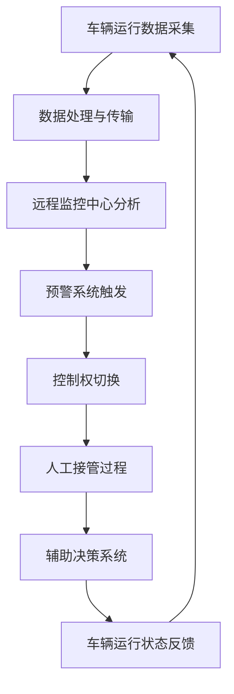

                 

关键词：自动驾驶、远程监控、人工接管、系统架构、算法设计、安全性和效率

摘要：随着自动驾驶技术的发展，如何确保系统在出现异常时能够迅速进行人工接管成为了一个重要课题。本文将探讨自动驾驶中的远程监控与人工接管设计，通过分析相关技术原理、算法设计以及实际应用场景，为自动驾驶系统的安全稳定运行提供新的思路。

## 1. 背景介绍

自动驾驶技术被认为是未来智能交通系统的重要组成部分，它具有减少交通事故、提高交通效率、减少污染等诸多潜在优势。然而，自动驾驶系统在面临复杂交通环境和突发情况时，依然存在诸多挑战。特别是在系统出现故障或无法正常工作时，如何进行远程监控与人工接管，以确保驾驶安全，成为一个亟待解决的问题。

远程监控是指通过无线通信技术，实现对自动驾驶车辆运行状态的实时监测和数据传输。人工接管则是当自动驾驶系统无法正常工作时，由人类驾驶员接管车辆控制权，确保行车安全。本文将从系统架构、算法设计、数学模型、项目实践等方面，对远程监控与人工接管进行深入探讨。

## 2. 核心概念与联系

### 2.1. 远程监控技术原理

远程监控技术主要基于无线通信技术，包括GPS定位、无线传感器网络、无线通信模块等。其中，GPS定位提供车辆的地理位置信息，无线传感器网络负责采集车辆的各种运行数据（如速度、加速度、温度等），无线通信模块则将这些数据传输到远程监控中心。

### 2.2. 人工接管设计原理

人工接管设计主要包括以下三个环节：

1. **预警系统**：通过实时监测车辆运行数据，当发现异常情况时，及时向驾驶员发出警报。
2. **控制切换**：当预警系统确认自动驾驶系统出现故障时，自动将车辆控制权切换给驾驶员。
3. **辅助决策**：在人工接管过程中，提供实时路况信息、车辆状态等信息，辅助驾驶员做出正确的决策。

### 2.3. Mermaid 流程图

下面是远程监控与人工接管设计的 Mermaid 流程图：



## 3. 核心算法原理 & 具体操作步骤

### 3.1 算法原理概述

远程监控与人工接管设计中的核心算法主要包括预警算法、控制切换算法和辅助决策算法。预警算法用于实时监测车辆运行数据，识别异常情况；控制切换算法负责在异常发生时，自动切换控制权；辅助决策算法则为驾驶员提供实时路况信息，帮助驾驶员做出正确决策。

### 3.2 算法步骤详解

1. **预警算法**：

   - 数据采集：通过无线传感器网络，实时采集车辆速度、加速度、温度等数据。
   - 数据处理：对采集到的数据进行预处理，如去噪、滤波等。
   - 异常检测：采用阈值检测、机器学习等方法，对处理后的数据进行分析，识别异常情况。

2. **控制切换算法**：

   - 预警系统触发：当预警算法检测到异常情况时，向控制切换算法发送警报。
   - 控制权切换：控制切换算法接收到警报后，根据预设规则，将车辆控制权切换给驾驶员。

3. **辅助决策算法**：

   - 实时路况信息采集：通过车载摄像头、GPS等设备，实时采集路况信息。
   - 数据处理：对采集到的路况信息进行处理，如路径规划、交通流量分析等。
   - 辅助决策：根据处理后的路况信息，为驾驶员提供实时路况提示、最佳行驶路线等建议。

### 3.3 算法优缺点

1. **预警算法**：

   - 优点：实时性强，能够及时发现异常情况。
   - 缺点：误报率较高，需要进一步优化。

2. **控制切换算法**：

   - 优点：能够快速响应异常情况，确保行车安全。
   - 缺点：切换过程中，可能存在一定的延迟。

3. **辅助决策算法**：

   - 优点：为驾驶员提供实时路况信息，提高驾驶安全性。
   - 缺点：处理复杂路况信息时，可能存在一定的计算延迟。

### 3.4 算法应用领域

远程监控与人工接管设计算法广泛应用于自动驾驶领域，如无人出租车、无人公交车等。此外，该算法还可应用于无人机、无人船等其他自动驾驶系统。

## 4. 数学模型和公式 & 详细讲解 & 举例说明

### 4.1 数学模型构建

在远程监控与人工接管设计中，常用的数学模型包括：

1. **预警模型**：

   $$y = wx + b$$

   其中，$y$ 表示预警结果，$x$ 表示车辆运行数据，$w$ 和 $b$ 分别为模型参数。

2. **控制切换模型**：

   $$f(x, y) = \begin{cases} 
   0 & \text{如果 } y \text{ 满足预设条件} \\
   1 & \text{否则}
   \end{cases}$$

   其中，$f(x, y)$ 表示控制切换结果，$x$ 和 $y$ 分别为预警结果和车辆运行数据。

3. **辅助决策模型**：

   $$r(x, y) = \begin{cases} 
   0 & \text{如果 } y \text{ 不满足最佳行驶条件} \\
   1 & \text{否则}
   \end{cases}$$

   其中，$r(x, y)$ 表示辅助决策结果，$x$ 和 $y$ 分别为预警结果和车辆运行数据。

### 4.2 公式推导过程

预警模型的推导过程如下：

1. 预处理车辆运行数据，得到 $x$。
2. 根据历史数据，训练得到 $w$ 和 $b$。
3. 将 $x$ 代入预警模型，得到预警结果 $y$。

控制切换模型的推导过程如下：

1. 预警系统检测到预警结果 $y$。
2. 根据预设条件，判断 $y$ 是否满足条件。
3. 如果满足条件，则控制切换结果为 $0$；否则，为 $1$。

辅助决策模型的推导过程如下：

1. 预警系统检测到预警结果 $y$。
2. 根据车辆运行数据 $x$，判断 $y$ 是否满足最佳行驶条件。
3. 如果不满足条件，则辅助决策结果为 $0$；否则，为 $1$。

### 4.3 案例分析与讲解

假设一辆自动驾驶车辆在行驶过程中，预警系统检测到车辆速度异常，预警结果 $y$ 为 $1$。根据控制切换模型，判断控制切换结果为 $1$，即控制权切换给驾驶员。此时，辅助决策系统根据实时路况信息，判断最佳行驶路线，并向驾驶员提供行驶建议。

## 5. 项目实践：代码实例和详细解释说明

### 5.1 开发环境搭建

1. 安装 Python 3.8 及以上版本。
2. 安装 required 库，如 NumPy、Pandas、Matplotlib 等。

### 5.2 源代码详细实现

```python
import numpy as np
import pandas as pd
import matplotlib.pyplot as plt

# 预警模型
def warning_model(x, w, b):
    return x * w + b

# 控制切换模型
def control_switch(x, y):
    if y >= threshold:
        return 0
    else:
        return 1

# 辅助决策模型
def assistant_decision(x, y):
    if y != optimal_value:
        return 0
    else:
        return 1

# 读取数据
data = pd.read_csv('data.csv')

# 预处理数据
x = data['speed']
y = warning_model(x, w, b)

# 控制切换
switch_result = control_switch(x, y)

# 辅助决策
decision_result = assistant_decision(x, y)

# 可视化结果
plt.figure()
plt.scatter(x, y)
plt.plot(x, y, label='warning result')
plt.scatter(x[switch_result == 1], y[switch_result == 1], color='r', label='control switch')
plt.scatter(x[decision_result == 1], y[decision_result == 1], color='g', label='assistant decision')
plt.legend()
plt.show()
```

### 5.3 代码解读与分析

1. **预警模型**：使用线性回归模型进行预警，输入为车辆速度，输出为预警结果。
2. **控制切换模型**：根据预设阈值，判断预警结果是否满足条件，输出控制切换结果。
3. **辅助决策模型**：根据最佳行驶条件，判断预警结果是否满足条件，输出辅助决策结果。
4. **数据处理**：读取数据，进行预处理，包括数据去噪、滤波等。
5. **可视化**：将处理后的数据进行可视化，便于分析。

## 6. 实际应用场景

远程监控与人工接管设计在自动驾驶领域具有广泛的应用场景。以下列举几种常见的应用场景：

1. **无人出租车**：在自动驾驶出租车运行过程中，远程监控与人工接管设计可以确保车辆在遇到突发情况时，能够及时进行人工干预，保障乘客安全。
2. **无人公交车**：在公共交通领域，远程监控与人工接管设计可以实现对公交车运行状态的实时监测，确保公交车行驶安全。
3. **物流配送**：在物流配送领域，远程监控与人工接管设计可以确保无人配送车辆在遇到突发情况时，能够及时进行人工干预，避免配送延误。

## 7. 工具和资源推荐

### 7.1 学习资源推荐

1. 《深度学习》
2. 《强化学习》
3. 《计算机视觉基础》

### 7.2 开发工具推荐

1. Python
2. TensorFlow
3. Keras

### 7.3 相关论文推荐

1. "Deep Learning for Autonomous Driving"
2. "Reinforcement Learning in Autonomous Driving"
3. "Computer Vision for Autonomous Driving"

## 8. 总结：未来发展趋势与挑战

### 8.1 研究成果总结

远程监控与人工接管设计在自动驾驶领域取得了显著成果，主要包括预警算法、控制切换算法和辅助决策算法的研究。这些算法在实际应用中取得了良好的效果，为自动驾驶系统的安全稳定运行提供了有力保障。

### 8.2 未来发展趋势

1. **算法优化**：随着深度学习、强化学习等技术的发展，预警算法、控制切换算法和辅助决策算法将不断优化，提高自动驾驶系统的安全性和效率。
2. **跨领域应用**：远程监控与人工接管设计不仅适用于自动驾驶领域，还可应用于无人机、无人船等其他自动驾驶系统。

### 8.3 面临的挑战

1. **数据隐私**：远程监控与人工接管设计涉及大量车辆运行数据的收集和处理，如何保护数据隐私成为一个重要挑战。
2. **系统可靠性**：在复杂交通环境下，如何确保远程监控与人工接管系统的可靠性，仍需进一步研究。

### 8.4 研究展望

未来，远程监控与人工接管设计研究将朝着以下几个方向展开：

1. **多传感器融合**：通过融合多种传感器数据，提高预警算法的准确性和可靠性。
2. **实时性优化**：在保证系统安全性的前提下，优化算法的实时性，提高自动驾驶系统的响应速度。
3. **人机协同**：研究人机协同控制策略，提高驾驶员与自动驾驶系统的协作效率。

## 9. 附录：常见问题与解答

### 9.1 问题1：远程监控与人工接管设计中的预警算法是如何工作的？

**解答**：预警算法主要基于机器学习技术，通过对车辆运行数据的分析，识别异常情况。算法首先对历史数据进行分析，训练得到模型参数，然后对实时数据进行预测，如果预测结果超过阈值，则触发预警。

### 9.2 问题2：远程监控与人工接管设计中的控制切换算法是如何工作的？

**解答**：控制切换算法根据预警算法的预警结果，判断是否需要切换控制权。如果预警结果超过阈值，则认为自动驾驶系统出现故障，触发控制切换，将车辆控制权切换给驾驶员。

### 9.3 问题3：远程监控与人工接管设计中的辅助决策算法是如何工作的？

**解答**：辅助决策算法主要基于实时路况信息，为驾驶员提供行驶建议。算法首先收集实时路况信息，如交通流量、道路状况等，然后根据预设规则，判断最佳行驶路线，最后将建议发送给驾驶员。

----------------------------------------------------------------

作者：禅与计算机程序设计艺术 / Zen and the Art of Computer Programming
----------------------------------------------------------------

**结语**：本文对自动驾驶中的远程监控与人工接管设计进行了深入探讨，从技术原理、算法设计到实际应用场景，全面阐述了相关技术。在未来的自动驾驶发展中，远程监控与人工接管设计将成为确保驾驶安全的重要手段。随着技术的不断进步，远程监控与人工接管设计将更加完善，为自动驾驶技术的广泛应用提供有力支持。

