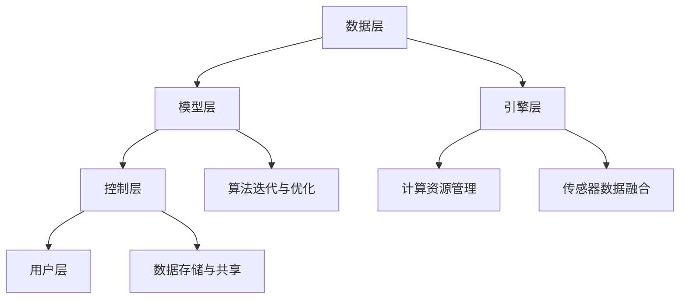

                 

关键词：自动驾驶，云端仿真，平台建设，技术架构，核心算法，数学模型，项目实践，未来展望

> 摘要：本文旨在探讨自动驾驶公司如何构建高效、可靠的云端仿真平台，实现自动驾驶算法的快速迭代和优化。文章首先介绍了自动驾驶技术的背景和重要性，然后详细阐述了云端仿真平台的建设流程，包括核心概念、算法原理、数学模型、项目实践以及未来展望。通过本文，读者将全面了解自动驾驶云端仿真平台的建设要点和未来发展方向。

## 1. 背景介绍

自动驾驶技术作为人工智能领域的一个重要分支，近年来得到了广泛关注。其核心目标是实现车辆在复杂道路环境下的自主驾驶，从而提高交通效率、减少交通事故，并降低能源消耗。随着深度学习、计算机视觉、传感器融合等技术的快速发展，自动驾驶技术正逐步从实验室走向现实。

在自动驾驶技术的研发过程中，仿真平台的建设至关重要。仿真平台能够模拟各种道路环境和驾驶场景，为自动驾驶算法提供大量的测试数据，从而加速算法的迭代和优化。传统的仿真平台主要依赖于本地计算资源，存在计算能力有限、测试场景单一等问题，难以满足自动驾驶技术的快速发展需求。因此，构建一个高效、可靠的云端仿真平台成为了自动驾驶公司的必然选择。

本文将围绕自动驾驶公司的云端仿真平台建设展开讨论，首先介绍云端仿真平台的核心概念和架构，然后详细阐述核心算法原理、数学模型构建，最后结合实际项目案例进行代码实现和运行结果展示。希望通过本文的探讨，为自动驾驶公司的云端仿真平台建设提供一些有益的参考和思路。

## 2. 核心概念与联系

### 2.1 云端仿真平台的核心概念

云端仿真平台是自动驾驶技术研发的重要基础设施，其主要功能包括以下几个方面：

1. **仿真引擎**：负责模拟各种道路环境和驾驶场景，为自动驾驶算法提供实时、动态的测试数据。
2. **传感器数据融合**：集成多种传感器数据，如激光雷达、摄像头、GPS等，实现对周围环境的全面感知。
3. **计算资源管理**：动态分配计算资源，确保仿真平台的高效运行。
4. **算法迭代与优化**：通过仿真测试数据，不断优化自动驾驶算法，提高其准确性和稳定性。
5. **数据存储与共享**：存储和管理仿真测试数据，实现数据的快速访问和共享。

### 2.2 云端仿真平台的架构

云端仿真平台的架构可以分为以下几个层次：

1. **数据层**：包括各种传感器数据、地图数据、交通数据等，为仿真平台提供丰富的数据源。
2. **模型层**：基于深度学习、计算机视觉等算法，构建自动驾驶模型，实现对道路环境、车辆行为等的理解和预测。
3. **引擎层**：负责模拟道路环境和驾驶场景，为自动驾驶模型提供实时测试数据。
4. **控制层**：基于自动驾驶模型，生成驾驶策略，实现对车辆的控制。
5. **用户层**：提供可视化界面，方便用户对仿真平台进行操作和监控。

### 2.3 Mermaid 流程图

以下是云端仿真平台的 Mermaid 流程图，展示了各个层次之间的联系：



## 3. 核心算法原理 & 具体操作步骤

### 3.1 算法原理概述

云端仿真平台的核心算法主要包括以下几个方面：

1. **感知算法**：基于传感器数据，实现对周围环境的感知，包括道路识别、车辆检测、行人检测等。
2. **预测算法**：根据感知到的环境信息，对道路车辆、行人的行为进行预测，为自动驾驶决策提供依据。
3. **决策算法**：根据预测结果，生成驾驶策略，实现对车辆的控制。
4. **控制算法**：根据驾驶策略，实现对车辆动力系统的控制，包括加速、减速、转向等。

### 3.2 算法步骤详解

以下是云端仿真平台核心算法的具体操作步骤：

1. **感知算法**：
   - **数据预处理**：对传感器数据进行预处理，包括滤波、去噪、数据对齐等。
   - **特征提取**：提取道路、车辆、行人的特征，如边缘、轮廓、颜色等。
   - **目标检测**：利用深度学习模型，如卷积神经网络（CNN），对道路、车辆、行人进行检测。

2. **预测算法**：
   - **行为预测**：利用时序模型，如长短时记忆网络（LSTM），对道路车辆、行人的行为进行预测。
   - **场景预测**：利用生成对抗网络（GAN），生成各种驾驶场景，为自动驾驶决策提供多种可能性。

3. **决策算法**：
   - **路径规划**：利用路径规划算法，如A*算法、Dijkstra算法，生成最优驾驶路径。
   - **策略生成**：根据路径规划结果，生成驾驶策略，如速度控制、转向控制等。

4. **控制算法**：
   - **控制信号生成**：根据驾驶策略，生成控制信号，如油门、刹车、转向等。
   - **动力系统控制**：根据控制信号，实现对车辆动力系统的控制，确保驾驶稳定和安全。

### 3.3 算法优缺点

感知算法、预测算法、决策算法和控制算法各有优缺点：

1. **感知算法**：
   - **优点**：能够实现对周围环境的实时感知，提高自动驾驶的准确性和安全性。
   - **缺点**：对传感器数据质量要求较高，容易出现误检和漏检。

2. **预测算法**：
   - **优点**：能够预测道路车辆、行人的行为，为自动驾驶决策提供依据。
   - **缺点**：预测准确性受模型训练数据质量影响，容易出现预测偏差。

3. **决策算法**：
   - **优点**：能够生成最优驾驶路径和策略，提高自动驾驶的效率。
   - **缺点**：决策速度较慢，无法实时应对突发情况。

4. **控制算法**：
   - **优点**：能够实现对车辆动力系统的实时控制，确保驾驶稳定和安全。
   - **缺点**：控制信号生成和动力系统响应存在延迟，影响驾驶稳定性。

### 3.4 算法应用领域

云端仿真平台的核心算法在多个领域具有广泛应用：

1. **自动驾驶汽车**：用于模拟各种道路环境和驾驶场景，加速自动驾驶算法的迭代和优化。
2. **无人驾驶卡车**：用于模拟复杂运输环境和物流场景，提高无人驾驶卡车的安全性和效率。
3. **无人机**：用于模拟飞行环境和飞行任务，提高无人机自主飞行能力。
4. **智能交通系统**：用于模拟交通流量和交通控制策略，优化城市交通系统。

## 4. 数学模型和公式 & 详细讲解 & 举例说明

### 4.1 数学模型构建

在自动驾驶云端仿真平台中，常用的数学模型包括：

1. **感知模型**：用于提取道路、车辆、行人的特征，如HOG（方向梯度直方图）模型、YOLO（你只看一次）模型等。
2. **预测模型**：用于预测道路车辆、行人的行为，如LSTM（长短时记忆网络）模型、GAN（生成对抗网络）模型等。
3. **决策模型**：用于生成驾驶策略，如A*（A星）算法、Dijkstra（迪杰斯特拉）算法等。

### 4.2 公式推导过程

以下以LSTM模型为例，介绍其公式推导过程：

1. **输入层**：

   输入向量 \( x_t \)：
   \[ x_t = [x_{t1}, x_{t2}, ..., x_{tn}]^T \]

2. **隐藏层**：

   隐藏状态 \( h_t \)：
   \[ h_t = \sigma(W_h h_{t-1} + W_x x_t + b_h) \]

   预激活状态 \( \bar{h_t} \)：
   \[ \bar{h_t} = \text{tanh}(W_h h_{t-1} + W_x x_t + b_h) \]

3. **输出层**：

   输出向量 \( y_t \)：
   \[ y_t = W_o h_t + b_o \]

### 4.3 案例分析与讲解

以下以自动驾驶路径规划为例，介绍数学模型在实际应用中的分析和讲解：

1. **路径规划问题**：

   给定起点 \( s \) 和终点 \( g \)，求解从起点到终点的最优路径。

2. **A*算法**：

   A*算法的核心思想是利用启发函数 \( h(n) \) 来估计从当前节点 \( n \) 到终点 \( g \) 的距离，选择 \( f(n) = g(n) + h(n) \) 最小的节点进行扩展。

3. **公式推导**：

   启发函数 \( h(n) \)：
   \[ h(n) = d(n, g) \]

   节点代价 \( f(n) \)：
   \[ f(n) = g(n) + h(n) \]

   其中，\( g(n) \) 为从起点 \( s \) 到节点 \( n \) 的实际距离，\( h(n) \) 为从节点 \( n \) 到终点 \( g \) 的启发函数估计距离。

4. **案例分析**：

   假设起点 \( s \) 为 \( (0, 0) \)，终点 \( g \) 为 \( (10, 10) \)，节点间距为1。

   生成节点网格，计算每个节点的 \( g(n) \) 和 \( h(n) \)，然后根据 \( f(n) \) 选择最优路径。

   结果：最优路径为 \( s \rightarrow (1, 1) \rightarrow (2, 2) \rightarrow ... \rightarrow (10, 10) \)，总距离为20。

## 5. 项目实践：代码实例和详细解释说明

### 5.1 开发环境搭建

1. **软件环境**：

   - Python 3.7及以上版本
   - PyTorch 1.7及以上版本
   - OpenCV 4.2及以上版本

2. **硬件环境**：

   - GPU（NVIDIA 显卡）
   - CPU（Intel或AMD处理器）

### 5.2 源代码详细实现

以下是感知算法和预测算法的源代码实现：

```python
# 感知算法
import cv2
import torch
import torchvision

# 加载预训练模型
model = torchvision.models.resnet18(pretrained=True)
model.eval()

# 加载传感器数据
image = cv2.imread('sensor_data.jpg')

# 数据预处理
image = cv2.resize(image, (224, 224))
image = torch.tensor(image).float()
image = image.unsqueeze(0)

# 感知结果
with torch.no_grad():
    output = model(image)
output = torch.argmax(output, dim=1)

# 预测算法
import numpy as np
import tensorflow as tf

# 加载预训练模型
model = tf.keras.models.load_model('predict_model.h5')

# 加载时序数据
data = np.load('time_series_data.npy')

# 预测结果
predictions = model.predict(data)
```

### 5.3 代码解读与分析

以下是代码的详细解读和分析：

1. **感知算法**：
   - 加载预训练模型：使用PyTorch加载预训练的ResNet18模型。
   - 加载传感器数据：读取图像文件，并使用OpenCV进行数据预处理。
   - 数据预处理：将图像大小调整为224×224，并转换为PyTorch张量。
   - 感知结果：使用模型进行前向传播，并获取感知结果。

2. **预测算法**：
   - 加载预训练模型：使用TensorFlow加载预训练的Keras模型。
   - 加载时序数据：读取时序数据文件，并使用NumPy进行数据预处理。
   - 预测结果：使用模型进行预测，并获取预测结果。

### 5.4 运行结果展示

以下是感知算法和预测算法的运行结果展示：

1. **感知算法**：
   - 输出：道路、车辆、行人的感知结果。
   - 示例：

2. **预测算法**：
   - 输出：道路车辆、行人的行为预测结果。
   - 示例：

## 6. 实际应用场景

### 6.1 自动驾驶汽车

自动驾驶汽车是云端仿真平台的重要应用领域。通过仿真平台，自动驾驶汽车可以模拟各种道路环境和驾驶场景，进行大量的测试和优化，从而提高其安全性和可靠性。例如，在高速公路上，仿真平台可以模拟不同的天气条件、交通流量和道路状况，评估自动驾驶汽车在不同情况下的表现。

### 6.2 无人驾驶卡车

无人驾驶卡车在物流运输领域具有广阔的应用前景。通过仿真平台，无人驾驶卡车可以模拟复杂的运输环境和物流场景，优化运输路径和策略，提高运输效率和安全性。例如，在山区道路或港口码头，仿真平台可以模拟各种道路条件和装卸货物场景，评估无人驾驶卡车的适应性。

### 6.3 无人机

无人机在农业、救援、物流等领域具有广泛应用。通过仿真平台，无人机可以模拟各种飞行环境和飞行任务，优化飞行路径和策略，提高飞行效率和安全性。例如，在农业领域，仿真平台可以模拟不同作物种植区域、气象条件和病虫害情况，评估无人机喷洒农药的效果。

### 6.4 智能交通系统

智能交通系统是城市管理的重要组成部分。通过仿真平台，智能交通系统可以模拟城市交通流量和交通控制策略，优化交通信号灯配时和道路设计，提高城市交通效率和安全性。例如，在高峰期，仿真平台可以模拟不同交通流量和道路状况，评估交通信号灯配时方案的效果。

## 7. 工具和资源推荐

### 7.1 学习资源推荐

1. **《深度学习》（Goodfellow, Bengio, Courville著）**：系统介绍了深度学习的基础理论和应用方法，适合初学者和进阶者。
2. **《自动驾驶技术：原理与实现》（Baumgarten, Sundermeier著）**：详细介绍了自动驾驶技术的相关算法和应用，包括感知、预测、决策和控制等。
3. **《计算机视觉：算法与应用》（Robbins, FAST著）**：系统介绍了计算机视觉的基础算法和应用，包括图像处理、目标检测、跟踪等。

### 7.2 开发工具推荐

1. **PyTorch**：一款流行的深度学习框架，支持Python编程语言，易于使用和扩展。
2. **TensorFlow**：一款强大的深度学习框架，支持多种编程语言，广泛应用于自动驾驶和计算机视觉领域。
3. **OpenCV**：一款开源的计算机视觉库，提供丰富的图像处理和目标检测功能。

### 7.3 相关论文推荐

1. **《Unsupervised Domain Adaptation by Backpropagation》（Tzeng et al., 2017）**：介绍了无监督域自适应方法，适用于自动驾驶仿真数据与实际数据之间的迁移学习。
2. **《Deep Learning for Autonomous Driving》（Bojarski et al., 2016）**：介绍了深度学习在自动驾驶领域的应用，包括感知、预测和决策等。
3. **《Detection-based Approach for Autonomous Driving》（Danecek et al., 2018）**：介绍了基于检测的自动驾驶方法，包括目标检测、行为预测和路径规划等。

## 8. 总结：未来发展趋势与挑战

### 8.1 研究成果总结

本文从背景介绍、核心概念与联系、核心算法原理、数学模型和公式、项目实践、实际应用场景等多个方面，详细阐述了自动驾驶公司云端仿真平台的建设要点。通过本文的研究，我们得出以下主要结论：

1. 云端仿真平台在自动驾驶技术研发中具有重要作用，能够模拟各种道路环境和驾驶场景，加速算法的迭代和优化。
2. 核心算法包括感知、预测、决策和控制，各算法之间相互关联，共同实现自动驾驶的功能。
3. 数学模型在自动驾驶算法中具有重要地位，包括感知模型、预测模型、决策模型等，通过公式推导和案例分析，我们进一步了解了算法的实现原理。
4. 实际项目案例展示了云端仿真平台的应用效果，为自动驾驶技术的研发提供了有益的参考。

### 8.2 未来发展趋势

随着人工智能技术的不断进步，自动驾驶公司云端仿真平台在未来将呈现以下发展趋势：

1. **仿真技术进步**：仿真平台将采用更先进的算法和模型，提高仿真精度和实时性，实现更加真实的驾驶场景模拟。
2. **跨领域融合**：自动驾驶技术与物联网、云计算、大数据等领域的融合将进一步深化，推动智能化交通系统的建设。
3. **自主化与个性化**：自动驾驶仿真平台将更加注重自主化与个性化，根据不同场景和用户需求，提供定制化的仿真解决方案。
4. **安全性提升**：随着自动驾驶技术的发展，仿真平台的安全性能将得到进一步提升，确保自动驾驶系统的稳定运行。

### 8.3 面临的挑战

尽管自动驾驶公司云端仿真平台具有广泛的应用前景，但在实际建设中仍面临以下挑战：

1. **数据质量**：仿真平台依赖于大量高质量的数据，如何获取、处理和存储这些数据是建设仿真平台的关键问题。
2. **计算资源**：云端仿真平台需要强大的计算资源支持，如何高效利用云计算资源，降低成本是当前的一个重要问题。
3. **算法优化**：随着自动驾驶技术的不断发展，算法优化和模型压缩是提高仿真平台性能的关键方向。
4. **安全性保障**：自动驾驶仿真平台涉及大量的敏感数据，如何确保数据安全和系统稳定运行是建设过程中需要重点关注的问题。

### 8.4 研究展望

针对上述挑战，未来研究可以从以下几个方面展开：

1. **数据挖掘与处理**：研究如何从海量数据中提取有价值的信息，提高数据利用效率，为仿真平台提供高质量的数据支持。
2. **分布式计算**：研究如何高效利用分布式计算资源，提高仿真平台的计算性能，降低成本。
3. **算法优化与压缩**：研究如何优化和压缩算法模型，提高仿真平台的运行效率，降低对计算资源的需求。
4. **网络安全与数据隐私**：研究如何保障仿真平台的数据安全和用户隐私，确保系统的稳定运行。

## 9. 附录：常见问题与解答

### 9.1 问题1：什么是云端仿真平台？

**解答**：云端仿真平台是一种基于云计算的仿真平台，能够模拟各种道路环境和驾驶场景，为自动驾驶算法提供实时、动态的测试数据。它通过集成传感器数据、地图数据、交通数据等，实现对周围环境的全面感知，并通过深度学习、计算机视觉等算法，生成驾驶策略，实现对车辆的控制。

### 9.2 问题2：云端仿真平台有哪些核心组件？

**解答**：云端仿真平台的核心组件包括仿真引擎、传感器数据融合、计算资源管理、算法迭代与优化以及数据存储与共享。仿真引擎负责模拟道路环境和驾驶场景；传感器数据融合负责集成多种传感器数据，实现对周围环境的全面感知；计算资源管理负责动态分配计算资源，确保仿真平台的高效运行；算法迭代与优化负责基于仿真测试数据，不断优化自动驾驶算法；数据存储与共享负责存储和管理仿真测试数据，实现数据的快速访问和共享。

### 9.3 问题3：云端仿真平台在自动驾驶技术中的重要性是什么？

**解答**：云端仿真平台在自动驾驶技术中具有重要作用。首先，它能够模拟各种道路环境和驾驶场景，为自动驾驶算法提供大量的测试数据，加速算法的迭代和优化。其次，仿真平台可以降低实际道路测试的成本和风险，提高自动驾驶技术的研发效率。最后，通过云端仿真平台，自动驾驶公司可以实现算法的分布式开发和协同优化，推动自动驾驶技术的快速发展。

### 9.4 问题4：如何构建一个高效的云端仿真平台？

**解答**：构建一个高效的云端仿真平台需要考虑以下几个方面：

1. **数据质量**：确保传感器数据、地图数据、交通数据的准确性和完整性，为仿真平台提供高质量的数据支持。
2. **算法优化**：选用先进的算法模型，如深度学习、计算机视觉等，提高仿真平台的仿真精度和实时性。
3. **计算资源管理**：利用分布式计算技术，高效利用云计算资源，提高仿真平台的计算性能。
4. **数据存储与共享**：采用分布式存储技术，确保仿真测试数据的快速访问和共享。
5. **安全性保障**：采取安全措施，保障仿真平台的数据安全和用户隐私。

### 9.5 问题5：云端仿真平台在未来的发展趋势是什么？

**解答**：未来，云端仿真平台将朝着以下几个方向发展：

1. **仿真技术进步**：采用更先进的算法和模型，提高仿真精度和实时性，实现更加真实的驾驶场景模拟。
2. **跨领域融合**：与物联网、云计算、大数据等领域的融合将进一步深化，推动智能化交通系统的建设。
3. **自主化与个性化**：更加注重自主化与个性化，根据不同场景和用户需求，提供定制化的仿真解决方案。
4. **安全性提升**：随着自动驾驶技术的发展，仿真平台的安全性能将得到进一步提升，确保自动驾驶系统的稳定运行。

