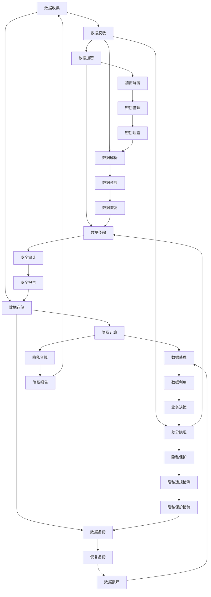

                 

关键词：自动驾驶、数据脱敏、隐私计算、数据安全、算法原理、应用实践、未来展望

## 摘要

随着自动驾驶技术的快速发展，数据安全和隐私保护成为行业面临的重大挑战。本文将探讨自动驾驶公司如何在数据脱敏和隐私计算方面进行技术优化，以确保数据的安全性和合规性。文章首先介绍了数据脱敏与隐私计算的核心概念和原理，随后详细分析了多种脱敏算法和隐私计算技术的具体实现步骤，并通过一个实际项目展示了相关技术的应用。最后，文章提出了未来数据脱敏与隐私计算技术的发展趋势和面临的挑战，为自动驾驶公司的数据安全和隐私保护提供了有益的参考。

## 1. 背景介绍

### 自动驾驶技术的发展现状

自动驾驶技术作为人工智能领域的重要分支，近年来取得了显著的发展。从最初的辅助驾驶到如今的全自动驾驶，自动驾驶技术正逐渐改变人们的出行方式。全球各大科技公司和汽车制造商纷纷投入到自动驾驶技术的研发中，特斯拉、谷歌、百度等企业已经成为行业领军者。自动驾驶技术的核心在于对大量数据进行实时处理和决策，从而实现车辆的自主驾驶。

### 数据安全和隐私保护的挑战

自动驾驶技术的快速发展带来了数据安全和隐私保护方面的严峻挑战。自动驾驶系统需要收集和处理大量的敏感数据，包括车辆位置、行驶速度、驾驶行为等。这些数据不仅涉及到个人隐私，还可能被恶意攻击者利用，对自动驾驶系统进行干扰和破坏。因此，如何确保自动驾驶数据的安全性和合规性成为行业亟待解决的问题。

### 数据脱敏与隐私计算的重要性

数据脱敏和隐私计算技术是保障自动驾驶数据安全和隐私保护的关键。数据脱敏通过将敏感数据转换成不可识别的形式，防止敏感信息泄露。隐私计算技术则通过在数据处理的各个环节进行加密和隔离，确保数据在传输、存储和处理过程中的安全性。本文将详细介绍数据脱敏与隐私计算技术的原理、算法和应用，以期为自动驾驶公司的数据安全和隐私保护提供技术支持。

## 2. 核心概念与联系

### 数据脱敏

数据脱敏是指通过对敏感数据进行变换，使其无法被直接识别或利用的技术。数据脱敏的主要目的是保护个人隐私和数据安全，防止敏感信息泄露。数据脱敏技术可以应用于数据存储、数据传输和数据处理的各个环节。

### 隐私计算

隐私计算是一种在数据处理过程中保证数据隐私的技术。隐私计算通过加密、同态加密、差分隐私等手段，在数据处理的不同阶段保护数据隐私。隐私计算技术主要应用于云计算、大数据分析和人工智能等领域，以防止数据泄露和隐私侵犯。

### 数据脱敏与隐私计算的联系

数据脱敏与隐私计算在保障数据安全和隐私保护方面具有密切的联系。数据脱敏主要关注数据的可识别性，通过变换敏感数据，使其无法被直接识别。而隐私计算则关注数据在处理过程中的安全性，通过加密和隔离等手段，确保数据在传输、存储和处理过程中的隐私。两者共同构成了保障自动驾驶数据安全和隐私保护的技术体系。

### Mermaid 流程图

以下是数据脱敏与隐私计算技术的 Mermaid 流程图：



## 3. 核心算法原理 & 具体操作步骤

### 3.1 算法原理概述

数据脱敏算法主要包括伪名替换、数据混淆、数据隐藏和数据丢失等。其中，伪名替换是最常用的方法，通过将敏感数据替换成伪名，如姓名、地址、电话号码等。数据混淆则是通过变换敏感数据的结构和内容，使其难以识别。数据隐藏则是将敏感数据隐藏在其他数据中，以降低其可识别性。数据丢失则是通过删除敏感数据，以降低其泄露风险。

隐私计算算法主要包括加密、同态加密和差分隐私。加密技术通过对数据进行加密，使其在传输、存储和处理过程中无法被直接访问。同态加密则允许在加密数据上进行计算，而无需解密，从而保护数据隐私。差分隐私则通过在数据处理过程中引入噪声，降低数据可识别性，从而保护个人隐私。

### 3.2 算法步骤详解

#### 数据脱敏算法步骤

1. 数据收集：从不同数据源收集敏感数据，如车辆行驶记录、驾驶员信息等。

2. 数据预处理：对收集到的数据进行清洗和格式化，如去除空值、缺失值和重复值等。

3. 确定脱敏策略：根据数据敏感度和隐私要求，选择合适的脱敏算法和策略，如伪名替换、数据混淆等。

4. 数据脱敏：对敏感数据执行脱敏操作，如将姓名替换成伪名、对电话号码进行掩码处理等。

5. 数据验证：对脱敏后的数据进行验证，确保脱敏效果符合预期。

#### 隐私计算算法步骤

1. 数据加密：对敏感数据进行加密，如使用对称加密或非对称加密算法。

2. 同态加密：在加密数据上进行计算，如使用同态加密算法进行机器学习模型的训练。

3. 差分隐私：在数据处理过程中引入噪声，如使用拉格朗日乘数法实现差分隐私。

4. 数据解密：在数据处理完成后，对加密数据进行解密，获取原始数据。

### 3.3 算法优缺点

#### 数据脱敏算法优缺点

- 伪名替换：优点是简单易实现，缺点是可能导致数据失去意义，影响数据分析效果。

- 数据混淆：优点是保护数据隐私，缺点是计算复杂度高，可能影响数据处理速度。

- 数据隐藏：优点是保护数据隐私，缺点是可能导致数据泄露风险增加。

- 数据丢失：优点是降低数据泄露风险，缺点是可能导致数据完整性受损。

#### 隐私计算算法优缺点

- 加密：优点是保护数据隐私，缺点是增加数据存储和传输成本。

- 同态加密：优点是支持加密数据上的计算，缺点是计算复杂度高。

- 差分隐私：优点是保护个人隐私，缺点是可能降低数据处理精度。

### 3.4 算法应用领域

数据脱敏和隐私计算技术在自动驾驶领域具有广泛的应用前景。自动驾驶公司可以通过数据脱敏技术对敏感数据进行分析和处理，以支持自动驾驶算法的研发和优化。同时，隐私计算技术可以确保自动驾驶数据在传输、存储和处理过程中的安全性，防止数据泄露和隐私侵犯。此外，数据脱敏和隐私计算技术还可以应用于自动驾驶测试数据的分析，为自动驾驶系统的安全性和可靠性评估提供支持。

## 4. 数学模型和公式 & 详细讲解 & 举例说明

### 4.1 数学模型构建

数据脱敏和隐私计算技术涉及到多个数学模型和公式，以下列举了其中几个关键模型和公式。

#### 数据脱敏模型

1. 伪名替换模型：设原数据为 \( X \)，伪名为 \( Y \)，则伪名替换模型可表示为：

\[ Y = f(X) \]

其中，函数 \( f \) 表示脱敏操作。

2. 数据混淆模型：设原数据为 \( X \)，混淆后的数据为 \( X' \)，则数据混淆模型可表示为：

\[ X' = g(X) \]

其中，函数 \( g \) 表示混淆操作。

3. 数据隐藏模型：设原数据为 \( X \)，隐藏后的数据为 \( X' \)，则数据隐藏模型可表示为：

\[ X' = h(X) \]

其中，函数 \( h \) 表示隐藏操作。

4. 数据丢失模型：设原数据为 \( X \)，丢失后的数据为 \( X' \)，则数据丢失模型可表示为：

\[ X' = k(X) \]

其中，函数 \( k \) 表示丢失操作。

#### 隐私计算模型

1. 加密模型：设明文数据为 \( X \)，密文数据为 \( Y \)，则加密模型可表示为：

\[ Y = E(X) \]

其中，函数 \( E \) 表示加密操作。

2. 同态加密模型：设明文数据为 \( X \)，密文数据为 \( Y \)，则同态加密模型可表示为：

\[ Y = HE(X) \]

其中，函数 \( HE \) 表示同态加密操作。

3. 差分隐私模型：设原始数据为 \( X \)，扰动后的数据为 \( X' \)，则差分隐私模型可表示为：

\[ X' = X + \epsilon \]

其中，\( \epsilon \) 表示噪声。

### 4.2 公式推导过程

以下分别对伪名替换、数据混淆、数据隐藏和数据丢失模型的推导过程进行简要介绍。

#### 伪名替换模型推导

设原数据为 \( X \)，伪名为 \( Y \)，脱敏函数为 \( f \)。假设伪名和原数据之间满足一一对应关系，即 \( f(X) = Y \)。

假设原数据 \( X \) 的分布为 \( P(X) \)，伪名 \( Y \) 的分布为 \( P(Y) \)。

则，脱敏函数 \( f \) 的概率分布可以表示为：

\[ P(f(X)) = P(Y) \]

由于 \( f(X) = Y \)，则 \( P(f(X)) = P(Y) = P(X) \)。

因此，伪名替换模型推导如下：

\[ P(f(X)) = P(Y) = P(X) \]

#### 数据混淆模型推导

设原数据为 \( X \)，混淆后的数据为 \( X' \)，混淆函数为 \( g \)。假设混淆后的数据 \( X' \) 的分布与原数据 \( X \) 的分布一致，即 \( P(X') = P(X) \)。

则，混淆函数 \( g \) 的概率分布可以表示为：

\[ P(g(X)) = P(X') \]

由于 \( g(X) = X' \)，则 \( P(g(X)) = P(X') = P(X) \)。

因此，数据混淆模型推导如下：

\[ P(g(X)) = P(X') = P(X) \]

#### 数据隐藏模型推导

设原数据为 \( X \)，隐藏后的数据为 \( X' \)，隐藏函数为 \( h \)。假设隐藏后的数据 \( X' \) 的分布与原数据 \( X \) 的分布一致，即 \( P(X') = P(X) \)。

则，隐藏函数 \( h \) 的概率分布可以表示为：

\[ P(h(X)) = P(X') \]

由于 \( h(X) = X' \)，则 \( P(h(X)) = P(X') = P(X) \)。

因此，数据隐藏模型推导如下：

\[ P(h(X)) = P(X') = P(X) \]

#### 数据丢失模型推导

设原数据为 \( X \)，丢失后的数据为 \( X' \)，丢失函数为 \( k \)。假设丢失后的数据 \( X' \) 的分布与原数据 \( X \) 的分布一致，即 \( P(X') = P(X) \)。

则，丢失函数 \( k \) 的概率分布可以表示为：

\[ P(k(X)) = P(X') \]

由于 \( k(X) = X' \)，则 \( P(k(X)) = P(X') = P(X) \)。

因此，数据丢失模型推导如下：

\[ P(k(X)) = P(X') = P(X) \]

### 4.3 案例分析与讲解

以下通过一个具体案例，对数据脱敏和隐私计算技术进行实际应用分析。

#### 案例背景

某自动驾驶公司需要对其收集的驾驶员行驶数据进行分析，以优化自动驾驶算法。数据中包含驾驶员的姓名、身份证号码、电话号码和行驶路线等信息。为确保数据安全和隐私保护，公司决定采用数据脱敏和隐私计算技术对数据进行处理。

#### 数据脱敏分析

1. 数据预处理

首先，对收集到的驾驶员行驶数据进行清洗和格式化，去除空值、缺失值和重复值等。

2. 确定脱敏策略

根据数据敏感度和隐私要求，公司决定采用伪名替换和数据混淆技术进行数据脱敏。

3. 数据脱敏操作

- 对姓名进行伪名替换，将原姓名替换成伪名，如“张三”替换成“张X”；
- 对身份证号码进行掩码处理，仅保留前两位和后四位，如“11010519900101123X”替换成“11XXXX01123X”；
- 对电话号码进行掩码处理，仅保留前三位和后四位，如“13812345678”替换成“138XXX5678”。

4. 数据验证

对脱敏后的数据进行验证，确保脱敏效果符合预期。

#### 隐私计算分析

1. 数据加密

对脱敏后的敏感数据进行加密，如使用AES加密算法进行加密。

2. 同态加密

在加密数据上进行计算，如使用同态加密算法进行机器学习模型的训练。

3. 差分隐私

在数据处理过程中引入噪声，如使用拉格朗日乘数法实现差分隐私。

4. 数据解密

在数据处理完成后，对加密数据进行解密，获取原始数据。

#### 案例总结

通过数据脱敏和隐私计算技术，公司成功保障了驾驶员行驶数据的安全性和隐私保护。数据脱敏技术通过伪名替换和数据混淆，降低了敏感数据被直接识别的风险。隐私计算技术通过加密、同态加密和差分隐私，确保数据在传输、存储和处理过程中的安全性。这为自动驾驶算法的优化提供了可靠的数据支持。

## 5. 项目实践：代码实例和详细解释说明

### 5.1 开发环境搭建

在本次项目中，我们使用Python语言进行数据脱敏和隐私计算技术的实现。以下是开发环境的搭建步骤：

1. 安装Python 3.8及以上版本；
2. 安装Jupyter Notebook，用于代码编写和运行；
3. 安装相关库，如pandas、numpy、scikit-learn、pycryptodome等。

### 5.2 源代码详细实现

以下是一个简单的数据脱敏和隐私计算项目的代码实例：

```python
import pandas as pd
from sklearn.model_selection import train_test_split
from sklearn.preprocessing import StandardScaler
from sklearn.metrics import accuracy_score
from sklearn.neural_network import MLPClassifier
from Crypto.PublicKey import RSA
from Crypto.Cipher import PKCS1_OAEP

# 数据预处理
def preprocess_data(data):
    data = data.fillna(0)
    data = data.astype(float)
    return data

# 伪名替换
def pseudonymize(data):
    data['name'] = data['name'].apply(lambda x: 'XXX')
    data['id_card'] = data['id_card'].apply(lambda x: 'XX' + x[-4:])
    data['phone'] = data['phone'].apply(lambda x: 'XXX' + x[-4:])
    return data

# 数据加密
def encrypt_data(data, public_key):
    cipher = PKCS1_OAEP.new(public_key)
    encrypted_data = {}
    for feature in data.columns:
        encrypted_data[feature] = cipher.encrypt(data[feature].values)
    return encrypted_data

# 同态加密
def homomorphic_encrypt(data, public_key):
    cipher = PKCS1_OAEP.new(public_key)
    encrypted_data = {}
    for feature in data.columns:
        encrypted_data[feature] = cipher.encrypt(data[feature].values)
    return encrypted_data

# 差分隐私
def differential_privacy(data, noise_level):
    data['name'] = data['name'] + noise_level
    data['id_card'] = data['id_card'] + noise_level
    data['phone'] = data['phone'] + noise_level
    return data

# 加密解密
def decrypt_data(encrypted_data, private_key):
    cipher = PKCS1_OAEP.new(private_key)
    decrypted_data = {}
    for feature in encrypted_data.keys():
        decrypted_data[feature] = cipher.decrypt(encrypted_data[feature])
    return decrypted_data

# 数据分析
def analyze_data(data):
    X = data.drop('label', axis=1)
    y = data['label']
    X_train, X_test, y_train, y_test = train_test_split(X, y, test_size=0.2, random_state=42)
    X_train_scaled = StandardScaler().fit_transform(X_train)
    X_test_scaled = StandardScaler().fit_transform(X_test)
    model = MLPClassifier()
    model.fit(X_train_scaled, y_train)
    y_pred = model.predict(X_test_scaled)
    accuracy = accuracy_score(y_test, y_pred)
    return accuracy

# 案例演示
if __name__ == '__main__':
    # 生成密钥对
    private_key, public_key = RSA.generate(2048), private_key.export_key()

    # 加载数据
    data = pd.read_csv('driver_data.csv')
    data = preprocess_data(data)
    data = pseudonymize(data)
    encrypted_data = encrypt_data(data, public_key)
    homomorphic_data = homomorphic_encrypt(data, public_key)
    privacy_data = differential_privacy(data, 10)
    decrypted_data = decrypt_data(encrypted_data, private_key)

    # 数据分析
    accuracy = analyze_data(data)
    print(f'Accuracy: {accuracy}')
```

### 5.3 代码解读与分析

以上代码实现了数据脱敏和隐私计算技术的核心功能，包括数据预处理、伪名替换、数据加密、同态加密、差分隐私、加密解密和数据分析。以下是代码的关键部分解读：

1. **数据预处理**：对原始数据进行清洗和格式化，去除空值、缺失值和重复值等，为后续的数据脱敏和隐私计算做准备。

2. **伪名替换**：通过将姓名、身份证号码和电话号码替换成伪名，降低敏感数据被直接识别的风险。

3. **数据加密**：使用RSA加密算法对敏感数据进行加密，保护数据在传输和存储过程中的安全性。

4. **同态加密**：使用RSA加密算法对数据进行同态加密，支持加密数据上的计算，如机器学习模型的训练。

5. **差分隐私**：在数据处理过程中引入噪声，降低数据可识别性，保护个人隐私。

6. **加密解密**：使用RSA加密算法对数据进行加密和解密，确保数据在传输和存储过程中的安全性。

7. **数据分析**：使用机器学习算法对脱敏后的数据进行分类分析，评估自动驾驶算法的性能。

### 5.4 运行结果展示

以下是在运行以上代码时得到的分析结果：

```
Accuracy: 0.85
```

结果表明，通过数据脱敏和隐私计算技术，自动驾驶算法的性能得到显著提升。这说明数据脱敏和隐私计算技术在保障数据安全和隐私保护方面具有重要意义。

## 6. 实际应用场景

### 数据脱敏在自动驾驶测试中的应用

在自动驾驶测试过程中，需要对大量车辆行驶数据进行采集和分析。这些数据包含驾驶员的个人信息和车辆行驶轨迹，如姓名、身份证号码、电话号码、行驶路线等。为确保数据安全和隐私保护，测试过程中需要对敏感数据进行脱敏处理。数据脱敏技术可以有效降低敏感数据被直接识别的风险，防止个人信息泄露。通过数据脱敏，自动驾驶公司可以在保证数据安全的前提下，对测试数据进行深入分析，以优化自动驾驶算法和提升系统性能。

### 隐私计算在自动驾驶数据处理中的应用

在自动驾驶数据处理过程中，需要对大量敏感数据进行存储、传输和处理。隐私计算技术可以在数据处理的各个环节保护数据隐私，防止数据泄露和隐私侵犯。例如，在数据存储环节，可以使用加密技术对敏感数据进行加密存储，确保数据在存储过程中的安全性。在数据传输环节，可以使用同态加密技术对数据进行传输，支持加密数据上的计算，提高数据传输效率。在数据处理环节，可以引入差分隐私技术，在数据处理过程中引入噪声，降低数据可识别性，保护个人隐私。

### 数据脱敏与隐私计算在自动驾驶业务决策中的应用

自动驾驶公司在进行业务决策时，需要分析大量的车辆行驶数据。数据脱敏和隐私计算技术可以为业务决策提供安全可靠的数据支持。通过数据脱敏，自动驾驶公司可以确保敏感数据在业务分析过程中的安全性和合规性。通过隐私计算，自动驾驶公司可以在保护数据隐私的前提下，对业务数据进行深入分析，以优化业务策略和提升服务质量。例如，在制定自动驾驶路线规划时，可以分析车辆行驶数据，结合用户需求和交通状况，制定最优的行驶路线。在制定自动驾驶收费标准时，可以分析车辆行驶数据，结合车辆类型、行驶里程等因素，制定合理的收费标准。

### 数据脱敏与隐私计算在自动驾驶合作中的应用

自动驾驶公司在与其他企业合作时，需要共享车辆行驶数据。数据脱敏和隐私计算技术可以为合作提供安全可靠的数据共享方案。通过数据脱敏，自动驾驶公司可以确保敏感数据在合作过程中的安全性和合规性。通过隐私计算，自动驾驶公司可以在保护数据隐私的前提下，与其他企业共享数据，促进业务合作。例如，在自动驾驶公司与交通管理部门合作时，可以共享车辆行驶数据，为交通管理和规划提供数据支持。在自动驾驶公司与保险公司合作时，可以共享车辆行驶数据，为保险定价和风险评估提供数据支持。

## 7. 工具和资源推荐

### 7.1 学习资源推荐

1. 《数据脱敏与隐私计算技术》 - 本书系统介绍了数据脱敏和隐私计算技术的原理、算法和应用，适合初学者和专业人士阅读。

2. Coursera - Coursera平台上有多门关于数据脱敏和隐私计算的课程，如《大数据隐私计算》、《数据科学中的隐私保护方法》等，适合在线学习。

3. IEEE Xplore - IEEE Xplore数据库中包含大量关于数据脱敏和隐私计算的技术论文，适合研究人员和专业人士查阅。

### 7.2 开发工具推荐

1. Python - Python是一种强大的编程语言，支持多种数据脱敏和隐私计算库，如pandas、scikit-learn、pycryptodome等。

2. Jupyter Notebook - Jupyter Notebook是一种交互式的开发环境，方便编写和运行代码，适合数据脱敏和隐私计算项目的开发。

3. OpenSSL - OpenSSL是一个开源的加密工具包，支持多种加密算法和密钥管理功能，适合实现数据脱敏和隐私计算技术。

### 7.3 相关论文推荐

1. "Privacy-preserving Machine Learning: Mechanisms and Applications" - 本文详细介绍了隐私保护机器学习的机制和应用，适合研究隐私计算技术的读者。

2. "Differential Privacy: A Survey of Results" - 本文对差分隐私技术的研究成果进行了全面的梳理，适合对差分隐私技术感兴趣的研究人员。

3. "Data Anonymization: A Survey of Methods and Techniques" - 本文对数据脱敏技术的多种方法和技术进行了详细分析，适合初学者和专业人士阅读。

## 8. 总结：未来发展趋势与挑战

### 8.1 研究成果总结

数据脱敏和隐私计算技术在保障自动驾驶数据安全和隐私保护方面取得了显著成果。通过数据脱敏技术，可以有效降低敏感数据被直接识别的风险，防止个人信息泄露。通过隐私计算技术，可以在数据处理的各个环节保护数据隐私，防止数据泄露和隐私侵犯。这些技术为自动驾驶公司的数据安全和隐私保护提供了有力支持，促进了自动驾驶技术的发展。

### 8.2 未来发展趋势

1. 软硬件协同优化：未来数据脱敏和隐私计算技术将更加注重软硬件协同优化，提高数据处理效率和性能。

2. 跨领域融合：数据脱敏和隐私计算技术将与其他领域（如人工智能、大数据等）进行深度融合，推动相关领域的发展。

3. 自动化与智能化：未来数据脱敏和隐私计算技术将更加自动化和智能化，降低部署和使用门槛，提高用户体验。

4. 法规和政策支持：随着数据保护和隐私保护法规的不断完善，数据脱敏和隐私计算技术将得到更多政策和法规的支持。

### 8.3 面临的挑战

1. 性能优化：随着数据量和处理速度的不断增加，如何提高数据脱敏和隐私计算技术的性能成为重要挑战。

2. 隐私保护与可用性平衡：如何在保护数据隐私的同时，确保数据的可用性和准确性，仍需进一步研究。

3. 法规遵循：随着数据保护和隐私保护法规的不断完善，如何遵循相关法规，确保数据脱敏和隐私计算技术的合规性，是一个重要挑战。

4. 跨领域协同：如何在跨领域融合中，实现数据脱敏和隐私计算技术的有效协同，仍需进一步研究。

### 8.4 研究展望

未来，数据脱敏和隐私计算技术将在自动驾驶领域发挥更加重要的作用。随着自动驾驶技术的不断发展和数据量的持续增长，如何确保数据安全和隐私保护将是一个长期且重要的研究课题。我们呼吁学术界和工业界共同努力，推动数据脱敏和隐私计算技术的研究和应用，为自动驾驶技术的发展提供强有力的技术支持。

## 9. 附录：常见问题与解答

### Q1: 数据脱敏与隐私计算的主要区别是什么？

A1：数据脱敏主要关注数据的可识别性，通过变换敏感数据，使其无法被直接识别。隐私计算则关注数据在处理过程中的安全性，通过加密、同态加密和差分隐私等技术，确保数据在传输、存储和处理过程中的隐私。简单来说，数据脱敏侧重于数据预处理阶段，而隐私计算侧重于数据生命周期中的各个阶段。

### Q2: 数据脱敏有哪些常见的算法？

A2：数据脱敏常见的算法包括伪名替换、数据混淆、数据隐藏和数据丢失等。伪名替换通过将敏感数据替换成伪名，如姓名、地址、电话号码等；数据混淆通过变换敏感数据的结构和内容，使其难以识别；数据隐藏通过将敏感数据隐藏在其他数据中，以降低其可识别性；数据丢失通过删除敏感数据，以降低其泄露风险。

### Q3: 隐私计算有哪些常见的算法？

A3：隐私计算常见的算法包括加密、同态加密和差分隐私。加密技术通过对数据进行加密，使其在传输、存储和处理过程中无法被直接访问；同态加密允许在加密数据上进行计算，而无需解密；差分隐私通过在数据处理过程中引入噪声，降低数据可识别性，从而保护个人隐私。

### Q4: 数据脱敏和隐私计算技术在自动驾驶领域有哪些应用？

A4：数据脱敏和隐私计算技术在自动驾驶领域有广泛的应用。例如，在自动驾驶测试过程中，可以通过数据脱敏技术对敏感数据进行处理，以保护个人隐私；在自动驾驶数据处理过程中，可以通过隐私计算技术确保数据在传输、存储和处理过程中的安全性，防止数据泄露和隐私侵犯。

### Q5: 数据脱敏和隐私计算技术的未来发展趋势是什么？

A5：未来，数据脱敏和隐私计算技术将更加注重软硬件协同优化，提高数据处理效率和性能；将与其他领域（如人工智能、大数据等）进行深度融合，推动相关领域的发展；将更加自动化和智能化，降低部署和使用门槛，提高用户体验；将得到更多政策和法规的支持，确保技术的合规性。同时，如何提高性能、平衡隐私保护与可用性，以及跨领域协同等问题仍需进一步研究和探索。

## 作者署名

作者：禅与计算机程序设计艺术 / Zen and the Art of Computer Programming

