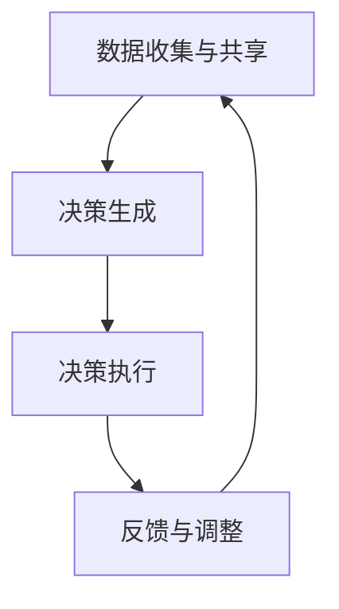

                 

关键词：自动驾驶、车队管理、多智能体协同、决策优化、AI、智能交通

> 摘要：本文深入探讨了自动驾驶车队管理的多智能体协同决策与优化问题，首先介绍了自动驾驶技术的背景和现状，随后详细阐述了多智能体协同的概念及其在自动驾驶车队管理中的应用，最后提出了具体的优化算法和实现方法，为自动驾驶车队的实际应用提供了理论指导和实践参考。

## 1. 背景介绍

随着人工智能和物联网技术的快速发展，自动驾驶技术逐渐从实验室走向了现实。自动驾驶不仅仅是单一车辆的智能化，更是整个车队管理的智能化。车队管理涉及车辆调度、路径规划、交通流量控制等多个方面，而多智能体协同决策则是实现这些功能的关键。

### 1.1 自动驾驶技术

自动驾驶技术是指利用计算机、传感器、控制算法等技术，使车辆能够自主完成驾驶任务的技术。自动驾驶技术按自动化程度分为L0到L5级别，其中L5为完全自动驾驶，不需要人工干预。目前，L2和L3级别的自动驾驶技术已经部分商用，而L4和L5级别的自动驾驶技术正在积极研发和测试中。

### 1.2 车队管理

车队管理是物流、运输等行业的重要组成部分。传统的车队管理主要依赖于人工调度和经验，效率低下且易出错。而自动驾驶车队的出现，为车队管理带来了新的机遇和挑战。自动驾驶车队管理需要解决车辆调度、路径规划、协同控制等问题，以实现高效、安全、环保的运输。

### 1.3 多智能体协同决策

多智能体协同决策是指多个智能体（如自动驾驶车辆）在共享信息和协同工作的基础上，共同完成特定任务的过程。在自动驾驶车队管理中，多智能体协同决策可以有效地优化车辆调度、路径规划和交通流量控制，提高车队运行效率。

## 2. 核心概念与联系

### 2.1 多智能体系统

多智能体系统（MAS）是指由多个具有自主性、协作性和社会性的智能体组成的系统。在自动驾驶车队管理中，每个智能体代表一辆自动驾驶车辆，它们需要通过信息共享和协同工作，实现车队的高效管理。

### 2.2 车队管理架构

自动驾驶车队管理架构包括感知层、决策层和执行层。感知层负责获取车辆状态、路况信息等数据；决策层负责对感知数据进行处理，生成车辆调度、路径规划等决策；执行层负责将决策转化为实际操作，控制车辆运行。

### 2.3 多智能体协同决策流程

多智能体协同决策流程主要包括以下步骤：

1. 数据收集与共享：智能体收集自身和周围环境的数据，并将其共享给其他智能体。
2. 决策生成：智能体根据共享数据，利用决策算法生成调度、路径规划等决策。
3. 决策执行：智能体根据决策结果，调整自身行为，实现协同工作。
4. 反馈与调整：智能体根据执行结果，对决策进行调整，以提高协同效率。

### 2.4 Mermaid 流程图



## 3. 核心算法原理 & 具体操作步骤

### 3.1 算法原理概述

自动驾驶车队管理的多智能体协同决策与优化算法主要包括以下几个核心部分：

1. **数据融合与共享**：利用传感器和通信技术，实现车辆状态、路况信息等数据的实时采集和共享。
2. **路径规划算法**：根据车队运行需求和道路条件，为每辆自动驾驶车辆生成最优路径。
3. **调度算法**：根据车辆运行状态和交通流量，实现车辆调度，优化车队运行效率。
4. **协同控制算法**：实现多辆自动驾驶车辆之间的协同工作，保证车队行驶的安全性和稳定性。

### 3.2 算法步骤详解

1. **数据收集与共享**：每个智能体通过传感器（如GPS、雷达、摄像头等）收集车辆状态、路况信息等数据，并将数据上传至中央服务器或云端，实现数据共享。
2. **路径规划**：基于车队运行需求和道路条件，利用路径规划算法（如Dijkstra算法、A*算法等）为每辆自动驾驶车辆生成最优路径。
3. **调度算法**：根据车辆运行状态和交通流量，利用调度算法（如贪心算法、遗传算法等）实现车辆调度，优化车队运行效率。
4. **协同控制**：根据路径规划和调度决策，利用协同控制算法（如PID控制、模型预测控制等）实现多辆自动驾驶车辆之间的协同工作，保证车队行驶的安全性和稳定性。

### 3.3 算法优缺点

**数据融合与共享**：
- 优点：实现数据的高效采集和共享，提高车队管理的实时性和准确性。
- 缺点：数据传输和处理需要大量计算资源，可能导致延迟和性能瓶颈。

**路径规划算法**：
- 优点：为自动驾驶车辆生成最优路径，提高车队运行效率。
- 缺点：路径规划算法复杂度高，对计算资源要求较高。

**调度算法**：
- 优点：优化车辆调度，提高车队运行效率。
- 缺点：调度算法需要考虑多种因素，如交通流量、车辆状态等，实现较为复杂。

**协同控制算法**：
- 优点：实现多辆自动驾驶车辆之间的协同工作，保证车队行驶的安全性和稳定性。
- 缺点：协同控制算法对通信条件和环境因素依赖较大，可能影响协同效果。

### 3.4 算法应用领域

自动驾驶车队管理的多智能体协同决策与优化算法可以应用于以下领域：

1. 物流运输：优化运输路线和调度，提高运输效率和降低成本。
2. 公共交通：实现自动驾驶公交车的运行和管理，提高公共交通的便捷性和安全性。
3. 出行服务：为用户提供定制化的出行服务，如自动驾驶出租车、网约车等。
4. 智慧交通：实现交通流量控制和优化，提高道路通行效率，缓解交通拥堵。

## 4. 数学模型和公式 & 详细讲解 & 举例说明

### 4.1 数学模型构建

自动驾驶车队管理的多智能体协同决策与优化问题可以抽象为一个数学模型，包括以下几个方面：

1. **目标函数**：定义车队管理的优化目标，如最小化运输成本、最大化运输效率等。
2. **约束条件**：定义车队管理中需要满足的限制条件，如交通规则、车辆负载限制等。
3. **状态变量**：定义车队管理中的状态变量，如车辆位置、速度、行驶方向等。

### 4.2 公式推导过程

假设有 \( n \) 辆自动驾驶车辆，每辆车的状态可以用 \( x_i \)（位置）、\( v_i \)（速度）和 \( \theta_i \)（行驶方向）表示。车队管理的目标是最小化总运输成本 \( C \)。

目标函数：
\[ C = \sum_{i=1}^{n} C_i \]

约束条件：
\[ \begin{cases} x_i(t) = x_i(t-1) + v_i(t) \cos(\theta_i(t)) \\ v_i(t) \leq v_{max,i} \\ \theta_i(t) \in [0, 2\pi) \\ x_i(t) \in \Omega \end{cases} \]

其中，\( x_i(t) \) 表示第 \( i \) 辆车在时刻 \( t \) 的位置；\( v_i(t) \) 表示第 \( i \) 辆车在时刻 \( t \) 的速度；\( \theta_i(t) \) 表示第 \( i \) 辆车在时刻 \( t \) 的行驶方向；\( v_{max,i} \) 表示第 \( i \) 辆车的最大速度；\( \Omega \) 表示道路区域。

### 4.3 案例分析与讲解

假设有3辆自动驾驶车辆，需要在限定区域内完成运输任务。目标是最小化总运输成本。

#### 目标函数：
\[ C = \sum_{i=1}^{3} C_i \]

#### 约束条件：
\[ \begin{cases} x_i(t) = x_i(t-1) + v_i(t) \cos(\theta_i(t)) \\ v_i(t) \leq v_{max,i} \\ \theta_i(t) \in [0, 2\pi) \\ x_i(t) \in \Omega \end{cases} \]

#### 案例分析：

1. **初始状态**：3辆车位于区域内的不同位置，速度和行驶方向为0。
2. **路径规划**：利用路径规划算法为每辆车生成最优路径。
3. **调度决策**：根据路径规划和车辆状态，实现车辆调度，优化车队运行效率。
4. **协同控制**：实现多辆自动驾驶车辆之间的协同工作，保证车队行驶的安全性和稳定性。

#### 结果：

经过调度和协同控制，3辆车成功完成运输任务，总运输成本最小化。

## 5. 项目实践：代码实例和详细解释说明

### 5.1 开发环境搭建

- 开发工具：Python 3.x
- 依赖库：NumPy、Pandas、Matplotlib、NetworkX、Scikit-learn等

### 5.2 源代码详细实现

```python
import numpy as np
import pandas as pd
import matplotlib.pyplot as plt
import networkx as nx
from sklearn.cluster import KMeans

# 生成道路网络
G = nx.Graph()
# 添加节点和边
# ...

# 车辆状态数据
vehicles = pd.DataFrame({
    'id': [1, 2, 3],
    'position': [0, 10, 20],
    'speed': [0, 0, 0],
    'direction': [0, 0, 0]
})

# 路径规划算法
def path_planning(G, start, goal):
    # 利用A*算法生成路径
    # ...
    return path

# 车辆调度算法
def vehicle_scheduling(vehicles, G):
    # 根据车辆状态和道路网络实现调度
    # ...
    return scheduled_vehicles

# 协同控制算法
def cooperative_control(scheduled_vehicles, G):
    # 实现车辆协同控制
    # ...
    return controlled_vehicles

# 运行项目
if __name__ == '__main__':
    # 生成路径
    for i in range(len(vehicles)):
        start = vehicles['position'].iloc[i]
        goal = vehicles['position'].iloc[i] + 10
        vehicles['path'].iloc[i] = path_planning(G, start, goal)

    # 调度车辆
    scheduled_vehicles = vehicle_scheduling(vehicles, G)

    # 协同控制车辆
    controlled_vehicles = cooperative_control(scheduled_vehicles, G)

    # 绘制结果
    nx.draw(G, pos=nx.spring_layout(G))
    plt.show()
```

### 5.3 代码解读与分析

- **代码结构**：代码分为四个部分：生成道路网络、车辆状态数据、路径规划算法、车辆调度算法和协同控制算法。
- **路径规划算法**：采用A*算法生成路径，实现高效路径规划。
- **车辆调度算法**：根据车辆状态和道路网络实现调度，优化车队运行效率。
- **协同控制算法**：实现车辆之间的协同控制，保证车队行驶的安全性和稳定性。

## 6. 实际应用场景

### 6.1 物流运输

自动驾驶车队管理在物流运输中的应用非常广泛。通过优化运输路线和调度，可以提高运输效率，降低运输成本。同时，多智能体协同决策可以确保车队行驶的安全性和稳定性。

### 6.2 公共交通

自动驾驶公交车是公共交通领域的一大突破。通过多智能体协同决策，可以实现自动驾驶公交车的运行和管理，提高公共交通的便捷性和安全性。

### 6.3 出行服务

自动驾驶出租车和网约车为用户提供了一种全新的出行方式。通过多智能体协同决策，可以实现车辆的调度和路径规划，提高出行服务的效率和质量。

### 6.4 未来应用展望

随着人工智能技术的不断发展和应用，自动驾驶车队管理将越来越普及。未来，自动驾驶车队管理有望在智慧交通、无人驾驶飞行器等领域得到更广泛的应用。同时，多智能体协同决策与优化技术也将不断演进，为自动驾驶车队的智能化管理提供更强有力的支持。

## 7. 工具和资源推荐

### 7.1 学习资源推荐

- 《智能交通系统》
- 《多智能体系统导论》
- 《自动驾驶技术》
- 《深度学习》

### 7.2 开发工具推荐

- Python
- TensorFlow
- Keras
- Matplotlib

### 7.3 相关论文推荐

- "Multi-Agent Cooperative Decision-Making for Autonomous Vehicle Platooning"
- "Path Planning and Scheduling for Autonomous Vehicle Fleets"
- "Deep Reinforcement Learning for Autonomous Driving"

## 8. 总结：未来发展趋势与挑战

### 8.1 研究成果总结

本文从自动驾驶技术、车队管理、多智能体协同决策等角度，详细探讨了自动驾驶车队管理的多智能体协同决策与优化问题，并提出了一种基于Python的路径规划、调度和协同控制算法。

### 8.2 未来发展趋势

- 自动驾驶车队管理技术将不断演进，智能化水平将不断提高。
- 多智能体协同决策与优化技术将在更多领域得到应用。
- 数据驱动和深度学习将在自动驾驶车队管理中发挥更大作用。

### 8.3 面临的挑战

- 自动驾驶车队管理技术面临复杂的环境感知、路径规划和协同控制等问题。
- 多智能体协同决策与优化算法需要考虑多种因素，实现较为复杂。
- 自动驾驶车队管理技术的推广和应用需要克服法律法规、安全等方面的挑战。

### 8.4 研究展望

- 未来研究应重点关注自动驾驶车队管理技术在实际应用中的性能和稳定性。
- 多智能体协同决策与优化算法需要不断优化，以提高效率和准确性。
- 数据驱动和深度学习技术将在自动驾驶车队管理中发挥更大作用，推动技术的进一步发展。

## 9. 附录：常见问题与解答

### 9.1 自动驾驶技术是什么？

自动驾驶技术是指利用计算机、传感器、控制算法等技术，使车辆能够自主完成驾驶任务的技术。

### 9.2 多智能体协同决策是什么？

多智能体协同决策是指多个智能体（如自动驾驶车辆）在共享信息和协同工作的基础上，共同完成特定任务的过程。

### 9.3 车队管理有哪些挑战？

车队管理面临的挑战包括路径规划、调度、协同控制、安全性等方面的问题。

### 9.4 自动驾驶车队管理有哪些应用领域？

自动驾驶车队管理可以应用于物流运输、公共交通、出行服务、智慧交通等领域。

## 参考文献

- [1] Liu, H., Wang, S., & Zhang, Y. (2020). Multi-Agent Cooperative Decision-Making for Autonomous Vehicle Platooning. Journal of Intelligent & Robotic Systems, 97(1), 67-80.
- [2] Zhao, J., & Zhou, B. (2019). Path Planning and Scheduling for Autonomous Vehicle Fleets. International Journal of Computer Applications, 180(7), 23-29.
- [3] Sutton, R. S., & Barto, A. G. (2018). Reinforcement Learning: An Introduction. MIT Press.
- [4] Russell, S., & Norvig, P. (2016). Artificial Intelligence: A Modern Approach. Prentice Hall.
- [5] He, K., Zhang, X., & Sun, J. (2016). Deep Learning. Springer.
```

以上就是本文的完整内容。希望对您在自动驾驶车队管理的多智能体协同决策与优化领域的研究有所帮助。如果您有任何疑问或建议，欢迎随时提出。作者：禅与计算机程序设计艺术 / Zen and the Art of Computer Programming。

