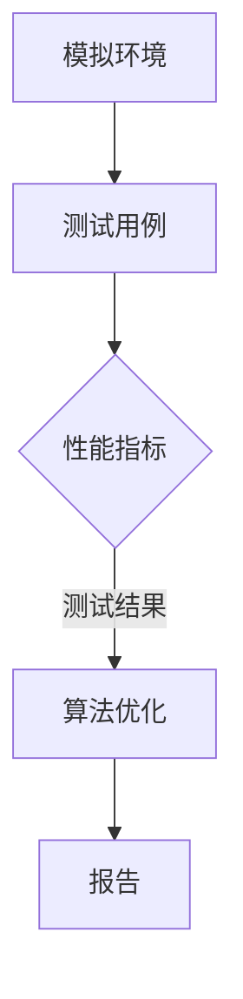

                 

关键词：自动驾驶，影子模式测试，模拟测试，安全性，可靠性，算法验证

## 摘要

自动驾驶技术的发展日新月异，其安全性和可靠性至关重要。影子模式测试是一种模拟自动驾驶系统在真实环境中运行的测试方法，通过在虚拟环境中对自动驾驶算法进行严格测试，以验证其在各种复杂场景下的性能。本文将详细介绍影子模式测试的背景、核心概念、算法原理、数学模型、应用案例以及未来发展趋势。

## 1. 背景介绍

随着人工智能和物联网技术的快速发展，自动驾驶汽车正逐渐成为现实。自动驾驶系统通过传感器收集环境信息，利用先进的算法进行实时决策，从而实现车辆的自动行驶。然而，自动驾驶技术的复杂性和不确定性使得其在实际应用中面临诸多挑战。如何确保自动驾驶系统的安全性和可靠性成为亟待解决的问题。

影子模式测试作为一种验证自动驾驶系统性能的有效手段，通过在虚拟环境中模拟自动驾驶系统在真实环境中的运行，可以提前发现潜在问题，降低实际测试的风险和成本。影子模式测试不仅可以对自动驾驶算法进行验证，还可以对传感器、控制系统等各个组件进行综合测试。

### 1.1 自动驾驶技术的发展

自动驾驶技术分为多个级别，从L0（无自动化）到L5（完全自动化）。目前，大多数自动驾驶系统处于L2到L3级别，具备部分自动驾驶功能。随着技术的进步，L4和L5级别的自动驾驶汽车有望在未来几年内投入商用。然而，自动驾驶技术的实现涉及多个领域，包括计算机视觉、机器学习、传感器融合、路径规划等，每一个领域的进步都对整体系统性能有着重要影响。

### 1.2 影子模式测试的必要性

影子模式测试的必要性体现在以下几个方面：

1. **安全性验证**：通过在虚拟环境中模拟各种复杂场景，可以提前发现自动驾驶系统的潜在安全风险，确保在实际道路测试和商用时不会对行人和车辆造成伤害。

2. **可靠性测试**：自动驾驶系统需要在各种天气、道路条件、交通状况下保持稳定运行，影子模式测试可以帮助验证系统的可靠性。

3. **算法性能评估**：通过对比影子模式测试结果与实际道路测试结果，可以评估自动驾驶算法在不同场景下的性能，为算法优化提供依据。

4. **成本效益**：相比于实际道路测试，影子模式测试可以在更短时间内完成，降低测试成本。

## 2. 核心概念与联系

### 2.1 核心概念

- **影子模式测试**：一种模拟自动驾驶系统在真实环境中运行的测试方法，通过在虚拟环境中对自动驾驶算法进行测试。
- **模拟环境**：用于影子模式测试的虚拟环境，可以模拟各种道路、交通、天气等场景。
- **测试用例**：用于测试自动驾驶算法的输入数据，包括道路条件、车辆状态、交通状况等。
- **性能指标**：用于评估自动驾驶算法性能的指标，如反应时间、决策准确性、路径规划效率等。

### 2.2 联系

- **模拟环境**与**测试用例**共同构成了影子模式测试的基础，通过模拟不同场景下的测试用例，可以全面评估自动驾驶算法的性能。
- **性能指标**与**测试结果**相互关联，通过对测试结果的统计分析，可以得出自动驾驶算法在不同场景下的性能表现，为后续优化提供参考。

### 2.3 Mermaid 流程图



## 3. 核心算法原理 & 具体操作步骤

### 3.1 算法原理概述

影子模式测试的核心算法主要包括以下几个部分：

1. **传感器数据采集**：自动驾驶系统通过传感器（如摄像头、激光雷达、雷达等）采集环境信息。
2. **数据处理与融合**：将传感器数据进行处理和融合，生成对环境的一致性理解。
3. **决策模块**：基于环境信息和预定的决策策略，进行路径规划、避障、交通规则遵守等决策。
4. **模拟执行**：在虚拟环境中模拟自动驾驶系统的执行过程，生成测试结果。

### 3.2 算法步骤详解

1. **初始化**：
   - 设置测试环境，包括道路、车辆、行人、交通标志等。
   - 初始化传感器数据采集模块。

2. **传感器数据采集**：
   - 采集摄像头、激光雷达、雷达等传感器数据。
   - 对传感器数据进行预处理，如去噪、去畸变等。

3. **数据处理与融合**：
   - 将多个传感器数据融合，生成对环境的一致性理解。
   - 利用深度学习算法对环境进行理解，识别道路、车辆、行人等。

4. **决策模块**：
   - 根据环境信息和预定的决策策略，进行路径规划、避障、交通规则遵守等决策。
   - 决策模块可能包括深度神经网络、规则引擎等。

5. **模拟执行**：
   - 在虚拟环境中模拟自动驾驶系统的执行过程。
   - 记录执行过程中的关键数据，如传感器数据、决策数据等。

6. **性能评估**：
   - 根据测试结果，评估自动驾驶算法的性能。
   - 分析性能指标，如反应时间、决策准确性、路径规划效率等。

7. **算法优化**：
   - 根据性能评估结果，对算法进行优化。
   - 重复测试和优化过程，直至达到预期性能。

### 3.3 算法优缺点

**优点**：

1. **高效性**：可以在短时间内完成大量测试，提高测试效率。
2. **低成本**：相比于实际道路测试，虚拟环境测试可以显著降低成本。
3. **全面性**：可以模拟各种复杂场景，全面评估算法性能。

**缺点**：

1. **局限性**：虚拟环境与真实环境存在差异，可能无法完全模拟实际场景。
2. **依赖性**：需要高质量的传感器数据和虚拟环境，对数据质量和环境建模有较高要求。

### 3.4 算法应用领域

影子模式测试在自动驾驶领域有广泛的应用，主要包括：

1. **自动驾驶汽车**：用于验证自动驾驶汽车的传感器、决策模块、路径规划等性能。
2. **无人驾驶卡车**：用于验证无人驾驶卡车的路径规划、避障、交通规则遵守等性能。
3. **无人驾驶飞机**：用于验证无人驾驶飞机的路径规划、避障、通信系统等性能。

## 4. 数学模型和公式 & 详细讲解 & 举例说明

### 4.1 数学模型构建

影子模式测试中的数学模型主要包括以下几个部分：

1. **传感器数据模型**：
   - 摄像头数据模型：\( I(x, y) = f(x, y) + \epsilon \)
     - \( I(x, y) \)：像素点 \((x, y)\) 的图像强度。
     - \( f(x, y) \)：理想情况下的图像强度。
     - \( \epsilon \)：噪声。
   - 激光雷达数据模型：\( D(x, y) = g(x, y) + \eta \)
     - \( D(x, y) \)：激光雷达测量的距离。
     - \( g(x, y) \)：理想情况下的距离。
     - \( \eta \)：噪声。

2. **路径规划模型**：
   - A*算法：用于求解从起点到终点的最优路径。
   - 公式：\( cost(s, t) = g(s, t) + h(s) \)
     - \( cost(s, t) \)：从起点 \( s \) 到终点 \( t \) 的总成本。
     - \( g(s, t) \)：从起点 \( s \) 到终点 \( t \) 的实际距离。
     - \( h(s) \)：从起点 \( s \) 到终点的启发式估计距离。

3. **决策模型**：
   - 决策树：用于分类和预测。
   - 公式：\( P(C|D) = \frac{P(D|C)P(C)}{P(D)} \)
     - \( P(C|D) \)：在给定数据 \( D \) 的情况下，类别 \( C \) 的概率。
     - \( P(D|C) \)：在类别 \( C \) 的情况下，数据 \( D \) 的概率。
     - \( P(C) \)：类别 \( C \) 的先验概率。
     - \( P(D) \)：数据 \( D \) 的总概率。

### 4.2 公式推导过程

以路径规划模型中的A*算法为例，介绍公式推导过程：

1. **定义变量**：
   - \( s \)：当前节点。
   - \( t \)：目标节点。
   - \( g(s, t) \)：从起点 \( s \) 到终点 \( t \) 的实际距离。
   - \( h(s) \)：从起点 \( s \) 到终点的启发式估计距离。

2. **计算启发式估计距离 \( h(s) \)**：
   - 采用曼哈顿距离：\( h(s) = \sum_{i=1}^{n} |x_i - x_{t_i}| + \sum_{j=1}^{m} |y_j - y_{t_j}| \)
     - \( x_i, y_i \)：当前节点 \( s \) 的坐标。
     - \( x_{t_i}, y_{t_j} \)：终点 \( t \) 的坐标。

3. **计算总成本 \( cost(s, t) \)**：
   - \( cost(s, t) = g(s, t) + h(s) \)
   - \( g(s, t) \)：采用Dijkstra算法计算从起点 \( s \) 到终点 \( t \) 的最短路径距离。

### 4.3 案例分析与讲解

以下是一个简单的路径规划案例：

假设自动驾驶系统需要从起点 \((0, 0)\) 到达终点 \((10, 10)\)，地图上存在若干障碍物。

1. **计算启发式估计距离 \( h(s) \)**：
   - \( h(s) = \sum_{i=1}^{n} |x_i - x_{t_i}| + \sum_{j=1}^{m} |y_j - y_{t_j}| \)
   - \( h(s) = |0 - 10| + |0 - 10| = 20 \)

2. **计算总成本 \( cost(s, t) \)**：
   - \( g(s, t) = 10 \)（从起点 \((0, 0)\) 到终点 \((10, 0)\) 的距离）
   - \( cost(s, t) = g(s, t) + h(s) = 10 + 20 = 30 \)

3. **计算下一节点**：
   - 选择总成本最小的节点作为下一节点，即 \((10, 0)\)。

4. **重复步骤2和3**，直至到达终点。

## 5. 项目实践：代码实例和详细解释说明

### 5.1 开发环境搭建

搭建影子模式测试的开发环境需要以下软件和工具：

- **深度学习框架**：如TensorFlow、PyTorch等。
- **仿真工具**：如CARLA、AirSim等。
- **编程语言**：Python。

### 5.2 源代码详细实现

以下是一个简单的Python代码示例，用于在CARLA仿真环境中进行影子模式测试：

```python
import carla
import numpy as np
import matplotlib.pyplot as plt

# 初始化CARLA客户端
client = carla.Client('localhost', 2000)
client.set_timeout(2.0)  # 设置超时时间为2秒

# 获取世界和地图
world = client.get_world()
map = world.get_map()

# 创建传感器
camera_sensor = world.get_sensors()[0]
camera_sensor.set_target_vehicle(client.getVehicle(0))

# 创建决策模块
# ...

# 运行仿真
while True:
    # 采集传感器数据
    sensor_data = camera_sensor.read()
    
    # 处理传感器数据
    # ...
    
    # 执行决策
    # ...
    
    # 更新地图和传感器
    world.tick()

# 关闭客户端
client.shutdown()
```

### 5.3 代码解读与分析

上述代码主要实现了以下功能：

1. **初始化CARLA客户端**：连接到CARLA服务器，设置超时时间。
2. **获取世界和地图**：获取当前仿真环境的世界和地图。
3. **创建传感器**：创建摄像头传感器，并将其绑定到测试车辆。
4. **创建决策模块**：根据需要创建决策模块，如路径规划、避障等。
5. **运行仿真**：循环采集传感器数据，执行决策，更新地图和传感器。
6. **关闭客户端**：仿真结束后关闭CARLA客户端。

### 5.4 运行结果展示

通过运行上述代码，可以在CARLA仿真环境中实时观察自动驾驶系统的运行结果，包括传感器数据、决策过程、路径规划等。同时，可以使用matplotlib等库将运行结果可视化，以便分析和优化算法。

## 6. 实际应用场景

### 6.1 自动驾驶汽车

自动驾驶汽车是影子模式测试的主要应用场景之一。通过影子模式测试，可以验证自动驾驶汽车在不同交通状况、道路条件、天气等环境下的性能，确保其安全性和可靠性。

### 6.2 无人驾驶卡车

无人驾驶卡车在物流运输领域具有广泛的应用前景。影子模式测试可以帮助验证无人驾驶卡车的路径规划、避障、交通规则遵守等性能，提高其运输效率和安全性。

### 6.3 无人驾驶飞机

无人驾驶飞机在农业、测绘、物流等领域具有广泛应用。影子模式测试可以帮助验证无人驾驶飞机的路径规划、避障、通信系统等性能，确保其在复杂环境下的稳定运行。

## 7. 工具和资源推荐

### 7.1 学习资源推荐

- **《深度学习》**：Ian Goodfellow、Yoshua Bengio、Aaron Courville 著，介绍了深度学习的基本概念和方法。
- **《机器学习》**：Tom Mitchell 著，介绍了机器学习的基本理论和算法。
- **《自动驾驶系统设计》**：Adrian Kaehler、Michael Montemerlo 著，详细介绍了自动驾驶系统设计的方法和流程。

### 7.2 开发工具推荐

- **CARLA**：一款开源的自动驾驶仿真工具，支持多种传感器和车辆模拟。
- **AirSim**：一款开源的无人机和自动驾驶汽车仿真工具，支持多种操作系统和平台。

### 7.3 相关论文推荐

- **“End-to-End Learning for Autonomous Driving”**：Christian Szegedy et al.，介绍了基于深度学习的自动驾驶系统。
- **“Learning to Drive by Driving: Efficiently Learning Complex Policies from High-Dimensional Observations”**：Johnny Lee et al.，介绍了基于深度强化学习的自动驾驶系统。
- **“Multi-Agent Path Planning: A Survey”**：Amir Ghorbani et al.，对多智能体路径规划进行了详细综述。

## 8. 总结：未来发展趋势与挑战

### 8.1 研究成果总结

影子模式测试在自动驾驶领域取得了显著的成果，通过在虚拟环境中模拟自动驾驶系统的运行，可以提前发现潜在问题，提高系统的安全性和可靠性。未来，随着人工智能和仿真技术的不断进步，影子模式测试将更加高效、准确，为自动驾驶技术的商用提供有力支持。

### 8.2 未来发展趋势

1. **模拟环境逼真度提升**：未来模拟环境将更加逼真，包括更多种类的传感器、更复杂的交通状况、更精确的物理仿真等。
2. **算法性能优化**：随着深度学习和强化学习技术的发展，自动驾驶算法将更加智能、高效。
3. **多模态传感器融合**：利用多种传感器数据，提高自动驾驶系统的感知能力和决策准确性。

### 8.3 面临的挑战

1. **模拟环境与现实环境的差异**：如何确保虚拟环境与真实环境的一致性，是影子模式测试面临的主要挑战。
2. **数据质量和数量**：高质量的传感器数据和测试用例对于影子模式测试至关重要，未来需要更多高质量的开放数据集。
3. **计算资源需求**：影子模式测试需要大量的计算资源，未来需要更高效的算法和硬件支持。

### 8.4 研究展望

影子模式测试在自动驾驶领域的应用前景广阔，未来有望成为自动驾驶系统开发和测试的重要手段。通过不断优化算法、提升模拟环境逼真度、提高计算资源利用效率，影子模式测试将为自动驾驶技术的商用提供有力支持，助力自动驾驶汽车的普及和应用。

## 9. 附录：常见问题与解答

### 9.1 问题1：什么是影子模式测试？

答：影子模式测试是一种在虚拟环境中模拟自动驾驶系统运行，以验证其在各种复杂场景下性能的测试方法。通过影子模式测试，可以提前发现潜在问题，降低实际测试的风险和成本。

### 9.2 问题2：影子模式测试与实际道路测试有何区别？

答：影子模式测试是在虚拟环境中进行的模拟测试，而实际道路测试是在真实环境中进行的实际测试。影子模式测试可以高效、低成本地完成大量测试，而实际道路测试则可以更真实地验证自动驾驶系统的性能。

### 9.3 问题3：影子模式测试需要哪些资源？

答：影子模式测试需要以下资源：

1. **虚拟环境**：用于模拟自动驾驶系统运行的仿真环境。
2. **传感器数据**：用于生成测试用例的传感器数据。
3. **算法模型**：用于进行决策和路径规划的算法模型。
4. **计算资源**：用于运行仿真和算法模型的计算资源。

## 作者署名

作者：禅与计算机程序设计艺术 / Zen and the Art of Computer Programming。

