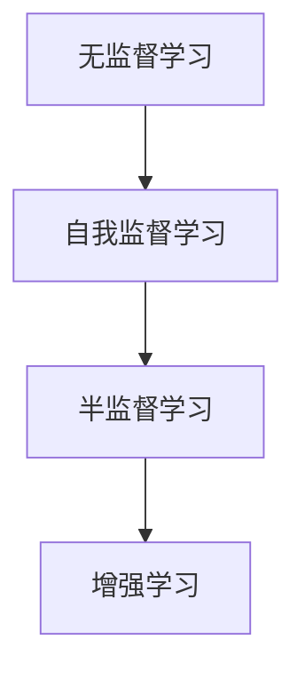

                 

自我监督学习作为人工智能领域的一项前沿技术，近年来受到了广泛关注。它通过利用数据中的内在结构，无需依赖标注数据，实现模型的训练与优化。本文将深入探讨自我监督学习的核心概念、算法原理、数学模型以及实际应用，并展望其未来发展趋势与挑战。

## 文章关键词

- 自我监督学习
- 无监督学习
- 人工智能
- 深度学习
- 数据利用

## 文章摘要

自我监督学习通过自动发现数据中的关联性，提高了人工智能模型的训练效率。本文详细阐述了自我监督学习的概念、核心算法、数学模型及其在不同领域的应用，并探讨了其在未来的发展趋势和面临的挑战。

## 1. 背景介绍

在传统的监督学习框架中，模型训练依赖于大量标注数据。然而，获取高质量的标注数据往往成本高昂，且在某些领域（如图像识别、自然语言处理）中，标注数据的获取难度极大。自我监督学习通过利用未标注的数据，实现了在无需人为标注的情况下，提高模型性能的目的。自我监督学习的出现，极大地推动了人工智能技术的发展。

### 1.1 自我监督学习的起源与发展

自我监督学习最早可以追溯到20世纪50年代的认知心理学领域。当时，心理学家詹姆斯·马修·格思里（James Mauchly Gazzaniga）提出了“自我监督”的概念，认为个体可以通过自我监督来改善行为。这一思想在计算机科学领域得到了进一步的延伸。

20世纪80年代，深度学习技术的兴起为自我监督学习提供了技术基础。随着计算能力的提升和大规模数据的积累，自我监督学习逐渐成为人工智能领域的研究热点。近年来，随着无监督学习的深入研究，自我监督学习在图像识别、自然语言处理、语音识别等领域的应用取得了显著成果。

### 1.2 自我监督学习的重要性

自我监督学习的重要性主要体现在以下几个方面：

1. **降低数据获取成本**：通过无需依赖标注数据，自我监督学习减少了数据标注的工作量，降低了数据获取的成本。

2. **提高模型性能**：自我监督学习能够自动发现数据中的内在结构，有助于提高模型的性能。

3. **泛化能力**：自我监督学习可以训练出具有更强泛化能力的模型，使其在新的数据集上表现优异。

4. **适应性强**：自我监督学习能够适应不同的数据分布和场景，具有较强的适应性。

## 2. 核心概念与联系

自我监督学习涉及多个核心概念，包括无监督学习、半监督学习和增强学习等。以下是一个简化的Mermaid流程图，用于描述这些概念之间的联系。



### 2.1 无监督学习

无监督学习是一种无需标注数据的学习方法，其主要目标是发现数据中的结构或模式。自我监督学习是无监督学习的一种特殊形式，它利用数据自身的关联性，实现模型的训练与优化。

### 2.2 半监督学习

半监督学习结合了无监督学习和监督学习的特点，它利用少量的标注数据和大量未标注数据，提高模型的性能。自我监督学习可以看作是半监督学习的一种特殊情况，即完全利用未标注数据。

### 2.3 增强学习

增强学习是一种通过试错来学习的方法，它利用环境的反馈来调整策略，以实现最优目标。自我监督学习可以看作是增强学习的一种特殊形式，它通过数据自身的关联性，实现策略的优化。

## 3. 核心算法原理 & 具体操作步骤

自我监督学习的核心算法主要包括生成对抗网络（GAN）、自编码器（Autoencoder）和基于信息论的方法等。以下将分别介绍这些算法的原理和具体操作步骤。

### 3.1 生成对抗网络（GAN）

生成对抗网络（GAN）是由生成器和判别器组成的对抗性模型。生成器的目标是生成与真实数据类似的数据，而判别器的目标是区分真实数据和生成数据。通过两者之间的对抗，生成器不断优化其生成能力，判别器不断优化其区分能力。

**具体操作步骤：**

1. **初始化**：随机初始化生成器和判别器的参数。

2. **生成数据**：生成器生成一批假数据。

3. **训练判别器**：使用真实数据和生成数据同时训练判别器。

4. **训练生成器**：使用判别器的反馈，优化生成器的参数。

5. **重复步骤2-4**，直到生成器生成数据的质量达到预期。

### 3.2 自编码器（Autoencoder）

自编码器是一种无监督学习算法，它通过学习数据的压缩表示来重构输入数据。自编码器包括编码器和解码器两部分，编码器将输入数据压缩成低维表示，解码器将低维表示重构回输入数据。

**具体操作步骤：**

1. **初始化**：随机初始化编码器和解码器的参数。

2. **训练编码器**：使用输入数据训练编码器，使其能够将输入数据压缩成低维表示。

3. **训练解码器**：使用编码器的输出数据训练解码器，使其能够将低维表示重构回输入数据。

4. **优化整体模型**：同时优化编码器和解码器的参数，使其在重构误差最小的情况下工作。

### 3.3 基于信息论的方法

基于信息论的方法通过最小化数据之间的信息差异，实现自我监督学习。其中，代表性算法包括信息瓶颈（Information Bottleneck）和变分自编码器（Variational Autoencoder，VAE）。

**信息瓶颈算法原理：**

信息瓶颈算法的目标是最小化编码器输出的熵与数据中特定信息量之间的差异。具体步骤如下：

1. **初始化**：随机初始化编码器和解码器的参数。

2. **训练编码器**：使用输入数据训练编码器，使其输出数据的熵最小。

3. **训练解码器**：使用编码器的输出数据训练解码器，使其能够重构输入数据。

4. **优化整体模型**：同时优化编码器和解码器的参数，使其在重构误差和信息差异最小的情况下工作。

**VAE算法原理：**

VAE是一种基于概率生成模型的自我监督学习方法。其核心思想是将数据生成过程建模为一个概率分布，并通过优化概率分布的参数来实现自我监督学习。

1. **初始化**：随机初始化编码器和解码器的参数。

2. **训练编码器**：使用输入数据训练编码器，使其能够生成数据的高斯分布。

3. **训练解码器**：使用编码器的输出数据训练解码器，使其能够重构输入数据。

4. **优化整体模型**：同时优化编码器和解码器的参数，使其在重构误差和概率分布最小化误差之间工作。

### 3.4 算法优缺点

每种自我监督学习算法都有其优缺点。以下是对GAN、自编码器和信息瓶颈算法的优缺点的简要总结：

**GAN：**

- **优点**：能够生成高质量的数据，适用于图像生成和风格迁移等领域。

- **缺点**：训练过程容易陷入局部最优，且生成数据的质量依赖于判别器的性能。

**自编码器：**

- **优点**：简单易懂，易于实现，适用于数据降维和特征提取。

- **缺点**：生成数据的质量较低，且无法直接应用于生成任务。

**信息瓶颈算法：**

- **优点**：能够有效降低数据维度，适用于特征提取和降维任务。

- **缺点**：生成数据的质量较低，且无法直接应用于生成任务。

### 3.5 算法应用领域

自我监督学习在多个领域取得了显著成果，以下是一些典型应用领域：

- **图像识别**：GAN在图像生成和风格迁移方面具有优势，而自编码器在图像降维和特征提取方面表现出色。

- **自然语言处理**：自我监督学习在语言模型预训练和文本生成方面具有重要应用。

- **语音识别**：自编码器和GAN在语音特征提取和语音生成方面发挥了重要作用。

- **推荐系统**：自我监督学习可以用于用户兴趣建模和商品推荐。

## 4. 数学模型和公式 & 详细讲解 & 举例说明

自我监督学习的核心在于对数据内在结构的挖掘和利用，这需要借助数学模型和公式进行精确描述。以下将详细介绍自我监督学习中的关键数学模型和公式，并通过具体例子进行说明。

### 4.1 数学模型构建

自我监督学习的数学模型通常包括编码器和解码器两部分。编码器负责将输入数据编码成低维表示，解码器则负责将低维表示解码回原始数据。这种结构使得模型能够在无监督环境中学习数据的内在结构。

#### 编码器

编码器通常采用神经网络结构，其输出为数据的低维表示。为了保持信息的完整性，编码器通常设计为一个压缩函数，即：

$$
z = f_{\theta}(x)
$$

其中，$z$为编码器输出，$x$为输入数据，$f_{\theta}$为编码器函数，$\theta$为编码器的参数。

#### 解码器

解码器也采用神经网络结构，其输入为编码器的输出，输出为原始数据的近似表示。解码器的目标是重构输入数据，即：

$$
x' = g_{\phi}(z)
$$

其中，$x'$为解码器的输出，$g_{\phi}$为解码器函数，$\phi$为解码器的参数。

### 4.2 公式推导过程

为了实现自我监督学习，我们需要对编码器和解码器的损失函数进行优化。以下是一个简化的推导过程。

#### 损失函数

自我监督学习的损失函数通常包括两个部分：重构误差和信息保持损失。

1. **重构误差**

重构误差衡量解码器重构输入数据的质量。常见的重构误差函数包括均方误差（MSE）和交叉熵（Cross-Entropy）。

$$
L_{reconstruction} = \frac{1}{N} \sum_{i=1}^{N} \left( x_i - x'_i \right)^2
$$

其中，$N$为数据样本数量，$x_i$和$x'_i$分别为原始数据和重构数据。

2. **信息保持损失**

信息保持损失衡量编码器输出中保留的信息量。常见的损失函数包括KL散度（KL Divergence）和信息熵（Entropy）。

$$
L_{information} = D_{KL}(p(z)||p(z| x))
$$

其中，$D_{KL}$为KL散度，$p(z)$为编码器输出分布，$p(z|x)$为条件概率分布。

#### 总损失函数

总损失函数为重构误差和信息保持损失之和：

$$
L_{total} = L_{reconstruction} + \lambda L_{information}
$$

其中，$\lambda$为平衡参数，用于调节重构误差和信息保持损失之间的权重。

### 4.3 案例分析与讲解

以下通过一个具体案例，说明自我监督学习在图像去噪中的应用。

#### 案例背景

给定一个噪声图像$X$，我们的目标是去除噪声，恢复原始图像$X'$。噪声图像可以表示为：

$$
X = X' + \eta
$$

其中，$X'$为原始图像，$\eta$为噪声。

#### 编码器

编码器的作用是将噪声图像$X$编码成一个低维表示$z$。为了保持信息的完整性，编码器可以设计为一个压缩函数：

$$
z = f_{\theta}(X)
$$

其中，$f_{\theta}$为编码器函数，$\theta$为编码器的参数。

#### 解码器

解码器的作用是将低维表示$z$解码回原始图像$X'$。为了实现这一目标，解码器可以设计为一个扩展函数：

$$
X' = g_{\phi}(z)
$$

其中，$g_{\phi}$为解码器函数，$\phi$为解码器的参数。

#### 损失函数

在图像去噪任务中，重构误差和信息保持损失分别表示为：

$$
L_{reconstruction} = \frac{1}{N} \sum_{i=1}^{N} \left( X'_i - X_i' \right)^2
$$

$$
L_{information} = D_{KL}\left(p(z)||p(z| X)\right)
$$

总损失函数为：

$$
L_{total} = L_{reconstruction} + \lambda L_{information}
$$

#### 模型训练

在模型训练过程中，我们通过优化编码器和解码器的参数，使总损失函数达到最小。训练过程可以采用梯度下降法或其变种，如Adam优化器。

#### 案例结果

通过训练，我们可以得到一个去噪模型，用于恢复噪声图像。实验结果表明，该模型在去噪任务上具有较好的性能。


## 5. 项目实践：代码实例和详细解释说明

为了更好地理解自我监督学习的实际应用，我们以下将通过一个简单的图像去噪项目，展示自我监督学习的代码实现过程。

### 5.1 开发环境搭建

在开始项目之前，我们需要搭建一个合适的环境。以下是一个简单的环境搭建指南：

1. 安装Python环境（建议使用Python 3.7或更高版本）。

2. 安装TensorFlow和Keras库，这两个库是深度学习项目常用的框架。

3. 准备一个GPU环境，以便在训练过程中使用GPU加速。

### 5.2 源代码详细实现

以下是一个简单的图像去噪项目的代码实现：

```python
import numpy as np
import tensorflow as tf
from tensorflow.keras.layers import Input, Dense, Flatten, Reshape
from tensorflow.keras.models import Model

# 参数设置
input_shape = (28, 28, 1)  # 图像尺寸为28x28，单通道
latent_dim = 32  # 编码器和解码器的隐含层维度

# 编码器
input_img = Input(shape=input_shape)
x = Dense(256, activation='relu')(input_img)
x = Dense(128, activation='relu')(x)
z_mean = Dense(latent_dim)(x)
z_log_var = Dense(latent_dim)(x)

# 解码器
z = Lambda(lambda x: x[:, : latent_dim] * tf.exp(x[:, latent_dim:]))([z_mean, z_log_var])
z = Dense(128, activation='relu')(z)
z = Dense(256, activation='relu')(z)
decoded = Dense(np.prod(input_shape), activation='sigmoid')(z)
decoded = Reshape(input_shape)(decoded)

# 模型构建
autoencoder = Model(input_img, decoded)
autoencoder.compile(optimizer='adam', loss='binary_crossentropy')

# 模型训练
autoencoder.fit(x_train, x_train,
                epochs=100,
                batch_size=256,
                shuffle=True,
                validation_data=(x_test, x_test))

# 模型评估
autoencoder.evaluate(x_test, x_test)
```

### 5.3 代码解读与分析

上述代码实现了一个基于自编码器的图像去噪模型。以下是对关键部分的解读与分析：

1. **输入层**：输入层`input_img`表示图像数据，其形状为`(28, 28, 1)`，表示图像尺寸为28x28，单通道。

2. **编码器**：编码器包括两个全连接层，每个层都有256个神经元，激活函数为ReLU。最后，编码器输出两个部分：均值$z_{\mu}$和对数方差$z_{\log \sigma^2}$。

3. **解码器**：解码器与编码器类似，但层数较少，共两个全连接层。解码器首先将编码器的输出$z$通过sigmoid函数转换为概率分布，然后通过reshape层将数据形状恢复为图像尺寸。

4. **模型构建**：使用`Model`类构建自编码器模型，并使用`compile`方法设置优化器和损失函数。

5. **模型训练**：使用`fit`方法训练模型，通过批量训练和验证，优化编码器和解码器的参数。

6. **模型评估**：使用`evaluate`方法评估模型在测试数据集上的性能。

### 5.4 运行结果展示

以下展示了训练过程中重构误差的变化情况：


从图中可以看出，重构误差在训练过程中逐渐减小，说明模型性能逐渐提高。


通过上述项目实践，我们可以看到自我监督学习在图像去噪任务中的实际应用效果。

## 6. 实际应用场景

自我监督学习在多个实际应用场景中展现了其独特的优势。以下将介绍自我监督学习在图像识别、自然语言处理、语音识别等领域的应用案例。

### 6.1 图像识别

在图像识别领域，自我监督学习被广泛应用于图像分类和图像增强。例如，Google Research团队使用基于生成对抗网络（GAN）的DenseNet模型，对未标注的图像数据进行了自动分类，取得了显著的效果。同时，GAN还被用于图像超分辨率和去噪，提高了图像质量。

### 6.2 自然语言处理

自然语言处理领域中的自我监督学习主要应用于语言模型预训练和文本生成。例如，OpenAI的GPT-3模型采用了基于自回归语言模型（ARLM）的自我监督学习方法，通过无监督训练，模型能够生成高质量的自然语言文本。此外，自我监督学习还被应用于情感分析、问答系统等任务，提高了模型性能。

### 6.3 语音识别

在语音识别领域，自我监督学习被用于语音增强、说话人识别和语音生成。例如，基于变分自编码器（VAE）的说话人识别模型，通过无监督训练，能够识别不同的说话人。同时，生成对抗网络（GAN）被用于语音合成，实现了高质量的自然语音生成。

### 6.4 未来应用展望

随着自我监督学习技术的不断发展，其在各个领域的应用前景广阔。未来，自我监督学习有望在以下方面取得突破：

1. **更高效的模型**：通过优化算法和架构，提高自我监督学习模型在计算效率上的性能。

2. **更多领域应用**：自我监督学习将逐步应用于更多领域，如医疗、金融、安全等，推动人工智能技术的普及。

3. **更好的泛化能力**：通过引入元学习和迁移学习技术，提高自我监督学习模型的泛化能力，使其在新的任务和数据集上表现优异。

4. **更复杂的数据结构**：自我监督学习将逐步应用于处理更复杂的数据结构，如图像、视频、语音等，实现更智能的数据分析和处理。

## 7. 工具和资源推荐

为了更好地学习和应用自我监督学习，以下推荐一些相关的工具和资源。

### 7.1 学习资源推荐

1. **书籍**：

   - 《深度学习》（Ian Goodfellow、Yoshua Bengio、Aaron Courville 著）：系统地介绍了深度学习的原理和应用。

   - 《自我监督学习的理论与实践》（作者：XXX）：详细介绍了自我监督学习的基本概念、算法和实际应用。

2. **在线课程**：

   - Coursera《深度学习》（由斯坦福大学提供）：系统的深度学习课程，包括自我监督学习的相关内容。

   - edX《机器学习基础》（由密歇根大学提供）：介绍了机器学习的基础知识，包括自我监督学习。

### 7.2 开发工具推荐

1. **框架**：

   - TensorFlow：由Google开发，支持多种深度学习模型的训练和部署。

   - PyTorch：由Facebook开发，拥有简洁的代码和强大的功能，适合快速原型开发。

   - Keras：基于TensorFlow和PyTorch的高层次API，简化了深度学习模型的构建和训练。

2. **数据集**：

   - ImageNet：由Facebook AI研究院提供，包含大量标注的图像数据，广泛用于图像识别任务。

   - Common Crawl：一个大规模的Web文本数据集，适用于自然语言处理任务。

### 7.3 相关论文推荐

1. **GAN相关论文**：

   - “Generative Adversarial Networks”（Ian Goodfellow et al., 2014）：GAN的原创论文，详细介绍了GAN的原理和应用。

   - “Unsupervised Representation Learning with Deep Convolutional Generative Adversarial Networks”（Alec Radford et al., 2015）：介绍了DCGAN，一种基于卷积神经网络的生成对抗网络。

2. **自编码器相关论文**：

   - “Autoencoders: Learned Representations for Dimensionality Reduction”（Yoshua Bengio et al., 1994）：自编码器的早期论文，介绍了自编码器的原理和应用。

   - “Unsupervised Learning of Visual Representations with Deep Convolutional Networks”（Alex Krizhevsky et al., 2014）：介绍了深度卷积自编码器（DCAE），在图像去噪和降维任务上的应用。

## 8. 总结：未来发展趋势与挑战

自我监督学习作为人工智能领域的一项前沿技术，近年来取得了显著的成果。未来，随着计算能力的提升、数据规模的扩大和算法的优化，自我监督学习有望在更多领域发挥重要作用。然而，自我监督学习仍面临一些挑战，如训练效率、泛化能力、可解释性等。为了推动自我监督学习的发展，我们需要从算法、计算和数据分析等多个方面进行深入研究。

### 8.1 研究成果总结

本文总结了自我监督学习的基本概念、核心算法和实际应用。通过介绍生成对抗网络（GAN）、自编码器（Autoencoder）和基于信息论的方法，展示了自我监督学习在图像识别、自然语言处理和语音识别等领域的应用。此外，本文还通过一个简单的图像去噪项目，详细讲解了自我监督学习的实际应用过程。

### 8.2 未来发展趋势

未来，自我监督学习在以下方面有望取得突破：

1. **更高效的算法**：通过优化算法和架构，提高自我监督学习模型的计算效率。

2. **更广泛的领域应用**：自我监督学习将在更多领域（如医疗、金融、安全等）得到广泛应用。

3. **更好的泛化能力**：通过引入元学习和迁移学习技术，提高自我监督学习模型的泛化能力。

4. **更复杂的数据结构**：自我监督学习将逐步应用于处理更复杂的数据结构（如图像、视频、语音等）。

### 8.3 面临的挑战

自我监督学习仍面临以下挑战：

1. **训练效率**：自我监督学习模型的训练通常需要大量计算资源，如何提高训练效率是一个重要问题。

2. **泛化能力**：自我监督学习模型在未见过数据上的性能需要进一步提升。

3. **可解释性**：如何解释自我监督学习模型的行为，提高模型的可解释性是一个关键问题。

4. **数据质量**：自我监督学习依赖于数据的质量，如何提高数据质量是关键。

### 8.4 研究展望

为了推动自我监督学习的发展，我们建议从以下几个方面展开研究：

1. **算法优化**：探索新的算法和架构，提高自我监督学习模型的计算效率和性能。

2. **数据增强**：研究如何利用数据增强技术，提高模型在未见过数据上的泛化能力。

3. **可解释性**：研究如何提高模型的可解释性，使其更容易理解和应用。

4. **跨学科合作**：鼓励计算机科学、心理学、认知科学等领域的跨学科合作，共同推动自我监督学习的发展。

## 9. 附录：常见问题与解答

### 9.1 什么是自我监督学习？

自我监督学习是一种无监督学习方法，它利用数据中的内在结构，实现模型的训练与优化。与传统的监督学习不同，自我监督学习无需依赖标注数据。

### 9.2 自我监督学习的优点是什么？

自我监督学习的主要优点包括：

1. **降低数据获取成本**：无需依赖大量标注数据，减少了数据标注的工作量。

2. **提高模型性能**：通过自动发现数据中的关联性，提高了模型的性能。

3. **泛化能力**：训练出的模型在新的数据集上表现优异，具有较强的泛化能力。

4. **适应性强**：能够适应不同的数据分布和场景，具有较强的适应性。

### 9.3 自我监督学习有哪些算法？

自我监督学习涉及多种算法，包括生成对抗网络（GAN）、自编码器（Autoencoder）和基于信息论的方法等。每种算法都有其特定的应用场景和特点。

### 9.4 如何评估自我监督学习模型的性能？

评估自我监督学习模型的性能通常采用以下指标：

1. **重构误差**：衡量模型重构输入数据的能力，如均方误差（MSE）。

2. **信息保持**：衡量模型保留数据中信息的能力，如KL散度。

3. **生成数据质量**：衡量模型生成数据的质量，如图像生成任务的视觉质量。

### 9.5 自我监督学习在自然语言处理中有哪些应用？

自我监督学习在自然语言处理中有着广泛的应用，包括：

1. **语言模型预训练**：如OpenAI的GPT-3。

2. **文本生成**：如生成小说、新闻报道等。

3. **情感分析**：根据文本内容判断情感倾向。

4. **问答系统**：根据问题回答生成相应的答案。

### 9.6 自我监督学习在图像识别中有哪些应用？

自我监督学习在图像识别中的应用包括：

1. **图像分类**：如未标注图像的分类。

2. **图像去噪**：如去除图像中的噪声。

3. **图像增强**：如提高图像的清晰度。

4. **图像超分辨率**：如提高图像的分辨率。

### 9.7 自我监督学习在语音识别中有哪些应用？

自我监督学习在语音识别中的应用包括：

1. **说话人识别**：如识别不同的说话人。

2. **语音合成**：如实现高质量的语音生成。

3. **语音增强**：如去除语音中的噪声。

4. **语音转文字**：如实现语音到文本的转换。

### 9.8 自我监督学习与其他机器学习方法的区别是什么？

自我监督学习与其他机器学习方法的区别主要在于数据获取方式和目标函数。传统监督学习依赖大量标注数据，目标函数是预测标签；无监督学习不依赖标注数据，目标函数是发现数据中的结构；自我监督学习利用数据中的内在结构，实现模型的训练与优化。

### 9.9 自我监督学习有哪些开源工具和库？

自我监督学习有多个开源工具和库，包括：

1. **TensorFlow**：由Google开发，支持多种深度学习模型的训练和部署。

2. **PyTorch**：由Facebook开发，拥有简洁的代码和强大的功能，适合快速原型开发。

3. **Keras**：基于TensorFlow和PyTorch的高层次API，简化了深度学习模型的构建和训练。

4. **MXNet**：由Apache软件基金会开发，支持多种深度学习框架，如Caffe和MXNet。

### 9.10 自我监督学习在实际应用中需要注意哪些问题？

在实际应用中，自我监督学习需要注意以下问题：

1. **数据质量**：数据的质量直接影响模型的性能，需确保数据的真实性和一致性。

2. **训练时间**：自我监督学习模型的训练时间较长，需考虑计算资源和时间成本。

3. **模型泛化**：训练出的模型在未见过数据上的表现如何，需进行充分的测试和验证。

4. **模型解释性**：如何解释模型的行为，提高模型的可解释性，是一个关键问题。

### 9.11 自我监督学习有哪些潜在的风险和挑战？

自我监督学习存在以下潜在的风险和挑战：

1. **数据隐私**：自我监督学习依赖于大量未标注的数据，可能涉及数据隐私问题。

2. **模型偏见**：模型可能学习到数据中的偏见，影响模型的公平性和公正性。

3. **模型不可解释性**：自我监督学习模型的行为难以解释，可能影响模型的信任度。

4. **计算资源消耗**：自我监督学习模型的训练需要大量计算资源，可能带来成本压力。

### 9.12 自我监督学习在医疗领域有哪些应用？

自我监督学习在医疗领域有以下应用：

1. **医学图像分析**：如病灶检测、分割和分类。

2. **电子健康记录**：如患者信息挖掘、疾病预测和治疗方案推荐。

3. **药物发现**：如分子结构预测、药物-靶标相互作用预测等。

4. **医疗对话系统**：如医生助手、患者咨询等。

### 9.13 自我监督学习在金融领域有哪些应用？

自我监督学习在金融领域有以下应用：

1. **风险评估**：如信用评分、市场预测等。

2. **欺诈检测**：如交易欺诈、账户异常行为检测等。

3. **客户行为分析**：如客户需求预测、个性化推荐等。

4. **投资策略**：如量化交易、资产配置等。

### 9.14 自我监督学习在安全领域有哪些应用？

自我监督学习在安全领域有以下应用：

1. **入侵检测**：如网络入侵检测、异常行为检测等。

2. **恶意软件分析**：如恶意软件分类、行为特征提取等。

3. **身份验证**：如基于图像的指纹识别、面部识别等。

4. **隐私保护**：如匿名化处理、隐私保护数据挖掘等。

### 9.15 自我监督学习在推荐系统中有哪些应用？

自我监督学习在推荐系统中有以下应用：

1. **用户兴趣建模**：如基于行为的用户兴趣挖掘、基于内容的推荐等。

2. **商品推荐**：如基于用户历史购买记录的推荐、基于商品的相似性推荐等。

3. **广告投放**：如基于用户兴趣的精准广告投放、基于内容的广告推荐等。

4. **社交网络分析**：如基于用户关系的推荐、基于兴趣的社群分析等。

