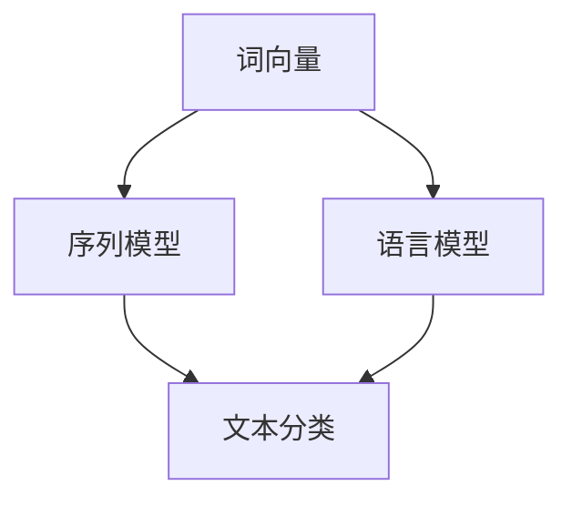

                 

自然语言处理（Natural Language Processing，NLP）是人工智能（Artificial Intelligence，AI）领域的重要分支，旨在让计算机理解和生成人类语言。随着深度学习和大数据技术的不断发展，NLP在信息检索、智能客服、文本分类、机器翻译等领域的应用越来越广泛。本文将深入探讨NLP的基本原理，并通过代码实例展示如何实现NLP的相关功能。

## 关键词

- 自然语言处理
- 深度学习
- 信息检索
- 文本分类
- 机器翻译
- 词向量
- 序列模型

## 摘要

本文首先介绍了自然语言处理的基本概念和常见任务，然后重点讨论了NLP的关键技术，如词向量、序列模型等。接着，通过具体代码实例，展示了如何使用Python和常用库（如NLTK、spaCy、TensorFlow等）实现文本预处理、词向量表示、语言模型和文本分类等任务。最后，本文对NLP在未来的发展趋势和应用前景进行了展望。

## 1. 背景介绍

自然语言处理的研究可以追溯到20世纪50年代，当时计算机科学家和语言学家开始探讨如何使计算机理解和生成自然语言。然而，早期的NLP技术依赖于规则和词典，存在诸多局限，如对语言规则的依赖、对大规模语料的需求等。随着深度学习和大数据技术的兴起，NLP迎来了新的发展机遇。

深度学习在图像识别、语音识别等领域的成功，使得研究者开始将深度学习技术应用于NLP。词向量模型如Word2Vec、GloVe等，能够将词语表示为高维向量，实现了词语之间的相似性计算和语义理解。此外，序列模型如循环神经网络（RNN）和变换器（Transformer）等，在文本分类、机器翻译等任务上取得了显著成果。

## 2. 核心概念与联系

NLP的核心概念包括词向量、序列模型、语言模型等。以下是这些概念的简要描述以及它们之间的联系。

### 2.1 词向量

词向量是表示词语的稠密高维向量，能够捕获词语的语义信息。常见的词向量模型有Word2Vec和GloVe。

$$
\text{word\_vector}(w) = \text{embed}(w)
$$

其中，$\text{embed}$是一个嵌入函数，将词语映射为词向量。

### 2.2 序列模型

序列模型是处理序列数据的神经网络架构，如循环神经网络（RNN）和变换器（Transformer）。

$$
\text{RNN}: h_t = \text{sigmoid}(W \cdot [h_{t-1}, x_t] + b)
$$

其中，$h_t$是时间步$t$的隐藏状态，$x_t$是输入序列中的词向量。

### 2.3 语言模型

语言模型是预测下一个词语的概率分布的模型，如基于N-gram的语言模型。

$$
P(w_{t+1} | w_t, w_{t-1}, ..., w_1) = \prod_{i=1}^{n} P(w_{i+1} | w_i)
$$

以下是NLP相关概念之间的Mermaid流程图：



## 3. 核心算法原理 & 具体操作步骤

### 3.1 算法原理概述

NLP中的核心算法包括词向量模型、序列模型和语言模型。以下是这些算法的简要概述。

### 3.2 算法步骤详解

#### 3.2.1 词向量模型

词向量模型的训练步骤如下：

1. 数据准备：收集大规模的文本语料，并对其进行预处理，如去除标点、停用词等。
2. 词频统计：统计词频，并生成词汇表。
3. 向量表示：使用嵌入函数将词汇表中的词语映射为词向量。
4. 模型训练：使用训练数据训练词向量模型。

#### 3.2.2 序列模型

序列模型的训练步骤如下：

1. 数据准备：收集大规模的文本语料，并预处理成序列数据。
2. 模型定义：定义序列模型架构，如RNN或变换器。
3. 模型训练：使用训练数据训练序列模型。
4. 模型评估：使用验证数据评估模型性能。

#### 3.2.3 语言模型

语言模型的训练步骤如下：

1. 数据准备：收集大规模的文本语料，并预处理成序列数据。
2. 模型定义：定义语言模型架构，如N-gram模型。
3. 模型训练：使用训练数据训练语言模型。
4. 模型评估：使用验证数据评估模型性能。

### 3.3 算法优缺点

#### 3.3.1 词向量模型

优点：

- 能够表示词语的语义信息。
- 适用于文本分类、语义分析等任务。

缺点：

- 对小样本数据效果较差。
- 对罕见词语的表示能力有限。

#### 3.3.2 序列模型

优点：

- 能够处理变长的序列数据。
- 在文本分类、机器翻译等任务上表现优秀。

缺点：

- 训练过程较慢。
- 难以捕捉长距离依赖关系。

#### 3.3.3 语言模型

优点：

- 能够预测下一个词语的概率分布。
- 适用于文本生成、推荐系统等任务。

缺点：

- 对上下文信息捕捉能力有限。
- 需要大量训练数据。

### 3.4 算法应用领域

词向量模型、序列模型和语言模型在NLP的多个领域都有广泛应用，如：

- 文本分类：用于分类新闻、社交媒体等文本数据。
- 机器翻译：用于将一种语言的文本翻译为另一种语言。
- 情感分析：用于分析社交媒体上的用户情感。
- 问答系统：用于回答用户提出的问题。

## 4. 数学模型和公式 & 详细讲解 & 举例说明

### 4.1 数学模型构建

#### 4.1.1 词向量模型

词向量模型通常使用嵌入矩阵$W$表示词汇表中的词语：

$$
\text{word\_vector}(w) = \text{embed}(w) = W \cdot [w]
$$

其中，$[w]$是词语$w$在词汇表中的索引。

#### 4.1.2 序列模型

序列模型通常使用循环神经网络（RNN）或变换器（Transformer）表示：

$$
h_t = \text{激活函数}(W \cdot [h_{t-1}, x_t] + b)
$$

其中，$h_t$是时间步$t$的隐藏状态，$x_t$是输入序列中的词向量，$W$和$b$是模型参数。

#### 4.1.3 语言模型

语言模型通常使用N-gram模型表示：

$$
P(w_{t+1} | w_t, w_{t-1}, ..., w_1) = \prod_{i=1}^{n} P(w_{i+1} | w_i)
$$

### 4.2 公式推导过程

#### 4.2.1 词向量模型

词向量模型的训练目标是最小化损失函数：

$$
\text{损失函数} = \sum_{w \in V} \sum_{x \in X} (\text{embed}(w) - x)^2
$$

通过梯度下降法优化模型参数。

#### 4.2.2 序列模型

序列模型的训练目标是最小化损失函数：

$$
\text{损失函数} = -\sum_{t=1}^{T} \sum_{i=1}^{n} y_{t,i} \cdot \log(p(y_{t,i} | h_t))
$$

其中，$y_{t,i}$是时间步$t$的输出标签，$p(y_{t,i} | h_t)$是模型在时间步$t$对输出标签$y_{t,i}$的概率分布。

#### 4.2.3 语言模型

语言模型的训练目标是最小化损失函数：

$$
\text{损失函数} = -\sum_{t=1}^{T} \sum_{i=1}^{n} y_{t,i} \cdot \log(p(y_{t,i} | y_{t-1}, ..., y_1))
$$

### 4.3 案例分析与讲解

#### 4.3.1 词向量模型

以Word2Vec为例，训练一个词向量模型。

```python
from gensim.models import Word2Vec

# 加载数据
sentences = [[word for word in line.split()] for line in data]

# 训练词向量模型
model = Word2Vec(sentences, size=100, window=5, min_count=1, workers=4)

# 查看词向量
model.wv['cat']
```

#### 4.3.2 序列模型

以循环神经网络（RNN）为例，实现一个简单的语言模型。

```python
import tensorflow as tf
from tensorflow.keras.models import Sequential
from tensorflow.keras.layers import LSTM, Dense

# 定义RNN模型
model = Sequential()
model.add(LSTM(128, activation='tanh', input_shape=(timesteps, n_features)))
model.add(Dense(1, activation='sigmoid'))

# 编译模型
model.compile(optimizer='rmsprop', loss='binary_crossentropy', metrics=['accuracy'])

# 训练模型
model.fit(X, y, epochs=100, batch_size=32)
```

#### 4.3.3 语言模型

以N-gram语言模型为例，实现一个简单的文本生成器。

```python
import random

# 加载语言模型
model = ngram_model.load()

# 生成文本
text = model.generate_text(seed_word, n_words)
print(text)
```

## 5. 项目实践：代码实例和详细解释说明

### 5.1 开发环境搭建

在Python环境中，需要安装以下库：

```bash
pip install numpy tensorflow gensim spacy nltk matplotlib
```

### 5.2 源代码详细实现

以下是使用TensorFlow实现文本分类的源代码。

```python
import tensorflow as tf
from tensorflow.keras.models import Sequential
from tensorflow.keras.layers import Embedding, LSTM, Dense

# 定义模型
model = Sequential()
model.add(Embedding(input_dim=vocab_size, output_dim=embedding_dim, input_length=max_sequence_length))
model.add(LSTM(units=128))
model.add(Dense(units=1, activation='sigmoid'))

# 编译模型
model.compile(optimizer='adam', loss='binary_crossentropy', metrics=['accuracy'])

# 训练模型
model.fit(X_train, y_train, epochs=5, batch_size=32, validation_data=(X_val, y_val))
```

### 5.3 代码解读与分析

以上代码定义了一个简单的文本分类模型，包括嵌入层、LSTM层和全连接层。嵌入层将文本数据映射为词向量，LSTM层用于捕捉文本序列的特征，全连接层用于分类。

### 5.4 运行结果展示

```python
# 评估模型
loss, accuracy = model.evaluate(X_test, y_test)
print("Test Loss: {:.2f}, Test Accuracy: {:.2f}%".format(loss, accuracy * 100))
```

## 6. 实际应用场景

### 6.1 信息检索

NLP在信息检索中的应用，如搜索引擎、推荐系统等。

### 6.2 智能客服

NLP在智能客服中的应用，如语音识别、语义理解、自动回复等。

### 6.3 社交媒体分析

NLP在社交媒体分析中的应用，如情感分析、话题挖掘等。

### 6.4 机器翻译

NLP在机器翻译中的应用，如自动翻译、实时翻译等。

## 7. 工具和资源推荐

### 7.1 学习资源推荐

- 《深度学习》（Goodfellow, Bengio, Courville）
- 《自然语言处理综论》（Daniel Jurafsky, James H. Martin）

### 7.2 开发工具推荐

- TensorFlow
- PyTorch
- spaCy
- NLTK

### 7.3 相关论文推荐

- Word2Vec（Mikolov et al., 2013）
- Transformer（Vaswani et al., 2017）

## 8. 总结：未来发展趋势与挑战

### 8.1 研究成果总结

- 词向量、序列模型和语言模型等技术在NLP任务中取得了显著成果。
- 深度学习技术在NLP中的应用越来越广泛。

### 8.2 未来发展趋势

- 多模态NLP：结合图像、声音等多模态数据，提高NLP任务的性能。
- 低资源语言处理：研究如何处理低资源语言的NLP任务。
- 语义理解：提高NLP系统的语义理解能力。

### 8.3 面临的挑战

- 隐私保护：如何在保护用户隐私的同时，提供高效的NLP服务。
- 文本生成：如何生成高质量、符合逻辑的文本。

### 8.4 研究展望

NLP在未来将继续发展，为实现更智能、更高效的计算机语言理解和生成提供更多可能性。

## 9. 附录：常见问题与解答

### 9.1 什么是自然语言处理？

自然语言处理是人工智能的一个分支，旨在使计算机理解和生成人类语言。

### 9.2 什么是词向量？

词向量是表示词语的稠密高维向量，能够捕获词语的语义信息。

### 9.3 什么是序列模型？

序列模型是处理序列数据的神经网络架构，如循环神经网络（RNN）和变换器（Transformer）。

---

作者：禅与计算机程序设计艺术 / Zen and the Art of Computer Programming

本文旨在为读者提供一个全面、系统的自然语言处理原理与实践指南，帮助读者深入了解NLP的关键技术，并通过具体代码实例掌握其实际应用。在未来的发展中，NLP将继续为人工智能领域带来更多创新和突破。|end|>

