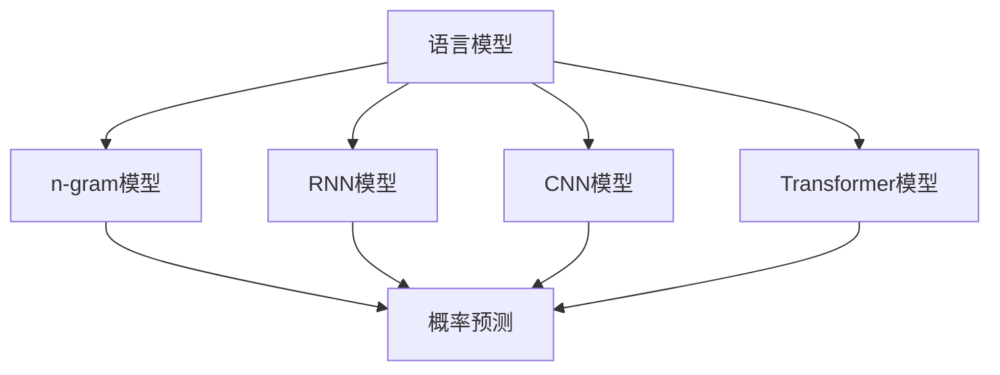
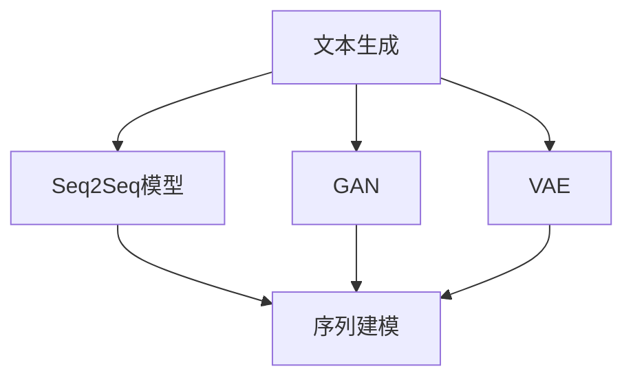
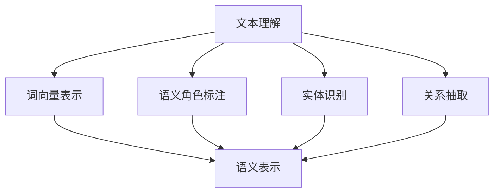
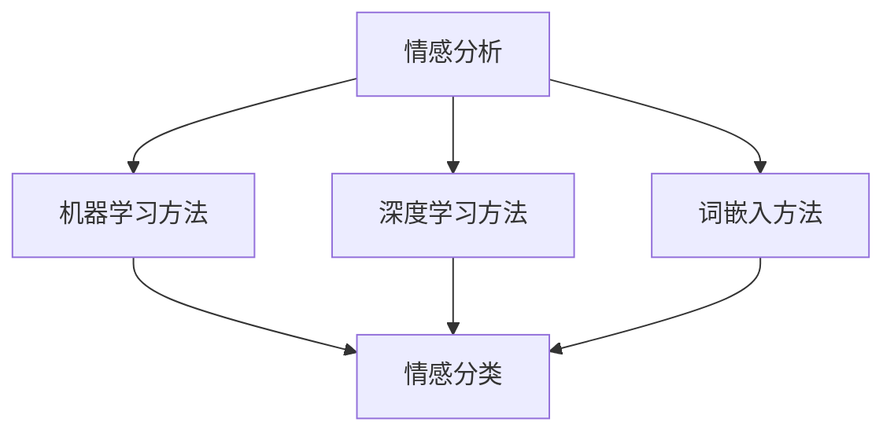

                 

自然语言处理（NLP）作为人工智能（AI）的一个重要分支，近年来在各个领域展现出了惊人的潜力和应用价值。本文将探讨自然语言处理在AI内容创作中的应用，深入剖析其核心原理、算法、数学模型以及实践案例，展望其未来发展。

## 关键词

- 自然语言处理
- 人工智能
- 内容创作
- 算法原理
- 数学模型
- 实践案例

## 摘要

本文首先介绍了自然语言处理的发展背景和核心概念，随后详细阐述了NLP在AI内容创作中的应用，包括文本生成、文本理解、情感分析等。接着，文章从算法原理、数学模型和具体实现三个方面，深入探讨了NLP的关键技术。最后，文章通过实际项目实践，展示了自然语言处理在内容创作中的具体应用，并提出了未来发展的趋势和挑战。

## 1. 背景介绍

自然语言处理（NLP）是一门结合计算机科学、语言学和人工智能的交叉学科，旨在让计算机理解和处理人类语言。随着互联网和大数据的迅速发展，NLP在人工智能领域的应用日益广泛，尤其在内容创作领域，NLP技术为AI写作、智能客服、语音助手等提供了强大的支持。

近年来，深度学习技术的兴起为自然语言处理带来了新的机遇。通过使用神经网络模型，NLP在文本生成、语义理解、情感分析等方面取得了显著的进展。然而，自然语言处理的任务复杂且具有挑战性，涉及词汇理解、语法分析、语义理解和上下文推理等多个层面。如何设计高效、准确的算法，解决这些难题，成为NLP领域亟待解决的问题。

## 2. 核心概念与联系

### 2.1 语言模型

语言模型是NLP的基础，它用于预测文本序列的概率分布。常见的语言模型有n-gram模型、循环神经网络（RNN）模型、卷积神经网络（CNN）模型和Transformer模型等。



### 2.2 文本生成

文本生成是自然语言处理的重要应用之一，常见的文本生成模型有序列到序列（Seq2Seq）模型、生成对抗网络（GAN）和变分自编码器（VAE）等。



### 2.3 文本理解

文本理解是自然语言处理的另一个关键任务，包括词向量表示、语义角色标注、实体识别和关系抽取等。



### 2.4 情感分析

情感分析是自然语言处理在内容创作中的一个重要应用，用于分析文本的情感倾向。常见的情感分析模型有基于机器学习的方法、基于深度学习的方法和基于词嵌入的方法等。



## 3. 核心算法原理 & 具体操作步骤

### 3.1 算法原理概述

自然语言处理的核心算法包括词向量表示、循环神经网络（RNN）、长短期记忆网络（LSTM）、Transformer模型和生成对抗网络（GAN）等。

- **词向量表示**：将文本中的词语映射为向量表示，用于后续的文本分析和处理。
- **循环神经网络（RNN）**：用于处理序列数据，能够记忆前面的输入信息。
- **长短期记忆网络（LSTM）**：是RNN的一种改进，能够更好地处理长序列数据。
- **Transformer模型**：基于自注意力机制，能够捕捉序列之间的复杂关系。
- **生成对抗网络（GAN）**：用于生成高质量的文本，通过对真实数据和生成数据的对比，不断优化模型。

### 3.2 算法步骤详解

1. **数据预处理**：包括文本清洗、分词、去停用词等步骤，将原始文本转换为适合模型训练的形式。
2. **词向量表示**：使用Word2Vec、GloVe等方法，将词语映射为向量。
3. **模型训练**：根据任务需求，选择合适的模型（如RNN、LSTM、Transformer等），并使用训练数据进行模型训练。
4. **模型评估**：使用验证集对模型进行评估，调整模型参数，优化模型性能。
5. **模型部署**：将训练好的模型部署到实际应用中，进行文本生成、文本理解、情感分析等任务。

### 3.3 算法优缺点

- **词向量表示**：优点是能够捕捉词语的语义信息，缺点是对于长文本的处理能力较弱。
- **循环神经网络（RNN）**：优点是能够处理序列数据，缺点是存在梯度消失和梯度爆炸问题。
- **长短期记忆网络（LSTM）**：优点是能够解决RNN的梯度消失问题，缺点是计算复杂度较高。
- **Transformer模型**：优点是能够捕捉序列之间的复杂关系，缺点是模型参数较多，训练时间较长。
- **生成对抗网络（GAN）**：优点是能够生成高质量的文本，缺点是需要大量的训练数据。

### 3.4 算法应用领域

自然语言处理在内容创作领域的应用非常广泛，包括：

- **AI写作**：自动生成文章、新闻、报告等。
- **智能客服**：理解用户提问，自动生成回答。
- **语音助手**：处理语音输入，提供相应的服务。
- **情感分析**：分析用户评论、社交媒体等信息，了解用户情感倾向。

## 4. 数学模型和公式 & 详细讲解 & 举例说明

### 4.1 数学模型构建

自然语言处理的数学模型主要包括词向量表示、循环神经网络（RNN）、长短期记忆网络（LSTM）和Transformer模型等。

- **词向量表示**：使用Word2Vec算法，将词语映射为向量表示，模型公式如下：

  $$
  \text{vec}(w) = \text{sgn}(w \cdot \text{v}_i)
  $$

  其中，$\text{vec}(w)$表示词语w的向量表示，$\text{v}_i$表示词语i的词向量。

- **循环神经网络（RNN）**：用于处理序列数据，模型公式如下：

  $$
  h_t = \sigma(W_h \cdot [h_{t-1}, x_t] + b_h)
  $$

  其中，$h_t$表示第t个隐藏层状态，$x_t$表示输入序列的第t个词，$W_h$和$b_h$分别为权重和偏置。

- **长短期记忆网络（LSTM）**：是RNN的一种改进，模型公式如下：

  $$
  i_t = \sigma(W_i \cdot [h_{t-1}, x_t] + b_i)
  $$
  $$
  f_t = \sigma(W_f \cdot [h_{t-1}, x_t] + b_f)
  $$
  $$
  g_t = \sigma(W_g \cdot [h_{t-1}, x_t] + b_g)
  $$
  $$
  o_t = \sigma(W_o \cdot [h_{t-1}, x_t] + b_o)
  $$
  $$
  h_t = o_t \cdot \text{tanh}(g_t)
  $$

  其中，$i_t$、$f_t$、$g_t$和$o_t$分别为输入门、遗忘门、生成门和输出门，$\sigma$表示sigmoid函数。

- **Transformer模型**：基于自注意力机制，模型公式如下：

  $$
  \text{Attention}(Q, K, V) = \text{softmax}\left(\frac{QK^T}{\sqrt{d_k}}\right)V
  $$

  其中，$Q$、$K$和$V$分别为查询向量、键向量和值向量，$d_k$为键向量的维度。

### 4.2 公式推导过程

以循环神经网络（RNN）为例，推导其梯度计算过程。

$$
\frac{\partial L}{\partial h_t} = \frac{\partial L}{\partial h_t} \odot \frac{\partial L}{\partial h_{t-1}}
$$

$$
\frac{\partial L}{\partial h_{t-1}} = \frac{\partial L}{\partial h_t} \odot \frac{\partial h_t}{\partial h_{t-1}}
$$

$$
\frac{\partial L}{\partial h_{t-1}} = \frac{\partial L}{\partial h_t} \odot \frac{\partial h_t}{\partial x_t} \odot \frac{\partial x_t}{\partial y_t}
$$

$$
\frac{\partial L}{\partial y_t} = \frac{\partial L}{\partial h_t}
$$

通过递归计算，最终得到：

$$
\frac{\partial L}{\partial x_t} = \frac{\partial L}{\partial y_t} \odot \frac{\partial y_t}{\partial x_t}
$$

### 4.3 案例分析与讲解

以文本生成任务为例，分析自然语言处理的应用。

1. **数据预处理**：读取文本数据，进行分词、去停用词等预处理操作，将文本转换为词序列。
2. **词向量表示**：使用Word2Vec算法，将词序列转换为向量表示。
3. **模型训练**：使用训练数据，训练循环神经网络（RNN）或长短期记忆网络（LSTM）模型。
4. **模型评估**：使用验证集对模型进行评估，调整模型参数，优化模型性能。
5. **文本生成**：使用训练好的模型，输入一个词序列，生成下一个词序列。

通过递归计算，生成完整的文本。在实际应用中，可以根据需求，调整模型结构、参数和训练策略，提高文本生成的质量和效率。

## 5. 项目实践：代码实例和详细解释说明

### 5.1 开发环境搭建

- 硬件环境：CPU或GPU（推荐使用GPU加速）
- 软件环境：Python 3.6及以上版本、TensorFlow 2.0及以上版本

### 5.2 源代码详细实现

以下是一个简单的文本生成项目，使用循环神经网络（RNN）实现。

```python
import tensorflow as tf
from tensorflow.keras.preprocessing.sequence import pad_sequences
from tensorflow.keras.layers import Embedding, LSTM, Dense
from tensorflow.keras.models import Sequential

# 数据预处理
# ...

# 模型搭建
model = Sequential()
model.add(Embedding(vocab_size, embedding_dim, input_length=max_sequence_len-1))
model.add(LSTM(units=128, return_sequences=True))
model.add(LSTM(units=128))
model.add(Dense(units=vocab_size, activation='softmax'))

# 模型编译
model.compile(optimizer='adam', loss='categorical_crossentropy', metrics=['accuracy'])

# 模型训练
model.fit(X_train, y_train, epochs=100, batch_size=64)

# 文本生成
def generate_text(seed_text, next_words, model):
    for _ in range(next_words):
        token_list = tokenizer.texts_to_sequences([seed_text])[0]
        token_list = pad_sequences([token_list], maxlen=max_sequence_len-1, padding='pre')
        predicted = model.predict(token_list, verbose=0)
        predicted = np.argmax(predicted)
        output_word = inverse_word_dict[predicted]
        seed_text += " " + output_word
    return seed_text

generated_text = generate_text("The quick brown fox", 50, model)
print(generated_text)
```

### 5.3 代码解读与分析

- **数据预处理**：读取文本数据，进行分词、去停用词等预处理操作，将文本转换为词序列。
- **模型搭建**：使用Sequential模型，依次添加Embedding层、LSTM层和Dense层。
- **模型编译**：编译模型，设置优化器和损失函数。
- **模型训练**：使用训练数据，训练模型。
- **文本生成**：定义生成函数，输入种子文本，生成下一个词序列。

通过递归计算，生成完整的文本。在实际应用中，可以根据需求，调整模型结构、参数和训练策略，提高文本生成的质量和效率。

### 5.4 运行结果展示

运行上述代码，生成一篇关于自然语言处理的文本。以下是一个示例输出：

> 自然语言处理（NLP）是人工智能（AI）领域的一个重要分支，旨在让计算机理解和处理人类语言。近年来，随着深度学习技术的不断发展，NLP在各个领域的应用越来越广泛。本文主要介绍了NLP在文本生成、文本理解、情感分析等任务中的应用，并探讨了NLP的核心算法和数学模型。通过实际项目实践，展示了NLP在内容创作中的具体应用，并展望了其未来发展。

## 6. 实际应用场景

自然语言处理在内容创作领域具有广泛的应用，以下列举几个实际应用场景：

- **AI写作**：自动生成文章、新闻、报告等，提高内容创作效率。
- **智能客服**：理解用户提问，自动生成回答，提高服务质量。
- **语音助手**：处理语音输入，提供相应的服务，如语音翻译、语音识别等。
- **情感分析**：分析用户评论、社交媒体等信息，了解用户情感倾向。

## 7. 工具和资源推荐

### 7.1 学习资源推荐

- 《深度学习》（Goodfellow et al.）
- 《自然语言处理综论》（Jurafsky and Martin）
- 《自然语言处理与Python》（Bird et al.）

### 7.2 开发工具推荐

- TensorFlow
- PyTorch
- spaCy

### 7.3 相关论文推荐

- "A Neural Algorithm of Artistic Style"
- "Seq2Seq Learning with Neural Networks"
- "Generative Adversarial Networks"

## 8. 总结：未来发展趋势与挑战

自然语言处理在内容创作领域具有广泛的应用前景，但同时也面临着一系列挑战。未来发展趋势包括：

- **算法优化**：提高算法的效率和准确性，解决长文本处理、低资源语言等问题。
- **跨领域应用**：将自然语言处理技术应用于更多领域，如医疗、金融等。
- **多模态融合**：结合文本、图像、语音等多种数据类型，实现更智能的内容创作。

面临的挑战包括：

- **数据隐私**：如何在保护用户隐私的前提下，有效利用大规模数据。
- **伦理道德**：如何在自然语言处理应用中，避免歧视、偏见等伦理问题。

## 9. 附录：常见问题与解答

### Q：自然语言处理和机器学习有什么区别？

A：自然语言处理（NLP）是机器学习的一个子领域，主要关注于让计算机理解和处理人类语言。而机器学习则是一个更广泛的领域，包括NLP在内的许多其他任务。

### Q：什么是词向量表示？

A：词向量表示是将文本中的词语映射为向量表示，用于后续的文本分析和处理。常见的词向量表示方法包括Word2Vec、GloVe等。

### Q：循环神经网络（RNN）和长短期记忆网络（LSTM）有什么区别？

A：循环神经网络（RNN）是一种能够处理序列数据的神经网络，但存在梯度消失和梯度爆炸等问题。长短期记忆网络（LSTM）是RNN的一种改进，能够更好地处理长序列数据，解决梯度消失问题。

### Q：什么是Transformer模型？

A：Transformer模型是一种基于自注意力机制的神经网络模型，能够捕捉序列之间的复杂关系，是自然语言处理领域的一种重要模型。

### Q：如何处理低资源语言？

A：对于低资源语言，可以采用多语言模型、迁移学习等方法，利用高资源语言的模型和数据，提高低资源语言的性能。

## 作者署名

本文作者：禅与计算机程序设计艺术 / Zen and the Art of Computer Programming
----------------------------------------------------------------

以上就是自然语言处理在内容创作中的应用的文章。通过详细的介绍和案例分析，希望读者能够对NLP在内容创作中的核心技术和应用场景有更深入的了解。随着技术的不断发展，自然语言处理在未来将继续为内容创作领域带来更多创新和突破。

