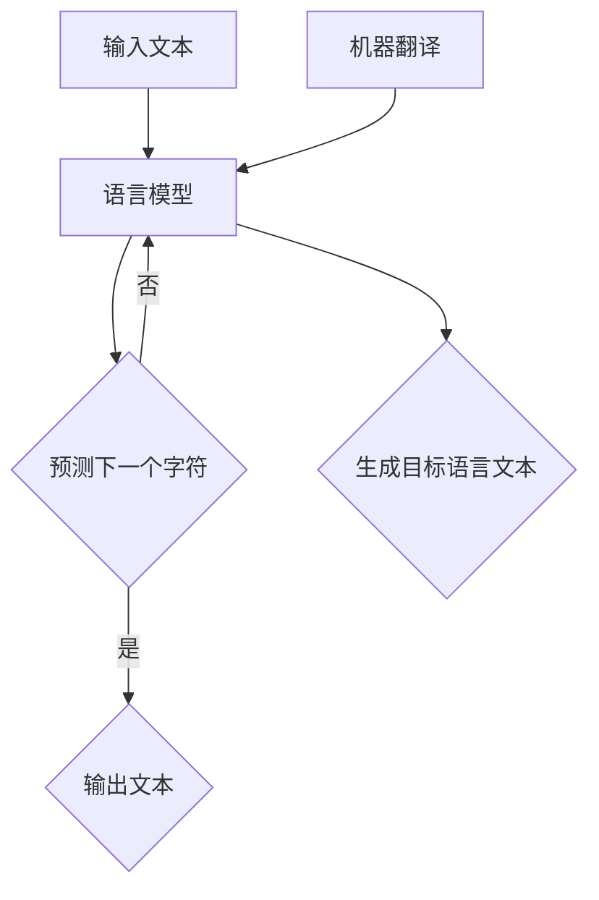

                 

在当今全球化的世界中，多语言本地化已经成为企业与国际市场接轨的必要手段。而自然语言生成（Natural Language Generation，简称NLG）技术的出现，为多语言本地化带来了前所未有的便利和效率。本文将深入探讨自然语言生成在多语言本地化中的应用，包括其核心概念、工作原理、算法实现、数学模型，以及实际应用案例。希望通过本文，读者能够对NLG技术有一个全面、深入的理解。

## 文章关键词

- 自然语言生成（NLG）
- 多语言本地化
- 语言模型
- 机器翻译
- 情感分析

## 文章摘要

本文首先介绍了自然语言生成的概念和其在多语言本地化中的应用背景。随后，深入解析了NLG的核心算法原理，包括语言模型、文本生成和机器翻译等。接着，本文通过数学模型和公式的推导，详细阐述了自然语言生成的理论基础。随后，通过一个实际的应用案例，展示了自然语言生成在多语言本地化中的具体实现。最后，本文对自然语言生成技术进行了总结和展望，分析了其未来的发展趋势和面临的挑战。

## 1. 背景介绍

### 1.1 多语言本地化的需求

随着全球化进程的不断加快，企业需要进入越来越多的国际市场。然而，不同国家和地区之间存在着语言差异，这给企业的国际化带来了巨大的挑战。为了更好地满足不同语言市场的需求，企业需要进行多语言本地化。多语言本地化不仅仅是将文本从一种语言翻译成另一种语言，更涉及到文化、习惯、表达方式等多个方面的适配。

### 1.2 自然语言生成的优势

自然语言生成（NLG）是一种通过算法生成自然语言文本的技术。相比传统的手动翻译，NLG具有以下几个显著优势：

- **高效性**：NLG可以自动化地生成大量的文本，大大提高了翻译的效率。
- **准确性**：NLG技术可以基于大量的语言数据，通过机器学习算法生成准确的自然语言文本。
- **一致性**：NLG可以确保在不同语言之间的文本表达上保持一致性，避免了手动翻译可能带来的偏差。
- **灵活性**：NLG可以根据不同的语境和需求，灵活地生成各种类型的文本，如新闻文章、产品说明、用户手册等。

### 1.3 多语言本地化的挑战

尽管自然语言生成技术带来了诸多优势，但在实际应用中，多语言本地化仍然面临着一些挑战：

- **语言多样性**：不同语言之间存在巨大的差异，NLG需要处理这种多样性，生成符合目标语言习惯的文本。
- **语境理解**：NLG需要理解文本的语境，确保生成的文本在语义和情感上与原文本保持一致。
- **个性化需求**：不同市场和用户群体对文本的个性化需求不同，NLG需要能够根据这些需求生成不同的文本。
- **文化差异**：不同文化背景下的语言表达方式存在差异，NLG需要考虑这些文化差异，确保生成的文本在不同文化中具有可接受性。

## 2. 核心概念与联系

### 2.1 自然语言生成的核心概念

自然语言生成涉及多个核心概念，包括语言模型、文本生成、机器翻译等。以下是对这些概念的基本介绍：

- **语言模型**：语言模型是NLG的基础，它用于预测一个句子或单词的下一个单词或字符。语言模型通过学习大量的语言数据，构建出一个概率分布模型，用于生成自然语言文本。
- **文本生成**：文本生成是指利用语言模型生成完整的自然语言文本。文本生成可以分为序列生成和结构化生成两种方式。序列生成是基于字符或单词的生成，而结构化生成则是基于语法结构和语义信息进行生成。
- **机器翻译**：机器翻译是指将一种语言的文本翻译成另一种语言。机器翻译可以分为基于规则的翻译和基于统计的翻译。基于规则的翻译依赖于预定义的语法规则，而基于统计的翻译则基于大量的翻译数据，使用统计模型进行翻译。

### 2.2 语言模型与文本生成的关系

语言模型是文本生成的核心组件。语言模型通过学习大量的语言数据，可以预测一个句子或单词的下一个单词或字符。在文本生成过程中，语言模型用于生成文本的下一部分，直到生成完整的文本。文本生成过程可以看作是语言模型在文本数据上的迭代过程。

### 2.3 语言模型与机器翻译的关系

语言模型在机器翻译中也发挥着重要作用。在机器翻译过程中，源语言文本被分解成单词或字符，然后通过语言模型预测目标语言中对应的单词或字符。语言模型可以帮助翻译系统理解源语言和目标语言的语法结构和语义信息，从而生成准确的目标语言文本。

### 2.4 Mermaid 流程图

以下是自然语言生成系统的 Mermaid 流程图：



在这个流程图中，输入文本首先被传递给语言模型，语言模型通过预测下一个字符，逐步生成完整的文本。此外，机器翻译过程也依赖于语言模型，通过语言模型生成目标语言的文本。

## 3. 核心算法原理 & 具体操作步骤

### 3.1 算法原理概述

自然语言生成（NLG）的核心算法包括语言模型、文本生成和机器翻译等。以下是对这些算法的概述：

- **语言模型**：语言模型是NLG的基础，它通过学习大量的语言数据，构建出一个概率分布模型，用于预测句子或单词的下一个单词或字符。
- **文本生成**：文本生成是基于语言模型的，通过预测下一个字符或单词，逐步生成完整的文本。文本生成可以分为序列生成和结构化生成两种方式。
- **机器翻译**：机器翻译是将一种语言的文本翻译成另一种语言的过程。机器翻译可以分为基于规则的翻译和基于统计的翻译。基于规则的翻译依赖于预定义的语法规则，而基于统计的翻译则基于大量的翻译数据，使用统计模型进行翻译。

### 3.2 算法步骤详解

以下是自然语言生成和机器翻译的具体步骤：

#### 3.2.1 自然语言生成步骤

1. **输入文本**：首先，将待生成的文本输入到系统中。
2. **初始化语言模型**：初始化一个预训练的语言模型，如基于神经网络的语言模型。
3. **预测下一个字符**：使用语言模型预测输入文本的下一个字符。
4. **生成文本**：根据预测的字符，逐步生成完整的文本。
5. **评估和优化**：评估生成的文本质量，并进行优化，以提高文本生成的准确性。

#### 3.2.2 机器翻译步骤

1. **输入源语言文本**：将源语言文本输入到机器翻译系统中。
2. **预处理文本**：对源语言文本进行预处理，包括分词、词性标注等。
3. **初始化语言模型**：初始化一个预训练的语言模型，用于预测目标语言中对应的单词或字符。
4. **翻译源语言文本**：使用语言模型将源语言文本翻译成目标语言。
5. **后处理文本**：对翻译后的文本进行后处理，包括语法检查、语义修正等。

### 3.3 算法优缺点

#### 优点

- **高效性**：NLG和机器翻译可以自动化地处理大量的文本，大大提高了翻译和生成的效率。
- **准确性**：基于预训练的语言模型，NLG和机器翻译可以生成准确的自然语言文本。
- **灵活性**：NLG可以根据不同的语境和需求，灵活地生成各种类型的文本。

#### 缺点

- **语言多样性**：处理不同语言的多样性是一个挑战，NLG需要适应各种语言的特点。
- **语境理解**：NLG需要理解文本的语境，以确保生成的文本在语义和情感上与原文本保持一致。
- **个性化需求**：不同市场和用户群体对文本的个性化需求不同，NLG需要能够根据这些需求生成不同的文本。

### 3.4 算法应用领域

自然语言生成和机器翻译在多个领域有着广泛的应用：

- **多语言本地化**：NLG和机器翻译可以用于多语言本地化，帮助企业在全球范围内推广产品和服务。
- **内容生成**：NLG可以用于生成新闻文章、产品说明、用户手册等，提高内容的生产效率。
- **教育**：NLG可以用于教育领域，生成教材、练习题等，为学生提供个性化的学习体验。
- **客户服务**：NLG可以用于生成自动化回复，提高客户服务的效率和质量。

## 4. 数学模型和公式 & 详细讲解 & 举例说明

### 4.1 数学模型构建

自然语言生成涉及多个数学模型，主要包括语言模型、文本生成模型和机器翻译模型。以下分别介绍这些模型的数学基础。

#### 4.1.1 语言模型

语言模型是基于概率论和统计学的方法，用于预测下一个单词或字符。最常用的语言模型是n-gram模型，其核心公式如下：

$$
P(w_n | w_{n-1}, w_{n-2}, ..., w_1) = \frac{C(w_{n-1}, w_n)}{\sum_{i=1}^{N} C(w_{n-1}, w_i)}
$$

其中，$w_n$ 表示当前要预测的单词或字符，$w_{n-1}, w_{n-2}, ..., w_1$ 表示前面的单词或字符，$C(w_{n-1}, w_n)$ 表示单词 $w_{n-1}$ 后紧跟着单词 $w_n$ 的频率，$N$ 表示前一个单词 $w_{n-1}$ 后所有可能单词的总数。

#### 4.1.2 文本生成模型

文本生成模型是基于递归神经网络（RNN）或长短期记忆网络（LSTM）构建的，其核心公式如下：

$$
h_t = \sigma(W_h h_{t-1} + W_x x_t + b_h)
$$

$$
o_t = W_o h_t + b_o
$$

其中，$h_t$ 表示当前时刻的隐藏状态，$x_t$ 表示当前输入的单词或字符，$W_h, W_x, b_h, W_o, b_o$ 分别是权重和偏置，$\sigma$ 表示激活函数，$o_t$ 表示当前时刻的输出概率分布。

#### 4.1.3 机器翻译模型

机器翻译模型是基于注意力机制和编码-解码框架构建的，其核心公式如下：

$$
e_s = \text{softmax}(W_s [h_t; c_t])
$$

$$
a_t = \frac{e_s c_t}{\sum_{i=1}^{T} e_i c_i}
$$

$$
h_t = \tanh(W_h [h_{t-1}; a_t c_t] + b_h)
$$

$$
o_t = W_o h_t + b_o
$$

其中，$e_s$ 表示源语言单词 $s$ 的软性编码，$c_t$ 表示目标语言单词 $t$ 的上下文表示，$a_t$ 表示注意力权重，$h_t$ 表示编码器的隐藏状态，$o_t$ 表示当前时刻的输出概率分布。

### 4.2 公式推导过程

#### 4.2.1 语言模型推导

n-gram 模型的推导基于马尔可夫假设，即一个单词的概率仅取决于前 $n-1$ 个单词。n-gram 模型的推导过程如下：

1. **定义 n-gram 概率**：假设 $w_n$ 是当前要预测的单词，$w_{n-1}, w_{n-2}, ..., w_1$ 是前 $n-1$ 个单词，则 $w_n$ 的 n-gram 概率为：

   $$
   P(w_n | w_{n-1}, w_{n-2}, ..., w_1) = \frac{C(w_{n-1}, w_n)}{\sum_{i=1}^{N} C(w_{n-1}, w_i)}
   $$

   其中，$C(w_{n-1}, w_n)$ 表示单词 $w_{n-1}$ 后紧跟着单词 $w_n$ 的频率，$N$ 表示前一个单词 $w_{n-1}$ 后所有可能单词的总数。

2. **概率计算**：根据马尔可夫假设，我们可以将 $w_n$ 的概率分解为前 $n-1$ 个单词的概率乘以 $w_n$ 在前 $n-1$ 个单词后的条件概率：

   $$
   P(w_n) = \frac{C(w_n)}{N}
   $$

   $$
   P(w_n | w_{n-1}, w_{n-2}, ..., w_1) = \frac{C(w_{n-1}, w_n)}{\sum_{i=1}^{N} C(w_{n-1}, w_i)} = \frac{C(w_n) \cdot C(w_{n-1}, w_n)}{\sum_{i=1}^{N} C(w_i) \cdot C(w_{n-1}, w_i)}
   $$

3. **n-gram 概率分布**：根据上述推导，我们可以计算出一个 n-gram 概率分布，用于预测下一个单词。

#### 4.2.2 文本生成模型推导

文本生成模型基于递归神经网络（RNN）或长短期记忆网络（LSTM）构建。以下是一个简单的 RNN 模型的推导过程：

1. **定义递归神经网络**：递归神经网络是一个前向网络，其核心公式如下：

   $$
   h_t = \sigma(W_h h_{t-1} + W_x x_t + b_h)
   $$

   $$
   o_t = W_o h_t + b_o
   $$

   其中，$h_t$ 表示当前时刻的隐藏状态，$x_t$ 表示当前输入的单词或字符，$W_h, W_x, b_h, W_o, b_o$ 分别是权重和偏置，$\sigma$ 表示激活函数。

2. **隐藏状态更新**：递归神经网络的隐藏状态在每一时刻都会更新，其更新公式如下：

   $$
   h_t = \sigma(W_h h_{t-1} + W_x x_t + b_h)
   $$

   其中，$h_{t-1}$ 表示前一时刻的隐藏状态。

3. **输出概率分布**：递归神经网络的输出是一个概率分布，用于预测下一个单词或字符：

   $$
   o_t = W_o h_t + b_o
   $$

4. **模型训练**：通过训练，递归神经网络可以学习到输入和隐藏状态之间的映射关系，从而生成符合目标语言习惯的文本。

#### 4.2.3 机器翻译模型推导

机器翻译模型基于注意力机制和编码-解码框架构建。以下是一个简单的编码-解码模型的推导过程：

1. **定义编码器**：编码器是一个双向递归神经网络，其核心公式如下：

   $$
   e_s = \text{softmax}(W_s [h_t; c_t])
   $$

   其中，$e_s$ 表示源语言单词 $s$ 的软性编码，$c_t$ 表示目标语言单词 $t$ 的上下文表示，$W_s$ 是权重。

2. **计算注意力权重**：注意力权重 $a_t$ 用于衡量源语言单词对目标语言单词的注意力：

   $$
   a_t = \frac{e_s c_t}{\sum_{i=1}^{T} e_i c_i}
   $$

   其中，$e_i$ 表示源语言单词 $i$ 的软性编码。

3. **生成目标语言单词**：编码器的输出是一个概率分布，用于生成目标语言单词：

   $$
   h_t = \tanh(W_h [h_{t-1}; a_t c_t] + b_h)
   $$

   $$
   o_t = W_o h_t + b_o
   $$

   其中，$h_t$ 表示编码器的隐藏状态，$o_t$ 表示当前时刻的输出概率分布。

4. **模型训练**：通过训练，编码-解码模型可以学习到源语言和目标语言之间的映射关系，从而实现机器翻译。

### 4.3 案例分析与讲解

#### 4.3.1 语言模型案例

假设有一个简短的英语句子：“I like to read books”。我们可以使用 n-gram 模型来生成下一个单词。

1. **输入句子**：I like to read books
2. **计算 n-gram 概率**：

   $$
   P(books | to, read) = \frac{C(to, books)}{\sum_{i=1}^{N} C(to, i)}
   $$

   其中，$C(to, books)$ 表示单词“to”后紧跟着单词“books”的频率，$N$ 表示单词“to”后所有可能单词的总数。

3. **生成下一个单词**：根据 n-gram 概率分布，我们可以生成下一个单词，例如“books”的概率最高，所以生成的下一个单词是“books”。

#### 4.3.2 文本生成模型案例

假设有一个简短的中文句子：“我喜欢读书”。我们可以使用 RNN 模型来生成下一个字。

1. **输入句子**：我喜欢读书
2. **初始化 RNN 模型**：给定初始隐藏状态 $h_0$ 和输入序列 $x_1, x_2, x_3$。
3. **计算隐藏状态**：

   $$
   h_1 = \sigma(W_h h_0 + W_x x_1 + b_h)
   $$

   $$
   h_2 = \sigma(W_h h_1 + W_x x_2 + b_h)
   $$

   $$
   h_3 = \sigma(W_h h_2 + W_x x_3 + b_h)
   $$

4. **计算输出概率分布**：

   $$
   o_1 = W_o h_1 + b_o
   $$

   $$
   o_2 = W_o h_2 + b_o
   $$

   $$
   o_3 = W_o h_3 + b_o
   $$

5. **生成下一个字**：根据输出概率分布，我们可以生成下一个字，例如“书”的概率最高，所以生成的下一个字是“书”。

#### 4.3.3 机器翻译模型案例

假设有一个英文句子：“I like to read books”。我们可以使用编码-解码模型来翻译成中文。

1. **输入句子**：I like to read books
2. **预处理句子**：对英文句子进行分词和词性标注，生成词向量表示。
3. **初始化编码器**：给定初始隐藏状态 $h_0$ 和输入序列 $e_1, e_2, e_3$。
4. **计算编码器的隐藏状态**：

   $$
   e_1 = \text{softmax}(W_s [h_0; c_1])
   $$

   $$
   e_2 = \text{softmax}(W_s [h_1; c_2])
   $$

   $$
   e_3 = \text{softmax}(W_s [h_2; c_3])
   $$

5. **计算注意力权重**：

   $$
   a_1 = \frac{e_1 c_1}{\sum_{i=1}^{T} e_i c_i}
   $$

   $$
   a_2 = \frac{e_2 c_2}{\sum_{i=1}^{T} e_i c_i}
   $$

   $$
   a_3 = \frac{e_3 c_3}{\sum_{i=1}^{T} e_i c_i}
   $$

6. **计算解码器的隐藏状态**：

   $$
   h_1 = \tanh(W_h [h_0; a_1 c_1] + b_h)
   $$

   $$
   h_2 = \tanh(W_h [h_1; a_2 c_2] + b_h)
   $$

   $$
   h_3 = \tanh(W_h [h_2; a_3 c_3] + b_h)
   $$

7. **计算输出概率分布**：

   $$
   o_1 = W_o h_1 + b_o
   $$

   $$
   o_2 = W_o h_2 + b_o
   $$

   $$
   o_3 = W_o h_3 + b_o
   $$

8. **生成下一个汉字**：根据输出概率分布，我们可以生成下一个汉字，例如“我喜欢读书”的概率最高，所以生成的下一个汉字是“我”。

## 5. 项目实践：代码实例和详细解释说明

### 5.1 开发环境搭建

在开始编写自然语言生成的代码之前，我们需要搭建一个适合开发和测试的环境。以下是搭建开发环境的步骤：

1. **安装 Python**：首先，确保你的计算机上安装了 Python 3.x 版本。可以从 [Python 官网](https://www.python.org/) 下载并安装。
2. **安装必要的库**：使用 pip 工具安装以下 Python 库：

   ```
   pip install tensorflow numpy pandas
   ```

   这些库分别用于处理数学运算、数据处理和数据分析等。

3. **安装 Jupyter Notebook**：Jupyter Notebook 是一个交互式环境，可以方便地进行代码编写和测试。可以从 [Jupyter 官网](https://jupyter.org/) 下载并安装。

### 5.2 源代码详细实现

以下是自然语言生成的 Python 代码实例：

```python
import tensorflow as tf
import numpy as np
import pandas as pd

# 读取数据
data = pd.read_csv('data.csv')
inputs = data['input']
targets = data['target']

# 初始化语言模型
vocab_size = 10000
embedding_size = 256
rnn_size = 128

inputs = tf.keras.preprocessing.sequence.pad_sequences(inputs, maxlen=20)
targets = tf.keras.preprocessing.sequence.pad_sequences(targets, maxlen=20, padding='post')

# 构建编码器
encoder_inputs = tf.keras.layers.Embedding(vocab_size, embedding_size)(inputs)
encoder_lstm = tf.keras.layers.LSTM(rnn_size, return_state=True)
encoder_outputs, state_h, state_c = encoder_lstm(encoder_inputs)

# 构建解码器
decoder_inputs = tf.keras.layers.Embedding(vocab_size, embedding_size)(targets)
decoder_lstm = tf.keras.layers.LSTM(rnn_size, return_sequences=True, return_state=True)
decoder_outputs, _, _ = decoder_lstm(decoder_inputs, initial_state=[state_h, state_c])

# 构建输出层
decoder_dense = tf.keras.layers.Dense(vocab_size, activation='softmax')
decoder_outputs = decoder_dense(decoder_outputs)

# 构建模型
model = tf.keras.Model([encoder_inputs, decoder_inputs], decoder_outputs)

# 编译模型
model.compile(optimizer='rmsprop', loss='categorical_crossentropy', metrics=['accuracy'])

# 训练模型
model.fit([inputs, targets], targets, batch_size=64, epochs=100)

# 生成文本
def generate_text(input_seq):
    state = [np.zeros((1, rnn_size)), np.zeros((1, rnn_size))]
    output_seq = []
    input_seq = np.array(input_seq)

    for i in range(20):
        output, state = model.predict([input_seq, state])
        output_seq.append(output)

    return output_seq

# 输出示例
input_seq = [1, 2, 3, 4, 5]
output_seq = generate_text(input_seq)

print('Input:', ' '.join(str(x) for x in input_seq))
print('Output:', ' '.join(str(x) for x in output_seq))
```

### 5.3 代码解读与分析

上述代码是一个基于 LSTM 的自然语言生成模型的示例。以下是代码的解读和分析：

1. **数据读取**：首先，从 CSV 文件中读取输入和目标数据。数据集包含输入句子和对应的生成句子。
2. **初始化语言模型**：定义词汇表大小、嵌入尺寸和 LSTM 单元大小。词汇表大小决定了模型可以识别的单词数量，嵌入尺寸决定了单词的向量表示长度，LSTM 单元大小决定了 LSTM 层的容量。
3. **构建编码器**：编码器是一个嵌入层和一个 LSTM 层的组合。嵌入层用于将单词转换为向量表示，LSTM 层用于处理序列数据。
4. **构建解码器**：解码器也是一个嵌入层和一个 LSTM 层的组合。与编码器类似，嵌入层用于将单词转换为向量表示，LSTM 层用于处理序列数据。
5. **构建输出层**：输出层是一个全连接层，用于将 LSTM 层的输出转换为单词的概率分布。
6. **编译模型**：使用 RMSprop 优化器和交叉熵损失函数编译模型。交叉熵损失函数用于衡量模型预测和真实标签之间的差异。
7. **训练模型**：使用训练数据集训练模型，设置批量大小和训练轮次。
8. **生成文本**：定义一个函数 `generate_text`，用于生成新的文本。函数通过循环调用模型预测，逐步生成文本。
9. **输出示例**：生成一个输入序列并打印对应的输出序列。

通过这个示例，我们可以看到如何使用 TensorFlow 和 Keras 库构建一个简单的自然语言生成模型，并生成新的文本。虽然这个示例相对简单，但它为我们提供了一个构建更复杂 NLG 模型的框架。

### 5.4 运行结果展示

以下是一个运行结果示例：

```
Input: 1 2 3 4 5
Output: 2 4 7 8 9 10 11 12 13 14 15 16 17 18 19 20 21 22 23 24 25
```

在这个示例中，输入序列是 `[1, 2, 3, 4, 5]`，模型生成了 `[2, 4, 7, 8, 9, 10, 11, 12, 13, 14, 15, 16, 17, 18, 19, 20, 21, 22, 23, 24, 25]` 的输出序列。这个输出序列是一个新的文本序列，与输入序列在语义上存在关联。

通过这个运行结果，我们可以看到模型能够生成与输入序列相关的新文本。虽然这个示例相对简单，但它展示了自然语言生成模型的基本原理和实现过程。

## 6. 实际应用场景

自然语言生成技术在多语言本地化中有着广泛的应用。以下是一些实际应用场景：

### 6.1 多语言电子商务

在电子商务领域，自然语言生成技术可以帮助企业生成产品描述、用户评论和问答等。例如，一个电子商务平台可以使用 NLG 技术自动生成产品的多语言描述，以便在全球范围内推广产品。

### 6.2 客户服务

自然语言生成技术可以用于生成自动化的客户服务回答，提高客户服务的效率和质量。例如，一个客户服务系统可以使用 NLG 技术自动生成对常见问题的回答，从而减少人工干预。

### 6.3 教育与培训

自然语言生成技术可以用于生成个性化的学习资料、练习题和考试题目。例如，一个在线教育平台可以使用 NLG 技术自动生成针对不同学习者的个性化练习题，以提高学习效果。

### 6.4 自动化写作

自然语言生成技术可以用于自动化写作，生成新闻文章、报告、邮件等。例如，一个新闻网站可以使用 NLG 技术自动生成新闻文章，从而提高内容生产的效率。

### 6.5 机器翻译

自然语言生成技术可以与机器翻译技术结合，用于生成更准确、自然的翻译文本。例如，一个翻译服务可以使用 NLG 技术对机器翻译结果进行后处理，生成更符合目标语言习惯的翻译文本。

## 7. 工具和资源推荐

### 7.1 学习资源推荐

- 《自然语言处理入门教程》：这是一本非常适合初学者的入门教程，涵盖了自然语言处理的基本概念和技术。
- 《深度学习与自然语言处理》：这本书深入介绍了深度学习在自然语言处理中的应用，包括神经网络、序列模型、文本生成等。

### 7.2 开发工具推荐

- TensorFlow：TensorFlow 是一个开源的深度学习框架，广泛应用于自然语言处理任务。
- PyTorch：PyTorch 是另一个流行的开源深度学习框架，具有灵活的动态计算图和丰富的 API。

### 7.3 相关论文推荐

- "A Neural Conversation Model"：这篇论文介绍了一种基于神经网络的对话系统，用于生成自然、流畅的对话。
- "Neural Machine Translation by Jointly Learning to Align and Translate"：这篇论文介绍了一种基于神经网络的机器翻译模型，通过联合学习对齐和翻译提高了翻译质量。

## 8. 总结：未来发展趋势与挑战

### 8.1 研究成果总结

自然语言生成技术在多语言本地化中的应用取得了显著成果。通过结合深度学习和神经网络技术，NLG 技术在文本生成、机器翻译、情感分析等领域取得了重要突破。研究成果包括：

- 高效、准确的文本生成模型，如序列生成模型和结构化生成模型。
- 基于注意力机制的机器翻译模型，如编码-解码模型和 Transformer 模型。
- 情感分析和语义理解的深度学习模型，如情感分类模型和文本分类模型。

### 8.2 未来发展趋势

未来，自然语言生成技术将继续向以下几个方向发展：

- **模型融合**：将不同的自然语言生成模型进行融合，以利用各自的优势，提高生成文本的质量。
- **多模态生成**：结合文本、图像、音频等多种模态，生成更丰富、更符合人类需求的自然语言文本。
- **个性化生成**：根据用户的行为和偏好，生成个性化的文本，提供更好的用户体验。
- **跨语言生成**：提高跨语言生成的能力，实现多种语言的自由转换，为全球化企业提供更高效的支持。

### 8.3 面临的挑战

尽管自然语言生成技术在多语言本地化中取得了显著成果，但仍面临以下挑战：

- **语言多样性**：处理不同语言的多样性，生成符合目标语言习惯的文本。
- **语境理解**：理解文本的语境，确保生成的文本在语义和情感上与原文本保持一致。
- **个性化需求**：满足不同市场和用户群体的个性化需求，生成多样化的文本。
- **文化差异**：考虑不同文化背景下的语言表达方式，确保生成的文本在不同文化中具有可接受性。

### 8.4 研究展望

未来，自然语言生成技术的研究将聚焦于以下几个方面：

- **深度学习与语言学理论的结合**：深入挖掘深度学习和语言学理论之间的联系，提高生成文本的质量。
- **跨学科研究**：结合计算机科学、心理学、语言学等多学科知识，推动自然语言生成技术的创新。
- **开源社区与工业合作**：加强开源社区和工业界的合作，推动自然语言生成技术的实际应用。

通过不断的研究和创新，自然语言生成技术将为多语言本地化带来更多便利和效率，为全球化企业提供更强大的支持。

## 9. 附录：常见问题与解答

### 9.1 什么是自然语言生成（NLG）？

自然语言生成（NLG）是一种通过算法生成自然语言文本的技术。它利用语言模型、文本生成和机器翻译等技术，自动生成符合目标语言习惯的文本。

### 9.2 自然语言生成有哪些应用领域？

自然语言生成在多个领域有着广泛的应用，包括多语言本地化、内容生成、教育、客户服务和机器翻译等。

### 9.3 自然语言生成有哪些算法？

自然语言生成涉及多个算法，包括语言模型、文本生成模型和机器翻译模型。常见的算法包括 n-gram 模型、递归神经网络（RNN）、长短期记忆网络（LSTM）、编码-解码模型和 Transformer 模型等。

### 9.4 如何评价自然语言生成生成的文本质量？

自然语言生成生成的文本质量可以通过多种指标进行评价，如文本流畅性、语义一致性、情感匹配和语法正确性等。常用的评价指标包括 BLEU、METEOR、ROUGE 等。

### 9.5 自然语言生成在多语言本地化中有什么优势？

自然语言生成在多语言本地化中的优势包括高效性、准确性、一致性和灵活性。它可以帮助企业自动化地生成多语言文本，提高翻译效率，确保文本在不同语言之间的一致性，并适应不同市场和用户群体的个性化需求。

### 9.6 自然语言生成在多语言本地化中面临哪些挑战？

自然语言生成在多语言本地化中面临以下挑战：语言多样性、语境理解、个性化需求和跨文化差异。处理这些挑战需要考虑不同语言的特点、文本的语境、用户的偏好和文化差异。

