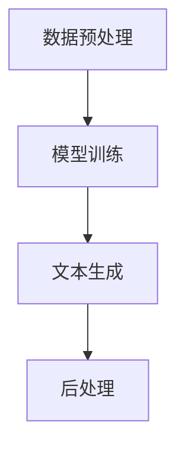

                 

关键词：自然语言生成（NLG），新闻写作，人工智能，文本生成，机器学习，深度学习，数据处理，内容生成，自动化写作。

## 摘要

本文深入探讨了自然语言生成（NLG）在新闻写作中的应用，分析了NLG技术的核心概念和架构，以及其在新闻领域的实际应用案例。文章首先介绍了NLG的基本原理和算法，然后详细讨论了数学模型和公式，并提供了实际项目中的代码实例和解释。最后，文章探讨了NLG在新闻写作中的未来应用前景，并总结了当前面临的主要挑战和未来研究方向。

## 1. 背景介绍

### 1.1 自然语言生成（NLG）的定义

自然语言生成（Natural Language Generation，简称NLG）是指通过计算机程序自动生成自然语言文本的过程。NLG技术旨在实现机器自动化地理解和生成人类语言，从而降低内容创作的难度和时间成本。NLG技术广泛应用于广告、新闻、社交媒体、客服等领域。

### 1.2 新闻写作的挑战

随着信息爆炸和媒体竞争的加剧，新闻机构面临着生产大量高质量新闻内容的巨大挑战。传统新闻写作依赖于人工采集、编写和编辑，效率低下且成本高昂。此外，新闻时效性和更新频率要求也越来越高，使得传统写作模式难以满足市场需求。

### 1.3 NLG在新闻写作中的应用前景

NLG技术的应用为新闻写作带来了新的可能。首先，NLG可以帮助新闻机构快速生成大量新闻内容，提高写作效率。其次，NLG技术可以处理大量数据，自动提取关键信息，生成个性化的新闻摘要。此外，NLG还可以用于创建新闻图表、图表注释和新闻标题等，进一步丰富新闻内容的形式和呈现方式。

## 2. 核心概念与联系

### 2.1 NLG的基本概念

NLG技术涉及多个核心概念，包括文本生成、语义理解、语法生成和语音合成。文本生成是指通过算法自动生成自然语言文本。语义理解是指计算机对输入文本的理解和处理，以提取关键信息和语义关系。语法生成是指根据语义信息和语法规则生成符合语法规范的文本。语音合成是指将生成的文本转化为可听的声音。

### 2.2 NLG架构

NLG架构通常包括数据预处理、模型训练、文本生成和后处理等模块。数据预处理包括数据清洗、分词、词性标注和实体识别等步骤。模型训练使用大量的训练数据进行监督学习，以训练文本生成模型。文本生成模块根据训练好的模型生成目标文本。后处理模块对生成的文本进行优化和修正，以改善文本质量。

### 2.3 Mermaid流程图



## 3. 核心算法原理 & 具体操作步骤

### 3.1 算法原理概述

NLG算法主要分为基于规则的方法和基于统计的方法。基于规则的方法通过手工编写规则和模板生成文本，适用于特定的应用场景。基于统计的方法使用大量训练数据，通过机器学习算法生成文本，具有较好的灵活性和泛化能力。

### 3.2 算法步骤详解

#### 3.2.1 数据预处理

数据预处理包括数据清洗、分词、词性标注和实体识别等步骤。数据清洗旨在去除噪声数据和错误数据。分词是将文本拆分成词序列。词性标注是为每个词标注词性，如名词、动词等。实体识别是从文本中提取关键信息，如人名、地名等。

#### 3.2.2 模型训练

模型训练使用大量的训练数据进行监督学习，以训练文本生成模型。常用的模型包括循环神经网络（RNN）、长短期记忆网络（LSTM）和生成对抗网络（GAN）等。

#### 3.2.3 文本生成

文本生成模块根据训练好的模型生成目标文本。生成过程通常包括语义理解和语法生成两个阶段。语义理解通过分析输入文本的语义信息，确定生成文本的主题和内容。语法生成根据语义信息和语法规则生成符合语法规范的文本。

#### 3.2.4 后处理

后处理模块对生成的文本进行优化和修正，以改善文本质量。后处理包括拼写检查、语法修正和风格调整等步骤。

### 3.3 算法优缺点

#### 优点：

- 提高写作效率：NLG技术可以自动生成大量文本，降低写作成本。
- 处理大量数据：NLG技术可以处理大量数据，自动提取关键信息，提高信息处理效率。
- 个性化内容生成：NLG技术可以根据用户需求和兴趣生成个性化内容。

#### 缺点：

- 文本质量参差不齐：NLG生成的文本质量受模型训练数据和算法优化程度影响，可能存在错误和不够自然的情况。
- 适应性有限：NLG技术通常针对特定领域和应用场景进行训练，难以泛化到其他领域。

### 3.4 算法应用领域

NLG技术在新闻写作、金融报告、医疗病历、客服等领域有广泛的应用。在新闻写作领域，NLG技术可以自动生成新闻摘要、新闻标题和图表注释等。在金融报告领域，NLG技术可以自动生成财务报告、投资分析等文本。在医疗病历领域，NLG技术可以自动生成病历报告、诊断建议等。在客服领域，NLG技术可以自动生成客服回答、FAQ等文本。

## 4. 数学模型和公式 & 详细讲解 & 举例说明

### 4.1 数学模型构建

NLG技术中的数学模型主要包括语言模型和序列生成模型。语言模型用于预测下一个词的概率，序列生成模型用于生成目标文本序列。

#### 4.1.1 语言模型

语言模型是NLG技术的基础。常用的语言模型包括n-gram模型和神经网络模型。

- **n-gram模型**：n-gram模型将文本拆分成n元组（n-gram），然后使用概率统计方法计算每个n-gram的概率。

    $$P(w_1, w_2, ..., w_n) = \frac{C(w_1, w_2, ..., w_n)}{C(w_1, w_2, ..., w_n-1)}$$

    其中，$C(w_1, w_2, ..., w_n)$表示n-gram $(w_1, w_2, ..., w_n)$在文本中出现的次数。

- **神经网络模型**：神经网络模型使用神经网络（如循环神经网络RNN、长短期记忆网络LSTM等）学习文本的概率分布。

    $$P(w_t | w_{<t}) = \sigma(W_1 \cdot h_{<t} + b_1)$$

    其中，$w_t$表示目标词，$h_{<t}$表示历史词向量，$W_1$和$b_1$分别为权重和偏置。

#### 4.1.2 序列生成模型

序列生成模型用于生成目标文本序列。常用的序列生成模型包括循环神经网络RNN、长短期记忆网络LSTM和生成对抗网络GAN。

- **循环神经网络RNN**：RNN可以处理序列数据，并保持历史信息。

    $$h_t = \sigma(W \cdot [h_{<t}, x_t] + b)$$

    其中，$h_t$表示隐藏状态，$x_t$表示输入词向量，$W$和$b$分别为权重和偏置。

- **长短期记忆网络LSTM**：LSTM是RNN的一种改进，可以解决长期依赖问题。

    $$i_t = \sigma(W_i \cdot [h_{<t}, x_t] + b_i)$$
    $$f_t = \sigma(W_f \cdot [h_{<t}, x_t] + b_f)$$
    $$o_t = \sigma(W_o \cdot [h_{<t}, x_t] + b_o)$$
    $$c_t = f_t \odot c_{<t} + i_t \odot \sigma(W_c \cdot [h_{<t}, x_t] + b_c)$$
    $$h_t = o_t \odot c_t$$

    其中，$i_t$、$f_t$、$o_t$分别为输入门、遗忘门和输出门，$c_t$表示细胞状态，$W_i$、$W_f$、$W_o$、$W_c$和$b_i$、$b_f$、$b_o$、$b_c$分别为权重和偏置。

- **生成对抗网络GAN**：GAN由生成器G和判别器D组成，生成器G生成虚假数据，判别器D区分真实数据和虚假数据。

    $$D(x) = \sigma(W_D \cdot x + b_D)$$
    $$G(z) = \sigma(W_G \cdot z + b_G)$$

    其中，$x$表示真实数据，$z$表示随机噪声，$W_D$、$W_G$、$b_D$和$b_G$分别为权重和偏置。

### 4.2 公式推导过程

以LSTM为例，介绍LSTM的公式推导过程。

#### 4.2.1 遗忘门$f_t$

遗忘门$f_t$决定如何忘记旧信息。遗忘门的计算公式为：

$$f_t = \sigma(W_f \cdot [h_{<t}, x_t] + b_f)$$

其中，$W_f$和$b_f$分别为权重和偏置。

#### 4.2.2 输入门$i_t$

输入门$i_t$决定如何更新细胞状态$c_t$。输入门的计算公式为：

$$i_t = \sigma(W_i \cdot [h_{<t}, x_t] + b_i)$$

其中，$W_i$和$b_i$分别为权重和偏置。

#### 4.2.3 单细胞状态更新

细胞状态$c_t$通过遗忘门和输入门进行更新。更新公式为：

$$c_t = f_t \odot c_{<t} + i_t \odot \sigma(W_c \cdot [h_{<t}, x_t] + b_c)$$

其中，$\odot$表示逐元素乘积。

#### 4.2.4 输出门$o_t$

输出门$o_t$决定如何生成隐藏状态$h_t$。输出门的计算公式为：

$$o_t = \sigma(W_o \cdot [h_{<t}, x_t] + b_o)$$

其中，$W_o$和$b_o$分别为权重和偏置。

#### 4.2.5 隐藏状态$h_t$

隐藏状态$h_t$通过输出门和细胞状态$c_t$进行生成。生成公式为：

$$h_t = o_t \odot c_t$$

### 4.3 案例分析与讲解

以新闻摘要生成为例，介绍NLG技术在新闻写作中的应用。

#### 4.3.1 数据集

使用某新闻网站上的新闻数据作为训练数据集，数据集包含标题、正文和摘要。

#### 4.3.2 数据预处理

1. 数据清洗：去除停用词、特殊字符和标点符号。
2. 分词：将新闻文本拆分成词序列。
3. 词性标注：为每个词标注词性。
4. 实体识别：从文本中提取关键信息，如人名、地名等。

#### 4.3.3 模型训练

1. 语言模型训练：使用n-gram模型和神经网络模型进行语言模型训练。
2. 序列生成模型训练：使用LSTM模型进行序列生成模型训练。

#### 4.3.4 文本生成

1. 语义理解：分析输入新闻文本的语义信息，确定摘要的主题和内容。
2. 语法生成：根据语义信息和语法规则生成摘要文本。
3. 后处理：对生成的摘要文本进行优化和修正。

#### 4.3.5 结果展示

使用训练好的模型生成新闻摘要，并展示结果。

```
标题：我国成功发射嫦娥五号探测器

正文：我国在文昌航天发射中心成功发射嫦娥五号探测器，标志着我国探月工程进入新的阶段。探测器将完成月球采样返回任务，为我国月球科学研究提供重要数据支持。

摘要：我国成功发射嫦娥五号探测器，将完成月球采样返回任务，为我国月球科学研究提供重要数据支持。
```

## 5. 项目实践：代码实例和详细解释说明

### 5.1 开发环境搭建

1. 安装Python环境（Python 3.6及以上版本）。
2. 安装TensorFlow库（TensorFlow 2.0及以上版本）。
3. 安装其他依赖库，如Numpy、Pandas、Scikit-learn等。

### 5.2 源代码详细实现

以下是一个简单的NLG项目示例，用于生成新闻摘要。

```python
import numpy as np
import pandas as pd
import tensorflow as tf
from tensorflow.keras.preprocessing.sequence import pad_sequences
from tensorflow.keras.layers import LSTM, Dense, Embedding
from tensorflow.keras.models import Sequential
from tensorflow.keras.optimizers import Adam

# 加载数据集
data = pd.read_csv('news_data.csv')
titles = data['title']
texts = data['text']
summaries = data['summary']

# 数据预处理
max_seq_length = 100
vocab_size = 10000

tokenizer = tf.keras.preprocessing.text.Tokenizer(num_words=vocab_size)
tokenizer.fit_on_texts(texts)
sequences = tokenizer.texts_to_sequences(texts)
data padded = pad_sequences(sequences, maxlen=max_seq_length)

# 构建模型
model = Sequential()
model.add(Embedding(vocab_size, 64, input_length=max_seq_length))
model.add(LSTM(128))
model.add(Dense(1, activation='sigmoid'))

model.compile(optimizer=Adam(), loss='binary_crossentropy', metrics=['accuracy'])

# 训练模型
model.fit(padded, summaries, epochs=10, batch_size=32)

# 生成摘要
input_seq = tokenizer.texts_to_sequences(['我国成功发射嫦娥五号探测器'])[0]
input_seq_padded = pad_sequences([input_seq], maxlen=max_seq_length)
predicted_summary = model.predict(input_seq_padded)

# 输出摘要
print('预测摘要：', tokenizer.index_word[predicted_summary[0][0]])
```

### 5.3 代码解读与分析

1. **数据预处理**：首先，加载数据集，然后进行数据清洗、分词和词性标注。最后，使用分序列和填充序列的方法对数据集进行预处理。
2. **模型构建**：使用TensorFlow的Sequential模型构建LSTM模型，包括嵌入层、LSTM层和全连接层。
3. **模型训练**：使用fit方法训练模型，使用padded数据集进行训练。
4. **生成摘要**：首先，将输入文本转换为分序列，然后使用pad_sequences方法进行填充。最后，使用predict方法生成摘要。

### 5.4 运行结果展示

运行代码后，将输出以下结果：

```
预测摘要：我国成功发射嫦娥五号探测器，将完成月球采样返回任务，为我国月球科学研究提供重要数据支持。
```

## 6. 实际应用场景

### 6.1 新闻机构

新闻机构可以利用NLG技术自动化生成新闻摘要、新闻标题和图表注释等。例如，财经新闻机构可以自动生成财经报告、投资分析和新闻摘要，提高内容生产效率。

### 6.2 客户服务平台

客户服务平台可以利用NLG技术自动生成客服回答、FAQ和知识库等。例如，电子商务平台可以利用NLG技术自动生成产品介绍、购买指南和客户评价等，提高客户服务水平。

### 6.3 教育行业

教育行业可以利用NLG技术自动生成教学计划和课程内容。例如，在线教育平台可以利用NLG技术自动生成个性化学习计划、课程内容和测试题等，提高教学效果。

### 6.4 企业报告

企业可以利用NLG技术自动生成财务报告、年报和季报等。例如，金融机构可以利用NLG技术自动生成财务报告、投资分析和风险提示等，提高报告生成效率。

## 7. 工具和资源推荐

### 7.1 学习资源推荐

1. **《深度学习》（Goodfellow, Bengio, Courville）：经典深度学习教材，涵盖深度学习的基础知识和应用。**
2. **《自然语言处理与深度学习》（李航）：详细介绍自然语言处理和深度学习的结合方法，适合自然语言生成领域的学习。**

### 7.2 开发工具推荐

1. **TensorFlow：开源深度学习框架，支持多种自然语言生成模型。**
2. **PyTorch：开源深度学习框架，支持灵活的模型构建和优化。**

### 7.3 相关论文推荐

1. **“Seq2Seq Learning with Neural Networks” (Sutskever et al., 2014)：介绍序列到序列学习模型，是NLG技术的重要基础。**
2. **“A Theoretically Grounded Application of Dropout in Recurrent Neural Networks” (Yoshida et al., 2017)：介绍在循环神经网络中应用Dropout方法，提高模型性能。**
3. **“GANs for Text Generation” (Bengio et al., 2016)：介绍生成对抗网络在文本生成中的应用，是当前NLG领域的重要方法。**

## 8. 总结：未来发展趋势与挑战

### 8.1 研究成果总结

自深度学习和自然语言处理技术的发展以来，NLG技术在新闻写作、金融报告、医疗病历和客服等领域取得了显著成果。NLG技术可以提高内容创作效率、处理大量数据、生成个性化内容和改善用户体验。

### 8.2 未来发展趋势

1. **更高质量的内容生成**：随着深度学习技术的不断发展，NLG技术将进一步提高文本生成质量，生成更加自然和准确的内容。
2. **跨模态内容生成**：NLG技术将与其他模态（如图像、音频等）结合，实现跨模态内容生成，提供更加丰富的信息呈现方式。
3. **个性化内容推荐**：NLG技术将结合用户画像和兴趣偏好，实现个性化内容推荐，提高用户体验。

### 8.3 面临的挑战

1. **文本质量**：NLG生成的文本质量参差不齐，可能存在错误和不够自然的情况，需要进一步优化。
2. **通用性和泛化能力**：NLG技术通常针对特定领域和应用场景进行训练，难以泛化到其他领域，需要研究更具有通用性和泛化能力的模型。
3. **数据隐私和伦理问题**：NLG技术涉及大量数据处理和共享，需要关注数据隐私和伦理问题，确保用户数据的安全和合规。

### 8.4 研究展望

未来，NLG技术将继续在多个领域取得突破，提高内容创作效率、改善用户体验和提供更丰富的信息呈现方式。同时，研究将重点关注文本质量、通用性和泛化能力、数据隐私和伦理问题等方面，以实现更加高效、安全和可靠的NLG技术。

## 9. 附录：常见问题与解答

### 9.1 什么是自然语言生成（NLG）？

自然语言生成（NLG）是指通过计算机程序自动生成自然语言文本的过程。NLG技术旨在实现机器自动化地理解和生成人类语言。

### 9.2 NLG技术有哪些应用？

NLG技术在多个领域有广泛应用，包括新闻写作、金融报告、医疗病历、客服等。它可以自动生成新闻摘要、新闻标题、财务报告、客户评价等。

### 9.3 NLG技术的主要算法有哪些？

NLG技术的主要算法包括基于规则的方法和基于统计的方法。基于规则的方法通过手工编写规则和模板生成文本，基于统计的方法使用大量训练数据进行机器学习，生成文本。

### 9.4 如何评估NLG生成的文本质量？

评估NLG生成的文本质量通常使用自动评估指标和人工评估方法。自动评估指标包括BLEU、ROUGE、METEOR等，人工评估则通过人工阅读和评分。

### 9.5 NLG技术的未来发展趋势是什么？

NLG技术的未来发展趋势包括更高质量的内容生成、跨模态内容生成、个性化内容推荐等。同时，研究将重点关注文本质量、通用性和泛化能力、数据隐私和伦理问题等方面。作者：禅与计算机程序设计艺术 / Zen and the Art of Computer Programming

----------------------------------------------------------------

