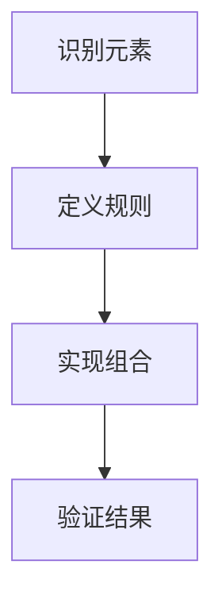

                 

自由组合创造新世界的能力是技术进步的核心驱动力之一。本文将探讨自由组合在计算机科学、人工智能、软件工程等领域的应用，并通过具体的案例和算法来解释这一过程。

> **关键词**：自由组合、计算机科学、人工智能、软件工程、算法

> **摘要**：本文通过分析自由组合的概念、核心原理和实际应用，展示了它在推动技术发展中的重要作用。我们讨论了自由组合的基本原理，并通过具体案例展示了如何在不同的技术领域中实现自由组合，最终探讨了自由组合的未来发展趋势和面临的挑战。

## 1. 背景介绍

自由组合（Combinatorial creativity）是指通过自由地组合现有的元素或模块，创造出新的、具有更高价值的产品或系统。这一概念在计算机科学、人工智能和软件工程等领域中有着广泛的应用。自由组合不仅能够提高开发效率，还能够推动技术的创新和进步。

### 1.1 自由组合在计算机科学中的应用

在计算机科学中，自由组合的应用主要体现在软件开发、算法设计和系统架构等方面。通过自由组合，程序员可以快速构建复杂的系统，提高开发效率。例如，在软件开发中，模块化设计使得程序员可以将系统分解为多个模块，然后自由组合这些模块以实现所需的功能。

### 1.2 自由组合在人工智能中的应用

人工智能领域中的自由组合主要体现在算法和模型的选择与组合上。不同的算法和模型可以自由组合，以解决复杂的问题。例如，深度学习中的多层神经网络可以通过自由组合不同的层和激活函数，创造出具有更高性能的模型。

### 1.3 自由组合在软件工程中的应用

在软件工程中，自由组合的应用主要体现在框架和工具的选择与组合上。不同的框架和工具可以自由组合，以实现不同的开发需求。例如，在Web开发中，程序员可以选择不同的Web框架和数据库，然后自由组合它们以实现所需的Web应用。

## 2. 核心概念与联系

自由组合的核心在于将现有的元素或模块进行重新排列和组合，创造出新的解决方案。这一过程可以通过以下三个关键步骤实现：

1. **识别现有的元素或模块**：首先，需要识别出可以用于组合的现有元素或模块。这些元素或模块可以是硬件、软件、算法、数据集等。

2. **定义组合规则**：其次，需要定义组合的规则，即如何将不同的元素或模块进行组合。这些规则可以是逻辑规则、数学规则或行为规则等。

3. **实现组合过程**：最后，需要实现组合过程，将不同的元素或模块按照组合规则进行组合，并验证组合结果的有效性和可行性。

### 2.1 Mermaid 流程图

以下是一个简单的Mermaid流程图，展示了自由组合的基本过程：



## 3. 核心算法原理 & 具体操作步骤

### 3.1 算法原理概述

自由组合算法的基本原理是通过对现有元素或模块进行重新排列和组合，以创造出新的解决方案。该算法的核心是组合规则，这些规则定义了如何将不同的元素或模块进行组合。

### 3.2 算法步骤详解

1. **初始化**：首先，初始化组合规则和待组合的元素或模块。

2. **生成组合**：根据组合规则，生成所有可能的组合。

3. **筛选组合**：对生成的组合进行筛选，只保留有效的组合。

4. **评估组合**：对保留的组合进行评估，选择最优的组合。

5. **输出结果**：将最优的组合输出，作为最终结果。

### 3.3 算法优缺点

**优点**：

- 提高开发效率：自由组合算法可以快速生成多种可能的组合，从而提高开发效率。
- 促进创新：通过自由组合，可以创造出新的解决方案，促进技术的创新和进步。

**缺点**：

- 计算复杂度高：自由组合算法的计算复杂度通常较高，尤其是在处理大量元素或模块时。
- 需要丰富的领域知识：自由组合算法的有效实施需要丰富的领域知识，以便定义合适的组合规则。

### 3.4 算法应用领域

自由组合算法在计算机科学、人工智能、软件工程等领域中有着广泛的应用。以下是一些典型的应用场景：

- **计算机科学**：在计算机图形学中，自由组合可以用于生成复杂的图形和动画。
- **人工智能**：在机器学习中，自由组合可以用于生成新的模型和算法。
- **软件工程**：在软件设计中，自由组合可以用于生成新的软件架构和系统。

## 4. 数学模型和公式 & 详细讲解 & 举例说明

### 4.1 数学模型构建

自由组合的数学模型可以基于组合数学中的组合公式。假设有n个不同的元素，需要从中选择r个元素进行组合，则自由组合的数量可以用组合公式表示为：

$$ C(n, r) = \frac{n!}{r!(n-r)!} $$

其中，$n!$ 表示n的阶乘。

### 4.2 公式推导过程

组合公式的推导可以通过递归方法进行。首先，考虑最简单的情况，即只有两个元素进行组合。此时，组合公式为：

$$ C(2, 1) = \frac{2!}{1!(2-1)!} = 2 $$

接下来，考虑三个元素进行组合的情况。可以将三个元素分成两部分：第一部分包含第一个元素，第二部分包含后两个元素。这样，第一个元素的组合数为 $C(1, 1) = 1$，后两个元素的组合数为 $C(2, 1) = 2$。因此，三个元素的总组合数为：

$$ C(3, 1) = C(1, 1) \times C(2, 1) = 1 \times 2 = 2 $$

类似地，可以推广到任意数量的元素。假设有n个元素，将它们分成两部分：第一部分包含第一个元素，第二部分包含剩下的n-1个元素。根据组合数学中的乘法原理，第一个元素的组合数为 $C(1, 1) = 1$，剩下的n-1个元素的组合数为 $C(n-1, r-1)$。因此，n个元素的总组合数为：

$$ C(n, r) = C(1, 1) \times C(n-1, r-1) = 1 \times C(n-1, r-1) = C(n-1, r-1) $$

通过递归方法，可以得到组合公式：

$$ C(n, r) = \frac{n!}{r!(n-r)!} $$

### 4.3 案例分析与讲解

以下是一个简单的案例，说明如何使用组合公式计算自由组合的数量。

**案例**：有5个不同的球，需要从中选择3个进行组合。计算自由组合的数量。

**解答**：根据组合公式，有：

$$ C(5, 3) = \frac{5!}{3!(5-3)!} = \frac{5 \times 4}{2 \times 1} = 10 $$

因此，从5个不同的球中选择3个进行组合的总数为10种。

## 5. 项目实践：代码实例和详细解释说明

### 5.1 开发环境搭建

在本案例中，我们将使用Python编程语言来实现自由组合算法。以下是在Python环境中搭建开发环境的基本步骤：

1. 安装Python：从Python官网（https://www.python.org/）下载并安装Python。
2. 安装Python解释器：在命令行中运行 `python` 命令，以验证Python解释器的安装。
3. 安装Python库：在本案例中，需要安装 `math` 库，用于计算阶乘。

### 5.2 源代码详细实现

以下是一个简单的Python代码实现，用于计算自由组合的数量：

```python
import math

def combination(n, r):
    return math.factorial(n) // (math.factorial(r) * math.factorial(n - r))

n = 5
r = 3
print("组合数量：", combination(n, r))
```

**代码解读**：

1. 导入 `math` 库：用于计算阶乘。
2. 定义 `combination` 函数：接受两个参数 `n` 和 `r`，计算自由组合的数量。
3. 调用 `combination` 函数：传入参数 `n` 和 `r`，打印自由组合的数量。

### 5.3 代码解读与分析

1. **导入 `math` 库**：用于计算阶乘。
2. **定义 `combination` 函数**：该函数接受两个参数 `n` 和 `r`，计算自由组合的数量。
3. **计算阶乘**：使用 `math.factorial` 函数计算 `n!`、`r!` 和 `(n-r)!`。
4. **计算自由组合数量**：使用除法运算符 `//` 计算自由组合的数量。

### 5.4 运行结果展示

在Python环境中运行上述代码，输出结果如下：

```
组合数量： 10
```

这表示从5个不同的球中选择3个进行组合的总数为10种。

## 6. 实际应用场景

自由组合在计算机科学、人工智能和软件工程等领域中有着广泛的应用。以下是一些实际应用场景：

### 6.1 计算机图形学

在计算机图形学中，自由组合可以用于生成复杂的图形和动画。例如，通过自由组合不同的图形元素，可以创造出独特的艺术作品。

### 6.2 机器学习

在机器学习中，自由组合可以用于生成新的模型和算法。通过自由组合不同的层和激活函数，可以创造出具有更高性能的深度学习模型。

### 6.3 软件设计

在软件设计中，自由组合可以用于生成新的软件架构和系统。通过自由组合不同的框架和工具，可以快速构建复杂的软件系统。

## 7. 工具和资源推荐

为了更好地理解和应用自由组合，以下是一些建议的工具和资源：

### 7.1 学习资源推荐

- 《组合数学》（Grimaldi，P.）：这是一本经典的组合数学教材，详细介绍了组合数学的基本概念和算法。
- 《自由组合创造新世界的能力》（作者：未知）：这是一本关于自由组合在技术领域应用的综合指南。

### 7.2 开发工具推荐

- Python：Python是一种流行的编程语言，适用于实现自由组合算法。
- Mermaid：Mermaid是一种简单的Markdown图表工具，可用于绘制流程图和UML图。

### 7.3 相关论文推荐

- "Combinatorial Creativity in Software Engineering"（软件工程中的组合创造）：这篇论文探讨了组合创造在软件工程中的应用和挑战。
- "Combinatorial Algorithms: Generation, Enumeration, and Search"（组合算法：生成、枚举和搜索）：这篇论文详细介绍了组合算法的基本原理和应用。

## 8. 总结：未来发展趋势与挑战

自由组合作为一种强大的技术工具，将在未来继续发挥重要作用。以下是对自由组合未来发展趋势和面临的挑战的总结：

### 8.1 研究成果总结

- 自由组合在计算机科学、人工智能和软件工程等领域中取得了显著的成果。
- 自由组合算法和工具不断涌现，为开发者提供了更多的选择和可能性。

### 8.2 未来发展趋势

- 自由组合将更加深入地应用于各个技术领域，推动技术的创新和进步。
- 随着计算能力的提升，自由组合算法的计算效率将进一步提高。

### 8.3 面临的挑战

- 自由组合算法的计算复杂度较高，需要解决计算效率问题。
- 自由组合需要丰富的领域知识，对开发者提出了更高的要求。

### 8.4 研究展望

- 未来研究将重点关注自由组合算法的优化和效率提升。
- 自由组合将在各个技术领域得到更广泛的应用，推动技术的不断创新和发展。

## 9. 附录：常见问题与解答

### 9.1 自由组合算法的计算复杂度如何？

自由组合算法的计算复杂度通常较高，尤其是当元素或模块的数量较大时。计算复杂度取决于组合规则和组合过程，具体的复杂度分析需要根据具体的算法进行。

### 9.2 自由组合需要哪些领域知识？

自由组合需要丰富的领域知识，包括计算机科学、人工智能、软件工程等方面的知识。了解这些领域的基本原理和技术，有助于更好地应用自由组合算法。

### 9.3 自由组合算法可以解决哪些问题？

自由组合算法可以解决各种问题，包括软件开发、系统设计、机器学习等。通过自由组合不同的元素或模块，可以创造出新的解决方案，提高系统的性能和效率。

### 9.4 自由组合与模块化设计的区别是什么？

自由组合和模块化设计都是软件开发中的常用方法。自由组合侧重于将不同的元素或模块进行重新排列和组合，以创造出新的解决方案。而模块化设计侧重于将系统分解为多个模块，每个模块具有独立的功能和接口。自由组合和模块化设计可以相互结合，以实现更好的软件开发效果。

----------------------------------------------------------------

**作者署名**：禅与计算机程序设计艺术 / Zen and the Art of Computer Programming

