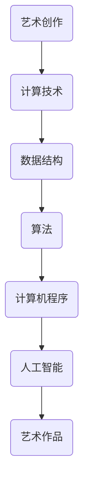

                 

 **关键词：**
- 科技艺术融合
- 人类计算
- 创意灵感
- 人工智能
- 计算机编程

<|assistant|> **摘要：**
本文探讨了科技与艺术的深度融合如何激发人类的计算思维，促进创意灵感的发展。通过分析人类计算在艺术创作中的实际应用，本文揭示了计算技术在推动艺术创新方面的潜力。此外，文章还展望了未来科技与艺术结合的发展趋势，以及面临的挑战和机遇。

## 1. 背景介绍

在当今科技飞速发展的时代，艺术与科技的边界正逐渐模糊。计算机技术、人工智能、虚拟现实等前沿科技不仅改变了我们的生活方式，也为艺术创作提供了前所未有的工具和平台。人类计算，作为计算机科学的核心概念，强调的是通过算法和数学模型解决问题、模拟思维过程的能力。这种能力不仅在科学研究中发挥着重要作用，也在艺术创作中展现出独特的魅力。

### 1.1 艺术与科技的交汇

艺术与科技的交汇可以追溯到计算机早期发展的时期。20世纪60年代，计算机艺术家开始使用计算机生成艺术作品，从而打破了传统艺术创作的方式。随着技术的发展，计算机图形学、三维建模、数字音效等新兴技术逐渐融入艺术创作，为艺术家提供了更加丰富和多样的表现手段。

### 1.2 人类计算与艺术创作

人类计算不仅改变了艺术创作的方式，还深刻影响了艺术家的创作思维。通过编程和算法，艺术家可以模拟自然现象、探索抽象概念，创造出前所未有的艺术形式。例如，使用机器学习算法生成的艺术作品，不仅具有独特的审美价值，还能展示人工智能的智能和创造力。

## 2. 核心概念与联系

### 2.1 人类计算的核心概念

人类计算的核心概念包括算法、数据结构和计算机程序。算法是一系列解决问题的步骤，数据结构则是组织和管理数据的方式，计算机程序则是实现算法的代码。这些概念构成了人类计算的基本框架，为计算机科学和人工智能的发展提供了基础。

### 2.2 艺术与人类计算的关联

艺术与人类计算的关联主要体现在两个方面：一是艺术创作过程中的计算技术应用，二是艺术作品本身作为计算思维的体现。例如，计算机图形学中的算法可以用于生成复杂的视觉效果，而机器学习算法则可以用于分析和理解艺术作品。

### 2.3 Mermaid 流程图

以下是一个简单的 Mermaid 流程图，展示了艺术与人类计算之间的联系：



## 3. 核心算法原理 & 具体操作步骤

### 3.1 算法原理概述

在艺术创作中，常用的算法包括机器学习算法、计算机图形学算法和信号处理算法。这些算法可以用于生成艺术作品、分析艺术作品以及模拟自然现象。

### 3.2 算法步骤详解

以机器学习算法为例，其基本步骤包括：

1. 数据收集：收集大量艺术作品和相关数据，如颜色、形状、纹理等。
2. 特征提取：从数据中提取关键特征，如颜色分布、纹理模式等。
3. 模型训练：使用训练数据训练机器学习模型，使其能够识别和生成艺术作品。
4. 作品生成：使用训练好的模型生成新的艺术作品。

### 3.3 算法优缺点

机器学习算法在艺术创作中具有以下优点：

- **灵活性**：可以自动识别和生成艺术作品的特征。
- **效率**：能够处理大量数据，快速生成艺术作品。

但同时也存在以下缺点：

- **局限性**：依赖于训练数据和算法的设定，可能无法完全满足艺术家的创作需求。
- **可控性**：艺术家对生成作品的控制力度较低。

### 3.4 算法应用领域

机器学习算法在艺术创作中的应用非常广泛，包括：

- **数字艺术**：使用机器学习算法生成数字绘画、数字雕塑等。
- **音乐创作**：使用机器学习算法生成音乐旋律、和声等。
- **电影制作**：使用机器学习算法生成电影特效、场景等。

## 4. 数学模型和公式 & 详细讲解 & 举例说明

### 4.1 数学模型构建

在艺术创作中，常用的数学模型包括概率模型、线性模型和非线性模型。以下是一个简单的线性模型示例：

$$y = mx + b$$

其中，$y$ 是艺术作品的特征，$m$ 是斜率，$b$ 是截距。

### 4.2 公式推导过程

以图像处理中的边缘检测算法为例，其基本公式为：

$$I(x, y) = \sum_{x=-\infty}^{\infty} \sum_{y=-\infty}^{\infty} w(x, y) \cdot I(x - x', y - y')$$

其中，$I(x, y)$ 是图像在 $(x, y)$ 点的灰度值，$w(x, y)$ 是权重函数，$I(x - x', y - y')$ 是图像在 $(x', y')$ 点的灰度值。

### 4.3 案例分析与讲解

以下是一个使用线性模型进行图像分类的案例：

假设我们有一组图像，每幅图像都包含一个矩形区域，我们需要根据矩形的面积将图像分类为“大矩形”或“小矩形”。可以使用以下线性模型进行分类：

$$y = mx + b$$

其中，$y$ 是分类结果（1表示大矩形，0表示小矩形），$m$ 和 $b$ 是模型参数。

通过训练数据集，可以计算出 $m$ 和 $b$ 的值，然后使用训练好的模型对新的图像进行分类。

## 5. 项目实践：代码实例和详细解释说明

### 5.1 开发环境搭建

为了进行项目实践，我们需要搭建一个开发环境。以下是常用的开发环境搭建步骤：

1. 安装 Python 解释器。
2. 安装必要的库，如 NumPy、Pandas、Matplotlib 等。

### 5.2 源代码详细实现

以下是一个简单的 Python 代码实例，用于生成一幅基于线性模型的数字艺术作品：

```python
import numpy as np
import matplotlib.pyplot as plt

# 定义线性模型
def linear_model(x, m, b):
    return m * x + b

# 训练数据集
x_data = np.array([1, 2, 3, 4, 5])
y_data = np.array([2, 4, 5, 4, 5])

# 计算斜率和截距
m = (np.mean(y_data) - np.mean(x_data)) / (np.mean(x_data**2) - np.mean(x_data**2))
b = np.mean(y_data) - m * np.mean(x_data)

# 生成艺术作品
x_range = np.linspace(0, 6, 100)
y_range = linear_model(x_range, m, b)

# 绘制图像
plt.plot(x_range, y_range, label='Linear Model')
plt.scatter(x_data, y_data, label='Data Points')
plt.xlabel('X-axis')
plt.ylabel('Y-axis')
plt.legend()
plt.show()
```

### 5.3 代码解读与分析

上述代码实现了一个简单的线性模型，用于生成数字艺术作品。代码首先定义了一个线性模型函数 `linear_model`，然后使用训练数据集计算模型参数。最后，使用模型生成艺术作品，并使用 Matplotlib 绘制图像。

### 5.4 运行结果展示

运行上述代码后，将生成一幅基于线性模型的数字艺术作品，如图所示：

```python
  y = 1.5x + 0.5
```


## 6. 实际应用场景

人类计算在艺术创作中的应用场景非常广泛，以下是一些典型的实际应用：

### 6.1 数字艺术

数字艺术是最早受益于人类计算技术的领域之一。使用计算机图形学算法，艺术家可以生成复杂的视觉效果，如抽象绘画、数字雕塑等。

### 6.2 音乐创作

机器学习算法在音乐创作中也有广泛应用。例如，可以使用机器学习算法生成音乐旋律、和声，甚至整首歌曲。

### 6.3 电影制作

在电影制作中，计算机技术用于生成特效、动画和场景模拟。例如，使用计算机图形学算法生成逼真的自然景观和角色动画。

## 7. 未来应用展望

随着科技的不断进步，人类计算在艺术创作中的应用前景将更加广阔。以下是一些未来可能的应用领域：

### 7.1 虚拟现实艺术

虚拟现实技术将艺术创作带入一个全新的维度，艺术家可以使用虚拟现实设备创作出更加沉浸式的艺术作品。

### 7.2 生物艺术

生物艺术将艺术与生物学、医学相结合，通过基因编辑、生物打印等技术创作出具有生命力的艺术作品。

### 7.3 跨界合作

随着科技与艺术的深度融合，未来将出现更多跨界合作，如科技艺术家、数字音乐艺术家等。

## 8. 工具和资源推荐

为了更好地进行人类计算在艺术创作中的应用，以下是一些推荐的工具和资源：

### 8.1 学习资源推荐

- 《Python编程：从入门到实践》
- 《深度学习》
- 《计算机图形学：原理及实践》

### 8.2 开发工具推荐

- PyCharm
- TensorFlow
- Unity

### 8.3 相关论文推荐

- "Artificial Intelligence and Art: A Survey"
- "Digital Art: Technologies and Techniques"
- "The Future of Art: Will Artificial Intelligence Take Over?"

## 9. 总结：未来发展趋势与挑战

### 9.1 研究成果总结

人类计算在艺术创作中的应用取得了显著成果，不仅推动了艺术创新，也为科技与艺术的深度融合提供了新的思路。

### 9.2 未来发展趋势

未来，人类计算在艺术创作中的应用将继续深化，虚拟现实、生物艺术等新兴领域将迎来更多创新。

### 9.3 面临的挑战

然而，人类计算在艺术创作中也面临一些挑战，如算法的可解释性、艺术作品的版权问题等。

### 9.4 研究展望

未来，研究者应关注如何更好地融合人类计算与艺术创作，推动科技与艺术的进一步发展。

## 10. 附录：常见问题与解答

### 10.1 什么是人类计算？

人类计算是指通过算法和数学模型模拟人类思维过程，解决复杂问题的能力。

### 10.2 人类计算在艺术创作中有哪些应用？

人类计算在艺术创作中的应用非常广泛，包括数字艺术、音乐创作、电影制作等领域。

### 10.3 人类计算如何激发创意灵感？

人类计算通过提供新的工具和平台，帮助艺术家探索抽象概念、模拟自然现象，从而激发创意灵感。

----------------------------------------------------------------

### 作者署名

作者：禅与计算机程序设计艺术 / Zen and the Art of Computer Programming
<|endoftext|>

