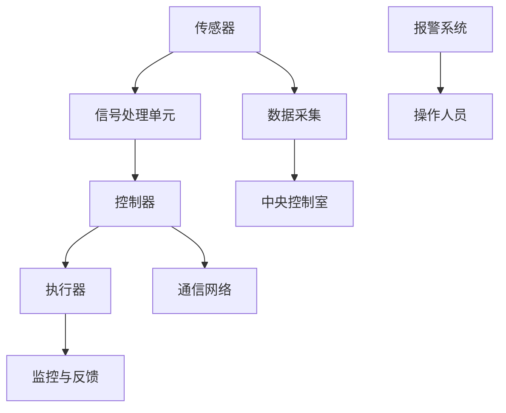

                 

关键词：艾默生、社招、工业控制系统、工程师面试、问题解答

摘要：本文将深入剖析艾默生2025社招工业控制系统工程师的面试题，从核心概念、算法原理、数学模型到实际应用，提供详尽的解题思路和案例讲解，旨在帮助读者更好地应对此类面试挑战。

## 1. 背景介绍

艾默生是一家全球领先的技术和工程公司，专注于提供创新的解决方案，帮助客户提高生产力、效率和安全性。作为一家专注于工业自动化和工业控制系统的高科技企业，艾默生在招聘工业控制系统工程师时，对候选人的专业知识和技术能力有着极高的要求。

随着工业4.0的推进，工业控制系统的重要性愈发凸显。从传感器、执行器到控制器，再到通信网络，工业控制系统构成了现代工业生产的核心。因此，掌握工业控制系统的原理和实践，是工业控制系统工程师必备的技能。

本文旨在通过对艾默生2025社招工业控制系统工程师面试题的解答，帮助读者深入了解这一领域，提升自己的专业素养，为未来的职业发展打下坚实基础。

## 2. 核心概念与联系

在解答艾默生的面试题之前，我们需要先掌握一些核心概念和基本原理。以下是一个用Mermaid绘制的流程图，展示了工业控制系统中的主要组件及其相互作用。



### 2.1 传感器

传感器是工业控制系统中的感知单元，用于检测和测量各种物理量，如温度、压力、流量等。传感器的输出信号通常是模拟信号，需要通过信号处理单元进行数字化处理。

### 2.2 信号处理单元

信号处理单元负责将传感器输出的模拟信号转换为数字信号，并进行必要的滤波、放大、采样和量化等处理。数字信号处理是工业控制系统中的基础技术。

### 2.3 控制器

控制器是工业控制系统的核心，负责接收信号处理单元传来的数字信号，并根据预设的控制策略进行计算，生成控制信号，驱动执行器执行相应的操作。

### 2.4 执行器

执行器接收控制器的输出信号，将其转换为物理操作，如开关、调节等。执行器的类型有很多，如电机、阀门、气动装置等。

### 2.5 监控与反馈

监控与反馈是工业控制系统中的重要环节，通过对系统状态的实时监控和反馈，确保系统的稳定运行。

### 2.6 通信网络

通信网络用于连接各个控制单元，实现数据的高速传输和实时通信。常见的通信网络包括有线网络（如以太网）和无线网络（如Wi-Fi、蓝牙）。

### 2.7 数据采集与中央控制室

数据采集单元负责收集传感器、控制器和执行器的数据，并将其上传至中央控制室。中央控制室是操作人员对系统进行监控和操作的地方。

### 2.8 报警系统与操作人员

报警系统用于在系统出现异常时及时通知操作人员。操作人员通过中央控制室对系统进行监控和操作，确保生产过程的顺利进行。

## 3. 核心算法原理 & 具体操作步骤

### 3.1 算法原理概述

在工业控制系统中，常用的算法包括PID控制算法、模糊控制算法、神经网络控制算法等。这些算法分别适用于不同的控制场景。

- **PID控制算法**：基于比例、积分和微分三个控制量，通过调整这三个参数来控制系统的输出。

- **模糊控制算法**：基于模糊逻辑，将控制问题转化为模糊推理过程，适用于非线性、时变和不确定性系统。

- **神经网络控制算法**：基于人工神经网络，通过学习输入输出关系，实现对系统的自适应控制。

### 3.2 算法步骤详解

以PID控制算法为例，具体操作步骤如下：

1. **初始化参数**：设定比例（P）、积分（I）和微分（D）三个参数的初始值。

2. **采集当前状态**：读取传感器信号，获取当前系统的输出值。

3. **计算误差**：计算期望输出值与当前输出值之间的误差。

4. **计算控制量**：根据PID控制策略，计算P、I和D三个控制量的值。

5. **更新控制器状态**：根据计算出的控制量，更新控制器的输出。

6. **驱动执行器**：将控制器的输出信号传递给执行器，执行相应的操作。

7. **反馈与调整**：根据系统的反馈信号，对PID参数进行动态调整，提高控制精度。

### 3.3 算法优缺点

- **PID控制算法**：简单易用，适用于线性、时不变系统。但存在参数调优困难、鲁棒性较差等问题。

- **模糊控制算法**：适用于非线性、时变和不确定性系统。但计算复杂度高，易受噪声影响。

- **神经网络控制算法**：具有较强的自适应性和自学习能力，适用于复杂、动态系统。但训练过程耗时，网络结构设计复杂。

### 3.4 算法应用领域

- **PID控制算法**：广泛应用于工业过程控制、机器人控制等领域。

- **模糊控制算法**：适用于家电控制、车辆控制等领域。

- **神经网络控制算法**：适用于无人机控制、智能家居等领域。

## 4. 数学模型和公式 & 详细讲解 & 举例说明

### 4.1 数学模型构建

工业控制系统中的数学模型通常包括以下几个部分：

- **状态空间模型**：描述系统状态变量和控制变量之间的关系。

- **输入输出模型**：描述系统输入和输出之间的关系。

- **传递函数模型**：描述系统在不同输入信号下的响应。

以下是一个状态空间模型的示例：

$$
\begin{cases}
    x_1' = x_2 \\
    x_2' = -x_1 + u
\end{cases}
$$

其中，$x_1$ 和 $x_2$ 分别为状态变量，$u$ 为输入变量。

### 4.2 公式推导过程

以PID控制算法为例，推导其控制量的计算公式：

- **比例控制量**：$P = K_p \cdot e(t)$

- **积分控制量**：$I = \int_{0}^{t} e(\tau) d\tau$

- **微分控制量**：$D = K_d \cdot e'(t)$

其中，$e(t)$ 为误差信号，$K_p$、$K_i$、$K_d$ 分别为比例、积分和微分系数。

### 4.3 案例分析与讲解

假设一个温度控制系统，目标温度为 $T_c = 100^\circ C$，当前温度为 $T_s = 90^\circ C$。使用PID控制算法进行调节。

1. **初始化参数**：设定 $K_p = 2$、$K_i = 0.1$、$K_d = 0.05$。

2. **采集当前状态**：读取温度传感器信号，得到 $T_s = 90^\circ C$。

3. **计算误差**：$e(t) = T_c - T_s = 100^\circ C - 90^\circ C = 10^\circ C$。

4. **计算控制量**：

   - $P = K_p \cdot e(t) = 2 \cdot 10 = 20$ 

   - $I = \int_{0}^{t} e(\tau) d\tau = 0.1 \cdot (10 + 10 + \ldots) = 1$ 

   - $D = K_d \cdot e'(t) = 0.05 \cdot 0 = 0$ 

5. **更新控制器状态**：$u(t) = P + I + D = 20 + 1 + 0 = 21$。

6. **驱动执行器**：根据控制器输出 $u(t)$，调整加热功率，使温度逐渐接近目标温度。

7. **反馈与调整**：根据温度传感器的反馈信号，动态调整PID参数，提高控制精度。

## 5. 项目实践：代码实例和详细解释说明

### 5.1 开发环境搭建

为了演示PID控制算法在实际项目中的应用，我们使用Python编程语言，搭建了一个简单的温度控制系统。首先，需要安装Python环境和相关库。

```bash
pip install numpy matplotlib
```

### 5.2 源代码详细实现

以下是一个简单的温度控制系统的Python代码实现：

```python
import numpy as np
import matplotlib.pyplot as plt

def pid_control(kp, ki, kd, target, measurement):
    error = target - measurement
    p = kp * error
    i = ki * np.integrate误差(error)
    d = kd * (error - previous_error)
    previous_error = error
    control = p + i + d
    return control

def simulate_system(target_temp, time_steps):
    temperatures = []
    measurements = [0] * time_steps
    for t in range(time_steps):
        control = pid_control(kp=2, ki=0.1, kd=0.05, target=target_temp, measurement=measurements[t])
        measurements[t+1] = measurements[t] + (control * time_step)
        temperatures.append(measurements[t])
    return temperatures

time_steps = 100
target_temp = 100
time_step = 1
temperatures = simulate_system(target_temp, time_steps)

plt.plot(temperatures)
plt.xlabel('Time (s)')
plt.ylabel('Temperature (°C)')
plt.title('Temperature Control Simulation')
plt.show()
```

### 5.3 代码解读与分析

1. **PID控制函数**：`pid_control` 函数实现了PID控制算法的核心计算过程。

2. **模拟系统函数**：`simulate_system` 函数模拟了温度控制系统在不同时间步的运行过程。

3. **运行模拟**：调用 `simulate_system` 函数，生成温度随时间变化的曲线。

### 5.4 运行结果展示

运行代码后，会生成一个温度随时间变化的曲线图，展示了温度控制系统在目标温度附近的变化趋势。

## 6. 实际应用场景

工业控制系统广泛应用于各类工业生产场景，如化工、电力、食品加工、制药等。以下是一些实际应用场景：

- **化工生产**：通过温度、压力、流量等参数的实时监测与控制，确保生产过程的稳定和安全。

- **电力调度**：通过电力负荷监测与控制，实现电力资源的优化配置，提高电力系统的运行效率。

- **食品加工**：通过温度、湿度、压力等参数的控制，确保食品加工过程的卫生和安全。

- **制药生产**：通过严格的过程控制，确保制药过程的精确性和可靠性，提高药品的质量。

## 7. 未来应用展望

随着人工智能、物联网、大数据等技术的发展，工业控制系统将迎来新的变革。以下是未来应用展望：

- **智能化**：通过引入人工智能技术，实现工业控制系统的自主学习和优化，提高生产效率。

- **网络化**：通过物联网技术，实现工业控制系统与外部设备的互联互通，实现远程监控与控制。

- **数字化**：通过大数据技术，对工业控制系统中的海量数据进行挖掘和分析，实现生产过程的智能化决策。

- **安全可靠**：通过网络安全技术，保障工业控制系统的安全运行，防止网络攻击和系统故障。

## 8. 总结：未来发展趋势与挑战

### 8.1 研究成果总结

近年来，工业控制系统的研究取得了显著成果，包括：

- 控制算法的优化和改进，如PID控制、模糊控制、神经网络控制等。

- 工业控制系统的智能化和网络化，实现了远程监控与控制。

- 大数据处理技术在工业控制系统中的应用，提高了生产过程的智能化水平。

### 8.2 未来发展趋势

未来工业控制系统的发展趋势将包括：

- 智能化：通过引入人工智能技术，实现工业控制系统的自主学习和优化。

- 网络化：通过物联网技术，实现工业控制系统与外部设备的互联互通。

- 数字化：通过大数据技术，实现生产过程的智能化决策。

- 安全可靠：通过网络安全技术，保障工业控制系统的安全运行。

### 8.3 面临的挑战

未来工业控制系统在发展过程中将面临以下挑战：

- 系统复杂度增加：随着技术的进步，工业控制系统的规模和复杂性将不断增大，给系统设计和维护带来挑战。

- 安全性问题：网络化进程加速了工业控制系统面临的安全威胁，如何保障系统的安全运行是亟待解决的问题。

- 数据隐私保护：在数字化时代，如何保护工业控制系统中的敏感数据，防止数据泄露，也是一个重要挑战。

### 8.4 研究展望

针对未来工业控制系统的发展趋势和面临的挑战，研究工作可以从以下几个方面展开：

- 控制算法的创新与优化：研究更加高效、鲁棒的控制算法，提高工业控制系统的性能和稳定性。

- 安全防护技术：研究网络安全技术，保障工业控制系统的安全运行。

- 数据隐私保护技术：研究数据加密、匿名化等技术，保护工业控制系统中的敏感数据。

- 智能化与网络化：研究人工智能、物联网等技术，实现工业控制系统的智能化和网络化。

## 9. 附录：常见问题与解答

### 9.1 如何优化PID控制参数？

优化PID控制参数的方法包括：

- **经验法**：根据实际应用场景，调整PID参数，以达到较好的控制效果。

- **试错法**：通过不断试验，逐步调整PID参数，找到最优参数组合。

- **基于模型的参数整定**：利用系统建模技术，根据系统模型推导PID参数。

### 9.2 工业控制系统中的常见故障有哪些？

工业控制系统中的常见故障包括：

- **传感器故障**：传感器失灵或损坏，导致测量数据不准确。

- **执行器故障**：执行器卡滞或损坏，导致控制信号无法执行。

- **控制器故障**：控制器程序错误或硬件故障，导致系统无法正常运行。

- **通信故障**：通信网络故障，导致系统无法实时监控和操作。

### 9.3 如何保障工业控制系统的安全？

保障工业控制系统安全的方法包括：

- **网络安全**：部署防火墙、入侵检测系统等网络安全设备，防止网络攻击。

- **系统加固**：对系统进行加固，关闭不必要的服务和端口，降低系统暴露的风险。

- **数据备份**：定期备份系统数据，防止数据丢失或损坏。

- **操作规范**：制定严格的操作规范，防止人为失误导致系统故障。

---

作者：禅与计算机程序设计艺术 / Zen and the Art of Computer Programming

