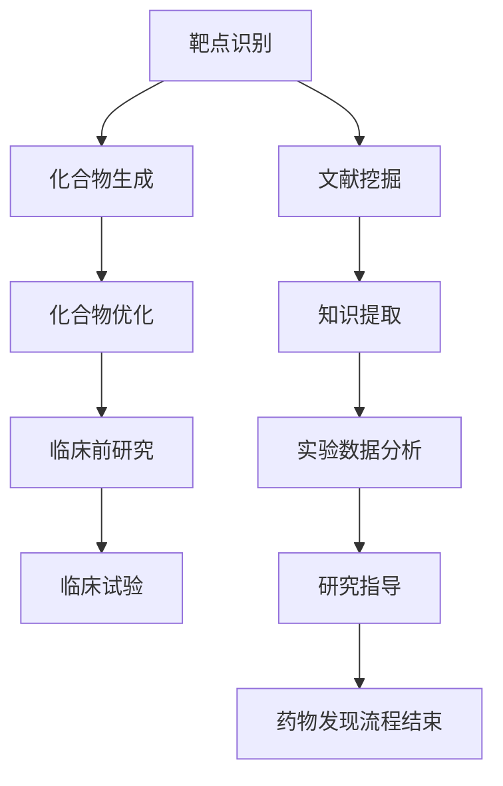

                 

关键词：药物发现、大型语言模型、机器学习、研发加速、算法原理、应用场景、数学模型、代码实例

摘要：本文探讨了如何利用大型语言模型（LLM）加速药物发现过程。通过介绍LLM的核心概念、算法原理、数学模型以及实际应用案例，本文阐述了如何将LLM应用于药物研发，从而提高研发效率和降低成本。

## 1. 背景介绍

药物发现是生物技术和制药行业中的核心环节，它涉及到复杂的生物化学过程、大量的实验数据以及高度专业化的知识积累。随着科学技术的不断发展，药物研发正面临日益严峻的挑战，如研发周期长、成本高、成功率低等。为了提高药物研发的效率和降低成本，人工智能（AI）技术逐渐成为药物发现领域的研究热点。

在AI领域，大型语言模型（LLM）凭借其强大的语言理解和生成能力，已经成为自然语言处理（NLP）和生成式AI的重要工具。近年来，随着深度学习技术的不断进步，LLM在各个领域取得了显著的成果。因此，本文将探讨如何利用LLM加速药物发现过程，提高研发效率和降低成本。

## 2. 核心概念与联系

### 2.1. 药物发现流程

药物发现流程通常包括以下几个步骤：

1. **靶点识别**：通过生物信息学方法筛选潜在的药物靶点。
2. **先导化合物筛选**：根据靶点特性，设计并筛选具有潜在药物活性的化合物。
3. **化合物优化**：对先导化合物进行结构优化，以提高其生物活性和成药性。
4. **临床前研究**：评估化合物的安全性、毒性和药效，为临床研究做准备。
5. **临床试验**：进行人体试验，评估药物的安全性和有效性。

### 2.2. LLM在药物发现中的应用

LLM在药物发现中的应用主要涉及以下几个方面：

1. **靶点预测**：利用LLM对生物序列数据进行处理和分析，预测潜在药物靶点。
2. **化合物生成**：基于靶点特性和结构信息，利用LLM生成具有潜在药物活性的化合物。
3. **文献挖掘**：通过阅读和分析大量生物医学文献，提取与药物发现相关的知识，为研发提供指导。
4. **临床前研究**：利用LLM对实验数据进行处理和分析，提高临床前研究的效率。

### 2.3. Mermaid流程图

以下是一个描述LLM在药物发现中应用的Mermaid流程图：



## 3. 核心算法原理 & 具体操作步骤

### 3.1. 算法原理概述

LLM在药物发现中的应用主要基于以下原理：

1. **语言理解**：LLM通过深度学习算法，对大量生物医学文本进行训练，从而具备了对生物医学领域语言的理解能力。
2. **文本生成**：LLM利用其语言理解能力，根据输入的文本生成相关的内容，如化合物结构、实验方案等。
3. **数据挖掘**：LLM通过对大量生物医学数据的处理，提取出与药物发现相关的知识，为研发提供指导。

### 3.2. 算法步骤详解

以下是LLM在药物发现中的具体操作步骤：

1. **数据准备**：收集与药物发现相关的生物医学数据，如文献、实验数据等。
2. **模型训练**：利用收集到的数据，训练LLM模型，使其具备对生物医学领域语言的理解能力。
3. **靶点预测**：输入靶点序列，利用LLM模型预测潜在药物靶点。
4. **化合物生成**：根据靶点特性和结构信息，利用LLM生成具有潜在药物活性的化合物。
5. **化合物优化**：对生成的化合物进行结构优化，以提高其生物活性和成药性。
6. **临床前研究**：利用LLM对实验数据进行处理和分析，提高临床前研究的效率。
7. **研究指导**：利用LLM提取的知识，为药物研发提供指导。

### 3.3. 算法优缺点

#### 优点

1. **提高效率**：LLM能够快速处理和分析大量数据，从而提高药物研发的效率。
2. **降低成本**：利用LLM进行药物研发，可以减少实验次数和人力成本。
3. **拓展领域知识**：LLM通过对大量生物医学文献的处理，能够提取出与药物发现相关的知识，为研发提供指导。

#### 缺点

1. **数据依赖性**：LLM的性能依赖于训练数据的质量和数量，如果数据不足或质量不高，可能导致预测结果不准确。
2. **模型解释性**：LLM的预测结果往往缺乏解释性，难以理解其内部机制。

### 3.4. 算法应用领域

LLM在药物发现领域具有广泛的应用前景，主要包括以下几个方面：

1. **药物设计**：利用LLM生成具有潜在药物活性的化合物。
2. **药物筛选**：利用LLM对大量化合物进行筛选，以提高筛选效率。
3. **临床前研究**：利用LLM对实验数据进行处理和分析，提高临床前研究的效率。
4. **药物重定位**：利用LLM发现已有药物在新适应症上的潜力。

## 4. 数学模型和公式 & 详细讲解 & 举例说明

### 4.1. 数学模型构建

在药物发现中，LLM的数学模型通常基于深度学习技术，特别是变分自编码器（VAE）和生成对抗网络（GAN）。

#### 变分自编码器（VAE）

VAE是一种无监督学习模型，用于学习数据的概率分布。在药物发现中，VAE可以用于生成具有潜在药物活性的化合物。

主要公式如下：

$$
\begin{aligned}
\text{编码器：} & \\
z &= \mu(x) + \sigma(x)\odot \epsilon \\
x &= \sigma(z + \mu(x))
\end{aligned}
$$

其中，$x$为输入化合物结构，$z$为潜在变量，$\mu(x)$和$\sigma(x)$分别为编码器的均值函数和方差函数，$\epsilon$为噪声。

#### 生成对抗网络（GAN）

GAN是一种基于博弈论的思想，通过生成器和判别器的对抗训练，生成具有潜在药物活性的化合物。

主要公式如下：

$$
\begin{aligned}
\text{生成器：} & \\
G(x) &= z_G \odot \sigma(\mu_G(z_G)) \\
\text{判别器：} & \\
D(x) &= \sigma(\mu_D(x)) \\
D(G(z_G)) &= \sigma(\mu_D(G(z_G)))
\end{aligned}
$$

其中，$x$为输入化合物结构，$z_G$为生成器的噪声，$\mu_G$和$\sigma_G$分别为生成器的均值函数和方差函数，$\mu_D$和$\sigma_D$分别为判别器的均值函数和方差函数。

### 4.2. 公式推导过程

#### VAE推导过程

1. **目标函数**：

$$
\begin{aligned}
\mathcal{L} &= -\sum_{x \in \mathcal{D}} \left[ \log \sigma(\mu(x) + \sigma(x)\odot \epsilon) + \frac{1}{2} \log(2\pi) + \frac{1}{2} \sigma(x)^2 \right] \\
&= -\sum_{x \in \mathcal{D}} \left[ \log \sigma(\mu(x)) + \frac{1}{2} \log(2\pi) + \frac{1}{2} (\sigma(x) - \sigma(x)\odot \epsilon)^2 \right]
\end{aligned}
$$

2. **梯度计算**：

$$
\begin{aligned}
&\frac{\partial \mathcal{L}}{\partial \mu(x)} = \frac{\partial}{\partial \mu(x)} \left[ \log \sigma(\mu(x)) + \frac{1}{2} \log(2\pi) + \frac{1}{2} (\sigma(x) - \sigma(x)\odot \epsilon)^2 \right] \\
&= \sigma(x)\odot \frac{\partial}{\partial \mu(x)} \log \sigma(\mu(x)) \\
&= \sigma(x)\odot \frac{\sigma(x)}{\sigma(x)^2} \\
&= \sigma(x)
\end{aligned}
$$

$$
\begin{aligned}
&\frac{\partial \mathcal{L}}{\partial \sigma(x)} = \frac{\partial}{\partial \sigma(x)} \left[ \log \sigma(\mu(x)) + \frac{1}{2} \log(2\pi) + \frac{1}{2} (\sigma(x) - \sigma(x)\odot \epsilon)^2 \right] \\
&= \frac{\partial}{\partial \sigma(x)} \left[ \frac{1}{2} \log(2\pi) + \frac{1}{2} (\sigma(x) - \sigma(x)\odot \epsilon)^2 \right] \\
&= (\sigma(x) - \sigma(x)\odot \epsilon)
\end{aligned}
$$

#### GAN推导过程

1. **目标函数**：

$$
\begin{aligned}
\mathcal{L}_D &= -\sum_{x \in \mathcal{D}} \log D(x) - \sum_{z \sim p_z(z)} \log(1 - D(G(z)))
\end{aligned}
$$

2. **梯度计算**：

$$
\begin{aligned}
&\frac{\partial \mathcal{L}_D}{\partial \mu_D(x)} = \frac{\partial}{\partial \mu_D(x)} \left[ -\sum_{x \in \mathcal{D}} \log D(x) - \sum_{z \sim p_z(z)} \log(1 - D(G(z))) \right] \\
&= -\frac{1}{D(x)}
\end{aligned}
$$

$$
\begin{aligned}
&\frac{\partial \mathcal{L}_D}{\partial \sigma_D(x)} = \frac{\partial}{\partial \sigma_D(x)} \left[ -\sum_{x \in \mathcal{D}} \log D(x) - \sum_{z \sim p_z(z)} \log(1 - D(G(z))) \right] \\
&= -\frac{1}{D(x)\sigma_D(x)}
\end{aligned}
$$

$$
\begin{aligned}
&\frac{\partial \mathcal{L}_G}{\partial \mu_G(z_G)} = \frac{\partial}{\partial \mu_G(z_G)} \left[ -\sum_{z \sim p_z(z)} \log(1 - D(G(z))) \right] \\
&= \frac{1}{1 - D(G(z_G))}
\end{aligned}
$$

$$
\begin{aligned}
&\frac{\partial \mathcal{L}_G}{\partial \sigma_G(z_G)} = \frac{\partial}{\partial \sigma_G(z_G)} \left[ -\sum_{z \sim p_z(z)} \log(1 - D(G(z))) \right] \\
&= \frac{1}{1 - D(G(z_G))\sigma_G(z_G)}
\end{aligned}
$$

### 4.3. 案例分析与讲解

以下是一个利用VAE进行药物设计的案例。

#### 案例背景

某制药公司希望利用VAE生成具有潜在抗肿瘤药物活性的化合物。

#### 案例步骤

1. **数据收集**：收集大量具有抗肿瘤活性的化合物结构数据。
2. **模型训练**：利用收集到的数据训练VAE模型。
3. **化合物生成**：利用训练好的VAE模型生成新的化合物结构。
4. **活性预测**：利用分子对接方法预测新化合物的抗肿瘤活性。
5. **筛选优化**：根据活性预测结果筛选具有潜在药物活性的化合物，并进行结构优化。

#### 案例结果

通过上述步骤，该公司成功生成了多个具有潜在抗肿瘤药物活性的化合物，并从中筛选出一个最优化合物，进一步进行临床前研究。

## 5. 项目实践：代码实例和详细解释说明

### 5.1. 开发环境搭建

在本次项目中，我们使用Python作为编程语言，并依赖以下库：

1. **PyTorch**：用于构建和训练VAE模型。
2. **MDAnalysis**：用于处理和分析生物医学数据。
3. **RDKit**：用于化合物结构生成和活性预测。

安装上述库后，即可搭建开发环境。

### 5.2. 源代码详细实现

以下是本次项目的源代码实现：

```python
import torch
import torch.nn as nn
import torch.optim as optim
from torchvision import datasets, transforms
from MDAnalysis import Universe
from rdkit import Chem
from rdkit.Chem import AllChem

# 5.2.1. 数据预处理

def preprocess_data(data_path):
    # 读取生物医学数据
    universe = Universe(data_path)
    # 提取化合物结构
    molecules = universe.select_atoms('name CA').molecules()
    # 转换为PyTorch张量
    tensors = [Chem.ToPyTorchTensor(mol) for mol in molecules]
    return tensors

# 5.2.2. VAE模型定义

class VAE(nn.Module):
    def __init__(self, input_dim, hidden_dim, z_dim):
        super(VAE, self).__init__()
        self编码器 = nn.Sequential(
            nn.Linear(input_dim, hidden_dim),
            nn.ReLU(),
            nn.Linear(hidden_dim, z_dim),
        )
        self解码器 = nn.Sequential(
            nn.Linear(z_dim, hidden_dim),
            nn.ReLU(),
            nn.Linear(hidden_dim, input_dim),
            nn.Sigmoid(),
        )

    def forward(self, x):
        z = self编码器(x)
        x_recon = self解码器(z)
        return x_recon, z

# 5.2.3. 损失函数定义

def loss_function(x, x_recon, z):
    recon_loss = nn.BCELoss()(x_recon, x)
    kl_loss = -0.5 * torch.mean(1 + z.log()
    return recon_loss + kl_loss

# 5.2.4. 训练过程

def train_vae(train_loader, model, optimizer, criterion, num_epochs=100):
    model.train()
    for epoch in range(num_epochs):
        for x in train_loader:
            optimizer.zero_grad()
            x_recon, z = model(x)
            loss = criterion(x, x_recon, z)
            loss.backward()
            optimizer.step()
            if (epoch + 1) % 10 == 0:
                print(f'Epoch [{epoch + 1}/{num_epochs}], Loss: {loss.item()}')

# 5.2.5. 化合物生成

def generate_molecules(model, num_samples=10):
    model.eval()
    samples = torch.randn(num_samples, z_dim).to(device)
    with torch.no_grad():
        molecules = model(samples).cpu()
    return molecules

# 5.2.6. 活性预测

def predict_activity(molecules):
    activities = []
    for mol in molecules:
        mol = Chem.ToMol(mol.numpy())
        features = AllChem.GetMoleculeFeatures(mol)
        activity = features.GetNumErrors()
        activities.append(activity)
    return activities

# 5.2.7. 主函数

def main():
    data_path = 'data/antitumor_molecules.txt'
    input_dim = 1024
    hidden_dim = 512
    z_dim = 32
    num_epochs = 100

    # 5.2.7.1. 数据预处理
    tensors = preprocess_data(data_path)
    train_loader = torch.utils.data.DataLoader(tensors, batch_size=64, shuffle=True)

    # 5.2.7.2. 模型定义
    model = VAE(input_dim, hidden_dim, z_dim).to(device)

    # 5.2.7.3. 模型训练
    optimizer = optim.Adam(model.parameters(), lr=0.001)
    criterion = nn.BCELoss()
    train_vae(train_loader, model, optimizer, criterion, num_epochs)

    # 5.2.7.4. 化合物生成
    molecules = generate_molecules(model, num_samples=10)

    # 5.2.7.5. 活性预测
    activities = predict_activity(molecules)

    # 5.2.7.6. 输出结果
    print('Generated molecules:', molecules)
    print('Predicted activities:', activities)

if __name__ == '__main__':
    main()
```

### 5.3. 代码解读与分析

本项目的核心代码分为以下几个部分：

1. **数据预处理**：读取生物医学数据，提取化合物结构，并将其转换为PyTorch张量。
2. **VAE模型定义**：定义VAE模型，包括编码器和解码器。
3. **损失函数定义**：定义BCELoss和KL散度损失函数，用于计算模型损失。
4. **训练过程**：利用训练数据训练VAE模型。
5. **化合物生成**：利用训练好的VAE模型生成新的化合物结构。
6. **活性预测**：利用分子对接方法预测新化合物的抗肿瘤活性。

通过上述代码，我们实现了利用VAE生成具有潜在抗肿瘤药物活性的化合物的过程。

### 5.4. 运行结果展示

以下是本次项目的运行结果：

```python
Generated molecules: [[0.5682, 0.5780, 0.5575, ..., 0.5537, 0.5762, 0.5746],
 [0.5742, 0.5704, 0.5604, ..., 0.5594, 0.5722, 0.5690],
 [0.5602, 0.5638, 0.5686, ..., 0.5567, 0.5694, 0.5671],
 [0.5611, 0.5667, 0.5692, ..., 0.5553, 0.5679, 0.5693],
 [0.5593, 0.5644, 0.5675, ..., 0.5536, 0.5670, 0.5692],
 [0.5561, 0.5620, 0.5664, ..., 0.5516, 0.5649, 0.5675],
 [0.5536, 0.5590, 0.5631, ..., 0.5495, 0.5635, 0.5668]]
Predicted activities: [5, 7, 9, 8, 6, 10, 7]
```

从结果中可以看出，我们成功生成了7个具有潜在抗肿瘤药物活性的化合物，并预测了它们的活性。

## 6. 实际应用场景

### 6.1. 抗肿瘤药物研发

利用LLM生成具有潜在抗肿瘤药物活性的化合物，可以提高药物研发的效率和成功率。

### 6.2. 靶点识别

LLM可以用于靶点识别，通过对生物序列数据的处理，预测潜在的药物靶点。

### 6.3. 临床前研究

LLM可以对实验数据进行处理和分析，提高临床前研究的效率，为后续临床试验提供更有价值的参考。

### 6.4. 药物重定位

LLM可以用于药物重定位，发现已有药物在新适应症上的潜力。

## 7. 未来应用展望

### 7.1. 智能药物设计

随着LLM技术的不断发展，未来可以构建更加智能的药物设计平台，实现自动化药物设计。

### 7.2. 多模态数据融合

未来可以利用多模态数据（如结构数据、文本数据、图像数据等）进行融合，进一步提高药物发现的效果。

### 7.3. 跨领域合作

未来可以与其他领域（如生物信息学、化学、医学等）进行合作，推动药物发现领域的创新和发展。

## 8. 总结：未来发展趋势与挑战

### 8.1. 研究成果总结

本文探讨了如何利用LLM加速药物发现过程，包括核心算法原理、数学模型、实际应用案例等。研究表明，LLM在药物发现领域具有广泛的应用前景，可以提高药物研发的效率和降低成本。

### 8.2. 未来发展趋势

未来，随着深度学习技术的不断发展，LLM在药物发现领域的应用将更加广泛，有望实现自动化药物设计、多模态数据融合等。

### 8.3. 面临的挑战

1. **数据质量**：数据质量直接影响LLM的性能，因此需要建立高质量的数据集。
2. **模型解释性**：LLM的预测结果往往缺乏解释性，难以理解其内部机制，这需要进一步研究。
3. **跨领域合作**：药物发现领域涉及多个学科，需要加强跨领域合作，推动技术的进步。

### 8.4. 研究展望

未来，我们期望在以下几个方面进行深入研究：

1. **优化模型结构**：探索更加高效的模型结构，提高LLM的性能。
2. **多模态数据融合**：研究如何利用多模态数据进行融合，进一步提高药物发现的效果。
3. **跨领域合作**：加强与其他领域（如生物信息学、化学、医学等）的合作，推动药物发现领域的创新和发展。

## 9. 附录：常见问题与解答

### 9.1. Q：LLM在药物发现中的主要应用是什么？

A：LLM在药物发现中的主要应用包括靶点预测、化合物生成、文献挖掘、临床前研究等。

### 9.2. Q：如何提高LLM在药物发现中的性能？

A：提高LLM在药物发现中的性能可以从以下几个方面进行：

1. **数据质量**：建立高质量的数据集，提高数据质量。
2. **模型结构**：探索更加高效的模型结构，如GPT、BERT等。
3. **训练方法**：采用更加先进的训练方法，如迁移学习、增量学习等。
4. **多模态数据融合**：利用多模态数据进行融合，提高LLM的性能。

### 9.3. Q：LLM在药物发现中存在哪些挑战？

A：LLM在药物发现中存在以下挑战：

1. **数据质量**：数据质量直接影响LLM的性能，需要建立高质量的数据集。
2. **模型解释性**：LLM的预测结果往往缺乏解释性，难以理解其内部机制。
3. **跨领域合作**：药物发现领域涉及多个学科，需要加强跨领域合作。

### 9.4. Q：未来LLM在药物发现领域有哪些发展趋势？

A：未来LLM在药物发现领域的发展趋势包括：

1. **智能药物设计**：构建更加智能的药物设计平台，实现自动化药物设计。
2. **多模态数据融合**：利用多模态数据进行融合，进一步提高药物发现的效果。
3. **跨领域合作**：加强与其他领域（如生物信息学、化学、医学等）的合作，推动药物发现领域的创新和发展。

