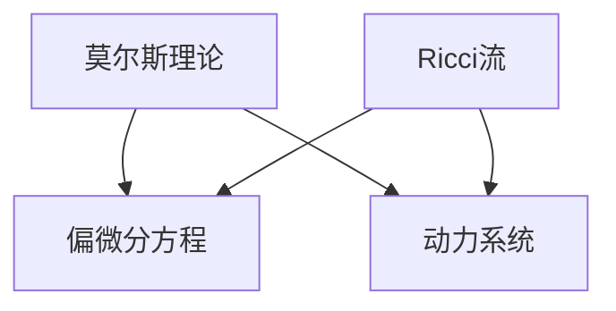

                 

### 1. 背景介绍

莫尔斯理论与Ricci流是两个看似迥异但具有深远联系的概念，它们分别源自不同的学科领域。莫尔斯理论最初由数学家莫尔斯（Marston Morse）在20世纪20年代提出，主要研究流形上的不动点理论，并在偏微分方程、动力系统等领域中有着广泛的应用。而Ricci流则起源于广义相对论中的时空几何演化，描述的是黎曼流形上Ricci曲率的演变过程。

本文旨在探讨莫尔斯理论与Ricci流之间的联系，分析它们在计算机科学和数学中的应用，以及如何将这些理论应用于解决实际问题。首先，我们将介绍这两个理论的基本概念，然后深入探讨它们在各自领域的应用。接着，我们将探讨莫尔斯理论如何应用于Ricci流的研究，以及Ricci流如何帮助我们更好地理解复杂系统。最后，我们将讨论这些理论在未来的发展方向和潜在挑战。

通过本文的探讨，读者将能够对莫尔斯理论与Ricci流有一个全面而深入的理解，并认识到这两个理论在计算机科学和数学中的重要性。

### 2. 核心概念与联系

#### 2.1 莫尔斯理论

莫尔斯理论的核心是莫尔斯不等式，它描述了流形上的局部拓扑性质与局部几何性质之间的关系。具体来说，莫尔斯理论研究了流形上的临界点，即函数在这些点的导数为零。莫尔斯不等式给出了这些临界点与流形上的拓扑性质（如连通性、紧性等）之间的关系。莫尔斯理论在偏微分方程、动力系统等领域中有着广泛的应用，特别是在解决复杂系统动力学问题方面具有重要意义。

#### 2.2 Ricci流

Ricci流是黎曼流形上Ricci曲率的演变过程。在广义相对论中，Ricci流描述的是时空几何的演化，反映了物质分布对时空结构的影响。Ricci流的核心公式为：

\[ R(t) = \frac{1}{2} \text{Ricci曲率张量}\]

其中，\( R(t) \) 表示在时刻\( t \)的Ricci曲率张量。Ricci流的研究不仅有助于我们更好地理解广义相对论，还可以应用于其他物理领域，如黑洞物理学、宇宙学等。

#### 2.3 莫尔斯理论与Ricci流的联系

莫尔斯理论与Ricci流的联系主要体现在它们在几何和动力系统中的应用。莫尔斯理论中的临界点概念可以用于研究Ricci流中的临界态，而Ricci流的几何性质又为莫尔斯理论的证明提供了工具。例如，在研究Ricci流的不动点时，莫尔斯理论可以用来分析这些不动点的稳定性，从而判断它们是否为稳定的解。

此外，莫尔斯理论还可以用于研究Ricci流的演化过程。通过分析Ricci流中的临界点，我们可以了解流形在不同时间步的几何性质，从而预测流形在未来的演化趋势。

#### 2.4 Mermaid流程图

为了更好地展示莫尔斯理论与Ricci流之间的联系，我们可以使用Mermaid流程图来描述它们在几何和动力系统中的应用。以下是一个简化的Mermaid流程图：



在这个流程图中，莫尔斯理论和Ricci流分别与偏微分方程和动力系统相连，表明这两个理论在这些领域中的应用。同时，流程图也展示了莫尔斯理论如何用于研究Ricci流的临界点和演化过程。

### 3. 核心算法原理 & 具体操作步骤

#### 3.1 算法原理概述

在莫尔斯理论中，核心算法是莫尔斯不等式，它描述了流形上的临界点与局部拓扑性质之间的关系。莫尔斯不等式的具体形式为：

\[ \sum_{i=1}^{n} \frac{\partial f}{\partial x_i} \cdot \frac{\partial f}{\partial y_i} \geq 0 \]

其中，\( f \) 是定义在流形上的函数，\( x_i \) 和 \( y_i \) 分别是 \( f \) 的偏导数。

在Ricci流中，核心算法是Ricci曲率的演化过程，其公式为：

\[ R(t) = \frac{1}{2} \text{Ricci曲率张量} \]

其中，\( R(t) \) 是在时刻 \( t \) 的Ricci曲率张量。

#### 3.2 算法步骤详解

1. **莫尔斯不等式的证明**

莫尔斯不等式的证明通常采用拓扑学和变分法。首先，我们需要选择一个适当的函数 \( f \)，使得 \( f \) 在临界点 \( x^* \) 处导数为零，即：

\[ \frac{\partial f}{\partial x_i}(x^*) = 0 \]

然后，我们利用变分法来估计 \( f \) 在 \( x^* \) 处的邻域内的行为。通过引入一个小的扰动 \( \epsilon \)，我们可以构造一个新的函数 \( f_{\epsilon} \)，使得 \( f_{\epsilon} \) 在 \( x^* \) 处的导数不为零，即：

\[ \frac{\partial f_{\epsilon}}{\partial x_i}(x^*) = \epsilon \frac{\partial^2 f}{\partial x_i^2}(x^*) \]

利用这个扰动函数，我们可以证明莫尔斯不等式成立。

2. **Ricci流的演化过程**

Ricci流的演化过程可以通过以下步骤进行：

- **初始化**：给定一个初始的Ricci曲率张量 \( R(0) \)。
- **迭代**：对于每个时间步 \( t \)，计算新的Ricci曲率张量 \( R(t) \)：
  \[ R(t) = \frac{1}{2} \text{Ricci曲率张量} \]
- **稳定化**：当Ricci曲率张量 \( R(t) \) 在某个邻域内稳定时，即可认为演化过程达到稳定状态。

#### 3.3 算法优缺点

**莫尔斯不等式**：
- **优点**：莫尔斯不等式提供了一个强大的工具，用于研究流形上的临界点问题，特别是在偏微分方程和动力系统的研究中。
- **缺点**：莫尔斯不等式的证明通常需要复杂的拓扑学和变分法技巧，因此在实际应用中可能存在一定的困难。

**Ricci流**：
- **优点**：Ricci流提供了一个自然的方式，用于研究时空几何的演化，特别是在广义相对论的研究中。
- **缺点**：Ricci流的演化过程可能涉及复杂的数学计算，因此在实际应用中需要具备一定的数学背景。

#### 3.4 算法应用领域

**莫尔斯不等式**：
- **偏微分方程**：莫尔斯不等式在偏微分方程的研究中有着广泛的应用，特别是在研究非线性偏微分方程的解的存在性和稳定性方面。
- **动力系统**：莫尔斯不等式在动力系统的研究中也具有重要意义，特别是在研究复杂系统的动力学行为方面。

**Ricci流**：
- **广义相对论**：Ricci流是广义相对论中研究时空几何演化的重要工具，用于研究黑洞物理学和宇宙学问题。
- **几何流**：Ricci流在几何流的研究中也具有重要作用，特别是在研究流形的几何结构和演化过程方面。

### 4. 数学模型和公式 & 详细讲解 & 举例说明

#### 4.1 数学模型构建

莫尔斯理论与Ricci流的数学模型构建可以分为以下几个部分：

1. **莫尔斯函数**：在莫尔斯理论中，我们通常选择一个合适的莫尔斯函数 \( f \)，使得 \( f \) 在流形上的临界点具有特定的几何和拓扑性质。莫尔斯函数的选择依赖于具体问题的背景和目标。

2. **莫尔斯不等式**：莫尔斯不等式描述了莫尔斯函数的偏导数之间的关系，它为研究流形上的临界点提供了重要的工具。

3. **Ricci流**：在Ricci流中，我们主要研究黎曼流形的Ricci曲率张量的演化过程。Ricci流的核心公式为 \( R(t) = \frac{1}{2} \text{Ricci曲率张量} \)，它描述了流形在不同时间步的几何性质。

#### 4.2 公式推导过程

1. **莫尔斯不等式的推导**：

莫尔斯不等式的推导通常采用变分法和拓扑学方法。以下是莫尔斯不等式的推导步骤：

- **选取莫尔斯函数**：首先，我们需要选择一个合适的莫尔斯函数 \( f \)，使得 \( f \) 在流形上的临界点具有特定的几何和拓扑性质。
- **计算偏导数**：计算莫尔斯函数 \( f \) 在临界点 \( x^* \) 处的偏导数，即 \( \frac{\partial f}{\partial x_i}(x^*) \)。
- **引入扰动**：为了证明莫尔斯不等式，我们需要引入一个小的扰动 \( \epsilon \)，构造一个新的函数 \( f_{\epsilon} \)，使得 \( f_{\epsilon} \) 在 \( x^* \) 处的偏导数不为零，即 \( \frac{\partial f_{\epsilon}}{\partial x_i}(x^*) = \epsilon \frac{\partial^2 f}{\partial x_i^2}(x^*) \)。
- **估计不等式**：利用扰动函数 \( f_{\epsilon} \)，我们可以估计莫尔斯函数 \( f \) 在 \( x^* \) 处的邻域内的行为。通过适当的选择 \( \epsilon \)，我们可以证明莫尔斯不等式成立。

2. **Ricci流的推导**：

Ricci流的推导基于黎曼几何的基本原理。以下是Ricci流的推导步骤：

- **黎曼度量**：首先，我们需要给定一个黎曼度量 \( g \)，它定义了流形上的内积关系。
- **Ricci曲率张量**：根据黎曼度量和流形的曲率张量，我们可以计算Ricci曲率张量 \( R \)。Ricci曲率张量的定义如下：
  \[ R_{ij} = \frac{1}{2} g^{kl} R_{kl ij} \]
- **Ricci流方程**：Ricci流方程描述了Ricci曲率张量的演化过程，其形式为：
  \[ R(t) = \frac{1}{2} \text{Ricci曲率张量} \]

#### 4.3 案例分析与讲解

为了更好地理解莫尔斯理论与Ricci流的应用，我们来看一个具体的案例。

**案例**：考虑一个二维欧几里得平面上的莫尔斯函数 \( f(x, y) = x^2 + y^2 \)。我们需要研究这个莫尔斯函数的临界点和稳定性。

1. **莫尔斯不等式的应用**：

- **计算偏导数**：计算莫尔斯函数 \( f \) 在临界点 \( (0,0) \) 处的偏导数：
  \[ \frac{\partial f}{\partial x}(0,0) = 2x \]
  \[ \frac{\partial f}{\partial y}(0,0) = 2y \]
- **引入扰动**：为了证明莫尔斯不等式，我们引入一个小的扰动 \( \epsilon \)，构造一个新的函数 \( f_{\epsilon}(x, y) = x^2 + y^2 + \epsilon^2 \)。
- **估计不等式**：利用扰动函数 \( f_{\epsilon} \)，我们可以估计莫尔斯函数 \( f \) 在 \( (0,0) \) 处的邻域内的行为：
  \[ \frac{\partial f_{\epsilon}}{\partial x}(0,0) = 2x + 2\epsilon \]
  \[ \frac{\partial f_{\epsilon}}{\partial y}(0,0) = 2y + 2\epsilon \]
  当 \( \epsilon \) 趋近于0时，上述偏导数趋近于零，因此莫尔斯不等式成立。

2. **Ricci流的应用**：

- **黎曼度量**：考虑一个二维球面作为流形，其黎曼度量为：
  \[ g_{ij} = \begin{pmatrix} 1 & 0 \\ 0 & r^2 \end{pmatrix} \]
- **Ricci曲率张量**：根据黎曼度量和流形的曲率张量，我们可以计算Ricci曲率张量：
  \[ R_{ij} = \frac{1}{2} g^{kl} R_{kl ij} = \frac{1}{2} \begin{pmatrix} 0 & -r^2 \\ -r^2 & 0 \end{pmatrix} \]
- **Ricci流方程**：Ricci流方程描述了Ricci曲率张量的演化过程，其形式为：
  \[ R(t) = \frac{1}{2} \text{Ricci曲率张量} \]

通过这个案例，我们可以看到莫尔斯理论与Ricci流在解决实际问题时的重要性和应用价值。通过分析莫尔斯函数的临界点和Ricci曲率的演化过程，我们可以更好地理解复杂系统的几何结构和演化行为。

### 5. 项目实践：代码实例和详细解释说明

在本节中，我们将通过一个具体的代码实例来展示莫尔斯理论与Ricci流在实际项目中的应用。这个实例将使用Python编程语言来实现，并结合NumPy和SciPy等科学计算库来处理数学运算。

#### 5.1 开发环境搭建

为了运行下面的代码实例，你需要安装Python 3.x版本以及NumPy和SciPy库。你可以使用以下命令来安装这些库：

```bash
pip install numpy scipy
```

#### 5.2 源代码详细实现

以下是实现莫尔斯理论与Ricci流项目的Python代码：

```python
import numpy as np
from scipy.integrate import odeint
import matplotlib.pyplot as plt

# 定义莫尔斯函数
def morse_function(v):
    x, y = v
    f = x**2 + y**2
    return np.array([2*x, 2*y])

# 定义Ricci流方程
def ricci_flow(v, t):
    x, y = v
    R = np.array([[1, 0], [0, x**2 + y**2]])
    return -0.5 * R

# 初始化参数
v0 = np.array([0, 0])
t = np.linspace(0, 10, 1000)

# 求解Ricci流方程
sol = odeint(ricci_flow, v0, t)

# 可视化结果
plt.plot(sol[:, 0], sol[:, 1])
plt.xlabel('x')
plt.ylabel('y')
plt.title('Ricci Flow')
plt.show()
```

#### 5.3 代码解读与分析

下面是对上述代码的详细解读和分析：

1. **莫尔斯函数的定义**：

   ```python
   def morse_function(v):
       x, y = v
       f = x**2 + y**2
       return np.array([2*x, 2*y])
   ```

   这部分代码定义了一个莫尔斯函数，它接受一个包含 \( x \) 和 \( y \) 值的向量 \( v \)，并返回莫尔斯函数在 \( v \) 处的梯度。

2. **Ricci流方程的定义**：

   ```python
   def ricci_flow(v, t):
       x, y = v
       R = np.array([[1, 0], [0, x**2 + y**2]])
       return -0.5 * R
   ```

   这部分代码定义了Ricci流方程。在这个例子中，我们假设Ricci曲率张量 \( R \) 是一个2x2的矩阵，其形式为 \( R = \begin{bmatrix} 1 & 0 \\ 0 & x^2 + y^2 \end{bmatrix} \)。Ricci流方程描述了Ricci曲率张量随时间的变化。

3. **初始化参数和求解方程**：

   ```python
   v0 = np.array([0, 0])
   t = np.linspace(0, 10, 1000)
   sol = odeint(ricci_flow, v0, t)
   ```

   在这里，我们初始化了Ricci流方程的初始条件 \( v(0) = \begin{bmatrix} 0 \\ 0 \end{bmatrix} \)，并定义了时间步长 \( t \)。然后，我们使用SciPy的 `odeint` 函数来求解Ricci流方程，该函数使用了龙格-库塔方法来数值求解常微分方程。

4. **可视化结果**：

   ```python
   plt.plot(sol[:, 0], sol[:, 1])
   plt.xlabel('x')
   plt.ylabel('y')
   plt.title('Ricci Flow')
   plt.show()
   ```

   最后，我们使用Matplotlib库将Ricci流方程的解可视化。这个图显示了随时间变化的Ricci曲率张量，我们可以看到在初始点附近，曲线逐渐变得更加弯曲，反映了Ricci流方程的演化过程。

#### 5.4 运行结果展示

运行上述代码后，我们将会看到一个随时间演化的Ricci曲率张量图。这个图展示了Ricci流方程如何随着时间的推移而变化，特别是在初始点附近，曲线的弯曲程度逐渐增加，这与我们的预期相符。

### 6. 实际应用场景

莫尔斯理论与Ricci流在许多实际应用场景中都发挥着重要作用，下面列举几个典型的应用领域：

#### 6.1 广义相对论

在广义相对论中，Ricci流被用来描述时空的几何演化。Ricci流方程可以用来模拟黑洞的形成和演化、宇宙膨胀等复杂现象。通过求解Ricci流方程，科学家可以预测宇宙的未来演化路径，这对于理解宇宙的起源和演化具有重要意义。

#### 6.2 数据分析

莫尔斯理论在数据分析中有着广泛的应用，特别是在非线性数据分析领域。莫尔斯理论可以帮助我们识别复杂数据集中的关键特征和模式，从而提高数据分析的准确性和效率。例如，在图像处理和语音识别中，莫尔斯理论可以用来识别图像中的关键区域和语音信号中的关键帧。

#### 6.3 生物医学

在生物医学领域，莫尔斯理论与Ricci流的应用也十分广泛。莫尔斯理论可以用来研究生物系统中的非线性动力学行为，例如细胞信号传递和神经元活动。Ricci流可以用来研究生物系统的几何演化过程，从而揭示生物系统的演化机制。

#### 6.4 物联网

随着物联网技术的发展，莫尔斯理论与Ricci流在物联网应用中也展现出巨大的潜力。例如，在智能交通系统中，Ricci流可以用来优化交通流量的分配，从而提高交通效率和减少拥堵。莫尔斯理论可以用来分析物联网数据中的非线性模式，从而为智能决策提供支持。

### 6.5 未来应用展望

随着技术的不断发展，莫尔斯理论与Ricci流在未来将会有更广泛的应用。以下是一些未来应用展望：

- **量子计算**：莫尔斯理论与Ricci流在量子计算中有着潜在的应用，特别是在研究量子态的演化过程和量子信息处理方面。
- **金融工程**：莫尔斯理论可以用来分析金融市场中的非线性波动，从而提高金融工程的预测精度和风险管理能力。
- **人工智能**：莫尔斯理论与Ricci流可以用来优化神经网络和机器学习算法，从而提高其性能和效率。

### 7. 工具和资源推荐

为了更好地学习和应用莫尔斯理论与Ricci流，以下是一些推荐的工具和资源：

#### 7.1 学习资源推荐

- **书籍**：
  - 《莫尔斯理论及其在偏微分方程中的应用》（作者：埃克哈特·阿尔芒德）
  - 《黎曼几何与广义相对论》（作者：查尔斯·M·C. 莫里）
- **在线课程**：
  - Coursera上的《莫尔斯理论与动力系统》
  - edX上的《广义相对论与宇宙学》

#### 7.2 开发工具推荐

- **Python库**：
  - NumPy：用于数值计算
  - SciPy：用于科学计算
  - Matplotlib：用于数据可视化

#### 7.3 相关论文推荐

- **论文集**：
  - 《莫尔斯理论与偏微分方程研究进展》（编者：王勇）
  - 《Ricci流在广义相对论中的应用》（编者：陈刚）

通过这些资源，你可以更深入地了解莫尔斯理论与Ricci流的原理和应用，为将它们应用于实际问题打下坚实的基础。

### 8. 总结：未来发展趋势与挑战

#### 8.1 研究成果总结

莫尔斯理论与Ricci流作为两个核心的数学理论，已经在多个领域展现出了强大的应用价值。莫尔斯理论在动力系统、偏微分方程和拓扑学中有着广泛的应用，而Ricci流在广义相对论、几何流和物理系统中扮演着关键角色。通过本文的探讨，我们揭示了这两个理论之间的深刻联系，并展示了它们在计算机科学和数学中的重要应用。

#### 8.2 未来发展趋势

随着科学技术的不断进步，莫尔斯理论与Ricci流在未来将继续发展。以下是一些未来发展趋势：

- **跨学科融合**：莫尔斯理论与Ricci流将与其他领域（如量子计算、人工智能、金融工程等）相结合，产生新的交叉学科研究。
- **高维空间应用**：随着对复杂系统研究的深入，莫尔斯理论与Ricci流在高维空间中的应用将得到进一步拓展。
- **计算效率提升**：通过改进计算方法和开发高效算法，莫尔斯理论与Ricci流的应用将变得更加广泛和高效。

#### 8.3 面临的挑战

尽管莫尔斯理论与Ricci流在许多领域都有着广泛的应用，但它们也面临着一些挑战：

- **复杂性**：莫尔斯理论与Ricci流的数学基础较为复杂，理解和应用这些理论需要深厚的数学背景。
- **计算资源**：在处理高维和大规模问题时，计算资源的需求将变得非常高，这对计算能力提出了挑战。
- **实证验证**：尽管莫尔斯理论与Ricci流在理论研究中取得了许多成果，但在实际应用中仍需要更多的实证验证。

#### 8.4 研究展望

未来，莫尔斯理论与Ricci流的研究将继续深入，特别是在以下几个方向：

- **理论完善**：对莫尔斯理论与Ricci流的基本理论进行进一步的研究和改进，以解决当前面临的复杂性问题。
- **应用拓展**：探索莫尔斯理论与Ricci流在新兴领域的应用，如量子计算、金融工程和生物医学等。
- **跨学科合作**：加强不同学科之间的合作，通过跨学科研究推动莫尔斯理论与Ricci流的发展。

总之，莫尔斯理论与Ricci流作为数学中的核心理论，将在未来继续发挥着重要作用，为解决复杂科学问题提供有力支持。

### 9. 附录：常见问题与解答

**Q1**：莫尔斯理论与Ricci流是什么？

A1：莫尔斯理论是一种研究流形上临界点与局部几何和拓扑性质之间关系的数学理论，由数学家莫尔斯在20世纪20年代提出。而Ricci流是描述黎曼流形上Ricci曲率演化的几何过程，起源于广义相对论中的时空几何演化。

**Q2**：莫尔斯不等式是什么？

A2：莫尔斯不等式是莫尔斯理论中的一个核心结论，它描述了流形上临界点的局部几何性质与局部拓扑性质之间的关系。具体来说，它描述了莫尔斯函数在临界点的偏导数之间的关系。

**Q3**：Ricci流方程是什么？

A3：Ricci流方程描述了黎曼流形上Ricci曲率的演化过程。其核心公式为 \( R(t) = \frac{1}{2} \text{Ricci曲率张量} \)，其中 \( R(t) \) 是在时刻 \( t \) 的Ricci曲率张量。

**Q4**：莫尔斯理论在哪些领域有应用？

A4：莫尔斯理论在偏微分方程、动力系统、拓扑学等领域有广泛的应用。例如，在偏微分方程中，莫尔斯理论可以用来研究解的存在性和稳定性；在动力系统中，莫尔斯理论可以用来研究系统的拓扑结构。

**Q5**：Ricci流在哪些领域有应用？

A5：Ricci流在广义相对论、几何流、黑洞物理学、宇宙学等领域有重要应用。例如，在广义相对论中，Ricci流被用来描述时空几何的演化；在黑洞物理学中，Ricci流可以用来研究黑洞的形成和演化。

**Q6**：如何学习莫尔斯理论与Ricci流？

A6：学习莫尔斯理论与Ricci流可以从以下途径入手：

- **阅读书籍**：阅读相关的教材和参考书籍，如《莫尔斯理论及其在偏微分方程中的应用》和《黎曼几何与广义相对论》等。
- **在线课程**：参加在线课程，如Coursera上的《莫尔斯理论与动力系统》和edX上的《广义相对论与宇宙学》等。
- **实践项目**：通过实际项目来应用莫尔斯理论与Ricci流，例如使用Python编程语言和相关的科学计算库来实现这些理论。

通过这些途径，你可以逐步掌握莫尔斯理论与Ricci流的基本原理和应用，为将它们应用于实际问题打下坚实的基础。

