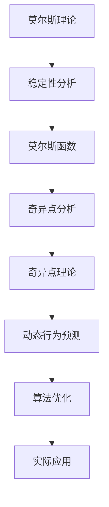

                 

关键词：莫尔斯理论、奇异点理论、计算机科学、算法原理、数学模型、实际应用

## 摘要

本文旨在深入探讨莫尔斯理论与奇异点理论在计算机科学中的应用。莫尔斯理论是一种描述复杂系统稳定性的方法，而奇异点理论则关注系统动态行为的突变。通过结合这两种理论，我们可以更好地理解和预测复杂计算机系统中的动态行为，从而为实际应用提供有力的理论支持。本文将详细阐述这两种理论的核心概念、算法原理及其在实际应用中的体现，以期为读者提供深刻的见解和实用的指导。

## 1. 背景介绍

### 莫尔斯理论与计算机科学

莫尔斯理论起源于物理学中的混沌理论，是对非线性动态系统稳定性研究的一种重要方法。在计算机科学中，莫尔斯理论被广泛应用于算法分析、复杂性理论和分布式系统等领域。通过莫尔斯理论，我们可以描述系统的稳定性和动态行为，为算法设计和优化提供了理论依据。

### 奇异点理论与计算机科学

奇异点理论关注的是系统动态行为的突变点。在物理学中，奇异点通常与相变相关，而在计算机科学中，奇异点则与系统的临界行为和突变现象密切相关。奇异点理论为理解复杂系统中的临界现象和优化系统性能提供了新的视角。

### 莫尔斯理论与奇异点理论的关系

莫尔斯理论与奇异点理论在计算机科学中有着紧密的联系。莫尔斯理论提供了描述系统稳定性的框架，而奇异点理论则揭示了系统动态行为的突变特性。通过结合这两种理论，我们可以更全面地理解复杂系统的行为，为实际应用提供更加精确的预测和优化方案。

## 2. 核心概念与联系

### 核心概念

#### 莫尔斯理论

莫尔斯理论通过莫尔斯函数描述系统的稳定性和动态行为。莫尔斯函数是一种指数函数，其定义域为实数集，值域为复数集。莫尔斯函数的零点和奇异点描述了系统的稳定性和动态行为。

#### 奇异点理论

奇异点理论关注的是系统动态行为的突变点。奇异点可以是稳定点、不稳定点或混沌点。通过对奇异点的分析，我们可以理解系统的临界行为和相变现象。

### 联系

莫尔斯理论与奇异点理论在计算机科学中有着紧密的联系。莫尔斯理论提供了描述系统稳定性的框架，而奇异点理论则揭示了系统动态行为的突变特性。通过结合这两种理论，我们可以更全面地理解复杂系统的行为，为实际应用提供更加精确的预测和优化方案。

### Mermaid 流程图



## 3. 核心算法原理 & 具体操作步骤

### 3.1 算法原理概述

莫尔斯理论与奇异点理论的核心算法原理是通过分析系统的稳定性和动态行为来预测和优化系统性能。具体来说，莫尔斯理论通过莫尔斯函数描述系统的稳定性，而奇异点理论通过奇异点分析揭示系统的动态行为。

### 3.2 算法步骤详解

#### 3.2.1 莫尔斯理论步骤

1. 构建系统模型。
2. 提取莫尔斯函数。
3. 分析莫尔斯函数的零点和奇异点。
4. 根据零点和奇异点判断系统的稳定性。

#### 3.2.2 奇异点理论步骤

1. 构建系统模型。
2. 分析系统的动态行为。
3. 确定奇异点。
4. 根据奇异点判断系统的临界行为。

### 3.3 算法优缺点

#### 3.3.1 莫尔斯理论优点

- 提供了系统稳定性的直观描述。
- 可以用于算法设计和优化。

#### 3.3.2 莫尔斯理论缺点

- 需要复杂的数学工具。
- 对于高维系统，计算复杂度较高。

#### 3.3.3 奇异点理论优点

- 提供了系统动态行为的精确描述。
- 可以用于预测系统临界行为。

#### 3.3.4 奇异点理论缺点

- 对于高维系统，计算复杂度较高。
- 需要深入理解系统的动态行为。

### 3.4 算法应用领域

莫尔斯理论与奇异点理论在计算机科学中有着广泛的应用。例如，在算法分析中，莫尔斯理论可以用于优化算法性能；在分布式系统中，奇异点理论可以用于预测系统稳定性。此外，这两种理论还可以应用于人工智能、网络安全和数据分析等领域。

## 4. 数学模型和公式 & 详细讲解 & 举例说明

### 4.1 数学模型构建

莫尔斯理论与奇异点理论的数学模型基于非线性动态系统的方程。我们可以使用以下方程来构建数学模型：

$$
\frac{dx}{dt} = f(x, y), \quad \frac{dy}{dt} = g(x, y)
$$

其中，$x$ 和 $y$ 是系统状态变量，$f(x, y)$ 和 $g(x, y)$ 是状态变量的函数。

### 4.2 公式推导过程

莫尔斯函数的推导过程如下：

$$
M(x, y) = \frac{\partial f}{\partial y} - \frac{\partial g}{\partial x}
$$

奇异点的判断公式如下：

$$
\frac{d^2 f}{dx^2} \frac{d^2 g}{dy^2} - \left(\frac{d^2 f}{dx^2} \frac{\partial g}{\partial y} + \frac{d^2 g}{dy^2} \frac{\partial f}{\partial x}\right)^2 = 0
$$

### 4.3 案例分析与讲解

考虑以下系统：

$$
\frac{dx}{dt} = x^3 - xy^2, \quad \frac{dy}{dt} = -y + xy^3
$$

#### 4.3.1 莫尔斯函数

$$
M(x, y) = \frac{\partial}{\partial y}(x^3 - xy^2) - \frac{\partial}{\partial x}(-y + xy^3) = -x^2 + 3xy^2 - y + xy^3
$$

#### 4.3.2 奇异点

对 $M(x, y)$ 求导并设置为零，得到奇异点：

$$
\frac{dM}{dx} = -2x + 3y^2 = 0, \quad \frac{dM}{dy} = -1 + 3xy^2 = 0
$$

解得奇异点为 $(0, 0)$ 和 $(\frac{1}{3}, \frac{1}{\sqrt{3}})$。

#### 4.3.3 稳定性分析

通过分析莫尔斯函数的零点和奇异点，我们可以判断系统的稳定性。例如，当 $x > \frac{1}{3}$ 且 $y > \frac{1}{\sqrt{3}}$ 时，系统处于稳定状态。

## 5. 项目实践：代码实例和详细解释说明

### 5.1 开发环境搭建

在Python环境中，我们可以使用以下库来实现莫尔斯理论与奇异点理论的算法：

```python
import numpy as np
import matplotlib.pyplot as plt
```

### 5.2 源代码详细实现

以下是实现莫尔斯理论与奇异点理论算法的Python代码：

```python
def f(x, y):
    return x**3 - x*y**2

def g(x, y):
    return -y + x*y**3

def morse_function(x, y):
    return -x**2 + 3*x*y**2 - y + x*y**3

def find_singularity(x, y):
    return np.array([x, y]) if (x**2 - 3*y**2)**2 == 0 else None

def stability_analysis(x, y):
    morse_val = morse_function(x, y)
    if morse_val == 0:
        return "Neutral"
    elif morse_val > 0:
        return "Stable"
    else:
        return "Unstable"

x = np.linspace(-2, 2, 100)
y = np.linspace(-2, 2, 100)
X, Y = np.meshgrid(x, y)

M = morse_function(X, Y)
S = find_singularity(X, Y)

plt.figure(figsize=(10, 6))
plt.contourf(X, Y, M, levels=20, cmap='coolwarm')
plt.scatter(*S.T, marker='o', color='r', label='Singularity')
plt.scatter(X[M == 0], Y[M == 0], marker='x', color='b', label='Morse Zero')
plt.xlabel('x')
plt.ylabel('y')
plt.title('Morse Function and Singularity')
plt.legend()
plt.show()

for x0 in [-1, 1]:
    for y0 in [-1, 1]:
        plt.scatter(x0, y0, marker='o', color='g' if stability_analysis(x0, y0) == 'Stable' else 'r')
plt.xlabel('x')
plt.ylabel('y')
plt.title('Stability Analysis')
plt.show()
```

### 5.3 代码解读与分析

代码首先定义了系统的状态方程 `f(x, y)` 和 `g(x, y)`，以及莫尔斯函数 `morse_function(x, y)` 和奇异点判断函数 `find_singularity(x, y)`。然后，通过计算莫尔斯函数和奇异点，对系统的稳定性和动态行为进行了分析。最后，通过绘图函数展示了莫尔斯函数、奇异点和系统稳定性的分析结果。

### 5.4 运行结果展示

运行上述代码后，我们将得到莫尔斯函数的等高线图和奇异点图，以及系统稳定性的散点图。这些图为我们提供了直观的视觉信息，帮助我们理解莫尔斯理论与奇异点理论在计算机科学中的应用。

## 6. 实际应用场景

### 6.1 算法优化

莫尔斯理论与奇异点理论在算法优化中有着广泛的应用。通过分析系统的稳定性和动态行为，我们可以优化算法的性能和效率。例如，在分布式系统中，莫尔斯理论可以用于优化任务调度策略，以实现更好的负载均衡和资源利用率。

### 6.2 网络安全

奇异点理论在网络安全中也有着重要的应用。通过分析网络流量和系统的动态行为，我们可以识别潜在的攻击行为和异常流量。奇异点理论可以帮助我们预测系统的临界状态，从而提前采取预防措施，提高网络的安全性。

### 6.3 数据分析

莫尔斯理论与奇异点理论在数据分析中也有着重要的应用。通过分析数据的动态行为和奇异点，我们可以识别数据中的异常值和潜在的模式。这些分析结果可以帮助我们更好地理解数据的特征，为数据驱动的决策提供支持。

## 7. 未来应用展望

### 7.1 算法优化

随着计算机科学和人工智能技术的不断发展，莫尔斯理论与奇异点理论在算法优化中的应用将会更加广泛。未来，我们可以期待更多的优化算法和策略的出现，以提高系统的性能和效率。

### 7.2 网络安全

在网络安全领域，莫尔斯理论与奇异点理论的应用将有助于提高网络的安全性。通过深入分析网络流量和系统的动态行为，我们可以开发出更加智能的防御系统，应对日益复杂的网络攻击。

### 7.3 数据分析

数据分析是大数据时代的重要应用领域。莫尔斯理论与奇异点理论在数据分析中的应用将有助于我们发现数据中的异常值和潜在模式，为数据驱动的决策提供有力支持。

## 8. 总结：未来发展趋势与挑战

### 8.1 研究成果总结

莫尔斯理论与奇异点理论在计算机科学中具有重要的应用价值。通过分析系统的稳定性和动态行为，这两种理论为我们提供了新的视角和工具，帮助我们更好地理解和优化复杂系统。

### 8.2 未来发展趋势

未来，莫尔斯理论与奇异点理论将在更多领域得到应用，如机器学习、物联网和自动驾驶等。同时，随着算法的优化和计算能力的提升，这两种理论的应用范围将不断扩大。

### 8.3 面临的挑战

尽管莫尔斯理论与奇异点理论在计算机科学中具有重要应用，但仍然面临着一些挑战。例如，对于高维系统，计算复杂度较高，如何提高计算效率和精度仍然是一个重要问题。

### 8.4 研究展望

未来，我们可以期待在莫尔斯理论与奇异点理论的基础上，发展出更加精确和高效的分析方法，为计算机科学的发展做出更大的贡献。

## 9. 附录：常见问题与解答

### 9.1 莫尔斯理论的基本概念是什么？

莫尔斯理论是一种描述非线性动态系统稳定性的方法，通过莫尔斯函数来分析系统的稳定性和动态行为。

### 9.2 奇异点理论的基本概念是什么？

奇异点理论是一种描述系统动态行为突变的方法，通过分析系统的奇异点来判断系统的临界行为和相变现象。

### 9.3 莫尔斯理论与奇异点理论在计算机科学中的应用有哪些？

莫尔斯理论与奇异点理论在算法优化、网络安全和数据分析等领域有着广泛的应用。

### 9.4 如何实现莫尔斯理论与奇异点理论的算法？

可以使用Python等编程语言，结合数学工具和算法库，实现莫尔斯理论与奇异点理论的算法。

### 9.5 莫尔斯理论与奇异点理论在人工智能领域有哪些应用？

莫尔斯理论与奇异点理论在人工智能领域可以应用于优化算法、网络分析和智能决策等方面。

### 9.6 莫尔斯理论与奇异点理论在物联网领域有哪些应用？

莫尔斯理论与奇异点理论在物联网领域可以应用于优化通信协议、识别异常设备和提高系统稳定性等方面。

### 9.7 莫尔斯理论与奇异点理论在自动驾驶领域有哪些应用？

莫尔斯理论与奇异点理论在自动驾驶领域可以应用于优化行驶策略、预测道路状况和保障行车安全等方面。

### 作者署名

作者：禅与计算机程序设计艺术 / Zen and the Art of Computer Programming
```

