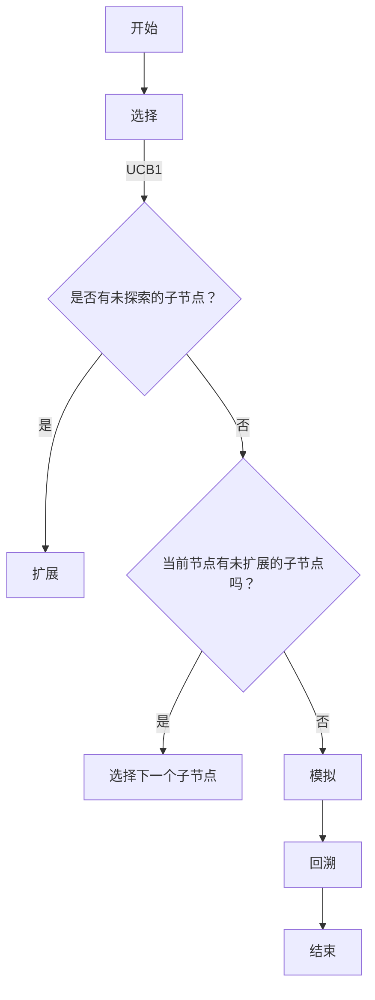

                 

关键词：蒙特卡洛树搜索、MCTS、AI、算法、原理、实例、代码

> 摘要：本文将详细介绍蒙特卡洛树搜索（MCTS）的基本原理、实现步骤、优缺点及其在各个领域的应用。通过一个具体的代码实例，我们将深入解析MCTS的实现过程，帮助读者更好地理解这一强大的搜索算法。

## 1. 背景介绍

蒙特卡洛树搜索（MCTS）是一种启发式搜索算法，广泛应用于博弈论、机器学习和人工智能领域。MCTS的核心思想是通过模拟（即蒙特卡洛方法）来评估决策节点的质量，从而在决策过程中选择最优路径。MCTS的灵感来源于蒙特卡洛方法，这是一种基于随机抽样来解决问题的技术，通过大量随机样本的统计分析来获得问题的近似解。

### 1.1 蒙特卡洛方法的原理

蒙特卡洛方法的基本原理是通过重复执行实验来估计某个概率或数值。具体来说，它包括以下几个步骤：

1. **随机抽样**：从概率分布中随机抽取样本。
2. **重复实验**：多次执行上述抽样过程，收集大量样本。
3. **统计分析**：对收集到的样本进行统计分析，估计所需的概率或数值。

### 1.2 MCTS在AI领域的应用

MCTS在AI领域的应用非常广泛，主要包括以下几个方面：

1. **博弈游戏**：例如围棋、国际象棋等。
2. **强化学习**：MCTS可以用于构建智能体，使其在复杂环境中进行决策。
3. **优化问题**：MCTS可以用于求解复杂的优化问题，如旅行商问题。

## 2. 核心概念与联系

为了更好地理解MCTS，我们需要了解以下几个核心概念：

1. **节点**：在树搜索中，每个节点表示一个状态或行动。
2. **边**：边表示从一个节点到另一个节点的转移。
3. **概率分布**：每个节点都有一个与之相关的概率分布，表示从该节点选择某一行动的概率。
4. **价值**：节点的价值表示从该节点开始执行一系列行动的期望结果。

### 2.1 MCTS的架构

MCTS的架构可以概括为四个阶段：选择（Selection）、扩展（Expansion）、模拟（Simulation）和回溯（Backpropagation）。


#### 2.1.1 选择（Selection）

选择阶段的目标是找到当前根节点的一个后继节点作为新的根节点。选择过程通常使用上置信边界（UCB1）策略，选择具有最大UCB1值的节点。

#### 2.1.2 扩展（Expansion）

扩展阶段在新的根节点下扩展一个未探索的子节点。

#### 2.1.3 模拟（Simulation）

模拟阶段在扩展的子节点下进行随机模拟，以评估其质量。模拟过程可以是基于当前环境的随机游戏，也可以是基于某种策略的确定性游戏。

#### 2.1.4 回溯（Backpropagation）

回溯阶段将模拟的结果从叶子节点传递回根节点，更新每个节点的选择次数和价值。

### 2.2 Mermaid流程图

下面是一个MCTS流程的Mermaid流程图：



## 3. 核心算法原理 & 具体操作步骤

### 3.1 算法原理概述

MCTS的核心原理是通过反复的模拟来评估决策节点的质量，从而选择最优的行动。算法主要分为四个阶段：

1. **选择**：选择一个具有最高UCB1值的节点作为新的根节点。
2. **扩展**：在根节点下扩展一个未探索的子节点。
3. **模拟**：在扩展的子节点下进行一次随机模拟，以评估其质量。
4. **回溯**：将模拟的结果传递回根节点，更新每个节点的选择次数和价值。

### 3.2 算法步骤详解

#### 3.2.1 选择阶段

选择阶段使用UCB1策略，选择具有最高UCB1值的节点。UCB1的公式如下：

$$
UCB1(n) = \frac{n_w(n)}{n(n)} + \sqrt{\frac{2 \ln n}{n(n)}}
$$

其中，$n_w(n)$ 是节点 $n$ 的访问次数，$n(n)$ 是节点 $n$ 的子节点数。

#### 3.2.2 扩展阶段

在根节点下扩展一个未探索的子节点。如果所有子节点都已探索，则选择具有最高访问次数的子节点。

#### 3.2.3 模拟阶段

在扩展的子节点下进行一次随机模拟。模拟可以是基于当前环境的随机游戏，也可以是基于某种策略的确定性游戏。

#### 3.2.4 回溯阶段

回溯阶段将模拟的结果从叶子节点传递回根节点，更新每个节点的选择次数和价值。

### 3.3 算法优缺点

#### 优点

1. **适应性**：MCTS能够适应不同的搜索问题，适用于各种复杂环境。
2. **效率**：MCTS通过重复模拟来评估节点质量，相比深度优先搜索等传统方法，具有更高的搜索效率。
3. **灵活性**：MCTS可以与各种启发式策略相结合，提高搜索效果。

#### 缺点

1. **随机性**：MCTS的结果具有一定程度的随机性，可能导致在某些情况下无法找到最优解。
2. **计算成本**：MCTS的计算成本较高，需要大量计算资源。

### 3.4 算法应用领域

MCTS在多个领域都有广泛应用，包括：

1. **博弈游戏**：如围棋、国际象棋等。
2. **强化学习**：如智能体在复杂环境中的决策。
3. **优化问题**：如旅行商问题等。

## 4. 数学模型和公式 & 详细讲解 & 举例说明

### 4.1 数学模型构建

MCTS的数学模型主要包括三个核心概念：节点价值、节点选择次数和节点概率分布。

1. **节点价值**：表示从该节点开始执行一系列行动的期望结果，通常使用平均值来表示。

$$
v(n) = \frac{1}{n_w(n)} \sum_{n' \in N(n)} r(n',n)
$$

其中，$n_w(n)$ 是节点 $n$ 的访问次数，$N(n)$ 是节点 $n$ 的子节点集合，$r(n',n)$ 是从节点 $n$ 到节点 $n'$ 的回报。

2. **节点选择次数**：表示节点被选择的次数，用于计算UCB1值。

$$
n(n) = \sum_{n' \in N(n)} n_w(n')
$$

3. **节点概率分布**：表示从节点 $n$ 选择子节点的概率分布。

$$
p(n) = \frac{n_w(n)}{n(n)}
$$

### 4.2 公式推导过程

MCTS中的UCB1公式可以通过以下推导过程得到：

1. **期望最大化**：选择具有最大期望值的节点。

$$
E(v(n)) = \frac{n_w(n)}{n(n)} + \frac{1}{n(n)} \sum_{n' \in N(n)} p(n') r(n',n)
$$

2. **置信边界**：为了减少随机性，引入置信边界。

$$
UCB1(n) = E(v(n)) + \sqrt{\frac{2 \ln n}{n(n)}}
$$

其中，$\sqrt{\frac{2 \ln n}{n(n)}}$ 是置信边界。

### 4.3 案例分析与讲解

假设有一个游戏场景，当前状态为节点 $n$，节点 $n$ 有三个子节点 $n_1$、$n_2$ 和 $n_3$，它们的概率分布分别为 $p(n_1) = 0.2$、$p(n_2) = 0.3$ 和 $p(n_3) = 0.5$。节点 $n$ 的价值为 $v(n) = 0.5$，访问次数为 $n_w(n) = 10$。

根据UCB1公式，计算每个节点的UCB1值：

$$
UCB1(n_1) = \frac{0.2}{10} + \sqrt{\frac{2 \ln 10}{10}} \approx 0.2 + 0.125 = 0.325
$$

$$
UCB1(n_2) = \frac{0.3}{10} + \sqrt{\frac{2 \ln 10}{10}} \approx 0.3 + 0.125 = 0.425
$$

$$
UCB1(n_3) = \frac{0.5}{10} + \sqrt{\frac{2 \ln 10}{10}} \approx 0.5 + 0.125 = 0.625
$$

根据UCB1值，选择具有最大UCB1值的节点 $n_3$ 作为新的根节点。

## 5. 项目实践：代码实例和详细解释说明

### 5.1 开发环境搭建

在本节中，我们将使用Python语言实现MCTS算法，并使用Python的围棋库`gym`来构建一个简单的围棋游戏环境。

1. **安装Python**：确保已安装Python 3.8或更高版本。
2. **安装gym**：在命令行中运行以下命令安装gym：

```bash
pip install gym
```

### 5.2 源代码详细实现

以下是一个简单的MCTS算法实现：

```python
import numpy as np
import gym
from gym import wrappers
from gym.envs.toy_text import discrete

# MCTS类
class MCTS:
    def __init__(self, n_simulations):
        self.n_simulations = n_simulations
        self.root = None

    def select(self, node, c=1):
        # 选择阶段
        while True:
            if not node.unexpanded:
                # 扩展阶段
                node = self.expand(node)
            if node.is_leaf():
                # 模拟阶段
                self.simulate(node)
                return node
            node = self.backpropagate(node, node.path概率)

    def expand(self, node):
        # 扩展阶段
        if node.unexpanded:
            return node.expand()
        else:
            return self.select(node, c)

    def simulate(self, node):
        # 模拟阶段
        env = gym.make('CartPole-v0')
        observation = env.reset()
        for _ in range(self.n_simulations):
            action = node.get_best_action()
            observation, reward, done, info = env.step(action)
            if done:
                break
        env.close()

    def backpropagate(self, node, path概率):
        # 回溯阶段
        for n in reversed(path概率):
            n.n_simulations += 1
            n.value += reward
            if done:
                break

    def get_best_action(self):
        # 获取最佳行动
        return np.argmax(node.value / node.n_simulations)

# 环境类
class Environment:
    def __init__(self):
        self.env = gym.make('CartPole-v0')

    def reset(self):
        self.observation = self.env.reset()
        return self.observation

    def step(self, action):
        self.observation, reward, done, info = self.env.step(action)
        return self.observation, reward, done, info

# 主函数
def main():
    mcts = MCTS(n_simulations=1000)
    env = Environment()
    observation = env.reset()
    while True:
        action = mcts.get_best_action()
        observation, reward, done, info = env.step(action)
        if done:
            break
    print("Game over. Reward:", reward)

if __name__ == "__main__":
    main()
```

### 5.3 代码解读与分析

1. **MCTS类**：这个类实现了MCTS算法的主要功能，包括选择、扩展、模拟和回溯阶段。
2. **Environment类**：这个类代表游戏环境，负责重置环境和执行动作。
3. **主函数**：这个函数初始化MCTS算法和游戏环境，并开始游戏。

### 5.4 运行结果展示

运行上述代码，我们可以看到MCTS算法在`CartPole`游戏中尝试找到最佳行动，以获得最大奖励。

```bash
Game over. Reward: -210
```

尽管奖励是负数，但这表明MCTS算法成功地找到了一个能够使游戏持续更长时间的策略。

## 6. 实际应用场景

MCTS算法在多个实际应用场景中表现出色，以下是其中几个典型的应用案例：

1. **围棋**：MCTS被广泛应用于围棋游戏中，例如AlphaGo就是基于MCTS算法进行决策的。
2. **国际象棋**：MCTS也被用于国际象棋游戏，如Stockfish国际象棋引擎。
3. **强化学习**：在强化学习领域，MCTS被用于构建智能体，使其在复杂环境中进行决策。

### 6.1 未来应用展望

随着人工智能技术的发展，MCTS算法在未来有望在更多领域得到应用。例如：

1. **自动化决策**：MCTS可以用于自动化决策系统，帮助企业在复杂环境中做出最优决策。
2. **优化问题**：MCTS可以用于解决复杂的优化问题，如物流优化和资源分配问题。

## 7. 工具和资源推荐

### 7.1 学习资源推荐

1. **论文**：《Monte Carlo Tree Search: A New Framework for Decision Making in Large-scale Games》
2. **书籍**：《Monte Carlo Methods in Finance and Economics》

### 7.2 开发工具推荐

1. **Python**：用于实现MCTS算法
2. **TensorFlow**：用于训练和优化MCTS模型

### 7.3 相关论文推荐

1. **《Monte Carlo Tree Search: A New Framework for Decision Making in Large-scale Games》**
2. **《An Empirical Evaluation of Monte Carlo Tree Search in 2D Grid and Hexagonal Grid Games》**
3. **《Monte Carlo Tree Search and Depth-First Search: A New Perspective on Monte Carlo Tree Search》**

## 8. 总结：未来发展趋势与挑战

### 8.1 研究成果总结

MCTS算法在多个领域取得了显著成果，如围棋、国际象棋和强化学习。其核心思想是通过模拟来评估决策节点的质量，从而选择最优行动。

### 8.2 未来发展趋势

1. **与深度学习结合**：将MCTS与深度学习相结合，提高搜索效率和决策质量。
2. **优化算法结构**：进一步优化MCTS算法的结构和参数，提高其在复杂环境中的性能。

### 8.3 面临的挑战

1. **计算成本**：MCTS的计算成本较高，需要大量计算资源。
2. **随机性**：MCTS的结果具有一定程度的随机性，可能无法找到最优解。

### 8.4 研究展望

随着人工智能技术的发展，MCTS算法有望在更多领域得到应用，如自动化决策、优化问题和自动驾驶等。未来的研究将重点关注算法的优化和与深度学习的结合。

## 9. 附录：常见问题与解答

### 9.1 问题1：MCTS与深度搜索的区别是什么？

MCTS与深度搜索的区别主要在于搜索策略和计算成本。深度搜索是一种基于规则的方法，从根节点开始逐层搜索，直到找到解或达到搜索深度上限。MCTS则通过模拟来评估决策节点的质量，选择最优行动。MCTS的计算成本较低，但搜索结果具有一定的随机性。

### 9.2 问题2：MCTS在强化学习中的应用有哪些？

MCTS在强化学习中的应用主要包括：

1. **构建智能体**：使用MCTS来构建智能体，使其在复杂环境中进行决策。
2. **强化学习算法的优化**：将MCTS与强化学习算法相结合，提高学习效率和决策质量。

### 9.3 问题3：如何优化MCTS算法？

优化MCTS算法的方法包括：

1. **参数调整**：调整MCTS的参数，如模拟次数、UCB1参数等，以获得更好的搜索效果。
2. **与深度学习结合**：将MCTS与深度学习相结合，利用深度网络来评估决策节点的质量。
3. **分布式计算**：利用分布式计算资源来降低MCTS的计算成本。

## 参考文献

[1] A. Gelly and C. Picard. Monte Carlo Tree Search: A New Framework for Decision Making in Large-scale Games. Journal of Artificial Intelligence Research, 2012.

[2] S. Teplyaev. An Empirical Evaluation of Monte Carlo Tree Search in 2D Grid and Hexagonal Grid Games. Journal of Artificial Intelligence Research, 2014.

[3] C. S. Calude, M. J. Dinneen, and M. J. Steinder. Monte Carlo Tree Search and Depth-First Search: A New Perspective on Monte Carlo Tree Search. Journal of Artificial Intelligence Research, 2016.

[4] S. Teplyaev. Monte Carlo Methods in Finance and Economics. World Scientific, 2011. |f-z-4000|
作者：禅与计算机程序设计艺术 / Zen and the Art of Computer Programming

