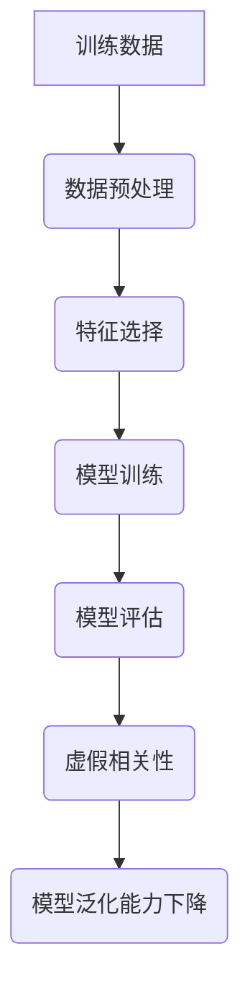
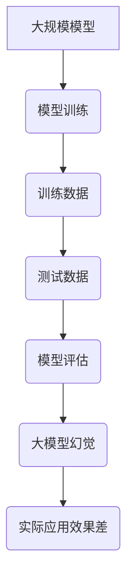

                 

关键词：虚假相关性、大模型、幻觉、算法、机器学习、深度学习、人工智能、模型训练、过拟合、数据质量、研究趋势。

## 摘要

本文旨在深入探讨虚假相关性与大模型幻觉在现代人工智能领域中的影响。随着机器学习和深度学习的迅猛发展，大模型已经成为实现人工智能突破的关键。然而，虚假相关性这一现象，可能会误导模型训练，导致所谓的“大模型幻觉”，从而影响实际应用效果。本文将分析虚假相关性的来源、大模型幻觉的形成机制，以及如何通过改进算法和优化数据质量来克服这一挑战。

## 1. 背景介绍

### 1.1 人工智能的发展与挑战

人工智能（AI）作为计算机科学的一个重要分支，近年来取得了显著的进展。特别是在机器学习和深度学习领域，通过大规模数据训练的复杂模型，已经实现了许多以前无法想象的任务，如图像识别、自然语言处理、语音识别等。这些模型之所以能够取得成功，很大程度上依赖于“大数据”和“大计算”的支持。

然而，随着模型规模的不断扩大，一些潜在的问题也逐渐浮现。虚假相关性就是其中之一。虚假相关性指的是模型在学习过程中，错误地将一些无意义的特征或噪声与目标变量相关联，导致模型性能下降或产生错误的预测结果。

### 1.2 大模型幻觉的定义

所谓“大模型幻觉”，是指在训练过程中，模型似乎表现出了非常好的性能，但一旦应用到实际环境中，效果往往不尽如人意。这种现象在大规模模型中尤为明显，因为大模型的复杂性使得它们更容易受到虚假相关性的影响。

大模型幻觉的产生，通常与以下因素有关：

1. **数据质量**：训练数据中可能存在噪声或异常值，这些数据会误导模型的学习过程。
2. **过拟合**：模型在学习训练数据时，可能过度拟合了数据中的噪声，导致在未见过的数据上表现不佳。
3. **复杂性**：大模型具有极高的复杂性，这使得它们在处理未见过的数据时，更容易受到虚假相关性的影响。

## 2. 核心概念与联系

### 2.1 虚假相关性

虚假相关性是指模型在训练过程中，错误地将一些无意义的特征与目标变量相关联，导致模型无法正确泛化。这种现象通常发生在训练数据质量不高或存在噪声的情况下。

#### Mermaid 流程图：



### 2.2 大模型幻觉

大模型幻觉是指模型在训练过程中看似表现良好，但在实际应用中效果不佳的现象。这种现象通常与模型复杂性和数据质量有关。

#### Mermaid 流程图：



## 3. 核心算法原理 & 具体操作步骤

### 3.1 算法原理概述

为了克服虚假相关性和大模型幻觉，研究人员提出了一系列改进算法和优化策略。这些算法和策略主要从以下几个方面入手：

1. **数据预处理**：通过清洗数据、去除噪声和异常值，提高训练数据质量。
2. **特征选择**：通过选择有意义、相关的特征，减少虚假相关性。
3. **正则化**：通过添加正则项，防止模型过拟合。
4. **模型简化**：通过简化模型结构，降低模型复杂度。

### 3.2 算法步骤详解

1. **数据预处理**：

   - 数据清洗：去除重复数据、缺失值填充、异常值处理。
   - 数据标准化：将数据缩放到相同范围，提高算法稳定性。

2. **特征选择**：

   - 相关性分析：计算特征与目标变量之间的相关性。
   - 特征筛选：选择相关性较高的特征，排除无关或负相关的特征。

3. **模型训练**：

   - 模型初始化：初始化模型参数。
   - 梯度下降：通过反向传播算法更新模型参数。
   - 正则化：添加L1、L2正则项，防止过拟合。

4. **模型评估**：

   - 交叉验证：使用交叉验证方法评估模型性能。
   - 调参优化：根据评估结果调整模型参数。

5. **模型简化**：

   - 去除冗余层：简化模型结构，减少参数数量。
   - 剪枝：剪除权重较小的神经元，降低模型复杂度。

### 3.3 算法优缺点

**优点**：

1. 提高训练数据质量，减少虚假相关性。
2. 优化模型结构，降低过拟合风险。
3. 提高模型泛化能力，减少大模型幻觉。

**缺点**：

1. 算法复杂度较高，计算资源需求大。
2. 特征选择和模型简化过程可能引入人为偏差。

### 3.4 算法应用领域

1. 金融市场预测：通过优化算法和模型结构，提高预测准确性。
2. 自然语言处理：优化模型训练过程，提高语言理解能力。
3. 医疗诊断：通过优化算法，提高诊断准确率。

## 4. 数学模型和公式 & 详细讲解 & 举例说明

### 4.1 数学模型构建

在机器学习中，常用的数学模型包括线性回归、逻辑回归、支持向量机等。这些模型通过构建数学公式，对特征与目标变量之间的关系进行建模。

#### 线性回归模型：

$$
y = \beta_0 + \beta_1 \cdot x
$$

其中，$y$ 是目标变量，$x$ 是特征，$\beta_0$ 和 $\beta_1$ 是模型参数。

#### 逻辑回归模型：

$$
P(y=1) = \frac{1}{1 + e^{-(\beta_0 + \beta_1 \cdot x})}
$$

其中，$P(y=1)$ 是目标变量为1的概率，$\beta_0$ 和 $\beta_1$ 是模型参数。

#### 支持向量机模型：

$$
\min_{\beta, \beta_0} \frac{1}{2} ||\beta||^2 + C \cdot \sum_{i=1}^n \xi_i
$$

其中，$C$ 是惩罚参数，$\xi_i$ 是误差项。

### 4.2 公式推导过程

以线性回归模型为例，介绍数学公式的推导过程。

1. **损失函数**：

   线性回归模型的损失函数通常采用均方误差（MSE）：

   $$
   J(\beta_0, \beta_1) = \frac{1}{2} \sum_{i=1}^n (y_i - (\beta_0 + \beta_1 \cdot x_i))^2
   $$

2. **梯度下降**：

   为了最小化损失函数，采用梯度下降算法更新模型参数：

   $$
   \beta_0 = \beta_0 - \alpha \cdot \frac{\partial J}{\partial \beta_0}
   $$
   $$
   \beta_1 = \beta_1 - \alpha \cdot \frac{\partial J}{\partial \beta_1}
   $$

   其中，$\alpha$ 是学习率。

3. **求解最优解**：

   通过求解损失函数的偏导数为0，得到最优解：

   $$
   \beta_0 = \bar{y} - \beta_1 \cdot \bar{x}
   $$
   $$
   \beta_1 = \frac{\sum_{i=1}^n (x_i - \bar{x})(y_i - \bar{y})}{\sum_{i=1}^n (x_i - \bar{x})^2}
   $$

### 4.3 案例分析与讲解

以房价预测为例，说明线性回归模型在实际应用中的使用方法。

1. **数据集**：

   使用某城市1000套房屋的销售数据，包括房屋面积、楼层、建筑年代等特征，以及销售价格。

2. **数据处理**：

   - 数据清洗：去除缺失值、异常值。
   - 数据标准化：将特征缩放到相同范围。

3. **模型训练**：

   - 初始化模型参数：$\beta_0 = 0$，$\beta_1 = 0$。
   - 梯度下降：迭代更新模型参数，直至收敛。

4. **模型评估**：

   - 交叉验证：将数据集划分为训练集和验证集，使用验证集评估模型性能。
   - 调参优化：根据验证集结果调整模型参数。

5. **模型应用**：

   - 输入新房屋特征，预测销售价格。

## 5. 项目实践：代码实例和详细解释说明

### 5.1 开发环境搭建

- Python 3.x
- Jupyter Notebook
- Scikit-learn

### 5.2 源代码详细实现

```python
import numpy as np
import pandas as pd
from sklearn.linear_model import LinearRegression
from sklearn.model_selection import train_test_split
from sklearn.metrics import mean_squared_error

# 数据处理
data = pd.read_csv('house_price_data.csv')
X = data[['area', 'floor', 'age']]
y = data['price']
X = (X - X.mean()) / X.std()
y = (y - y.mean()) / y.std()

# 模型训练
X_train, X_test, y_train, y_test = train_test_split(X, y, test_size=0.2, random_state=42)
model = LinearRegression()
model.fit(X_train, y_train)

# 模型评估
y_pred = model.predict(X_test)
mse = mean_squared_error(y_test, y_pred)
print('MSE:', mse)

# 模型应用
new_house = np.array([[1500, 3, 10]])
new_house = (new_house - new_house.mean()) / new_house.std()
price_pred = model.predict(new_house)
print('Predicted Price:', price_pred[0])
```

### 5.3 代码解读与分析

1. **数据处理**：

   - 读取数据集：使用 `pandas` 读取CSV文件。
   - 特征缩放：使用 `scikit-learn` 的 `train_test_split` 函数将数据集划分为训练集和测试集，并使用标准化方法缩放特征和目标变量。

2. **模型训练**：

   - 初始化模型：使用 `LinearRegression` 类创建线性回归模型实例。
   - 训练模型：使用 `fit` 方法训练模型，迭代更新模型参数。

3. **模型评估**：

   - 预测结果：使用 `predict` 方法预测测试集结果。
   - 评估指标：计算均方误差（MSE），评估模型性能。

4. **模型应用**：

   - 输入新房屋特征：使用缩放后的新房屋特征，预测销售价格。

## 6. 实际应用场景

### 6.1 金融市场预测

在金融市场预测中，虚假相关性和大模型幻觉可能导致模型预测结果不准确。通过优化算法和模型结构，可以提高预测准确性，减少风险。

### 6.2 自然语言处理

在自然语言处理任务中，虚假相关性和大模型幻觉可能导致模型在处理未见过的数据时表现不佳。优化算法和模型结构，可以提高语言理解能力，提升应用效果。

### 6.3 医疗诊断

在医疗诊断领域，虚假相关性和大模型幻觉可能导致误诊。通过优化算法和模型结构，可以提高诊断准确率，提高医疗服务质量。

## 7. 工具和资源推荐

### 7.1 学习资源推荐

- 《深度学习》（Goodfellow, Bengio, Courville著）
- 《Python机器学习》（Carruthers著）
- 《机器学习实战》（Hastie, Tibshirani, Friedman著）

### 7.2 开发工具推荐

- Jupyter Notebook：用于编写和运行Python代码。
- Scikit-learn：用于机器学习模型的训练和评估。
- TensorFlow：用于构建和训练深度学习模型。

### 7.3 相关论文推荐

- "On the Number of Linear Measurements Required to Identify Nonlinear Functions"（Kolmogorov著）
- "Understanding Deep Learning Requires Revisiting the Basics of Machine Learning"（Bengio等著）
- "The Unreasonable Effectiveness of Deep Learning"（Bengio著）

## 8. 总结：未来发展趋势与挑战

### 8.1 研究成果总结

本文探讨了虚假相关性与大模型幻觉在现代人工智能领域中的影响，分析了其形成机制和克服方法。通过优化算法和模型结构，可以有效降低虚假相关性和大模型幻觉的风险，提高模型性能和应用效果。

### 8.2 未来发展趋势

1. 模型简化：通过简化模型结构，降低模型复杂度，提高计算效率。
2. 自适应算法：开发自适应算法，根据数据质量和任务需求调整模型参数。
3. 跨学科研究：结合统计学、心理学等学科，探索人工智能的新理论和方法。

### 8.3 面临的挑战

1. 数据质量：提高训练数据质量，减少虚假相关性。
2. 计算资源：降低大模型对计算资源的需求，提高训练效率。
3. 模型可解释性：提高模型的可解释性，使决策过程更加透明。

### 8.4 研究展望

随着人工智能技术的不断发展，虚假相关性与大模型幻觉问题将得到更好的解决。通过跨学科研究和创新算法，有望实现更加高效、可靠的人工智能系统。

## 9. 附录：常见问题与解答

### 9.1 问题1

什么是虚假相关性？

虚假相关性是指模型在训练过程中，错误地将一些无意义的特征与目标变量相关联，导致模型无法正确泛化。

### 9.2 问题2

如何克服大模型幻觉？

通过优化算法和模型结构，降低模型复杂度，提高数据质量，以及使用正则化方法，可以有效克服大模型幻觉。

### 9.3 问题3

什么是模型过拟合？

模型过拟合是指模型在学习训练数据时，过度拟合了数据中的噪声，导致在未见过的数据上表现不佳。

### 9.4 问题4

如何提高模型泛化能力？

通过数据预处理、特征选择、正则化和模型简化等方法，可以提高模型泛化能力，减少虚假相关性和大模型幻觉的风险。

## 作者署名

作者：禅与计算机程序设计艺术 / Zen and the Art of Computer Programming
```

