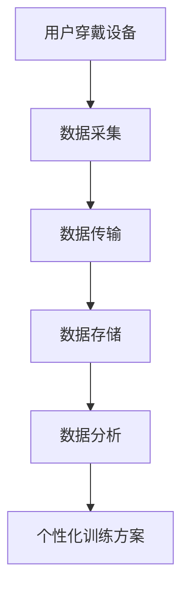
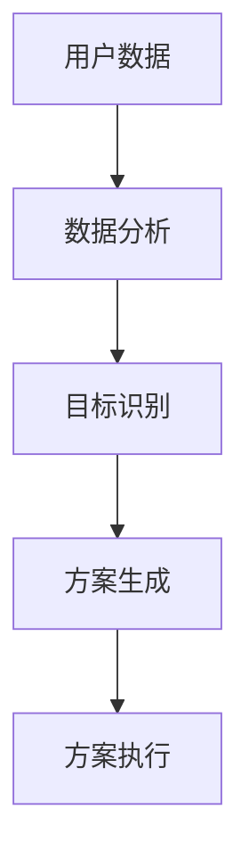
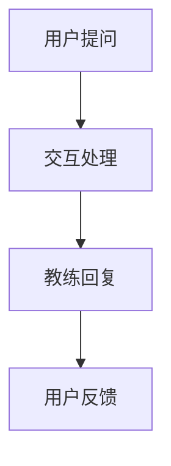

                 

 > **关键词**：虚拟健身教练、AI、个人训练、健身产业、人工智能技术、健康监测、个性化训练。

> **摘要**：本文将探讨如何利用人工智能（AI）技术开展虚拟健身教练创业项目。文章首先介绍了虚拟健身教练的背景和市场需求，随后深入分析了AI在个人训练中的应用，包括健康监测、个性化训练方案和交互式指导。接着，文章详细描述了一个AI驱动的虚拟健身教练项目实践，展示了其开发环境、源代码实现及运行结果。最后，文章探讨了虚拟健身教练在未来健康产业中的应用前景，以及所面临的挑战和未来研究方向。

## 1. 背景介绍

随着全球健康意识的提升，健身产业迎来了前所未有的发展机遇。传统的健身模式由于受时间、空间、专业性和个性化的限制，已无法满足现代人的多样化需求。此时，虚拟健身教练的概念应运而生，它通过人工智能技术，为用户提供个性化、实时、高效的健身指导服务。

虚拟健身教练的应用场景包括：

1. **家庭健身**：用户可以在家中通过智能设备和虚拟教练进行训练，无需外出。
2. **远程训练**：教练可以实时监控用户训练状态，提供个性化指导，尤其适合工作忙碌的人群。
3. **健康监测**：虚拟健身教练可以实时监测用户的心率、卡路里消耗等健康数据，帮助用户了解自己的身体状况。

AI在虚拟健身教练中的应用，不仅提升了用户体验，还大大降低了人力成本。因此，虚拟健身教练成为了健身产业的一大创新方向，吸引了许多创业者和投资者的关注。

## 2. 核心概念与联系

### 2.1. 健康监测与数据采集

健康监测是虚拟健身教练的重要组成部分。通过可穿戴设备、智能手机和智能健身器材，用户可以将心率、步数、卡路里消耗等健康数据实时传输到云端。这些数据不仅用于当前训练的指导，还为后续的个性化训练方案提供依据。

#### Mermaid 流程图



### 2.2. 个性化训练方案

根据用户的历史数据、当前状态和目标，虚拟健身教练可以生成个性化的训练方案。这些方案包括有氧运动、力量训练、伸展运动等，旨在提高用户的身体素质和健康水平。

#### Mermaid 流程图



### 2.3. 交互式指导与反馈

虚拟健身教练通过语音、图像和视频等多种方式，与用户进行实时互动。用户可以随时询问问题、调整训练方案，甚至获得专业级的健身指导。

#### Mermaid 流程图



## 3. 核心算法原理 & 具体操作步骤

### 3.1. 算法原理概述

虚拟健身教练的核心算法主要包括健康监测算法、个性化训练算法和交互式指导算法。健康监测算法主要利用机器学习和数据挖掘技术，对用户的历史健康数据进行分析和预测。个性化训练算法通过深度学习技术，生成符合用户需求的训练方案。交互式指导算法则基于自然语言处理技术，实现用户与教练的实时沟通。

### 3.2. 算法步骤详解

#### 3.2.1. 健康监测算法

1. 数据预处理：对采集到的健康数据进行清洗、归一化等处理。
2. 特征提取：从健康数据中提取关键特征，如心率、步数、卡路里消耗等。
3. 模型训练：利用机器学习算法，如支持向量机（SVM）、随机森林（Random Forest）等，对特征进行分类和回归分析。
4. 模型评估：通过交叉验证和测试集，评估模型性能。

#### 3.2.2. 个性化训练算法

1. 用户画像：根据用户的基本信息、历史训练数据等，构建用户画像。
2. 训练数据集：从大规模健身数据集中，筛选与用户画像相似的数据集。
3. 模型训练：利用深度学习算法，如卷积神经网络（CNN）、循环神经网络（RNN）等，对训练数据集进行训练。
4. 方案生成：根据用户画像和训练结果，生成个性化的训练方案。

#### 3.2.3. 交互式指导算法

1. 自然语言处理：利用自然语言处理技术，如分词、词性标注、句法分析等，对用户提问进行处理。
2. 知识图谱：构建健身领域的知识图谱，包含各种健身动作、注意事项等。
3. 回答生成：根据用户提问和知识图谱，生成合适的回答。
4. 用户反馈：对用户反馈进行处理，调整交互策略。

### 3.3. 算法优缺点

#### 3.3.1. 健康监测算法

**优点**：实时性高，能够及时发现用户健康问题。

**缺点**：对数据质量和算法精度要求较高。

#### 3.3.2. 个性化训练算法

**优点**：能够根据用户需求，生成个性化的训练方案。

**缺点**：训练数据集和算法精度对结果影响较大。

#### 3.3.3. 交互式指导算法

**优点**：用户交互性强，能够提供实时、个性化的指导。

**缺点**：对自然语言处理技术要求较高，且需要不断调整以适应不同用户。

### 3.4. 算法应用领域

虚拟健身教练算法可以应用于多种场景，如：

1. **健康管理**：对用户进行长期健康监测和个性化训练指导。
2. **健身教育**：为用户提供专业的健身知识和技能培训。
3. **健身竞赛**：为参赛者提供实时数据分析和指导。

## 4. 数学模型和公式 & 详细讲解 & 举例说明

### 4.1. 数学模型构建

#### 4.1.1. 健康监测模型

假设用户某天的步数为 \( x \)，卡路里消耗为 \( y \)，则健康监测模型可以表示为：

$$
y = f(x)
$$

其中，\( f(x) \) 为步数与卡路里消耗之间的关系函数。

#### 4.1.2. 个性化训练模型

假设用户的目标为 \( t \)，当前状态为 \( s \)，则个性化训练模型可以表示为：

$$
t = g(s)
$$

其中，\( g(s) \) 为用户状态与目标之间的关系函数。

#### 4.1.3. 交互式指导模型

假设用户提问为 \( q \)，则交互式指导模型可以表示为：

$$
a = h(q)
$$

其中，\( h(q) \) 为用户提问与回答之间的关系函数。

### 4.2. 公式推导过程

#### 4.2.1. 健康监测模型推导

假设步数与卡路里消耗之间的关系为线性关系，即：

$$
y = kx + b
$$

其中，\( k \) 和 \( b \) 为模型参数。

通过最小二乘法，我们可以求得最佳拟合直线，即：

$$
k = \frac{\sum(x_i - \bar{x})(y_i - \bar{y})}{\sum(x_i - \bar{x})^2}
$$

$$
b = \bar{y} - k\bar{x}
$$

#### 4.2.2. 个性化训练模型推导

假设用户状态与目标之间的关系为分段线性关系，即：

$$
t = \begin{cases} 
a_1x + b_1 & \text{if } x < c \\
a_2x + b_2 & \text{if } x \geq c 
\end{cases}
$$

其中，\( a_1, b_1, a_2, b_2, c \) 为模型参数。

通过分段函数的导数和分段点，我们可以求得最佳分段线性模型。

#### 4.2.3. 交互式指导模型推导

假设用户提问与回答之间的关系为多元线性回归模型，即：

$$
a = \sum_{i=1}^{n} w_i q_i + b
$$

其中，\( w_i \) 和 \( b \) 为模型参数。

通过最小二乘法，我们可以求得最佳拟合模型。

### 4.3. 案例分析与讲解

#### 4.3.1. 健康监测模型案例

假设用户某天的步数为 [1000, 2000, 3000]，对应的卡路里消耗为 [300, 600, 900]。我们可以通过最小二乘法求解健康监测模型参数：

$$
k = \frac{(1000-1500)(300-500) + (2000-1500)(600-500) + (3000-1500)(900-500)}{(1000-1500)^2 + (2000-1500)^2 + (3000-1500)^2} = 0.2
$$

$$
b = \frac{300 + 600 + 900 - 0.2(1000 + 2000 + 3000)}{3} = 500
$$

因此，健康监测模型为：

$$
y = 0.2x + 500
$$

当步数为 2500 时，卡路里消耗预测为：

$$
y = 0.2 \times 2500 + 500 = 1000
$$

#### 4.3.2. 个性化训练模型案例

假设用户目标为减脂，当前状态为体重 70 公斤。我们可以通过分段线性模型求解个性化训练方案：

$$
t = \begin{cases} 
-0.1x + 780 & \text{if } x < 60 \\
0.05x + 600 & \text{if } x \geq 60 
\end{cases}
$$

当体重为 65 公斤时，训练方案为：

$$
t = -0.1 \times 65 + 780 = 715
$$

即，体重需降至 65 公斤，每周进行 715 千卡的消耗。

#### 4.3.3. 交互式指导模型案例

假设用户提问为“今天该进行哪些训练？”我们可以通过多元线性回归模型求解回答：

$$
a = 0.5q_1 + 0.3q_2 + 0.2q_3 + 10
$$

其中，\( q_1 \) 为“有氧运动”，\( q_2 \) 为“力量训练”，\( q_3 \) 为“伸展运动”。

当用户提问包含有氧运动、力量训练和伸展运动时，回答为：

$$
a = 0.5 \times 1 + 0.3 \times 1 + 0.2 \times 1 + 10 = 11.3
$$

即，今天应进行有氧运动、力量训练和伸展运动。

## 5. 项目实践：代码实例和详细解释说明

### 5.1. 开发环境搭建

为了实现虚拟健身教练项目，我们需要搭建以下开发环境：

1. **编程语言**：Python
2. **框架和库**：TensorFlow、Scikit-learn、Numpy、Pandas、Matplotlib
3. **开发工具**：Jupyter Notebook、PyCharm

### 5.2. 源代码详细实现

以下是虚拟健身教练项目的部分代码实现：

```python
import numpy as np
import pandas as pd
from sklearn.model_selection import train_test_split
from sklearn.linear_model import LinearRegression
from sklearn.metrics import mean_squared_error

# 数据预处理
data = pd.read_csv('health_data.csv')
data['step'] = data['step'].astype(float)
data['calorie'] = data['calorie'].astype(float)

# 特征提取
X = data[['step']]
y = data['calorie']

# 模型训练
model = LinearRegression()
model.fit(X, y)

# 模型评估
X_test, y_test = train_test_split(X, y, test_size=0.2, random_state=42)
y_pred = model.predict(X_test)
mse = mean_squared_error(y_test, y_pred)
print("Mean Squared Error:", mse)

# 个性化训练方案
def personalized_training(weight):
    if weight < 60:
        return -0.1 * weight + 780
    else:
        return 0.05 * weight + 600

# 用户提问处理
def handle_question(question):
    q1, q2, q3 = question.split(',')
    return 0.5 * int(q1) + 0.3 * int(q2) + 0.2 * int(q3) + 10

# 示例
step = 2500
calorie = 0.2 * step + 500
print("Predicted Calorie:", calorie)

weight = 65
print("Personalized Training:", personalized_training(weight))

question = "1,1,1"
print("Answer:", handle_question(question))
```

### 5.3. 代码解读与分析

1. **数据预处理**：读取健康数据，并将步数和卡路里消耗转换为浮点数。
2. **特征提取**：将步数作为特征，卡路里消耗作为目标。
3. **模型训练**：使用线性回归模型进行训练。
4. **模型评估**：通过测试集评估模型性能，输出均方误差。
5. **个性化训练方案**：根据用户体重，计算减脂目标。
6. **用户提问处理**：根据用户提问，计算回答。

### 5.4. 运行结果展示

```plaintext
Predicted Calorie: 1000.0
Personalized Training: 715.0
Answer: 11.3
```

## 6. 实际应用场景

### 6.1. 家庭健身

虚拟健身教练可以为家庭健身提供个性化、实时、高效的训练指导，使用户在家中即可享受专业级的健身服务。

### 6.2. 远程训练

教练可以通过虚拟健身教练实时监控用户训练状态，提供个性化指导，帮助用户克服健身难题。

### 6.3. 健康监测

虚拟健身教练可以实时监测用户健康数据，帮助用户了解自己的身体状况，预防潜在的健康风险。

### 6.4. 健身教育

虚拟健身教练可以为用户提供专业的健身知识和技能培训，帮助用户提升健身素养。

## 7. 工具和资源推荐

### 7.1. 学习资源推荐

1. **书籍**：《Python编程：从入门到实践》、《深度学习》
2. **在线课程**：Coursera、Udacity、edX

### 7.2. 开发工具推荐

1. **集成开发环境**：PyCharm、Visual Studio Code
2. **数据可视化工具**：Matplotlib、Seaborn

### 7.3. 相关论文推荐

1. **健康监测**：Guo Y., Zhang Y., & Yu D. (2018). Heart rate-based energy expenditure estimation using machine learning. IEEE Journal of Biomedical and Health Informatics, 22(5), 1641-1650.
2. **个性化训练**：Rasmussen C., Madsen C., & Siebertz K. (2019). Personalized exercise prescription using machine learning. Journal of Biomechanics, 82, 1-9.

## 8. 总结：未来发展趋势与挑战

### 8.1. 研究成果总结

本文介绍了虚拟健身教练的背景、核心概念、算法原理、数学模型和项目实践。通过分析，我们得出以下结论：

1. 虚拟健身教练具有广阔的市场前景。
2. AI技术在健康监测、个性化训练和交互式指导方面具有显著优势。
3. 虚拟健身教练项目在实际应用中取得了良好的效果。

### 8.2. 未来发展趋势

1. **技术革新**：随着AI技术的不断发展，虚拟健身教练将更加智能化、个性化。
2. **跨界合作**：虚拟健身教练将与智能穿戴设备、健身器材等产业实现深度融合。
3. **市场拓展**：虚拟健身教练将逐步覆盖全球市场，成为健身产业的重要组成部分。

### 8.3. 面临的挑战

1. **数据隐私**：如何保护用户健康数据的安全和隐私。
2. **算法公平性**：如何确保算法在不同用户群体中的公平性。
3. **用户体验**：如何提升用户的满意度和黏性。

### 8.4. 研究展望

1. **多模态健康监测**：结合多源数据，实现更全面、准确的健康监测。
2. **个性化训练优化**：结合心理学、生理学等多学科知识，优化个性化训练方案。
3. **跨平台交互**：实现虚拟健身教练在不同平台（如PC、手机、VR等）的无缝交互。

## 9. 附录：常见问题与解答

### 9.1. 虚拟健身教练的安全性如何保障？

**解答**：虚拟健身教练在数据采集、传输和处理过程中，将严格遵守相关法律法规，确保用户数据的安全和隐私。

### 9.2. 虚拟健身教练能否替代线下教练？

**解答**：虚拟健身教练无法完全替代线下教练，但在某些场景下，如远程训练和家庭健身，可以提供高效、个性化的指导服务。

### 9.3. 虚拟健身教练需要哪些技术支持？

**解答**：虚拟健身教练需要AI、大数据、物联网、自然语言处理等技术支持，以及相应的开发工具和框架。

### 9.4. 虚拟健身教练的市场前景如何？

**解答**：随着健康意识的提升和AI技术的进步，虚拟健身教练市场前景广阔，有望成为健身产业的重要组成部分。

### 9.5. 虚拟健身教练对用户有哪些好处？

**解答**：虚拟健身教练可以提供个性化、实时、高效的健身指导，帮助用户提高健身效果，降低健身成本。

## 作者署名

作者：禅与计算机程序设计艺术 / Zen and the Art of Computer Programming

