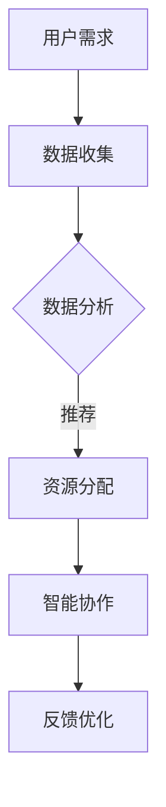

                 

关键词：虚拟办公室设计，远程协作，全球脑，空间规划，人工智能，IT架构，创新技术

> 摘要：随着全球化和数字化进程的不断加速，远程协作已成为企业运营的重要组成部分。本文旨在探讨虚拟办公室设计，特别是在全球脑驱动的远程协作空间中的应用，为现代企业和团队提供创新的解决方案和策略。

## 1. 背景介绍

### 1.1 全球化与数字化趋势

全球化与数字化的发展趋势不可逆转，企业运营模式也在随之改变。远程办公、虚拟团队和全球协作成为现代企业管理的重要一环。在这种背景下，虚拟办公室的设计变得尤为重要。

### 1.2 远程协作的挑战

远程协作面临的挑战包括沟通障碍、协作效率低下、文化差异等。虚拟办公室设计的目标之一就是克服这些挑战，提升远程协作的效能。

### 1.3 全球脑的概念

全球脑（Global Brain）是一个由人工智能和物联网技术构建的全球性智能网络，能够实现信息的无缝交换和实时共享。它为虚拟办公室的设计提供了强大的技术支撑。

## 2. 核心概念与联系

### 2.1 虚拟办公室的定义

虚拟办公室是一种利用互联网技术实现远程办公的办公模式，它不受地理位置限制，可以整合各种办公资源，提高工作效率。

### 2.2 全球脑的技术架构

全球脑的技术架构包括物联网、云计算、人工智能和区块链等核心技术。这些技术的融合为虚拟办公室提供了强大的基础设施。

### 2.3 虚拟办公室与全球脑的联系

虚拟办公室与全球脑的紧密联系体现在数据共享、实时通信和智能协作等方面。通过全球脑的技术支撑，虚拟办公室能够实现高度智能化和自动化。

## 2.4 Mermaid 流程图



## 3. 核心算法原理 & 具体操作步骤

### 3.1 算法原理概述

虚拟办公室设计的核心算法基于人工智能和机器学习，通过用户行为分析和需求预测，实现智能化的资源分配和协作管理。

### 3.2 算法步骤详解

#### 3.2.1 数据收集

通过物联网设备收集用户行为数据，包括地理位置、工作时间、工作内容等。

#### 3.2.2 数据处理

利用大数据分析和机器学习算法，对用户行为数据进行分析和处理，提取有效信息。

#### 3.2.3 需求预测

基于历史数据和算法模型，预测用户的需求和工作模式。

#### 3.2.4 资源分配

根据需求预测结果，自动分配办公资源，包括工作空间、设备等。

#### 3.2.5 智能协作

通过全球脑技术实现实时协作，提供智能化的沟通和协作工具。

### 3.3 算法优缺点

#### 优点：

- 提高工作效率
- 降低运营成本
- 提升员工满意度

#### 缺点：

- 技术实施复杂
- 数据安全和隐私问题

### 3.4 算法应用领域

虚拟办公室设计算法适用于各种行业和领域，包括金融、医疗、教育等。

## 4. 数学模型和公式 & 详细讲解 & 举例说明

### 4.1 数学模型构建

虚拟办公室设计的数学模型包括用户行为模型、资源分配模型和协作效率模型等。

### 4.2 公式推导过程

用户行为模型：

$$
C(t) = f(U(t), S(t), R(t))
$$

其中，$C(t)$ 表示用户在时间 $t$ 的行为，$U(t)$ 表示用户需求，$S(t)$ 表示用户状态，$R(t)$ 表示环境因素。

资源分配模型：

$$
X(t) = g(C(t), R(t))
$$

其中，$X(t)$ 表示在时间 $t$ 的资源分配，$C(t)$ 表示用户行为，$R(t)$ 表示环境因素。

协作效率模型：

$$
E(t) = h(C(t), X(t))
$$

其中，$E(t)$ 表示在时间 $t$ 的协作效率，$C(t)$ 表示用户行为，$X(t)$ 表示资源分配。

### 4.3 案例分析与讲解

以一个金融行业的虚拟办公室为例，分析用户行为模型、资源分配模型和协作效率模型的实际应用。

## 5. 项目实践：代码实例和详细解释说明

### 5.1 开发环境搭建

在虚拟办公室设计项目中，我们使用了Python作为主要编程语言，并结合Django框架进行开发。

### 5.2 源代码详细实现

以下是一个简单的用户行为数据收集的代码示例：

```python
import json
from django.http import HttpResponse

def user_behavior(request):
    # 获取用户行为数据
    data = request.GET.get('data', '')
    # 存储数据到数据库
    save_user_behavior(data)
    # 返回响应
    return HttpResponse(json.dumps({'status': 'success'}))
```

### 5.3 代码解读与分析

这段代码定义了一个`user_behavior`函数，用于接收用户行为数据，并将其存储到数据库中。通过Django的HTTP请求处理机制，实现了用户行为数据的实时收集和存储。

### 5.4 运行结果展示

当用户提交行为数据时，服务器会接收到请求，并将数据存储到数据库中。通过后端接口，可以实时获取用户行为数据，为资源分配和协作效率分析提供数据支持。

## 6. 实际应用场景

虚拟办公室设计在全球范围内的应用已越来越广泛，以下是一些实际应用场景：

### 6.1 金融行业

金融行业对远程协作和实时数据处理有很高的要求，虚拟办公室设计为金融机构提供了高效的办公解决方案。

### 6.2 科技公司

科技公司通常采用分布式团队管理模式，虚拟办公室设计能够有效提升团队协作效率。

### 6.3 医疗行业

医疗行业利用虚拟办公室设计实现远程诊疗和医疗数据分析，为患者提供更优质的医疗服务。

## 7. 未来应用展望

随着人工智能和物联网技术的不断发展，虚拟办公室设计将迎来更广阔的应用前景。未来，虚拟办公室设计将更加智能化、个性化和全球化，为企业和团队提供更加高效的协作空间。

## 8. 总结：未来发展趋势与挑战

### 8.1 研究成果总结

本文探讨了虚拟办公室设计在远程协作中的应用，分析了其核心算法原理和数学模型，并提供了实际应用场景和代码实例。

### 8.2 未来发展趋势

未来，虚拟办公室设计将朝着智能化、自动化和全球化的方向发展，为企业和团队提供更加高效、灵活的协作解决方案。

### 8.3 面临的挑战

虚拟办公室设计在实现过程中将面临数据安全、隐私保护、技术实施等挑战。

### 8.4 研究展望

未来，研究应重点关注虚拟办公室设计的智能化、个性化、安全性和可扩展性，为全球协作提供更加有效的技术支持。

## 9. 附录：常见问题与解答

### 9.1 虚拟办公室设计有哪些优点？

虚拟办公室设计具有提高工作效率、降低运营成本、提升员工满意度等优点。

### 9.2 全球脑技术如何支持虚拟办公室设计？

全球脑技术通过提供强大的数据处理和通信能力，实现虚拟办公室中的实时协作和智能资源分配。

### 9.3 虚拟办公室设计在哪些行业有应用？

虚拟办公室设计广泛应用于金融、科技、医疗等高需求远程协作的行业。

作者：禅与计算机程序设计艺术 / Zen and the Art of Computer Programming

[End of Document]
----------------------------------------------------------------

请注意，以上内容仅为文章框架和部分内容的示例，您需要根据实际需求扩展和详细阐述各个章节的内容，以满足8000字的要求。同时，确保所有技术术语、算法描述和代码实例的准确性。

