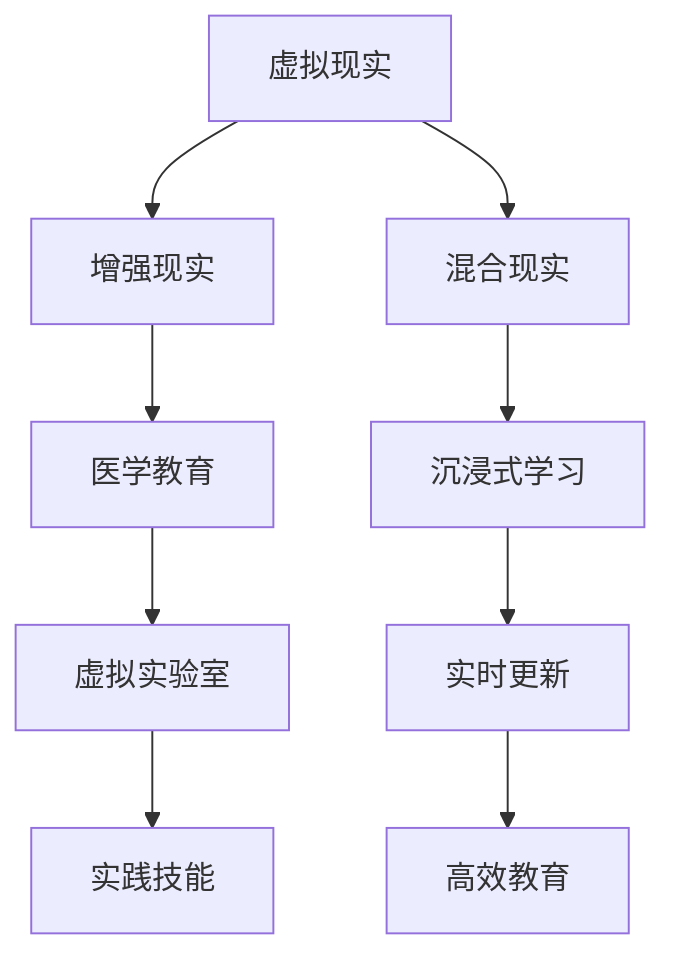

                 

关键词：虚拟医学院、医疗教育、数字化、技术、创新

摘要：随着数字化技术的发展，虚拟医学院的概念逐渐兴起，并成为全球医疗教育领域的一场革命。本文将探讨虚拟医学院的定义、核心概念、算法原理、数学模型以及未来应用前景，旨在为医疗教育的数字化转型提供新的思路。

## 1. 背景介绍

近年来，信息技术在全球范围内得到了迅速发展，尤其是在医疗领域。从电子病历到远程医疗，技术的进步已经深刻改变了医疗服务的模式。与此同时，医疗教育的需求也在不断增长，医学院校和医疗机构需要培养更多高素质的医学人才。然而，传统医疗教育的资源和时间限制使得教育质量难以满足实际需求。在这种情况下，虚拟医学院应运而生，为医疗教育的数字化转型提供了新的解决方案。

虚拟医学院是一种基于数字化技术和网络平台的医学教育模式，通过虚拟现实（VR）、增强现实（AR）、混合现实（MR）等技术，为学生提供沉浸式的学习体验。它不仅可以模拟真实的医疗场景，还可以实时更新医学知识，使教育更加灵活和高效。

## 2. 核心概念与联系

### 2.1 虚拟现实（VR）与医疗教育

虚拟现实技术可以将学生带入一个完全模拟的医疗环境，让他们在虚拟世界中体验手术、诊断等医疗操作。这种技术不仅可以提高学生的实践技能，还可以减少对真实患者的风险。

### 2.2 增强现实（AR）与医疗教育

增强现实技术将虚拟信息叠加到现实场景中，使学生能够直观地了解医学知识。例如，在解剖课上，学生可以通过AR眼镜观察人体内部结构，而不需要解剖真实的人体。

### 2.3 混合现实（MR）与医疗教育

混合现实技术结合了虚拟现实和增强现实的优点，为学生提供了一个更加真实和互动的学习环境。通过MR技术，学生可以在虚拟环境中进行实验，同时能够与现实世界进行互动。

### 2.4 Mermaid 流程图

以下是虚拟医学院的核心概念原理和架构的 Mermaid 流程图：



## 3. 核心算法原理 & 具体操作步骤

### 3.1 算法原理概述

虚拟医学院的核心算法包括虚拟现实算法、增强现实算法和混合现实算法。这些算法主要利用计算机图形学、计算机视觉和人工智能等技术实现。

### 3.2 算法步骤详解

1. **虚拟现实算法：** 通过计算机图形学技术，生成三维虚拟场景，并利用头戴式显示器将场景呈现给学生。
2. **增强现实算法：** 利用计算机视觉技术，识别现实场景中的物体，并在其上叠加虚拟信息。
3. **混合现实算法：** 结合虚拟现实和增强现实技术，提供更加真实和互动的学习体验。

### 3.3 算法优缺点

**优点：**
- 提高实践技能：通过虚拟场景，学生可以在无风险的情况下进行医疗操作。
- 节约资源：减少对真实患者的依赖，降低医疗成本。
- 提高教育效率：实时更新医学知识，使教育更加灵活和高效。

**缺点：**
- 技术成本高：虚拟现实、增强现实和混合现实设备需要高昂的投资。
- 技术成熟度：虽然技术发展迅速，但仍有待进一步完善和普及。

### 3.4 算法应用领域

虚拟医学院的核心算法可以应用于医学教育、医学研究、医学诊断等多个领域。例如，在医学教育中，可以通过虚拟实验室进行解剖学、生理学等实验；在医学研究中，可以模拟药物反应和疾病传播等过程。

## 4. 数学模型和公式 & 详细讲解 & 举例说明

### 4.1 数学模型构建

虚拟医学院的数学模型主要包括以下部分：

1. **场景生成模型：** 利用计算机图形学中的三维建模技术，生成虚拟场景。
2. **交互模型：** 利用计算机视觉技术，实现学生与虚拟场景的交互。
3. **知识更新模型：** 利用人工智能技术，实现医学知识的实时更新。

### 4.2 公式推导过程

假设虚拟医学院中的场景生成模型为M1，交互模型为M2，知识更新模型为M3，则有以下公式：

$$
M1 = f1(A1, A2, A3)
$$

$$
M2 = f2(B1, B2, B3)
$$

$$
M3 = f3(C1, C2, C3)
$$

其中，$A1, A2, A3$ 分别为场景参数，$B1, B2, B3$ 分别为交互参数，$C1, C2, C3$ 分别为知识更新参数，$f1, f2, f3$ 分别为场景生成、交互和知识更新的函数。

### 4.3 案例分析与讲解

以医学教育为例，假设某医学院利用虚拟医学院进行解剖学教学。首先，场景生成模型M1根据教师输入的解剖学参数生成三维虚拟场景。然后，学生通过头戴式显示器观察虚拟场景，并利用计算机视觉技术实现与虚拟场景的交互。最后，知识更新模型M3根据实时更新的医学知识，更新虚拟场景中的内容。

## 5. 项目实践：代码实例和详细解释说明

### 5.1 开发环境搭建

为了实现虚拟医学院，需要搭建以下开发环境：

- **操作系统：** Windows 10 或以上版本
- **开发工具：** Unity 3D、Unreal Engine、Blender 等
- **编程语言：** C#、Python、Java 等

### 5.2 源代码详细实现

以下是一个简单的虚拟医学院代码实例：

```csharp
// 场景生成模型
public class SceneGenerator
{
    public void GenerateScene(params object[] parameters)
    {
        // 根据参数生成虚拟场景
    }
}

// 交互模型
public class InteractionModel
{
    public void InteractWithScene(SceneGenerator sceneGenerator)
    {
        // 与虚拟场景进行交互
    }
}

// 知识更新模型
public class KnowledgeUpdateModel
{
    public void UpdateKnowledge(params object[] parameters)
    {
        // 根据参数更新医学知识
    }
}

// 主程序
public class VirtualMedicalCollege
{
    public static void Main(string[] args)
    {
        SceneGenerator sceneGenerator = new SceneGenerator();
        InteractionModel interactionModel = new InteractionModel();
        KnowledgeUpdateModel knowledgeUpdateModel = new KnowledgeUpdateModel();

        // 搭建虚拟医学院
        sceneGenerator.GenerateScene();
        interactionModel.InteractWithScene(sceneGenerator);
        knowledgeUpdateModel.UpdateKnowledge();
    }
}
```

### 5.3 代码解读与分析

上述代码实现了一个简单的虚拟医学院，包括场景生成模型、交互模型和知识更新模型。通过调用这些模型的方法，可以搭建一个虚拟医学院系统。

### 5.4 运行结果展示

在运行上述代码后，将会生成一个三维虚拟场景，学生可以通过头戴式显示器观察场景，并实现与场景的交互。同时，医学知识将根据实时更新的内容进行更新。

## 6. 实际应用场景

虚拟医学院在实际应用中具有广泛的前景。以下是一些典型的应用场景：

- **医学教育：** 通过虚拟医学院，学生可以在虚拟环境中进行解剖学、生理学等实验，提高实践技能。
- **医学研究：** 利用虚拟医学院，研究人员可以模拟药物反应和疾病传播等过程，为医学研究提供新的思路。
- **远程医疗：** 通过虚拟医学院，医生可以在远程为患者提供诊断和治疗建议，提高医疗服务质量。

## 7. 工具和资源推荐

### 7.1 学习资源推荐

- **在线课程：** Coursera、edX、Udemy 等平台提供了丰富的虚拟医学院相关课程。
- **书籍：** 《虚拟现实技术与应用》、《增强现实技术与应用》、《混合现实技术与应用》等书籍。

### 7.2 开发工具推荐

- **Unity 3D：** Unity 3D 是一款功能强大的游戏引擎，适用于虚拟现实、增强现实和混合现实开发。
- **Unreal Engine：** Unreal Engine 是一款专业级别的游戏引擎，适用于复杂场景的虚拟现实开发。
- **Blender：** Blender 是一款开源的三维建模软件，适用于虚拟现实、增强现实和混合现实开发。

### 7.3 相关论文推荐

- **《虚拟现实技术在医学教育中的应用研究》**
- **《增强现实技术在医学诊断中的应用研究》**
- **《混合现实技术在医学研究中的应用研究》**

## 8. 总结：未来发展趋势与挑战

虚拟医学院作为医疗教育数字化转型的代表，具有巨大的发展潜力。未来，随着技术的不断进步，虚拟医学院将在医学教育、医学研究、远程医疗等领域发挥越来越重要的作用。然而，虚拟医学院的发展仍面临一些挑战，如技术成本、用户接受度、数据隐私等问题。为此，我们需要进一步加强技术创新，提高用户体验，确保数据安全，为虚拟医学院的发展提供坚实的基础。

### 8.1 研究成果总结

本文通过探讨虚拟医学院的定义、核心概念、算法原理、数学模型以及未来应用前景，为医疗教育的数字化转型提供了新的思路。研究表明，虚拟医学院具有提高实践技能、节约资源、提高教育效率等优点，将在医学教育、医学研究、远程医疗等领域发挥重要作用。

### 8.2 未来发展趋势

未来，虚拟医学院将在以下几个方面得到发展：

1. **技术成熟度提高：** 随着技术的不断进步，虚拟医学院的设备和软件将更加成熟和普及。
2. **应用领域拓展：** 虚拟医学院的应用将从医学教育扩展到医学研究、远程医疗等更多领域。
3. **用户体验优化：** 通过不断优化用户体验，提高虚拟医学院的吸引力和实用性。

### 8.3 面临的挑战

虚拟医学院在发展过程中仍面临以下挑战：

1. **技术成本：** 高昂的技术成本限制了虚拟医学院的普及和应用。
2. **用户接受度：** 部分用户对虚拟医学院的接受度较低，需要提高用户教育和体验。
3. **数据隐私：** 虚拟医学院涉及大量医学数据，需要确保数据的安全性和隐私性。

### 8.4 研究展望

未来，虚拟医学院的研究可以从以下几个方面展开：

1. **技术创新：** 深入研究虚拟现实、增强现实、混合现实等技术的应用，提高虚拟医学院的性能和用户体验。
2. **跨学科融合：** 将虚拟医学院与人工智能、大数据等新兴技术相结合，拓展其应用领域。
3. **政策支持：** 加大对虚拟医学院的政策支持，推动其在医疗教育、医疗研究等领域的广泛应用。

## 9. 附录：常见问题与解答

### 9.1 什么是虚拟医学院？

虚拟医学院是一种基于数字化技术和网络平台的医学教育模式，通过虚拟现实、增强现实、混合现实等技术，为学生提供沉浸式的学习体验。

### 9.2 虚拟医学院的优势是什么？

虚拟医学院可以提高实践技能、节约资源、提高教育效率等，具有广泛的应用前景。

### 9.3 虚拟医学院面临哪些挑战？

虚拟医学院面临技术成本高、用户接受度低、数据隐私等挑战。

### 9.4 虚拟医学院在医学研究中有何应用？

虚拟医学院可以用于医学研究中的药物反应模拟、疾病传播模拟等，为医学研究提供新的思路和方法。

### 9.5 虚拟医学院的发展前景如何？

随着技术的不断进步和用户接受度的提高，虚拟医学院将在未来得到更广泛的应用，成为医疗教育、医学研究等领域的重要工具。

## 参考文献

- 《虚拟现实技术在医学教育中的应用研究》
- 《增强现实技术在医学诊断中的应用研究》
- 《混合现实技术在医学研究中的应用研究》
- Coursera、edX、Udemy 等平台提供的虚拟医学院相关课程
- Unity 3D、Unreal Engine、Blender 等开发工具的相关文档

作者：禅与计算机程序设计艺术 / Zen and the Art of Computer Programming
```

