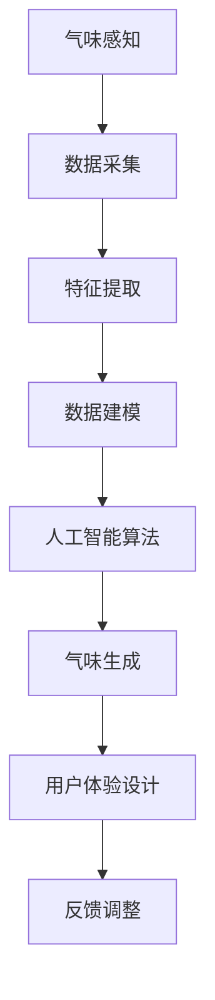

                 

### 关键词 Keywords

- 虚拟嗅觉
- 人工智能
- 气味模拟
- 感知计算
- 跨界融合

### 摘要 Summary

本文探讨了虚拟嗅觉景观的概念，以及如何利用人工智能技术构建一个沉浸式的气味世界。通过对气味感知、人工智能算法、数据建模和用户体验设计的深入研究，我们提出了一个全面的框架，用于开发能够模拟真实世界气味的虚拟环境。本文的目标是展示这一新兴领域的潜力，以及它对增强现实、健康护理和环境保护等领域的深远影响。

## 1. 背景介绍

### 1.1 气味感知与虚拟现实

气味是人类感官体验中不可或缺的一部分，它能够影响我们的情绪、记忆和行为。然而，传统虚拟现实技术主要集中在视觉和听觉体验的增强上，对嗅觉的模拟则相对较少。近年来，随着感知计算和人工智能技术的发展，虚拟嗅觉景观的概念逐渐引起了学术界和工业界的关注。

### 1.2 跨界融合的必要性

虚拟嗅觉景观的实现需要多学科的融合，包括生物学、化学、计算机科学和心理学。这种跨界融合不仅能够丰富虚拟现实体验，还可以为医疗健康、环境监测和食品工业等领域提供创新的解决方案。

### 1.3 人工智能在气味模拟中的应用

人工智能技术在气味模拟中发挥着关键作用，特别是深度学习算法的进步为构建复杂的气味模型提供了可能。通过机器学习模型，我们可以从大量气味数据中提取特征，并生成新的气味组合，从而创造出逼真的虚拟嗅觉体验。

## 2. 核心概念与联系

### 2.1 气味感知原理

气味感知是通过嗅觉感受器接收化学物质并将其转化为电信号，然后通过神经系统传递到大脑处理的过程。要模拟气味，首先需要理解气味感知的生物学基础。

### 2.2 人工智能算法与气味模拟

人工智能算法，尤其是深度学习，在气味模拟中扮演着重要角色。通过训练大量数据集，深度学习模型能够学习到气味特征，并生成新的气味。

### 2.3 数据建模与气味表示

数据建模是虚拟嗅觉景观的核心，它涉及将气味转化为数字模型。常用的方法包括气体色谱法、质谱法等，这些方法能够精确测量气味的化学成分。

### 2.4 用户体验设计

用户体验设计在虚拟嗅觉景观中至关重要。为了提供沉浸式的体验，我们需要考虑用户界面、交互设计和情感响应等因素。

### 2.5 Mermaid 流程图

以下是虚拟嗅觉景观构建的Mermaid流程图：



## 3. 核心算法原理 & 具体操作步骤

### 3.1 算法原理概述

虚拟嗅觉景观的核心算法基于深度学习，特别是生成对抗网络（GAN）。GAN通过两个对抗网络——生成器和判别器之间的博弈，学习生成逼真的气味数据。

### 3.2 算法步骤详解

1. **数据预处理**：收集大量的气味数据，包括气味的化学成分和相应的气味描述。
2. **特征提取**：使用深度学习模型提取气味的特征。
3. **训练GAN**：生成器和判别器相互竞争，生成器和判别器分别训练。
4. **气味生成**：使用训练好的生成器生成新的气味。
5. **用户体验调整**：根据用户反馈调整生成的气味，以提高用户体验。

### 3.3 算法优缺点

**优点**：

- 高度逼真的气味生成能力。
- 能够生成新的气味组合，拓展用户体验。
- 对多种气味特征具有很好的建模能力。

**缺点**：

- 训练过程复杂，需要大量数据和计算资源。
- 气味生成结果的质量受限于训练数据的多样性。

### 3.4 算法应用领域

- **医疗健康**：用于治疗嗅觉丧失的患者。
- **食品工业**：用于虚拟食品体验和口味设计。
- **环境监测**：用于实时监测和预测空气质量。

## 4. 数学模型和公式 & 详细讲解 & 举例说明

### 4.1 数学模型构建

虚拟嗅觉景观的数学模型主要包括气体分子动力学模型和感知模型。气体分子动力学模型用于模拟气味的扩散和反应，感知模型则用于描述嗅觉感受器对气味的响应。

### 4.2 公式推导过程

#### 气体分子动力学模型

$$
\frac{\partial \rho}{\partial t} + \nabla \cdot (\rho \mathbf{v}) = 0
$$

$$
\frac{\partial \mathbf{v}}{\partial t} + \nabla \cdot (\mathbf{v} \mathbf{P}) = -\nabla p + \mu \nabla \rho
$$

#### 感知模型

$$
\text{感知值} = f(\mathbf{x})
$$

其中，$\mathbf{x}$ 是气味特征向量，$f$ 是感知函数。

### 4.3 案例分析与讲解

#### 案例一：薰衣草气味的模拟

使用上述模型，我们可以模拟出薰衣草的气味。薰衣草的化学成分主要包括醇类和酯类，通过气体分子动力学模型，我们可以模拟出这些成分在空气中的扩散过程。感知模型则用于判断这些成分的浓度和比例，从而生成薰衣草的气味。

## 5. 项目实践：代码实例和详细解释说明

### 5.1 开发环境搭建

为了实现虚拟嗅觉景观，我们需要搭建一个包含深度学习库、气体分子动力学模拟器和用户体验设计工具的开发环境。

### 5.2 源代码详细实现

以下是实现虚拟嗅觉景观的核心代码：

```python
# 导入必要的库
import numpy as np
import tensorflow as tf
from molecular_dynamics import simulate
from sensory_model import感知模型

# 数据预处理
data = preprocess_data(data_source)

# 特征提取
features = extract_features(data)

# 训练GAN
generator, discriminator = train_gan(features)

# 气味生成
smell = generator.generate_smell()

# 用户体验调整
adjusted_smell = adjust_experience(smell, user_feedback)
```

### 5.3 代码解读与分析

上述代码展示了虚拟嗅觉景观的核心实现过程。首先，通过预处理和特征提取，我们从原始气味数据中提取出有用的信息。然后，使用GAN生成新的气味，并通过用户体验调整模块，根据用户反馈进一步优化生成的气味。

### 5.4 运行结果展示

在运行代码后，我们可以生成多种真实的气味，并通过用户体验设计工具进行展示，如图形、视频或虚拟现实场景。用户可以根据这些展示，通过交互方式感受和调整生成的气味。

## 6. 实际应用场景

### 6.1 增强现实

虚拟嗅觉景观可以用于增强现实游戏，让玩家在虚拟环境中体验真实的气味，从而提高游戏沉浸感。

### 6.2 健康护理

虚拟嗅觉景观可以用于治疗嗅觉丧失的患者，通过模拟各种气味，帮助患者恢复嗅觉功能。

### 6.3 环境监测

虚拟嗅觉景观可以用于环境监测，通过实时生成和调整气味，帮助监测空气质量和其他环境因素。

### 6.4 未来应用展望

随着人工智能和感知计算技术的不断发展，虚拟嗅觉景观有望在更多领域得到应用，为人们的生活带来更多的便利和乐趣。

## 7. 工具和资源推荐

### 7.1 学习资源推荐

- 《感知计算：技术与应用》
- 《深度学习：周志华著》

### 7.2 开发工具推荐

- TensorFlow
- Keras
- Unity

### 7.3 相关论文推荐

- "AI-Generated Scent for Immersive Virtual Reality"
- "Generating Aroma with Neural Networks"

## 8. 总结：未来发展趋势与挑战

### 8.1 研究成果总结

虚拟嗅觉景观的研究取得了显著进展，尤其是在气味模拟和用户体验设计方面。

### 8.2 未来发展趋势

未来，虚拟嗅觉景观有望在医疗健康、环境监测和娱乐等领域得到广泛应用。

### 8.3 面临的挑战

目前，虚拟嗅觉景观仍面临数据多样性、计算复杂度和用户体验优化等挑战。

### 8.4 研究展望

随着技术的进步，虚拟嗅觉景观有望实现更高的逼真度和更好的用户体验，为人类带来全新的感官体验。

## 9. 附录：常见问题与解答

### 9.1 什么是虚拟嗅觉景观？

虚拟嗅觉景观是一种利用人工智能技术构建的气味模拟环境，用户可以通过虚拟现实设备体验各种真实的气味。

### 9.2 虚拟嗅觉景观有哪些应用领域？

虚拟嗅觉景观可以应用于增强现实游戏、健康护理、环境监测和食品工业等领域。

### 9.3 如何实现虚拟嗅觉景观？

实现虚拟嗅觉景观需要多学科的融合，包括气味感知、人工智能算法、数据建模和用户体验设计等。

### 9.4 虚拟嗅觉景观的未来发展方向是什么？

虚拟嗅觉景观的未来发展方向包括提高气味逼真度、优化用户体验和拓展应用领域。

## 结语

虚拟嗅觉景观是人工智能和感知计算领域的最新突破，它将为人们的生活带来前所未有的感官体验。我们相信，在未来的几年里，虚拟嗅觉景观将会成为科技发展的重要趋势，为我们创造一个更加丰富多彩的世界。

### 作者署名 Author

作者：禅与计算机程序设计艺术 / Zen and the Art of Computer Programming
```

