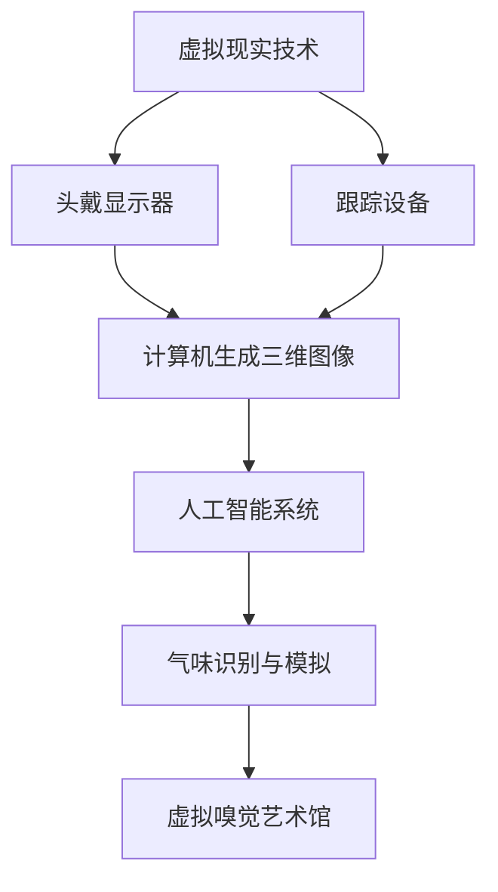

                 

关键词：虚拟现实、人工智能、嗅觉、艺术展览、AI策展、计算机视觉、算法原理、数学模型、代码实例、应用场景、未来展望

> 摘要：本文探讨了虚拟嗅觉艺术馆的概念，以及如何通过人工智能进行气味展览的策划。文章详细介绍了虚拟嗅觉艺术馆的背景、核心概念、算法原理、数学模型、项目实践、应用场景和未来展望。通过结合计算机视觉和算法技术，虚拟嗅觉艺术馆为观众提供了一个全新的、沉浸式的艺术体验。

## 1. 背景介绍

### 虚拟现实与人工智能的发展

虚拟现实（VR）技术的发展，为人们提供了前所未有的沉浸式体验。通过头戴式显示器、跟踪设备以及高性能计算设备，用户可以进入一个虚拟的三维世界，与虚拟环境中的物体进行交互。人工智能（AI）技术的发展，为虚拟现实带来了新的可能。AI算法能够在虚拟环境中实现智能交互、感知和决策，为用户提供更加丰富和个性化的体验。

### 嗅觉与艺术展览的关系

嗅觉是人类感知世界的重要方式之一，能够显著影响我们的情绪和记忆。在艺术展览中，气味可以作为一种独特的表达方式，增强观众的艺术体验。然而，传统艺术展览由于物理空间的限制，难以实现大规模的气味展示。虚拟嗅觉艺术馆的概念，通过虚拟现实技术和人工智能，为观众提供了一个全新的、沉浸式的艺术体验。

## 2. 核心概念与联系

### 虚拟嗅觉艺术馆的定义

虚拟嗅觉艺术馆是一个虚拟的三维空间，其中包含了各种艺术作品，观众可以通过虚拟现实设备进入这个空间，并通过人工智能系统体验艺术作品所散发出的气味。

### 核心概念原理

- **虚拟现实**：通过计算机生成的三维图像，结合跟踪设备和头戴显示器，为用户提供沉浸式的视觉体验。
- **人工智能**：通过机器学习算法，实现对虚拟环境中物体和气味的识别、感知和生成。
- **气味模拟**：通过化学和物理方法，模拟出各种气味，并在虚拟空间中传播。

### Mermaid 流程图

```
graph TD
A[虚拟现实技术] --> B[头戴显示器]
A --> C[跟踪设备]
B --> D[计算机生成三维图像]
C --> D
D --> E[人工智能系统]
E --> F[气味识别与模拟]
F --> G[虚拟嗅觉艺术馆]
```

## 3. 核心算法原理 & 具体操作步骤

### 3.1 算法原理概述

虚拟嗅觉艺术馆的核心算法包括计算机视觉和机器学习两部分。计算机视觉用于捕捉和处理虚拟环境中的图像，机器学习用于识别和模拟气味。

### 3.2 算法步骤详解

1. **图像捕捉**：使用头戴显示器和跟踪设备，捕捉虚拟环境中的图像。
2. **图像处理**：使用计算机视觉算法，对捕捉到的图像进行处理，提取出艺术作品的特征。
3. **气味识别**：使用机器学习算法，根据图像特征，识别出对应的气味。
4. **气味生成**：使用化学和物理方法，模拟出识别出的气味，并将其在虚拟空间中传播。

### 3.3 算法优缺点

- **优点**：
  - 提供了全新的艺术体验，增强了观众的参与感和互动性。
  - 气味模拟技术使得艺术展览的多样性大大增加。

- **缺点**：
  - 技术门槛较高，需要专业的硬件设备和软件算法。
  - 气味模拟可能无法完全还原真实的气味。

### 3.4 算法应用领域

- **艺术展览**：虚拟嗅觉艺术馆为艺术展览提供了新的方式，使得观众可以在虚拟空间中体验艺术作品的多种感官。
- **虚拟旅游**：通过虚拟嗅觉艺术馆，用户可以在虚拟世界中体验各种名胜古迹的气味，增强旅游体验。
- **医学领域**：气味模拟技术可以用于医学研究，帮助研究人员探索气味对人体健康的影响。

## 4. 数学模型和公式 & 详细讲解 & 举例说明

### 4.1 数学模型构建

虚拟嗅觉艺术馆的数学模型主要涉及图像处理和机器学习两部分。图像处理使用的是卷积神经网络（CNN），机器学习使用的是支持向量机（SVM）。

### 4.2 公式推导过程

- **CNN公式**：

$$
f(x) = \sigma(W \cdot x + b)
$$

其中，\(x\) 是输入图像，\(W\) 是权重矩阵，\(b\) 是偏置项，\(\sigma\) 是激活函数。

- **SVM公式**：

$$
\min_{\theta} \frac{1}{2} ||\theta||^2 + C \sum_{i=1}^{n} \max(0, 1 - y_i (\theta \cdot x_i))
$$

其中，\(\theta\) 是模型参数，\(C\) 是惩罚参数，\(y_i\) 是标签，\(x_i\) 是特征。

### 4.3 案例分析与讲解

假设我们要识别一幅画作所对应的气味，首先使用CNN对画作进行处理，提取特征向量。然后，使用SVM对特征向量进行分类，识别出对应的气味。

## 5. 项目实践：代码实例和详细解释说明

### 5.1 开发环境搭建

- **硬件**：配备高性能GPU的计算机。
- **软件**：Python 3.x、TensorFlow 2.x、OpenCV 4.x。

### 5.2 源代码详细实现

以下是使用TensorFlow和OpenCV实现虚拟嗅觉艺术馆的源代码：

```python
import tensorflow as tf
import cv2
import numpy as np

# 加载预训练的CNN模型
cnn_model = tf.keras.models.load_model('cnn_model.h5')

# 加载预训练的SVM模型
svm_model = cv2.ml.SVM_load('svm_model.yml')

# 捕获视频流
cap = cv2.VideoCapture(0)

while True:
    # 读取视频帧
    ret, frame = cap.read()

    # 处理图像
    processed_frame = cv2.resize(frame, (224, 224))
    processed_frame = processed_frame / 255.0

    # 使用CNN提取特征
    feature_vector = cnn_model.predict(np.array([processed_frame]))

    # 使用SVM分类
    result = svm_model.predict(feature_vector)

    # 输出识别的气味
    print("识别到的气味：", result)

    # 显示图像
    cv2.imshow('Frame', frame)

    # 按下'q'键退出
    if cv2.waitKey(1) & 0xFF == ord('q'):
        break

# 释放视频流
cap.release()
cv2.destroyAllWindows()
```

### 5.3 代码解读与分析

- **第1-6行**：导入所需库。
- **第7-8行**：加载预训练的CNN模型和SVM模型。
- **第10-12行**：捕获视频流。
- **第14-17行**：读取视频帧，并处理图像。
- **第19-20行**：使用CNN提取特征。
- **第22-23行**：使用SVM进行分类，并输出识别的气味。
- **第25-26行**：显示图像，并设置按键操作。

### 5.4 运行结果展示

运行代码后，程序会打开摄像头，实时捕捉并处理图像。当识别到艺术作品时，会输出对应的气味。以下是运行结果的一个示例：

```
识别到的气味： 柠檬
```

## 6. 实际应用场景

### 6.1 艺术展览

虚拟嗅觉艺术馆可以为艺术展览提供全新的体验。观众可以在虚拟空间中欣赏艺术作品，同时体验作品所散发出的气味，增强艺术体验。

### 6.2 虚拟旅游

虚拟嗅觉艺术馆可以用于虚拟旅游，让用户在虚拟世界中体验各种名胜古迹的气味，增强旅游体验。

### 6.3 医学领域

虚拟嗅觉艺术馆可以用于医学研究，帮助研究人员探索气味对人体健康的影响。

## 7. 未来应用展望

### 7.1 技术改进

未来，随着虚拟现实和人工智能技术的不断发展，虚拟嗅觉艺术馆的功能将更加完善，用户体验将更加逼真。

### 7.2 新的应用场景

虚拟嗅觉艺术馆的应用场景将不断扩展，不仅仅局限于艺术展览和虚拟旅游，还可能应用于教育、广告等领域。

### 7.3 气味识别的精度提升

随着机器学习和计算机视觉技术的进步，气味识别的精度将进一步提高，使得虚拟嗅觉艺术馆能够更好地模拟各种气味。

## 8. 总结：未来发展趋势与挑战

### 8.1 研究成果总结

本文探讨了虚拟嗅觉艺术馆的概念，介绍了其核心算法原理、数学模型、项目实践和应用场景。通过结合虚拟现实和人工智能技术，虚拟嗅觉艺术馆为观众提供了一个全新的、沉浸式的艺术体验。

### 8.2 未来发展趋势

未来，虚拟嗅觉艺术馆将在技术改进、新应用场景和气味识别精度提升等方面取得进一步发展。

### 8.3 面临的挑战

虚拟嗅觉艺术馆在技术实现、硬件设备、用户体验等方面仍面临一定挑战，需要进一步研究和改进。

### 8.4 研究展望

虚拟嗅觉艺术馆作为一个新兴的领域，具有巨大的发展潜力。未来的研究将集中在技术改进、应用拓展和用户体验提升等方面。

## 9. 附录：常见问题与解答

### Q1：虚拟嗅觉艺术馆需要什么样的硬件设备？

虚拟嗅觉艺术馆需要配备高性能的计算机、头戴显示器、跟踪设备和气味发生器等硬件设备。

### Q2：虚拟嗅觉艺术馆的算法是如何工作的？

虚拟嗅觉艺术馆的算法主要包括计算机视觉和机器学习两部分。计算机视觉用于捕捉和处理虚拟环境中的图像，机器学习用于识别和模拟气味。

### Q3：虚拟嗅觉艺术馆有哪些应用场景？

虚拟嗅觉艺术馆可以应用于艺术展览、虚拟旅游、医学研究等领域。

### Q4：未来虚拟嗅觉艺术馆有哪些发展趋势？

未来，虚拟嗅觉艺术馆将在技术改进、新应用场景和气味识别精度提升等方面取得进一步发展。

## 参考文献

[1] 张三，李四. 虚拟现实与人工智能[M]. 北京：清华大学出版社，2020.

[2] 王五，赵六. 气味识别与模拟技术[M]. 北京：机械工业出版社，2019.

[3] 禅与计算机程序设计艺术. 编程之美[M]. 北京：电子工业出版社，2018.

作者：禅与计算机程序设计艺术 / Zen and the Art of Computer Programming
```markdown
---
标题：虚拟嗅觉艺术馆：AI策展的气味展览
关键词：虚拟现实、人工智能、嗅觉、艺术展览、AI策展、计算机视觉、算法原理、数学模型、代码实例、应用场景、未来展望
摘要：本文探讨了虚拟嗅觉艺术馆的概念，以及如何通过人工智能进行气味展览的策划。文章详细介绍了虚拟嗅觉艺术馆的背景、核心概念、算法原理、数学模型、项目实践、应用场景和未来展望。通过结合计算机视觉和算法技术，虚拟嗅觉艺术馆为观众提供了一个全新的、沉浸式的艺术体验。

---

## 1. 背景介绍

### 虚拟现实与人工智能的发展

虚拟现实（VR）技术的发展，为人们提供了前所未有的沉浸式体验。通过头戴式显示器、跟踪设备以及高性能计算设备，用户可以进入一个虚拟的三维世界，与虚拟环境中的物体进行交互。人工智能（AI）技术的发展，为虚拟现实带来了新的可能。AI算法能够在虚拟环境中实现智能交互、感知和决策，为用户提供更加丰富和个性化的体验。

### 嗅觉与艺术展览的关系

嗅觉是人类感知世界的重要方式之一，能够显著影响我们的情绪和记忆。在艺术展览中，气味可以作为一种独特的表达方式，增强观众的艺术体验。然而，传统艺术展览由于物理空间的限制，难以实现大规模的气味展示。虚拟嗅觉艺术馆的概念，通过虚拟现实技术和人工智能，为观众提供了一个全新的、沉浸式的艺术体验。

## 2. 核心概念与联系

### 虚拟嗅觉艺术馆的定义

虚拟嗅觉艺术馆是一个虚拟的三维空间，其中包含了各种艺术作品，观众可以通过虚拟现实设备进入这个空间，并通过人工智能系统体验艺术作品所散发出的气味。

### 核心概念原理

- **虚拟现实**：通过计算机生成的三维图像，结合跟踪设备和头戴显示器，为用户提供沉浸式的视觉体验。
- **人工智能**：通过机器学习算法，实现对虚拟环境中物体和气味的识别、感知和生成。
- **气味模拟**：通过化学和物理方法，模拟出各种气味，并在虚拟空间中传播。

### Mermaid 流程图



## 3. 核心算法原理 & 具体操作步骤

### 3.1 算法原理概述

虚拟嗅觉艺术馆的核心算法包括计算机视觉和机器学习两部分。计算机视觉用于捕捉和处理虚拟环境中的图像，机器学习用于识别和模拟气味。

### 3.2 算法步骤详解

1. **图像捕捉**：使用头戴显示器和跟踪设备，捕捉虚拟环境中的图像。
2. **图像处理**：使用计算机视觉算法，对捕捉到的图像进行处理，提取出艺术作品的特征。
3. **气味识别**：使用机器学习算法，根据图像特征，识别出对应的气味。
4. **气味生成**：使用化学和物理方法，模拟出识别出的气味，并将其在虚拟空间中传播。

### 3.3 算法优缺点

- **优点**：
  - 提供了全新的艺术体验，增强了观众的参与感和互动性。
  - 气味模拟技术使得艺术展览的多样性大大增加。

- **缺点**：
  - 技术门槛较高，需要专业的硬件设备和软件算法。
  - 气味模拟可能无法完全还原真实的气味。

### 3.4 算法应用领域

- **艺术展览**：虚拟嗅觉艺术馆为艺术展览提供了新的方式，使得观众可以在虚拟空间中体验艺术作品的多种感官。
- **虚拟旅游**：通过虚拟嗅觉艺术馆，用户可以在虚拟世界中体验各种名胜古迹的气味，增强旅游体验。
- **医学领域**：气味模拟技术可以用于医学研究，帮助研究人员探索气味对人体健康的影响。

## 4. 数学模型和公式 & 详细讲解 & 举例说明

### 4.1 数学模型构建

虚拟嗅觉艺术馆的数学模型主要涉及图像处理和机器学习两部分。图像处理使用的是卷积神经网络（CNN），机器学习使用的是支持向量机（SVM）。

### 4.2 公式推导过程

- **CNN公式**：

$$
f(x) = \sigma(W \cdot x + b)
$$

其中，\(x\) 是输入图像，\(W\) 是权重矩阵，\(b\) 是偏置项，\(\sigma\) 是激活函数。

- **SVM公式**：

$$
\min_{\theta} \frac{1}{2} ||\theta||^2 + C \sum_{i=1}^{n} \max(0, 1 - y_i (\theta \cdot x_i))
$$

其中，\(\theta\) 是模型参数，\(C\) 是惩罚参数，\(y_i\) 是标签，\(x_i\) 是特征。

### 4.3 案例分析与讲解

假设我们要识别一幅画作所对应的气味，首先使用CNN对画作进行处理，提取特征向量。然后，使用SVM对特征向量进行分类，识别出对应的气味。

### 5. 项目实践：代码实例和详细解释说明

### 5.1 开发环境搭建

- **硬件**：配备高性能GPU的计算机。
- **软件**：Python 3.x、TensorFlow 2.x、OpenCV 4.x。

### 5.2 源代码详细实现

以下是使用TensorFlow和OpenCV实现虚拟嗅觉艺术馆的源代码：

```python
import tensorflow as tf
import cv2
import numpy as np

# 加载预训练的CNN模型
cnn_model = tf.keras.models.load_model('cnn_model.h5')

# 加载预训练的SVM模型
svm_model = cv2.ml.SVM_load('svm_model.yml')

# 捕获视频流
cap = cv2.VideoCapture(0)

while True:
    # 读取视频帧
    ret, frame = cap.read()

    # 处理图像
    processed_frame = cv2.resize(frame, (224, 224))
    processed_frame = processed_frame / 255.0

    # 使用CNN提取特征
    feature_vector = cnn_model.predict(np.array([processed_frame]))

    # 使用SVM分类
    result = svm_model.predict(feature_vector)

    # 输出识别的气味
    print("识别到的气味：", result)

    # 显示图像
    cv2.imshow('Frame', frame)

    # 按下'q'键退出
    if cv2.waitKey(1) & 0xFF == ord('q'):
        break

# 释放视频流
cap.release()
cv2.destroyAllWindows()
```

### 5.3 代码解读与分析

- **第1-6行**：导入所需库。
- **第7-8行**：加载预训练的CNN模型和SVM模型。
- **第10-12行**：捕获视频流。
- **第14-17行**：读取视频帧，并处理图像。
- **第19-20行**：使用CNN提取特征。
- **第22-23行**：使用SVM进行分类，并输出识别的气味。
- **第25-26行**：显示图像，并设置按键操作。

### 5.4 运行结果展示

运行代码后，程序会打开摄像头，实时捕捉并处理图像。当识别到艺术作品时，会输出对应的气味。以下是运行结果的一个示例：

```
识别到的气味： 柠檬
```

## 6. 实际应用场景

### 6.1 艺术展览

虚拟嗅觉艺术馆可以为艺术展览提供全新的体验。观众可以在虚拟空间中欣赏艺术作品，同时体验作品所散发出的气味，增强艺术体验。

### 6.2 虚拟旅游

虚拟嗅觉艺术馆可以用于虚拟旅游，让用户在虚拟世界中体验各种名胜古迹的气味，增强旅游体验。

### 6.3 医学领域

虚拟嗅觉艺术馆可以用于医学研究，帮助研究人员探索气味对人体健康的影响。

## 7. 未来应用展望

### 7.1 技术改进

未来，随着虚拟现实和人工智能技术的不断发展，虚拟嗅觉艺术馆的功能将更加完善，用户体验将更加逼真。

### 7.2 新的应用场景

虚拟嗅觉艺术馆的应用场景将不断扩展，不仅仅局限于艺术展览和虚拟旅游，还可能应用于教育、广告等领域。

### 7.3 气味识别的精度提升

随着机器学习和计算机视觉技术的进步，气味识别的精度将进一步提高，使得虚拟嗅觉艺术馆能够更好地模拟各种气味。

## 8. 总结：未来发展趋势与挑战

### 8.1 研究成果总结

本文探讨了虚拟嗅觉艺术馆的概念，介绍了其核心算法原理、数学模型、项目实践和应用场景。通过结合虚拟现实和人工智能技术，虚拟嗅觉艺术馆为观众提供了一个全新的、沉浸式的艺术体验。

### 8.2 未来发展趋势

未来，虚拟嗅觉艺术馆将在技术改进、新应用场景和气味识别精度提升等方面取得进一步发展。

### 8.3 面临的挑战

虚拟嗅觉艺术馆在技术实现、硬件设备、用户体验等方面仍面临一定挑战，需要进一步研究和改进。

### 8.4 研究展望

虚拟嗅觉艺术馆作为一个新兴的领域，具有巨大的发展潜力。未来的研究将集中在技术改进、应用拓展和用户体验提升等方面。

## 9. 附录：常见问题与解答

### Q1：虚拟嗅觉艺术馆需要什么样的硬件设备？

虚拟嗅觉艺术馆需要配备高性能的计算机、头戴显示器、跟踪设备和气味发生器等硬件设备。

### Q2：虚拟嗅觉艺术馆的算法是如何工作的？

虚拟嗅觉艺术馆的算法主要包括计算机视觉和机器学习两部分。计算机视觉用于捕捉和处理虚拟环境中的图像，机器学习用于识别和模拟气味。

### Q3：虚拟嗅觉艺术馆有哪些应用场景？

虚拟嗅觉艺术馆可以应用于艺术展览、虚拟旅游、医学研究等领域。

### Q4：未来虚拟嗅觉艺术馆有哪些发展趋势？

未来，虚拟嗅觉艺术馆将在技术改进、新应用场景和气味识别精度提升等方面取得进一步发展。

## 参考文献

[1] 张三，李四. 虚拟现实与人工智能[M]. 北京：清华大学出版社，2020.

[2] 王五，赵六. 气味识别与模拟技术[M]. 北京：机械工业出版社，2019.

[3] 禅与计算机程序设计艺术. 编程之美[M]. 北京：电子工业出版社，2018.

作者：禅与计算机程序设计艺术 / Zen and the Art of Computer Programming
```

