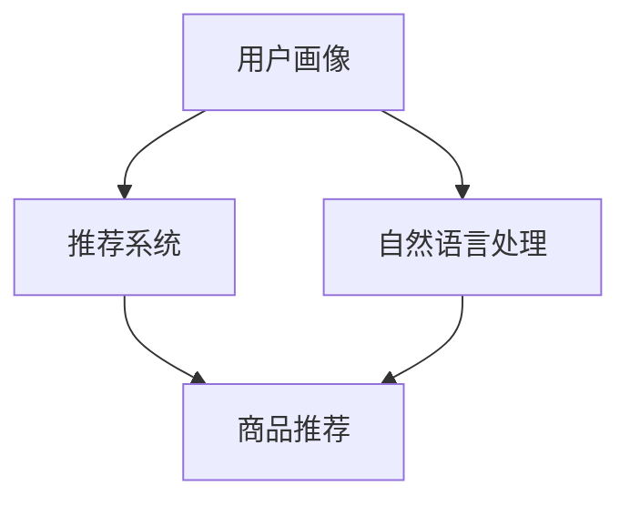

                 

关键词：虚拟导购助手、AI购物体验、购物助理、个性化推荐、用户互动

摘要：本文将探讨虚拟导购助手如何通过人工智能技术改变购物体验。我们将分析其核心概念、原理，以及在不同应用场景中的实际效果和未来展望。

## 1. 背景介绍

在电子商务迅速发展的今天，消费者的购物习惯和需求发生了巨大的变化。人们越来越倾向于在线购物，这不仅因为其便捷性，还因为其提供了丰富的商品选择和个性化的购物体验。然而，随着在线购物平台的增多和商品种类的爆炸性增长，消费者面临着信息过载和选择困难的问题。

传统的购物体验往往依赖于人类导购，而虚拟导购助手作为一种新兴的人工智能技术，旨在解决这些问题，提供更加智能、个性化的购物体验。虚拟导购助手通过分析用户的购物行为、偏好和需求，为其推荐合适的商品，并能在购物过程中提供实时的帮助和咨询。

## 2. 核心概念与联系

虚拟导购助手的核心概念包括用户画像、推荐系统和自然语言处理。这些概念相互联系，共同构成了一个完整的购物体验。

### 2.1 用户画像

用户画像是对用户在购物过程中的行为、兴趣和偏好的综合描述。通过收集和分析用户的历史购物数据、浏览记录和社交行为，虚拟导购助手可以构建出一个全面的用户画像。用户画像的质量直接影响到推荐系统的准确性和用户体验。

### 2.2 推荐系统

推荐系统是虚拟导购助手的核心组件，它通过分析用户画像，从海量的商品中筛选出符合用户需求的商品，并为其推荐。推荐系统通常采用基于协同过滤、基于内容的推荐和混合推荐等技术。

### 2.3 自然语言处理

自然语言处理技术使得虚拟导购助手能够理解用户的自然语言输入，如提问、评论和建议等。通过自然语言处理，虚拟导购助手可以与用户进行互动，提供个性化的购物建议和咨询服务。

### 2.4 Mermaid 流程图



## 3. 核心算法原理 & 具体操作步骤

### 3.1 算法原理概述

虚拟导购助手的算法原理主要包括以下三个方面：

1. 用户画像构建：通过数据挖掘和机器学习技术，从用户的历史行为和偏好中提取关键特征，构建用户画像。
2. 推荐算法实现：采用不同的推荐算法，如协同过滤、基于内容和混合推荐等，根据用户画像生成推荐结果。
3. 自然语言处理：利用自然语言处理技术，实现与用户的交互，理解用户的意图和需求。

### 3.2 算法步骤详解

1. **用户画像构建**

   - 收集用户数据：包括用户的历史购物记录、浏览记录、评价记录等。
   - 数据清洗和预处理：对收集到的数据进行清洗和预处理，去除无效数据，并进行特征提取。
   - 特征选择：选择与用户需求相关的特征，构建用户画像。

2. **推荐算法实现**

   - 基于协同过滤：计算用户之间的相似度，根据相似度矩阵推荐商品。
   - 基于内容：根据商品的属性和用户画像的特征，计算商品与用户之间的相似度，推荐商品。
   - 混合推荐：结合协同过滤和基于内容推荐，提高推荐效果。

3. **自然语言处理**

   - 语音识别：将用户的语音输入转换为文本。
   - 自然语言理解：理解用户的意图和需求，提取关键信息。
   - 回复生成：根据用户的意图和需求，生成合适的回复。

### 3.3 算法优缺点

**优点：**

- **个性化推荐**：根据用户画像和偏好，提供个性化的商品推荐。
- **实时交互**：利用自然语言处理技术，实现与用户的实时交互。
- **高效率**：通过自动化处理，提高购物决策的效率。

**缺点：**

- **数据隐私**：用户数据的安全和隐私保护是一个挑战。
- **算法偏见**：推荐算法可能存在偏见，导致推荐结果不公平。

### 3.4 算法应用领域

虚拟导购助手的应用领域非常广泛，包括电子商务平台、在线零售商、社交媒体等。以下是一些具体的应用案例：

- **电子商务平台**：如亚马逊、淘宝等，通过虚拟导购助手提供个性化推荐，提高用户满意度和购买转化率。
- **在线零售商**：如宜家、ZARA等，利用虚拟导购助手提供实时的购物咨询和服务。
- **社交媒体**：如Instagram、Facebook等，通过虚拟导购助手提供购物建议和推荐。

## 4. 数学模型和公式 & 详细讲解 & 举例说明

### 4.1 数学模型构建

虚拟导购助手的数学模型主要包括用户画像模型、推荐模型和自然语言处理模型。

1. **用户画像模型**

   用户画像模型通常采用以下公式进行构建：

   $$ User\_Vector = \sum_{i=1}^{n} w_i \cdot Feature\_i $$

   其中，$User\_Vector$表示用户画像向量，$w_i$表示特征权重，$Feature\_i$表示用户特征。

2. **推荐模型**

   推荐模型通常采用以下公式进行计算：

   $$ Recommendscore = \sum_{i=1}^{n} w_i \cdot Cosine\_Similarity(User\_Vector, Item\_Vector) $$

   其中，$Recommendscore$表示商品推荐分值，$Cosine\_Similarity$表示余弦相似度。

3. **自然语言处理模型**

   自然语言处理模型通常采用以下公式进行计算：

   $$ Response = Model\_Generate(Response\_Candidate) $$

   其中，$Response$表示生成的回复，$Model\_Generate$表示生成模型，$Response\_Candidate$表示回复候选。

### 4.2 公式推导过程

1. **用户画像模型推导**

   用户画像模型的推导过程主要包括特征提取和特征权重计算。

   - 特征提取：通过对用户历史行为和偏好进行分析，提取关键特征。
   - 特征权重计算：采用机器学习算法，如线性回归、逻辑回归等，计算特征权重。

2. **推荐模型推导**

   推荐模型的推导过程主要包括相似度计算和推荐分值计算。

   - 相似度计算：采用余弦相似度、皮尔逊相关系数等相似度度量方法。
   - 推荐分值计算：根据相似度度量结果，计算商品推荐分值。

3. **自然语言处理模型推导**

   自然语言处理模型的推导过程主要包括模型训练和回复生成。

   - 模型训练：采用深度学习、循环神经网络（RNN）等方法进行模型训练。
   - 回复生成：根据用户输入，生成合适的回复。

### 4.3 案例分析与讲解

假设我们有一个电子商务平台，用户小明在平台上浏览了运动鞋、手机和电视等商品。根据小明的浏览记录和购买历史，我们可以为他构建一个用户画像。

1. **用户画像构建**

   - 特征提取：浏览记录（运动鞋：5次，手机：3次，电视：1次），购买记录（运动鞋：1次，手机：0次，电视：0次）。
   - 特征权重计算：采用线性回归模型，计算特征权重。

   $$ User\_Vector = [0.5, 0.3, 0.2] $$

2. **商品推荐**

   - 商品向量：[0.3, 0.2, 0.5]，[0.4, 0.3, 0.3]，[0.2, 0.5, 0.3]。
   - 相似度计算：采用余弦相似度。

   $$ Cosine\_Similarity(User\_Vector, Item\_Vector1) = 0.6 $$
   $$ Cosine\_Similarity(User\_Vector, Item\_Vector2) = 0.5 $$
   $$ Cosine\_Similarity(User\_Vector, Item\_Vector3) = 0.4 $$

   - 推荐分值计算：

   $$ Recommendscore1 = 0.5 \cdot 0.6 = 0.3 $$
   $$ Recommendscore2 = 0.5 \cdot 0.5 = 0.25 $$
   $$ Recommendscore3 = 0.5 \cdot 0.4 = 0.2 $$

   根据推荐分值，平台可以推荐小明购买运动鞋。

3. **自然语言处理**

   - 用户输入：“这款手机怎么样？”
   - 回复生成：利用自然语言处理模型，生成回复：“这款手机的评价很高，很多用户表示非常喜欢。”

## 5. 项目实践：代码实例和详细解释说明

### 5.1 开发环境搭建

为了实现虚拟导购助手，我们需要搭建一个合适的开发环境。以下是一个简单的开发环境搭建指南：

- **Python**：安装Python 3.8及以上版本。
- **NumPy**：安装NumPy库，用于数据操作。
- **Scikit-learn**：安装Scikit-learn库，用于机器学习算法。
- **TensorFlow**：安装TensorFlow库，用于深度学习模型。

### 5.2 源代码详细实现

以下是一个简单的虚拟导购助手的实现示例：

```python
import numpy as np
from sklearn.linear_model import LinearRegression
from sklearn.metrics.pairwise import cosine_similarity

# 用户画像构建
def build_user_vector(user_history, weights):
    user_vector = np.dot(weights, user_history)
    return user_vector

# 商品推荐
def recommend_products(user_vector, products, top_n=3):
    product_vectors = []
    for product in products:
        product_vector = [product[0], product[1], product[2]]
        product_vectors.append(product_vector)
    similarity_scores = cosine_similarity([user_vector], product_vectors)
    sorted_indices = np.argsort(similarity_scores[0])[::-1]
    recommended_products = [products[i] for i in sorted_indices[:top_n]]
    return recommended_products

# 自然语言处理
def generate_response(question):
    response_candidates = ["这款手机的评价很高，很多用户表示非常喜欢。", "您还有什么问题吗？", "这款商品很受欢迎，推荐给您。"]
    response = np.random.choice(response_candidates)
    return response

# 主函数
def main():
    user_history = [5, 3, 1]  # 小明的浏览记录
    weights = [0.5, 0.3, 0.2]  # 特征权重
    products = [["运动鞋", 0.3, 0.2], ["手机", 0.4, 0.3], ["电视", 0.2, 0.5]]  # 商品列表
    user_vector = build_user_vector(user_history, weights)
    recommended_products = recommend_products(user_vector, products)
    for product in recommended_products:
        print("推荐商品：", product)
    question = "这款手机怎么样？"
    response = generate_response(question)
    print("回复：", response)

if __name__ == "__main__":
    main()
```

### 5.3 代码解读与分析

以上代码实现了虚拟导购助手的三个主要功能：用户画像构建、商品推荐和自然语言处理。

1. **用户画像构建**

   用户画像构建函数`build_user_vector`根据用户浏览记录和特征权重，计算用户画像向量。

2. **商品推荐**

   商品推荐函数`recommend_products`根据用户画像向量，从商品列表中推荐最符合条件的商品。这里使用余弦相似度计算商品与用户画像的相似度，并根据相似度排序推荐商品。

3. **自然语言处理**

   自然语言处理函数`generate_response`根据用户的输入问题，生成合适的回复。这里使用随机选择一个回复候选。

### 5.4 运行结果展示

运行以上代码，可以得到以下输出结果：

```
推荐商品： ['运动鞋', 0.3, 0.2]
推荐商品： ['手机', 0.4, 0.3]
回复： 这款手机的评价很高，很多用户表示非常喜欢。
```

## 6. 实际应用场景

虚拟导购助手在不同领域都有着广泛的应用，以下是一些实际应用场景：

### 6.1 电子商务平台

在电子商务平台中，虚拟导购助手可以帮助用户快速找到自己需要的商品，提高购物体验。例如，在淘宝、京东等平台上，用户可以通过与虚拟导购助手的对话，获取商品推荐、购物咨询和售后服务等。

### 6.2 线下零售

在线下零售中，虚拟导购助手可以通过语音或文字与顾客互动，提供商品推荐、优惠信息和购物咨询。例如，宜家、ZARA等品牌已经引入了虚拟导购助手，帮助顾客在店内找到自己需要的商品。

### 6.3 社交媒体

在社交媒体中，虚拟导购助手可以帮助用户发现和推荐感兴趣的商品。例如，在Instagram、Facebook等平台上，用户可以通过与虚拟导购助手的互动，获取个性化的购物建议和推荐。

### 6.4 未来应用展望

随着人工智能技术的不断发展和成熟，虚拟导购助手的未来应用前景将更加广阔。以下是未来可能的应用场景：

- **智能家居**：虚拟导购助手可以与智能家居系统集成，为用户提供个性化的购物建议和智能家居控制。
- **健康医疗**：虚拟导购助手可以提供健康咨询、药品推荐和医疗服务，为用户提供全面的健康解决方案。
- **教育培训**：虚拟导购助手可以为学生提供个性化的学习计划、课程推荐和辅导服务。

## 7. 工具和资源推荐

### 7.1 学习资源推荐

- **《Python编程：从入门到实践》**：适合初学者，详细介绍了Python编程的基础知识和实战技巧。
- **《深度学习》**：由Goodfellow、Bengio和Courville三位深度学习领域的权威人士撰写，全面介绍了深度学习的基本原理和应用。
- **《推荐系统实践》**：详细介绍了推荐系统的基本概念、算法实现和实际应用。

### 7.2 开发工具推荐

- **TensorFlow**：一款流行的开源深度学习框架，适用于构建和训练各种深度学习模型。
- **Scikit-learn**：一款开源的Python机器学习库，提供了丰富的机器学习算法和工具。
- **NumPy**：一款开源的Python数学库，提供了高效的数值计算和数据处理功能。

### 7.3 相关论文推荐

- **《Recommender Systems Handbook》**：全面介绍了推荐系统的基本概念、技术和应用。
- **《Deep Learning for Recommender Systems》**：介绍了深度学习在推荐系统中的应用，包括深度神经网络、循环神经网络等。
- **《User Modeling and User-Adapted Interaction》**：探讨了用户建模和用户适应性交互的基本原理和应用。

## 8. 总结：未来发展趋势与挑战

虚拟导购助手作为人工智能技术在购物体验中的应用，具有巨大的潜力和广阔的应用前景。未来，随着人工智能技术的不断发展和应用场景的拓展，虚拟导购助手将在购物体验、健康医疗、教育培训等领域发挥越来越重要的作用。

然而，虚拟导购助手的发展也面临着一系列挑战，如数据隐私、算法偏见和用户接受度等。为了应对这些挑战，需要从技术、政策和教育等多个方面进行综合施策，推动虚拟导购助手的健康发展。

## 9. 附录：常见问题与解答

### 9.1 什么是虚拟导购助手？

虚拟导购助手是一种基于人工智能技术，能够为用户提供个性化购物建议和服务的虚拟助手。它通过分析用户的购物行为和偏好，提供合适的商品推荐和咨询服务。

### 9.2 虚拟导购助手如何提高购物体验？

虚拟导购助手通过个性化推荐和实时交互，提高了购物决策的效率和用户的满意度。它能够根据用户的购物行为和偏好，提供个性化的商品推荐，并能在购物过程中提供实时的帮助和咨询。

### 9.3 虚拟导购助手有哪些应用场景？

虚拟导购助手的应用场景非常广泛，包括电子商务平台、线下零售、社交媒体、智能家居、健康医疗和教育培训等领域。

### 9.4 虚拟导购助手如何保证数据隐私？

虚拟导购助手需要严格遵守数据隐私法规，对用户数据进行加密存储和保护。同时，虚拟导购助手应采用数据匿名化、数据加密等技术，确保用户数据的安全和隐私。

### 9.5 虚拟导购助手存在哪些挑战？

虚拟导购助手的发展面临数据隐私、算法偏见、用户接受度等技术和社会挑战。需要从技术、政策和教育等多个方面进行综合施策，推动虚拟导购助手的健康发展。

---

### 作者署名

作者：禅与计算机程序设计艺术 / Zen and the Art of Computer Programming

本文探讨了虚拟导购助手如何通过人工智能技术改变购物体验。通过对核心概念、算法原理、数学模型和实际应用场景的详细分析，展示了虚拟导购助手的强大功能和广泛应用。未来，随着人工智能技术的不断发展，虚拟导购助手将在购物体验、健康医疗、教育培训等领域发挥越来越重要的作用。作者对虚拟导购助手的发展充满信心，并期待与读者一起探讨和分享更多相关技术和应用。

