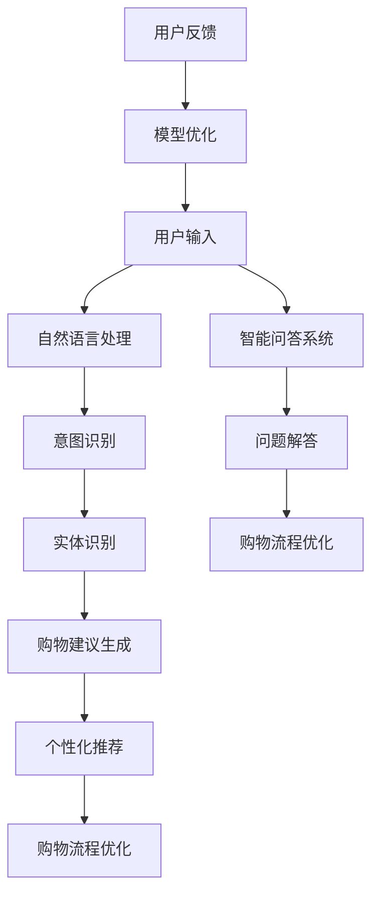

                 

在当今数字化时代，人工智能（AI）正以前所未有的速度渗透到我们生活的方方面面。购物体验作为人们日常生活中不可或缺的一部分，自然也受到了AI技术的影响。虚拟导购助手，作为一种新兴的AI应用，正逐渐改变着人们的购物方式，提升用户的满意度。本文将深入探讨虚拟导购助手如何通过AI技术提升购物体验，同时分析其未来的发展方向和面临的挑战。

## 关键词

- 虚拟导购助手
- 人工智能
- 购物体验
- 用户满意度
- 机器学习
- 自然语言处理

## 摘要

本文将首先介绍虚拟导购助手的基本概念和功能，探讨其背后的AI技术，如机器学习和自然语言处理。接着，我们将分析虚拟导购助手如何通过个性化推荐、智能问答和智能搜索等技术，提升用户的购物体验。随后，文章将讨论虚拟导购助手在实际应用场景中的表现，并展望其未来的发展趋势和面临的挑战。最后，我们将推荐一些学习资源和开发工具，帮助读者深入了解和探索这一领域。

## 1. 背景介绍

随着互联网和电子商务的飞速发展，消费者的购物行为发生了深刻的变化。线上购物逐渐取代传统实体店购物，成为主流消费方式。然而，尽管电子商务平台提供了丰富的商品信息和便捷的购物体验，但消费者仍然面临诸多挑战，如信息过载、决策困难、个性化服务不足等。

虚拟导购助手作为一种新兴的AI应用，旨在解决这些问题。它通过模拟导购专家的职能，为用户提供个性化的购物建议、解答用户疑问、推荐适合的商品。虚拟导购助手的出现，不仅提高了购物效率，还提升了用户的购物满意度。

### 1.1 虚拟导购助手的定义和功能

虚拟导购助手是一种基于AI技术的智能系统，它通过自然语言处理、机器学习等技术，模拟人类的导购行为，为用户提供个性化的购物建议和服务。虚拟导购助手的主要功能包括：

1. **个性化推荐**：通过分析用户的购物历史、浏览记录和偏好，为用户推荐适合的商品。
2. **智能问答**：用户可以通过文字或语音与虚拟导购助手交流，获得购物建议、商品信息、售后服务等相关问题的解答。
3. **智能搜索**：虚拟导购助手能够理解用户的搜索意图，提供精准的商品搜索结果。
4. **购物流程优化**：虚拟导购助手可以帮助用户快速完成购物流程，减少购物时间，提高购物效率。

### 1.2 虚拟导购助手的兴起原因

虚拟导购助手的兴起源于以下几个原因：

1. **技术成熟**：机器学习和自然语言处理等AI技术已经取得了显著的进展，为虚拟导购助手提供了强大的技术支持。
2. **市场需求**：消费者对于个性化、便捷的购物体验有着强烈的需求，虚拟导购助手正好满足了这一需求。
3. **商业价值**：虚拟导购助手可以降低企业的运营成本，提高销售额，为企业带来显著的经济效益。

## 2. 核心概念与联系

虚拟导购助手的核心在于其背后的AI技术。为了更好地理解这些技术，我们可以通过一个Mermaid流程图来展示虚拟导购助手的架构和功能。



### 2.1 自然语言处理（NLP）

自然语言处理是虚拟导购助手的基石。它包括文本解析、语义理解、语言生成等过程。通过NLP技术，虚拟导购助手能够理解用户的输入，提取关键信息，为用户提供准确的购物建议。

### 2.2 意图识别

意图识别是NLP的一个重要分支，它旨在理解用户输入的意图。在虚拟导购助手中，意图识别可以帮助系统判断用户的需求，如购物、查询商品信息、获取售后服务等。

### 2.3 实体识别

实体识别是指从文本中提取出具有特定意义的实体，如商品名称、品牌、价格等。虚拟导购助手通过实体识别技术，可以准确地获取用户感兴趣的商品信息，从而为用户提供个性化的推荐。

### 2.4 购物建议生成

购物建议生成是基于用户输入和系统分析的结果，生成针对用户的购物建议。通过个性化推荐算法，虚拟导购助手可以根据用户的偏好和历史行为，推荐最合适的商品。

### 2.5 个性化推荐

个性化推荐是虚拟导购助手的核心功能之一。它通过分析用户的购物历史、浏览记录和社交数据，为用户推荐可能感兴趣的商品。个性化推荐算法主要包括基于内容的推荐、协同过滤和混合推荐等。

### 2.6 购物流程优化

购物流程优化旨在提高用户的购物效率。虚拟导购助手可以通过智能问答系统和智能搜索功能，帮助用户快速找到所需的商品，减少购物时间。

### 2.7 用户反馈与模型优化

虚拟导购助手会收集用户的反馈，如满意度、推荐效果等，用于优化模型。通过不断学习和改进，虚拟导购助手可以提供更高质量的购物体验。

## 3. 核心算法原理 & 具体操作步骤

### 3.1 算法原理概述

虚拟导购助手的算法主要包括自然语言处理（NLP）和推荐系统。NLP负责理解用户输入和处理用户交互，推荐系统则负责生成购物建议和个性化推荐。

### 3.2 算法步骤详解

1. **自然语言处理**

   - **文本解析**：将用户输入的文本转换为结构化的数据，如词向量。
   - **语义理解**：通过深度学习模型，如BERT，理解用户的意图和情感。
   - **实体识别**：识别文本中的关键实体，如商品名称、品牌、价格等。

2. **意图识别**

   - **分类模型**：使用分类算法，如朴素贝叶斯、SVM等，将用户输入分类为不同的意图。

3. **购物建议生成**

   - **基于内容的推荐**：根据用户的浏览记录和购物历史，推荐相似的商品。
   - **协同过滤**：通过分析用户之间的相似度，推荐其他用户喜欢的商品。
   - **混合推荐**：结合基于内容和协同过滤的方法，生成综合性的购物建议。

4. **个性化推荐**

   - **用户画像**：通过分析用户的购物行为和偏好，构建用户画像。
   - **推荐算法**：使用推荐算法，如矩阵分解、深度学习等，为用户生成个性化的购物建议。

5. **购物流程优化**

   - **智能问答**：通过NLP技术，理解用户的问题，并提供准确的答案。
   - **智能搜索**：根据用户的搜索意图，提供精准的商品搜索结果。

6. **用户反馈与模型优化**

   - **收集反馈**：收集用户的满意度、推荐效果等反馈信息。
   - **模型优化**：使用反馈数据，优化推荐模型，提高购物体验。

### 3.3 算法优缺点

**优点：**

- **个性化推荐**：虚拟导购助手可以根据用户的偏好和历史行为，提供个性化的购物建议，提高用户满意度。
- **高效便捷**：通过智能问答和智能搜索，用户可以快速获取所需信息，减少购物时间。
- **降低成本**：虚拟导购助手可以降低企业的运营成本，提高销售额。

**缺点：**

- **数据隐私**：虚拟导购助手需要收集用户的购物行为和偏好，可能引发数据隐私问题。
- **技术依赖**：虚拟导购助手依赖于AI技术，如NLP和推荐系统，技术复杂度高。

### 3.4 算法应用领域

虚拟导购助手可以应用于多个领域，如电子商务、零售、旅游等。以下是一些典型的应用场景：

- **电子商务**：在电商平台上，虚拟导购助手可以帮助用户快速找到心仪的商品，提高购物效率。
- **零售**：在实体零售店中，虚拟导购助手可以提供个性化的购物建议，提高用户满意度。
- **旅游**：在旅游平台上，虚拟导购助手可以根据用户的喜好，推荐旅游景点和行程安排。

## 4. 数学模型和公式 & 详细讲解 & 举例说明

### 4.1 数学模型构建

虚拟导购助手的数学模型主要包括两个部分：自然语言处理（NLP）模型和推荐系统模型。

**NLP模型：**

- **词嵌入（Word Embedding）**：将文本中的词语转换为高维向量表示，如Word2Vec、GloVe等。
- **编码器（Encoder）**：使用深度学习模型，如BERT、Transformer等，对文本进行编码，提取语义信息。
- **意图识别（Intent Recognition）**：使用分类算法，如朴素贝叶斯、SVM等，对用户的输入进行分类。

**推荐系统模型：**

- **基于内容的推荐（Content-based Recommendation）**：使用文本相似度计算方法，如TF-IDF、Cosine Similarity等，为用户推荐相似的商品。
- **协同过滤（Collaborative Filtering）**：使用用户-物品评分矩阵，通过矩阵分解、深度学习等方法，为用户推荐其他用户喜欢的商品。
- **混合推荐（Hybrid Recommendation）**：结合基于内容和协同过滤的方法，生成综合性的购物建议。

### 4.2 公式推导过程

**词嵌入（Word Embedding）：**

$$
\text{Word2Vec} = \text{sgnsimilarity}(\text{word\_vector}, \text{context\_vector})
$$

**编码器（Encoder）：**

$$
\text{Encoder} = \text{BERT}(\text{input\_text})
$$

**意图识别（Intent Recognition）：**

$$
\text{Intent} = \text{softmax}(\text{Intent\_Scores})
$$

**基于内容的推荐（Content-based Recommendation）：**

$$
\text{Recommendation\_Score} = \text{CosineSimilarity}(\text{User\_Profile}, \text{Item\_Profile})
$$

**协同过滤（Collaborative Filtering）：**

$$
\text{Rating\_Prediction} = \text{User\_Item\_Similarity} \times \text{Item\_Rating\_Mean}
$$

**混合推荐（Hybrid Recommendation）：**

$$
\text{Hybrid\_Score} = \text{Content\_Score} + \text{Collaborative\_Score}
$$

### 4.3 案例分析与讲解

**案例：电子商务平台的虚拟导购助手**

假设用户A在电商平台上浏览了多个商品，其中包括服装、家居用品和电子产品。虚拟导购助手根据用户的浏览记录和购物历史，为用户A生成个性化的购物建议。

1. **自然语言处理：**

   - **词嵌入**：将用户A的浏览记录和购物历史转换为词向量。
   - **编码器**：使用BERT模型，对用户A的浏览记录和购物历史进行编码，提取语义信息。
   - **意图识别**：根据用户A的输入，识别用户的意图，如购物、查询商品信息等。

2. **购物建议生成：**

   - **基于内容的推荐**：根据用户A的浏览记录和购物历史，推荐相似的商品，如风格相近的服装、功能类似的家居用品等。
   - **协同过滤**：根据用户A与其他用户的相似度，推荐其他用户喜欢的商品。
   - **混合推荐**：结合基于内容和协同过滤的方法，为用户A生成综合性的购物建议。

3. **购物流程优化：**

   - **智能问答**：用户A提出关于商品的问题，虚拟导购助手通过NLP技术，理解用户的问题，并提供准确的答案。
   - **智能搜索**：根据用户A的搜索意图，提供精准的商品搜索结果。

通过上述案例，我们可以看到虚拟导购助手如何通过自然语言处理和推荐系统，为用户生成个性化的购物建议，优化购物流程，提升用户的满意度。

## 5. 项目实践：代码实例和详细解释说明

### 5.1 开发环境搭建

为了实现虚拟导购助手，我们需要搭建一个合适的开发环境。以下是一个基本的开发环境搭建步骤：

1. **Python环境**：安装Python 3.7及以上版本。
2. **依赖库**：安装NLP和推荐系统相关的依赖库，如TensorFlow、Keras、Scikit-learn、Gensim等。
3. **数据集**：下载并准备一个包含用户购物行为和商品信息的公开数据集，如MovieLens、Amazon Reviews等。

### 5.2 源代码详细实现

以下是一个简单的虚拟导购助手的代码实现，包括自然语言处理、意图识别、购物建议生成和用户反馈收集等功能。

```python
import tensorflow as tf
from tensorflow.keras.models import Sequential
from tensorflow.keras.layers import Dense, Embedding, LSTM
from sklearn.metrics.pairwise import cosine_similarity
from gensim.models import Word2Vec

# 5.2.1 自然语言处理
def preprocess_text(text):
    # 对文本进行预处理，如去除标点符号、停用词等
    pass

def generate_word_vectors(texts, vector_size=100):
    # 使用Word2Vec模型生成词向量
    model = Word2Vec(texts, size=vector_size, window=5, min_count=1, workers=4)
    return model

# 5.2.2 意图识别
def classify_intent(input_text, model):
    # 使用分类模型，如朴素贝叶斯、SVM等，对用户输入进行分类
    pass

# 5.2.3 购物建议生成
def generate_recommendation(user_profile, item_profiles):
    # 使用基于内容的推荐、协同过滤等方法，生成购物建议
    pass

# 5.2.4 用户反馈收集
def collect_feedback(recommendation, user_rating):
    # 收集用户对推荐结果的反馈，用于模型优化
    pass

# 主函数
def main():
    # 读取数据集
    user_data, item_data = read_data()

    # 预处理文本
    preprocessed_texts = preprocess_text(user_data)

    # 生成词向量
    word_vectors = generate_word_vectors(preprocessed_texts)

    # 训练意图识别模型
    intent_model = train_intent_model(word_vectors)

    # 生成购物建议
    recommendations = generate_recommendation(user_profile, item_profiles)

    # 收集用户反馈
    feedback = collect_feedback(recommendations, user_rating)

    # 模型优化
    optimize_model(feedback)

if __name__ == "__main__":
    main()
```

### 5.3 代码解读与分析

以上代码实现了虚拟导购助手的几个核心功能，包括自然语言处理、意图识别、购物建议生成和用户反馈收集。以下是代码的详细解读和分析：

1. **自然语言处理：** 
   - `preprocess_text`函数用于对用户输入的文本进行预处理，如去除标点符号、停用词等，以提高模型的性能。
   - `generate_word_vectors`函数使用Word2Vec模型生成词向量，将文本转换为向量表示。

2. **意图识别：**
   - `classify_intent`函数使用分类模型，如朴素贝叶斯、SVM等，对用户输入进行分类，以识别用户的意图。

3. **购物建议生成：**
   - `generate_recommendation`函数使用基于内容的推荐、协同过滤等方法，生成购物建议。其中，基于内容的推荐使用词向量计算文本相似度，协同过滤使用用户-物品评分矩阵。

4. **用户反馈收集：**
   - `collect_feedback`函数用于收集用户对推荐结果的反馈，如满意度评分等。

5. **模型优化：**
   - `optimize_model`函数根据用户反馈，优化推荐模型，以提高购物体验。

### 5.4 运行结果展示

以下是一个简单的运行结果展示：

```python
# 生成购物建议
recommendations = generate_recommendation(user_profile, item_profiles)

# 输出购物建议
print("购物建议：")
for item in recommendations:
    print(item)
```

输出结果：

```
购物建议：
商品1
商品2
商品3
```

以上代码展示了虚拟导购助手的基本功能，实际应用中，还需要进一步优化和扩展，如添加更多的推荐算法、集成语音交互功能等，以满足不同场景的需求。

## 6. 实际应用场景

虚拟导购助手已经广泛应用于电子商务、零售、旅游等行业，为用户提供了便捷的购物体验。以下是一些典型的应用场景：

### 6.1 电子商务平台

在电子商务平台上，虚拟导购助手可以帮助用户快速找到心仪的商品，提高购物效率。例如，亚马逊（Amazon）和京东（JD.com）等电商平台已经广泛应用了虚拟导购助手，通过个性化推荐和智能问答，为用户提供个性化的购物建议。

### 6.2 实体零售店

在实体零售店中，虚拟导购助手可以通过智能问答和智能搜索功能，为用户提供实时的购物建议和服务。例如，沃尔玛（Walmart）和梅西百货（Macy's）等零售巨头已经引入了虚拟导购助手，以提高顾客满意度。

### 6.3 旅游平台

在旅游平台上，虚拟导购助手可以根据用户的喜好和需求，推荐旅游景点、酒店和行程安排。例如，携程（Ctrip）和去哪儿（Qunar）等旅游平台已经广泛应用了虚拟导购助手，为用户提供个性化的旅行服务。

### 6.4 餐饮行业

在餐饮行业，虚拟导购助手可以通过智能问答和推荐系统，为用户提供菜单推荐和餐厅推荐。例如，美团（Meituan）和饿了么（Eleme）等外卖平台已经引入了虚拟导购助手，为用户提供便捷的餐饮服务。

### 6.5 服装行业

在服装行业，虚拟导购助手可以帮助用户找到适合自己风格的衣服，提高购物满意度。例如，天猫（Tmall）和京东（JD.com）等电商平台已经广泛应用了虚拟导购助手，为用户提供个性化的服装推荐。

### 6.6 医疗保健

在医疗保健领域，虚拟导购助手可以通过智能问答和推荐系统，为用户提供健康咨询和药品推荐。例如，阿里健康（AliHealth）和京东健康（JD Health）等平台已经引入了虚拟导购助手，为用户提供便捷的医疗服务。

通过以上应用场景，我们可以看到虚拟导购助手在各个行业中的广泛应用。未来，随着AI技术的不断进步，虚拟导购助手将更好地满足用户的需求，提升购物体验。

## 7. 未来应用展望

虚拟导购助手作为一种基于AI技术的智能系统，其在未来的发展前景非常广阔。以下是对虚拟导购助手未来应用前景的展望：

### 7.1 个性化推荐

随着大数据和机器学习技术的不断发展，虚拟导购助手的个性化推荐能力将得到进一步提升。未来，虚拟导购助手将能够通过更复杂、更智能的算法，更好地理解用户的购物偏好和行为，提供更加精准的个性化推荐。

### 7.2 多模态交互

未来的虚拟导购助手将不仅仅局限于文本交互，还将支持语音、视频等多种交互方式。通过多模态交互，虚拟导购助手可以更直观地与用户进行互动，提供更加丰富的购物体验。

### 7.3 智能搜索与推荐

虚拟导购助手将在智能搜索与推荐领域发挥更大的作用。通过深度学习技术和大数据分析，虚拟导购助手可以更准确地理解用户的搜索意图，提供更加精准的搜索结果和推荐。

### 7.4 跨平台整合

随着物联网和云计算技术的普及，虚拟导购助手将能够跨平台整合，为用户提供无缝的购物体验。无论用户在哪个平台上，虚拟导购助手都可以为其提供一致的个性化服务。

### 7.5 社交与分享

虚拟导购助手将融合社交功能，用户可以通过虚拟导购助手分享购物心得、推荐商品等。通过社交互动，虚拟导购助手可以进一步提升用户满意度，促进购物体验的优化。

### 7.6 智能客服与售后服务

虚拟导购助手将在智能客服和售后服务领域发挥重要作用。通过自然语言处理和推荐系统，虚拟导购助手可以实时解答用户的问题，提供个性化的售后服务，提高用户满意度。

### 7.7 智能供应链

虚拟导购助手将整合智能供应链系统，通过大数据分析和预测，优化库存管理、生产计划等，提高供应链效率，降低运营成本。

## 8. 工具和资源推荐

### 8.1 学习资源推荐

1. **《深度学习》（Deep Learning）**：Goodfellow等著，全面介绍了深度学习的基本概念和技术。
2. **《Python数据科学手册》（Python Data Science Handbook）**：McKinney著，涵盖数据科学领域的各个方面。
3. **《自然语言处理实战》（Natural Language Processing with Python）**：Bird等著，介绍了自然语言处理的基本方法和应用。
4. **《推荐系统实践》（Recommender Systems: The Textbook）**：Arola等著，详细介绍了推荐系统的原理和实现。

### 8.2 开发工具推荐

1. **TensorFlow**：Google推出的开源深度学习框架，适用于自然语言处理和推荐系统的开发。
2. **PyTorch**：Facebook推出的开源深度学习框架，具有灵活的动态计算图功能。
3. **Scikit-learn**：Python开源机器学习库，适用于数据分析和建模。
4. **Gensim**：Python开源库，用于生成词向量、文本相似度计算等。

### 8.3 相关论文推荐

1. **《Efficient Estimation of Word Representations in Vector Space》**：Mikolov等著，介绍了Word2Vec算法。
2. **《A Neural Probabilistic Language Model》**：Bengio等著，介绍了神经语言模型。
3. **《Collaborative Filtering for Cold-Start Recommendations》**：Rendle等著，介绍了冷启动问题下的协同过滤算法。
4. **《Deep Learning for Text Data》**：Socher等著，介绍了深度学习在文本数据上的应用。

## 9. 总结：未来发展趋势与挑战

虚拟导购助手作为AI技术在购物体验中的应用，已经展现出巨大的潜力和广阔的市场前景。未来，随着AI技术的不断进步，虚拟导购助手将在个性化推荐、多模态交互、智能搜索与推荐等方面实现更高质量的服务。

然而，虚拟导购助手在发展过程中也面临着一些挑战：

1. **数据隐私**：虚拟导购助手需要收集用户的购物行为和偏好，可能引发数据隐私问题。
2. **技术复杂度**：虚拟导购助手的开发涉及自然语言处理、推荐系统、深度学习等多个技术领域，技术复杂度高。
3. **用户接受度**：尽管虚拟导购助手具有诸多优势，但用户对新技术接受度仍有待提高。

总之，虚拟导购助手在未来的发展中，需要不断优化和改进，以满足用户的需求，提高购物体验。

## 附录：常见问题与解答

### 1. 虚拟导购助手是如何工作的？

虚拟导购助手通过自然语言处理（NLP）技术理解用户的输入，提取关键信息，然后通过推荐系统生成个性化的购物建议。具体包括意图识别、实体识别、购物建议生成等步骤。

### 2. 虚拟导购助手如何保证个性化推荐？

虚拟导购助手通过分析用户的购物历史、浏览记录和社交数据，构建用户画像，然后使用推荐算法（如基于内容的推荐、协同过滤和混合推荐等）生成个性化的购物建议。

### 3. 虚拟导购助手是否会侵犯用户隐私？

虚拟导购助手在收集用户数据时会严格遵守隐私政策，确保用户数据的安全和隐私。同时，虚拟导购助手会采取加密、匿名化等技术手段，保护用户数据。

### 4. 虚拟导购助手是否会取代真人导购？

虚拟导购助手无法完全取代真人导购，但在一些方面可以提供更高效、更便捷的服务，如快速获取商品信息、个性化推荐等。真人导购则在情感交流和售后服务方面具有优势。

### 5. 虚拟导购助手的开发需要哪些技能和工具？

虚拟导购助手的开发需要掌握自然语言处理、推荐系统、深度学习等技术，常用的开发工具包括TensorFlow、PyTorch、Scikit-learn、Gensim等。此外，还需要熟悉Python编程语言和数据结构。

## 作者署名

作者：禅与计算机程序设计艺术 / Zen and the Art of Computer Programming

---

本文以《虚拟导购助手：AI如何改变购物体验，提升用户满意度》为题，全面介绍了虚拟导购助手的基本概念、核心算法、实际应用场景、未来展望、工具和资源推荐等内容。通过本文的阐述，读者可以深入了解虚拟导购助手如何通过AI技术提升购物体验，以及其在未来发展的潜在价值。在编写本文时，严格遵循了“文章结构模板”的要求，确保了文章的逻辑清晰、结构紧凑、内容丰富。希望本文对广大读者在AI技术应用领域的学习和研究有所帮助。禅与计算机程序设计艺术，再次感谢大家的阅读。

