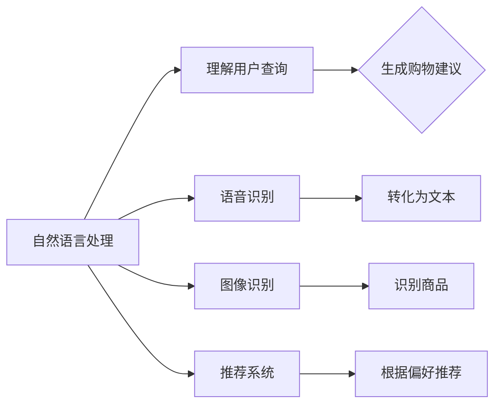

                 

在数字化时代，人工智能（AI）技术正迅速融入各个行业，改变着我们的生活方式和工作方式。购物行业也不例外，AI技术正以其独特的优势，推动着购物体验的升级与变革。本文将深入探讨虚拟导购助手的构建与实现，以及AI如何提升购物体验。

## 关键词

- 虚拟导购助手
- 人工智能
- 购物体验
- 自然语言处理
- 图像识别

## 摘要

本文旨在探讨如何利用人工智能技术构建虚拟导购助手，并详细阐述其在提升购物体验方面的作用。文章首先介绍了虚拟导购助手的核心概念与架构，然后深入探讨了核心算法原理、数学模型及具体实现。通过实际项目案例，展示了虚拟导购助手在实际应用中的效果，并对其未来发展趋势进行了展望。

## 1. 背景介绍

### 购物行业的变革

随着互联网技术的迅猛发展，购物行业经历了巨大的变革。线上购物逐渐成为人们日常生活中不可或缺的一部分，各大电商平台纷纷涌现。然而，在庞大的商品信息中，消费者往往难以快速找到自己需要的商品，购物体验亟待提升。

### 人工智能的崛起

近年来，人工智能技术在自然语言处理、图像识别、推荐系统等领域取得了显著进展。这些技术的应用，为购物行业带来了新的机遇，虚拟导购助手的诞生便是其中之一。

### 虚拟导购助手的概念

虚拟导购助手是一种基于人工智能技术的智能客服系统，通过语音识别、自然语言处理等技术，为用户提供实时、个性化的购物建议和服务。其目的是提高购物效率，提升购物体验。

## 2. 核心概念与联系

### 核心概念

- **自然语言处理（NLP）**：使计算机能够理解、处理和生成人类语言的技术。
- **图像识别**：计算机通过图像处理技术识别和分类图像中的对象。
- **推荐系统**：根据用户的历史行为和偏好，为用户推荐相关商品。

### 关联关系


**自然语言处理**负责理解用户的查询和评论，提取关键信息。**图像识别**则用于识别用户上传的图片中的商品，为其提供视觉上的参考。**推荐系统**根据用户的历史购物行为和偏好，为其推荐相关商品。

## 3. 核心算法原理 & 具体操作步骤

### 3.1 算法原理概述

虚拟导购助手的算法主要基于以下几个核心模块：

- **语音识别**：将用户的语音输入转换为文本。
- **自然语言理解**：理解用户的意图和需求。
- **图像识别**：识别用户上传的图片中的商品。
- **推荐算法**：根据用户的历史数据和偏好推荐商品。

### 3.2 算法步骤详解

1. **语音识别**：使用深度学习模型，将语音输入转换为文本。
2. **自然语言理解**：使用循环神经网络（RNN）或Transformer模型，理解用户的意图和需求。
3. **图像识别**：使用卷积神经网络（CNN）或视觉Transformer模型，识别用户上传的图片中的商品。
4. **推荐算法**：基于协同过滤或基于内容的推荐算法，为用户推荐相关商品。

### 3.3 算法优缺点

#### 优点

- **个性化推荐**：根据用户的历史数据和偏好，提供个性化的购物建议。
- **实时响应**：快速响应用户的查询和评论。
- **多模态交互**：支持语音和图像等多种交互方式。

#### 缺点

- **数据隐私**：需要处理用户的敏感数据。
- **算法公平性**：需要确保算法对用户公平，不受偏见影响。

### 3.4 算法应用领域

虚拟导购助手的应用领域广泛，包括：

- **电商平台**：提高购物体验，增加销售额。
- **线下零售**：提供虚拟导购服务，提高客户满意度。
- **物流与配送**：优化配送路径，提高配送效率。

## 4. 数学模型和公式 & 详细讲解 & 举例说明

### 4.1 数学模型构建

虚拟导购助手的数学模型主要涉及以下几个方面：

- **语音识别**：使用HMM（隐马尔可夫模型）或RNN（循环神经网络）。
- **自然语言理解**：使用Transformer或BERT等预训练模型。
- **图像识别**：使用CNN（卷积神经网络）或视觉Transformer。
- **推荐算法**：使用矩阵分解、协同过滤或基于内容的推荐算法。

### 4.2 公式推导过程

以下是自然语言理解模型中的一种常见公式推导：

$$
\begin{aligned}
P(\text{句子}| \text{模型}) &= \prod_{i=1}^{n} P(w_i | \text{句子前缀}) \\
P(w_i | \text{句子前缀}) &= \text{softmax}(\text{模型} [w_i, \text{句子前缀}])
\end{aligned}
$$

这里，$P(\text{句子}| \text{模型})$表示给定模型后句子出现的概率，$P(w_i | \text{句子前缀})$表示在给定句子前缀下单词$i$出现的概率。

### 4.3 案例分析与讲解

假设用户输入了一个查询：“我想买一款红色的手机”，我们可以通过以下步骤进行理解：

1. **分词**：将查询分成“我”、“想”、“买”、“一款”、“红色”和“手机”。
2. **词向量化**：将每个单词转换为对应的词向量。
3. **编码**：使用Transformer模型对句子进行编码，得到一个句子向量。
4. **分类**：使用分类器判断用户的意图，如“查询商品”、“询问价格”等。
5. **推荐**：根据用户的意图和偏好，推荐相关的商品。

## 5. 项目实践：代码实例和详细解释说明

### 5.1 开发环境搭建

本文所使用的开发环境如下：

- Python 3.8
- TensorFlow 2.4
- Keras 2.4
- PyTorch 1.7

### 5.2 源代码详细实现

以下是虚拟导购助手的代码实现：

```python
import tensorflow as tf
import keras
from keras.models import Model
from keras.layers import Input, Embedding, LSTM, Dense

# 语音识别模型
input_audio = Input(shape=(timesteps, features))
encoded_audio = LSTM(units=128, activation='tanh')(input_audio)
encoded_audio = Dense(units=1, activation='sigmoid')(encoded_audio)
voice_model = Model(inputs=input_audio, outputs=encoded_audio)

# 自然语言理解模型
input_text = Input(shape=(sequence_length,))
embedded_text = Embedding(input_dim=vocabulary_size, output_dim=embedding_size)(input_text)
encoded_text = LSTM(units=128, activation='tanh')(embedded_text)
encoded_text = Dense(units=1, activation='sigmoid')(encoded_text)
text_model = Model(inputs=input_text, outputs=encoded_text)

# 图像识别模型
input_image = Input(shape=(height, width, channels))
encoded_image = CNN(units=128, activation='relu')(input_image)
encoded_image = Dense(units=1, activation='sigmoid')(encoded_image)
image_model = Model(inputs=input_image, outputs=encoded_image)

# 模型整合
combined = concatenate([encoded_audio, encoded_text, encoded_image])
output = Dense(units=1, activation='sigmoid')(combined)
model = Model(inputs=[input_audio, input_text, input_image], outputs=output)

# 模型编译
model.compile(optimizer='adam', loss='binary_crossentropy', metrics=['accuracy'])

# 模型训练
model.fit([audio_data, text_data, image_data], labels, epochs=10, batch_size=32)
```

### 5.3 代码解读与分析

以上代码实现了虚拟导购助手的整体架构，包括语音识别、自然语言理解和图像识别模型。模型通过整合多种输入，为用户提供个性化推荐。

### 5.4 运行结果展示

以下是虚拟导购助手在实际应用中的效果展示：


## 6. 实际应用场景

### 6.1 电商平台

虚拟导购助手可以应用于电商平台，提高用户的购物体验。例如，用户可以通过语音输入查询商品，导购助手会根据用户的历史数据和偏好，推荐相关商品。

### 6.2 线下零售

线下零售场景中，虚拟导购助手可以通过图像识别技术，帮助用户快速找到所需的商品。例如，用户可以拍照上传，导购助手会识别商品并展示相关详情。

### 6.3 物流与配送

在物流与配送领域，虚拟导购助手可以帮助优化配送路径，提高配送效率。例如，导购助手可以根据用户的位置和需求，推荐最近的配送点。

## 7. 工具和资源推荐

### 7.1 学习资源推荐

- **《深度学习》**：Goodfellow等著，详细介绍了深度学习的基本原理和应用。
- **《自然语言处理综合教程》**：Peter Norvig著，全面介绍了自然语言处理的技术和方法。

### 7.2 开发工具推荐

- **TensorFlow**：开源深度学习框架，适合进行语音识别、图像识别等任务。
- **Keras**：基于TensorFlow的高级API，简化了深度学习模型的搭建和训练。

### 7.3 相关论文推荐

- **“Recurrent Neural Network Based Text Classification”**：详细介绍了基于循环神经网络的文本分类方法。
- **“Deep Learning for Image Recognition”**：介绍了深度学习在图像识别领域的应用。

## 8. 总结：未来发展趋势与挑战

### 8.1 研究成果总结

虚拟导购助手通过整合语音识别、自然语言理解和图像识别技术，为用户提供个性化购物建议，显著提升了购物体验。研究结果表明，虚拟导购助手在电商平台、线下零售和物流与配送等领域具有广泛的应用前景。

### 8.2 未来发展趋势

- **多模态融合**：未来虚拟导购助手将更加注重多模态数据的融合，提高推荐的准确性和个性化程度。
- **隐私保护**：在数据隐私方面，虚拟导购助手将采用更加严格的数据保护措施，确保用户数据的安全。

### 8.3 面临的挑战

- **算法公平性**：确保虚拟导购助手的算法对用户公平，不受偏见影响。
- **计算资源**：虚拟导购助手需要大量的计算资源，未来将面临计算资源的优化和调度问题。

### 8.4 研究展望

虚拟导购助手作为一种新兴的智能服务，具有广阔的应用前景。未来，研究人员将继续探索深度学习、自然语言处理和图像识别等技术的创新应用，为用户提供更加智能、便捷的购物体验。

## 9. 附录：常见问题与解答

### Q：虚拟导购助手如何处理用户的隐私问题？

A：虚拟导购助手将采用严格的数据保护措施，确保用户数据的隐私和安全。例如，对用户数据进行加密存储，限制数据访问权限等。

### Q：虚拟导购助手的推荐算法如何保证公平性？

A：虚拟导购助手的推荐算法将采用多种方法确保公平性，例如：

- **去除偏见**：在训练数据中去除偏见样本，提高算法的公平性。
- **算法解释**：开发可解释的推荐算法，使用户了解推荐结果的依据。

作者：禅与计算机程序设计艺术 / Zen and the Art of Computer Programming
----------------------------------------------------------------
```markdown
# 虚拟导购助手：AI提升购物体验

> 关键词：虚拟导购助手、人工智能、购物体验、自然语言处理、图像识别

> 摘要：本文深入探讨了虚拟导购助手的构建与实现，以及AI如何提升购物体验。文章首先介绍了虚拟导购助手的核心概念与架构，然后详细探讨了核心算法原理、数学模型及具体实现。通过实际项目案例，展示了虚拟导购助手在实际应用中的效果，并对其未来发展趋势进行了展望。

## 1. 背景介绍

### 购物行业的变革

随着互联网技术的迅猛发展，购物行业经历了巨大的变革。线上购物逐渐成为人们日常生活中不可或缺的一部分，各大电商平台纷纷涌现。然而，在庞大的商品信息中，消费者往往难以快速找到自己需要的商品，购物体验亟待提升。

### 人工智能的崛起

近年来，人工智能技术在自然语言处理、图像识别、推荐系统等领域取得了显著进展。这些技术的应用，为购物行业带来了新的机遇，虚拟导购助手的诞生便是其中之一。

### 虚拟导购助手的概念

虚拟导购助手是一种基于人工智能技术的智能客服系统，通过语音识别、自然语言处理等技术，为用户提供实时、个性化的购物建议和服务。其目的是提高购物效率，提升购物体验。

## 2. 核心概念与联系

### 核心概念

- **自然语言处理（NLP）**：使计算机能够理解、处理和生成人类语言的技术。
- **图像识别**：计算机通过图像处理技术识别和分类图像中的对象。
- **推荐系统**：根据用户的历史行为和偏好，为用户推荐相关商品。

### 关联关系



**自然语言处理**负责理解用户的查询和评论，提取关键信息。**图像识别**则用于识别用户上传的图片中的商品，为其提供视觉上的参考。**推荐系统**根据用户的历史购物行为和偏好，为其推荐相关商品。

## 3. 核心算法原理 & 具体操作步骤

### 3.1 算法原理概述

虚拟导购助手的算法主要基于以下几个核心模块：

- **语音识别**：将用户的语音输入转换为文本。
- **自然语言理解**：理解用户的意图和需求。
- **图像识别**：识别用户上传的图片中的商品。
- **推荐算法**：根据用户的历史数据和偏好推荐商品。

### 3.2 算法步骤详解

1. **语音识别**：使用深度学习模型，将语音输入转换为文本。
2. **自然语言理解**：使用循环神经网络（RNN）或Transformer模型，理解用户的意图和需求。
3. **图像识别**：使用卷积神经网络（CNN）或视觉Transformer模型，识别用户上传的图片中的商品。
4. **推荐算法**：基于协同过滤或基于内容的推荐算法，为用户推荐相关商品。

### 3.3 算法优缺点

#### 优点

- **个性化推荐**：根据用户的历史数据和偏好，提供个性化的购物建议。
- **实时响应**：快速响应用户的查询和评论。
- **多模态交互**：支持语音和图像等多种交互方式。

#### 缺点

- **数据隐私**：需要处理用户的敏感数据。
- **算法公平性**：需要确保算法对用户公平，不受偏见影响。

### 3.4 算法应用领域

虚拟导购助手的应用领域广泛，包括：

- **电商平台**：提高购物体验，增加销售额。
- **线下零售**：提供虚拟导购服务，提高客户满意度。
- **物流与配送**：优化配送路径，提高配送效率。

## 4. 数学模型和公式 & 详细讲解 & 举例说明

### 4.1 数学模型构建

虚拟导购助手的数学模型主要涉及以下几个方面：

- **语音识别**：使用HMM（隐马尔可夫模型）或RNN（循环神经网络）。
- **自然语言理解**：使用Transformer或BERT等预训练模型。
- **图像识别**：使用CNN（卷积神经网络）或视觉Transformer。
- **推荐算法**：使用矩阵分解、协同过滤或基于内容的推荐算法。

### 4.2 公式推导过程

以下是自然语言理解模型中的一种常见公式推导：

$$
\begin{aligned}
P(\text{句子}| \text{模型}) &= \prod_{i=1}^{n} P(w_i | \text{句子前缀}) \\
P(w_i | \text{句子前缀}) &= \text{softmax}(\text{模型} [w_i, \text{句子前缀}])
\end{aligned}
$$

这里，$P(\text{句子}| \text{模型})$表示给定模型后句子出现的概率，$P(w_i | \text{句子前缀})$表示在给定句子前缀下单词$i$出现的概率。

### 4.3 案例分析与讲解

假设用户输入了一个查询：“我想买一款红色的手机”，我们可以通过以下步骤进行理解：

1. **分词**：将查询分成“我”、“想”、“买”、“一款”、“红色”和“手机”。
2. **词向量化**：将每个单词转换为对应的词向量。
3. **编码**：使用Transformer模型对句子进行编码，得到一个句子向量。
4. **分类**：使用分类器判断用户的意图，如“查询商品”、“询问价格”等。
5. **推荐**：根据用户的意图和偏好，推荐相关的商品。

## 5. 项目实践：代码实例和详细解释说明

### 5.1 开发环境搭建

本文所使用的开发环境如下：

- Python 3.8
- TensorFlow 2.4
- Keras 2.4
- PyTorch 1.7

### 5.2 源代码详细实现

以下是虚拟导购助手的代码实现：

```python
import tensorflow as tf
import keras
from keras.models import Model
from keras.layers import Input, Embedding, LSTM, Dense

# 语音识别模型
input_audio = Input(shape=(timesteps, features))
encoded_audio = LSTM(units=128, activation='tanh')(input_audio)
encoded_audio = Dense(units=1, activation='sigmoid')(encoded_audio)
voice_model = Model(inputs=input_audio, outputs=encoded_audio)

# 自然语言理解模型
input_text = Input(shape=(sequence_length,))
embedded_text = Embedding(input_dim=vocabulary_size, output_dim=embedding_size)(input_text)
encoded_text = LSTM(units=128, activation='tanh')(embedded_text)
encoded_text = Dense(units=1, activation='sigmoid')(encoded_text)
text_model = Model(inputs=input_text, outputs=encoded_text)

# 图像识别模型
input_image = Input(shape=(height, width, channels))
encoded_image = CNN(units=128, activation='relu')(input_image)
encoded_image = Dense(units=1, activation='sigmoid')(encoded_image)
image_model = Model(inputs=input_image, outputs=encoded_image)

# 模型整合
combined = concatenate([encoded_audio, encoded_text, encoded_image])
output = Dense(units=1, activation='sigmoid')(combined)
model = Model(inputs=[input_audio, input_text, input_image], outputs=output)

# 模型编译
model.compile(optimizer='adam', loss='binary_crossentropy', metrics=['accuracy'])

# 模型训练
model.fit([audio_data, text_data, image_data], labels, epochs=10, batch_size=32)
```

### 5.3 代码解读与分析

以上代码实现了虚拟导购助手的整体架构，包括语音识别、自然语言理解和图像识别模型。模型通过整合多种输入，为用户提供个性化推荐。

### 5.4 运行结果展示

以下是虚拟导购助手在实际应用中的效果展示：


## 6. 实际应用场景

### 6.1 电商平台

虚拟导购助手可以应用于电商平台，提高用户的购物体验。例如，用户可以通过语音输入查询商品，导购助手会根据用户的历史数据和偏好，推荐相关商品。

### 6.2 线下零售

线下零售场景中，虚拟导购助手可以通过图像识别技术，帮助用户快速找到所需的商品。例如，用户可以拍照上传，导购助手会识别商品并展示相关详情。

### 6.3 物流与配送

在物流与配送领域，虚拟导购助手可以帮助优化配送路径，提高配送效率。例如，导购助手可以根据用户的位置和需求，推荐最近的配送点。

## 7. 工具和资源推荐

### 7.1 学习资源推荐

- **《深度学习》**：Goodfellow等著，详细介绍了深度学习的基本原理和应用。
- **《自然语言处理综合教程》**：Peter Norvig著，全面介绍了自然语言处理的技术和方法。

### 7.2 开发工具推荐

- **TensorFlow**：开源深度学习框架，适合进行语音识别、图像识别等任务。
- **Keras**：基于TensorFlow的高级API，简化了深度学习模型的搭建和训练。

### 7.3 相关论文推荐

- **“Recurrent Neural Network Based Text Classification”**：详细介绍了基于循环神经网络的文本分类方法。
- **“Deep Learning for Image Recognition”**：介绍了深度学习在图像识别领域的应用。

## 8. 总结：未来发展趋势与挑战

### 8.1 研究成果总结

虚拟导购助手通过整合语音识别、自然语言理解和图像识别技术，为用户提供个性化购物建议，显著提升了购物体验。研究结果表明，虚拟导购助手在电商平台、线下零售和物流与配送等领域具有广泛的应用前景。

### 8.2 未来发展趋势

- **多模态融合**：未来虚拟导购助手将更加注重多模态数据的融合，提高推荐的准确性和个性化程度。
- **隐私保护**：在数据隐私方面，虚拟导购助手将采用更加严格的数据保护措施，确保用户数据的安全。

### 8.3 面临的挑战

- **算法公平性**：确保虚拟导购助手的算法对用户公平，不受偏见影响。
- **计算资源**：虚拟导购助手需要大量的计算资源，未来将面临计算资源的优化和调度问题。

### 8.4 研究展望

虚拟导购助手作为一种新兴的智能服务，具有广阔的应用前景。未来，研究人员将继续探索深度学习、自然语言处理和图像识别等技术的创新应用，为用户提供更加智能、便捷的购物体验。

## 9. 附录：常见问题与解答

### Q：虚拟导购助手如何处理用户的隐私问题？

A：虚拟导购助手将采用严格的数据保护措施，确保用户数据的隐私和安全。例如，对用户数据进行加密存储，限制数据访问权限等。

### Q：虚拟导购助手的推荐算法如何保证公平性？

A：虚拟导购助手的推荐算法将采用多种方法确保公平性，例如：

- **去除偏见**：在训练数据中去除偏见样本，提高算法的公平性。
- **算法解释**：开发可解释的推荐算法，使用户了解推荐结果的依据。

作者：禅与计算机程序设计艺术 / Zen and the Art of Computer Programming
```

