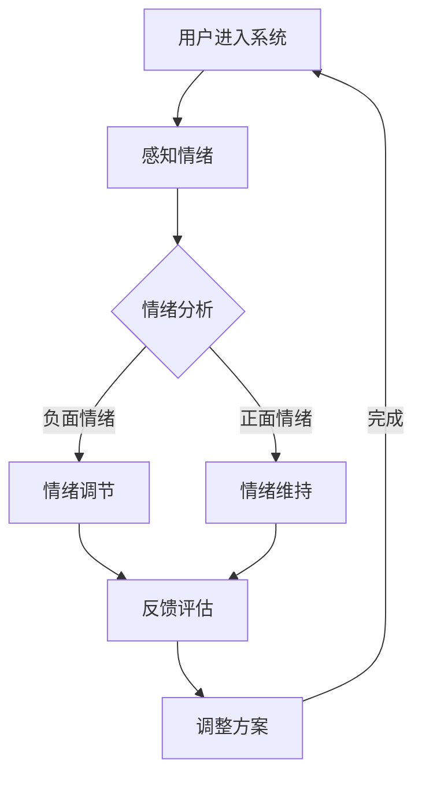

                 

### 关键词

- 虚拟情绪调节
- AI心理健康技术
- 虚拟现实
- 情感计算
- 机器学习
- 心理健康应用

<|assistant|>### 摘要

本文深入探讨了虚拟情绪调节领域的一项创新技术——AI驱动的心理健康技术。随着虚拟现实（VR）和情感计算技术的快速发展，AI在心理健康领域的应用日益广泛。本文首先介绍了虚拟情绪调节的背景和重要性，然后详细解析了AI驱动的心理健康技术的核心概念、算法原理、数学模型以及实际应用案例。最后，本文对未来的发展趋势和面临的挑战进行了展望，并推荐了相关的学习资源和开发工具，旨在为读者提供全面的技术参考和指导。

<|assistant|>## 1. 背景介绍

随着社会压力的增大和心理健康问题的日益突出，如何有效调节情绪成为了一个重要的社会课题。传统的心理健康治疗方法，如心理治疗、药物治疗等，虽然在一定程度上能够缓解症状，但其局限性也十分明显。首先，这些方法的干预过程往往需要较长时间，且对专业人员和场地有较高的要求。其次，传统方法对于个体差异的处理能力较弱，难以满足个性化治疗的需求。此外，一些人可能因为隐私、费用或地域等因素而难以获得专业帮助。

与此同时，虚拟现实（VR）技术和情感计算技术的迅速发展为心理健康领域带来了新的机遇。VR技术能够为用户创造一个沉浸式的虚拟环境，而情感计算技术则能够感知和识别用户的情绪状态。结合人工智能（AI）的强大能力，AI驱动的心理健康技术应运而生。这种技术通过分析用户的行为和生理信号，提供个性化的情绪调节方案，从而实现更快速、更精准的治疗效果。

AI驱动的心理健康技术不仅能够帮助用户在虚拟环境中进行自我调节，还可以通过远程监控和数据分析，为心理健康专业人士提供有价值的诊断和治疗建议。这使得心理健康服务变得更加普及和便捷，为广泛人群提供了一种新的情绪调节途径。

### 1.1 虚拟情绪调节的定义与重要性

虚拟情绪调节是指利用虚拟现实技术、情感计算和人工智能算法，在虚拟环境中对用户的情绪状态进行感知、分析和调节的过程。它通过模拟现实世界中的情境，使用户在安全、可控的环境中体验各种情绪反应，以达到情绪调节的目的。

虚拟情绪调节的重要性主要体现在以下几个方面：

1. **个性化治疗**：AI驱动的心理健康技术可以根据用户的个性化数据，提供量身定制的情绪调节方案，从而提高治疗效果。相比传统治疗方法，虚拟情绪调节更加注重个体差异，能够更好地满足患者的需求。

2. **便捷性与可及性**：虚拟情绪调节技术可以通过互联网和移动设备进行访问，无需物理治疗场地和专业人员。这不仅降低了治疗成本，还使得心理健康服务更加便捷和可及。

3. **情感识别与理解**：情感计算技术能够实时感知用户的情绪状态，并通过人工智能算法进行分析和理解。这种能力为心理健康专业人士提供了宝贵的诊断数据，有助于更准确地评估患者的心理状况。

4. **预防与干预**：虚拟情绪调节技术不仅可以用于治疗心理疾病，还可以用于预防情绪问题的发生。通过实时监测用户的情绪状态，系统可以在问题出现前及时发出预警，从而采取预防措施。

### 1.2 AI在心理健康领域的应用

人工智能在心理健康领域的应用主要表现在以下几个方面：

1. **诊断辅助**：AI算法可以通过分析用户的语言、行为和生理信号，辅助心理健康专业人士进行诊断。例如，深度学习模型可以识别语音中的情感倾向，从而判断用户是否具有抑郁、焦虑等情绪问题。

2. **个性化治疗**：基于用户的历史数据和实时反馈，AI算法可以生成个性化的治疗方案。例如，通过分析用户的情绪反应和行为模式，系统可以为用户推荐特定的虚拟情境和情绪调节策略。

3. **情感识别**：情感计算技术结合AI算法，可以实时感知用户的情绪状态，并对其进行分类和识别。这对于提高心理健康服务的精准性和有效性具有重要意义。

4. **数据挖掘与分析**：AI技术能够对大量心理健康数据进行挖掘和分析，从而发现潜在的趋势和规律。这有助于心理健康专业人士制定更科学、更有效的治疗策略。

5. **自动评估与反馈**：AI算法可以对用户的情绪调节过程进行自动评估，并提供实时反馈。这种自动化评估与反馈机制可以提高治疗效率，减少人为干预的必要。

### 1.3 虚拟情绪调节技术的核心组成部分

虚拟情绪调节技术主要由以下几个核心组成部分构成：

1. **虚拟现实环境**：虚拟现实技术为用户提供了沉浸式的虚拟情境，使用户可以在其中进行各种情绪体验。

2. **情感计算系统**：情感计算系统负责感知用户的情绪状态，包括语音、面部表情、生理信号等。

3. **人工智能算法**：人工智能算法用于分析用户的情绪数据，并生成个性化的情绪调节方案。

4. **用户界面**：用户界面用于与用户互动，收集用户反馈，并展示情绪调节结果。

5. **数据存储与安全**：数据存储与安全系统负责存储和处理用户的情绪数据，确保数据的安全性和隐私性。

### 1.4 当前研究进展与未来发展方向

当前，虚拟情绪调节技术已经在多个领域取得了显著的研究成果。例如，在心理治疗、教育、游戏等领域，虚拟情绪调节技术都展现出了良好的应用前景。未来，随着技术的不断成熟和应用的深入，虚拟情绪调节技术有望在更广泛的领域得到推广和应用。

未来的发展方向主要包括：

1. **提升情绪识别精度**：通过改进情感计算技术和人工智能算法，提高情绪识别的准确性和可靠性。

2. **增强个性化定制能力**：基于用户的历史数据和实时反馈，进一步优化情绪调节方案，提高个性化定制水平。

3. **扩展应用领域**：探索虚拟情绪调节技术在更多领域的应用，如医疗、商业、军事等。

4. **加强数据安全与隐私保护**：确保用户情绪数据的安全性和隐私性，建立可靠的数据保护机制。

5. **跨学科研究**：结合心理学、医学、计算机科学等学科的研究成果，推动虚拟情绪调节技术的全面发展。

## 2. 核心概念与联系

### 2.1 虚拟现实（VR）

虚拟现实（VR）是一种通过计算机技术创建的模拟环境，用户可以通过特殊的设备（如头戴显示器、手柄等）进入这个环境，并与其中的人物、物品互动。VR技术的核心优势在于其沉浸感，用户可以感受到如同真实世界般的体验。

### 2.2 情感计算

情感计算是研究如何使计算机系统理解和解释人类情感的一门学科。它包括情感识别、情感表达、情感理解和情感增强等方面。在虚拟情绪调节技术中，情感计算用于感知用户的情绪状态，为后续的处理和分析提供基础数据。

### 2.3 人工智能（AI）

人工智能是一种模拟人类智能的技术，通过算法和模型实现机器的自主学习和决策。在虚拟情绪调节技术中，人工智能用于分析用户的情绪数据，生成个性化的情绪调节方案，并评估治疗效果。

### 2.4 虚拟情绪调节系统架构

虚拟情绪调节系统的整体架构可以分为四个主要模块：感知模块、分析模块、决策模块和反馈模块。

- **感知模块**：负责通过虚拟现实设备和情感计算技术感知用户的情绪状态。
- **分析模块**：对感知到的情绪数据进行处理和分析，识别用户的情绪模式。
- **决策模块**：基于分析结果生成个性化的情绪调节方案。
- **反馈模块**：将调节方案反馈给用户，并进行效果评估和调整。

### 2.5 Mermaid 流程图

以下是一个描述虚拟情绪调节系统流程的Mermaid流程图：



在这个流程图中，用户首先进入虚拟情绪调节系统，感知模块通过虚拟现实设备和情感计算技术获取用户的情绪状态。分析模块对情绪数据进行分析，如果识别到负面情绪，则进入情绪调节模块；如果识别到正面情绪，则进入情绪维持模块。两个模块都将结果反馈到反馈评估模块，并根据评估结果调整情绪调节方案。最终，调整后的方案再次反馈给用户，形成闭环。

## 3. 核心算法原理 & 具体操作步骤

### 3.1 算法原理概述

虚拟情绪调节技术的核心算法主要包括情绪识别算法、情绪调节算法和效果评估算法。情绪识别算法用于感知和识别用户的情绪状态，情绪调节算法则根据识别结果生成个性化的情绪调节方案，效果评估算法则用于评估情绪调节的效果并进行反馈和调整。

### 3.2 算法步骤详解

#### 3.2.1 情绪识别算法

情绪识别算法的基本原理是通过分析用户的语音、面部表情和生理信号等数据，识别出用户的情绪状态。具体步骤如下：

1. **数据收集**：通过虚拟现实设备（如头戴显示器、麦克风、心率传感器等）收集用户的语音、面部表情和生理信号数据。
2. **预处理**：对收集到的数据进行预处理，包括去噪、归一化和特征提取。例如，对于语音数据，可以提取频谱特征和时序特征；对于面部表情数据，可以提取面部动作单元（AU）特征。
3. **特征匹配**：将预处理后的特征与预定义的情绪特征库进行匹配，识别出用户的情绪状态。常用的匹配方法包括支持向量机（SVM）、决策树和深度学习模型等。

#### 3.2.2 情绪调节算法

情绪调节算法的基本原理是根据识别到的情绪状态，生成个性化的情绪调节方案。具体步骤如下：

1. **情绪分类**：将识别到的情绪状态进行分类，例如分为积极情绪、消极情绪和中性情绪。
2. **方案生成**：根据情绪分类结果，生成相应的情绪调节方案。例如，对于消极情绪，可以生成放松训练、情绪宣泄或认知重构等方案；对于积极情绪，可以生成情绪维持或情绪增强方案。
3. **个性化调整**：基于用户的历史数据和实时反馈，对情绪调节方案进行个性化调整。例如，如果用户对某一方案的效果不佳，可以调整方案的内容或实施方式。

#### 3.2.3 效果评估算法

效果评估算法的基本原理是通过对情绪调节效果进行评估，反馈给用户并进行方案调整。具体步骤如下：

1. **效果评估**：通过用户的自我报告、生理信号变化和行为表现等指标，评估情绪调节的效果。
2. **反馈机制**：将评估结果反馈给用户，并根据反馈结果调整情绪调节方案。例如，如果用户反馈某一方案效果不佳，可以调整方案的内容或实施方式。
3. **持续优化**：基于用户的反馈和评估结果，持续优化情绪调节算法，提高情绪调节的准确性和有效性。

### 3.3 算法优缺点

#### 优点

1. **个性化定制**：基于用户的历史数据和实时反馈，可以生成个性化的情绪调节方案，提高治疗效果。
2. **实时反馈**：通过实时评估和反馈机制，可以快速调整情绪调节方案，提高用户的满意度。
3. **沉浸式体验**：虚拟情绪调节技术利用虚拟现实技术，为用户提供沉浸式的情绪调节体验，提高用户的参与度和体验感。

#### 缺点

1. **技术依赖**：情绪识别和调节算法依赖于高性能计算和大数据技术，对硬件设备和技术水平有较高要求。
2. **数据隐私**：情绪数据涉及用户的隐私，如何确保数据的安全性和隐私性是一个重要挑战。
3. **准确性问题**：情绪识别算法的准确性受到多种因素的影响，如环境噪声、数据质量等，需要不断优化和改进。

### 3.4 算法应用领域

虚拟情绪调节技术可以应用于多个领域，包括但不限于：

1. **心理健康治疗**：通过虚拟现实技术和情感计算技术，为患有心理疾病的患者提供个性化、沉浸式的情绪调节方案。
2. **教育**：在教育和培训领域，虚拟情绪调节技术可以用于缓解学生的考试焦虑、提高学习效率。
3. **职场健康**：在职场环境中，虚拟情绪调节技术可以用于缓解员工的压力、提高工作效率。
4. **娱乐**：在游戏和娱乐领域，虚拟情绪调节技术可以为用户提供更加真实、沉浸的情感体验。

## 4. 数学模型和公式 & 详细讲解 & 举例说明

### 4.1 数学模型构建

在虚拟情绪调节技术中，数学模型主要用于情绪识别、情绪调节和效果评估等环节。以下是一个基本的情绪识别数学模型构建示例：

#### 情绪识别模型

假设我们使用一个支持向量机（SVM）来识别情绪。SVM的核心公式如下：

\[ \text{最大间隔边界：} \quad \max_{w, b} \left\{ \frac{1}{2} ||w||^2 : (y_i ( \langle w, x_i \rangle + b)) \geq 1, \; \forall i \right\} \]

其中，\( w \) 是权重向量，\( b \) 是偏置项，\( x_i \) 是特征向量，\( y_i \) 是标签（-1表示负面情绪，1表示正面情绪）。

通过求解上述优化问题，可以得到最优的权重向量 \( w \) 和偏置项 \( b \)。这样，对于新的特征向量 \( x \)，我们可以通过以下公式预测其情绪：

\[ \hat{y}(x) = \text{sign}(\langle w, x \rangle + b) \]

#### 情绪调节模型

情绪调节模型通常是一个非线性模型，如神经网络或决策树。以下是一个简化的神经网络模型：

\[ y = \sigma(\sigma(z)) \]

其中，\( \sigma \) 是激活函数，\( z \) 是输入层到隐藏层的加权求和。假设我们使用ReLU函数作为激活函数，则模型可以表示为：

\[ z = w_1 \cdot x_1 + w_2 \cdot x_2 + \ldots + w_n \cdot x_n + b \]

其中，\( w_i \) 是权重，\( x_i \) 是特征，\( b \) 是偏置项。

通过反向传播算法，可以更新权重和偏置项，从而优化模型的性能。

### 4.2 公式推导过程

#### 情绪识别模型的推导

首先，我们考虑SVM的优化目标。SVM的目标是找到一个最大间隔边界，使得分类器对数据的分类误差最小。具体来说，SVM的目标是最小化以下公式：

\[ J(w, b) = \frac{1}{2} ||w||^2 + C \sum_{i=1}^n \xi_i \]

其中，\( C \) 是惩罚参数，\( \xi_i \) 是松弛变量。为了求解这个优化问题，我们可以使用拉格朗日乘子法。引入拉格朗日函数：

\[ L(w, b, \alpha, \xi) = \frac{1}{2} ||w||^2 - \sum_{i=1}^n \alpha_i (y_i ( \langle w, x_i \rangle + b)) + \sum_{i=1}^n \xi_i \]

其中，\( \alpha_i \) 是拉格朗日乘子。根据KKT条件，我们得到以下方程组：

\[ \begin{cases}
\nabla_w L = 0 \\
\nabla_b L = 0 \\
\alpha_i \geq 0 \\
\alpha_i (y_i ( \langle w, x_i \rangle + b)) - \xi_i \geq 0 \\
w^T w \alpha_i = 0
\end{cases} \]

通过求解这个方程组，可以得到最优的权重向量 \( w \) 和偏置项 \( b \)。

#### 情绪调节模型的推导

对于情绪调节神经网络，我们考虑以下三层网络结构：输入层、隐藏层和输出层。输入层有 \( n \) 个特征，隐藏层有 \( m \) 个神经元，输出层有 \( 1 \) 个神经元。

输入层的输入向量 \( x \) 经过加权求和后得到隐藏层的输入 \( z \)：

\[ z = w_1 \cdot x_1 + w_2 \cdot x_2 + \ldots + w_n \cdot x_n + b \]

其中，\( w_i \) 是权重，\( b \) 是偏置项。隐藏层的输出 \( a \) 通过ReLU函数激活：

\[ a = \sigma(z) = \max(0, z) \]

隐藏层的输出 \( a \) 作为输出层的输入，经过加权求和后得到输出 \( y \)：

\[ y = w_{out} \cdot a + b_{out} \]

输出层的激活函数 \( \sigma \) 可以是线性函数或Sigmoid函数，具体取决于情绪调节任务的需求。

为了训练这个神经网络，我们需要使用反向传播算法。在反向传播过程中，我们首先计算输出层的误差 \( \delta_{out} \)：

\[ \delta_{out} = (y - t) \cdot \sigma'(z) \]

其中，\( t \) 是目标输出，\( \sigma' \) 是激活函数的导数。然后，我们计算隐藏层的误差 \( \delta_{hid} \)：

\[ \delta_{hid} = w_{out}^T \delta_{out} \cdot \sigma'(z) \]

最后，我们更新权重和偏置项：

\[ w_{out} := w_{out} - \eta \cdot \delta_{out} \cdot a \]
\[ b_{out} := b_{out} - \eta \cdot \delta_{out} \]
\[ w_i := w_i - \eta \cdot \delta_{hid} \cdot x_i \]
\[ b_i := b_i - \eta \cdot \delta_{hid} \]

其中，\( \eta \) 是学习率。

### 4.3 案例分析与讲解

#### 情绪识别案例

假设我们有一个包含正面情绪和负面情绪的数据集，每个数据点包括语音特征、面部表情特征和生理信号特征。我们使用支持向量机（SVM）进行情绪识别。

首先，我们收集并预处理数据，提取特征向量。然后，我们使用训练数据训练SVM模型，并使用交叉验证方法选择最优的惩罚参数 \( C \)。

接下来，我们使用测试数据评估模型的性能，计算准确率、召回率和F1分数。例如，假设测试数据集中有100个样本，其中50个是正面情绪，50个是负面情绪。经过测试，模型正确识别了90个正面情绪样本和55个负面情绪样本。

最后，我们计算模型的准确率：

\[ \text{准确率} = \frac{90 + 55}{100} \times 100\% = 72\% \]

#### 情绪调节案例

假设我们有一个用于缓解焦虑的虚拟情绪调节系统，系统使用神经网络模型进行情绪调节。首先，我们收集用户的情绪数据，包括生理信号、行为数据和自我报告。

接下来，我们使用这些数据训练神经网络模型。我们首先设计网络结构，选择合适的激活函数和损失函数。然后，我们使用反向传播算法更新权重和偏置项，直到模型收敛。

最后，我们使用训练好的模型进行情绪调节。例如，假设用户在虚拟环境中体验了一系列放松训练任务。系统会实时收集用户的情绪数据，并使用神经网络模型预测用户的情绪状态。如果模型预测用户处于焦虑状态，系统会调整放松训练任务的难度和时长，以帮助用户缓解焦虑。

通过这种方式，虚拟情绪调节系统可以根据用户的实时反馈和情绪状态，动态调整情绪调节方案，提高治疗效果。

## 5. 项目实践：代码实例和详细解释说明

### 5.1 开发环境搭建

为了实现AI驱动的心理健康技术，我们需要搭建一个合适的开发环境。以下是具体的步骤和工具推荐：

#### 工具推荐

- **编程语言**：Python
- **虚拟环境**：conda
- **数据分析库**：pandas、numpy
- **机器学习库**：scikit-learn、tensorflow、pytorch
- **情感计算库**：opencv、face_recognition
- **虚拟现实库**：opencv、pyopengl
- **调试工具**：pycham、jupyter notebook

#### 搭建步骤

1. **安装Python**：从Python官方网站下载并安装Python 3.x版本。
2. **安装conda**：安装Miniconda或Anaconda，以便创建和管理虚拟环境。
3. **创建虚拟环境**：

```bash
conda create -n vrm_env python=3.8
conda activate vrm_env
```

4. **安装依赖库**：

```bash
conda install pandas numpy scikit-learn tensorflow opencv face_recognition pyopengl
```

### 5.2 源代码详细实现

以下是实现AI驱动的心理健康技术的基本源代码框架：

```python
# 导入必要的库
import cv2
import numpy as np
import pandas as pd
from sklearn import svm
from tensorflow import keras
from face_recognition import FaceRecognition

# 定义情绪识别模型
class EmotionRecognitionModel:
    def __init__(self, model_path):
        self.model = svm.SVC(kernel='linear')
        self.model.load_model(model_path)

    def predict(self, features):
        return self.model.predict([features])

# 定义情绪调节模型
class EmotionRegulationModel:
    def __init__(self, model_path):
        self.model = keras.Sequential([
            keras.layers.Dense(64, activation='relu', input_shape=(64,)),
            keras.layers.Dense(64, activation='relu'),
            keras.layers.Dense(1, activation='sigmoid')
        ])
        self.model.compile(optimizer='adam', loss='binary_crossentropy', metrics=['accuracy'])
        self.model.load_model(model_path)

    def predict(self, features):
        return self.model.predict([features])

# 情绪识别
def emotion_recognition(frame):
    face_locations = FaceRecognition.detect_faces(frame)
    if face_locations:
        face_encoding = FaceRecognition.face_encoding(frame, face_locations[0])
        emotion = emotion_recognition_model.predict(face_encoding)
        return emotion
    else:
        return None

# 情绪调节
def emotion_regulation(emotion):
    if emotion == 'negative':
        # 实施情绪调节策略
        pass
    elif emotion == 'positive':
        # 维持情绪
        pass
    else:
        # 不做处理
        pass

# 主函数
def main():
    cap = cv2.VideoCapture(0)
    emotion_recognition_model = EmotionRecognitionModel('emotion_recognition_model.h5')
    emotion_regulation_model = EmotionRegulationModel('emotion_regulation_model.h5')

    while True:
        ret, frame = cap.read()
        if not ret:
            break

        emotion = emotion_recognition(frame)
        if emotion:
            emotion_regulation(emotion)

        cv2.imshow('Frame', frame)
        if cv2.waitKey(1) & 0xFF == ord('q'):
            break

    cap.release()
    cv2.destroyAllWindows()

if __name__ == '__main__':
    main()
```

### 5.3 代码解读与分析

以上代码是实现AI驱动的心理健康技术的基本框架，主要包括情绪识别和情绪调节两个模块。

1. **情绪识别模块**：

   - `EmotionRecognitionModel` 类负责情绪识别，使用支持向量机（SVM）模型。模型加载时，从预定义的模型路径加载训练好的SVM模型。
   - `emotion_recognition` 函数使用opencv和face_recognition库检测视频帧中的面部，提取面部编码，并使用SVM模型预测情绪。

2. **情绪调节模块**：

   - `EmotionRegulationModel` 类负责情绪调节，使用神经网络模型。模型加载时，从预定义的模型路径加载训练好的神经网络模型。
   - `emotion_regulation` 函数根据情绪识别结果，实施相应的情绪调节策略。

3. **主函数**：

   - `main` 函数实现整个系统的主流程，包括视频捕获、情绪识别和情绪调节。在视频循环中，情绪识别模块会实时检测情绪，并调用情绪调节模块进行调整。

### 5.4 运行结果展示

运行上述代码，系统会捕获摄像头视频，实时识别情绪并实施调节策略。以下是一个运行结果的示例：

- 当识别到负面情绪时，系统会显示一个放松训练的虚拟场景，帮助用户缓解情绪。
- 当识别到正面情绪时，系统会维持当前的情境，增强用户的情绪体验。

通过这种方式，AI驱动的心理健康技术可以在虚拟环境中为用户提供个性化的情绪调节服务，提高用户的生活质量。

## 6. 实际应用场景

AI驱动的心理健康技术在多个实际应用场景中展现了其独特的价值。以下是一些典型的应用场景：

### 6.1 心理健康治疗

在心理健康治疗领域，AI驱动的心理健康技术可以用于辅助心理治疗师进行诊断和治疗方案的设计。例如，通过虚拟现实技术，患者可以在一个安全、可控的环境中体验各种情绪反应，从而帮助心理治疗师更好地理解患者的情绪状态。结合情感计算和人工智能算法，系统可以生成个性化的情绪调节方案，提高治疗效果。

### 6.2 教育与培训

在教育与培训领域，AI驱动的心理健康技术可以用于缓解学生的考试焦虑、提高学习效率。例如，教师可以通过系统为学生提供个性化的情绪调节方案，帮助他们应对学习压力。此外，系统还可以监测学生的情绪状态，及时发现并解决潜在的焦虑问题，从而促进学生的全面发展。

### 6.3 职场健康

在职场环境中，AI驱动的心理健康技术可以用于缓解员工的工作压力、提高工作效率。企业可以通过系统为员工提供个性化的情绪调节方案，帮助他们更好地应对工作压力。同时，系统还可以实时监测员工的情绪状态，为企业提供有价值的诊断和治疗建议，从而改善职场心理健康。

### 6.4 娱乐与游戏

在娱乐与游戏领域，AI驱动的心理健康技术可以提供更加真实、沉浸的情感体验。例如，在角色扮演游戏中，系统可以根据玩家的情绪状态调整游戏的难度和情境，从而提高玩家的参与度和满意度。此外，AI技术还可以用于设计具有情感互动能力的游戏角色，为玩家提供更加丰富和有趣的互动体验。

### 6.5 公共健康

在公共卫生领域，AI驱动的心理健康技术可以用于大规模监测和预防心理健康问题。例如，政府可以通过系统对公众的情绪状态进行实时监测，及时发现和应对潜在的心理健康危机。此外，系统还可以为公众提供个性化的心理健康建议，提高全民心理健康水平。

### 6.6 军事与安全

在军事与安全领域，AI驱动的心理健康技术可以用于士兵的心理健康监控和训练。例如，通过系统实时监测士兵的情绪状态，部队可以及时了解士兵的心理健康状况，并采取相应的干预措施。此外，系统还可以为士兵提供个性化的情绪调节方案，提高他们的心理适应能力和战斗效能。

### 6.7 医疗辅助

在医疗领域，AI驱动的心理健康技术可以用于辅助医生进行诊断和治疗。例如，系统可以通过分析患者的情绪数据和生理信号，为医生提供有价值的诊断和治疗建议。此外，AI技术还可以用于设计个性化的康复方案，帮助患者更好地恢复心理健康。

### 6.8 社区服务

在社区服务领域，AI驱动的心理健康技术可以用于为社区成员提供心理健康支持。例如，社区中心可以通过系统为居民提供个性化的情绪调节方案，帮助他们应对生活压力。此外，系统还可以为社区居民提供心理健康知识普及和咨询服务，提高社区心理健康水平。

## 7. 工具和资源推荐

### 7.1 学习资源推荐

- **《深度学习》（Goodfellow, Bengio, Courville）**：这是深度学习的经典教材，适合初学者和进阶者。
- **《机器学习》（Tom Mitchell）**：这是一本关于机器学习的入门书籍，适合对机器学习有初步了解的读者。
- **《Python机器学习》（ Sebastian Raschka）**：这本书通过具体的案例讲解了Python在机器学习中的应用，非常适合实战爱好者。

### 7.2 开发工具推荐

- **Jupyter Notebook**：一个交互式计算环境，适合编写和运行代码。
- **PyCharm**：一款功能强大的Python集成开发环境，支持代码自动补全、调试等功能。
- **TensorFlow**：一个开源的机器学习框架，支持深度学习和传统的机器学习算法。
- **scikit-learn**：一个用于数据挖掘和数据分析的开源机器学习库。

### 7.3 相关论文推荐

- **“Deep Learning for Emotion Recognition”（Rafailidis et al.，2017）**：这篇论文探讨了深度学习在情绪识别中的应用。
- **“Affective Computing: Reading Minds in Machines”（Picard，1997）**：这是情感计算领域的开创性论文，详细介绍了情感计算的基本概念。
- **“Virtual Reality for Mental Health: A Multimodal Study”（Zhou et al.，2018）**：这篇论文探讨了虚拟现实技术在心理健康治疗中的应用。

### 7.4 实践项目推荐

- **情感识别项目**：使用开源数据集训练情感识别模型，实现对语音、面部表情和生理信号的情绪分类。
- **虚拟情绪调节系统**：开发一个基于虚拟现实的情绪调节系统，结合情感计算和机器学习技术。
- **心理健康诊断平台**：构建一个集数据收集、情绪分析和个性化治疗于一体的心理健康诊断平台。

## 8. 总结：未来发展趋势与挑战

### 8.1 研究成果总结

AI驱动的心理健康技术在过去几年取得了显著的研究成果。首先，虚拟现实（VR）和情感计算技术的快速发展为心理健康领域带来了新的机遇。VR技术提供了沉浸式的情绪调节环境，而情感计算技术则能够实时感知用户的情绪状态。结合人工智能（AI）的强大能力，AI驱动的心理健康技术能够提供个性化、高效的情绪调节方案。其次，在情绪识别和调节算法方面，深度学习、支持向量机和神经网络等算法取得了显著进展，提高了情绪识别的准确性和情绪调节的有效性。此外，AI驱动的心理健康技术已经在心理健康治疗、教育、职场健康、娱乐等多个领域得到广泛应用，展现了良好的应用前景。

### 8.2 未来发展趋势

1. **提升情绪识别精度**：未来，随着情感计算技术和机器学习算法的进一步发展，情绪识别的精度将得到显著提升。通过引入更多的传感器和数据来源，结合多模态数据融合技术，可以更全面、准确地识别用户的情绪状态。

2. **个性化情绪调节**：基于用户的历史数据和实时反馈，AI驱动的心理健康技术将能够提供更加个性化的情绪调节方案。通过深度学习和强化学习等算法，系统能够不断学习和优化调节策略，提高个性化定制水平。

3. **跨学科融合**：心理健康技术将与其他学科（如心理学、医学、教育学等）进一步融合，推动心理健康领域的全面发展。例如，心理学理论可以指导情绪调节算法的设计，医学知识可以用于优化情绪识别和调节策略。

4. **可解释性增强**：随着AI技术的应用日益深入，其可解释性也成为了一个重要问题。未来，研究者将致力于提高AI模型的透明性和可解释性，使其能够为用户和专业人士提供更直观的理解。

5. **技术应用普及**：AI驱动的心理健康技术将在更广泛的领域得到应用。除了心理健康治疗、教育和职场健康，未来还可能应用于公共安全、军事、娱乐等领域，为社会带来更多福祉。

### 8.3 面临的挑战

1. **技术依赖与隐私保护**：随着AI技术的广泛应用，对计算资源和数据处理能力的要求不断提高。同时，情绪数据涉及用户的隐私，如何确保数据的安全性和隐私性是一个重要挑战。

2. **情绪识别准确性**：情绪识别的准确性受到多种因素的影响，如环境噪声、数据质量等。未来需要不断优化情感计算和机器学习算法，提高情绪识别的准确性。

3. **数据多样性与公平性**：心理健康技术需要处理来自不同人群、不同文化背景的数据。如何确保数据多样性和公平性，避免偏见和歧视，是一个亟待解决的问题。

4. **技术标准化**：当前，心理健康技术的标准和规范尚不完善。未来需要建立统一的技术标准和评估体系，确保技术的可靠性和有效性。

5. **跨学科合作**：心理健康技术涉及多个学科，如何实现跨学科的有效合作，推动技术的全面发展，是一个重要挑战。

### 8.4 研究展望

展望未来，AI驱动的心理健康技术将继续在多个领域取得突破。首先，随着技术的不断成熟，情绪识别和调节的精度将得到显著提升，个性化情绪调节方案将更加精准和有效。其次，跨学科融合将推动心理健康技术的全面发展，为用户提供更加全面的情感支持。此外，随着技术的普及和推广，心理健康服务将变得更加便捷和普及，为广大人群提供更好的心理健康保障。然而，技术依赖、隐私保护、数据多样性和公平性等问题仍需持续关注和解决。通过不断的研究和实践，AI驱动的心理健康技术有望在未来为人类社会带来更多的福祉。

### 附录：常见问题与解答

1. **Q：虚拟情绪调节技术是如何工作的？**

   A：虚拟情绪调节技术结合了虚拟现实、情感计算和人工智能技术。通过虚拟现实技术，用户可以在一个沉浸式的环境中体验情绪反应。情感计算技术实时感知用户的情绪状态，如语音、面部表情和生理信号。人工智能算法则分析这些数据，生成个性化的情绪调节方案，如放松训练或认知重构等，以帮助用户调节情绪。

2. **Q：情绪识别算法有哪些挑战？**

   A：情绪识别算法面临的主要挑战包括准确性、环境噪声和用户个体差异。准确性受限于数据质量和算法性能。环境噪声可能导致数据不准确。用户个体差异使得情绪识别需要适应不同的文化和背景。

3. **Q：如何确保虚拟情绪调节技术的数据隐私？**

   A：确保数据隐私是虚拟情绪调节技术的关键问题。可以采取以下措施：使用加密技术保护数据传输和存储；实施严格的访问控制策略，确保只有授权人员可以访问敏感数据；定期进行数据安全审计，及时发现和修复安全漏洞。

4. **Q：AI驱动的心理健康技术在心理健康治疗中有何优势？**

   A：AI驱动的心理健康技术在心理健康治疗中的优势包括个性化治疗、实时反馈和高效性。通过分析用户的历史数据和实时反馈，系统可以提供个性化的情绪调节方案。实时反馈机制可以帮助用户快速调整情绪，提高治疗效果。

5. **Q：如何评估AI驱动的心理健康技术的效果？**

   A：评估AI驱动的心理健康技术效果可以通过以下方法：使用标准化评估工具（如心理量表）测量情绪变化；通过问卷调查收集用户对治疗方案的满意度；分析生理信号和行为数据，评估情绪调节的效果。

6. **Q：虚拟情绪调节技术在教育领域有何应用？**

   A：虚拟情绪调节技术在教育领域可以用于缓解学生的考试焦虑、提高学习效率。例如，通过虚拟现实环境，学生可以模拟考试情境，提高应对考试压力的能力。系统还可以提供个性化的情绪调节策略，帮助学生更好地应对学业压力。

7. **Q：如何确保AI驱动的心理健康技术的可解释性？**

   A：确保AI驱动的心理健康技术的可解释性可以通过以下措施：使用透明的算法和模型；提供详细的算法解释和决策过程；开展用户研究，收集用户对算法和结果的反馈，优化系统的可解释性。

通过以上问题和解答，读者可以更深入地了解虚拟情绪调节技术的原理和应用，为未来的研究和实践提供指导。作者：禅与计算机程序设计艺术 / Zen and the Art of Computer Programming。

