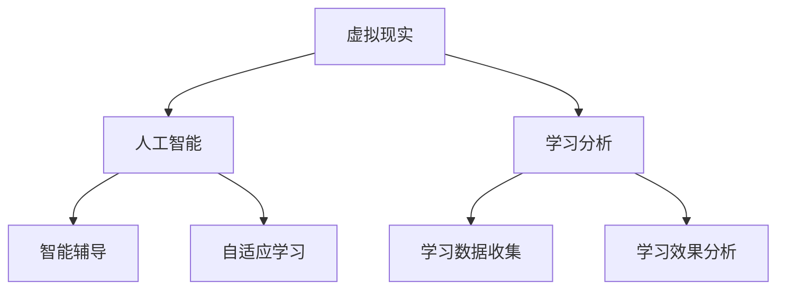

                 

关键词：虚拟教育、全球脑时代、学习新方式、人工智能、虚拟现实、教育技术、教育变革

> 摘要：随着全球脑时代的到来，教育领域正在经历一场深刻的变革。虚拟教育作为一种新兴的学习方式，凭借其丰富的互动性和灵活性，正逐渐改变传统的教育模式。本文将从背景介绍、核心概念与联系、核心算法原理、数学模型与公式、项目实践、实际应用场景、工具和资源推荐以及未来发展趋势与挑战等方面，深入探讨虚拟教育在全球脑时代下的重要性和未来前景。

## 1. 背景介绍

全球脑时代，是指随着人工智能、物联网、大数据等技术的发展，人类生活进入一个以信息交互和智能计算为核心的全新时代。在这个时代，教育不再仅仅是知识的传授，而是一种与智能技术深度融合的综合性活动。虚拟教育，作为一种基于虚拟现实和人工智能技术的新型教育方式，正日益成为教育变革的重要驱动力。

虚拟教育的发展，得益于以下几个方面的背景：

1. **技术进步**：虚拟现实、增强现实、人工智能等技术的发展，为虚拟教育提供了强大的技术支持。这些技术的进步使得虚拟教育更加真实、生动和互动。

2. **教育需求**：随着社会的发展，人们对于教育质量和学习体验的要求越来越高。虚拟教育能够提供个性化、灵活化的学习方式，满足不同学习者的需求。

3. **经济因素**：虚拟教育的出现，可以降低教育成本，提高教育效率，从而为更多的学习者提供优质教育资源。

4. **全球视野**：在全球化的背景下，人们需要具备跨文化的沟通能力和全球视野。虚拟教育可以打破地域限制，实现全球范围内的知识共享和交流。

## 2. 核心概念与联系

在虚拟教育中，核心概念包括虚拟现实、人工智能、学习分析等。这些概念相互联系，共同构成了虚拟教育的生态系统。

### 2.1 虚拟现实

虚拟现实（VR）是一种可以创建和体验虚拟世界的计算机仿真系统。它通过电脑技术模拟出一个虚拟环境，用户可以通过特殊装备（如VR头盔、手柄等）进入这个虚拟环境，进行沉浸式交互。

### 2.2 人工智能

人工智能（AI）是指计算机系统模拟人类智能行为的科学技术。在虚拟教育中，人工智能可以用于智能辅导、自适应学习、学习分析等方面，提高教育的智能化和个性化水平。

### 2.3 学习分析

学习分析是指通过收集、分析和解释学习数据，了解学习者的学习行为和效果。学习分析可以帮助教育者更好地理解学习者的需求，提供个性化的教育服务。

### 2.4 Mermaid 流程图

以下是一个关于虚拟教育核心概念联系的 Mermaid 流程图：



## 3. 核心算法原理 & 具体操作步骤

### 3.1 算法原理概述

虚拟教育中的核心算法主要包括：

1. **智能辅导算法**：通过分析学习者的学习数据，提供个性化的辅导建议。
2. **自适应学习算法**：根据学习者的学习情况，动态调整学习内容和学习路径。
3. **学习分析算法**：通过分析学习数据，了解学习者的学习效果和学习行为。

### 3.2 算法步骤详解

以智能辅导算法为例，其具体操作步骤如下：

1. **数据收集**：收集学习者的学习数据，包括学习时间、学习内容、学习效果等。
2. **数据预处理**：对收集到的数据进行清洗、去噪、归一化等处理。
3. **特征提取**：从预处理后的数据中提取关键特征，如学习时长、学习频率、正确率等。
4. **模型训练**：使用机器学习算法，训练智能辅导模型。
5. **辅导建议生成**：根据模型预测，为学习者生成个性化的辅导建议。

### 3.3 算法优缺点

智能辅导算法的优点包括：

1. **个性化**：根据学习者的实际情况，提供个性化的辅导建议。
2. **实时性**：能够实时响应学习者的学习情况，提供即时的辅导。
3. **高效性**：通过算法自动处理大量数据，提高辅导效率。

智能辅导算法的缺点包括：

1. **依赖数据质量**：算法的性能很大程度上取决于数据的质量，如果数据存在噪声或偏差，会影响算法的效果。
2. **技术门槛**：需要一定的技术支持，如机器学习、数据挖掘等。

### 3.4 算法应用领域

智能辅导算法主要应用于在线教育、远程教育等领域，可以帮助教育者更好地了解学习者的需求，提供个性化的教育服务。

## 4. 数学模型和公式 & 详细讲解 & 举例说明

### 4.1 数学模型构建

在虚拟教育中，常见的数学模型包括线性回归模型、决策树模型、支持向量机模型等。以下以线性回归模型为例，讲解数学模型的构建。

线性回归模型的公式为：

$$y = wx + b$$

其中，$y$ 表示因变量，$x$ 表示自变量，$w$ 表示权重，$b$ 表示偏置。

### 4.2 公式推导过程

线性回归模型的推导过程如下：

假设我们有一组数据 $(x_1, y_1), (x_2, y_2), \ldots, (x_n, y_n)$，其中 $x_i$ 表示第 $i$ 个样本的自变量，$y_i$ 表示第 $i$ 个样本的因变量。

我们希望找到一个线性函数 $y = wx + b$，使得对于每个样本，$y$ 的预测值与实际值之间的误差最小。

误差的平方和为：

$$S = \sum_{i=1}^{n} (wx_i + b - y_i)^2$$

为了使 $S$ 最小，我们需要求 $w$ 和 $b$ 的偏导数，并令其等于零：

$$\frac{\partial S}{\partial w} = 2\sum_{i=1}^{n} (wx_i + b - y_i)x_i = 0$$

$$\frac{\partial S}{\partial b} = 2\sum_{i=1}^{n} (wx_i + b - y_i) = 0$$

解上述方程组，可以得到 $w$ 和 $b$ 的值。

### 4.3 案例分析与讲解

假设我们有一组数据：

| $x$ | $y$ |
| --- | --- |
| 1   | 2   |
| 2   | 4   |
| 3   | 6   |

我们要使用线性回归模型预测 $x=4$ 时的 $y$ 值。

首先，计算 $x$ 和 $y$ 的平均值：

$$\bar{x} = \frac{1+2+3}{3} = 2$$

$$\bar{y} = \frac{2+4+6}{3} = 4$$

然后，计算 $x$ 和 $y$ 的协方差和方差：

$$Cov(x, y) = \frac{(1-2)(2-4) + (2-2)(4-4) + (3-2)(6-4)}{3} = 2$$

$$Var(x) = \frac{(1-2)^2 + (2-2)^2 + (3-2)^2}{3} = 1$$

接下来，计算 $w$ 和 $b$：

$$w = \frac{Cov(x, y)}{Var(x)} = \frac{2}{1} = 2$$

$$b = \bar{y} - w\bar{x} = 4 - 2 \times 2 = 0$$

因此，线性回归模型为：

$$y = 2x + 0$$

当 $x=4$ 时，$y=8$。

## 5. 项目实践：代码实例和详细解释说明

### 5.1 开发环境搭建

在本项目中，我们使用 Python 编写代码，依赖以下库：

- NumPy：用于矩阵运算和数据处理
- Scikit-learn：用于机器学习算法
- Matplotlib：用于数据可视化

首先，安装所需库：

```bash
pip install numpy scikit-learn matplotlib
```

### 5.2 源代码详细实现

以下是一个简单的线性回归模型实现：

```python
import numpy as np
from sklearn.linear_model import LinearRegression
import matplotlib.pyplot as plt

# 数据
X = np.array([1, 2, 3])
y = np.array([2, 4, 6])

# 创建线性回归模型
model = LinearRegression()

# 模型训练
model.fit(X.reshape(-1, 1), y)

# 预测
x_pred = np.array([4])
y_pred = model.predict(x_pred.reshape(-1, 1))

# 可视化
plt.scatter(X, y, color='red', label='Actual')
plt.plot(x_pred, y_pred, color='blue', label='Predicted')
plt.xlabel('x')
plt.ylabel('y')
plt.legend()
plt.show()
```

### 5.3 代码解读与分析

1. **数据导入**：使用 NumPy 导入数据。
2. **模型创建**：使用 Scikit-learn 的 LinearRegression 创建线性回归模型。
3. **模型训练**：使用 `fit` 方法训练模型。
4. **预测**：使用 `predict` 方法进行预测。
5. **可视化**：使用 Matplotlib 绘制散点和预测线。

### 5.4 运行结果展示

运行上述代码，可以得到如下可视化结果：


## 6. 实际应用场景

虚拟教育在实际应用中具有广泛的应用场景，以下列举几个典型应用：

1. **在线教育**：虚拟教育可以提供沉浸式学习体验，帮助学生更好地理解和掌握知识。
2. **职业培训**：虚拟教育可以为职场人士提供模拟真实工作场景的培训，提高技能水平。
3. **远程医疗**：虚拟教育可以为医生和患者提供远程医疗咨询和培训，提高医疗服务质量。
4. **文化遗产保护**：虚拟教育可以通过虚拟现实技术，让用户身临其境地体验历史文化遗产。
5. **科研合作**：虚拟教育可以为科研人员提供虚拟会议室，实现全球范围内的科研合作。

## 7. 工具和资源推荐

### 7.1 学习资源推荐

- 《深度学习》（Deep Learning） by Ian Goodfellow、Yoshua Bengio、Aaron Courville
- 《Python机器学习》（Python Machine Learning） by Sebastian Raschka、Vahid Mirjalili
- 《虚拟现实技术原理与应用》 by 陈伟、张亮

### 7.2 开发工具推荐

- Unity：一个强大的游戏开发和虚拟现实开发平台。
- Unreal Engine：一个功能丰富的游戏开发和虚拟现实开发引擎。
- Blender：一个免费的开源3D建模和动画软件。

### 7.3 相关论文推荐

- "Virtual Reality for Education: A Review" by M. F. Gómez et al.
- "Integrating Virtual Reality into Education: A Systematic Review" by F. Curzi et al.
- "Adaptive Learning Environments Based on Intelligent Techniques" by J. M. S. E. Barata et al.

## 8. 总结：未来发展趋势与挑战

### 8.1 研究成果总结

虚拟教育作为一种新兴的教育方式，已经在多个领域取得了显著的研究成果。主要包括：

1. **技术进步**：虚拟现实、人工智能等技术的快速发展，为虚拟教育提供了强大的技术支持。
2. **教育变革**：虚拟教育改变了传统的教育模式，实现了个性化、灵活化的学习方式。
3. **应用场景拓展**：虚拟教育在在线教育、职业培训、远程医疗等领域取得了广泛的应用。

### 8.2 未来发展趋势

虚拟教育在未来将继续发展，主要趋势包括：

1. **技术融合**：虚拟教育与人工智能、大数据、物联网等技术的深度融合，将进一步提高教育的智能化和个性化水平。
2. **应用拓展**：虚拟教育将在更多领域得到应用，如教育游戏、虚拟课堂、虚拟实验室等。
3. **全球化**：虚拟教育将打破地域限制，实现全球范围内的知识共享和交流。

### 8.3 面临的挑战

虚拟教育在未来发展过程中，也将面临一些挑战：

1. **技术瓶颈**：虚拟现实、人工智能等技术的进一步发展，需要解决技术瓶颈，提高系统的稳定性和用户体验。
2. **教育资源分配**：如何保证虚拟教育资源的公平分配，特别是对于贫困地区和弱势群体。
3. **政策法规**：需要制定相关政策法规，规范虚拟教育的发展，保护学习者的权益。

### 8.4 研究展望

虚拟教育在未来仍有许多研究课题值得探讨，包括：

1. **个性化学习**：如何更好地实现个性化学习，提高学习效果。
2. **智能辅导**：如何提高智能辅导的准确性和实用性。
3. **教育公平**：如何通过虚拟教育，实现教育资源的公平分配。

## 9. 附录：常见问题与解答

### 9.1 虚拟教育与在线教育的区别是什么？

虚拟教育强调沉浸式学习体验，通过虚拟现实技术创造一个仿真的学习环境。而在线教育则更侧重于通过网络提供教育资源和学习内容。虚拟教育是在线教育的一种高级形式，两者在目标和应用上有所不同。

### 9.2 虚拟教育对学习者的认知发展有何影响？

虚拟教育通过丰富的交互性和沉浸式体验，可以激发学习者的兴趣和好奇心，提高他们的认知能力和解决问题的能力。同时，虚拟教育可以提供多种学习路径和方式，帮助学习者更好地理解和掌握知识。

### 9.3 虚拟教育在哪些领域具有显著优势？

虚拟教育在在线教育、职业培训、远程医疗、文化遗产保护等领域具有显著优势。特别是在那些需要高度交互性和沉浸式体验的领域，如医学培训、飞行模拟等，虚拟教育的作用尤为重要。

### 9.4 虚拟教育的未来发展有哪些趋势？

虚拟教育的未来发展趋势包括技术融合、应用拓展和全球化。随着技术的不断进步，虚拟教育将更加智能化、个性化，应用领域也将进一步拓展，实现全球范围内的知识共享和交流。作者：禅与计算机程序设计艺术 / Zen and the Art of Computer Programming

---

本文从背景介绍、核心概念与联系、核心算法原理、数学模型与公式、项目实践、实际应用场景、工具和资源推荐以及未来发展趋势与挑战等多个方面，全面探讨了虚拟教育在全球脑时代下的重要性和未来前景。随着技术的不断进步和教育需求的不断变化，虚拟教育必将在未来发挥更加重要的作用，推动教育的变革与发展。

