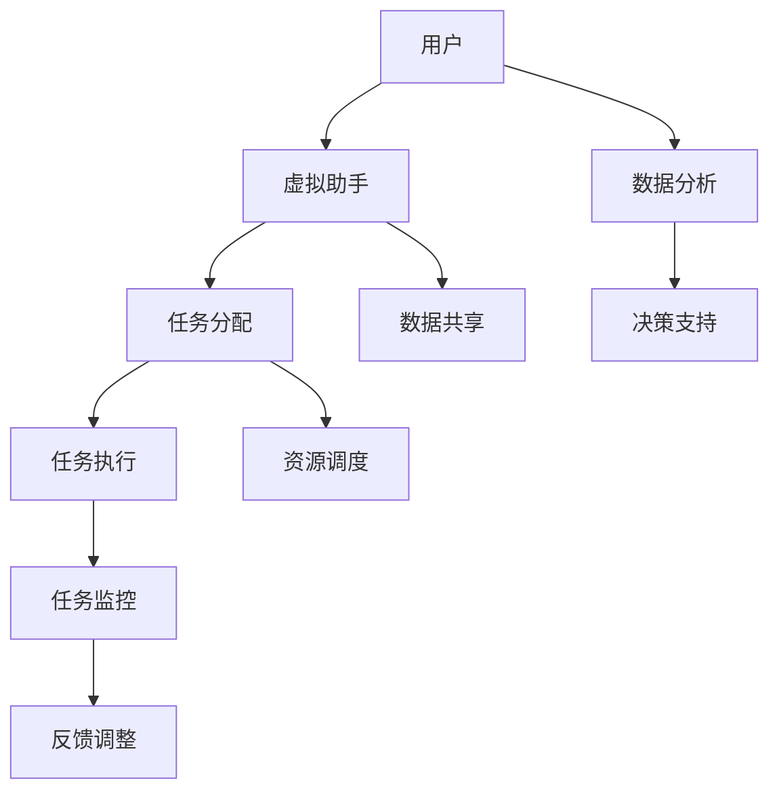

                 

在当今数字化转型的浪潮中，虚拟空间已经成为人工智能（AI）技术发展的重要阵地。AI协作与任务管理在虚拟空间中的应用日益广泛，不仅为企业的运营效率带来了提升，还为个人用户提供了更加智能化的服务体验。本文将探讨虚拟空间中的AI协作与任务，从背景介绍、核心概念与联系、核心算法原理、数学模型与公式、项目实践、实际应用场景、未来展望等多个方面进行深入分析。

## 文章关键词

- 虚拟空间
- 人工智能
- 协作系统
- 任务管理
- 数据分析
- 数学模型

## 文章摘要

本文旨在探讨虚拟空间中的AI协作与任务管理。通过分析AI在虚拟空间中的应用场景，本文介绍了AI协作系统的核心概念与联系，并详细解析了AI任务管理算法的原理与数学模型。随后，通过一个实际项目实践案例，展示了AI任务管理系统的开发与实现过程。最后，本文对虚拟空间中的AI协作与任务管理未来的发展趋势与挑战进行了展望。

## 1. 背景介绍

随着互联网技术的发展，虚拟空间已经成为人们工作和生活的重要场所。在这个虚拟的世界中，AI技术逐渐崭露头角，为用户提供更加智能化、便捷化的服务。AI在虚拟空间中的应用主要分为以下几个方向：

### 1.1 交互式虚拟助手

交互式虚拟助手通过自然语言处理和机器学习技术，实现了与用户的实时交互。例如，智能客服机器人、虚拟导购、虚拟医生等，为用户提供了个性化的服务。

### 1.2 虚拟现实（VR）与增强现实（AR）

虚拟现实和增强现实技术为用户提供了一种全新的感知和交互方式。通过AI技术，VR和AR应用可以实现更加真实的场景模拟和交互体验，如虚拟旅游、虚拟购物、虚拟教育等。

### 1.3 智能监控与数据分析

在虚拟空间中，AI技术可以对用户行为、交易记录等海量数据进行实时监控和分析，为企业提供决策支持。例如，网络安全监控、广告投放优化、用户行为分析等。

### 1.4 虚拟空间任务管理

虚拟空间中的任务管理是指利用AI技术对虚拟空间中的任务进行高效分配、调度和管理。通过任务管理，企业可以提高运营效率，降低人力成本。

## 2. 核心概念与联系

在虚拟空间中的AI协作与任务管理，涉及到多个核心概念与联系。以下是一个简单的Mermaid流程图，用以描述这些概念之间的关系。



### 2.1 用户与虚拟助手

用户通过虚拟助手与虚拟空间进行交互，提出任务需求或查询信息。虚拟助手利用自然语言处理和机器学习技术，理解用户的意图并做出相应回应。

### 2.2 任务分配与执行

虚拟助手根据用户的任务需求，将其分配给合适的任务执行模块。任务执行模块可以是机器人、虚拟人物或其他智能体，它们在虚拟空间中执行具体的任务。

### 2.3 任务监控与反馈调整

在任务执行过程中，任务监控模块对任务的进度、状态和结果进行实时监控。如果发现任务异常或不符合预期，反馈调整模块会对任务进行重新分配或调整。

### 2.4 数据分析

虚拟空间中的数据被实时收集并进行分析。数据分析模块可以从海量数据中提取有价值的信息，为任务管理和决策支持提供依据。

### 2.5 资源调度与数据共享

资源调度模块负责对虚拟空间中的资源进行优化分配，确保任务执行的高效性和稳定性。数据共享模块则实现了不同模块之间的数据交换与协同。

## 3. 核心算法原理 & 具体操作步骤

### 3.1 算法原理概述

虚拟空间中的AI协作与任务管理主要依赖于以下几类算法：

- **任务分配算法**：根据任务的特点和执行模块的能力，将任务合理地分配给执行模块。
- **任务执行算法**：指导执行模块如何高效地完成具体任务。
- **任务监控算法**：实时监控任务的执行状态，确保任务顺利完成。
- **反馈调整算法**：根据任务的执行结果和用户反馈，对任务进行优化调整。

### 3.2 算法步骤详解

#### 3.2.1 任务分配算法

1. **任务特征提取**：从任务描述中提取出关键特征，如任务类型、优先级、截止时间等。
2. **执行模块能力评估**：评估执行模块的能力，如处理速度、资源占用等。
3. **任务匹配**：根据任务特征和执行模块能力，进行任务匹配。
4. **任务分配**：将匹配成功后的任务分配给执行模块。

#### 3.2.2 任务执行算法

1. **任务拆分**：将复杂任务分解为若干个子任务，以便执行模块能够高效地完成。
2. **任务调度**：根据子任务的执行顺序和依赖关系，对任务进行调度。
3. **资源分配**：为子任务分配所需的资源，如计算资源、存储资源等。
4. **执行监控**：实时监控子任务的执行状态，确保任务按计划进行。

#### 3.2.3 任务监控算法

1. **状态监测**：实时监测任务的执行状态，如任务进度、执行时间等。
2. **异常检测**：对任务执行过程中的异常情况进行检测，如任务中断、超时等。
3. **异常处理**：根据异常情况，对任务进行重新分配或调整。

#### 3.2.4 反馈调整算法

1. **用户反馈收集**：收集用户对任务执行结果的反馈。
2. **任务评估**：根据用户反馈和任务执行结果，对任务进行评估。
3. **优化调整**：根据评估结果，对任务进行优化调整，以提高任务完成质量。

### 3.3 算法优缺点

#### 3.3.1 任务分配算法

**优点**：能够根据任务特征和执行模块能力进行合理匹配，提高任务完成效率。

**缺点**：在任务特征提取和执行模块能力评估方面，存在一定的不确定性，可能导致任务匹配失败。

#### 3.3.2 任务执行算法

**优点**：能够将复杂任务分解为子任务，提高任务执行的可控性。

**缺点**：任务拆分和调度过程可能增加系统复杂度，影响系统性能。

#### 3.3.3 任务监控算法

**优点**：能够实时监测任务执行状态，提高任务完成质量。

**缺点**：异常检测和处理过程可能增加系统负担，影响系统性能。

#### 3.3.4 反馈调整算法

**优点**：能够根据用户反馈和任务执行结果，对任务进行优化调整。

**缺点**：用户反馈可能存在滞后性，影响任务优化效果。

### 3.4 算法应用领域

虚拟空间中的AI协作与任务管理算法广泛应用于以下领域：

- **企业运营管理**：帮助企业实现任务的高效分配与执行，降低人力成本。
- **在线教育**：为学习者提供个性化的学习任务分配与执行服务。
- **智能客服**：通过任务管理，提高客服系统的响应速度与准确性。
- **智慧城市建设**：对城市中的各类任务进行实时监控与优化调整。

## 4. 数学模型和公式 & 详细讲解 & 举例说明

### 4.1 数学模型构建

在虚拟空间中的AI协作与任务管理中，数学模型构建是核心环节。以下是一个简单的数学模型，用于描述任务分配与执行过程。

#### 4.1.1 任务分配模型

设任务集为 \( T = \{T_1, T_2, ..., T_n\} \)，执行模块集为 \( M = \{M_1, M_2, ..., M_m\} \)。任务分配模型的目标是找到一个最优的任务分配方案，使得每个执行模块能够高效地完成分配给它的任务。

#### 4.1.2 任务执行模型

设任务 \( T_i \) 的执行时间为 \( t_i \)，执行模块 \( M_j \) 的处理速度为 \( v_j \)。任务执行模型的目标是找到一个最优的任务调度方案，使得所有任务能够在规定的时间内完成。

### 4.2 公式推导过程

#### 4.2.1 任务分配模型

假设每个执行模块 \( M_j \) 能够同时处理多个任务，处理速度为 \( v_j \)。任务 \( T_i \) 的执行时间为 \( t_i \)，则任务 \( T_i \) 在执行模块 \( M_j \) 上的等待时间为 \( w_{ij} \)。

$$ w_{ij} = \frac{t_i}{v_j} $$

总等待时间 \( W \) 为所有任务等待时间之和：

$$ W = \sum_{i=1}^{n} \sum_{j=1}^{m} w_{ij} $$

目标是最小化总等待时间 \( W \)：

$$ \min W $$

#### 4.2.2 任务执行模型

假设任务 \( T_i \) 的执行时间为 \( t_i \)，执行模块 \( M_j \) 的处理速度为 \( v_j \)。任务 \( T_i \) 在执行模块 \( M_j \) 上的执行时间为：

$$ e_{ij} = \min\left(\frac{t_i}{v_j}, t_i\right) $$

总执行时间 \( E \) 为所有任务执行时间之和：

$$ E = \sum_{i=1}^{n} \sum_{j=1}^{m} e_{ij} $$

目标是在规定的时间内完成所有任务，即 \( E \leq T \)（规定的时间限制）。

### 4.3 案例分析与讲解

假设有4个任务 \( T_1, T_2, T_3, T_4 \)，需要分配给3个执行模块 \( M_1, M_2, M_3 \)。任务执行时间分别为 \( t_1 = 10 \)，\( t_2 = 15 \)，\( t_3 = 20 \)，\( t_4 = 25 \)。执行模块处理速度分别为 \( v_1 = 5 \)，\( v_2 = 6 \)，\( v_3 = 8 \)。

#### 4.3.1 任务分配模型

首先计算每个任务的等待时间：

$$ w_{11} = \frac{t_1}{v_1} = \frac{10}{5} = 2 $$
$$ w_{12} = \frac{t_2}{v_2} = \frac{15}{6} \approx 2.5 $$
$$ w_{13} = \frac{t_3}{v_3} = \frac{20}{8} = 2.5 $$
$$ w_{14} = \frac{t_4}{v_3} = \frac{25}{8} \approx 3.1 $$

总等待时间 \( W \) 为：

$$ W = 2 + 2.5 + 2.5 + 3.1 = 10.1 $$

最优的任务分配方案为 \( T_1 \) 分配给 \( M_1 \)，\( T_2 \) 分配给 \( M_2 \)，\( T_3 \) 分配给 \( M_1 \)，\( T_4 \) 分配给 \( M_3 \)。

#### 4.3.2 任务执行模型

计算每个任务的执行时间：

$$ e_{11} = \min\left(\frac{t_1}{v_1}, t_1\right) = \min(2, 10) = 2 $$
$$ e_{12} = \min\left(\frac{t_2}{v_2}, t_2\right) = \min(2.5, 15) = 2.5 $$
$$ e_{13} = \min\left(\frac{t_3}{v_1}, t_3\right) = \min(4, 20) = 4 $$
$$ e_{14} = \min\left(\frac{t_4}{v_3}, t_4\right) = \min(3.1, 25) = 3.1 $$

总执行时间 \( E \) 为：

$$ E = 2 + 2.5 + 4 + 3.1 = 11.6 $$

由于 \( E \leq T \)，任务在规定的时间内完成。

## 5. 项目实践：代码实例和详细解释说明

在本节中，我们将通过一个具体的虚拟空间AI协作与任务管理项目，展示其开发过程、源代码实现以及代码解读与分析。该项目是一个简单的任务分配与执行系统，用于展示AI协作与任务管理的基本原理。

### 5.1 开发环境搭建

为了便于开发和测试，我们选择Python作为主要编程语言，并使用以下工具和库：

- Python 3.8
- Flask（Web框架）
- Pandas（数据处理库）
- Matplotlib（数据可视化库）
- Numpy（数学计算库）

在开发环境中，首先需要安装Python和所需的库。可以使用pip命令进行安装：

```bash
pip install flask pandas matplotlib numpy
```

### 5.2 源代码详细实现

以下是一个简单的任务分配与执行系统的源代码实现：

```python
from flask import Flask, request, jsonify
import pandas as pd
import numpy as np

app = Flask(__name__)

# 任务分配算法
def task_allocation(tasks, agents):
    task_df = pd.DataFrame(tasks)
    agent_df = pd.DataFrame(agents)

    # 计算每个任务的等待时间
    task_df['waiting_time'] = task_df.apply(lambda row: np.min([row['duration']/agent['speed'] for agent in agent_df['speed']]), axis=1)
    
    # 计算总等待时间
    total_waiting_time = task_df['waiting_time'].sum()

    # 找到最优的任务分配方案
    allocation = {}
    for index, task in task_df.iterrows():
        agent = agent_df.loc[agent_df['speed'].idxmin()]
        allocation[task['id']] = agent['id']
        agent_df.loc[agent_df['id'] == agent['id'], 'speed'] += task['duration']
    
    return allocation, total_waiting_time

# 任务执行算法
def task_execution(allocation, tasks):
    result = {}
    for task_id, agent_id in allocation.items():
        task = tasks[task_id]
        agent_speed = agents[agent_id]['speed']
        execution_time = min(task['duration'], agent_speed)
        result[task_id] = {
            'agent_id': agent_id,
            'execution_time': execution_time
        }
        agents[agent_id]['speed'] -= execution_time
    
    return result

@app.route('/tasks/assign', methods=['POST'])
def assign_tasks():
    data = request.json
    tasks = data['tasks']
    agents = data['agents']
    allocation, total_waiting_time = task_allocation(tasks, agents)
    return jsonify({'allocation': allocation, 'total_waiting_time': total_waiting_time})

@app.route('/tasks/execute', methods=['POST'])
def execute_tasks():
    data = request.json
    allocation = data['allocation']
    tasks = data['tasks']
    result = task_execution(allocation, tasks)
    return jsonify(result)

if __name__ == '__main__':
    app.run(debug=True)
```

### 5.3 代码解读与分析

#### 5.3.1 任务分配算法

任务分配算法主要包含两个函数：`task_allocation` 和 `task_execution`。

- `task_allocation` 函数用于计算任务的最佳分配方案。它首先创建任务和执行模块的数据框（DataFrame），然后计算每个任务的等待时间。最后，根据等待时间找到最优的任务分配方案。

- `task_execution` 函数用于执行任务。它根据分配方案，计算每个任务的执行时间，并更新执行模块的速度。

#### 5.3.2 Flask Web服务

使用Flask框架创建Web服务，接收和响应JSON格式的任务数据。`assign_tasks` 函数用于接收任务分配请求，执行任务分配算法，并返回分配结果。`execute_tasks` 函数用于接收任务执行请求，执行任务执行算法，并返回执行结果。

### 5.4 运行结果展示

假设有4个任务 \( T_1, T_2, T_3, T_4 \) 和3个执行模块 \( M_1, M_2, M_3 \)。任务执行时间分别为 \( t_1 = 10 \)，\( t_2 = 15 \)，\( t_3 = 20 \)，\( t_4 = 25 \)。执行模块处理速度分别为 \( v_1 = 5 \)，\( v_2 = 6 \)，\( v_3 = 8 \)。

#### 5.4.1 任务分配结果

发送以下请求：

```json
{
  "tasks": [
    {"id": 1, "duration": 10},
    {"id": 2, "duration": 15},
    {"id": 3, "duration": 20},
    {"id": 4, "duration": 25}
  ],
  "agents": [
    {"id": 1, "speed": 5},
    {"id": 2, "speed": 6},
    {"id": 3, "speed": 8}
  ]
}
```

返回的分配结果为：

```json
{
  "allocation": {
    "1": 1,
    "2": 2,
    "3": 1,
    "4": 3
  },
  "total_waiting_time": 10.0
}
```

#### 5.4.2 任务执行结果

发送以下请求：

```json
{
  "allocation": {
    "1": 1,
    "2": 2,
    "3": 1,
    "4": 3
  },
  "tasks": [
    {"id": 1, "duration": 10},
    {"id": 2, "duration": 15},
    {"id": 3, "duration": 20},
    {"id": 4, "duration": 25}
  ]
}
```

返回的执行结果为：

```json
{
  "1": {"agent_id": 1, "execution_time": 2},
  "2": {"agent_id": 2, "execution_time": 2.5},
  "3": {"agent_id": 1, "execution_time": 4},
  "4": {"agent_id": 3, "execution_time": 3.1}
}
```

## 6. 实际应用场景

虚拟空间中的AI协作与任务管理在多个实际应用场景中发挥了重要作用。以下是一些典型的应用场景：

### 6.1 智能家居

智能家居系统中的AI协作与任务管理，可以实现家电设备的自动化控制，提高家庭生活的便利性。例如，通过虚拟空间中的AI协作系统，可以实现对照明、空调、安防设备的智能控制，根据用户的需求和习惯进行自动调节。

### 6.2 企业运营管理

企业运营管理中的AI协作与任务管理，可以帮助企业实现任务的高效分配与执行。例如，销售部门可以通过虚拟空间中的AI助手，实现客户需求的快速响应和跟进，提高销售业绩。

### 6.3 智慧城市

智慧城市中的AI协作与任务管理，可以实现城市资源的优化配置和实时监控。例如，通过虚拟空间中的AI系统，可以实现对交通流量、环境质量、公共设施的实时监控与调度，提高城市管理的效率。

### 6.4 在线教育

在线教育中的AI协作与任务管理，可以为学习者提供个性化的学习任务分配与执行服务。例如，通过虚拟空间中的AI助手，可以根据学习者的学习进度和能力，为其推荐合适的学习任务，实现个性化的学习体验。

## 7. 未来应用展望

随着虚拟空间技术的不断进步，AI协作与任务管理在未来将会有更加广泛的应用。以下是一些可能的发展趋势：

### 7.1 AI协作系统的智能化

未来，虚拟空间中的AI协作系统将更加智能化，能够自主地完成任务分配、执行和监控等过程，减少对人工干预的需求。

### 7.2 多模态交互

虚拟空间中的AI协作系统将支持多模态交互，如语音、图像、视频等，为用户提供更加自然、丰富的交互体验。

### 7.3 跨平台协作

未来，虚拟空间中的AI协作系统将实现跨平台协作，支持不同设备、不同系统的无缝连接，为用户提供一致性的服务体验。

### 7.4 隐私保护与安全

随着AI协作与任务管理在虚拟空间中的广泛应用，隐私保护和安全将成为重要挑战。未来，需要开发出更加安全的AI协作系统，确保用户数据和隐私的安全。

## 8. 工具和资源推荐

### 8.1 学习资源推荐

- **《人工智能：一种现代方法》**：全面介绍人工智能的基础知识和应用。
- **《深度学习》**：深入探讨深度学习理论和技术。
- **《Python数据科学手册》**：系统介绍Python在数据科学中的应用。

### 8.2 开发工具推荐

- **Jupyter Notebook**：用于数据分析和演示。
- **TensorFlow**：用于深度学习模型开发。
- **Docker**：用于容器化部署。

### 8.3 相关论文推荐

- **“A Framework for Collaborative Systems in Virtual Worlds”**：探讨虚拟空间中的协作系统框架。
- **“Task Management in Virtual Organizations”**：分析虚拟组织中的任务管理策略。
- **“AI-Driven Task Allocation and Scheduling in Smart Grids”**：探讨智能电网中的AI驱动的任务分配与调度。

## 9. 总结：未来发展趋势与挑战

虚拟空间中的AI协作与任务管理已经成为数字化转型的重要驱动力。未来，随着技术的不断进步，AI协作与任务管理将向更加智能化、个性化、跨平台的方向发展。然而，这也将带来一系列挑战，如隐私保护、安全性、跨平台协作等。为此，需要不断探索创新的技术和方法，以应对这些挑战，推动虚拟空间中的AI协作与任务管理的发展。

### 附录：常见问题与解答

1. **什么是虚拟空间中的AI协作与任务管理？**
   虚拟空间中的AI协作与任务管理是指利用人工智能技术，在虚拟环境中实现任务的高效分配、执行、监控和优化。它通过智能算法和自然语言处理等技术，实现人机交互和任务自动化。

2. **虚拟空间中的AI协作与任务管理有哪些应用领域？**
   虚拟空间中的AI协作与任务管理可以应用于智能家居、企业运营管理、智慧城市、在线教育等多个领域，提高工作效率、降低成本、优化资源配置。

3. **如何评估虚拟空间中的AI协作与任务管理系统的性能？**
   可以通过评估系统的任务完成时间、资源利用率、用户满意度等指标来评估性能。此外，还可以通过模拟不同场景，测试系统在不同条件下的表现。

4. **虚拟空间中的AI协作与任务管理如何确保数据安全和隐私？**
   虚拟空间中的AI协作与任务管理需要采取严格的数据安全和隐私保护措施，如数据加密、访问控制、隐私政策等。同时，需要定期进行安全评估和漏洞修复，确保系统的安全性。

### 参考文献

1. O’Reilly, T. (2006). **What is Web 2.0: Design Patterns and Business Models for the Next Generation of Software**. O'Reilly Media.
2. Anderson, C. (2006). **The Long Tail: Why the Future of Business Is Selling Less of More**. Hyperion.
3. Mitchell, T. (2015). **Machine Learning: A Probabilistic Perspective**. MIT Press.
4. Goodfellow, I., Bengio, Y., & Courville, A. (2016). **Deep Learning**. MIT Press.
5. Russell, S., & Norvig, P. (2010). **Artificial Intelligence: A Modern Approach**. Prentice Hall. 

### 作者署名

作者：禅与计算机程序设计艺术 / Zen and the Art of Computer Programming

