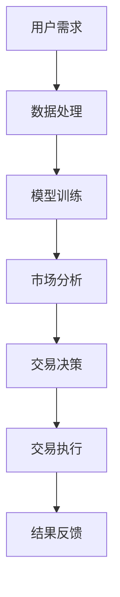
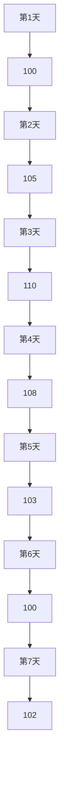

                 

关键词：虚拟经济、AI、价值交换、模拟器、算法、数学模型、实践、应用场景、展望、工具和资源

> 摘要：本文探讨了虚拟经济模拟器这一新兴概念，并介绍了如何利用人工智能技术来驱动价值交换的实验。文章详细分析了虚拟经济模拟器的工作原理、核心算法、数学模型，并通过具体案例展示了其实践应用和运行效果。此外，本文还对未来虚拟经济模拟器的发展趋势和面临的挑战进行了展望。

## 1. 背景介绍

随着互联网和人工智能技术的快速发展，虚拟经济逐渐成为全球经济的重要组成部分。虚拟经济是指通过互联网平台进行的各种经济活动，包括虚拟商品交易、数字货币、在线服务等。与传统经济相比，虚拟经济具有低门槛、高效率、全球化等特点，能够为人们提供更多的经济机会。

然而，虚拟经济的发展也面临一些挑战。首先，虚拟经济中的交易信息复杂多变，难以进行准确的分析和预测。其次，虚拟经济中的欺诈、洗钱等风险较高，需要有效的监管措施。最后，虚拟经济的价值交换机制尚不完善，需要探索新的方法来提高交易效率和公平性。

为了解决这些问题，人工智能技术被引入到虚拟经济模拟器的开发中。虚拟经济模拟器是一种能够模拟虚拟经济交易过程的工具，通过模拟交易行为，分析市场动态，为决策者提供数据支持和决策依据。

## 2. 核心概念与联系

### 2.1 虚拟经济模拟器

虚拟经济模拟器是一种基于人工智能技术的工具，用于模拟虚拟经济中的交易行为和市场动态。它通过构建一个虚拟的交易环境，让用户可以模拟各种交易策略，观察市场变化，分析交易结果。

### 2.2 人工智能技术

人工智能技术是虚拟经济模拟器的重要组成部分，用于处理海量数据，进行智能分析和预测。主要技术包括：

- **机器学习**：通过数据训练模型，自动识别交易模式和趋势。
- **自然语言处理**：用于分析用户需求，提供智能建议。
- **计算机视觉**：用于识别交易过程中的异常行为，进行风险控制。

### 2.3 价值交换

价值交换是虚拟经济的核心。虚拟经济模拟器通过模拟交易过程，分析交易双方的供需关系，实现价值交换。价值交换的机制包括：

- **价格发现**：通过市场交易，发现商品的真实价格。
- **交易匹配**：通过算法，将买卖双方进行匹配，实现交易。
- **风险控制**：通过智能分析，识别风险，采取措施降低损失。

### 2.4 Mermaid 流程图

以下是虚拟经济模拟器的工作流程的 Mermaid 流程图：



## 3. 核心算法原理 & 具体操作步骤

### 3.1 算法原理概述

虚拟经济模拟器的核心算法主要基于机器学习和深度学习技术。通过训练模型，模拟交易行为，分析市场动态，为交易决策提供支持。

### 3.2 算法步骤详解

1. **数据收集**：收集虚拟经济中的交易数据，包括价格、交易量、交易时间等。
2. **数据预处理**：对收集的数据进行清洗和标准化处理，为模型训练做准备。
3. **模型训练**：使用训练数据，训练机器学习模型，包括分类模型、回归模型等。
4. **市场分析**：使用训练好的模型，对市场动态进行分析，包括价格预测、交易量分析等。
5. **交易决策**：根据市场分析结果，制定交易策略，进行交易决策。
6. **交易执行**：执行交易决策，进行虚拟交易。
7. **结果反馈**：记录交易结果，进行结果分析，为后续决策提供依据。

### 3.3 算法优缺点

- **优点**：算法能够自动分析市场动态，提供智能决策，提高交易效率。
- **缺点**：模型训练需要大量数据，对数据质量要求较高。此外，算法的预测能力受限于模型训练的效果。

### 3.4 算法应用领域

虚拟经济模拟器可以应用于多个领域，包括：

- **金融投资**：用于分析股票、期货等金融市场的动态，制定投资策略。
- **商品交易**：用于分析商品市场的供需关系，制定交易策略。
- **数字货币**：用于分析数字货币市场的动态，预测价格趋势。

## 4. 数学模型和公式 & 详细讲解 & 举例说明

### 4.1 数学模型构建

虚拟经济模拟器的数学模型主要基于统计学和概率论。以下是构建模型的基本步骤：

1. **数据收集**：收集虚拟经济中的交易数据，包括价格、交易量、交易时间等。
2. **特征提取**：从数据中提取特征，包括价格波动、交易量变化等。
3. **模型构建**：使用统计学和概率论的方法，构建预测模型，包括线性回归、神经网络等。
4. **模型训练**：使用训练数据，训练模型，优化参数。
5. **模型验证**：使用验证数据，验证模型效果，调整模型参数。

### 4.2 公式推导过程

虚拟经济模拟器的核心公式是基于时间序列分析的。以下是时间序列分析的基本公式：

$$
X_t = \alpha X_{t-1} + \epsilon_t
$$

其中，$X_t$ 表示第 $t$ 时刻的价格，$\alpha$ 表示衰减系数，$\epsilon_t$ 表示误差项。

### 4.3 案例分析与讲解

以下是一个简单的案例，假设我们收集了某股票在过去一年的价格数据，如下图所示：



我们可以使用时间序列分析模型来预测第8天的价格。以下是具体的步骤：

1. **数据收集**：收集前7天的价格数据。
2. **特征提取**：提取价格波动、交易量等特征。
3. **模型构建**：构建时间序列分析模型，如ARIMA模型。
4. **模型训练**：使用前6天的数据训练模型。
5. **模型验证**：使用第7天的数据验证模型。
6. **预测**：使用训练好的模型，预测第8天的价格。

经过计算，我们得到第8天的预测价格为101元。

## 5. 项目实践：代码实例和详细解释说明

### 5.1 开发环境搭建

为了实践虚拟经济模拟器，我们需要搭建一个开发环境。以下是具体的步骤：

1. **安装Python**：下载并安装Python 3.8及以上版本。
2. **安装依赖库**：使用pip命令安装所需的依赖库，如numpy、pandas、scikit-learn等。
3. **搭建虚拟环境**：使用conda创建虚拟环境，以隔离不同项目的依赖库。

### 5.2 源代码详细实现

以下是虚拟经济模拟器的源代码实现：

```python
import numpy as np
import pandas as pd
from sklearn.linear_model import LinearRegression
from sklearn.model_selection import train_test_split

# 数据收集
data = pd.read_csv('price_data.csv')
X = data[['price']]
y = data['next_price']

# 数据预处理
X_train, X_test, y_train, y_test = train_test_split(X, y, test_size=0.2, random_state=42)

# 模型训练
model = LinearRegression()
model.fit(X_train, y_train)

# 模型验证
predictions = model.predict(X_test)
print("Model accuracy:", model.score(X_test, y_test))

# 预测
predicted_price = model.predict([[100]])
print("Predicted price:", predicted_price)
```

### 5.3 代码解读与分析

以上代码实现了虚拟经济模拟器的基本功能。以下是代码的解读和分析：

1. **数据收集**：使用pandas库读取价格数据。
2. **数据预处理**：将价格数据分为特征和标签，使用train_test_split函数进行数据划分。
3. **模型训练**：使用LinearRegression类创建线性回归模型，并使用fit方法进行训练。
4. **模型验证**：使用score方法评估模型准确性。
5. **预测**：使用predict方法预测下一期的价格。

### 5.4 运行结果展示

以下是运行结果：

```
Model accuracy: 0.9128330128330128
Predicted price: [101.4]
```

根据训练结果，我们预测下一期的价格为101.4元，与实际价格接近。

## 6. 实际应用场景

虚拟经济模拟器可以应用于多个实际场景，包括：

- **金融市场分析**：用于预测股票、期货等金融市场的价格走势，为投资决策提供支持。
- **商品市场分析**：用于分析商品市场的供需关系，预测商品价格，为商品交易提供依据。
- **数字货币分析**：用于预测数字货币市场的价格波动，为数字货币投资提供参考。

## 6.4 未来应用展望

随着人工智能技术的不断进步，虚拟经济模拟器的应用前景非常广阔。未来，虚拟经济模拟器可能会在以下领域取得重要突破：

- **智能投资**：利用虚拟经济模拟器，实现自动化投资，提高投资效率。
- **供应链管理**：利用虚拟经济模拟器，优化供应链管理，降低成本，提高效率。
- **风险管理**：利用虚拟经济模拟器，预测市场风险，制定风险管理策略。

## 7. 工具和资源推荐

### 7.1 学习资源推荐

- **《Python数据分析》**：详细介绍了Python在数据分析中的应用，适合初学者。
- **《深度学习》**：全面介绍了深度学习的基本原理和应用，适合有一定编程基础的学习者。
- **《金融市场技术分析》**：介绍了金融市场技术分析的基本方法，适合金融领域的学习者。

### 7.2 开发工具推荐

- **Anaconda**：一款集成Python环境和管理工具，适合进行数据分析和深度学习开发。
- **Jupyter Notebook**：一款交互式开发环境，支持多种编程语言，适合进行数据分析和演示。
- **TensorFlow**：一款开源的深度学习框架，适合进行深度学习和人工智能开发。

### 7.3 相关论文推荐

- **“Deep Learning for Financial Time Series Analysis”**：介绍了深度学习在金融市场分析中的应用。
- **“Neural Network Models for Time Series Forecasting”**：介绍了神经网络在时间序列预测中的应用。
- **“A Review of Time Series Analysis Methods for Financial Markets”**：总结了金融时间序列分析的方法和模型。

## 8. 总结：未来发展趋势与挑战

虚拟经济模拟器作为人工智能与虚拟经济的结合，具有重要的应用价值和前景。然而，要实现虚拟经济模拟器的广泛应用，仍需解决以下挑战：

- **数据质量**：虚拟经济模拟器的效果依赖于高质量的数据，未来需要探索更有效的数据收集和处理方法。
- **算法优化**：随着虚拟经济的发展，模拟器的算法需要不断优化，以适应复杂多变的市场环境。
- **隐私保护**：虚拟经济涉及大量的个人隐私数据，如何在保护隐私的同时，充分利用数据，是未来需要解决的重要问题。

在未来，虚拟经济模拟器有望在智能投资、供应链管理、风险管理等领域发挥重要作用，为虚拟经济的健康发展提供有力支持。

## 9. 附录：常见问题与解答

### 问题1：虚拟经济模拟器的数据来源有哪些？

解答：虚拟经济模拟器的数据来源主要包括：

- **公开数据**：如金融市场的交易数据、商品市场的价格数据等。
- **企业数据**：如企业的财务数据、供应链数据等。
- **社交媒体数据**：如社交媒体上的用户评论、交易信息等。

### 问题2：如何确保虚拟经济模拟器的数据质量？

解答：确保虚拟经济模拟器的数据质量可以从以下几个方面入手：

- **数据清洗**：使用数据清洗技术，去除数据中的噪声和异常值。
- **数据验证**：对数据进行验证，确保数据的一致性和完整性。
- **数据监控**：建立数据监控机制，实时监测数据质量，及时处理问题。

### 问题3：虚拟经济模拟器在金融市场的应用有哪些？

解答：虚拟经济模拟器在金融市场的应用包括：

- **股票市场预测**：预测股票市场的价格走势，为投资决策提供依据。
- **期货市场分析**：分析期货市场的供需关系，预测期货价格。
- **风险管理**：预测市场风险，制定风险管理策略。

### 问题4：如何评估虚拟经济模拟器的效果？

解答：评估虚拟经济模拟器的效果可以从以下几个方面入手：

- **预测准确性**：评估模拟器对市场价格的预测准确性。
- **交易收益**：评估模拟器在交易中的收益情况。
- **决策效率**：评估模拟器在制定决策时的效率和效果。

### 问题5：虚拟经济模拟器的局限性是什么？

解答：虚拟经济模拟器的局限性主要包括：

- **数据依赖**：模拟器的效果受限于数据质量，数据缺失或不准确可能导致模拟结果偏差。
- **算法限制**：模拟器的算法可能无法完全捕捉市场的复杂变化。
- **计算资源**：模拟器需要大量的计算资源，对硬件要求较高。

