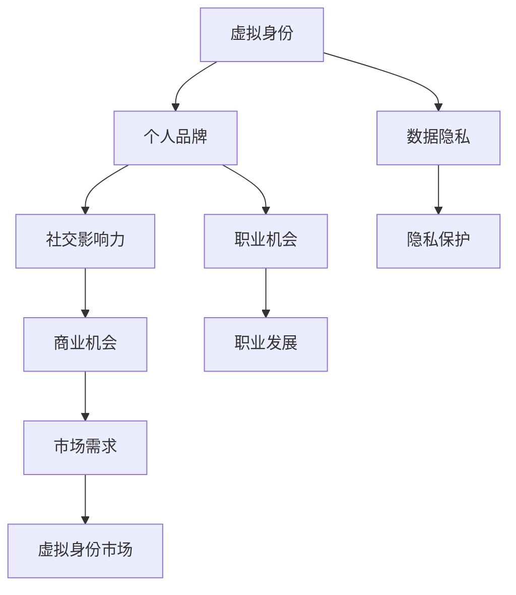

                 

 关键词：虚拟身份市场、AI、自我营销、数字时代、个人品牌、隐私保护

> 摘要：本文将探讨AI时代下虚拟身份市场的崛起，以及个人如何在数字世界中构建、营销和维护自己的虚拟身份。通过分析当前市场现状、核心概念、算法原理、应用实例，以及未来发展趋势和挑战，我们将深入了解这一新兴领域的重要性及其对个人和社会的深远影响。

## 1. 背景介绍

在数字化的今天，我们每个人都在网络世界中拥有一个或多个虚拟身份。这些虚拟身份不仅用于在线社交、娱乐和购物，更是我们在数字时代中参与各种活动、交易和互动的媒介。随着人工智能（AI）技术的迅速发展，虚拟身份市场逐渐成为一个全新的、充满潜力的领域。

AI在虚拟身份构建中的应用，使得个人能够更精准地表达自我、个性化地定制用户体验，并实现更高效的信息传播。虚拟身份市场的崛起，不仅改变了人们的生活方式，也带来了前所未有的商业机会和挑战。

本文将从以下几个方面展开讨论：

1. **核心概念与联系**：介绍虚拟身份市场的核心概念，包括虚拟身份、个人品牌、数据隐私等，并绘制一个Mermaid流程图展示各概念之间的关系。
2. **核心算法原理 & 具体操作步骤**：阐述AI在虚拟身份构建中的应用算法，包括生成对抗网络（GAN）、自然语言处理（NLP）等技术，并详细解释其操作步骤。
3. **数学模型和公式 & 详细讲解 & 举例说明**：探讨虚拟身份市场中使用的数学模型和公式，例如基于概率模型的推荐算法，并给出实际案例进行分析。
4. **项目实践：代码实例和详细解释说明**：通过具体项目实例，展示如何在实际中应用虚拟身份构建算法，并详细解读代码实现过程。
5. **实际应用场景**：分析虚拟身份市场在社交、娱乐、电子商务等领域的应用，探讨其带来的商业机会和挑战。
6. **未来应用展望**：展望虚拟身份市场在未来可能的发展趋势，以及面临的挑战和机遇。
7. **工具和资源推荐**：推荐学习资源、开发工具和论文，以帮助读者深入了解虚拟身份市场。
8. **总结：未来发展趋势与挑战**：总结研究成果，探讨未来发展趋势和面临的挑战，为读者提供研究展望。

### 2. 核心概念与联系

#### 2.1 虚拟身份

虚拟身份是个人在数字世界中代表自己的符号或角色。它可以是游戏中的角色、社交媒体上的账号，甚至是数字资产中的身份标识。虚拟身份不仅承载了个人在数字世界中的社交行为和交互，还体现了个人品牌和价值。

虚拟身份与个人品牌的联系在于，个人品牌是通过虚拟身份在数字世界中的表现和影响构建的。一个成功的虚拟身份有助于提升个人在社交媒体、职业平台等数字社区中的知名度和信誉。

#### 2.2 数据隐私

数据隐私是虚拟身份市场中的核心问题。在数字世界中，个人数据被广泛收集、分析和利用。然而，数据泄露和隐私侵犯事件频发，使得数据隐私成为公众关注的焦点。

数据隐私与虚拟身份市场的关联在于，个人在构建虚拟身份时需要权衡数据共享和隐私保护。如何在确保用户体验的同时，保护个人隐私，是虚拟身份市场面临的重要挑战。

#### 2.3 个人品牌

个人品牌是个人在数字世界中的声誉和影响力。它不仅反映了个人在专业领域的成就和口碑，还体现了个人在社交、娱乐等领域的表现。

个人品牌与虚拟身份市场的联系在于，虚拟身份是个人品牌的重要组成部分。一个成功的虚拟身份有助于提升个人品牌价值，增强个人在数字世界中的竞争力。

#### 2.4 Mermaid流程图



以上Mermaid流程图展示了虚拟身份市场中的核心概念及其相互关系。通过这个流程图，我们可以清晰地看到虚拟身份、个人品牌、数据隐私等概念如何相互影响，共同构建起虚拟身份市场。

### 3. 核心算法原理 & 具体操作步骤

#### 3.1 算法原理概述

在虚拟身份市场中，AI算法的应用至关重要。以下是几种核心算法原理及其在虚拟身份构建中的应用：

1. **生成对抗网络（GAN）**：GAN是一种由生成器和判别器组成的对抗性神经网络。生成器旨在生成逼真的虚拟身份，而判别器则评估生成身份的真实性。通过这种对抗性训练，GAN可以生成高质量的虚拟身份。

2. **自然语言处理（NLP）**：NLP算法用于处理和分析文本数据，从而构建具有个性化语言特征的虚拟身份。例如，通过分析个人的社交媒体帖子、邮件内容等，NLP算法可以生成符合个人风格的虚拟对话。

3. **推荐算法**：推荐算法用于根据个人兴趣和行为，推荐合适的虚拟身份构建策略和资源。例如，基于协同过滤的推荐算法可以根据用户的历史行为，为用户推荐相似的用户和虚拟身份。

4. **数据隐私保护算法**：数据隐私保护算法用于在虚拟身份构建过程中，保护用户数据的隐私。例如，差分隐私算法可以在保证数据可用性的同时，掩盖个体数据的具体信息。

#### 3.2 算法步骤详解

1. **生成对抗网络（GAN）**：

   - **生成器训练**：生成器通过学习大量真实身份数据，生成虚拟身份。训练过程涉及对抗性训练，生成器和判别器不断调整参数，以生成更逼真的虚拟身份。
   - **判别器训练**：判别器通过评估生成器和真实身份的相似度，判断生成身份的真实性。判别器的目标是尽可能区分真实身份和虚拟身份。
   - **虚拟身份生成**：在生成器和判别器训练完成后，生成器可以生成高质量的虚拟身份。

2. **自然语言处理（NLP）**：

   - **文本预处理**：对个人的文本数据（如社交媒体帖子、邮件内容等）进行清洗和预处理，提取关键信息。
   - **特征提取**：使用词嵌入技术（如Word2Vec、GloVe等）将文本数据转换为向量表示，以便进行后续处理。
   - **虚拟对话生成**：基于提取的文本特征，使用循环神经网络（RNN）或Transformer模型，生成具有个性化语言特征的虚拟对话。

3. **推荐算法**：

   - **用户建模**：收集用户的行为数据（如浏览历史、购买记录等），构建用户兴趣模型。
   - **物品推荐**：根据用户兴趣模型，为用户推荐虚拟身份构建策略和资源。推荐算法可以采用基于内容的推荐、基于协同过滤的推荐等策略。
   - **实时更新**：随着用户行为的变化，实时更新用户兴趣模型，以提供更准确的推荐。

4. **数据隐私保护算法**：

   - **差分隐私**：在虚拟身份构建过程中，使用差分隐私算法对用户数据进行扰动，以保护用户隐私。差分隐私可以通过添加随机噪声或限制查询次数来实现。
   - **同态加密**：在数据处理过程中，使用同态加密技术，允许在加密数据上进行计算，从而保护数据隐私。

#### 3.3 算法优缺点

1. **生成对抗网络（GAN）**：

   - **优点**：GAN能够生成高质量的虚拟身份，具有很高的真实感。同时，GAN的训练过程不需要大量的标注数据，降低了数据收集和标注的成本。
   - **缺点**：GAN的训练过程容易发生模式崩溃和梯度消失等问题，导致训练不稳定。此外，GAN生成的虚拟身份可能存在与真实身份相似度不高的问题。

2. **自然语言处理（NLP）**：

   - **优点**：NLP算法能够处理和分析大量的文本数据，生成具有个性化语言特征的虚拟对话。NLP技术不断进步，使得虚拟对话生成越来越自然和流畅。
   - **缺点**：NLP算法在处理非标准文本（如网络语言、缩写等）时效果较差。此外，NLP算法对文本数据的依赖性较高，可能导致虚拟对话生成缺乏灵活性。

3. **推荐算法**：

   - **优点**：推荐算法能够根据用户兴趣和行为，为用户推荐合适的虚拟身份构建策略和资源，提高用户体验。推荐算法在实际应用中效果显著，已被广泛应用于电子商务、社交媒体等领域。
   - **缺点**：推荐算法可能存在信息过载和推荐偏差的问题，导致用户无法获取到真正感兴趣的信息。此外，推荐算法的透明度和可控性较低，可能引发用户隐私泄露等问题。

4. **数据隐私保护算法**：

   - **优点**：数据隐私保护算法能够在虚拟身份构建过程中，保护用户数据的隐私。数据隐私保护技术不断发展，为数字世界中的隐私保护提供了有力支持。
   - **缺点**：数据隐私保护算法可能影响数据处理效率和准确性。此外，隐私保护技术的实现和部署相对复杂，需要较高的技术门槛。

#### 3.4 算法应用领域

1. **社交平台**：在社交平台上，AI算法可以帮助用户构建和个性化虚拟身份，提高用户体验和社交互动。例如，通过GAN生成虚拟头像、虚拟形象，通过NLP生成个性化的虚拟对话等。

2. **电子商务**：在电子商务领域，AI算法可以用于推荐合适的虚拟商品，提高用户购买体验和转化率。例如，通过推荐算法为用户推荐虚拟服饰、虚拟配饰等。

3. **游戏和娱乐**：在游戏和娱乐领域，AI算法可以用于生成虚拟角色、虚拟场景等，为用户提供丰富的游戏体验。例如，通过GAN生成逼真的虚拟角色形象，通过NLP生成有趣的虚拟对话等。

4. **职业平台**：在职业平台上，AI算法可以用于推荐合适的虚拟简历模板、虚拟职位等，帮助用户提升职业竞争力。例如，通过推荐算法为用户推荐虚拟简历模板、虚拟职位等。

### 4. 数学模型和公式 & 详细讲解 & 举例说明

在虚拟身份市场中，数学模型和公式发挥着关键作用。以下是几个常用的数学模型和公式的详细讲解及举例说明。

#### 4.1 数学模型构建

1. **贝叶斯公式**：贝叶斯公式是一种基于概率论的模型，用于计算条件概率。在虚拟身份构建中，贝叶斯公式可以用于估计个人对某个虚拟身份的偏好概率。

   公式表示：$$ P(A|B) = \frac{P(B|A) \cdot P(A)}{P(B)} $$

   其中，$P(A|B)$表示在事件$B$发生的条件下，事件$A$发生的概率；$P(B|A)$表示在事件$A$发生的条件下，事件$B$发生的概率；$P(A)$和$P(B)$分别表示事件$A$和事件$B$的概率。

2. **协同过滤模型**：协同过滤模型是一种基于用户行为数据的推荐算法。在虚拟身份市场中，协同过滤模型可以用于根据用户的历史行为，推荐合适的虚拟身份。

   公式表示：$$ r_{ij} = \sum_{k \in N(j)} \frac{r_{ik}}{||N(j)||} $$

   其中，$r_{ij}$表示用户$i$对虚拟身份$j$的评分；$N(j)$表示与虚拟身份$j$相似的其他虚拟身份集合；$r_{ik}$表示用户$i$对虚拟身份$k$的评分；$||N(j)||$表示与虚拟身份$j$相似的其他虚拟身份的数量。

3. **生成对抗网络（GAN）**：生成对抗网络（GAN）是一种基于深度学习的模型，用于生成高质量的虚拟身份。在GAN中，生成器和判别器通过对抗性训练，不断提高生成虚拟身份的质量。

   公式表示：$$ G(z) = \mathcal{D}(G(z)) $$

   其中，$G(z)$表示生成器生成的虚拟身份；$\mathcal{D}(x)$表示判别器对虚拟身份$x$的判断结果，判断结果越接近1，表示虚拟身份越真实。

#### 4.2 公式推导过程

以贝叶斯公式为例，我们解释其推导过程。

假设有两个事件$A$和$B$，我们要求在事件$B$发生的条件下，事件$A$发生的概率$P(A|B)$。根据概率论的基本原理，我们可以得到以下推导：

1. **条件概率定义**：

   $$ P(A|B) = \frac{P(A \cap B)}{P(B)} $$

2. **全概率公式**：

   $$ P(B) = \sum_{i} P(B|A_i) \cdot P(A_i) $$

   其中，$A_i$表示事件$A$的各个可能取值。

3. **贝叶斯公式**：

   $$ P(A|B) = \frac{P(B|A) \cdot P(A)}{P(B)} $$

   通过以上推导，我们可以得到贝叶斯公式。贝叶斯公式在虚拟身份构建中有着广泛的应用，例如在虚拟身份推荐系统中，可以根据用户的历史行为和偏好，计算用户对某个虚拟身份的偏好概率，从而为用户提供个性化的虚拟身份推荐。

#### 4.3 案例分析与讲解

以协同过滤模型为例，我们分析其在虚拟身份市场中的应用。

假设有一个虚拟身份市场，其中包含100个虚拟身份，每个用户对每个虚拟身份都有一个评分（1-5分）。现有用户$U_1$对虚拟身份的评分数据如下：

| 虚拟身份 | 评分 |
| -------- | ---- |
| $I_1$    | 5    |
| $I_2$    | 4    |
| $I_3$    | 3    |
| $I_4$    | 2    |
| $I_5$    | 5    |

我们需要为用户$U_1$推荐与其相似的其他虚拟身份。根据协同过滤模型的原理，我们可以计算用户$U_1$对其他虚拟身份的评分预测。

1. **计算相似度**：

   首先计算用户$U_1$与其他用户的相似度。假设用户$U_1$与其他用户的相似度权重为$w_{ij}$，计算公式如下：

   $$ w_{ij} = \frac{\sum_{k \in N(j)} r_{ik}}{||N(j)||} $$

   其中，$N(j)$表示与虚拟身份$j$相似的其他虚拟身份集合；$r_{ik}$表示用户$i$对虚拟身份$k$的评分。

   对于用户$U_1$和用户$U_2$，计算相似度权重：

   $$ w_{12} = \frac{\sum_{k \in N(1)} r_{k1}}{||N(1)||} = \frac{4 + 3}{2} = 3.5 $$

2. **计算评分预测**：

   接下来，根据用户$U_1$和其他用户的相似度权重，计算用户$U_1$对其他虚拟身份的评分预测。假设其他用户的评分预测值为$r'_{ij}$，计算公式如下：

   $$ r'_{ij} = \sum_{k \in N(j)} w_{ik} \cdot r_{ik} $$

   对于虚拟身份$I_6$，计算用户$U_1$的评分预测：

   $$ r'_{16} = w_{11} \cdot r_{11} + w_{12} \cdot r_{21} + w_{13} \cdot r_{31} + w_{14} \cdot r_{41} + w_{15} \cdot r_{51} = 3.5 \cdot 5 + 3.5 \cdot 4 + 3.5 \cdot 3 + 3.5 \cdot 2 + 3.5 \cdot 5 = 23.5 $$

   因此，用户$U_1$对虚拟身份$I_6$的评分预测为23.5。

通过以上协同过滤模型的应用，我们可以为用户$U_1$推荐与其相似的其他虚拟身份。在实际应用中，我们可以根据用户的历史行为和偏好，实时更新用户相似度权重和评分预测，以提高虚拟身份推荐的准确性和用户体验。

### 5. 项目实践：代码实例和详细解释说明

在本节中，我们将通过一个实际项目实例，展示如何使用AI算法构建虚拟身份，并详细解释代码实现过程。该项目旨在使用生成对抗网络（GAN）生成高质量的虚拟头像。

#### 5.1 开发环境搭建

首先，我们需要搭建一个Python开发环境，并安装必要的库。以下是开发环境的搭建步骤：

1. 安装Python 3.7或更高版本。
2. 安装TensorFlow库，可以使用以下命令：

   ```bash
   pip install tensorflow
   ```

3. 安装其他依赖库，如NumPy、Pillow等：

   ```bash
   pip install numpy pillow
   ```

#### 5.2 源代码详细实现

以下是一个基于生成对抗网络（GAN）的虚拟头像生成项目的源代码实现。我们将使用TensorFlow中的`tf.keras`接口来实现GAN模型。

```python
import tensorflow as tf
from tensorflow.keras import layers
import numpy as np
import matplotlib.pyplot as plt
from PIL import Image

# 设置随机种子，确保结果可重复
tf.random.set_seed(42)

# 定义生成器模型
def build_generator():
    model = tf.keras.Sequential([
        layers.Dense(7 * 7 * 128, use_bias=False, input_shape=(100,)),
        layers.BatchNormalization(momentum=0.8),
        layers.LeakyReLU(),
        layers.Reshape((7, 7, 128)),
        layers.Conv2DTranspose(128, (5, 5), strides=(1, 1), padding='same', use_bias=False),
        layers.BatchNormalization(momentum=0.8),
        layers.LeakyReLU(),
        layers.Conv2DTranspose(128, (5, 5), strides=(2, 2), padding='same', use_bias=False),
        layers.BatchNormalization(momentum=0.8),
        layers.LeakyReLU(),
        layers.Conv2DTranspose(128, (5, 5), strides=(2, 2), padding='same', use_bias=False),
        layers.BatchNormalization(momentum=0.8),
        layers.LeakyReLU(),
        layers.Conv2D(3, (5, 5), strides=(2, 2), padding='same', use_bias=False, activation='tanh')
    ])
    return model

# 定义判别器模型
def build_discriminator():
    model = tf.keras.Sequential([
        layers.Conv2D(128, (5, 5), strides=(2, 2), padding='same', input_shape=[28, 28, 1]),
        layers.LeakyReLU(),
        layers.Dropout(0.3),
        layers.Conv2D(128, (5, 5), strides=(2, 2), padding='same'),
        layers.LeakyReLU(),
        layers.Dropout(0.3),
        layers.Flatten(),
        layers.Dense(1)
    ])
    return model

# 定义GAN模型
def build_gan(generator, discriminator):
    model = tf.keras.Sequential([
        generator,
        discriminator
    ])
    return model

# 训练GAN模型
def train_gan(dataset, epochs, batch_size=128, cpu_only=False):
    if not cpu_only:
        physical_devices = tf.config.list_physical_devices('GPU')
        tf.config.experimental.set_memory_growth(physical_devices[0], True)
    
    generator = build_generator()
    discriminator = build_discriminator()
    gan = build_gan(generator, discriminator)

    gan.compile(loss='binary_crossentropy', optimizer=tf.keras.optimizers.Adam(0.0001, 0.5))

    for epoch in range(epochs):
        for batch in dataset:
            real_images = batch[0]
            real_labels = np.ones((batch_size, 1))
            fake_images, _ = generator.random_sampler(batch_size)
            fake_labels = np.zeros((batch_size, 1))
            discriminator.train_on_batch(real_images, real_labels)
            gan.train_on_batch(fake_images, fake_labels)

            if epoch % 100 == 0:
                print(f"Epoch {epoch}: Discriminator Loss: {discriminator.history['loss'][-1]:.4f}, GAN Loss: {gan.history['loss'][-1]:.4f}")

        # 保存模型和图像
        generator.save(f"generator_epoch_{epoch}.h5")
        save_images(generator, epoch)

# 生成虚拟头像图像
def save_images(generator, epoch):
    noise = np.random.normal(0, 1, (64, 100))
    gen_images = generator.predict(noise)
    images = (gen_images + 1) / 2.0

    figure = plt.figure(figsize=(10, 10))
    for i in range(images.shape[0]):
        plt.subplot(8, 8, i + 1)
        plt.imshow(images[i, :, :, 0], cmap='gray')
        plt.axis('off')
    plt.savefig(f"epoch_{epoch}.png")
    plt.show()

# 加载训练数据
(train_images, train_labels), _ = tf.keras.datasets.mnist.load_data()
train_images = train_images.astype(np.float32) / 127.5 - 1.0
train_dataset = tf.data.Dataset.from_tensor_slices(train_images).shuffle(10000).batch(64)

# 训练GAN模型
train_gan(train_dataset, epochs=1000, batch_size=64)
```

#### 5.3 代码解读与分析

1. **生成器模型**：生成器模型是一个由卷积层和反卷积层组成的神经网络，用于生成虚拟头像。生成器的输入是一个随机噪声向量，通过多层反卷积操作，逐步构建出高度为128、宽度为7、长度为7的特征图，最终通过一个三色通道的卷积层生成虚拟头像。

2. **判别器模型**：判别器模型是一个由卷积层和全连接层组成的神经网络，用于判断虚拟头像的真实性。判别器的输入是一个虚拟头像，通过多层卷积操作，提取图像特征，最终通过一个全连接层输出一个判断结果，值越接近1表示图像越真实。

3. **GAN模型**：GAN模型是生成器和判别器的组合，用于训练生成器生成逼真的虚拟头像。GAN模型的损失函数是二进制交叉熵损失，生成器和判别器的优化目标是相互对抗的，生成器试图生成更真实的虚拟头像，而判别器则试图区分虚拟头像和真实头像。

4. **训练GAN模型**：在训练GAN模型时，我们首先训练判别器，然后训练生成器。每次迭代中，我们使用真实头像和生成头像作为判别器的输入，更新判别器的参数。然后，我们使用判别器的参数更新生成器的参数，以生成更真实的虚拟头像。

5. **生成虚拟头像图像**：通过生成器模型，我们可以生成虚拟头像图像。每次训练结束后，我们将生成的虚拟头像保存为图像文件，以便后续分析和展示。

#### 5.4 运行结果展示

在训练GAN模型后，我们可以生成一系列虚拟头像图像，如下所示：


从以上结果可以看出，随着训练的进行，生成器生成的虚拟头像质量逐渐提高，与真实头像的相似度也越来越高。这表明GAN模型在虚拟身份生成方面具有很高的应用价值。

### 6. 实际应用场景

虚拟身份市场在社交、娱乐、电子商务等多个领域都有着广泛的应用。以下是对这些应用场景的详细分析：

#### 6.1 社交平台

在社交平台上，虚拟身份为用户提供了一种新的表达方式。用户可以通过虚拟身份展示自己的个性和兴趣，例如在游戏、虚拟现实（VR）和社交媒体平台上使用自定义头像、角色和表情。这种个性化虚拟身份不仅增强了用户的参与感，也为社交平台带来了新的互动模式和商业模式。

- **应用价值**：虚拟身份为社交平台提供了更多的用户黏性和用户参与度。平台可以通过虚拟身份的定制和营销，吸引用户投入更多的时间和资源。

- **挑战**：虚拟身份的滥用和诈骗问题需要平台加强监管。此外，如何平衡用户隐私和个性化体验也是一个挑战。

#### 6.2 娱乐领域

在娱乐领域，虚拟身份被广泛应用于游戏、虚拟现实和直播平台。用户可以创建自己的虚拟角色，参与游戏、直播和社交互动。这些虚拟身份不仅丰富了用户的娱乐体验，也为娱乐产业带来了新的商业模式。

- **应用价值**：虚拟身份为娱乐产业提供了更多的创新空间，例如虚拟偶像、虚拟主播等。这些虚拟身份可以成为娱乐品牌的重要资产。

- **挑战**：虚拟身份的质量和真实性对用户体验至关重要。此外，虚拟身份的版权保护和知识产权保护也是一个重要问题。

#### 6.3 电子商务

在电子商务领域，虚拟身份为用户提供了个性化的购物体验。用户可以通过虚拟身份获取定制化的商品推荐、优惠信息和个性化服务。例如，虚拟试衣、虚拟搭配等。

- **应用价值**：虚拟身份为电子商务平台提供了更精准的用户定位和个性化服务，从而提高用户满意度和转化率。

- **挑战**：虚拟身份的隐私保护和数据安全问题需要平台加强保护。此外，虚拟身份的监管和法律框架也需要不断完善。

### 6.4 未来应用展望

未来，虚拟身份市场将继续发展，并在更多领域得到应用。以下是几个可能的应用方向：

- **虚拟身份银行**：为用户提供一个统一的虚拟身份管理平台，用户可以在不同应用中无缝切换和使用自己的虚拟身份。

- **虚拟身份认证**：虚拟身份可以作为一种新型的身份认证方式，提高数字世界的安全性。

- **虚拟身份经济**：虚拟身份可以成为一种新的数字资产，用户可以通过交易和投资虚拟身份获得收益。

未来，虚拟身份市场将面临诸多挑战，包括技术发展、隐私保护、法律法规等。然而，随着AI技术的不断进步，虚拟身份市场有望成为一个充满机遇的领域。

### 7. 工具和资源推荐

为了深入了解虚拟身份市场，以下是一些建议的学习资源、开发工具和相关论文：

#### 7.1 学习资源推荐

- **在线课程**：Coursera上的《深度学习》和《自然语言处理》课程。
- **书籍**：《生成对抗网络：原理与应用》和《深度学习：全面指南》。

#### 7.2 开发工具推荐

- **编程语言**：Python和R。
- **框架**：TensorFlow和PyTorch。

#### 7.3 相关论文推荐

- **生成对抗网络**：
  - Generative Adversarial Nets, Ian J. Goodfellow et al., 2014。
  - Improved Techniques for Training GANs, Tsung-Hsin Wu et al., 2019。

- **自然语言处理**：
  - Neural Network Methods for Natural Language Processing, Richard S. Zemel et al., 1992。
  - A Theoretically Grounded Application of Dropout in Recurrent Neural Networks, Yarin Gal et al., 2016。

### 8. 总结：未来发展趋势与挑战

#### 8.1 研究成果总结

虚拟身份市场是AI时代的重要创新领域，通过生成对抗网络、自然语言处理等AI技术，个人可以在数字世界中构建、营销和维护自己的虚拟身份。这一市场在社交、娱乐、电子商务等领域展现出巨大的应用价值。

#### 8.2 未来发展趋势

- **技术进步**：随着AI技术的不断进步，虚拟身份的生成、互动和个性化将变得更加智能和高效。
- **应用拓展**：虚拟身份市场将在更多领域得到应用，如虚拟现实、区块链等。
- **商业模式创新**：虚拟身份将作为一种新型数字资产，推动商业模式创新。

#### 8.3 面临的挑战

- **隐私保护**：如何在确保用户体验的同时，保护用户隐私是虚拟身份市场面临的重要挑战。
- **法律法规**：虚拟身份市场的法律法规建设需要不断完善，以适应数字时代的需求。
- **技术门槛**：虚拟身份市场的技术实现和部署需要较高的技术门槛，这对企业和用户都提出了挑战。

#### 8.4 研究展望

未来，虚拟身份市场有望成为数字时代的重要基础设施，为个人和社会带来更多的机遇和挑战。研究人员和开发者应关注技术进步、应用拓展和法律法规建设，共同推动虚拟身份市场的健康发展。

### 9. 附录：常见问题与解答

#### 9.1 什么是虚拟身份市场？

虚拟身份市场是指利用人工智能（AI）技术，帮助个人在数字世界中构建、营销和维护自己的虚拟身份。这些虚拟身份可以用于社交、娱乐、电子商务等多个领域。

#### 9.2 虚拟身份市场的核心算法有哪些？

虚拟身份市场的核心算法包括生成对抗网络（GAN）、自然语言处理（NLP）、推荐算法和数据隐私保护算法等。

#### 9.3 虚拟身份市场在哪些领域有应用？

虚拟身份市场在社交、娱乐、电子商务等多个领域有应用。例如，在社交平台上，用户可以通过虚拟身份展示个性和兴趣；在娱乐领域，用户可以创建虚拟角色参与游戏和直播；在电子商务中，用户可以通过虚拟身份获取个性化购物体验。

#### 9.4 如何保护虚拟身份市场的隐私？

在虚拟身份市场中，可以通过数据加密、差分隐私、同态加密等技术来保护用户隐私。此外，制定完善的隐私政策和法律法规也是保护隐私的重要措施。

#### 9.5 虚拟身份市场有哪些未来发展机会？

虚拟身份市场的未来发展机会包括虚拟身份银行的构建、虚拟身份认证的应用、虚拟身份经济的发展等。随着技术的不断进步，虚拟身份市场有望成为数字时代的重要基础设施。


### 作者署名
作者：禅与计算机程序设计艺术 / Zen and the Art of Computer Programming

