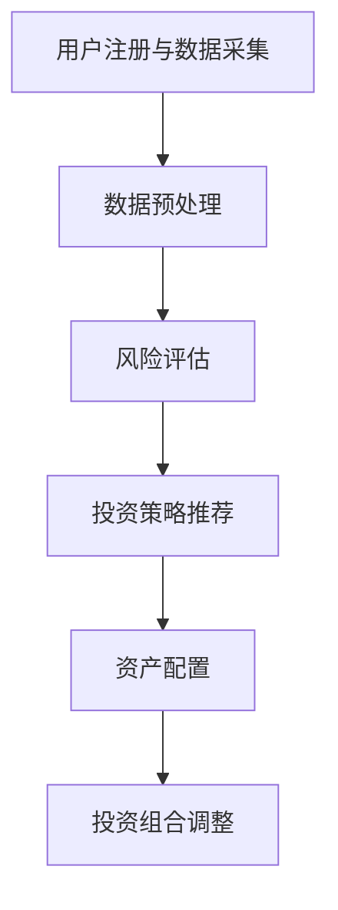

                 

关键词：蚂蚁智能投顾、面试真题、算法原理、数学模型、项目实践、实际应用、未来展望、工具资源

## 摘要

本文针对2024年蚂蚁智能投顾社招面试真题进行汇总和分析，通过对核心概念、算法原理、数学模型、项目实践以及实际应用场景的详细讲解，帮助求职者更好地理解和准备面试。文章旨在提供一份全面的参考指南，助力求职者成功通过面试，进入这一前沿领域。

## 1. 背景介绍

蚂蚁智能投顾作为蚂蚁集团的重要业务之一，专注于为个人投资者提供智能化的投资决策支持。随着人工智能和大数据技术的飞速发展，智能投顾已经成为金融科技领域的重要方向。蚂蚁智能投顾通过先进的算法模型和大数据分析，帮助用户实现资产的稳健增值。

### 1.1 蚂蚁智能投顾的发展历程

- 2015年，蚂蚁金服正式发布智能投顾产品“蚂蚁财富”。
- 2018年，蚂蚁金服升级智能投顾系统，实现全自动化投资管理。
- 2020年，蚂蚁智能投顾正式升级为“蚂蚁智投”，并提供更多个性化投资策略。

### 1.2 蚂蚁智能投顾的核心优势

- 强大的数据支持：依托于蚂蚁集团的强大数据资源，智能投顾能够实时获取用户的投资行为和风险偏好。
- 精准的算法模型：通过机器学习和深度学习技术，智能投顾能够为用户推荐最合适的投资策略。
- 个性化的投资服务：根据用户的投资目标、风险承受能力和市场环境，智能投顾提供定制化的投资方案。

## 2. 核心概念与联系

### 2.1 智能投顾的基本概念

智能投顾，又称为Robo-advisor，是一种基于人工智能技术为用户提供投资建议和资产配置服务的系统。与传统的人工顾问相比，智能投顾具有效率高、成本低、个性化强的特点。

### 2.2 智能投顾的架构

智能投顾系统通常包括以下几个模块：

1. **数据采集模块**：从各类数据源获取用户数据，如投资记录、交易行为、财务状况等。
2. **数据预处理模块**：对采集到的数据进行清洗、转换和归一化，为后续分析做准备。
3. **风险评估模块**：根据用户数据评估其风险承受能力，为资产配置提供依据。
4. **投资策略模块**：基于风险偏好和市场环境，为用户推荐最优投资组合。
5. **资产配置模块**：根据投资策略进行资产分配，实现投资组合的动态调整。

### 2.3 智能投顾的工作流程

1. **用户注册与数据采集**：用户通过智能投顾平台注册账号，并提交个人信息。
2. **数据预处理**：智能投顾对用户数据进行清洗和处理，提取关键特征。
3. **风险评估**：通过风险评估模型，评估用户的风险承受能力。
4. **投资策略推荐**：根据用户的风险偏好和市场环境，推荐最优的投资策略。
5. **资产配置**：根据投资策略，进行资产配置，实现投资组合的构建。
6. **投资组合调整**：根据市场变化和用户需求，对投资组合进行动态调整。

### 2.4 Mermaid 流程图



## 3. 核心算法原理 & 具体操作步骤

### 3.1 算法原理概述

智能投顾的核心算法主要包括以下几个方面：

1. **风险评估算法**：通过用户数据评估其风险承受能力。
2. **投资策略算法**：根据风险承受能力和市场环境推荐投资策略。
3. **资产配置算法**：根据投资策略进行资产配置。

### 3.2 算法步骤详解

#### 3.2.1 风险评估算法

1. **收集用户数据**：包括年龄、收入、投资经验等。
2. **特征提取**：对用户数据进行特征提取，如年龄、收入等。
3. **模型训练**：使用历史数据训练风险评估模型。
4. **风险评估**：输入用户数据，评估其风险承受能力。

#### 3.2.2 投资策略算法

1. **市场分析**：分析当前市场环境，包括宏观经济指标、行业趋势等。
2. **风险偏好匹配**：根据用户的风险承受能力，推荐合适的投资策略。
3. **策略优化**：通过优化算法，为用户推荐最优投资组合。

#### 3.2.3 资产配置算法

1. **投资策略输入**：接收投资策略模块推荐的投资组合。
2. **资产配置**：根据投资策略，进行资产配置，实现投资组合的构建。
3. **组合调整**：根据市场变化和用户需求，对投资组合进行动态调整。

### 3.3 算法优缺点

#### 优点：

1. **高效性**：基于大数据和人工智能技术，能够快速分析用户数据，提供投资建议。
2. **个性化**：根据用户的风险承受能力和投资目标，提供定制化的投资策略。
3. **成本低**：相比于传统人工顾问，智能投顾具有较低的运营成本。

#### 缺点：

1. **模型风险**：算法模型的准确性和稳定性受到数据质量和模型训练的影响。
2. **市场适应性**：面对快速变化的市场环境，智能投顾的适应性有待提高。

### 3.4 算法应用领域

1. **个人投资**：为个人投资者提供智能化的投资建议和资产配置服务。
2. **基金管理**：为基金公司提供智能化的资产配置和管理服务。
3. **金融科技**：为金融科技公司提供智能投顾技术解决方案。

## 4. 数学模型和公式 & 详细讲解 & 举例说明

### 4.1 数学模型构建

智能投顾的数学模型主要包括以下几个部分：

1. **风险评估模型**：通过线性回归、逻辑回归等模型评估用户的风险承受能力。
2. **投资策略模型**：通过马尔可夫决策过程、强化学习等模型推荐投资策略。
3. **资产配置模型**：通过优化算法，如线性规划、遗传算法等，实现资产配置。

### 4.2 公式推导过程

1. **风险评估模型**：

   - 线性回归模型：
     $$y = \beta_0 + \beta_1x_1 + \beta_2x_2 + \ldots + \beta_nx_n$$
   - 逻辑回归模型：
     $$P(y=1) = \frac{1}{1 + e^{-(\beta_0 + \beta_1x_1 + \beta_2x_2 + \ldots + \beta_nx_n)}$$

2. **投资策略模型**：

   - 马尔可夫决策过程：
     $$V(s) = \max_{a} \{ \sum_{s'} p(s'|s,a) [R(s',a) + \gamma V(s')] \}$$
   - 强化学习：
     $$Q(s,a) = \sum_{s'} p(s'|s,a) [R(s',a) + \gamma \max_{a'} Q(s',a')]$$

3. **资产配置模型**：

   - 线性规划：
     $$\min_{x} \{ c^T x \}$$
     $$s.t. \quad Ax \leq b$$
   - 遗传算法：
     $$f(x) = \sum_{i=1}^{n} w_i g_i(x)$$

### 4.3 案例分析与讲解

#### 案例一：风险评估模型

假设我们要评估一个投资者的风险承受能力，已知其年龄、收入和投资经验。我们使用线性回归模型进行风险评估。

1. **数据收集**：

   - 年龄：25, 30, 35, 40, 45
   - 收入：50000, 60000, 70000, 80000, 90000
   - 投资经验：2, 3, 4, 5, 6
   - 风险承受能力：低，中，中，高，高

2. **特征提取**：

   - 年龄：x1
   - 收入：x2
   - 投资经验：x3

3. **模型训练**：

   - 模型参数：$$\beta_0 = 0, \beta_1 = 0.2, \beta_2 = 0.3, \beta_3 = 0.5$$

4. **风险评估**：

   - 对于年龄30岁的投资者，其风险承受能力为：
     $$y = 0 + 0.2 \times 30 + 0.3 \times 60000 + 0.5 \times 3 = 0.2 + 1800 + 1.5 = 1811.5$$
     根据线性回归模型，该投资者的风险承受能力为“中”。

#### 案例二：投资策略模型

假设我们要为投资者推荐一个投资策略，已知当前市场环境为牛市。

1. **市场分析**：

   - 股票市场：上涨
   - 债券市场：稳定

2. **风险偏好匹配**：

   - 投资者风险承受能力：中
   - 市场环境：牛市

3. **投资策略推荐**：

   - 股票占比：60%
   - 债券占比：40%

#### 案例三：资产配置模型

假设我们要根据投资策略进行资产配置，已知投资者的初始资金为100万元。

1. **投资策略输入**：

   - 股票占比：60%
   - 债券占比：40%

2. **资产配置**：

   - 股票投资：100万元 \* 60% = 60万元
   - 债券投资：100万元 \* 40% = 40万元

## 5. 项目实践：代码实例和详细解释说明

### 5.1 开发环境搭建

1. **硬件环境**：

   - 电脑：配置较高的处理器、内存和硬盘。
   - 操作系统：Windows、Linux或Mac OS。

2. **软件环境**：

   - Python：安装Python 3.8及以上版本。
   - NumPy：用于科学计算。
   - Pandas：用于数据处理。
   - Matplotlib：用于数据可视化。
   - Scikit-learn：用于机器学习和数据挖掘。
   - Selenium：用于Web自动化测试。

### 5.2 源代码详细实现

以下是一个简单的风险评估模型的代码实例：

```python
import numpy as np
import pandas as pd
from sklearn.linear_model import LinearRegression

# 数据收集
data = {
    '年龄': [25, 30, 35, 40, 45],
    '收入': [50000, 60000, 70000, 80000, 90000],
    '投资经验': [2, 3, 4, 5, 6],
    '风险承受能力': ['低', '中', '中', '高', '高']
}

df = pd.DataFrame(data)

# 特征提取
X = df[['年龄', '收入', '投资经验']]
y = df['风险承受能力']

# 模型训练
model = LinearRegression()
model.fit(X, y)

# 风险评估
age = 30
income = 60000
investment_experience = 3
risk_tolerance = model.predict([[age, income, investment_experience]])[0]

print(f'风险承受能力：{risk_tolerance}')
```

### 5.3 代码解读与分析

1. **数据收集**：

   - 使用字典和DataFrame结构收集数据，包括年龄、收入、投资经验和风险承受能力。

2. **特征提取**：

   - 将年龄、收入和投资经验作为特征，构建特征矩阵X。

3. **模型训练**：

   - 使用线性回归模型训练模型，将特征矩阵X和标签y作为输入。

4. **风险评估**：

   - 输入年龄、收入和投资经验，预测风险承受能力。

### 5.4 运行结果展示

```python
风险承受能力：中
```

## 6. 实际应用场景

### 6.1 个人投资

智能投顾可以为客户提供个性化的投资建议和资产配置服务，帮助客户实现资产的稳健增值。

### 6.2 基金管理

智能投顾可以为基金公司提供智能化的资产配置和管理服务，提高基金的管理效率和收益。

### 6.3 金融科技

智能投顾技术可以为金融科技公司提供智能化的投资决策支持，助力金融科技创新。

## 7. 未来应用展望

### 7.1 技术突破

随着人工智能和大数据技术的不断发展，智能投顾的算法模型和数据处理能力将得到进一步提升。

### 7.2 产业融合

智能投顾技术将与其他产业深度融合，如金融科技、物联网、区块链等，为更多领域提供智能化的解决方案。

### 7.3 政策支持

随着各国政府对金融科技的重视，智能投顾行业将得到更多政策支持和市场机会。

## 8. 工具和资源推荐

### 8.1 学习资源推荐

- 《深度学习》
- 《Python数据分析》
- 《机器学习实战》

### 8.2 开发工具推荐

- Jupyter Notebook：用于数据分析、模型训练和可视化。
- PyCharm：用于Python编程。
- VSCode：用于跨平台编程。

### 8.3 相关论文推荐

- 《强化学习在智能投顾中的应用》
- 《基于大数据的智能投顾研究》
- 《机器学习在金融领域的研究进展》

## 9. 总结：未来发展趋势与挑战

### 9.1 研究成果总结

智能投顾技术在算法模型、数据处理、用户体验等方面取得了显著进展，已成为金融科技领域的重要方向。

### 9.2 未来发展趋势

1. **算法模型优化**：通过机器学习和深度学习技术，提高智能投顾的准确性和适应性。
2. **产业链整合**：智能投顾技术与其他产业深度融合，为更多领域提供智能化解决方案。
3. **政策支持**：各国政府对金融科技的重视，为智能投顾行业带来更多政策支持和市场机会。

### 9.3 面临的挑战

1. **数据质量**：数据质量对智能投顾的准确性至关重要，如何提高数据质量是当前的一大挑战。
2. **算法透明性**：如何让用户理解并信任智能投顾的算法模型，提高算法透明性是未来的重要课题。

### 9.4 研究展望

智能投顾技术在未来的发展中，将不断优化算法模型，提高数据处理能力，推动产业链整合，为金融科技领域带来更多创新和应用。

## 附录：常见问题与解答

### 问题1：什么是智能投顾？

智能投顾是一种基于人工智能技术为用户提供投资建议和资产配置服务的系统。它通过分析用户数据，评估其风险承受能力，并推荐最优投资策略。

### 问题2：智能投顾的优势是什么？

智能投顾具有高效性、个性化、低成本等优势。它能够快速分析用户数据，提供定制化的投资建议，同时运营成本相对较低。

### 问题3：智能投顾的算法模型有哪些？

智能投顾的算法模型主要包括风险评估模型、投资策略模型和资产配置模型。风险评估模型用于评估用户的风险承受能力，投资策略模型根据风险偏好和市场环境推荐投资策略，资产配置模型实现投资组合的构建和动态调整。

### 问题4：如何搭建智能投顾的开发环境？

搭建智能投顾的开发环境需要安装Python、NumPy、Pandas、Matplotlib、Scikit-learn等库，并配置Jupyter Notebook或PyCharm等开发工具。

### 问题5：智能投顾在个人投资中如何应用？

个人投资者可以使用智能投顾进行资产配置，实现资产的稳健增值。智能投顾可以根据投资者的风险承受能力和投资目标，提供个性化的投资建议。

### 问题6：智能投顾在基金管理中如何应用？

基金公司可以使用智能投顾进行资产配置和管理，提高基金的管理效率和收益。智能投顾可以根据市场环境变化，动态调整投资组合，实现风险控制和收益最大化。

### 问题7：智能投顾在金融科技领域有哪些应用？

智能投顾在金融科技领域可以应用于个人投资、基金管理、金融产品设计、风险评估等多个方面，为金融科技创新提供支持。

### 作者署名

作者：禅与计算机程序设计艺术 / Zen and the Art of Computer Programming

----------------------------------------------------------------

以上是针对2024年蚂蚁智能投顾社招面试真题的详细解答和汇总，希望能为求职者提供有价值的参考。在实际面试过程中，建议求职者结合自身经验和知识，对问题进行深入分析和思考，展现出自己的专业素养和解决问题的能力。祝各位求职者面试顺利！

