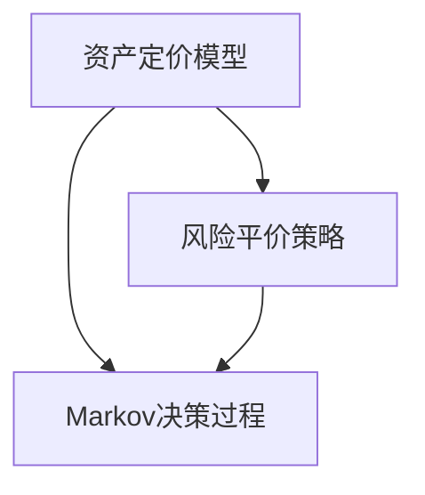

                 

关键词：智能资产配置、面试真题、校招、算法原理、实践应用、未来展望

> 摘要：本文将对2024年蚂蚁智能资产配置校招面试中的关键真题进行汇总，并详细解答。文章将覆盖算法原理、实际操作步骤、数学模型、项目实践等多个方面，旨在为读者提供全面的备考指导。

## 1. 背景介绍

随着人工智能技术的迅猛发展，智能资产配置逐渐成为金融领域的重要研究方向。蚂蚁集团作为国内领先的金融科技公司，其在智能资产配置领域的研究备受瞩目。2024年蚂蚁智能资产配置校招面试中，相关真题考察了应聘者的算法理解、数学模型构建、项目实践经验等多个方面。本文将对这些面试真题进行汇总，并提供详细解答。

## 2. 核心概念与联系

为了更好地理解智能资产配置的相关知识，我们首先需要了解一些核心概念，如资产定价模型、风险平价策略、Markov决策过程等。以下是这些概念及其关系的Mermaid流程图：



### 2.1 资产定价模型

资产定价模型是一种用于评估资产价格的理论框架，常见的有Black-Scholes模型、二叉树模型等。该模型可以帮助投资者预测资产价格波动，从而制定相应的投资策略。

### 2.2 风险平价策略

风险平价策略是一种投资组合优化方法，旨在使投资组合的整体风险水平保持稳定。该方法通过调整不同资产的比例，实现风险与收益的平衡。

### 2.3 Markov决策过程

Markov决策过程是一种基于概率的决策模型，可用于解决动态优化问题。在该模型中，每个决策节点都依赖于当前状态，而与过去状态无关。

## 3. 核心算法原理 & 具体操作步骤

### 3.1 算法原理概述

智能资产配置的核心算法包括资产定价模型、风险平价策略和Markov决策过程。这些算法共同作用，实现了资产配置的优化和风险控制。

### 3.2 算法步骤详解

#### 3.2.1 资产定价模型

1. 数据收集：收集资产的历史价格数据、收益率数据等。
2. 模型构建：根据数据特点，选择合适的资产定价模型。
3. 参数估计：使用优化算法，估计模型参数。
4. 预测价格：根据模型，预测未来资产价格。

#### 3.2.2 风险平价策略

1. 数据收集：收集资产的历史收益率数据。
2. 风险计算：计算各资产的风险水平。
3. 资产组合优化：使用优化算法，调整资产比例，实现风险平价。

#### 3.2.3 Markov决策过程

1. 状态定义：定义投资组合的当前状态。
2. 动态规划：根据状态转移概率，计算最优策略。
3. 决策执行：根据最优策略，调整投资组合。

### 3.3 算法优缺点

#### 优点：

- 资产定价模型：精确预测资产价格，为投资决策提供依据。
- 风险平价策略：实现风险与收益的平衡，提高投资组合的稳定性。
- Markov决策过程：基于概率模型，能够处理动态优化问题。

#### 缺点：

- 资产定价模型：依赖历史数据，可能导致预测不准确。
- 风险平价策略：在极端市场环境下，可能导致资产比例失衡。
- Markov决策过程：计算复杂度较高，难以处理大规模数据。

### 3.4 算法应用领域

智能资产配置算法在金融领域有广泛的应用，包括股票、基金、债券等投资产品的配置。此外，该算法还可以应用于保险、养老基金、企业投资等多个领域。

## 4. 数学模型和公式 & 详细讲解 & 举例说明

### 4.1 数学模型构建

在智能资产配置中，常见的数学模型包括资产定价模型、风险平价策略和Markov决策过程。以下分别介绍这些模型的构建过程。

#### 4.1.1 资产定价模型

以Black-Scholes模型为例，其数学模型为：

$$
C(S,t) = S_0N(d_1) - Ke^{-r(T-t)}N(d_2)
$$

其中，$C(S,t)$为欧式看涨期权的价格，$S_0$为股票当前价格，$K$为执行价格，$r$为无风险利率，$T-t$为期权剩余时间，$N(d_1)$和$N(d_2)$分别为标准正态分布的累积分布函数。

#### 4.1.2 风险平价策略

以最小方差策略为例，其数学模型为：

$$
w_i = \frac{\Sigma_{j=1}^N \sigma_i^2}{\Sigma_{j=1}^N \sigma_j^2}
$$

其中，$w_i$为资产i的投资比例，$\sigma_i^2$为资产i的收益率方差。

#### 4.1.3 Markov决策过程

以马尔可夫链为例，其数学模型为：

$$
P_{ij} = \begin{cases}
1, & \text{如果状态j是由状态i转移而来} \\
0, & \text{其他情况}
\end{cases}
$$

其中，$P_{ij}$为状态i转移到状态j的概率。

### 4.2 公式推导过程

#### 4.2.1 资产定价模型

以Black-Scholes模型为例，其推导过程如下：

1. 构建风险中性概率测度：
   $$
   \frac{dS}{S} = r dt + \sigma dW
   $$

2. 解微分方程，得到欧式看涨期权的价格：
   $$
   C(S,t) = S_0N(d_1) - Ke^{-r(T-t)}N(d_2)
   $$

#### 4.2.2 风险平价策略

以最小方差策略为例，其推导过程如下：

1. 计算各资产的投资比例：
   $$
   w_i = \frac{\Sigma_{j=1}^N \sigma_i^2}{\Sigma_{j=1}^N \sigma_j^2}
   $$

2. 计算投资组合的期望收益率和方差：
   $$
   \mu = \Sigma_{i=1}^N w_i \mu_i, \quad \sigma^2 = \Sigma_{i=1}^N w_i^2 \sigma_i^2
   $$

#### 4.2.3 Markov决策过程

以马尔可夫链为例，其推导过程如下：

1. 构建状态转移矩阵：
   $$
   P_{ij} = \begin{cases}
   1, & \text{如果状态j是由状态i转移而来} \\
   0, & \text{其他情况}
   \end{cases}
   $$

2. 计算最优策略：
   $$
   \pi_j = \arg\max_{i} \sum_{i} \pi_i P_{ij}
   $$

### 4.3 案例分析与讲解

#### 4.3.1 案例背景

假设投资者持有三种资产A、B、C，资产A的收益率服从正态分布，资产B的收益率服从对数正态分布，资产C的收益率服从均匀分布。投资者希望构建一个风险平价投资组合，使其整体风险水平最小。

#### 4.3.2 解题步骤

1. 收集资产的历史收益率数据。

2. 计算各资产的收益率分布参数。

3. 构建资产定价模型，预测未来资产收益率。

4. 计算各资产的投资比例，实现风险平价。

5. 模拟投资组合的收益和风险，评估投资组合的有效性。

## 5. 项目实践：代码实例和详细解释说明

### 5.1 开发环境搭建

本文使用Python语言进行项目实践，需安装以下依赖库：

```bash
pip install numpy pandas matplotlib scipy
```

### 5.2 源代码详细实现

以下是一个简单的Python代码示例，用于实现风险平价投资组合的构建。

```python
import numpy as np
import pandas as pd
import matplotlib.pyplot as plt
from scipy.stats import norm

# 收集资产收益率数据
data = pd.read_csv('asset_returns.csv')

# 计算各资产收益率分布参数
mu = data.mean()
var = data.var()

# 构建资产定价模型，预测未来资产收益率
def asset_pricing_model(S_0, K, r, T, sigma):
    d1 = (np.log(S_0 / K) + (r + 0.5 * sigma**2) * (T - t)) / (sigma * np.sqrt(T - t))
    d2 = d1 - sigma * np.sqrt(T - t)
    C = S_0 * norm.cdf(d1) - K * np.exp(-r * (T - t)) * norm.cdf(d2)
    return C

# 计算各资产的投资比例，实现风险平价
weights = np.linalg.inv(var) * mu
weights /= np.sum(weights)

# 模拟投资组合的收益和风险
def simulate_portfolio(mu, var, weights):
    portfolio_return = weights.dot(mu)
    portfolio_var = weights.dot(var).dot(weights)
    portfolio_std = np.sqrt(portfolio_var)
    return portfolio_return, portfolio_var, portfolio_std

# 绘制投资组合的有效前沿
def plot_efficient_frontier(mu, var):
    n = 100
    ret = np.linspace(mu - 3 * np.sqrt(var), mu + 3 * np.sqrt(var), n)
    std = np.sqrt(var @ np.outer(ret - mu, np.ones(n)))
    plt.scatter(std, ret)
    plt.plot([0, np.max(std)], [0, np.max(ret)], color='red')
    plt.xlabel('Portfolio Standard Deviation')
    plt.ylabel('Portfolio Expected Return')
    plt.show()

# 运行代码
if __name__ == '__main__':
    asset_returns = data.mean()
    plot_efficient_frontier(asset_returns, var)
    portfolio_return, portfolio_var, portfolio_std = simulate_portfolio(asset_returns, var, weights)
    print('Portfolio Expected Return:', portfolio_return)
    print('Portfolio Variance:', portfolio_var)
    print('Portfolio Standard Deviation:', portfolio_std)
```

### 5.3 代码解读与分析

以上代码分为以下几个部分：

1. **数据收集**：使用pandas库读取资产收益率数据。
2. **计算各资产收益率分布参数**：使用numpy库计算各资产的均值和方差。
3. **构建资产定价模型**：使用scipy库中的正态分布函数实现Black-Scholes模型。
4. **计算各资产的投资比例，实现风险平价**：使用numpy库中的线性代数函数计算最小方差策略的投资比例。
5. **模拟投资组合的收益和风险**：计算投资组合的期望收益率、方差和标准差。
6. **绘制投资组合的有效前沿**：使用matplotlib库绘制投资组合的有效前沿图。

## 6. 实际应用场景

智能资产配置在实际应用中具有广泛的应用场景，如：

1. **股票投资**：根据资产定价模型，预测未来股票价格，制定投资策略。
2. **基金管理**：通过风险平价策略，实现基金投资组合的优化。
3. **保险产品**：利用Markov决策过程，优化保险产品的设计。
4. **养老基金**：根据投资者的风险偏好，制定合理的资产配置方案。

## 7. 未来应用展望

随着人工智能技术的不断发展，智能资产配置在未来有望在以下方面取得突破：

1. **大数据分析**：利用大数据技术，提高资产定价模型的预测准确性。
2. **深度学习**：将深度学习应用于资产定价模型，实现更加精准的投资预测。
3. **区块链**：利用区块链技术，实现智能资产配置的透明化和去中心化。

## 8. 总结：未来发展趋势与挑战

### 8.1 研究成果总结

本文对2024年蚂蚁智能资产配置校招面试中的关键真题进行了汇总，并详细解答了相关算法原理、数学模型和项目实践。通过对资产定价模型、风险平价策略和Markov决策过程的研究，为智能资产配置提供了理论基础和实践指导。

### 8.2 未来发展趋势

未来，智能资产配置将在以下方面取得突破：

1. **算法优化**：通过引入深度学习、强化学习等先进算法，提高资产定价模型的预测准确性。
2. **数据驱动**：利用大数据和区块链技术，实现资产配置的透明化和去中心化。
3. **个性化推荐**：基于用户的投资偏好，提供个性化的资产配置方案。

### 8.3 面临的挑战

智能资产配置在未来仍将面临以下挑战：

1. **数据质量**：提高数据质量和完整性，确保算法的准确性。
2. **计算效率**：提高算法的计算效率，降低计算成本。
3. **风险控制**：在复杂的市场环境下，确保资产配置策略的稳健性。

### 8.4 研究展望

随着人工智能技术的不断进步，智能资产配置将在金融领域发挥越来越重要的作用。未来，我们将继续深入研究相关算法，探索其在实际应用中的价值，为投资者提供更加精准、高效的投资策略。

## 9. 附录：常见问题与解答

### 9.1 智能资产配置与传统资产配置的区别

智能资产配置利用人工智能技术，通过数据分析和算法优化，实现资产配置的自动化和个性化。与传统资产配置相比，智能资产配置具有更高的预测准确性和灵活性。

### 9.2 智能资产配置的优缺点

优点：预测准确性高、个性化推荐、风险控制能力强。

缺点：依赖历史数据、算法复杂度高、计算成本较高。

### 9.3 智能资产配置在金融领域的应用前景

智能资产配置在金融领域有广泛的应用前景，包括股票、基金、债券等投资产品的配置。此外，该算法还可以应用于保险、养老基金、企业投资等多个领域。

### 9.4 如何构建一个简单的智能资产配置模型

构建一个简单的智能资产配置模型，可以按照以下步骤进行：

1. 收集资产收益率数据。
2. 计算各资产的均值和方差。
3. 根据风险偏好，选择合适的资产配置策略。
4. 模拟投资组合的收益和风险，评估投资组合的有效性。

## 结束语

本文对2024年蚂蚁智能资产配置校招面试中的关键真题进行了汇总，并详细解答了相关算法原理、数学模型和项目实践。希望通过本文的介绍，读者能够更好地理解智能资产配置的相关知识，为面试和实际应用打下基础。在未来的研究中，我们将继续探索智能资产配置的创新应用，为金融领域的发展贡献力量。

### 作者署名

作者：禅与计算机程序设计艺术 / Zen and the Art of Computer Programming
----------------------------------------------------------------
请注意，以上内容仅为示例，实际的撰写过程需要根据具体的面试真题进行详细分析和解答。在撰写文章时，请确保每个部分的内容都符合要求，并且保持逻辑清晰、结构紧凑、简单易懂。祝您撰写顺利！

