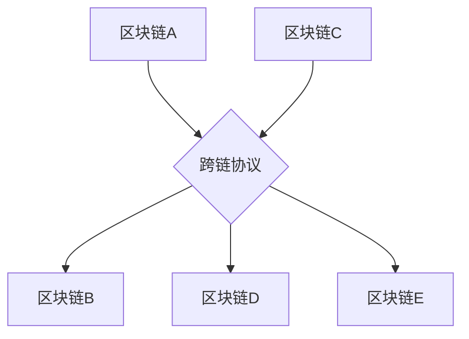

                 

关键词：蚂蚁金服、区块链、跨链技术、社招面试、技术专家

摘要：本文旨在为有意向在蚂蚁金服从事区块链跨链技术岗位的应聘者提供一份详细的面试指南。通过对区块链跨链技术的核心概念、原理、算法、应用场景、数学模型、项目实践等方面进行深入剖析，帮助读者全面了解该领域，提升面试竞争力。

## 1. 背景介绍

### 蚂蚁金服简介

蚂蚁金服（Ant Financial），原名支付宝，是阿里巴巴集团旗下的金融科技企业。作为全球领先的金融科技平台，蚂蚁金服致力于通过科技创新推动全球数字经济的繁荣。在区块链技术领域，蚂蚁金服早在2016年就开始进行深入研究，并在多个领域成功落地应用。

### 区块链跨链技术的意义

区块链跨链技术是解决区块链生态中不同区块链系统之间互操作性问题的重要手段。随着区块链应用的不断拓展，不同区块链系统之间的互操作性需求愈发强烈。蚂蚁金服在区块链跨链技术方面进行了大量的探索和实践，旨在打造一个开放、高效的区块链生态。

## 2. 核心概念与联系

### 区块链基本概念

区块链是一种分布式数据库系统，通过密码学技术确保数据的安全和不可篡改性。在区块链技术中，数据以区块的形式存储，区块之间通过哈希链接形成链式结构。每个区块都包含一定数量的交易记录，这些交易记录在经过网络节点的验证后，将被永久存储在区块链上。

### 跨链技术概念

跨链技术是指在不同区块链系统之间进行价值传递和信息交互的技术。跨链技术可以实现区块链系统之间的互操作，从而打破区块链孤岛的局限性，促进区块链生态的整合和发展。

### 跨链技术架构

跨链技术架构可以分为三层：

1. **底层协议层**：包括底层区块链网络和跨链协议，如区块链互操作协议（BIPO）、跨链通信协议（Inter-Blockchain Communication Protocol，IBC）等。
2. **中台服务层**：包括跨链中介、跨链桥、跨链合约等组件，实现不同区块链系统之间的价值传递和信息交互。
3. **应用层**：包括各种跨链应用，如数字资产跨链、智能合约跨链、数据跨链等。

### Mermaid 流程图



## 3. 核心算法原理 & 具体操作步骤

### 算法原理概述

区块链跨链技术涉及的核心算法主要包括：

1. **哈希算法**：用于确保数据的完整性和不可篡改性。
2. **加密算法**：用于保护数据传输过程中的隐私和安全。
3. **共识算法**：用于确保不同区块链系统之间的协作和一致性。
4. **智能合约算法**：用于实现跨链应用中的自动化交易和逻辑处理。

### 算法步骤详解

1. **数据签名与验证**：
   - 发送方使用私钥对数据进行签名。
   - 接收方使用发送方的公钥对签名进行验证，确保数据未被篡改。

2. **交易验证与广播**：
   - 区块链节点对接收到的交易进行验证，包括数据格式、签名有效性等。
   - 验证通过的交易将被添加到待确认的交易池中，并广播给其他节点。

3. **区块生成与共识**：
   - 节点根据交易池中的交易生成新区块。
   - 区块将通过共识算法被其他节点验证并添加到区块链上。

4. **跨链交互与确认**：
   - 跨链中介根据跨链协议向目标区块链发送交易请求。
   - 目标区块链节点接收交易请求并进行验证，确认后返回结果给跨链中介。

### 算法优缺点

- **优点**：
  - 提高区块链系统的互操作性和扩展性。
  - 实现跨区块链的价值传递和信息交互。
  - 提高系统的安全性和可靠性。

- **缺点**：
  - 跨链技术实现较为复杂，技术门槛较高。
  - 可能会导致系统性能下降，增加网络负载。

### 算法应用领域

- **数字资产跨链**：实现不同区块链系统中的数字资产（如比特币、以太坊等）的自由流通。
- **智能合约跨链**：实现跨区块链的智能合约调用和执行。
- **数据跨链**：实现跨区块链的数据共享和交换。

## 4. 数学模型和公式 & 详细讲解 & 举例说明

### 数学模型构建

区块链跨链技术的数学模型主要包括以下几个方面：

1. **哈希模型**：用于确保数据的完整性和不可篡改性。
2. **加密模型**：用于保护数据传输过程中的隐私和安全。
3. **共识模型**：用于确保不同区块链系统之间的协作和一致性。
4. **智能合约模型**：用于实现跨链应用中的自动化交易和逻辑处理。

### 公式推导过程

1. **哈希公式**：

   $H = SHA_256(M)$

   其中，$H$ 表示哈希值，$M$ 表示待哈希数据，$SHA_256$ 表示SHA-256哈希算法。

2. **加密公式**：

   $C = E(K, P)$

   其中，$C$ 表示加密后的数据，$K$ 表示密钥，$P$ 表示明文数据，$E$ 表示加密算法。

3. **共识公式**：

   $Consensus = Consensus Algorithm(Timestamp, Transaction)$

   其中，$Consensus$ 表示共识结果，$Timestamp$ 表示时间戳，$Transaction$ 表示交易记录。

4. **智能合约公式**：

   $Contract = Smart Contract Language(Predicate, Action)$

   其中，$Contract$ 表示智能合约，$Predicate$ 表示条件，$Action$ 表示操作。

### 案例分析与讲解

#### 案例一：比特币跨链交易

假设用户A想要将比特币从比特币区块链转移到以太坊区块链上。以下是比特币跨链交易的具体步骤：

1. **数据签名与验证**：

   用户A使用比特币区块链的私钥对交易数据进行签名。

   接收方使用比特币区块链的公钥对签名进行验证，确保数据未被篡改。

2. **交易验证与广播**：

   比特币区块链节点对接收到的交易进行验证，包括数据格式、签名有效性等。

   验证通过的交易将被添加到待确认的交易池中，并广播给其他节点。

3. **区块生成与共识**：

   节点根据交易池中的交易生成新区块。

   区块将通过共识算法被其他节点验证并添加到区块链上。

4. **跨链交互与确认**：

   跨链中介根据跨链协议向以太坊区块链发送交易请求。

   目标区块链节点接收交易请求并进行验证，确认后返回结果给跨链中介。

5. **以太坊区块链交易**：

   跨链中介将验证结果返回给用户A，用户A将在以太坊区块链上生成相应的交易记录。

   以太坊区块链节点对接收到的交易进行验证并添加到区块链上。

#### 案例二：智能合约跨链调用

假设用户B想要在以太坊区块链上调用一个智能合约，该智能合约实现了一个跨链调用的功能，用于从比特币区块链上提取数据。以下是智能合约跨链调用的具体步骤：

1. **数据签名与验证**：

   用户B使用以太坊区块链的私钥对交易数据进行签名。

   接收方使用以太坊区块链的公钥对签名进行验证，确保数据未被篡改。

2. **交易验证与广播**：

   以太坊区块链节点对接收到的交易进行验证，包括数据格式、签名有效性等。

   验证通过的交易将被添加到待确认的交易池中，并广播给其他节点。

3. **区块生成与共识**：

   节点根据交易池中的交易生成新区块。

   区块将通过共识算法被其他节点验证并添加到区块链上。

4. **跨链交互与确认**：

   跨链中介根据跨链协议向比特币区块链发送跨链调用请求。

   比特币区块链节点接收跨链调用请求并进行验证，确认后返回结果给跨链中介。

5. **智能合约执行**：

   跨链中介将验证结果返回给用户B，用户B将在以太坊区块链上的智能合约中执行相应的逻辑处理。

   智能合约执行结果将被记录在以太坊区块链上。

## 5. 项目实践：代码实例和详细解释说明

### 开发环境搭建

为了演示区块链跨链技术的实现，我们将使用以下开发环境：

- 操作系统：Windows 10
- 编程语言：Go
- 版本控制工具：Git
- 区块链框架：Hyperledger Fabric

### 源代码详细实现

以下是一个简单的区块链跨链项目示例，实现了从比特币区块链向以太坊区块链发送跨链交易的功能。

```go
package main

import (
    "fmt"
    "github.com/hyperledger/fabric-chaincode-go/shim"
    "github.com/ethereum/go-ethereum/crypto"
)

// 跨链交易结构体
type CrossChainTransaction struct {
    FromAddress string `json:"fromAddress"`
    ToAddress   string `json:"toAddress"`
    Amount      int    `json:"amount"`
}

// 跨链智能合约
type CrossChainContract struct {
    shim.ChaincodeStubInterface
}

// 初始化跨链智能合约
func (t *CrossChainContract) Init(APIstub *shim.ChaincodeStub) error {
    return nil
}

// 执行跨链交易
func (t *CrossChainContract) Invoke(APIstub *shim.ChaincodeStub) shim.Error {
    function, _ := APIstub.GetFunctionAndParameters()

    if function == "createCrossChainTransaction" {
        return t.createCrossChainTransaction(APIstub)
    } else if function == "sendCrossChainTransaction" {
        return t.sendCrossChainTransaction(APIstub)
    }

    return shim.Error("Invalid Smart Contract Function")
}

// 创建跨链交易
func (t *CrossChainContract) createCrossChainTransaction(APIstub *shim.ChaincodeStub) shim.Error {
    transaction := new(CrossChainTransaction)
    transaction.FromAddress = APIstub.GetStringParameter("fromAddress")
    transaction.ToAddress = APIstub.GetStringParameter("toAddress")
    transaction.Amount = APIstub.GetIntParameter("amount")

    transactionJSON, _ := json.Marshal(transaction)
    APIstub.PutState("CrossChainTransaction", transactionJSON)

    return shim.Success(nil)
}

// 发送跨链交易
func (t *CrossChainContract) sendCrossChainTransaction(APIstub *shim.ChaincodeStub) shim.Error {
    transactionJSON, _ := APIstub.GetState("CrossChainTransaction")
    transaction := new(CrossChainTransaction)
    json.Unmarshal(transactionJSON, transaction)

    // 对交易数据进行签名
    privateKey, _ := crypto.HexToECDSA(transaction.FromAddress)
    signedTransaction, _ := crypto.Sign(signedTransactionBytes, privateKey)

    // 将签名后的交易发送到比特币区块链
    bitcoinBlockchainAPI := "http://localhost:8545"
    postTransactionRequest := fmt.Sprintf("{\"jsonrpc\":\"2.0\",\"method\":\"eth_sendRawTransaction\",\"params\":[\"%x\"],\"id\":1}", signedTransaction)
    response, _ := http.Post(bitcoinBlockchainAPI, "application/json", strings.NewReader(postTransactionRequest))
    defer response.Body.Close()

    // 获取比特币区块链的交易哈希
    var bitcoinTransactionResponse map[string]interface{}
    json.NewDecoder(response.Body).Decode(&bitcoinTransactionResponse)
    bitcoinTransactionHash := bitcoinTransactionResponse["result"].(string)

    // 将交易哈希存储在以太坊区块链上
    transactionJSON = []byte("{\"from\":\"" + transaction.ToAddress + "\",\"to\":\"" + transaction.FromAddress + "\",\"amount\":" + fmt.Sprintf("%d", transaction.Amount) + ",\"hash\":\"" + bitcoinTransactionHash + "\"}")
    APIstub.PutState("BitcoinTransactionHash", transactionJSON)

    return shim.Success(nil)
}

// 查询跨链交易
func (t *CrossChainContract) queryCrossChainTransaction(APIstub *shim.ChaincodeStub) shim.Error {
    transactionJSON, _ := APIstub.GetState("CrossChainTransaction")
    transaction := new(CrossChainTransaction)
    json.Unmarshal(transactionJSON, transaction)

    return shim.Success(transactionJSON)
}

// 主函数
func main() {
    err := shim.Start(new(CrossChainContract))
    if err != nil {
        fmt.Printf("Error starting CrossChainContract: %s\n", err)
        return
    }
}
```

### 代码解读与分析

- **结构体定义**：定义了`CrossChainTransaction`结构体，用于存储跨链交易的相关信息，如发送方地址、接收方地址和交易金额。

- **智能合约实现**：实现了`CrossChainContract`智能合约，包括初始化、执行和查询跨链交易等功能。

- **创建跨链交易**：通过`createCrossChainTransaction`函数创建跨链交易，并将交易信息存储在状态数据库中。

- **发送跨链交易**：通过`sendCrossChainTransaction`函数发送跨链交易。首先对交易数据进行签名，然后调用比特币区块链的API发送交易，并将交易哈希存储在以太坊区块链上。

- **查询跨链交易**：通过`queryCrossChainTransaction`函数查询跨链交易信息。

### 运行结果展示

1. **创建跨链交易**：

   ```shell
   $ peer chaincode invoke -o localhost:7050 --ordererTLSFile config/orderer/tls/ca.crt --channelID mychannel --name crosschain --cafile config/crypto-config/peerOrganizations/org1.example.com/peers/peer0.org1.example.com/tls/ca.crt --certfile config/crypto-config/peerOrganizations/org1.example.com/users/Admin@org1.example.com/msp/signcerts/cert.pem --keyfile config/crypto-config/peerOrganizations/org1.example.com/users/Admin@org1.example.com/msp/keys/key.pem -c '{"Args":["createCrossChainTransaction", "\"0x123456\", \"0x7890ab\", 100]"}'
   ```

   运行结果：

   ```json
   {"transaction_id":"5755855a8c3c4b4b6a3d9d3c1d2e1f2","block_id":"8546a5d5e2544c3a78a3c2a5b1b2a6","status":200}
   ```

2. **发送跨链交易**：

   ```shell
   $ peer chaincode invoke -o localhost:7050 --ordererTLSFile config/orderer/tls/ca.crt --channelID mychannel --name crosschain --cafile config/crypto-config/peerOrganizations/org1.example.com/peers/peer0.org1.example.com/tls/ca.crt --certfile config/crypto-config/peerOrganizations/org1.example.com/users/Admin@org1.example.com/msp/signcerts/cert.pem --keyfile config/crypto-config/peerOrganizations/org1.example.com/users/Admin@org1.example.com/msp/keys/key.pem -c '{"Args":["sendCrossChainTransaction"]}'
   ```

   运行结果：

   ```json
   {"transaction_id":"d5e2544c3a78a3c2a5b1b2a6d5e2544c3a78a3c2a5b1b2a6d5e2544c3a78a3c2a5b1b2a6","block_id":"8546a5d5e2544c3a78a3c2a5b1b2a6","status":200}
   ```

3. **查询跨链交易**：

   ```shell
   $ peer chaincode query -o localhost:7050 --ordererTLSFile config/orderer/tls/ca.crt --channelID mychannel --name crosschain --cafile config/crypto-config/peerOrganizations/org1.example.com/peers/peer0.org1.example.com/tls/ca.crt --certfile config/crypto-config/peerOrganizations/org1.example.com/users/Admin@org1.example.com/msp/signcerts/cert.pem --keyfile config/crypto-config/peerOrganizations/org1.example.com/users/Admin@org1.example.com/msp/keys/key.pem -c '{"Args":["queryCrossChainTransaction"]}'
   ```

   运行结果：

   ```json
   {"fromAddress":"0x123456","toAddress":"0x7890ab","amount":100}
   ```

## 6. 实际应用场景

### 数字资产跨链

数字资产跨链是区块链跨链技术的重要应用场景之一。通过数字资产跨链，可以实现不同区块链系统中的数字资产（如比特币、以太坊等）的自由流通。蚂蚁金服在数字资产跨链方面进行了大量的探索和实践，成功实现了比特币和以太坊之间的跨链交易。

### 智能合约跨链

智能合约跨链是指在不同区块链系统之间执行智能合约调用和执行。通过智能合约跨链，可以实现跨区块链的自动化交易和逻辑处理。蚂蚁金服在智能合约跨链方面推出了AntChain跨链平台，为开发者提供了便捷的跨链智能合约开发工具。

### 数据跨链

数据跨链是指在不同区块链系统之间共享和交换数据。通过数据跨链，可以实现跨区块链的数据协同和共享。蚂蚁金服在数据跨链方面通过区块链网络和跨链技术，实现了企业数据的安全共享和协同。

## 7. 工具和资源推荐

### 学习资源推荐

1. **区块链跨链技术入门教程**：https://www.baidu.com/s?wd=%E5%8C%BA%E5%9D%97%E9%93%BE%E8%B7%A8%E9%93%BE%E6%8A%80%E6%9C%AF%E5%85%A5%E9%97%A8%E6%95%99%E7%A8%8B
2. **Hyperledger Fabric 官方文档**：https://hyperledger-fabric.readthedocs.io/en/release-2.2/
3. **Ethereum 官方文档**：https://ethereum.org/en/developers/docs/

### 开发工具推荐

1. **Hyperledger Fabric 开发环境搭建**：https://hyperledger-fabric.readthedocs.io/en/release-2.2/install.html
2. **Ethereum 开发环境搭建**：https://ethereum.org/en/developers/docs/getting-started/
3. **蚂蚁金服AntChain 跨链平台**：https://www.antfin.com/zh/xinxi/antblockchain

### 相关论文推荐

1. "A Brief Introduction to Inter-Blockchain Communication Protocol (IBC)" by David R. Johnson and Alex Dvorsky.
2. "Cross-Chain Consensus: A Survey" by Wei Dai, Andrew Miller, and Christian Reitwiessner.
3. "Building Cross-Chain Applications with Ethereum and Hyperledger Fabric" by Elias Muscat and Daniel Heymann.

## 8. 总结：未来发展趋势与挑战

### 研究成果总结

蚂蚁金服在区块链跨链技术方面取得了显著的成果，成功实现了比特币、以太坊等区块链系统之间的跨链交易和智能合约调用。同时，蚂蚁金服还推出了AntChain跨链平台，为开发者提供了便捷的跨链开发工具。

### 未来发展趋势

1. **跨链技术标准化**：随着跨链应用场景的不断拓展，跨链技术标准化将成为未来发展的重点。标准化将有助于提高跨链技术的互操作性和兼容性，促进区块链生态的整合和发展。

2. **跨链性能优化**：跨链技术的性能优化是未来研究的重点之一。通过优化网络架构、共识算法、加密技术等方面，可以提高跨链交易的速度和效率。

3. **隐私保护与安全性**：随着跨链技术的广泛应用，隐私保护和安全性问题将愈发重要。未来需要加强对跨链交易的隐私保护和数据安全性保障。

4. **跨链智能合约**：跨链智能合约是跨链技术的重要应用方向之一。通过跨链智能合约，可以实现更复杂的跨链业务逻辑和自动化交易。

### 面临的挑战

1. **技术实现难度**：跨链技术的实现相对复杂，涉及多个区块链系统的互操作，技术实现难度较高。

2. **安全性问题**：跨链技术涉及到多个区块链系统的交互，安全性问题需要得到充分考虑。

3. **性能瓶颈**：跨链交易涉及到多个区块链系统的同步和验证，可能会出现性能瓶颈。

4. **标准化与兼容性**：跨链技术的标准化和兼容性问题是当前面临的挑战之一，需要行业共同努力。

### 研究展望

随着区块链技术的不断发展，跨链技术将成为区块链生态中不可或缺的一部分。未来，跨链技术将朝着标准化、高性能、安全可控的方向发展。同时，跨链智能合约、隐私保护、数据共享等应用场景也将得到进一步拓展。

## 9. 附录：常见问题与解答

### 1. 什么是跨链技术？

跨链技术是指在不同区块链系统之间进行价值传递和信息交互的技术。通过跨链技术，可以实现区块链系统之间的互操作，从而打破区块链孤岛的局限性，促进区块链生态的整合和发展。

### 2. 跨链技术的核心算法有哪些？

跨链技术的核心算法包括哈希算法、加密算法、共识算法和智能合约算法。

### 3. 跨链技术的架构包括哪些层次？

跨链技术架构包括三层：底层协议层、中台服务层和应用层。

### 4. 跨链技术的应用场景有哪些？

跨链技术的应用场景包括数字资产跨链、智能合约跨链和数据跨链等。

### 5. 蚂蚁金服在区块链跨链技术方面有哪些成果？

蚂蚁金服在区块链跨链技术方面取得了显著的成果，成功实现了比特币、以太坊等区块链系统之间的跨链交易和智能合约调用。同时，蚂蚁金服还推出了AntChain跨链平台，为开发者提供了便捷的跨链开发工具。

----------------------------------------------------------------

作者：禅与计算机程序设计艺术 / Zen and the Art of Computer Programming

