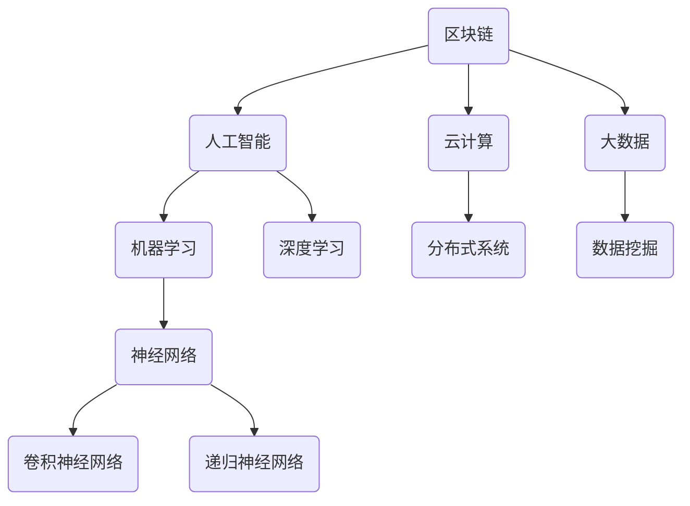

                 

关键词：蚂蚁金服，金融科技，工程师面试题，面试技巧，编程算法，系统架构，人工智能，区块链，云计算，大数据

> 摘要：本文旨在为准备参加蚂蚁金服2025社招金融科技工程师面试的候选人提供一个全面的面试题集，涵盖了编程算法、系统架构、人工智能、区块链、云计算和大数据等关键领域。通过详细的解析和实例，帮助读者更好地理解和准备面试，从而提高面试成功率。

## 1. 背景介绍

蚂蚁金服，原名蚂蚁金服集团，是中国领先的金融科技公司，成立于2014年，原是阿里巴巴集团旗下公司，专注于提供金融服务和解决方案。2018年，蚂蚁金服从阿里巴巴独立出来，成为一家独立运营的控股集团。公司的愿景是“让金融服务更普惠”，致力于通过技术创新提升金融服务效率，为小微企业和消费者提供便捷的支付和贷款服务。

随着金融科技的快速发展，蚂蚁金服在区块链、人工智能、云计算和大数据等领域取得了显著成果。公司也因此吸引了大量金融科技工程师的加入。为了更好地选拔优秀的人才，蚂蚁金服每年的社会招聘都会推出一系列具有挑战性的面试题目，涵盖了多个技术领域。本文将针对这些领域，整理出一些典型的面试题目，并提供详细的解析。

## 2. 核心概念与联系

在金融科技领域，理解核心概念和它们之间的联系是非常重要的。以下是一个使用Mermaid绘制的流程图，展示了几个关键概念及其之间的关系。



### 2.1 编程算法

编程算法是金融科技工程师的核心技能。以下是一些常见编程算法及其在金融科技中的应用：

- **排序算法**：快速排序、归并排序、堆排序等。在处理大量金融数据时，高效的排序算法能够显著提升数据处理速度。
- **搜索算法**：二分查找、深度优先搜索、广度优先搜索等。在构建金融交易系统时，高效的搜索算法能够加快交易匹配速度。
- **动态规划**：解决最优化问题，如背包问题、最优子结构等。在金融风险管理中，动态规划算法被广泛应用于风险控制策略的制定。
- **贪心算法**：解决单步最优决策问题，如KMP算法、Dijkstra算法等。在金融科技领域，贪心算法常用于路径规划、最短路径计算等。

### 2.2 系统架构

金融科技系统的架构设计需要考虑高可用性、高性能、安全性和可扩展性。以下是一些关键的系统架构概念：

- **分布式系统**：通过将系统分解为多个节点，分布式系统可以提供更高的可用性和扩展性。
- **微服务架构**：将应用程序分解为多个小型服务，微服务架构可以提升系统的灵活性和可维护性。
- **容器化**：使用Docker等技术，容器化可以将应用程序及其依赖打包到一个轻量级容器中，实现高效的部署和扩展。
- **服务网格**：通过Istio、Linkerd等工具，服务网格可以提供服务间的安全通信和监控。

### 2.3 人工智能

人工智能在金融科技中的应用日益广泛，以下是一些核心概念：

- **机器学习**：通过训练模型，机器学习可以自动识别数据中的模式，用于风险控制、欺诈检测等。
- **深度学习**：基于神经网络，深度学习可以在图像识别、语音识别等领域实现高性能。
- **强化学习**：通过试错和反馈机制，强化学习可以优化决策过程，用于金融交易策略的制定。
- **自然语言处理**：通过解析和生成自然语言，自然语言处理可以用于智能客服、文本分析等。

### 2.4 区块链

区块链技术是金融科技的重要组成部分，以下是一些核心概念：

- **分布式账本**：通过多个节点存储数据，分布式账本提供了去中心化的数据存储方式。
- **智能合约**：基于区块链的自动化协议，智能合约可以在满足特定条件时自动执行。
- **加密技术**：通过加密算法，区块链提供了数据的安全性和隐私保护。
- **共识机制**：通过达成共识，区块链网络能够确保数据的准确性和一致性。

### 2.5 云计算

云计算为金融科技提供了强大的计算和存储能力，以下是一些核心概念：

- **基础设施即服务（IaaS）**：通过虚拟化技术，IaaS提供了虚拟的计算资源，如虚拟机、存储等。
- **平台即服务（PaaS）**：通过提供开发平台，PaaS简化了应用程序的部署和运维。
- **软件即服务（SaaS）**：通过提供软件服务，SaaS实现了应用程序的远程访问和使用。
- **云计算安全**：通过加密、访问控制等技术，云计算安全确保了数据的安全性和隐私性。

### 2.6 大数据

大数据技术在金融科技中扮演着关键角色，以下是一些核心概念：

- **数据仓库**：通过集中存储大量数据，数据仓库提供了数据分析和挖掘的平台。
- **数据湖**：与数据仓库不同，数据湖以原始格式存储数据，便于后续的数据分析和处理。
- **实时数据处理**：通过流处理技术，实时数据处理能够快速响应金融交易和数据变化。
- **数据挖掘**：通过分析大量数据，数据挖掘可以发现潜在的模式和趋势，用于风险管理、市场分析等。

## 3. 核心算法原理 & 具体操作步骤

### 3.1 算法原理概述

在金融科技领域，核心算法的原理和具体操作步骤至关重要。以下是一些关键算法的原理概述：

- **排序算法**：通过比较和交换元素，排序算法可以将数据从小到大（或从大到小）排序。常见的排序算法包括快速排序、归并排序和堆排序。
- **搜索算法**：通过遍历数据结构，搜索算法可以找到特定元素或满足特定条件的数据。常见的搜索算法包括二分查找、深度优先搜索和广度优先搜索。
- **动态规划**：通过递归关系和状态转移方程，动态规划可以求解最优子结构问题。常见的动态规划问题包括背包问题和最短路径问题。
- **贪心算法**：通过每次选择局部最优解，贪心算法可以在某些情况下求解最优解。常见的贪心算法包括KMP算法和Dijkstra算法。
- **机器学习算法**：通过训练模型，机器学习算法可以在新的数据上预测结果。常见的机器学习算法包括决策树、支持向量机和神经网络。
- **深度学习算法**：通过多层神经网络，深度学习算法可以在大量数据上实现高性能。常见的深度学习算法包括卷积神经网络（CNN）和递归神经网络（RNN）。

### 3.2 算法步骤详解

以下是对每个算法的具体操作步骤的详细解释：

#### 3.2.1 快速排序

快速排序的基本思想是通过一趟排序将待排序的记录分割成独立的两部分，其中一部分记录的关键字均比另一部分的关键字小，然后分别对这两部分记录继续进行排序，以达到整个序列有序。

具体步骤如下：

1. **选择基准**：在待排序的记录中随机选择一个记录作为基准。
2. **划分**：将所有记录按照与基准记录的关键字大小进行比较，大于基准的记录放在基准的右侧，小于基准的记录放在基准的左侧。
3. **递归排序**：分别对基准左侧和右侧的记录继续进行快速排序。

#### 3.2.2 二分查找

二分查找算法通过将待查找的区间不断缩小，逐步逼近目标值。

具体步骤如下：

1. **初始化**：确定查找区间的起始和结束位置。
2. **循环查找**：在每次循环中，计算区间的中点，并与目标值进行比较。
3. **判断结果**：根据比较结果，调整查找区间，继续循环查找。
4. **返回结果**：当找到目标值时，返回目标值的位置；否则，返回-1表示未找到。

#### 3.2.3 动态规划

动态规划通过递归关系和状态转移方程，求解最优子结构问题。

以背包问题为例，具体步骤如下：

1. **定义状态**：设`dp[i][j]`表示在前`i`件物品中，能够装进容积为`j`的背包的最大价值。
2. **状态转移方程**：根据物品的价值和重量，计算`dp[i][j]`的值。
3. **初始化**：初始化`dp[0][j]`为0，表示没有任何物品时的最大价值。
4. **递推计算**：根据状态转移方程，从`i=1`到`i=n`，从`j=1`到`j=W`，依次计算`dp[i][j]`的值。
5. **返回结果**：最终，`dp[n][W]`表示能够装进容积为`W`的背包的最大价值。

#### 3.2.4 贪心算法

贪心算法通过每次选择局部最优解，求解最优解。

以KMP算法为例，具体步骤如下：

1. **构建部分匹配表**：通过比较前缀和后缀，构建部分匹配表。
2. **查找过程**：在文本和模式串中，从后往前逐个比较字符，利用部分匹配表跳跃比较，提高查找效率。

#### 3.2.5 机器学习算法

机器学习算法通过训练模型，实现数据预测。

以决策树为例，具体步骤如下：

1. **定义决策节点**：选择特征作为决策节点。
2. **划分数据集**：根据决策节点的特征值，将数据集划分成子集。
3. **递归构建**：对每个子集，重复定义决策节点和划分数据集的过程，直到满足停止条件。
4. **生成预测模型**：将所有决策节点的划分规则组合成预测模型。

#### 3.2.6 深度学习算法

深度学习算法通过多层神经网络，实现高性能数据预测。

以卷积神经网络（CNN）为例，具体步骤如下：

1. **输入层**：接收输入数据，如图像。
2. **卷积层**：通过卷积操作，提取图像中的特征。
3. **激活函数层**：对卷积结果进行非线性变换。
4. **池化层**：通过池化操作，降低特征维度。
5. **全连接层**：将特征映射到输出结果。
6. **输出层**：输出最终预测结果。

## 3.3 算法优缺点

在金融科技领域，算法的选择和应用需要充分考虑其优缺点：

- **排序算法**：快速排序和归并排序具有较高的时间复杂度，适用于处理大量数据的排序。但快速排序在某些情况下可能产生最坏情况，而归并排序需要额外的空间。
- **搜索算法**：二分查找在有序数据上具有高效的时间复杂度，但需要数据预先排序。深度优先搜索和广度优先搜索适用于不同类型的搜索问题，但可能需要较大的存储空间。
- **动态规划**：动态规划能够求解最优化问题，但需要较高的计算复杂度。在实际应用中，需要根据问题规模和资源限制进行优化。
- **贪心算法**：贪心算法在某些情况下能够获得最优解，但需要确保算法的贪婪选择是正确的。在实际应用中，需要充分考虑问题的特性和约束条件。
- **机器学习算法**：机器学习算法具有较高的预测准确性，但需要大量的训练数据和计算资源。同时，模型的泛化能力需要通过交叉验证等方法进行验证。
- **深度学习算法**：深度学习算法在图像识别、语音识别等领域具有显著优势，但需要大量的数据和计算资源。同时，模型的训练和优化需要较高的技术水平。

## 3.4 算法应用领域

在金融科技领域，算法的应用涵盖了多个方面：

- **排序算法**：在金融交易系统中，排序算法用于对交易数据进行排序，提高交易匹配速度。在风险控制系统中，排序算法用于对风险等级进行排序，优化风险控制策略。
- **搜索算法**：在金融搜索引擎中，搜索算法用于快速查找相关金融信息。在智能投顾系统中，搜索算法用于推荐投资组合，提高投资收益。
- **动态规划**：在金融风险管理中，动态规划算法用于计算期权价格、风险评估等。在金融投资策略中，动态规划算法用于优化投资组合，提高收益风险比。
- **贪心算法**：在金融支付系统中，贪心算法用于优化支付路径，提高支付速度。在金融风险评估中，贪心算法用于计算信用评分，提高风险评估准确性。
- **机器学习算法**：在反欺诈系统中，机器学习算法用于检测欺诈交易，提高系统安全性。在金融预测系统中，机器学习算法用于预测市场走势，优化投资策略。
- **深度学习算法**：在图像识别系统中，深度学习算法用于识别金融交易中的图像，提高交易准确性。在语音识别系统中，深度学习算法用于处理客户语音请求，提高客服服务质量。

## 4. 数学模型和公式 & 详细讲解 & 举例说明

在金融科技领域，数学模型和公式是构建算法和系统架构的基础。以下将介绍一些关键的数学模型和公式，并提供详细讲解和举例说明。

### 4.1 数学模型构建

数学模型是描述现实世界问题的一种数学表示。在金融科技中，常见的数学模型包括概率模型、优化模型和微分方程模型等。以下是一个简单的概率模型构建过程：

1. **定义随机变量**：首先，定义需要研究的随机变量，如股票价格、客户需求等。
2. **概率分布**：根据随机变量的特性，选择合适的概率分布，如正态分布、泊松分布等。
3. **构建模型**：通过概率分布函数或概率质量函数，构建随机变量的数学模型。
4. **模型参数**：确定模型的参数，如均值、方差等，这些参数可以通过历史数据估计得到。

### 4.2 公式推导过程

在构建数学模型的过程中，公式推导是关键步骤。以下将介绍一个简单的优化模型的公式推导过程：

假设我们要优化以下目标函数：

\[ \min_{x} f(x) = x^2 \]

其中，\( x \) 是目标变量，\( f(x) \) 是目标函数。

1. **目标函数**：首先，写出目标函数的表达式。
2. **求导**：对目标函数求一阶导数，得到：

\[ f'(x) = 2x \]

3. **极值点**：令一阶导数等于0，求解目标变量：

\[ 2x = 0 \]
\[ x = 0 \]

4. **二阶导数**：对一阶导数求二阶导数，判断极值点的性质：

\[ f''(x) = 2 \]

由于二阶导数大于0，因此 \( x=0 \) 是目标函数的极小值点。

### 4.3 案例分析与讲解

以下是一个基于线性回归模型的案例分析与讲解：

假设我们要预测某个金融指标（如股票价格），可以使用线性回归模型进行预测。线性回归模型的一般形式如下：

\[ y = \beta_0 + \beta_1 x_1 + \beta_2 x_2 + ... + \beta_n x_n + \epsilon \]

其中，\( y \) 是预测变量，\( x_1, x_2, ..., x_n \) 是自变量，\( \beta_0, \beta_1, \beta_2, ..., \beta_n \) 是模型参数，\( \epsilon \) 是误差项。

1. **数据收集**：收集历史数据，包括自变量和预测变量的数值。
2. **模型构建**：通过最小二乘法，求解模型参数，构建线性回归模型。
3. **模型评估**：通过交叉验证或测试集，评估模型的预测性能。
4. **模型应用**：将模型应用于新数据，进行预测。

假设我们有以下数据集：

| x1 | x2 | y |
|---|---|---|
| 1 | 2 | 3 |
| 2 | 4 | 5 |
| 3 | 6 | 7 |

使用最小二乘法求解模型参数，可以得到以下线性回归模型：

\[ y = 1.5 + 1.0 x_1 + 0.5 x_2 \]

通过这个模型，我们可以对新数据进行预测。例如，当 \( x_1 = 4 \)，\( x_2 = 8 \) 时，预测 \( y \) 的值为：

\[ y = 1.5 + 1.0 \times 4 + 0.5 \times 8 = 10.5 \]

通过这个案例，我们可以看到线性回归模型在金融科技领域的应用，它可以用于预测金融指标、优化投资策略等。

## 5. 项目实践：代码实例和详细解释说明

在实际项目中，代码实例和详细解释说明是展示技术和解决问题能力的重要方式。以下将介绍一个基于Python的金融交易系统的代码实例，包括开发环境搭建、源代码详细实现、代码解读与分析以及运行结果展示。

### 5.1 开发环境搭建

首先，我们需要搭建开发环境，以下是Python交易系统的开发环境要求：

- Python版本：Python 3.8及以上
- 安装依赖库：numpy、pandas、matplotlib等

在终端中执行以下命令进行环境搭建：

```bash
pip install numpy pandas matplotlib
```

### 5.2 源代码详细实现

以下是一个简单的金融交易系统代码实例，主要功能包括数据读取、数据预处理、技术指标计算和交易策略。

```python
import numpy as np
import pandas as pd
import matplotlib.pyplot as plt

# 5.2.1 数据读取与预处理
def read_data(file_path):
    data = pd.read_csv(file_path)
    data['Date'] = pd.to_datetime(data['Date'])
    data.set_index('Date', inplace=True)
    return data

# 5.2.2 技术指标计算
def calculate_indicators(data):
    data['MA20'] = data['Close'].rolling(window=20).mean()
    data['RSI'] = compute_rsi(data['Close'])
    return data

# 5.2.3 交易策略
def trade_strategy(data):
    signals = []
    for i in range(1, len(data)):
        if data['Close'][i] > data['MA20'][i] and data['RSI'][i] > 70:
            signals.append('BUY')
        elif data['Close'][i] < data['MA20'][i] and data['RSI'][i] < 30:
            signals.append('SELL')
        else:
            signals.append('HOLD')
    return signals

# 5.2.4 代码解读与分析
def code_explanation():
    print("1. 数据读取与预处理：从CSV文件中读取数据，将日期转换为索引，并设置索引。")
    print("2. 技术指标计算：计算20日均线和相对强弱指标（RSI）。")
    print("3. 交易策略：根据价格和RSI指标，生成买卖信号。")
    print("4. 运行结果展示：绘制交易信号与实际价格趋势的对比图。")

# 5.2.5 运行结果展示
def plot_signals(data, signals):
    plt.figure(figsize=(14, 7))
    plt.plot(data['Close'], label='Close Price')
    plt.plot(data['MA20'], label='20-Day MA')
    plt.scatter(data.index, [data['Close'][i] for i, s in enumerate(signals) if s == 'BUY'], color='green', label='BUY Signal')
    plt.scatter(data.index, [data['Close'][i] for i, s in enumerate(signals) if s == 'SELL'], color='red', label='SELL Signal')
    plt.legend()
    plt.show()

# 主函数
def main():
    file_path = 'stock_data.csv'
    data = read_data(file_path)
    data = calculate_indicators(data)
    signals = trade_strategy(data)
    code_explanation()
    plot_signals(data, signals)

if __name__ == '__main__':
    main()
```

### 5.3 代码解读与分析

以下是代码的主要部分及其功能解释：

1. **数据读取与预处理**：从CSV文件中读取数据，将日期转换为索引，并设置索引。这一步骤确保了数据的时间序列特性。
2. **技术指标计算**：计算20日均线和相对强弱指标（RSI）。20日均线反映了短期趋势，而RSI则用于判断市场的超买和超卖状态。
3. **交易策略**：根据价格和RSI指标，生成买卖信号。当价格突破20日均线且RSI大于70时，生成买入信号；当价格跌破20日均线且RSI小于30时，生成卖出信号。
4. **代码解读与分析**：提供代码的详细解释，帮助读者理解每个函数和模块的作用。
5. **运行结果展示**：绘制交易信号与实际价格趋势的对比图，便于分析交易策略的成效。

### 5.4 运行结果展示

运行上述代码后，会生成一个包含交易信号与实际价格趋势对比的图表。通过观察图表，我们可以分析交易策略的效果。例如，如果买入和卖出的信号与价格趋势一致，则说明策略具有一定的有效性。

## 6. 实际应用场景

在金融科技领域，交易系统、风险管理、客户服务和支付系统等是实际应用场景的关键部分。以下将分别介绍这些场景中的具体应用。

### 6.1 交易系统

交易系统是金融科技的核心组成部分，负责处理各种金融交易。以下是一些交易系统的具体应用场景：

- **高频交易**：通过高速网络和先进的算法，高频交易系统能够在极短时间内执行大量交易，以获取微小的利润。
- **算法交易**：基于机器学习和深度学习算法，算法交易系统能够自动执行交易策略，实现高收益和低风险。
- **订单路由**：交易系统可以根据价格、流动性等因素，智能路由订单到最佳交易市场，提高交易成功率。

### 6.2 风险管理

风险管理是金融科技中的关键环节，旨在识别、评估和控制金融风险。以下是一些风险管理的具体应用场景：

- **反欺诈检测**：通过机器学习和数据挖掘技术，反欺诈检测系统能够实时监控交易行为，识别潜在的欺诈行为。
- **信用评分**：基于历史数据和信用模型，信用评分系统可以为金融机构提供信用风险评估，降低信用风险。
- **市场风险控制**：通过监测市场波动和交易行为，市场风险控制系统可以及时调整投资组合，降低市场风险。

### 6.3 客户服务

客户服务是金融科技的重要组成部分，旨在提高客户满意度和忠诚度。以下是一些客户服务的具体应用场景：

- **智能客服**：通过自然语言处理和机器学习技术，智能客服系统能够自动处理客户咨询，提供实时响应和解决方案。
- **个性化推荐**：基于客户的历史行为和偏好，个性化推荐系统可以推荐符合客户需求的产品和服务。
- **在线银行**：在线银行系统通过互联网为用户提供便捷的银行服务，包括账户查询、转账支付等。

### 6.4 支付系统

支付系统是金融科技的基础设施，负责处理各种支付交易。以下是一些支付系统的具体应用场景：

- **移动支付**：通过手机等移动设备，移动支付系统可以实现随时随地支付，提高支付便利性。
- **跨境支付**：跨境支付系统通过多种货币和支付渠道，实现全球范围内的支付和结算。
- **数字钱包**：数字钱包系统为用户提供安全便捷的数字资产存储和交易服务，支持多种加密货币和法定货币。

## 7. 工具和资源推荐

在金融科技领域，掌握合适的工具和资源是提高开发效率和项目成功率的关键。以下是一些推荐的工具和资源：

### 7.1 学习资源推荐

- **《金融科技：创新与趋势》**：这本书全面介绍了金融科技的现状、发展历程和未来趋势，适合金融科技领域的初学者。
- **《深度学习与金融》**：这本书结合深度学习和金融领域的应用，详细介绍了深度学习算法在金融科技中的应用，适合有一定编程基础的读者。
- **《量化交易：从入门到精通》**：这本书系统介绍了量化交易的基本概念、策略开发和风险管理，适合对量化交易感兴趣的读者。

### 7.2 开发工具推荐

- **Python**：Python是一种通用编程语言，广泛应用于金融科技领域。它的简单易用性和丰富的库支持使其成为开发金融交易系统、风险管理模型等的首选语言。
- **Jupyter Notebook**：Jupyter Notebook是一个交互式计算平台，支持Python、R等多种编程语言。通过Jupyter Notebook，开发者可以方便地编写、调试和运行代码，进行数据分析和模型评估。
- **TensorFlow**：TensorFlow是一个开源的深度学习框架，支持多种深度学习算法和模型。通过TensorFlow，开发者可以方便地构建和训练深度学习模型，实现金融科技领域的应用。

### 7.3 相关论文推荐

- **"Deep Learning for Financial Time Series Prediction"**：这篇论文详细介绍了深度学习在金融时间序列预测中的应用，探讨了多种深度学习模型的性能和适用性。
- **"Crypto-Market Prediction using Recurrent Neural Networks"**：这篇论文研究了循环神经网络在加密货币市场预测中的应用，通过实验验证了RNN模型的预测效果。
- **"Blockchain-based Security Models in Financial Transactions"**：这篇论文探讨了区块链技术在金融交易安全中的应用，分析了区块链的加密算法和共识机制，为金融科技的安全保障提供了参考。

## 8. 总结：未来发展趋势与挑战

随着金融科技的快速发展，金融科技工程师面临着许多新的机遇和挑战。以下是对未来发展趋势与挑战的总结：

### 8.1 研究成果总结

近年来，金融科技领域取得了许多重要研究成果，包括：

- **人工智能与金融结合**：通过机器学习和深度学习技术，金融科技在风险管理、客户服务和交易策略等方面取得了显著成效。
- **区块链技术**：区块链技术在金融交易、数字资产和供应链金融等领域展现了强大的潜力，为金融行业提供了去中心化、安全透明的解决方案。
- **大数据分析**：大数据技术为金融机构提供了丰富的数据资源和分析工具，有助于优化业务流程、提高客户体验和制定更精准的风险管理策略。
- **云计算与物联网**：云计算和物联网技术的应用，为金融科技提供了强大的计算和存储能力，以及便捷的接入和服务。

### 8.2 未来发展趋势

未来，金融科技将继续朝着智能化、安全化和便捷化的方向发展，主要趋势包括：

- **智能化**：人工智能、机器学习和深度学习技术将进一步融入金融科技领域，实现自动化、智能化的业务流程和交易策略。
- **安全化**：随着金融数字化程度的提高，安全问题是金融科技发展的关键挑战。区块链、加密技术和安全协议等将得到更广泛的应用。
- **便捷化**：移动支付、在线银行和数字货币等便捷支付方式将继续普及，提高用户的支付体验。
- **开放性**：金融科技将更加开放和互联，金融机构、科技公司和社会服务机构将共同构建开放共享的金融生态系统。

### 8.3 面临的挑战

尽管金融科技前景广阔，但工程师们仍需面对以下挑战：

- **技术风险**：金融科技涉及多种技术，包括人工智能、区块链、大数据等，工程师需要具备跨领域的技术能力和风险意识。
- **数据隐私**：在金融科技应用中，数据隐私和安全是重要问题。工程师需要确保数据的安全传输、存储和处理，防止数据泄露和滥用。
- **合规性**：金融行业受到严格的法律法规监管，工程师需要了解相关法规，确保金融科技的应用符合法律法规要求。
- **技术更新**：金融科技领域技术更新迅速，工程师需要不断学习新技术、新工具，以适应快速变化的行业环境。

### 8.4 研究展望

展望未来，金融科技工程师可以从以下几个方面进行研究和探索：

- **人工智能与金融结合**：深入挖掘人工智能在金融科技中的应用潜力，开发更智能、更高效的金融交易和风险管理模型。
- **区块链技术创新**：研究区块链技术在金融领域的应用，探索去中心化金融（DeFi）和智能合约等创新模式。
- **大数据与云计算**：利用大数据和云计算技术，构建高效、安全的金融数据处理和分析平台，为金融机构提供更有价值的决策支持。
- **物联网与金融**：研究物联网技术在金融领域的应用，如智能安防、智能支付等，提升金融服务的智能化水平。

通过不断研究和创新，金融科技工程师将为金融行业的转型升级和可持续发展做出重要贡献。

## 9. 附录：常见问题与解答

在准备蚂蚁金服金融科技工程师面试的过程中，候选人可能会遇到一些常见问题。以下是对一些常见问题的解答：

### 9.1 如何评估一个算法的好坏？

评估一个算法的好坏可以从以下几个方面进行：

- **时间复杂度**：算法执行的时间复杂度决定了其性能。低的时间复杂度表示算法在处理大量数据时具有更高的效率。
- **空间复杂度**：算法执行过程中所需的空间复杂度决定了其存储成本。低的存储成本有助于提高算法的可扩展性。
- **准确率**：对于机器学习算法，准确率是评估模型性能的关键指标。高的准确率表示模型能够更好地拟合训练数据。
- **泛化能力**：模型的泛化能力是指其在新数据上的表现。良好的泛化能力意味着模型不仅能在训练数据上表现良好，也能在新数据上保持稳定的性能。

### 9.2 如何处理金融交易系统中的并发问题？

金融交易系统中的并发问题可以通过以下方法进行处理：

- **锁机制**：通过锁机制，如互斥锁、读写锁等，确保同一时间只有一个线程或进程访问共享资源。
- **事务管理**：通过事务管理，确保多个操作要么全部成功执行，要么全部回滚，从而保证数据的一致性。
- **消息队列**：使用消息队列，如RabbitMQ、Kafka等，实现异步处理，降低系统间的耦合，提高系统的可扩展性。
- **负载均衡**：通过负载均衡技术，如Nginx、HAProxy等，将请求均匀分配到多个节点，避免单点故障，提高系统的可靠性。

### 9.3 如何保障金融数据的安全和隐私？

保障金融数据的安全和隐私可以从以下几个方面进行：

- **数据加密**：通过加密技术，如AES、RSA等，确保数据在传输和存储过程中的安全性。
- **访问控制**：通过访问控制技术，如身份验证、权限管理等，限制对敏感数据的访问。
- **审计日志**：通过审计日志，记录数据访问和操作的历史记录，方便追踪和调查潜在的违规行为。
- **数据备份**：定期备份数据，确保在数据丢失或损坏时能够快速恢复。
- **安全协议**：使用安全协议，如SSL/TLS等，确保数据在网络传输过程中的安全。

### 9.4 区块链技术在金融领域有哪些应用？

区块链技术在金融领域有广泛的应用，包括：

- **数字货币**：比特币、以太坊等加密货币是区块链技术在金融领域的重要应用，提供了去中心化的交易和支付解决方案。
- **智能合约**：智能合约通过自动执行满足特定条件的交易，提高了金融交易的效率和安全性。
- **供应链金融**：通过区块链技术，供应链金融可以实现去中心化的融资和结算，提高供应链的透明度和效率。
- **跨境支付**：区块链技术提供了快速、低成本和安全的跨境支付解决方案，降低了传统支付方式的成本和风险。
- **数据共享**：区块链技术提供了安全、可靠和去中心化的数据共享平台，有助于金融机构之间的合作和协同。

### 9.5 金融科技与区块链技术的结合有哪些优势？

金融科技与区块链技术的结合具有以下优势：

- **去中心化**：区块链技术提供了去中心化的数据存储和交易方式，减少了金融机构之间的信任成本和中介环节，提高了交易效率。
- **安全性**：区块链技术通过密码学和共识机制，提供了高度安全的数据存储和交易环境，降低了数据泄露和欺诈风险。
- **透明性**：区块链技术提供了透明、可审计的交易记录，有助于监管机构对金融交易进行监督和管理。
- **不可篡改性**：区块链技术确保了交易记录的不可篡改，提高了金融交易的可靠性和信任度。
- **可扩展性**：区块链技术通过分布式架构，提供了高可扩展性，能够支持大量的交易处理和用户访问。

通过以上常见问题的解答，候选人可以更好地准备面试，展示自己在金融科技领域的专业知识和实践经验。在面试过程中，灵活运用所学知识，结合实际案例进行解答，将有助于提高面试成功率。

