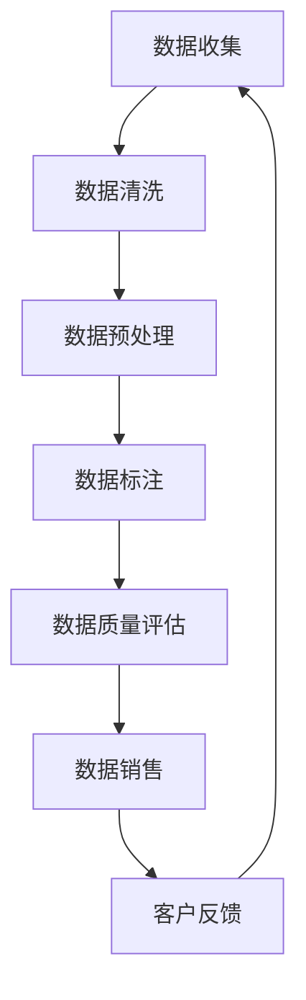

                 

关键词：数据集构建、数据销售、行业应用、机器学习、人工智能、数据质量、隐私保护

摘要：随着人工智能技术的迅猛发展，行业特定数据集的构建与销售成为了推动技术进步的重要环节。本文将探讨如何高效构建高质量的数据集，并介绍其在机器学习、人工智能等领域的应用，同时讨论数据隐私保护的重要性以及未来发展趋势。

## 1. 背景介绍

在当今数字化时代，数据已经成为企业和社会发展的核心资产。特别是行业特定数据集，它们是机器学习和人工智能算法训练的重要资源。行业特定数据集的构建不仅要求具备高质量的数据，还要确保数据的全面性和代表性。

然而，构建高质量的数据集并非易事。一方面，数据源可能分散且格式各异，需要有效的数据清洗和预处理方法；另一方面，数据质量和隐私问题也需要得到妥善处理。此外，行业特定数据集的销售模式也在不断演化，为数据的流通和共享提供了新的机会。

## 2. 核心概念与联系

为了更好地理解行业特定数据集的构建与销售，我们首先需要了解以下几个核心概念：

### 2.1 数据集构建

数据集构建包括数据收集、清洗、预处理和标注等步骤。数据收集可以从公开数据源、企业内部数据库或第三方数据提供商获取。数据清洗涉及去除重复、缺失和异常数据，预处理则包括格式转换、标准化和特征提取等。标注是指对数据进行分类、标注标签，以便后续算法训练。

### 2.2 数据质量

数据质量是数据集构建的关键因素。高质量的数据集应具备完整性、准确性、一致性和时效性。数据质量问题直接影响机器学习模型的性能和可靠性。

### 2.3 数据隐私

数据隐私是保护个人和企业信息不受未授权访问和滥用的一系列措施。在数据集构建与销售过程中，隐私保护尤为重要，需要采用数据脱敏、加密和访问控制等技术手段。

### 2.4 数据销售

数据销售是指数据集的生产者和消费者之间通过市场化方式交换数据资源。数据销售模式包括数据共享平台、数据交易市场和定制化数据服务等。

接下来，我们将使用Mermaid流程图展示行业特定数据集构建与销售的基本架构。



## 3. 核心算法原理 & 具体操作步骤

### 3.1 算法原理概述

在数据集构建过程中，常用的算法包括数据清洗算法、数据预处理算法和特征提取算法。以下是这些算法的基本原理：

### 3.2 算法步骤详解

#### 3.2.1 数据清洗

数据清洗主要包括以下步骤：

1. 数据验证：检查数据是否满足预期格式和范围。
2. 去除重复记录：通过比对数据项，删除重复的记录。
3. 填补缺失值：采用均值、中位数或插值等方法填补缺失数据。
4. 处理异常值：识别并处理异常数据，如去除或修正错误值。

#### 3.2.2 数据预处理

数据预处理主要包括以下步骤：

1. 数据转换：将不同格式或单位的数据转换为统一格式。
2. 数据标准化：通过缩放或平移，使得数据集的特征值分布更为均匀。
3. 特征提取：从原始数据中提取对模型训练有帮助的特征。

#### 3.2.3 特征提取

特征提取主要包括以下方法：

1. 统计特征：如均值、方差、相关性等。
2. 离散特征：如分类、二值化等。
3. 非线性特征：如核函数、主成分分析等。

### 3.3 算法优缺点

不同算法在数据集构建过程中具有不同的优缺点：

- **数据清洗算法**：优点在于可以快速处理大量数据，缺点是需要大量人力和时间进行标注。
- **数据预处理算法**：优点在于可以提升数据集的质量和一致性，缺点是可能会损失一些原始信息。
- **特征提取算法**：优点在于可以提取出对模型训练有帮助的特征，缺点是可能增加计算复杂度。

### 3.4 算法应用领域

这些算法在机器学习、人工智能等领域的应用非常广泛，特别是在图像识别、自然语言处理、推荐系统和金融风控等领域。

## 4. 数学模型和公式 & 详细讲解 & 举例说明

### 4.1 数学模型构建

在数据集构建过程中，我们常常使用以下数学模型：

1. **线性回归模型**：用于预测连续数值。
   $$ y = \beta_0 + \beta_1 x $$
2. **逻辑回归模型**：用于预测二分类结果。
   $$ P(y=1) = \frac{1}{1 + e^{-(\beta_0 + \beta_1 x)}} $$
3. **支持向量机模型**：用于分类问题。
   $$ w \cdot x + b = 0 $$

### 4.2 公式推导过程

以线性回归模型为例，其公式推导过程如下：

假设我们有一个训练数据集 $\{x_i, y_i\}$，其中 $x_i$ 是输入特征，$y_i$ 是目标变量。线性回归模型的损失函数为：

$$ L(\theta) = \frac{1}{2} \sum_{i=1}^{n} (y_i - \theta^T x_i)^2 $$

其中，$\theta$ 是模型参数，$n$ 是数据集大小。为了求解最优参数 $\theta$，我们可以使用梯度下降法：

$$ \theta = \theta - \alpha \frac{\partial L(\theta)}{\partial \theta} $$

其中，$\alpha$ 是学习率。通过多次迭代，我们可以得到最优参数 $\theta$。

### 4.3 案例分析与讲解

假设我们有一个房屋价格预测问题，数据集包含房屋的面积、卧室数量和位置等特征。我们可以使用线性回归模型进行预测。

1. **数据预处理**：将数据集分为训练集和测试集，并进行特征提取和标准化处理。
2. **模型训练**：使用训练集数据训练线性回归模型，得到最优参数 $\theta$。
3. **模型评估**：使用测试集数据评估模型性能，计算均方误差（MSE）。
4. **模型应用**：使用训练好的模型预测新房屋的价格。

## 5. 项目实践：代码实例和详细解释说明

### 5.1 开发环境搭建

为了保证代码的可复现性，我们使用 Python 作为编程语言，结合 Scikit-learn 和 Pandas 等库进行数据集构建和模型训练。

### 5.2 源代码详细实现

以下是数据集构建和模型训练的代码实现：

```python
import pandas as pd
from sklearn.model_selection import train_test_split
from sklearn.linear_model import LinearRegression
from sklearn.metrics import mean_squared_error

# 读取数据集
data = pd.read_csv('house_data.csv')

# 数据预处理
X = data[['area', 'bedrooms']]
y = data['price']
X_train, X_test, y_train, y_test = train_test_split(X, y, test_size=0.2, random_state=42)

# 特征标准化
from sklearn.preprocessing import StandardScaler
scaler = StandardScaler()
X_train_scaled = scaler.fit_transform(X_train)
X_test_scaled = scaler.transform(X_test)

# 模型训练
model = LinearRegression()
model.fit(X_train_scaled, y_train)

# 模型评估
y_pred = model.predict(X_test_scaled)
mse = mean_squared_error(y_test, y_pred)
print(f'MSE: {mse}')

# 模型应用
new_house = pd.DataFrame([[1500, 3]], columns=['area', 'bedrooms'])
new_house_scaled = scaler.transform(new_house)
predicted_price = model.predict(new_house_scaled)
print(f'Predicted Price: {predicted_price[0]}')
```

### 5.3 代码解读与分析

以上代码分为以下几个步骤：

1. **数据读取**：使用 Pandas 读取房屋数据集。
2. **数据预处理**：将数据集分为特征和目标变量，并划分训练集和测试集。
3. **特征标准化**：使用 StandardScaler 对特征进行标准化处理。
4. **模型训练**：使用 LinearRegression 模型进行训练。
5. **模型评估**：计算均方误差（MSE）评估模型性能。
6. **模型应用**：使用训练好的模型预测新房屋的价格。

## 6. 实际应用场景

### 6.1 机器学习

在机器学习领域，行业特定数据集主要用于模型训练和评估。例如，在医疗领域，可以用于诊断疾病、预测患者康复情况和优化治疗方案。在金融领域，可以用于信用评分、风险控制和投资决策等。

### 6.2 人工智能

在人工智能领域，行业特定数据集可以用于图像识别、自然语言处理和自动驾驶等任务。例如，在自动驾驶领域，需要大量道路数据集进行训练，以便车辆能够识别道路标志、行人和其他车辆。

### 6.3 数据挖掘

在数据挖掘领域，行业特定数据集可以用于发现潜在规律和趋势。例如，在电商领域，可以分析用户行为数据，发现购买偏好和推荐商品。

## 7. 工具和资源推荐

### 7.1 学习资源推荐

- 《机器学习》（周志华 著）：详细介绍了机器学习的基本概念和方法。
- 《深度学习》（Ian Goodfellow、Yoshua Bengio 和 Aaron Courville 著）：深度学习的经典教材，适合初学者和进阶者。

### 7.2 开发工具推荐

- Jupyter Notebook：适合数据分析和模型训练的交互式开发环境。
- TensorFlow 和 PyTorch：深度学习框架，适合构建和训练复杂的神经网络模型。

### 7.3 相关论文推荐

- "Deep Learning for Computer Vision"（Rui Shu et al.）：介绍深度学习在计算机视觉领域的应用。
- "Recurrent Neural Networks for Language Modeling"（Yoshua Bengio et al.）：介绍循环神经网络在自然语言处理领域的应用。

## 8. 总结：未来发展趋势与挑战

### 8.1 研究成果总结

近年来，行业特定数据集的构建与销售取得了显著进展。一方面，数据集质量和多样性的提升有助于提高机器学习模型的性能。另一方面，数据销售模式的创新为数据资源的共享和流通提供了新的渠道。

### 8.2 未来发展趋势

未来，行业特定数据集的构建与销售将朝着以下几个方向发展：

1. 数据集质量和多样性进一步提升，以满足更多复杂应用的需求。
2. 开放式数据集和私有数据集的融合，为跨领域的应用提供更丰富的数据资源。
3. 数据隐私保护技术的进步，确保数据在流通和使用过程中的安全性。

### 8.3 面临的挑战

尽管行业特定数据集的构建与销售取得了显著进展，但仍面临以下挑战：

1. 数据质量和隐私保护：确保数据集的高质量和隐私保护是构建高质量数据集的关键。
2. 数据流通和共享：如何建立有效的数据流通和共享机制，促进数据资源的利用。
3. 数据集构建成本：构建高质量的数据集需要大量人力和物力投入。

### 8.4 研究展望

未来，我们应关注以下几个方面的研究：

1. 数据集构建与销售模式的创新，探索更多高效的构建方法和销售渠道。
2. 数据隐私保护技术的进步，研究更安全、更可靠的数据隐私保护方法。
3. 跨领域数据集的融合与应用，推动跨领域的创新和进步。

## 9. 附录：常见问题与解答

### 9.1 如何获取行业特定数据集？

可以通过以下途径获取行业特定数据集：

1. 公开数据集：如 KEG 实验室、Kaggle 等数据集平台。
2. 企业内部数据：如企业数据库、客户数据等。
3. 第三方数据提供商：如 DataQuest、AlphaQuery 等数据平台。

### 9.2 如何保证数据质量？

确保数据质量的方法包括：

1. 数据源筛选：选择可靠、权威的数据源。
2. 数据清洗：去除重复、缺失和异常数据。
3. 数据预处理：进行数据转换、标准化和特征提取等操作。
4. 数据标注：对数据进行分类、标注标签。

### 9.3 如何保护数据隐私？

保护数据隐私的方法包括：

1. 数据脱敏：去除或加密敏感信息，如身份证号、电话号码等。
2. 数据加密：使用加密算法保护数据在传输和存储过程中的安全性。
3. 访问控制：限制对数据的访问权限，确保只有授权用户可以访问数据。

---

作者：禅与计算机程序设计艺术 / Zen and the Art of Computer Programming

